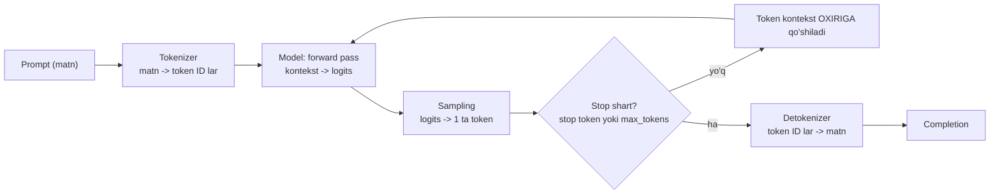
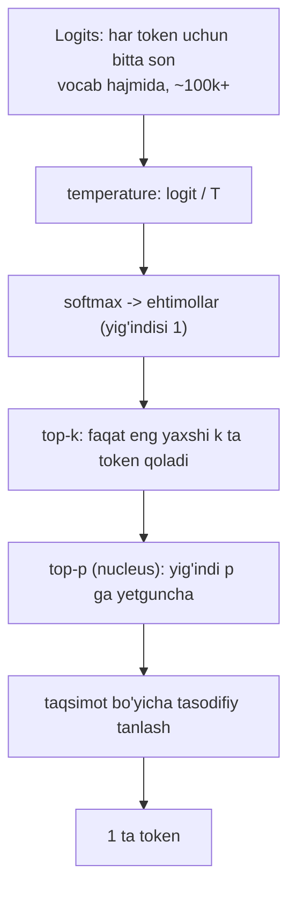

# 01. LLM dasturchi ko'zi bilan

LLM bilan ishlashda hisob-kitobingiz **token**da yuritiladi: narx ham, latency ham, context window limiti ham. Agar modelning ichida nima bo'layotganini bilmasangiz, "nega bir xil prompt ikki xil javob berdi", "nega o'zbekcha matn 2 barobar qimmatga tushdi", "nega model mavjud bo'lmagan kutubxona funksiyasini o'ylab topdi" degan savollarga javob topa olmaysiz — va bu savollar production'da ham, ish suhbatida ham birinchi bo'lib chiqadi.

Bu darsda modelni "sehrli aqlli suhbatdosh" sifatida emas, **text completion engine** sifatida ko'rishni o'rganamiz. Bu mental model butun kursning poydevori: keyingi hamma texnika (prompt engineering, tool use, RAG, agent) shundan kelib chiqadi.

---

## Nazariya (~30%)

### 1. LLM nima qiladi: bitta jumlada

> LLM — bu **matnni davom ettiruvchi mashina**. U "aqlli odam bu savolga qanday javob berardi" degan savolga emas, **"shu matn bilan boshlanadigan hujjat statistik jihatdan qanday davom etardi"** degan savolga javob beradi.

Model treningda ulkan hujjatlar to'plamini ko'rgan va ularni **mimic** qilishni o'rgangan. Chiqishini bashorat qilmoqchi bo'lsangiz, o'zingizga shuni ayting: "Internetda shu prompt bilan boshlanadigan hujjat bo'lsa, uning davomida nima yozilgan bo'lardi?"

Backend tilida aytganda, model — bu **stateless pure function**:

```
f(token_list) -> keyingi token uchun ehtimollar taqsimoti
```

Hech qanday session yo'q, hech qanday "esda saqlash" yo'q. Suhbat tarixini har so'rovda **siz** yuborasiz — xuddi session'siz REST API'da har request'da butun state'ni payload sifatida yuborgandek.

### 2. Tokenizatsiya: model harflarni ko'rmaydi

Model matnni belgi-belgi o'qimaydi. Avval **tokenizer** matnni token ID'lar ketma-ketligiga aylantiradi. Tokenizer — **deterministik** algoritm (bir xil matn -> doim bir xil tokenlar), tez-tez uchraydigan matn bo'laklarini bitta ID ga siqadi. Fikrlash uchun eng yaqin analogiya — **gzip lug'ati** yoki protokol frame'lari: tarmoqdan bayt oqadi, lekin dastur uni "frame" birligida ko'radi.

Amaliy raqamlar:

| Matn turi | Taxminan | Izoh |
|---|---|---|
| Inglizcha matn | ~4 belgi = 1 token | tokenizer aynan shunga optimallashtirilgan |
| O'zbekcha / turkiy tillar | ~2 belgi = 1 token | so'zlar bo'laklarga parchalanadi -> **2x ko'p token** |
| Raqamlar | ~2 belgi = 1 token | `1234567` bir necha tokenga bo'linadi |
| Random string / UUID / hash | 1 belgi = 1 token ga yaqin | eng qimmat kontent |

Nega bu muhim:

1. **Narx** — hisob per-token. O'zbekcha prompt bir xil ma'noda inglizchadan ~2x qimmatroq.
2. **Latency** — o'qish ham, yozish ham token soniga chiziqli bog'liq.
3. **Context window** — limit tokenda o'lchanadi, belgida emas.
4. **Subtoken vazifalar qiyin** — model `strawberry` so'zini `straw` + `berry` deb ko'radi, harflarni emas. "Nechta R bor?" degan savol modelning ko'zi ojiz bo'lgan darajada beriladi. Xuddi shunday: so'zni teskari yozish, harf sanash, akrostix. **Yechim: bunday ishni modelga bermang — pre/post-processing'da oddiy kod bilan qiling.**

Yana bir nozik joy: **katta harflar token chegarasini buzadi**. `gone` = 1 token, `GONE` = 2 token. Ya'ni CAPS bilan yozilgan prompt modelga qo'shimcha yuk beradi.

### 3. Context window va autoregressiya

**Context window** — modelning bitta forward pass'da ko'radigan hamma narsasi: system prompt + suhbat tarixi + tool ta'riflari + hujjatlar + hozirgi savol. Undan tashqarida model uchun hech narsa mavjud emas.

Generatsiya **autoregressiv**: bir forward pass = **bitta** keyingi token. Keyin bu token kontekst oxiriga qo'shiladi va sikl takrorlanadi.



Bundan ikkita og'riqli oqibat kelib chiqadi:

**a) Backtrack yo'q.** Token chiqdi — qaytarib bo'lmaydi. Model "shoshdim, birinchi jumlani o'chiray" deya olmaydi, chunki treningdagi hujjatlarda odamlar ham kamdan-kam "aytganimni qaytib olaman" deb yozadi. Bu — **append-only log**. Kompensatsiya faqat yangi yozuv qo'shish bilan bo'ladi (model o'zini keyingi jumlada tuzatishga urinishi mumkin, lekin oldingi tokenlar kontekstda qolaveradi va keyingi bashoratlarga ta'sir qiladi).

**b) Pattern trap.** Autoregressiv model o'z pattern'iga tushib qoladi: bir marta ro'yxat boshlagan bo'lsa, ro'yxatni davom ettiraveradi; bir marta xato faktni aytgan bo'lsa, keyingi jumlalarda uni **oqlaydi** (Huyen buni *snowballing* / self-delusion deb ataydi). Model o'zi yozgan matnni "berilgan fakt" dan ajrata olmaydi.

> Lakmus testi (Berryman): "Barcha kerakli bilimni yoddan biladigan ekspert odam bu promptni **bir o'tishda**, orqaga qaytmasdan, qoralamasiz bajara oladimi?" Agar yo'q bo'lsa — model ham bajara olmaydi. Unga o'ylash uchun joy bering (bu — CoT'ning haqiqiy sababi).

### 4. Sampling: logits -> softmax -> token

Model aslida bitta token tanlamaydi. U **butun vocabulary bo'yicha logit vektor** qaytaradi (~100k+ son). Keyin bu sonlardan bitta token tanlanadi — bu jarayon **sampling**.



- **softmax**: `p_i = e^(x_i) / sum(e^(x_j))` — logitni ehtimolga aylantiradi.
- **temperature (T)**: softmax'dan oldin logit T ga bo'linadi. `T` past -> taqsimot o'tkirlashadi (izchil, zerikarli, deyarli deterministik). `T` yuqori -> yassilashadi (xilma-xil, lekin izchilligi tushadi). `T > 1` da model o'z xatolarini ham mimic qila boshlaydi.
- **top-k**: faqat eng yuqori k ta tokendan tanlaydi (k odatda 50-500).
- **top-p (nucleus)**: ehtimollarni kamayish tartibida qo'shib boradi, yig'indi p ga (odatda 0.9-0.95) yetganda to'xtaydi. Dinamik: "ha/yo'q" savolida 2 ta token, ochiq savolda o'nlab.

> **MUHIM — 2026 haqiqati.** Berryman kitobida `temperature` markaziy o'rinda, Huyen ham unga bir necha sahifa ajratadi. **Claude'ning joriy modellarida (Opus 4.8, Sonnet 5, Haiku 4.5, Fable 5) `temperature`, `top_p`, `top_k` parametrlari OLIB TASHLANGAN — yuborsangiz 400 xatosi olasiz.** Modelning xulqi endi **prompt** va **effort** bilan boshqariladi:
> `thinking={"type": "adaptive"}` + `output_config={"effort": "low" | "medium" | "high" | "xhigh" | "max"}`.
>
> Sampling nazariyasini baribir bilish shart, chunki: (a) OpenAI-compatible API'larda va lokal modellarda (vLLM, Ollama) bu parametrlar ishlaydi; (b) constrained decoding (4-dars) aynan logit darajasida ishlaydi; (c) modelning **nomuvofiqligi** (bir xil input -> turli output) shu mexanizmdan kelib chiqadi, va siz uni o'chira olmaysiz.

Amaliy xulosa: **Claude javobi deterministik emas.** Cache, idempotency va test yozishda buni hisobga oling.

### 5. Hallucination va truth bias

Model **doim taxmin qiladi**. U google qila olmaydi, "bilmayman" deyish uchun ichki "bilmaslik detektori" yo'q. Hallucination model nuqtai nazaridan boshqa har qanday completion'dan farq qilmaydi — shuning uchun promptga "Don't make stuff up" deb yozish deyarli foydasiz.

**Truth bias** — model kontekstdagi hamma narsani **haqiqat** deb qabul qiladi. Hujjatlar odatda o'zini yarim yo'lda tuzatmaydi, model esa hujjatni mimic qiladi.

| Truth bias — foydali tomoni | Truth bias — xavfli tomoni |
|---|---|
| Make-believe prompt ishlaydi: "Hozir 2031-yil, X chiqqaniga bir yil bo'ldi..." -> model shu dunyoda yozadi | Programmatik yig'ilgan promptga xato/bo'sh/bema'ni element tushsa, model uni **tuzatmaydi** — shu asosda ishonch bilan javob quradi |
| RAG'da: berilgan hujjatga tayanadi | RAG'da: **noto'g'ri** snippet olingan bo'lsa, model uni ham ishonch bilan ishlatadi (Chekhov's gun: kontekstga qo'yilgan har narsa "otiladi") |

Amaliy antidot (Berryman): "Trust but verify, minus the trust" — modeldan **tekshirsa bo'ladigan** narsa so'rang: manba, link, hisob-kitob qadamlari, kalit so'zlar. Keyin kod bilan tekshiring.

### 6. Nega prompt tartibi muhim (attention intuitsiyasi, qisqacha)

Har token ustida bir "minibrain" ishlaydi (Berryman metaforasi), va **axborot faqat chapdan o'ngga oqadi** (causal masking). Ya'ni: matn boshidagi tokenlar keyingisini ko'rmaydi.

Ikki amaliy oqibat:

1. **Topshiriqni oldin qo'ying.** Agar uzun matnni bersangiz-u savolni oxirida bersangiz, model matnni o'qiyotganda nimani qidirish kerakligini bilmagan bo'ladi. (Uzun kontekstda esa savolni **oxirida ham** takrorlash foyda beradi — 6-darsda "sandwich" texnikasi.)
2. **CoT (chain of thought) shuning uchun ishlaydi.** Modelda ichki monolog yo'q: qatlamlar soni cheklangan, va yuqori qatlam natijasini "pastga qaytarishning" yagona yo'li — **token chiqarish**. Ya'ni model faqat *yozib* o'ylay oladi. Claude'dagi `thinking` bloki — aynan shu g'oyaning API darajasidagi ko'rinishi.

---

## Amaliyot (~70%)

### Tayyorgarlik

```bash
python -m venv .venv && source .venv/bin/activate
pip install anthropic python-dotenv
```

`.env` fayl (repoga **commit qilinmaydi**):

```
ANTHROPIC_API_KEY=sk-ant-...
```

Har misol mustaqil ishga tushadigan fayl. Boshida doim:

```python
from dotenv import load_dotenv
import anthropic

load_dotenv()
client = anthropic.Anthropic()   # kalit ANTHROPIC_API_KEY env'dan olinadi
```

---

### Predict / Run

#### 1-misol. O'zbekcha matn qancha qimmatga tushadi?

Ishga tushirishdan **oldin bashorat qiling**: bir xil ma'nodagi inglizcha va o'zbekcha jumla uchun token soni nisbati qanday bo'ladi? 1:1? 1:1.5? 1:2?

```python
# 01_count_tokens.py
from dotenv import load_dotenv
import anthropic

load_dotenv()
client = anthropic.Anthropic()

MODEL = "claude-opus-4-8"

texts = {
    "EN": "The server returned a 500 error because the database connection pool was exhausted.",
    "UZ": "Server 500 xatosini qaytardi, chunki ma'lumotlar bazasi connection pool'i tugab qolgan edi.",
    "RAQAM": "1234567890 9876543210 4815162342",
    "UUID": "3f2b8c1e-9d44-4a7f-bc10-6e2a5f0d9b31",
}

for name, text in texts.items():
    res = client.messages.count_tokens(
        model=MODEL,
        messages=[{"role": "user", "content": text}],
    )
    n = res.input_tokens
    print(f"{name:6} | belgi: {len(text):3} | token: {n:3} | belgi/token: {len(text)/n:.2f}")

# Output (taxminan; sizda 1-2 tokenga farq qilishi mumkin):
# EN     | belgi:  87 | token:  25 | belgi/token: 3.48
# UZ     | belgi:  96 | token:  42 | belgi/token: 2.29
# RAQAM  | belgi:  33 | token:  20 | belgi/token: 1.65
# UUID   | belgi:  36 | token:  26 | belgi/token: 1.38
```

Xulosa: bir xil ma'no, **~1.7x ko'proq token** -> ~1.7x qimmat va ~1.7x sekinroq. Bu yerda `count_tokens` message strukturasi uchun ham bir necha token qo'shadi — shuning uchun nisbatga qarang, absolyut songa emas.

> `tiktoken` **ishlatilmaydi** — u OpenAI tokenizeri va Claude'da 15-20% xato beradi. Faqat `client.messages.count_tokens()`.

#### 2-misol. Birinchi so'rov va `usage`

```python
# 02_usage.py
from dotenv import load_dotenv
import anthropic

load_dotenv()
client = anthropic.Anthropic()

resp = client.messages.create(
    model="claude-opus-4-8",
    max_tokens=300,
    system="Sen backend dasturchisan. Qisqa va aniq javob ber.",
    messages=[{"role": "user", "content": "Idempotency key nima uchun kerak? 2 jumlada."}],
)

for block in resp.content:          # content — bloklar RO'YXATI, string emas
    if block.type == "text":
        print(block.text)

print("---")
print("stop_reason :", resp.stop_reason)     # end_turn | max_tokens | ...
print("input       :", resp.usage.input_tokens)
print("output      :", resp.usage.output_tokens)

# Output (taxminan):
# Idempotency key bir xil so'rov bir necha marta yuborilganda (retry, tarmoq uzilishi)
# amal faqat BIR marta bajarilishini kafolatlaydi. Server kalitni saqlaydi va
# takroriy so'rovda yangi amal bajarmasdan oldingi natijani qaytaradi.
# ---
# stop_reason : end_turn
# input       : 42
# output      : 61
```

Diqqat: `resp.content` — **bloklar ro'yxati**. `resp.content[0].text` deb yozish qisqa yo'l, lekin thinking yoki tool use yoqilganda birinchi blok `text` bo'lmasligi mumkin. Har doim blok turini tekshiring.

#### 3-misol. Bir xil prompt, uch xil javob

Bashorat qiling: `temperature` yo'q ekan, uchta javob **bir xil** chiqadimi?

```python
# 03_inconsistency.py
from dotenv import load_dotenv
import anthropic

load_dotenv()
client = anthropic.Anthropic()

PROMPT = "Distributed tizim uchun bitta original metafora o'ylab top. Faqat metaforani yoz, 1 jumla."

for i in range(3):
    resp = client.messages.create(
        model="claude-opus-4-8",
        max_tokens=100,
        messages=[{"role": "user", "content": PROMPT}],
    )
    print(f"{i+1}) {resp.content[0].text.strip()}")

# Output (har ishga tushirishda boshqacha):
# 1) Distributed tizim — bu bir-birini ko'rmaydigan, faqat xat orqali kelishadigan orkestr.
# 2) Distributed tizim — har biri o'z soatiga ishonadigan qorovullar smenasi.
# 3) Distributed tizim — bir-biriga qichqirib gaplashadigan, ba'zan eshitmaydigan qo'shnilar.
```

Model **probabilistik**. Sampling parametrlari yopiq bo'lsa ham, javob deterministik emas. Bu — arxitektura darajasidagi haqiqat: LLM javobini keshlash kerak bo'lsa, **siz** keshlaysiz (prompt hash -> javob), API sizga determinizm bermaydi.

#### 4-misol. `effort`: temperature'ning o'rnini nima bosdi

```python
# 04_effort.py
import time
from dotenv import load_dotenv
import anthropic

load_dotenv()
client = anthropic.Anthropic()

PROMPT = (
    "Bizda 3 ta servis bor: A -> B -> C zanjiri. C sekinlashsa butun zanjir yiqiladi. "
    "Qanday himoya qatlamlarini qo'yasan? Ro'yxat ko'rinishida."
)

for effort in ["low", "high"]:
    t0 = time.time()
    resp = client.messages.create(
        model="claude-opus-4-8",
        max_tokens=2000,
        messages=[{"role": "user", "content": PROMPT}],
        thinking={"type": "adaptive"},
        output_config={"effort": effort},
    )
    dt = time.time() - t0

    thinking_chars = sum(len(b.thinking) for b in resp.content if b.type == "thinking")
    answer = "".join(b.text for b in resp.content if b.type == "text")

    print(f"[effort={effort}] {dt:.1f}s | output tokens: {resp.usage.output_tokens} "
          f"| thinking belgilari: {thinking_chars}")
    print(answer[:160].replace("\n", " "), "...\n")

# Output (taxminan):
# [effort=low] 4.2s | output tokens: 310 | thinking belgilari: 0
# Circuit breaker, timeout, retry (backoff bilan), bulkhead, fallback javob. ...
#
# [effort=high] 19.8s | output tokens: 1420 | thinking belgilari: 2900
# Muammoni ikki qatlamga bo'lamiz: (1) chaqiruvchi tomon himoyasi, (2) C ning o'zini himoya qilish. ...
```

Bu — 2026-dagi asosiy tuzoq: `effort` ni "high" ga qo'yish **latency va narxni bir necha barobar oshiradi**. Production'da default `low`/`medium`, faqat murakkab qadamlarda `high`.

> **QAT'IY TAQIQ:** `thinking={"type": "enabled", "budget_tokens": 5000}` — bu eski API, joriy modellarda **400 xato**. Faqat `{"type": "adaptive"}` + `output_config.effort`.

#### 5-misol. Truth bias / hallucination demo

Bashorat qiling: mavjud bo'lmagan kutubxona haqida so'rasangiz, model nima qiladi — "bilmayman" deydimi yoki to'qiydimi?

```python
# 05_truth_bias.py
from dotenv import load_dotenv
import anthropic

load_dotenv()
client = anthropic.Anthropic()

# "flaskrate" — mavjud bo'lmagan kutubxona. Prompt uni MAVJUD deb taqdim etadi.
PROMPT = (
    "Python'ning `flaskrate` kutubxonasidagi `RateLimiter` klassining "
    "`burst_window` parametri nima qiladi? Qisqacha kod misoli bilan tushuntir."
)

resp = client.messages.create(
    model="claude-opus-4-8",
    max_tokens=400,
    messages=[{"role": "user", "content": PROMPT}],
)
print(resp.content[0].text)

# Output (ehtimoliy — model to'qiydi yoki qisman to'qiydi):
# `burst_window` — bu qisqa muddatli portlash (burst) oynasi. U sekundlarda beriladi
# va shu oyna ichida limitdan oshiq so'rovlarga ruxsat beradi...
#
# from flaskrate import RateLimiter
# limiter = RateLimiter(rate=100, burst_window=5)
# ...
```

Model **savolning o'zidagi taxminni haqiqat deb qabul qildi** (truth bias) va "boshqa rate limiter kutubxonalari qanday yozilgan bo'lsa" shunga o'xshash hujjat generatsiya qildi. Bu — hallucination emas, **normal ishlash**: u hujjatni davom ettirdi.

---

### Investigate / Modify

Har mashqda: **avval nima bo'lishini yozing, keyin ishga tushiring, farqni tushuntiring.**

**M1. Katta harf soliqni oshiradi.**
`01_count_tokens.py` ga qo'shing:
```python
texts["lower"] = "the connection pool was exhausted"
texts["UPPER"] = "THE CONNECTION POOL WAS EXHAUSTED"
```
Token soni qanchaga oshdi? Nega? (Javob: tokenizer katta harfli variantni kam ko'rgan -> so'zlar bo'laklarga sinadi.)

**M2. Subtoken vazifasi.**
Modelga yuboring: `"strawberry so'zida nechta 'r' harfi bor? Faqat sonni yoz."` So'ng shu savolni **effort=high** bilan qayta yuboring. Farq bormi? Nega high yordam berishi mumkin? (Ipucha: model o'ylash paytida so'zni harflab **yozib** chiqadi — ya'ni muammoni token darajasiga ko'taradi.) Endi savolni o'zgartiring: `"s-t-r-a-w-b-e-r-r-y da nechta r bor?"` — nega bu variant osonroq?

**M3. Taqiqlangan parametr.**
`02_usage.py` dagi `messages.create()` ga `temperature=0.7` qo'shing va ishga tushiring. Qanday xato keladi? Xato **kodi** nechchi? (Bu 400 — retry qilish **mumkin emas**, keyingi darsda ko'ramiz.) Endi uni olib tashlab, o'rniga `output_config={"effort": "low"}` qo'ying.

**M4. Truth bias'ni sindirish.**
`05_truth_bias.py` ga system prompt qo'shing:
```python
system=(
    "Kutubxona yoki API haqida savol berilsa: agar uning mavjudligiga 100% ishonching "
    "bo'lmasa, avval shuni ochiq ayt va PyPI'dagi aniq nomini so'ra. "
    "Kod misolini faqat mavjudligiga ishonching komil bo'lsa yoz."
)
```
Endi model nima deydi? Nega "Don't make stuff up" ishlamaydi-yu, bu ishlaydi? (Ipucha: birinchisi mavhum taqiq, ikkinchisi — **tekshiriladigan xulq-atvor qoidasi** va model uchun aniq alternativa yo'li.)

**M5. Pattern trap.**
Modelga yuboring: `"Sana: 2024-01-01\nSana: 2024-01-02\nSana: 2024-01-03\nSana:"` va `max_tokens=200`. Model qachon to'xtaydi? Nega u "bu ro'yxat tugadi" deb qaror qila olmaydi? Bu — autoregressiv pattern trap.

---

### Make

**Vazifa: `token_cost.py` — so'rov narxini oldindan hisoblovchi util.**

Talablar:

1. `estimate_cost(system, messages, model, expected_output_tokens)` funksiyasi:
   - `client.messages.count_tokens()` bilan **input** tokenlarni sanaydi;
   - narx jadvali bo'yicha dollarni hisoblaydi;
   - `{"input_tokens": ..., "input_usd": ..., "output_usd": ..., "total_usd": ...}` qaytaradi.
2. Narx jadvali (1M token uchun):

| Model | Input $/1M | Output $/1M |
|---|---|---|
| `claude-opus-4-8` | 5 | 25 |
| `claude-sonnet-5` | 3 | 15 |
| `claude-haiku-4-5` | 1 | 5 |

3. Bir xil promptni Opus va Haiku uchun hisoblab, **necha barobar** farq borligini chop eting.
4. Bonus: bir xil ma'nodagi inglizcha va o'zbekcha promptni solishtiring va "til soliqi"ni foizda ko'rsating.

<details>
<summary>Yechim</summary>

```python
# token_cost.py
from dotenv import load_dotenv
import anthropic

load_dotenv()
client = anthropic.Anthropic()

PRICES = {  # $ / 1M token
    "claude-opus-4-8":  {"in": 5.0,  "out": 25.0},
    "claude-sonnet-5":  {"in": 3.0,  "out": 15.0},
    "claude-haiku-4-5": {"in": 1.0,  "out": 5.0},
}


def estimate_cost(system, messages, model, expected_output_tokens):
    res = client.messages.count_tokens(model=model, system=system, messages=messages)
    n_in = res.input_tokens
    p = PRICES[model]
    input_usd = n_in / 1_000_000 * p["in"]
    output_usd = expected_output_tokens / 1_000_000 * p["out"]
    return {
        "model": model,
        "input_tokens": n_in,
        "input_usd": input_usd,
        "output_usd": output_usd,
        "total_usd": input_usd + output_usd,
    }


SYSTEM = "Sen tajribali backend dasturchisan."
MSGS = [{"role": "user", "content": "Circuit breaker pattern'ini Go'da qanday qo'yasan?"}]

rows = [estimate_cost(SYSTEM, MSGS, m, 800) for m in PRICES]
for r in rows:
    print(f"{r['model']:18} | in={r['input_tokens']:4} tok | total=${r['total_usd']:.5f}")

opus = next(r for r in rows if r["model"] == "claude-opus-4-8")
haiku = next(r for r in rows if r["model"] == "claude-haiku-4-5")
print(f"\nOpus / Haiku narx nisbati: {opus['total_usd'] / haiku['total_usd']:.1f}x")

# --- Bonus: til soliqi ---
en = client.messages.count_tokens(
    model="claude-opus-4-8",
    messages=[{"role": "user", "content":
               "Explain how a circuit breaker protects a service from a slow dependency."}],
).input_tokens
uz = client.messages.count_tokens(
    model="claude-opus-4-8",
    messages=[{"role": "user", "content":
               "Circuit breaker sekin ishlaydigan bog'liqlikdan servisni qanday himoya qilishini tushuntir."}],
).input_tokens
print(f"EN={en} tok, UZ={uz} tok -> til soliqi: +{(uz/en - 1) * 100:.0f}%")

# Output (taxminan):
# claude-opus-4-8    | in=  32 tok | total=$0.02016
# claude-sonnet-5    | in=  32 tok | total=$0.01210
# claude-haiku-4-5   | in=  32 tok | total=$0.00403
#
# Opus / Haiku narx nisbati: 5.0x
# EN=18 tok, UZ=31 tok -> til soliqi: +72%
```

**Nima o'rgandik:** narxni chaqirishdan **oldin** bilish mumkin — bu keyingi darsdagi pre-flight budget check va model routing uchun poydevor. Diqqat: `expected_output_tokens` — taxmin; haqiqiy sonni faqat `resp.usage.output_tokens` beradi.

</details>

---

## Retrieval practice

1. "LLM = text completion engine" mental modeli bilan "LLM = aqlli assistant" mental modeli qaysi konkret holatda **turli** bashorat beradi? Bitta misol keltiring.
2. O'zbekcha prompt inglizchadan qimmatroq — bu faktning uchta amaliy oqibatini ayting (narx, latency va yana bittasi).
3. Nega model "strawberry'da nechta R bor?" savolida adashadi, lekin "s-t-r-a-w-b-e-r-r-y" ko'rinishida bersangiz to'g'ri javob beradi?
4. `temperature=0.2` yuborsangiz Claude Opus 4.8 nima qiladi? Buni retry qilish kerakmi? O'rniga nima ishlatiladi?
5. Truth bias qanday qilib bir vaqtda ham foydali, ham xavfli bo'la oladi? RAG tizimida u qaysi tomonini ko'rsatadi?
6. CoT (chain of thought) nega ishlaydi? Javobingizda "modelda ichki monolog yo'q" iborasini tushuntirib bering.

---

## Manbalar

- **Berryman & Ziegler, "Prompt Engineering for LLMs" (O'Reilly, 2024)** — Ch1 (tarix: Markov -> RNN -> attention -> Transformer -> GPT), Ch2 (Understanding LLMs: tokenizatsiya, autoregressiya, temperature, minibrain/attention, truth bias).
- **Chip Huyen, "AI Engineering" (O'Reilly, 2025)** — Ch2 (Sampling: logits, softmax, temperature/top-k/top-p, inconsistency, hallucination — self-delusion va mismatch gipotezalari).
- Anthropic docs — Token counting: https://platform.claude.com/docs/en/docs/build-with-claude/token-counting
- Anthropic docs — Extended thinking va effort: https://platform.claude.com/docs/en/docs/build-with-claude/extended-thinking
- Anthropic docs — Models overview (narx va context window): https://platform.claude.com/docs/en/docs/about-claude/models/overview
- Vaswani et al., "Attention Is All You Need" (2017) — https://arxiv.org/abs/1706.03762
- Wei et al., "Chain-of-Thought Prompting" (2022) — https://arxiv.org/abs/2201.11903

---

Keyingi dars: [02. Claude API — birinchi so'rov](./02.%20Claude%20API%20—%20birinchi%20so'rov.md) — SDK, messages, model tanlash va narx, `stop_reason`, xato turlari, retry va rate limit.
