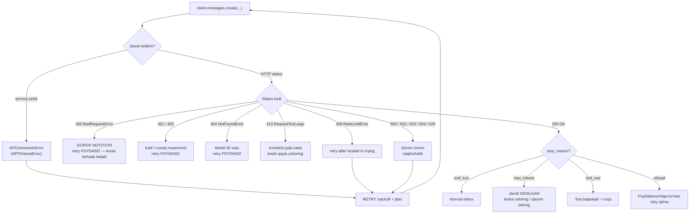

# 02. Claude API — birinchi so'rov

LLM API — bu oddiy HTTP servis, lekin uch jihati bilan siz odatlangan servislardan farq qiladi: u **stateless** (suhbat tarixini siz saqlaysiz), **narxi so'rov hajmiga bog'liq** (har token pul), va **javobi bir necha sabab bilan uzilishi mumkin** (`stop_reason`). Bu uchtasini noto'g'ri tushunish production'da eng ko'p uchraydigan bug'larni beradi: "model tarixni unutdi", "hisob 10 barobar oshdi", "JSON yarim kelib qoldi".

Ish suhbatida bu daraja shunday tekshiriladi: *"429 kelsa nima qilasan? 400 kelsa-chi? Qaysi birini retry qilasan va nega?"* — javobni shu darsda beramiz.

---

## Nazariya (~30%)

### 1. API stateless: hech qanday session yo'q

Har `messages.create()` chaqiruvi — **mustaqil** HTTP so'rov. Serverda sizning suhbatingiz saqlanmaydi. 10-replikali suhbatning 10-savolini yuborayotganda ham, oldingi 9 replikani **butunlay qayta yuborasiz**.

> Backend analogiyasi: bu session'siz REST API. Server hech narsani eslamaydi — butun state har request'da payload ichida keladi. Faqat bu yerda payload **pul turadi**: 10-replikada siz 1-replikani ham qayta to'laysiz.

Bundan to'g'ridan-to'g'ri kelib chiqadi:

- Suhbat uzaygan sari **har bir keyingi so'rov qimmatlashadi** (input tokenlar to'planadi) — o'sish kvadratik.
- Tarixni **siz** boshqarasiz: kesish (truncate), xulosalash (summarize), yoki caching. (Prompt caching bilan bu narxni 10x tushirish mumkin — keyingi bo'limlarda.)
- "Model tarixni unutdi" degan bug bo'lmaydi — **siz tarixni yubormagansiz** degan bug bo'ladi.

### 2. So'rov strukturasi: system + messages

```python
resp = client.messages.create(
    model="claude-opus-4-8",
    max_tokens=1024,
    system="...",                     # top-level parametr, messages ichida EMAS
    messages=[
        {"role": "user", "content": "..."},
        {"role": "assistant", "content": "..."},
        {"role": "user", "content": "..."},
    ],
)
```

Uchta qoida:

1. **`system` — alohida top-level parametr.** `messages` ro'yxatiga `{"role": "system", ...}` qo'shish Claude'da **ishlamaydi** (bu OpenAI uslubi).
2. `messages` **user** bilan boshlanadi va user/assistant navbatma-navbat keladi.
3. `max_tokens` — **majburiy**. Bu "javob shuncha uzun bo'lsin" emas, "shundan oshsa **kes**" degani.

**Nega system message maxsus?** Model ichkarida hamma narsani baribir bitta matn oqimi sifatida ko'radi (Berryman Ch3, ChatML: `<|im_start|>system ... <|im_end|>`). Farqi ikkita: (a) u **birinchi** keladi, ya'ni butun keyingi kontekstga ta'sir qiladi; (b) model post-training paytida **aynan system'ga ko'proq bo'ysunishga** o'rgatilgan (instruction hierarchy: system > user > model output > tool output).

> **Xavfsizlik qoidasi (hozirdanoq odat qiling):** foydalanuvchi matnini **hech qachon** system prompt ichiga qo'ymang. `system=f"Sen yordamchisan. Foydalanuvchi ismi: {name}"` — bu injection eshigi. Foydalanuvchi kontenti doim `user` message'da, iloji bo'lsa XML teg ichida. (8-darsda batafsil.)

### 3. Model tanlash — bu arxitektura qarori

| Model | ID | Context | Max output | Input $/1M | Output $/1M |
|---|---|---|---|---|---|
| Claude Fable 5 | `claude-fable-5` | 1M | 128K | $10 | $50 |
| Claude Opus 4.8 | `claude-opus-4-8` | 1M | 128K | $5 | $25 |
| Claude Sonnet 5 | `claude-sonnet-5` | 1M | 128K | $3 | $15 |
| Claude Haiku 4.5 | `claude-haiku-4-5` | 200K | 64K | $1 | $5 |

- Model ID'ga **sana suffiksi yozilmaydi**: `claude-opus-4-8` (to'g'ri), `claude-opus-4-8-20260115` (xato).
- Kurs standarti: `claude-opus-4-8`, arzon/oddiy qadamlarda `claude-haiku-4-5`.
- Modellar ro'yxatini kodda olish: `client.models.list()`.

> **Production'da yagona model bo'lmaydi.** Bir xil workload'da modellar orasidagi narx farqi 10-50x. To'g'ri arxitektura — **routing**: klassifikatsiya/ekstraksiya/formatlash kabi oddiy qadamlar -> Haiku; murakkab reasoning, kod, ko'p qadamli agent -> Opus. Bu — load balancer'dagi weighted routing bilan bir xil g'oya, faqat mezon = vazifa murakkabligi.

### 4. Javob strukturasi: content bloklari va `stop_reason`

`resp.content` — **bloklar ro'yxati**, string emas. Blok turlari: `text`, `thinking`, `tool_use`.

`resp.stop_reason` — javob **nega** to'xtaganini aytadi, va sizning kodingiz shunga qarab tarmoqlanadi:

| `stop_reason` | Ma'nosi | Siz nima qilasiz |
|---|---|---|
| `end_turn` | Model o'zi tugatdi | Normal yo'l |
| `max_tokens` | **Limitga urildi, javob kesilgan** | `max_tokens` ni oshiring yoki davom ettiring. JSON/kod bu yerda **buziladi** |
| `tool_use` | Model tool chaqirmoqchi | Tool'ni bajarib, natijani qaytarasiz (5-dars) |
| `stop_sequence` | `stop_sequences` dan biri chiqdi | Formatga qarab ishlaysiz |
| `refusal` | Model xavfsizlik sababli rad etdi | Foydalanuvchiga ko'rsating, retry qilmang |

> `stop_reason == "max_tokens"` ni **jimgina o'tkazib yuborish** — eng ko'p uchraydigan production bug'i. JSON kutayotgan bo'lsangiz, yarim kelgan JSON `json.loads()` da yiqiladi va siz uni "model yomon" deb ayblaysiz.

`resp.usage`: `input_tokens`, `output_tokens`, `cache_creation_input_tokens`, `cache_read_input_tokens`. Faturani **shu** belgilaydi.

**`max_tokens > 16000` bo'lsa streaming majburiy** — aks holda SDK xato beradi / HTTP timeout bo'ladi (3-dars).

### 5. Xatolar: qaysi birini retry qilish mumkin



Qoida:

- **Retry qilinadi:** `429`, `500`, `502`, `503`, `504`, `529`, tarmoq/timeout xatolari.
- **Retry QILINMAYDI:** `400` (so'rov noto'g'ri — masalan `temperature` yuborgansiz), `401`, `403`, `404`. Bularni retry qilish = bir xil xatoni takrorlash + rate limit kvotasini behuda yoqish.
- **SDK buni o'zi qiladi:** `anthropic.Anthropic(max_retries=2)` — default 2, exponential backoff + jitter bilan, faqat retry qilinadigan xatolarda. O'zingizning retry qatlamingiz **faqat** maxsus talab bo'lsa kerak (masalan model fallback ladder).

> **Xato turini string bo'yicha tekshirmang** (`if "rate limit" in str(e)`). Typed exception ishlating: `anthropic.RateLimitError` -> `anthropic.APIStatusError` -> `anthropic.APIConnectionError`. `except` tartibi muhim: **aniqrog'i oldin**.

### 6. Rate limit

Uch o'lchov bir vaqtda ishlaydi: **RPM** (requests/min), **ITPM** (input tokens/min), **OTPM** (output tokens/min). Ko'pincha RPM emas, **ITPM** birinchi bo'lib tugaydi — uzun kontekstli so'rovlarda.

429 javobida `retry-after` header keladi (sekundlarda). Production client qatlamlari: pre-flight token estimation -> token bucket -> request coalescing -> fallback ladder (arzonroq/boshqa modelga o'tish) -> backoff.

---

## Amaliyot (~70%)

### Tayyorgarlik

```bash
pip install anthropic python-dotenv
```

`.env`:
```
ANTHROPIC_API_KEY=sk-ant-...
```

---

### Predict / Run

#### 1-misol. To'liq birinchi so'rov (hamma maydonlar bilan)

```python
# 01_first_request.py
from dotenv import load_dotenv
import anthropic

load_dotenv()
client = anthropic.Anthropic()   # max_retries=2 default

resp = client.messages.create(
    model="claude-opus-4-8",
    max_tokens=500,
    system="Sen tajribali Go backend dasturchisisan. Javoblaring qisqa va texnik.",
    messages=[
        {"role": "user", "content": "sync.Mutex va sync.RWMutex qachon farq qiladi?"},
    ],
)

text = "".join(b.text for b in resp.content if b.type == "text")
print(text)

print("\n--- meta ---")
print("model       :", resp.model)
print("stop_reason :", resp.stop_reason)
print("input tok   :", resp.usage.input_tokens)
print("output tok  :", resp.usage.output_tokens)

# Output (taxminan):
# RWMutex ko'p o'qish / kam yozish (read-heavy) yukda foyda beradi: RLock() bir vaqtda
# ko'p goroutine'ga ruxsat beradi. Yozish kam bo'lmasa, RWMutex'ning qo'shimcha
# hisobi (bookkeeping) tufayli oddiy Mutex tezroq chiqadi.
#
# --- meta ---
# model       : claude-opus-4-8
# stop_reason : end_turn
# input tok   : 48
# output tok  : 72
```

#### 2-misol. `stop_reason` ni sindiramiz

Bashorat qiling: `max_tokens=20` bo'lsa nima qaytadi — xatomi, qisqartirilgan javobmi, yoki `None`?

```python
# 02_stop_reason.py
from dotenv import load_dotenv
import anthropic

load_dotenv()
client = anthropic.Anthropic()

resp = client.messages.create(
    model="claude-opus-4-8",
    max_tokens=20,                       # ataylab kichik
    messages=[{"role": "user", "content": "JSON formatida qaytar: {\"til\": ..., \"yil\": ...} Go haqida."}],
)

text = "".join(b.text for b in resp.content if b.type == "text")
print(repr(text))
print("stop_reason:", resp.stop_reason)

# Output:
# '```json\n{\n  "til": "Go",\n  "yil'
# stop_reason: max_tokens
```

Xato **kelmadi**. HTTP 200, `usage` normal, faqat matn yarim. `json.loads()` bu yerda yiqiladi. Shuning uchun:

```python
if resp.stop_reason == "max_tokens":
    raise RuntimeError("Javob kesilgan: max_tokens yetmadi")
```

#### 3-misol. Ko'p turli suhbat — `ConversationManager`

API stateless bo'lgani uchun tarixni **o'zimiz** boshqaramiz.

```python
# 03_conversation.py
from dotenv import load_dotenv
import anthropic

load_dotenv()


class ConversationManager:
    def __init__(self, system: str, model: str = "claude-opus-4-8", max_tokens: int = 800):
        self.client = anthropic.Anthropic()
        self.system = system
        self.model = model
        self.max_tokens = max_tokens
        self.messages: list[dict] = []      # butun state SHU YERDA
        self.total_in = 0
        self.total_out = 0

    def ask(self, user_text: str) -> str:
        self.messages.append({"role": "user", "content": user_text})

        resp = self.client.messages.create(
            model=self.model,
            max_tokens=self.max_tokens,
            system=self.system,
            messages=self.messages,
        )
        if resp.stop_reason == "max_tokens":
            raise RuntimeError("Javob kesilgan — max_tokens ni oshiring")

        # Assistant javobini tarixga BLOK ko'rinishida qaytaramiz (tool use uchun ham to'g'ri ishlaydi)
        self.messages.append({"role": "assistant", "content": resp.content})

        self.total_in += resp.usage.input_tokens
        self.total_out += resp.usage.output_tokens
        return "".join(b.text for b in resp.content if b.type == "text")


conv = ConversationManager(system="Sen backend mentorisan. Qisqa javob ber.")

print("1>", conv.ask("Redis'da cache invalidation'ning eng keng tarqalgan strategiyasi qaysi?"))
print("2>", conv.ask("Uning eng katta kamchiligi nima?"))     # "uning" = oldingi javob
print("3>", conv.ask("Shu kamchilikni Go'da qanday yumshataman?"))

print(f"\nJami: input={conv.total_in} tok, output={conv.total_out} tok")
print(f"Tarixdagi message'lar: {len(conv.messages)}")

# Output (taxminan):
# 1> TTL bilan expiration (lazy invalidation) — eng oddiy va keng tarqalgan...
# 2> Stale data oynasi: TTL tugagunicha eski qiymat beriladi...
# 3> singleflight bilan cache stampede'ni yo'qotib, TTL'ga jitter qo'shing...
#
# Jami: input=612 tok, output=284 tok
# Tarixdagi message'lar: 6
```

Diqqat: `input=612` — bu 3 so'rovning yig'indisi. 1-so'rovda ~40 token, 3-so'rovda esa butun tarix qayta yuborilgan. **Suhbat uzaygan sari input o'sadi.**

#### 4-misol. Xatolarni typed exception bilan tutish

```python
# 04_errors.py
from dotenv import load_dotenv
import anthropic

load_dotenv()
client = anthropic.Anthropic(max_retries=2)   # SDK 429/5xx ni o'zi retry qiladi


def safe_call(**kwargs):
    try:
        return client.messages.create(**kwargs)

    except anthropic.BadRequestError as e:          # 400 — SO'ROV NOTO'G'RI
        print(f"[400] So'rov xato, RETRY FOYDASIZ: {e.message}")
        raise

    except anthropic.AuthenticationError as e:      # 401
        print(f"[401] API kalit muammosi: {e.message}")
        raise

    except anthropic.NotFoundError as e:            # 404 — masalan model ID xato
        print(f"[404] Topilmadi: {e.message}")
        raise

    except anthropic.RateLimitError as e:           # 429 — ANIQROG'I OLDIN keladi
        print(f"[429] Rate limit. retry-after: {e.response.headers.get('retry-after')}")
        raise

    except anthropic.APIStatusError as e:           # qolgan 4xx/5xx (500, 529...)
        print(f"[{e.status_code}] Server xatosi: {e.message}")
        raise

    except anthropic.APIConnectionError as e:       # tarmoq / timeout
        print(f"[conn] Tarmoq xatosi: {e.__cause__}")
        raise


# 1) To'g'ri so'rov
r = safe_call(model="claude-haiku-4-5", max_tokens=50,
              messages=[{"role": "user", "content": "Salom"}])
print("OK:", r.stop_reason)

# 2) Ataylab 400: joriy modellarda temperature YO'Q
try:
    safe_call(model="claude-opus-4-8", max_tokens=50, temperature=0.7,
              messages=[{"role": "user", "content": "Salom"}])
except anthropic.BadRequestError:
    pass

# 3) Ataylab 404: mavjud bo'lmagan model
try:
    safe_call(model="claude-opus-9-9", max_tokens=50,
              messages=[{"role": "user", "content": "Salom"}])
except anthropic.NotFoundError:
    pass

# Output:
# OK: end_turn
# [400] So'rov xato, RETRY FOYDASIZ: temperature: Extra inputs are not permitted
# [404] Topilmadi: model: claude-opus-9-9
```

Ikki muhim nuqta:

1. **`except` tartibi.** `RateLimitError` va `BadRequestError` — `APIStatusError` ning bolalari. Agar `APIStatusError` ni birinchi yozsangiz, qolganlari **hech qachon ishlamaydi**.
2. **String matching qilmang.** `if "rate_limit" in str(e)` — bu API xabari o'zgargan kuni jimgina buziladi.

#### 5-misol. Pre-flight narx tekshiruvi

So'rovni **yuborishdan oldin** qancha turishini bilamiz — bu budget guard uchun asos.

```python
# 05_preflight_cost.py
from dotenv import load_dotenv
import anthropic

load_dotenv()
client = anthropic.Anthropic()

PRICES = {  # $ / 1M token
    "claude-opus-4-8":  {"in": 5.0, "out": 25.0},
    "claude-sonnet-5":  {"in": 3.0, "out": 15.0},
    "claude-haiku-4-5": {"in": 1.0, "out": 5.0},
}
BUDGET_USD = 0.02


def preflight(model, system, messages, max_tokens):
    n_in = client.messages.count_tokens(
        model=model, system=system, messages=messages
    ).input_tokens
    p = PRICES[model]
    worst_case = n_in / 1e6 * p["in"] + max_tokens / 1e6 * p["out"]
    return n_in, worst_case


SYSTEM = "Sen kod reviewer'san."
MSGS = [{"role": "user", "content": "Bu funksiyada race condition bormi? " + "x := 1\n" * 50}]

n_in, cost = preflight("claude-opus-4-8", SYSTEM, MSGS, max_tokens=2000)
print(f"input: {n_in} tok | eng yomon holat narxi: ${cost:.4f} | budget: ${BUDGET_USD}")

if cost > BUDGET_USD:
    print("-> Budget oshdi. Haiku'ga o'tamiz (fallback ladder).")
    n_in, cost = preflight("claude-haiku-4-5", SYSTEM, MSGS, max_tokens=2000)
    print(f"   Haiku: input={n_in} tok | ${cost:.4f}")

# Output (taxminan):
# input: 219 tok | eng yomon holat narxi: $0.0511 | budget: $0.02
# -> Budget oshdi. Haiku'ga o'tamiz (fallback ladder).
#    Haiku: input=219 tok | $0.0102
```

`max_tokens` — bu **eng yomon holat** uchun output narxi. Shuning uchun `max_tokens=64000` qo'yib qo'yish "bepul" emas: budget hisobingizni buzadi (haqiqiy hisob esa `usage` bo'yicha ketadi).

---

### Investigate / Modify

**M1. Tarixni o'chiring.**
`03_conversation.py` da `ask()` ichida `messages=self.messages` o'rniga `messages=[{"role": "user", "content": user_text}]` yozing. 2-savol ("Uning eng katta kamchiligi nima?") endi qanday javob oladi? Bu — "model tarixni unutdi" bug'ining aynan sababi.

**M2. Input o'sishini o'lchang.**
`ask()` ichiga `print(resp.usage.input_tokens)` qo'shing va 6 ta savol bering. Input tokenlar qanday o'sadi — chiziqlimi yoki tezroqmi? 20 replikali suhbatda bu nimaga olib keladi?

**M3. `max_retries=0`.**
`anthropic.Anthropic(max_retries=0)` qiling va 429 olguncha tez-tez so'rov yuboring (yoki qasddan `raise` bilan simulyatsiya qiling). SDK'ning default retry'i o'chganda kodingiz qanday o'zgaradi? Endi `retry-after` ni **o'zingiz** o'qib kutishingiz kerakmi?

**M4. `system` ni `messages` ichiga ko'chiring.**
`{"role": "system", "content": "..."}` ni `messages` ro'yxatiga qo'shing. Qanday xato keladi va status kodi nechchi? Bu qaysi API'ning uslubi edi?

**M5. `stop_reason` bo'yicha tarmoqlanish.**
`02_stop_reason.py` ni shunday o'zgartiring: `max_tokens` bo'lsa, `max_tokens` ni 2x oshirib **avtomatik qayta yuborsin** (maksimum 3 urinish, keyin xato). Bu qanday xavf tug'diradi? (Ipucha: narx eksponensial o'sadi — limit shart.)

**M6. Raw response header'lari.**
```python
raw = client.messages.with_raw_response.create(
    model="claude-haiku-4-5", max_tokens=20,
    messages=[{"role": "user", "content": "hi"}],
)
for k, v in raw.headers.items():
    if "ratelimit" in k:
        print(k, "=", v)
```
Qaysi limit birinchi tugaydi: `requests` mi, `input-tokens` mi? 50k tokenli hujjat yuboradigan servis uchun javob o'zgaradimi?

---

### Make

**Vazifa: `model_router.py` — bitta vazifani Haiku va Opus'da bajarib, narx/sifat farqini o'lchash.**

Talablar:

1. Bitta vazifa oling — masalan: berilgan xato loglaridan **strukturalangan xulosa** (sabab + jiddiylik darajasi + tavsiya).
2. Uni **`claude-haiku-4-5`** va **`claude-opus-4-8`** da bajaring.
3. Har biri uchun o'lchang: latency (s), input/output token, **haqiqiy narx** (`usage` bo'yicha, taxmin emas).
4. Natijani jadval qilib chiqaring va **narx nisbatini** hisoblang.
5. Bonus: `route(task_complexity)` funksiyasi yozing — `"simple"` -> Haiku, `"complex"` -> Opus. Xatolarni typed exception bilan tuting va 400 ni **retry qilmang**.

<details>
<summary>Yechim</summary>

```python
# model_router.py
import time
from dotenv import load_dotenv
import anthropic

load_dotenv()
client = anthropic.Anthropic(max_retries=2)

PRICES = {
    "claude-haiku-4-5": {"in": 1.0, "out": 5.0},
    "claude-opus-4-8":  {"in": 5.0, "out": 25.0},
}

SYSTEM = (
    "Sen SRE muhandisisan. Berilgan loglarni tahlil qilib, aynan shu formatda javob ber:\n"
    "SABAB: <bir jumla>\n"
    "JIDDIYLIK: <low|medium|high|critical>\n"
    "TAVSIYA: <bir jumla>"
)

LOGS = """
2026-07-14T10:22:01Z ERROR db: connection pool exhausted (size=20, waiting=143)
2026-07-14T10:22:03Z WARN  api: p99 latency 8400ms (threshold 500ms)
2026-07-14T10:22:04Z ERROR api: context deadline exceeded (upstream=payments)
2026-07-14T10:22:09Z ERROR payments: circuit breaker OPEN
"""


def run(model: str) -> dict:
    t0 = time.time()
    try:
        resp = client.messages.create(
            model=model,
            max_tokens=400,
            system=SYSTEM,
            messages=[{"role": "user", "content": f"<logs>\n{LOGS}\n</logs>"}],
        )
    except anthropic.BadRequestError as e:
        # 400 — RETRY QILINMAYDI, so'rovning o'zi noto'g'ri
        raise RuntimeError(f"So'rov noto'g'ri: {e.message}") from e
    except anthropic.RateLimitError as e:
        raise RuntimeError(f"Rate limit: retry-after={e.response.headers.get('retry-after')}") from e
    except anthropic.APIConnectionError as e:
        raise RuntimeError(f"Tarmoq: {e.__cause__}") from e

    dt = time.time() - t0
    if resp.stop_reason == "max_tokens":
        raise RuntimeError(f"{model}: javob kesilgan")

    p = PRICES[model]
    cost = (resp.usage.input_tokens / 1e6 * p["in"]
            + resp.usage.output_tokens / 1e6 * p["out"])

    return {
        "model": model,
        "latency": dt,
        "in": resp.usage.input_tokens,
        "out": resp.usage.output_tokens,
        "cost": cost,
        "text": "".join(b.text for b in resp.content if b.type == "text").strip(),
    }


def route(task_complexity: str) -> str:
    return {"simple": "claude-haiku-4-5", "complex": "claude-opus-4-8"}[task_complexity]


results = [run(m) for m in PRICES]

print(f"{'model':18} {'latency':>8} {'in':>5} {'out':>5} {'cost $':>9}")
for r in results:
    print(f"{r['model']:18} {r['latency']:7.1f}s {r['in']:5} {r['out']:5} {r['cost']:9.5f}")

cheap, exp = results[0], results[1]
print(f"\nNarx nisbati (Opus / Haiku): {exp['cost'] / cheap['cost']:.1f}x")
print(f"Latency nisbati            : {exp['latency'] / cheap['latency']:.1f}x")

for r in results:
    print(f"\n--- {r['model']} ---\n{r['text']}")

print(f"\nRouting sinovi: simple -> {route('simple')}, complex -> {route('complex')}")

# Output (taxminan):
# model               latency    in   out    cost $
# claude-haiku-4-5       1.4s   152    58   0.00044
# claude-opus-4-8        3.9s   152    71   0.00253
#
# Narx nisbati (Opus / Haiku): 5.8x
# Latency nisbati            : 2.8x
#
# --- claude-haiku-4-5 ---
# SABAB: payments servisi sekinlashib, DB connection pool'ni band qilib qo'ygan.
# JIDDIYLIK: critical
# TAVSIYA: payments'ga timeout va bulkhead qo'ying, pool hajmini vaqtincha oshiring.
#
# --- claude-opus-4-8 ---
# SABAB: payments upstream'ining sekinlashuvi API'da context deadline'larga, ular esa
# ushlanib qolgan DB connection'lar orqali pool exhaustion'ga olib kelgan (cascading failure).
# JIDDIYLIK: critical
# TAVSIYA: circuit breaker allaqachon OPEN — payments chaqiruvini fallback'ga o'tkazing va
# DB connection'ni faqat upstream javobidan KEYIN oling (pool'ni ushlab turmang).
#
# Routing sinovi: simple -> claude-haiku-4-5, complex -> claude-opus-4-8
```

**Nima ko'ramiz:** ikkala model ham to'g'ri format berdi va jiddiylikni to'g'ri aniqladi. Farq — **sabab zanjirining chuqurligida**: Opus cascading failure'ni ochib berdi. Bu formatlash/klassifikatsiya vazifasi bo'lganida Haiku yetarli bo'lardi va **5.8x arzon** turardi. Model routing'ning butun mohiyati shu: *"bu qadam uchun eng arzon yetarli model qaysi?"*

</details>

---

## Retrieval practice

1. API stateless ekanini bilmagan dasturchi qaysi ikki bug'ga duch keladi? Har birini bir jumlada tasvirlang.
2. `stop_reason == "max_tokens"` bo'lganda HTTP status kodi nechchi bo'ladi? Nega bu xavfli?
3. 400, 429 va 503 — qaysilarini retry qilasiz? 400 ni retry qilish nimaga olib keladi?
4. `except anthropic.APIStatusError` ni `except anthropic.RateLimitError` dan **oldin** yozsangiz nima bo'ladi?
5. `max_tokens=64000` qo'yib qo'yish nega "bepul" emas — hisob `usage` bo'yicha ketadi-ku?
6. Nima uchun foydalanuvchi ismini `system` promptga qo'shish xavfli? Uni qayerga qo'yish kerak?
7. RPM limitiga tegmagan holda 429 olish mumkinmi? Qanday?

---

## Manbalar

- **Berryman & Ziegler, "Prompt Engineering for LLMs" (2024)** — Ch3 (Moving to Chat: ChatML, system message nega maxsus, chat API parametrlari, prompt injection va system message qoidasi).
- **Chip Huyen, "AI Engineering" (2025)** — Ch5 (system vs user prompt, instruction hierarchy, chat template vs prompt template).
- Anthropic docs — Messages API: https://platform.claude.com/docs/en/api/messages
- Anthropic docs — Errors va status kodlari: https://platform.claude.com/docs/en/api/errors
- Anthropic docs — Rate limits: https://platform.claude.com/docs/en/api/rate-limits
- Anthropic docs — Models overview va narxlar: https://platform.claude.com/docs/en/docs/about-claude/models/overview
- Anthropic Python SDK (retry, `with_raw_response`): https://github.com/anthropics/anthropic-sdk-python

---

Oldingi dars: [01. LLM dasturchi ko'zi bilan](./01.%20LLM%20dasturchi%20ko'zi%20bilan.md)
Keyingi dars: [03. Streaming](./03.%20Streaming.md) — SSE, event turlari, TTFT, cancel, timeout va UX.
