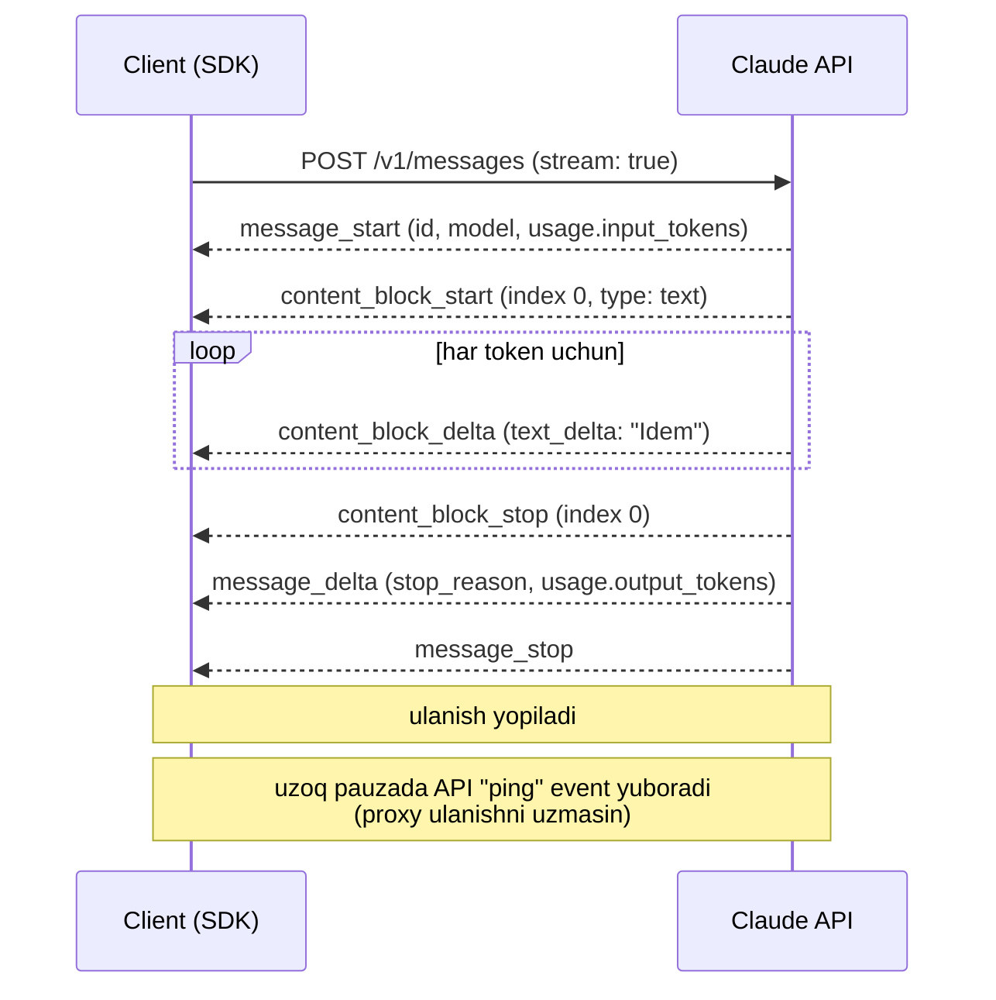

# 03. Streaming

Chat UI'da foydalanuvchi 8 soniya bo'sh ekranga qarab turishi — bu bug. Bundan tashqari streaming ko'p hollarda **texnik majburiyat**: uzun javobda HTTP so'rov timeout'ga uchraydi va `max_tokens` katta bo'lsa SDK so'rovni umuman yubormaydi. Ish suhbatida "LLM javobini foydalanuvchiga qanday yetkazasan?" savoliga "chunked/SSE, TTFT o'lchayman, user ketsa stream'ni cancel qilaman" deb javob bersangiz — bu backend odamining javobi; "`create()` chaqiraman" — bu skript yozuvchining javobi.

---

## Nazariya (~30%)

### Non-streaming = butun result set'ni RAM'ga o'qish

Backend analogiyasi aniq: `SELECT * FROM logs` ni to'liq `[]Row` ga o'qib olish vs **server-side cursor** bilan qatorlab olish. Birinchi holatda birinchi qatorni ko'rishingiz uchun oxirgi qator ham yozilishini kutasiz.

`client.messages.create()` aynan shunday ishlaydi: HTTP so'rov ochiladi, model 800 token generatsiya qilguncha (10-20 soniya) socket jim turadi, keyin bitta katta JSON keladi.

Streaming — bu **chunked transfer**: server har token'ni tayyor bo'lishi bilan `text/event-stream` (SSE) formatida uzatadi.

### Streaming kerak bo'ladigan 3 sabab

| Sabab | Nima bo'ladi streaming'siz |
|---|---|
| **UX / TTFT** (time to first token) | Foydalanuvchi 10 soniya "o'lik" ekranga qaraydi. TTFT ~0.5s vs 10s — bir xil umumiy vaqtda ham idrok butunlay boshqacha |
| **HTTP timeout** | Uzun javob (`max_tokens` katta) → so'rov timeout'ga uchraydi. `max_tokens > ~16000` bo'lsa SDK non-streaming so'rovni **rad etadi** (`ValueError`), chunki 10 minutlik default timeout'ga sig'masligi aniq |
| **Cancel / cost** | Foydalanuvchi sahifadan ketdi, lekin model 2000 token generatsiya qilishda davom etadi va siz ularni to'laysiz. Stream'da ulanishni yopasiz — generatsiya to'xtaydi |

Uchinchi punkt — **backpressure**ning to'g'ridan-to'g'ri analogi: consumer o'qishni to'xtatdi, demak producer ham ishlab chiqarishni to'xtatishi kerak. Non-streaming'da bunday signal kanali yo'q.

> **Oltin qoida:** streaming — bu UI bezagi emas, bu **oqim boshqaruvi**. Uzun javob + cancel imkoniyati = production talabi.

### SSE event'lari: nima qachon keladi

Bitta javob — bu event'lar oqimi. `content` bloklari (text, thinking, tool_use) alohida-alohida ochiladi va yopiladi.



| Event | Ichida nima bor | Nima uchun kerak |
|---|---|---|
| `message_start` | bo'sh Message skeleti, `usage.input_tokens` | input narxini darhol bilasiz |
| `content_block_start` | blok indeksi va turi (`text` / `thinking` / `tool_use`) | UI'da qaysi panelga yozishni hal qilasiz |
| `content_block_delta` | `text_delta` / `thinking_delta` / `input_json_delta` | asosiy kontent |
| `content_block_stop` | blok indeksi | blok yopildi |
| `message_delta` | `stop_reason`, `usage.output_tokens` | **to'liq output token soni faqat shu yerda** |
| `message_stop` | — | oqim tugadi |

Ikki muhim nuqta:

1. `usage.output_tokens` **oxirida** (`message_delta`) keladi. Narxni oldindan bilmaysiz — faqat post-factum.
2. `stop_reason` ham oxirida keladi. `max_tokens` sababli uzilganini stream tugagandagina bilasiz — bu 04-darsda (structured output) alohida tuzoq bo'ladi.

### Berryman Ch7 bilan bog'lanish: to'xtatishning ikki usuli

Berryman javobni to'xtatishning ikki yo'lini qiyoslaydi:

| Usul | Qayerda ishlaydi | Narx |
|---|---|---|
| **stop sequence** (`stop_sequences=["\n#"]`) | server tomonda | eng tejamkor — token umuman generatsiya qilinmaydi |
| **streaming + cancel** | client tomonda | moslashuvchan (murakkab shart yozasiz), lekin network delay ichida bir necha token ortiqcha generatsiya bo'ladi |

Ikkalasi ham hozir dolzarb. Shart oddiy bo'lsa (`"\n#"` uchradi) — `stop_sequences`. Shart kod bilan hisoblanadigan bo'lsa (masalan "JSON obyekti yopildi" yoki "500 belgi yetdi") — streaming + `break`.

---

## Amaliyot (~70%)

Har misol mustaqil fayl. `.env` da `ANTHROPIC_API_KEY` bor deb hisoblaymiz.

### Predict / Run

#### 1. Eng oddiy stream

> **Bashorat qiling:** `print(text, end="")` da `flush=True` bo'lmasa nima ko'rasiz?

```python
# 01_simple_stream.py
import anthropic
from dotenv import load_dotenv

load_dotenv()
client = anthropic.Anthropic()

with client.messages.stream(
    model="claude-opus-4-8",
    max_tokens=300,
    system="Sen tajribali backend arxitektorisan. Qisqa va aniq yoz.",
    messages=[{"role": "user", "content": "Idempotency key nega kerak? 3 jumla."}],
) as stream:
    for text in stream.text_stream:
        print(text, end="", flush=True)   # flush'siz -> terminal buferi javobni oxirida bir zumda chiqaradi
    print()

    final = stream.get_final_message()    # butun javob yig'ilgan Message obyekti
    print(f"stop_reason={final.stop_reason}  output_tokens={final.usage.output_tokens}")

# Output (taxminan, matn token-token chiqadi):
# Idempotency key retry paytida bir amalni ikki marta bajarilishidan himoya qiladi...
# stop_reason=end_turn  output_tokens=118
```

`get_final_message()` — SDK stream davomida bloklarni o'zi yig'ib boradi. Ya'ni streaming'da ham oxirida to'liq `Message` obyektini olasiz: `usage`, `stop_reason`, `content` bloklari. Buni **har doim** log'ga yozing — aks holda token sarfini yo'qotasiz.

#### 2. Event darajasi: nima qachon keladi

`stream.text_stream` — qulay abstraksiya. Ostida nima borligini ko'rish uchun xom event'larni chiqaramiz.

```python
# 02_raw_events.py
import anthropic
from dotenv import load_dotenv

load_dotenv()
client = anthropic.Anthropic()

stream = client.messages.create(          # e'tibor bering: create(..., stream=True) -> xom event iteratori
    model="claude-opus-4-8",
    max_tokens=80,
    messages=[{"role": "user", "content": "HTTP 429 nima? Bir jumla."}],
    stream=True,
)

for event in stream:
    if event.type == "content_block_delta":
        print(f"{event.type:20} -> {event.delta.text!r}")
    elif event.type == "content_block_start":
        print(f"{event.type:20} -> index={event.index} type={event.content_block.type}")
    elif event.type == "message_delta":
        print(f"{event.type:20} -> stop_reason={event.delta.stop_reason} "
              f"output_tokens={event.usage.output_tokens}")
    else:
        print(event.type)

# Output:
# message_start
# content_block_start  -> index=0 type=text
# content_block_delta  -> 'HTTP'
# content_block_delta  -> ' 429'
# content_block_delta  -> ' — rate'
# content_block_delta  -> ' limit'
# ...
# content_block_stop
# message_delta        -> stop_reason=end_turn output_tokens=31
# message_stop
```

Bitta chunk = bitta token emas, balki **token bo'lagi** bo'lishi ham mumkin. Hech qachon "chunklarni sanab token sanayman" demang — `usage` dan oling.

> **Eslatma:** `client.messages.stream()` (context manager) xom event'lardan tashqari SDK'ning o'z yordamchi event'larini ham beradi (masalan `text` — ichida `snapshot`, ya'ni shu paytgacha yig'ilgan matn). Xom protokolni ko'rish uchun `create(stream=True)` toza variant.

#### 3. TTFT vs umumiy vaqt — o'lchaymiz

> **Bashorat qiling:** streaming umumiy vaqtni qisqartiradimi?

```python
# 03_ttft.py
import time
import anthropic
from dotenv import load_dotenv

load_dotenv()
client = anthropic.Anthropic()

MODEL = "claude-opus-4-8"
MSG = [{"role": "user", "content": "Connection pool nega kerak? 250 so'z."}]

# --- non-streaming: birinchi belgi = oxirgi belgi ---
t0 = time.perf_counter()
resp = client.messages.create(model=MODEL, max_tokens=600, messages=MSG)
blocking = time.perf_counter() - t0
print(f"non-stream : TTFT = {blocking:5.2f}s | total = {blocking:5.2f}s")

# --- streaming: TTFT ni alohida o'lchaymiz ---
t0 = time.perf_counter()
ttft = None
with client.messages.stream(model=MODEL, max_tokens=600, messages=MSG) as stream:
    for _ in stream.text_stream:
        if ttft is None:
            ttft = time.perf_counter() - t0
total = time.perf_counter() - t0
print(f"streaming  : TTFT = {ttft:5.2f}s | total = {total:5.2f}s")

# Output (taxminan):
# non-stream : TTFT =  9.84s | total =  9.84s
# streaming  : TTFT =  0.71s | total = 10.02s
```

Xulosa (buni ish suhbatida ayta olish kerak): **streaming umumiy latency'ni kamaytirmaydi** — ba'zan hatto 1-2% oshiradi. U *idrok etiladigan* latency'ni (TTFT) 10-15 barobar tushiradi. Bu p99 emas, bu UX metrikasi.

#### 4. Uzun javob: streaming majburiy bo'ladigan joy

```python
# 04_long_output.py
import anthropic
from dotenv import load_dotenv

load_dotenv()
client = anthropic.Anthropic()

try:
    resp = client.messages.create(
        model="claude-opus-4-8",
        max_tokens=32000,                       # katta output
        messages=[{"role": "user", "content": "Katta REST API uchun to'liq spetsifikatsiya yoz."}],
    )
except ValueError as e:
    print("SDK so'rovni yubormadi:", e)

# Output:
# SDK so'rovni yubormadi: Streaming is required for operations that may take longer
# than 10 minutes. ... use client.messages.stream(...)
```

To'g'ri variant — o'sha so'rov `stream()` bilan:

```python
with client.messages.stream(
    model="claude-opus-4-8",
    max_tokens=32000,
    messages=[{"role": "user", "content": "Katta REST API uchun to'liq spetsifikatsiya yoz."}],
) as stream:
    for text in stream.text_stream:
        print(text, end="", flush=True)
```

Bu SDK'ning injiqligi emas: bitta HTTP so'rovni 10+ minut ochiq ushlab turish load balancer, reverse proxy va client timeout'lariga qarshi kurash demakdir. Streaming'da esa har necha yuz millisekundda bayt oqadi — hech kim ulanishni "o'lik" deb hisoblamaydi.

#### 5. Shart bo'yicha to'xtatish (cancel)

```python
# 05_cancel.py
import anthropic
from dotenv import load_dotenv

load_dotenv()
client = anthropic.Anthropic()

LIMIT = 200          # belgi
buf, seen = [], 0

with client.messages.stream(
    model="claude-opus-4-8",
    max_tokens=2000,
    messages=[{"role": "user", "content": "Kubernetes'ni batafsil tushuntir."}],
) as stream:
    for text in stream.text_stream:
        buf.append(text)
        seen += len(text)
        if seen >= LIMIT:
            print("\n[cancel: limitga yetdik]")
            break     # context manager chiqishda HTTP ulanishni yopadi -> server generatsiyani to'xtatadi

print("".join(buf))
print(f"jami {seen} belgi olindi (2000 token generatsiya qilinmadi)")

# Output:
# [cancel: limitga yetdik]
# Kubernetes — konteynerlarni orkestratsiya qiluvchi tizim. U pod'larni ...
# jami 213 belgi olindi (2000 token generatsiya qilinmadi)
```

Ikki muhim detal:

- `break` dan keyin `get_final_message()` **chaqirmang**. U qolgan event'larni oxirigacha o'qishga urinadi — ya'ni bekor qilishning butun ma'nosi yo'qoladi.
- Bekor qilingandan keyin siz faqat generatsiya qilingan token uchun to'laysiz. Web serverda buni `request.is_disconnected()` (yoki Go'da `ctx.Done()`) bilan bog'laysiz: client ketdi → stream yopiladi → pul yonmaydi.

#### 6. Thinking bloklarini stream qilish

> **Bashorat qiling:** `thinking` yoqilgan model 20 soniya o'ylayapti. Foydalanuvchi shu paytda nima ko'radi?

```python
# 06_thinking_stream.py
import anthropic
from dotenv import load_dotenv

load_dotenv()
client = anthropic.Anthropic()

with client.messages.stream(
    model="claude-opus-4-8",
    max_tokens=4000,
    thinking={"type": "adaptive", "display": "summarized"},   # default: "omitted"
    output_config={"effort": "high"},
    messages=[{"role": "user", "content": "3 ta servis bor, birida deadlock. Diagnostika rejasini tuz."}],
) as stream:
    for event in stream:
        if event.type == "content_block_start":
            print(f"\n--- {event.content_block.type} ---")
        elif event.type == "content_block_delta":
            if event.delta.type == "thinking_delta":
                print(event.delta.thinking, end="", flush=True)
            elif event.delta.type == "text_delta":
                print(event.delta.text, end="", flush=True)

# Output:
# --- thinking ---
# Deadlock uchta servis orasida bo'lsa, avval qaysi resurs umumiy ekanini aniqlash kerak...
# --- text ---
# 1. Servislar orasidagi qulf grafigini chizing...
```

**Tuzoq:** `display` ning default qiymati `"omitted"` — ya'ni thinking bloki uchun **matn umuman kelmaydi**. Model 20 soniya o'ylaydi, stream'da esa hech nima oqmaydi. Foydalanuvchi buni "osilib qoldi" deb tushunadi va sahifani yangilaydi.

Ikki yechim, ikkalasi ham to'g'ri:
- `display: "summarized"` — o'ylash xulosasini ko'rsatasiz (Claude'ning o'zidagi "Thinking" paneli shunday);
- yoki `omitted` qoldirib, `content_block_start` (type=`thinking`) kelganda UI'da spinner + "Tahlil qilinmoqda..." yozuvini yoqasiz.

#### 7. Tool use bilan streaming

```python
# 07_tool_stream.py
import anthropic
from dotenv import load_dotenv

load_dotenv()
client = anthropic.Anthropic()

tools = [{
    "name": "get_service_status",
    "description": "Mikroservisning joriy holatini qaytaradi. Foydalanuvchi servis holati haqida so'raganda ishlat.",
    "input_schema": {
        "type": "object",
        "properties": {"service": {"type": "string", "description": "Servis nomi, masalan payments-api"}},
        "required": ["service"],
    },
}]

with client.messages.stream(
    model="claude-opus-4-8",
    max_tokens=500,
    tools=tools,
    messages=[{"role": "user", "content": "payments-api tirikmi?"}],
) as stream:
    for event in stream:
        if event.type == "content_block_start" and event.content_block.type == "tool_use":
            print(f"\n[tool: {event.content_block.name}] args: ", end="")
        elif event.type == "content_block_delta" and event.delta.type == "input_json_delta":
            print(event.delta.partial_json, end="", flush=True)   # JSON BO'LAGI, to'liq JSON emas!

    final = stream.get_final_message()
    print(f"\nstop_reason={final.stop_reason}")
    for block in final.content:
        if block.type == "tool_use":
            print("to'liq input:", block.input)     # bu yerda allaqachon dict

# Output:
# [tool: get_service_status] args: {"ser vice": "payments -api"}
# stop_reason=tool_use
# to'liq input: {'service': 'payments-api'}
```

`input_json_delta.partial_json` — bu **yopilmagan JSON bo'lagi**. Unga `json.loads` qilsangiz albatta yiqilasiz. Uni faqat UI'da "argument yozilmoqda..." effekti uchun ishlating; haqiqiy argumentni `get_final_message()` dan oling (SDK o'zi yig'adi).

#### 8. Uzilish: yarim javob bilan nima qilamiz

```python
# 08_partial.py
import anthropic
from dotenv import load_dotenv

load_dotenv()
client = anthropic.Anthropic()

acc = []
try:
    with client.messages.stream(
        model="claude-opus-4-8",
        max_tokens=1000,
        messages=[{"role": "user", "content": "Postgres MVCC ni tushuntir."}],
    ) as stream:
        for text in stream.text_stream:
            acc.append(text)
            print(text, end="", flush=True)
except (anthropic.APIConnectionError, anthropic.APIStatusError) as e:
    partial = "".join(acc)
    print(f"\n[uzildi: {type(e).__name__}, {len(partial)} belgi olindi]")
    # Variantlar:
    #  a) butun so'rovni qaytadan yuborish (stream'ni "davom ettirib" bo'lmaydi — Range header yo'q)
    #  b) partial'ni "to'liq emas" belgisi bilan ko'rsatish
    #  c) partial'ni tashlab yuborish (agar u structured output bo'lsa - majburiy)

# Output (uzilish yuz bersa):
# Postgres'da MVCC har tranzaksiya uchun snapshot yara
# [uzildi: APIConnectionError, 52 belgi olindi]
```

Bu yerda muhim farq: HTTP faylni yuklab olishda uzilsangiz `Range: bytes=52-` bilan davom etasiz. **LLM stream'ida bunday imkoniyat yo'q** — generatsiya holati serverda saqlanmaydi. Uzildi = qaytadan (va yana to'laysiz). Shuning uchun ilova qatlamida "necha marta retry qilamiz" va "yarim javobni ko'rsatamizmi" degan qarorlarni oldindan yozib qo'ying.

#### 9. Server tomon: generator sifatida uzatish

```python
# 09_server_gen.py
import json
import anthropic
from dotenv import load_dotenv

load_dotenv()
client = anthropic.Anthropic()

def stream_answer(question: str):
    """Generator: har yield = brauzerga ketadigan bitta SSE frame."""
    with client.messages.stream(
        model="claude-opus-4-8",
        max_tokens=400,
        messages=[{"role": "user", "content": question}],
    ) as stream:
        for text in stream.text_stream:
            yield "data: " + json.dumps({"delta": text}, ensure_ascii=False) + "\n\n"
        final = stream.get_final_message()
        yield "data: " + json.dumps({"done": True, "tokens": final.usage.output_tokens}) + "\n\n"

for frame in stream_answer("Redis nega single-threaded?"):
    print(repr(frame))

# Output:
# 'data: {"delta": "Redis"}\n\n'
# 'data: {"delta": " asosiy"}\n\n'
# ...
# 'data: {"done": true, "tokens": 96}\n\n'
```

Bu generator'ni HTTP javobiga ulash — bir qator kod (FastAPI'da `StreamingResponse`, Go'da `http.Flusher`). To'liq SSE endpoint, `Content-Type: text/event-stream`, proxy buferlash muammolari va client disconnect'ni ushlash — kursning production servis bo'limida ko'ramiz. Hozir asosiy narsani ushlab oling: **API stream'i va sizning HTTP stream'ingiz — ikki xil oqim, ular orasida siz turasiz** va tarjimon vazifasini bajarasiz.

---

### Investigate / Modify

1. **`flush=True` ni olib tashlang** (01-misol). Nima o'zgaradi va nega? (Javob "SDK" haqida emas, "libc/Python stdout buffer" haqida.)
2. **02-misolda `max_tokens=80` ni `max_tokens=10`** ga tushiring. `message_delta` dagi `stop_reason` nima bo'ladi? Bu qiymat kelgunicha siz javob to'liq emasligini bila olasizmi?
3. **05-misolda `break` ni `continue`** ga o'zgartiring va vaqtni o'lchang. Umumiy vaqt va `output_tokens` qanday o'zgaradi? Bu farq — bu sizning pulingiz.
4. **06-misolda `display: "summarized"` ni olib tashlang** (default `omitted` qoladi). Terminalda nima ko'rasiz? Endi shu xulq'ni chat UI'da tasavvur qiling.
5. **07-misolda `partial_json` ga `json.loads()` qo'llab ko'ring.** Qaysi chunk'da yiqiladi va nega? Buni "modelning xatosi" deb aytish mumkinmi?
6. **03-misolni `claude-haiku-4-5` bilan qayta ishga tushiring.** TTFT va total qanday o'zgardi? Qaysi vazifalarda arzon model faqat TTFT uchun ham arziydi?

---

### Make

**Mini-challenge:** "streaming'li so'rov yuboruvchi funksiya" yozing, u:

1. javobni token-token chop etsin;
2. **TTFT** va **tokens/sec** ni hisoblab, oxirida chiqarsin;
3. javob `max_chars` belgidan oshsa stream'ni bekor qilsin va `truncated=True` qaytarsin;
4. uzilishda yarim matnni yo'qotmasin;
5. har holatda `usage` ni log'ga yozsin (bekor qilinganda ham — `None` bo'lsa "unknown").

Signatura: `def ask(question: str, max_chars: int = 500) -> dict` → `{"text": ..., "truncated": bool, "ttft": float, "tps": float, "output_tokens": int | None}`

<details>
<summary>Yechim</summary>

```python
# make_solution.py
import time
import anthropic
from dotenv import load_dotenv

load_dotenv()
client = anthropic.Anthropic()

def ask(question: str, max_chars: int = 500) -> dict:
    t0 = time.perf_counter()
    parts, ttft, truncated, out_tokens = [], None, False, None

    try:
        with client.messages.stream(
            model="claude-opus-4-8",
            max_tokens=1500,
            messages=[{"role": "user", "content": question}],
        ) as stream:
            for text in stream.text_stream:
                if ttft is None:
                    ttft = time.perf_counter() - t0
                parts.append(text)
                print(text, end="", flush=True)

                if sum(len(p) for p in parts) >= max_chars:
                    truncated = True
                    break                     # ulanish yopiladi -> generatsiya to'xtaydi

            if not truncated:                 # faqat to'liq oqimda final message so'raymiz
                final = stream.get_final_message()
                out_tokens = final.usage.output_tokens
    except (anthropic.APIConnectionError, anthropic.APIStatusError) as e:
        print(f"\n[stream uzildi: {type(e).__name__}]")

    text = "".join(parts)
    elapsed = time.perf_counter() - t0
    # bekor qilinganda usage yo'q -> chunklardan taxminiy tezlik (4 belgi ~ 1 token)
    tps = (out_tokens or len(text) / 4) / elapsed if elapsed > 0 else 0.0

    print(f"\n--- ttft={ttft:.2f}s  tps={tps:.1f}  truncated={truncated}  usage={out_tokens} ---")
    return {"text": text, "truncated": truncated, "ttft": ttft, "tps": tps, "output_tokens": out_tokens}

if __name__ == "__main__":
    ask("Event sourcing nima? Batafsil.", max_chars=300)

# Output:
# Event sourcing — bu holatni emas, holatga olib kelgan hodisalar ketma-ketligini saqlash...
# --- ttft=0.64s  tps=41.3  truncated=True  usage=None ---
```

Diqqat qilinadigan joylar: `truncated` bo'lganda `get_final_message()` chaqirilmaydi (aks holda cancel ma'nosiz), va `usage` yo'qligini `None` bilan ochiq ko'rsatamiz — "0" deb yozib log'ni yolg'onlashtirmaymiz.
</details>

---

## Retrieval practice

1. Streaming umumiy latency'ni kamaytiradimi? Agar yo'q bo'lsa, uni nega ishlatamiz — ikkita mustaqil sabab ayting.
2. `usage.output_tokens` va `stop_reason` qaysi event'da keladi? Bu narx nazorati uchun nimani anglatadi?
3. `input_json_delta.partial_json` ga to'g'ridan-to'g'ri `json.loads()` qo'llash nega xato?
4. `thinking` yoqilgan, `display` sozlanmagan. Foydalanuvchi ekranida nima sodir bo'ladi va buni qanday tuzatasiz?
5. Stream'ni `break` bilan uzdingiz. `get_final_message()` ni chaqirsangiz nima yo'qoladi?
6. Berryman'ning `stop_sequences` usuli va "streaming + cancel" usuli qachon bir-birini almashtira olmaydi?

---

## Manbalar

- **Berryman & Ziegler, Ch 7 — "Taming the Model"**: completion anatomiyasi (preamble, recognizable start/end), stop sequence vs streaming+cancel taqqoslashi.
- **Berryman & Ziegler, Ch 2**: prompt parallel o'qiladi, generatsiya ketma-ket (~10x farq) — streaming'ning fizik sababi shu.
- **Chip Huyen, Ch 2 — Sampling**: stopping condition; erta to'xtash JSON formatni buzadi.
- Rasmiy docs: Streaming Messages — `https://platform.claude.com/docs/en/api/messages-streaming`
- Rasmiy docs: Streaming (Build with Claude) — `https://platform.claude.com/docs/en/build-with-claude/streaming`
- SSE protokoli (brauzer tomoni): `https://developer.mozilla.org/en-US/docs/Web/API/Server-sent_events/Using_server-sent_events`
- Research xulosasi, 1-bo'lim, §2 (streaming, timeout, cancel).
