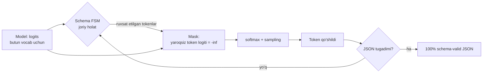

# 04. Structured output

Model matn qaytaradi, sizning kodingiz esa `dict` kutadi. Prompt'da "faqat JSON qaytar" deb yozib, `json.loads()` ni `try/except` ga o'rab qo'yish — 100 so'rovdan 3-5 tasi jimgina yiqiladigan tizim demakdir. Bu dars shu 3-5% ni **noldan** boshqariladigan kafolatga aylantirish haqida: prompting → tool calling → constrained decoding. Ish suhbatida "LLM output'ini downstream servisga qanday ishonchli uzatasan?" savoli deyarli har agent mavzusida chiqadi.

---

## Nazariya (~30%)

### Muammo: LLM'ning output'i — bu ishonchsiz tashqi input

Backend odam uchun eng to'g'ri tasavvur: **LLM javobi — bu user input**. Uni validatsiyasiz `json.loads` qilish — SQL query'ga string'ni to'g'ridan-to'g'ri qo'yish bilan bir xil darajadagi soddalik.

Structured output ikki senariyda kerak (Huyen Ch2):

1. **Vazifaning o'zi strukturani talab qiladi** — semantic parsing: text-to-SQL, text-to-regex, klassifikatsiya.
2. **Downstream app parse qiladi** — agent workflow'da model output'i keyingi tool'ning input'i bo'ladi. Bu yerda bitta buzilgan JSON butun zanjirni to'xtatadi.

### Uch daraja ishonchlilik

| Daraja | Usul | Schema bo'yicha valid | Narx / murakkablik |
|---|---|---|---|
| 1 | **Prompting** — "JSON qaytar" + parse | 80-95% | Arzon, lekin qolgan 5-20% ni siz tozalaysiz |
| 2 | **Tool / function calling** — schema bilan | 95-99% | Model schema'ni "ko'radi", lekin generatsiya erkin |
| 3 | **Native structured output + constrained decoding** | schema bo'yicha **100% valid** | Qo'llab-quvvatlovchi model kerak; chuqur schema kompilyatsiyasi sekin |

> **Oltin qoida:** JSON'ning yaroqliligini *promptga ishonib* emas, *dekoderni cheklab* kafolatlang. Prompt — bu maslahat; constrained decoding — bu constraint.

DB analogiyasi: prompting = kodda "iltimos, `NULL` yozmang" degan comment. Constrained decoding = `NOT NULL` constraint. Ikkinchisini aylanib o'tib bo'lmaydi.

### Constrained decoding qanday ishlaydi

Eslang (01-dars): model har qadamda butun vocab uchun **logit** vektor chiqaradi, keyin softmax + sampling. Constrained decoding shu ikki qadam **orasiga** kiradi.



Mexanika:

1. JSON Schema **FSM** (chekli avtomat) ga kompilyatsiya qilinadi. FSM har qadamda "shu yerda qaysi tokenlar mumkin?" degan savolga javob beradi.
2. Har token qadamida yaroqsiz tokenlarning logiti `-inf` ga o'rnatiladi (**mask**).
3. Sampling faqat qolgan tokenlardan bo'ladi.

Natija: `{"severity": "criti` holatida `cal"` dan boshqa davom umuman **imkonsiz** bo'ladi. Model "adashishni xohlasa ham" adasha olmaydi.

Ikki qo'shimcha fakt: XGrammar kabi implementatsiyalar ~40 mikrosekund/token qo'shadi (deyarli bepul), va constrained decoding ba'zan generatsiyani **tezlashtiradi** — chunki model ortiqcha "Mana JSON:" preamble'ini yoza olmaydi.

### Muhim: 100% valid ≠ 100% to'g'ri

Constrained decoding **sintaksisni** kafolatlaydi, **semantikani** emas. `{"service": "auth-api"}` schema bo'yicha benuqson, lekin log aslida `payments-api` haqida bo'lishi mumkin. Bu — validatsiya emas, hallucination masalasi va u alohida yechiladi (evaluation, grounding).

### ⚠️ Berryman'ning "inception trick" i endi ishlamaydi

Berryman Ch6'da javobni majburlashning eng mashhur usuli — **prefill**: oxirgi turn'ga `{"role": "assistant", "content": "{"}` qo'yib, model'ni JSON bilan davom ettirishga majburlash.

> ⚠️ 2026-da Claude'ning joriy modellarida (Opus 4.8, Sonnet 5, Fable 5, Haiku 4.5) assistant prefill **400 xato** beradi. Bu texnikaning o'rniga aynan structured output kelgan: ilgari prefill hal qilgan muammoni endi `output_config.format` **kafolat bilan** hal qiladi. Tushunchaning o'zi baribir kerak — OpenAI-compatible va lokal modellarda prefill hali ham ishlaydi.

Berryman'ning Ch7'dagi "recognizable end" g'oyasi esa o'z kuchida: JSON'ning yopiluvchi `}` si — bu tabiiy to'xtash nuqtasi va FSM uni aynan shunday ishlatadi.

---

## Amaliyot (~70%)

### Predict / Run

#### 1. Noto'g'ri usul: "JSON qaytar" + json.loads

> **Bashorat qiling:** quyidagi kod 100 ta log qatorida necha marta yiqiladi va **qaysi** aniq sababdan?

```python
# 01_naive_json.py
import json
import anthropic
from dotenv import load_dotenv

load_dotenv()
client = anthropic.Anthropic()

LOG = """
2026-07-14T09:12:44Z payments-api ERROR conn pool exhausted (size=20, waiting=137)
upstream postgres p99=2.4s; 502 returned to 1143 clients
"""

resp = client.messages.create(
    model="claude-opus-4-8",
    max_tokens=400,
    system="Log qatorini tahlil qil. FAQAT JSON qaytar, boshqa hech narsa yozma.",
    messages=[{"role": "user", "content": LOG}],
)

raw = resp.content[0].text
print(repr(raw[:60]))

data = json.loads(raw)     # <- production'da shu yerda 3 AM'da pager chalinadi
print(data["severity"])

# Output (bir necha ishga tushirishdan biri):
# '```json\n{\n  "service": "payments-api",\n  "severity": "cri'
# Traceback (most recent call last):
#   ...
# json.decoder.JSONDecodeError: Expecting value: line 1 column 1 (char 0)
```

Uch xil buzilish shu darajada kutiladi: markdown fence (` ```json `), preamble ("Mana tahlil:"), va kalit nomining o'zgarib ketishi (`severity` o'rniga `level`). Prompt yaxshi bo'lsa 95% ishlaydi — ya'ni har 20-so'rovda incident.

#### 2. To'g'ri usul: messages.parse + Pydantic

```python
# 02_parse.py
from enum import Enum
import anthropic
from pydantic import BaseModel, Field
from dotenv import load_dotenv

load_dotenv()
client = anthropic.Anthropic()

class Severity(str, Enum):
    CRITICAL = "critical"
    WARNING = "warning"
    INFO = "info"

class ErrorReport(BaseModel):
    service: str = Field(description="Xato sodir bo'lgan servis nomi")
    severity: Severity
    message: str = Field(description="Xatoning bir jumlali xulosasi")
    suggested_fix: str = Field(description="Aniq, bajariladigan tavsiya")

LOG = """
2026-07-14T09:12:44Z payments-api ERROR conn pool exhausted (size=20, waiting=137)
upstream postgres p99=2.4s; 502 returned to 1143 clients
"""

resp = client.messages.parse(
    model="claude-opus-4-8",
    max_tokens=600,
    system="Sen SRE assistantisan. Log'ni tahlil qilib incident hisobotini to'ldir.",
    messages=[{"role": "user", "content": LOG}],
    output_format=ErrorReport,          # SDK schema'ni o'zi generatsiya qiladi va yuboradi
)

report: ErrorReport = resp.parsed_output   # allaqachon validatsiyadan o'tgan Pydantic obyekti
print(type(report).__name__)
print(report.service, "|", report.severity.value)
print(report.suggested_fix)
print("stop_reason:", resp.stop_reason, "| output_tokens:", resp.usage.output_tokens)

# Output:
# ErrorReport
# payments-api | critical
# Pool hajmini oshiring (20 -> 60) va postgres tomonda sekin query'ni indeks bilan tuzating.
# stop_reason: end_turn | output_tokens: 96
```

E'tibor bering: `json.loads` yo'q, `try/except` yo'q, markdown fence yo'q. `parsed_output` — tayyor tipizatsiyalangan obyekt. Bu **level 3**: model schema'dan chetga chiqa olmaydi.

#### 3. Xom JSON Schema (Pydantic'siz)

Ba'zan schema tashqaridan keladi (masalan konfiguratsiya faylidan) — u holda Pydantic model yozib o'tirmaysiz.

```python
# 03_raw_schema.py
import json
import anthropic
from dotenv import load_dotenv

load_dotenv()
client = anthropic.Anthropic()

schema = {
    "type": "object",
    "properties": {
        "service":  {"type": "string"},
        "severity": {"type": "string", "enum": ["critical", "warning", "info"]},
        "message":  {"type": "string"},
    },
    "required": ["service", "severity", "message"],
    "additionalProperties": False,           # model o'zidan kalit qo'sha olmaydi
}

resp = client.messages.create(
    model="claude-opus-4-8",
    max_tokens=400,
    messages=[{"role": "user", "content": "redis-cache OOM bo'lib qayta ishga tushdi"}],
    output_config={"format": {"type": "json_schema", "schema": schema}},
)

data = json.loads(resp.content[0].text)      # bu yerda json.loads XAVFSIZ: matn schema bo'yicha kafolatlangan
print(data)

# Output:
# {'service': 'redis-cache', 'severity': 'critical', 'message': 'redis-cache xotira yetishmovchiligi tufayli qayta ishga tushdi'}
```

> **Eslatma (API tarixi):** eski top-level `output_format=...` parametri `messages.create()` da **deprecated**. To'g'ri joy — `output_config={"format": {...}}`. `messages.parse(output_format=PydanticModel)` dagi `output_format` esa boshqa narsa: bu SDK helper argumenti, u ostidan o'sha `output_config.format` ni yuboradi. Ikkalasini adashtirmang.

#### 4. Enum bilan klassifikatsiya

Klassifikatsiya — structured output'ning eng arzon va eng foydali qo'llanishi. Model erkin matn o'rniga **faqat** ruxsat etilgan yorliqni chiqaradi.

```python
# 04_classify.py
from enum import Enum
import anthropic
from pydantic import BaseModel
from dotenv import load_dotenv

load_dotenv()
client = anthropic.Anthropic()

class Intent(str, Enum):
    BUG_REPORT = "bug_report"
    FEATURE_REQUEST = "feature_request"
    BILLING = "billing"
    OTHER = "other"

class Ticket(BaseModel):
    intent: Intent
    reason: str          # nega shu label - debugging uchun

TICKETS = [
    "Ilova checkout'da 500 qaytaryapti, uchinchi kun.",
    "Karta o'chirilgan, lekin hisobdan pul yechildi.",
    "Dark mode qo'shsangiz zo'r bo'lardi.",
]

for t in TICKETS:
    r = client.messages.parse(
        model="claude-haiku-4-5",           # oddiy vazifa -> arzon model
        max_tokens=200,
        system="Ticket'ni klassifikatsiya qil.",
        messages=[{"role": "user", "content": t}],
        output_format=Ticket,
    )
    print(f"{r.parsed_output.intent.value:16} <- {t[:40]}")

# Output:
# bug_report       <- Ilova checkout'da 500 qaytaryapti, uch
# billing          <- Karta o'chirilgan, lekin hisobdan pul
# feature_request  <- Dark mode qo'shsangiz zo'r bo'lardi.
```

Berryman Ch7'da klassifikatsiya uchun bitta tuzoq bor edi: variantlar bir xil token bilan boshlansa (`North America` / `Northeast Asia`), logprob'lar birinchi tokenda qo'shilib ketadi. Constrained decoding bu muammoni yo'q qiladi — chiqish baribir yaroqli enum bo'ladi. Lekin **qaysi** enum tanlanishi hamon modelning qarori: yorliqlar bir-biridan mazmunan aniq ajralsin.

#### 5. Tool'da `strict: True`

Agent loop'ida structured output tool'ning **input**ida kerak bo'ladi: model tool argumentlarini schema bo'yicha to'ldirsin.

```python
# 05_strict_tool.py
import anthropic
from dotenv import load_dotenv

load_dotenv()
client = anthropic.Anthropic()

tools = [{
    "name": "create_incident",
    "description": "Incident tracker'da yangi incident yaratadi. Log'da xato aniqlanganda ishlat.",
    "input_schema": {
        "type": "object",
        "properties": {
            "service":  {"type": "string"},
            "severity": {"type": "string", "enum": ["critical", "warning", "info"]},
            "summary":  {"type": "string"},
        },
        "required": ["service", "severity", "summary"],
        "additionalProperties": False,     # strict uchun majburiy
    },
    "strict": True,                        # <- tool argumentlari ham constrained decoding bilan
}]

resp = client.messages.create(
    model="claude-opus-4-8",
    max_tokens=600,
    tools=tools,
    messages=[{"role": "user", "content": "auth-service 5 daqiqadan beri 503 qaytaryapti"}],
)

print("stop_reason:", resp.stop_reason)
for block in resp.content:
    if block.type == "tool_use":
        print(block.name, "->", block.input)     # dict, schema bo'yicha kafolatlangan

# Output:
# stop_reason: tool_use
# create_incident -> {'service': 'auth-service', 'severity': 'critical', 'summary': 'auth-service 503 qaytarmoqda, 5 daqiqa davom etmoqda'}
```

`strict: True` siz ham model odatda to'g'ri argument beradi (95-99%), lekin `strict` bilan — schema bo'yicha 100%. Talab: `additionalProperties: false` va `required` to'liq ko'rsatilgan bo'lsin.

> **Manba tekshirish darsi:** 2026-yildagi ba'zi blog postlar "Claude'ning `strict` parametri e'tiborga olinmaydi" deb yozadi. Bu **eskirgan/noto'g'ri** ma'lumot. Rasmiy hujjat ustuvor — blog emas. Har API da'vosini docs bilan tasdiqlash odati sizni bir necha kunlik debug'dan qutqaradi.

#### 6. Eng qonli tuzoq: `max_tokens` yetmadi

> **Bashorat qiling:** constrained decoding "100% valid JSON" beradi. `max_tokens` yetmasa ham shundaymi?

```python
# 06_truncated.py
import json
import anthropic
from dotenv import load_dotenv

load_dotenv()
client = anthropic.Anthropic()

schema = {
    "type": "object",
    "properties": {
        "service":  {"type": "string"},
        "severity": {"type": "string", "enum": ["critical", "warning", "info"]},
        "message":  {"type": "string"},
        "steps":    {"type": "array", "items": {"type": "string"}},
    },
    "required": ["service", "severity", "message", "steps"],
    "additionalProperties": False,
}

resp = client.messages.create(
    model="claude-opus-4-8",
    max_tokens=30,                      # ataylab yetarsiz
    messages=[{"role": "user", "content": "payments-api conn pool exhausted, batafsil tahlil"}],
    output_config={"format": {"type": "json_schema", "schema": schema}},
)

print("stop_reason:", resp.stop_reason)
raw = resp.content[0].text
print(repr(raw))

json.loads(raw)                          # yiqiladi

# Output:
# stop_reason: max_tokens
# '{"service": "payments-api", "severity": "critic'
# Traceback (most recent call last):
#   ...
# json.decoder.JSONDecodeError: Unterminated string starting at: line 1 column 51 (char 50)
```

**Xulosa:** constrained decoding har *qadamda* yaroqli davomni kafolatlaydi, lekin generatsiya `max_tokens` da **kesilib** qolsa — natija yarim JSON bo'ladi. Bu kafolatning teshigi emas, uning chegarasi.

To'g'ri kod har doim shunday boshlanadi:

```python
# 06b_guard.py
if resp.stop_reason == "max_tokens":
    # Retry qilish shart: max_tokens ni oshirib yoki schema'ni soddalashtirib.
    # Yarim JSON'ni "tuzatishga" urinish - eng qimmat xato: siz uni to'liq deb o'ylab qolasiz.
    raise RuntimeError("JSON kesildi: max_tokens yetmadi")

data = json.loads(resp.content[0].text)
```

`messages.parse()` ishlatganda ham xuddi shu: kesilgan javob Pydantic validatsiyasidan o'tmaydi va SDK xato ko'taradi — lekin xato xabari sizga *sababni* aytmaydi. `stop_reason` ni **o'zingiz** tekshiring, aks holda "model buzuq JSON qaytaryapti" deb bir kun yo'qotasiz.

#### 7. Post-processing baribir foydali

Level 3 mavjud bo'lmagan joyda (lokal model, eski API, OpenAI-compatible proxy) Huyen'ning "post-processing" qatlami hali ham ishlaydi. LinkedIn defensive YAML parser bilan formatning to'g'riligini **90% dan 99.99%** ga ko'targan — modelni almashtirmasdan, shunchaki modelning **takrorlanadigan** xatolarini skript bilan tuzatib.

```python
# 07_defensive.py
import json

def extract_json(text: str) -> dict:
    """Model qaytargan matndan JSON obyektini qutqaradi (fallback qatlam)."""
    t = text.strip()

    # 1) markdown fence'ni olib tashlash: ```json ... ```
    if t.startswith("```"):
        t = t.split("\n", 1)[1] if "\n" in t else t
        t = t.rsplit("```", 1)[0]

    # 2) preamble/postscript'ni kesish: birinchi { dan oxirgi } gacha
    start, end = t.find("{"), t.rfind("}")
    if start == -1 or end == -1 or end < start:
        raise ValueError(f"JSON topilmadi: {text[:80]!r}")

    return json.loads(t[start:end + 1])

SAMPLES = [
    '```json\n{"service": "auth", "severity": "info"}\n```',
    'Mana tahlil:\n{"service": "auth", "severity": "info"}\nUmid qilamanki foydali.',
    '{"service": "auth", "severity": "info"}',
]

for s in SAMPLES:
    print(extract_json(s))

# Output:
# {'service': 'auth', 'severity': 'info'}
# {'service': 'auth', 'severity': 'info'}
# {'service': 'auth', 'severity': 'info'}
```

Bu — Huyen aytgan "bandage" (bog'lam): model deyarli yaxshi bo'lganda arzon va samarali. Claude'da structured output bor ekan, **birinchi tanlov u**; `extract_json` esa fallback va boshqa provayderlar uchun.

---

### Investigate / Modify

1. **01-misolni 10 marta ketma-ket ishga tushiring.** Necha marta yiqildi? Endi system prompt'ga "Markdown fence ishlatma" qo'shing va yana 10 marta. Yiqilish yo'qoldimi yoki kamaydimi? "Kamaydi" va "kafolatlandi" orasidagi farqni bir jumlada yozing.
2. **02-misoldagi `Severity` enum'iga `"unknown"` qo'shing** va log'ga tushunarsiz matn bering. Model nima qiladi? Enum'da "chiqish yo'li" bo'lishi nega muhim?
3. **`ErrorReport` ga `message: str = Field(min_length=10)` qo'shing.** Nima bo'ladi? (Ipucha: schema cheklovlari — `minimum`, `maximum`, `minLength` — **qo'llab-quvvatlanmaydi**.) Uzunlik talabini qayerda tekshirasiz?
4. **`ErrorReport` ni rekursiv qiling** (masalan `related: list["ErrorReport"]`). Natijani tushuntiring: rekursiv schema qo'llab-quvvatlanmaydi. Buni qanday aylanib o'tasiz (ipucha: tekis struktura + `parent_id`)?
5. **06-misolda `max_tokens` ni asta oshiring** (30 → 60 → 200). Qaysi qiymatda `stop_reason` `end_turn` ga o'zgaradi? `steps` massivini schema'dan olib tashlasangiz-chi?
6. **05-misolda `strict: True` ni olib tashlang** va `input_schema` ga tushunarsiz kalit qo'shing (`"priority"`, `description`siz). Model uni to'ldiradimi? Argument hallucination'ini shu yerda ko'rasiz.
7. **04-misolni `claude-haiku-4-5` dan `claude-opus-4-8` ga o'tkazing.** Natija sezilarli o'zgardimi? Agar yo'q — bu klassifikatsiyada qaysi modelni tanlash kerakligi haqida nima deydi (narx farqi 5x)?

---

### Make

**Mini-challenge:** `extract_incident(log: str) -> Incident` funksiyasini yozing, u **production-ready** bo'lsin:

1. Pydantic model: `service: str`, `severity: Severity(enum)`, `summary: str`, `runbook_steps: list[str]`, `needs_human: bool`;
2. `messages.parse()` bilan structured output;
3. `stop_reason == "max_tokens"` ni tekshiradi va `max_tokens` ni ikki barobar oshirib **bir marta** retry qiladi;
4. `anthropic.BadRequestError` (schema muammosi) ni retry **qilmaydi** — darhol ko'taradi;
5. semantik tekshiruv: agar `severity == critical` bo'lsa, lekin `runbook_steps` bo'sh bo'lsa — bu ishonchsiz natija, `needs_human=True` qilib qaytaradi.

<details>
<summary>Yechim</summary>

```python
# make_solution.py
from enum import Enum
import anthropic
from pydantic import BaseModel, Field
from dotenv import load_dotenv

load_dotenv()
client = anthropic.Anthropic()

class Severity(str, Enum):
    CRITICAL = "critical"
    WARNING = "warning"
    INFO = "info"

class Incident(BaseModel):
    service: str
    severity: Severity
    summary: str = Field(description="Bir jumlali xulosa")
    runbook_steps: list[str] = Field(description="Aniq, ketma-ket bajariladigan qadamlar")
    needs_human: bool = Field(description="Avtomatik hal qilib bo'lmasa true")

SYSTEM = "Sen SRE assistantisan. Log'dan incident hisobotini tuz. Faqat log'dagi faktlarga tayan."

def extract_incident(log: str, max_tokens: int = 800) -> Incident:
    for attempt in (1, 2):
        try:
            resp = client.messages.parse(
                model="claude-opus-4-8",
                max_tokens=max_tokens,
                system=SYSTEM,
                messages=[{"role": "user", "content": log}],
                output_format=Incident,
            )
        except anthropic.BadRequestError:
            raise                       # schema xatosi - retry ma'nosiz, kvota behuda ketadi

        if resp.stop_reason == "max_tokens":
            if attempt == 2:
                raise RuntimeError("JSON kesildi: max_tokens ikki marta yetmadi")
            max_tokens *= 2             # yagona retry
            continue

        incident = resp.parsed_output
        break

    # semantik guard: schema valid, lekin mazmun ishonchsiz
    if incident.severity is Severity.CRITICAL and not incident.runbook_steps:
        incident.needs_human = True

    return incident

if __name__ == "__main__":
    LOG = "2026-07-14T09:12:44Z payments-api ERROR conn pool exhausted (size=20, waiting=137)"
    inc = extract_incident(LOG)
    print(inc.severity.value, "|", inc.service, "| human:", inc.needs_human)
    for i, step in enumerate(inc.runbook_steps, 1):
        print(f"  {i}. {step}")

# Output:
# critical | payments-api | human: False
#   1. Pool hajmini vaqtincha 20 dan 60 ga oshiring.
#   2. Postgres'da sekin query'larni pg_stat_activity orqali aniqlang.
#   3. Upstream timeout'ni kamaytirib, tez fail qiling.
```

Asosiy nuqtalar: **400 ni retry qilmaymiz** (so'rov noto'g'ri — qayta yuborish faqat kvota yoqadi), `max_tokens` uchun aniq bitta retry, va oxirida schema tekshira olmaydigan **semantik** shartni o'zimiz tekshiramiz.
</details>

---

## Tuzoqlar ro'yxati (esda saqlash uchun)

| Tuzoq | Belgisi | Yechim |
|---|---|---|
| Kesilgan JSON | `stop_reason == "max_tokens"` | `max_tokens` ni oshiring; `stop_reason` ni **har doim** tekshiring |
| Semantik xato | Schema valid, qiymat noto'g'ri | Grounding, evaluation, `needs_human` guard |
| Rekursiv schema | 400 xato | Tekis struktura + ID bilan bog'lash |
| `minLength` / `minimum` | 400 xato | Cheklovni app qatlamida tekshiring |
| Chuqur nested schema | Birinchi so'rov sekin | Schema FSM kompilyatsiyasi 24 soat cache'lanadi; soddalashtiring |
| Prefill bilan majburlash | 400 xato | Structured output ishlating |
| `strict` uchun schema to'liq emas | 400 xato | `additionalProperties: false` + to'liq `required` |

---

## Retrieval practice

1. Prompting, tool calling va constrained decoding — uchtasi qanday ishonchlilik beradi va **nega** farq qiladi?
2. Constrained decoding "100% valid JSON" beradi. Qaysi ikki holatda siz baribir buzuq yoki noto'g'ri natija olasiz?
3. `messages.create(output_format=...)` va `messages.parse(output_format=...)` — farqi nima?
4. Nega `strict: True` uchun `additionalProperties: false` majburiy?
5. Berryman'ning prefill ("inception trick") texnikasi nima uchun endi ishlamaydi va uning o'rniga nima keldi?
6. Structured output bor ekan, `extract_json()` kabi defensive parser qaysi holatlarda hali ham kerak?

---

## Manbalar

- **Chip Huyen, Ch 2 — Structured outputs**: 5 qatlam (prompting, post-processing, test time compute, constrained sampling, finetuning); LinkedIn defensive YAML parser (90% → 99.99%); constrained sampling mexanikasi.
- **Berryman & Ziegler, Ch 6 — Assembling the Prompt**: structured document (XML / YAML / JSON), inception trick (endi ishlamaydi — yuqoriga qarang).
- **Berryman & Ziegler, Ch 7 — Taming the Model**: recognizable end; klassifikatsiyada token tuzog'i.
- **Berryman & Ziegler, Ch 9**: mavjud bo'lmagan tool'ni chaqirtirib structured extraction qilish — tool calling pattern'ining kelib chiqishi.
- Rasmiy docs: Structured outputs — `https://platform.claude.com/docs/en/build-with-claude/structured-outputs`
- Rasmiy docs: Tool use (`strict`) — `https://platform.claude.com/docs/en/build-with-claude/tool-use`
- Research xulosasi, 1-bo'lim, §3 (3 daraja, constrained decoding, schema tuzoqlari).
