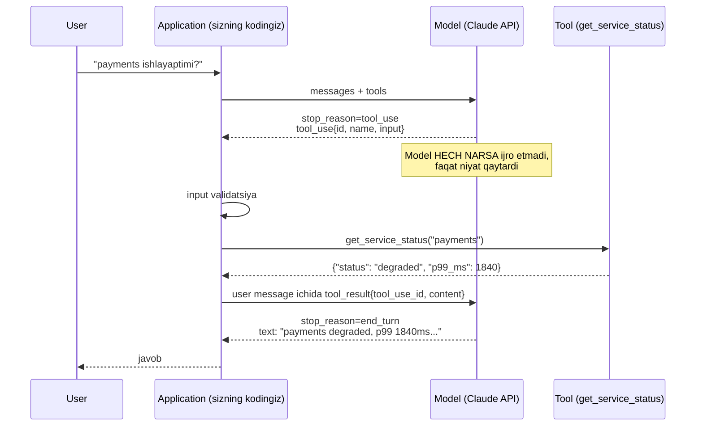
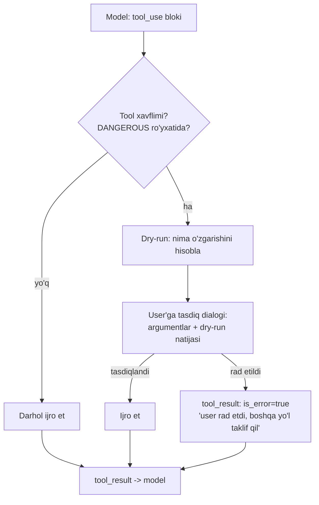

# 05. Tool use

Model o'z-o'zicha sizning Postgres'ingizni ko'rmaydi, Grafana'ga so'rov yubormaydi, deploy'ni qaytarmaydi. Tool use — bu modelga sizning API'ingizni berish va uni tizimga ulash usuli: aynan shu qatlam "chatbot"ni "agent"ga aylantiradi. Ish suhbatida "agent loop'ni tushuntiring", "tool argumenti noto'g'ri kelsa nima qilasiz", "cost'ni qanday cheklaysiz" degan savollar deyarli har safar tushadi — bu darsda o'sha javoblarni kod bilan yozamiz.

---

## Nazariya (~30%)

### 1. Model yopiq dunyoda yashaydi

Model — bu weight'larga muzlatilgan matn davomchisi. Undan tashqarida:

| Cheklov | Nima demak |
|---|---|
| Training cutoff | Kechagi incident, bugungi narx, sizning oxirgi release'ingiz — yo'q |
| Private data | Sizning DB, S3, internal wiki — training'da bo'lmagan |
| Arifmetika | `1_247_913 * 0.07` ni token-token "taxmin qiladi", hisoblamaydi |
| Side effect | Faylni o'chira olmaydi, HTTP so'rov yubora olmaydi, alert yopa olmaydi |

Tool use — shu 4 teshikni yopish uchun. **Tool = modelga berilgan funksiya imzosi.**

Backend analogiyasi: model — bu handler'lari bo'lmagan orchestrator. Siz unga service registry (tool'lar ro'yxati) berasiz, u qaysi handler'ni qaysi argument bilan chaqirish kerakligini aytadi. RPC'ni esa **siz** bajarasiz.

### 2. Eng muhim intuitsiya: tool calling — sehr emas, baribir document completion

Bu darsning eng qimmatli fikri. Tool use API darajasida alohida "rejim" bo'lib ko'rinadi, lekin model uchun hech narsa o'zgarmagan — u baribir keyingi token'ni bashorat qilyapti.

Amalda: siz `tools=[...]` yuborganingizda, provayder tool ta'riflarini **system message ichiga matn sifatida** qo'shadi. OpenAI buni TypeScript namespace ko'rinishida qiladi, Anthropic — XML ko'rinishida (XML'da escape muammosi kamroq, shuning uchun uzun matnli argumentlarga chidamliroq).

Keyin model har token'da mayda klassifikatsiya qarorlarini ketma-ket qabul qiladi:

```
tool kerakmi?  ->  ha
qaysi tool?    ->  get_service_status
qaysi argument? ->  service
qiymat?        ->  "payments"
yana argument bormi? -> yo'q
yana tool bormi? -> yo'q
```

> Tool nomi va description — bu model uchun **yagona hujjat**. Model qaysi tool'ni chaqirishni sizning kodingizga qarab emas, o'sha bir necha jumlaga qarab hal qiladi. Yomon nom = 404.

Shu sabab ham tool'lar bir-biriga o'xshab ketsa (`search_user` va `find_user`), model tanlashda adashadi — bu sizning routing table'ingizda ikkita bir xil prefiksli route bo'lgani bilan bir xil.

### 3. Model kodni IJRO ETMAYDI

Model faqat "chaqiruv niyati"ni matn sifatida qaytaradi:

```json
{"type": "tool_use", "id": "toolu_01A...", "name": "get_service_status", "input": {"service": "payments"}}
```

Bu — hech narsa qilinmagan holat. Funksiyani chaqirish, argumentni validatsiya qilish, timeout qo'yish, natijani qaytarish — hammasi **sizning application'ingizda**.

> Xavfsizlikning butun asosi shu: model — bu tashqi client'dan kelgan so'rov. Uni ishonchsiz input sifatida ko'ring va har doim validatsiya qiling.

### 4. Agent loop = `while stop_reason == "tool_use"`

`stop_reason` — bu state machine'ning holati:

| stop_reason | Ma'nosi | Nima qilasiz |
|---|---|---|
| `end_turn` | Model gapini tugatdi | Loop'dan chiqasiz, javobni user'ga berasiz |
| `tool_use` | Model tool chaqirmoqchi | Tool'ni ijro etasiz, natijani qaytarasiz, loop davom etadi |
| `max_tokens` | Javob kesildi | `max_tokens` ni oshiring yoki vazifani bo'ling |



Diqqat: tool natijasi `role: "tool"` emas — **`role: "user"`** message ichidagi `tool_result` blok sifatida qaytariladi (OpenAI'dagi `role: "tool"` dan farqi shu).

### 5. Parallel tool calls

Model mustaqil tool'larni bitta javobda birdaniga chaqirishi mumkin — bitta assistant message ichida ikkita (yoki uchta) `tool_use` bloki bo'ladi. Bu latency'ni tejaydi: siz ularni goroutine'dagi kabi parallel ijro etasiz.

> Qat'iy qoida: barcha `tool_result` bloklari **BITTA** user message ichida qaytariladi. Har birini alohida message qilib yuborsangiz, model parallel chaqirishni "unutadi" va keyingi turn'larda tool'larni ketma-ket chaqira boshlaydi.

---

## Amaliyot (~70%) — PRIMM

Barcha misollar mustaqil ishga tushadi. `.env` da `ANTHROPIC_API_KEY` bor deb hisoblaymiz.

```bash
pip install anthropic python-dotenv
```

### Predict / Run

#### 1-misol. Minimal tool — loop'ni qo'lda yozamiz

Avval **bashorat qiling**: birinchi `messages.create` chaqiruvi `resp.content` ichida nima qaytaradi? Matn ham bo'ladimi, faqat tool_use bloki bo'ladimi? `stop_reason` nima bo'ladi?

```python
# file: 01_minimal_tool.py
import json
from dotenv import load_dotenv
import anthropic

load_dotenv()
client = anthropic.Anthropic()

# --- 1-qadam: tool ta'rifi. input_schema = oddiy JSON Schema ---
TOOLS = [
    {
        "name": "get_service_status",
        "description": (
            "Bitta microservice'ning joriy holatini monitoring tizimidan oladi. "
            "Foydalanuvchi biror servis ishlayaptimi, sekinmi yoki xato beryaptimi "
            "deb so'raganda chaqiring."
        ),
        "input_schema": {
            "type": "object",
            "properties": {
                "service": {
                    "type": "string",
                    "description": "Servis nomi, masalan: payments, auth, search",
                }
            },
            "required": ["service"],
        },
    }
]

# --- 2-qadam: tool'ning haqiqiy implementatsiyasi (bu yerda mock) ---
FAKE_DB = {
    "payments": {"status": "degraded", "p99_ms": 1840, "error_rate": 0.07},
    "auth": {"status": "healthy", "p99_ms": 45, "error_rate": 0.001},
}


def get_service_status(service: str) -> dict:
    if service not in FAKE_DB:
        raise KeyError(f"unknown service: {service}")
    return FAKE_DB[service]


messages = [{"role": "user", "content": "payments servisida muammo bormi?"}]

resp = client.messages.create(
    model="claude-opus-4-8",
    max_tokens=1024,
    tools=TOOLS,
    messages=messages,
)

print(resp.stop_reason)
for block in resp.content:
    print(block.type, getattr(block, "name", ""), getattr(block, "input", ""))

# Output:
# tool_use
# text
# tool_use get_service_status {'service': 'payments'}
```

Assistant message'ning shakli (soddalashtirilgan):

```python
# resp.content ->
# [
#   TextBlock(type="text", text="Tekshirib ko'raman."),
#   ToolUseBlock(type="tool_use", id="toolu_01Xy...", name="get_service_status",
#                input={"service": "payments"}),
# ]
```

Ya'ni javobda matn bloki ham, tool_use bloki ham bo'lishi mumkin. Kodingiz **hamma bloklarni** aylanib chiqishi shart, faqat `content[0]` ni olish — klassik xato.

Endi loop'ni yopamiz:

```python
# --- 3-qadam: assistant javobini tarixga qo'shamiz (o'zgartirmasdan) ---
messages.append({"role": "assistant", "content": resp.content})

# --- 4-qadam: har bir tool_use uchun funksiyani chaqiramiz ---
tool_results = []
for block in resp.content:
    if block.type == "tool_use":
        result = get_service_status(**block.input)
        tool_results.append(
            {
                "type": "tool_result",
                "tool_use_id": block.id,          # id MAJBURIY, moslash uchun
                "content": json.dumps(result),    # content — string yoki bloklar ro'yxati
            }
        )

# --- 5-qadam: natijalarni USER message sifatida qaytaramiz ---
messages.append({"role": "user", "content": tool_results})

final = client.messages.create(
    model="claude-opus-4-8",
    max_tokens=1024,
    tools=TOOLS,          # tools'ni QAYTA yuborish shart, aks holda 400
    messages=messages,
)
print(final.stop_reason)
print(final.content[0].text)

# Output:
# end_turn
# Ha, payments servisi degraded holatda: p99 latency 1840 ms (juda yuqori),
# error rate 7%. auth bilan solishtirsak (45 ms, 0.1%) — muammo aynan payments'da.
```

Diqqat qiling: `tools` ro'yxati **har bir** so'rovda yuboriladi. Tarixda `tool_use` bloki bor, lekin `tools` yo'q bo'lsa — API 400 qaytaradi.

#### 2-misol. Ikkita tool + parallel chaqiruv

Bashorat: model `get_disk_usage` va `get_memory_usage` ni ketma-ket chaqiradimi, yoki bitta javobda ikkalasini birdanmi?

```python
# file: 02_parallel_tools.py
import json
from dotenv import load_dotenv
import anthropic

load_dotenv()
client = anthropic.Anthropic()

TOOLS = [
    {
        "name": "get_disk_usage",
        "description": "Host'ning disk band bandligini foizda qaytaradi.",
        "input_schema": {
            "type": "object",
            "properties": {"host": {"type": "string"}},
            "required": ["host"],
        },
    },
    {
        "name": "get_memory_usage",
        "description": "Host'ning RAM band bandligini foizda qaytaradi.",
        "input_schema": {
            "type": "object",
            "properties": {"host": {"type": "string"}},
            "required": ["host"],
        },
    },
]

REGISTRY = {
    "get_disk_usage": lambda host: {"host": host, "disk_used_pct": 91},
    "get_memory_usage": lambda host: {"host": host, "mem_used_pct": 43},
}

messages = [
    {"role": "user", "content": "db-01 hostida disk va RAM holati qanday?"}
]

resp = client.messages.create(
    model="claude-opus-4-8",
    max_tokens=1024,
    tools=TOOLS,
    messages=messages,
)

print(resp.stop_reason)
print([b.name for b in resp.content if b.type == "tool_use"])

# Output:
# tool_use
# ['get_disk_usage', 'get_memory_usage']     <- BITTA javobda IKKITA tool_use
```

Ikkala natijani **bitta** user message'da qaytaramiz:

```python
messages.append({"role": "assistant", "content": resp.content})

tool_results = []
for block in resp.content:
    if block.type == "tool_use":
        fn = REGISTRY[block.name]
        tool_results.append(
            {
                "type": "tool_result",
                "tool_use_id": block.id,
                "content": json.dumps(fn(**block.input)),
            }
        )

# TO'G'RI: ikkala tool_result bitta message ichida
messages.append({"role": "user", "content": tool_results})

# XATO bo'lardi:
# messages.append({"role": "user", "content": [tool_results[0]]})
# messages.append({"role": "user", "content": [tool_results[1]]})

final = client.messages.create(
    model="claude-opus-4-8", max_tokens=1024, tools=TOOLS, messages=messages
)
print(final.content[-1].text)

# Output:
# db-01: disk 91% band (kritik chegaraga yaqin), RAM 43% (normal).
# Asosiy xavf — disk: 9% bo'sh joy qolgan.
```

Ikkinchi xato varianti API darajasida ham yiqiladi: agar assistant message'da 2 ta `tool_use` bo'lsa, keyingi user message'da **hammasiga** `tool_result` bo'lishi shart. Bittasini tushirib qoldirsangiz — 400.

#### 3-misol. Tool xatosini boshqarish (`is_error`)

Tool exception tashladi. Ikki yomon variant: (a) exception'ni yuqoriga otib yuborish — agent o'ladi; (b) xom stack trace'ni model'ga qaytarish — model uni tuzata olmaydi va ba'zan uni "javob" deb user'ga ko'rsatadi.

To'g'ri variant: **strukturalangan, model tuzata oladigan xabar**.

```python
# file: 03_tool_error.py
import json
from dotenv import load_dotenv
import anthropic

load_dotenv()
client = anthropic.Anthropic()

TOOLS = [
    {
        "name": "get_service_status",
        "description": "Servis holatini monitoring'dan oladi.",
        "input_schema": {
            "type": "object",
            "properties": {"service": {"type": "string"}},
            "required": ["service"],
        },
    }
]

KNOWN = ["payments", "auth", "search"]


def run_tool(name: str, args: dict) -> dict:
    """Har doim {'content': str, 'is_error': bool} qaytaradi."""
    try:
        service = args["service"]
        if service not in KNOWN:
            # Model TUZATA OLADIGAN xabar: nima xato + qanday to'g'rilash mumkin
            raise ValueError(
                f"'{service}' nomli servis yo'q. "
                f"Mavjud servislar: {', '.join(KNOWN)}. "
                f"Ulardan birini tanlab qayta chaqiring."
            )
        return {"content": json.dumps({"status": "healthy"}), "is_error": False}
    except Exception as e:
        return {"content": str(e), "is_error": True}   # stack trace EMAS


messages = [{"role": "user", "content": "billing servisi tirikmi?"}]

for _ in range(5):
    resp = client.messages.create(
        model="claude-opus-4-8", max_tokens=1024, tools=TOOLS, messages=messages
    )
    if resp.stop_reason != "tool_use":
        break

    messages.append({"role": "assistant", "content": resp.content})
    results = []
    for block in resp.content:
        if block.type == "tool_use":
            out = run_tool(block.name, block.input)
            print(f"CALL {block.name}({block.input}) -> is_error={out['is_error']}")
            results.append(
                {
                    "type": "tool_result",
                    "tool_use_id": block.id,
                    "content": out["content"],
                    "is_error": out["is_error"],
                }
            )
    messages.append({"role": "user", "content": results})

print(resp.content[-1].text)

# Output:
# CALL get_service_status({'service': 'billing'}) -> is_error=True
# CALL get_service_status({'service': 'payments'}) -> is_error=False
# "billing" nomli servis mavjud emas. Eng yaqin nomzod — payments,
# u healthy holatda. Sizga aynan qaysi servis kerakligini aniqlashtiring.
```

Ko'rdingizmi: model xato xabarini o'qidi, argumentni **o'zi tuzatdi** va qayta chaqirdi. Bu faqat xabar ma'noli bo'lgani uchun ishladi. `KeyError: 'billing'` degan matn bilan model hech narsa qila olmasdi.

#### 4-misol. Iteratsiya limiti va cost budget — majburiy

Real falokat: Claude Code instance'i rekursiv loop'ga tushib qolgan va 5 soatda **1.67 milliard token** yoqib yuborgan (taxminan $16k-$50k). Eng muhimi: **model xato bermagan.** U shunchaki tool chaqiraverdi, natijadan qoniqmadi, yana chaqirdi. Hech qanday exception, hech qanday alert — faqat hisob.

Agent loop — bu `while (true)`. Uni cheklamasangiz, u sizni cheklaydi.

```python
# file: 04_budget_loop.py
import json
from dotenv import load_dotenv
import anthropic

load_dotenv()
client = anthropic.Anthropic()

MODEL = "claude-opus-4-8"
PRICE_IN = 5 / 1_000_000     # $ / input token
PRICE_OUT = 25 / 1_000_000   # $ / output token


def agent_loop(user_msg, tools, registry, max_iterations=10, max_usd=0.50):
    messages = [{"role": "user", "content": user_msg}]
    spent = 0.0

    for i in range(max_iterations):
        resp = client.messages.create(
            model=MODEL, max_tokens=1024, tools=tools, messages=messages
        )

        # --- har iteratsiyada usage'ni yig'amiz ---
        spent += (
            resp.usage.input_tokens * PRICE_IN
            + resp.usage.output_tokens * PRICE_OUT
        )
        print(f"iter={i} stop={resp.stop_reason} spent=${spent:.4f}")

        if resp.stop_reason != "tool_use":
            return {"ok": True, "text": resp.content[-1].text, "usd": spent}

        if spent > max_usd:
            # Budjet tugadi: loop'ni uzamiz, jimgina davom ETMAYMIZ
            return {"ok": False, "reason": "budget_exceeded", "usd": spent}

        messages.append({"role": "assistant", "content": resp.content})
        results = []
        for block in resp.content:
            if block.type == "tool_use":
                fn = registry[block.name]
                results.append(
                    {
                        "type": "tool_result",
                        "tool_use_id": block.id,
                        "content": json.dumps(fn(**block.input)),
                    }
                )
        messages.append({"role": "user", "content": results})

    return {"ok": False, "reason": "max_iterations", "usd": spent}


# Output (normal holat):
# iter=0 stop=tool_use spent=$0.0071
# iter=1 stop=end_turn spent=$0.0134
# {'ok': True, 'text': '...', 'usd': 0.0134}
#
# Output (rekursiv loop holati):
# iter=0 ... iter=9 stop=tool_use spent=$0.2210
# {'ok': False, 'reason': 'max_iterations', 'usd': 0.221}
```

Ikkala to'siq ham kerak:

| To'siq | Nimadan himoya qiladi |
|---|---|
| `max_iterations` (10-15) | Model bir xil tool'ni takror chaqirayotgan cheksiz loop |
| `max_usd` budget | Kam iteratsiya, lekin ulkan kontekst (har iteratsiyada tarix o'sadi -> input token kvadratik o'sadi) |

Ikkinchi qatorga alohida e'tibor bering: agent loop'da har iteratsiyada butun tarix qayta yuboriladi. 10 iteratsiya = 10 marta o'sib boruvchi input. Shuning uchun faqat iteratsiya sanash yetmaydi.

Ishlab chiqarishda bularning ustiga: `spent` ni metrika sifatida eksport qiling (Prometheus counter) va per-user kunlik limit qo'ying — aks holda bitta user butun oylik byudjetni yoqib yuborishi mumkin.

#### 5-misol. Xavfli tool'lar: prompt YETARLI EMAS

Ko'p odam shunday qiladi:

```python
system = "delete_deployment tool'ini chaqirishdan oldin ALBATTA foydalanuvchidan tasdiq so'rang."
```

Bu **yetarli emas**. Model bu ko'rsatmani ko'p hollarda bajaradi, lekin vaqti-vaqti bilan buzadi — ayniqsa uzun suhbatda, yoki user "tez bo'l, shoshyapman" deganda. Ehtimollik modelidan determinizm talab qilyapsiz.

To'g'ri yechim: modelga chaqirishga **ruxsat bering**, lekin **application qatlamida intercept qiling**.



```python
# file: 05_dangerous_tool.py
import json
from dotenv import load_dotenv
import anthropic

load_dotenv()
client = anthropic.Anthropic()

TOOLS = [
    {
        "name": "list_deployments",
        "description": "Namespace'dagi deployment'lar ro'yxatini qaytaradi.",
        "input_schema": {
            "type": "object",
            "properties": {"namespace": {"type": "string"}},
            "required": ["namespace"],
        },
    },
    {
        "name": "delete_deployment",
        "description": (
            "Deployment'ni o'chiradi. Foydalanuvchi aniq o'chirishni so'raganda chaqiring."
        ),
        "input_schema": {
            "type": "object",
            "properties": {
                "namespace": {"type": "string"},
                "name": {"type": "string"},
            },
            "required": ["namespace", "name"],
        },
    },
]

DANGEROUS = {"delete_deployment"}          # qaytarilmas amallar
STATE = {"prod": ["api-v3", "api-v2-legacy", "worker"]}


def dry_run(name: str, args: dict) -> str:
    if name == "delete_deployment":
        pods = 4 if args["name"] == "api-v3" else 1
        return (
            f"O'chiriladi: {args['namespace']}/{args['name']} "
            f"({pods} pod to'xtaydi, qaytarib bo'lmaydi)"
        )
    return ""


def execute(name: str, args: dict) -> dict:
    if name == "list_deployments":
        return {"deployments": STATE.get(args["namespace"], [])}
    if name == "delete_deployment":
        STATE[args["namespace"]].remove(args["name"])
        return {"deleted": args["name"]}
    raise ValueError(f"unknown tool: {name}")


def run_with_approval(name: str, args: dict) -> dict:
    """Xavfli tool'ni APPLICATION qatlamida ushlab qolamiz."""
    if name not in DANGEROUS:
        return {"content": json.dumps(execute(name, args)), "is_error": False}

    print("\n[APPROVAL KERAK]")
    print(dry_run(name, args))
    answer = input("Tasdiqlaysizmi? (yes/no): ").strip().lower()

    if answer != "yes":
        return {
            "content": (
                "Foydalanuvchi bu amalni RAD ETDI. Qayta urinmang. "
                "Boshqa yo'l taklif qiling yoki nima uchun kerakligini so'rang."
            ),
            "is_error": True,
        }
    return {"content": json.dumps(execute(name, args)), "is_error": False}


# Output (user "no" deganda):
# [APPROVAL KERAK]
# O'chiriladi: prod/api-v2-legacy (1 pod to'xtaydi, qaytarib bo'lmaydi)
# Tasdiqlaysizmi? (yes/no): no
#
# Model javobi:
# Tushunarli, o'chirishni bekor qildim. Agar maqsad joyni bo'shatish bo'lsa,
# avval api-v2-legacy ga trafik kelayotganini tekshirishni taklif qilaman.
```

Uch nuqta bu yerda muhim:

1. **Dry-run** — user "yes" bosishdan oldin nima o'zgarishini ko'rsatadi. `terraform plan` mantiqi.
2. **Rad etish ham `tool_result`** — agent o'lmaydi, model kontekstni oladi va boshqa yo'l qidiradi.
3. **Ro'yxat kodda** (`DANGEROUS`), prompt'da emas. Prompt — tavsiya; kod — qonun.

### Investigate / Modify

Har bir mashqda avval **bashorat qiling**, keyin ishga tushiring va NEGA shunday bo'lganini tushuntiring.

**M1. Parallel tool_result'ni bo'lib yuboring.** 2-misolda ikkita `tool_result` ni ikkita alohida user message'ga bo'ling. Nima bo'ladi?

<details><summary>Kutilgan natija</summary>

API 400 qaytaradi: assistant message'dagi har bir `tool_use` uchun **keyingi bitta** user message'da mos `tool_result` bo'lishi shart. Agar API'ni aldab o'tsangiz ham (masalan tool'larni ketma-ket chaqirtirib), model keyingi turn'larda parallel chaqirishni to'xtatadi — chunki tarixda "bitta message = bitta natija" pattern'i o'rnashadi. Latency 2 barobar oshadi.
</details>

**M2. Description'dan trigger shartini olib tashlang.** 1-misolda description'ni shunchaki `"Servis holati."` ga qisqartiring va "payments bilan nima gap?" deb so'rang.

<details><summary>Kutilgan natija</summary>

Model tool'ni chaqirmasdan javob berishi mumkin ("Menda real vaqt ma'lumoti yo'q..."). Opus 4.8 tool'ga **kamroq qo'l uradi** — u ortiqcha chaqiruvdan qochadi. Shuning uchun description'da *qachon chaqirish kerakligi* aniq yozilishi shart: "Foydalanuvchi servis ishlayaptimi deb so'raganda chaqiring."
</details>

**M3. Agressiv til qo'shing.** Description boshiga `"CRITICAL: YOU MUST ALWAYS USE THIS TOOL FOR EVERY QUESTION!!!"` yozing va "salom, ishlar qalay?" deb so'rang.

<details><summary>Kutilgan natija</summary>

Model salomlashuvga ham `get_service_status` chaqiradi — **overtriggering**. 2023-2024 yillarda bunday agressiv til foydali edi (modellar tool'ni "unutardi"). Joriy modellarda instruction-following kuchli, shuning uchun agressiv til teskari ta'sir beradi: ortiqcha chaqiruv = ortiqcha latency + pul. To'g'ri uslub — xotirjam va aniq: "Use this tool when...".
</details>

**M4. `max_iterations=1` qo'ying.** 4-misolda limitni 1 ga tushiring.

<details><summary>Kutilgan natija</summary>

`{'ok': False, 'reason': 'max_iterations'}` — chunki birinchi iteratsiya `tool_use` qaytaradi va loop tugaydi. Muhim savol: bu holatda **user nima ko'radi?** Agar siz shunchaki exception tashlasangiz — yomon UX. To'g'ri: "Vazifa juda ko'p qadam talab qildi, aniqroq so'rang" + qisman natijani ko'rsatish. Cheklovga urilish — bu **kutilgan holat**, xato emas; uni shunday ishlang.
</details>

**M5. `is_error` ni olib tashlang.** 3-misolda xato matnini `is_error` siz oddiy `tool_result` sifatida qaytaring.

<details><summary>Kutilgan natija</summary>

Ko'pincha model baribir tuzatadi (matnni o'qiydi), lekin xavf bor: u xato matnini **muvaffaqiyatli natija** deb qabul qilib, user'ga "billing servisi mavjud emas: payments, auth, search" degan g'alati javob berishi mumkin. `is_error: true` — modelga "bu qadam muvaffaqiyatsiz" degan aniq signal. Bepul, shuning uchun har doim qo'ying.
</details>

**M6. Yomon tool ta'rifini yaxshisiga aylantiring.** Quyidagi ikkita ta'rifni solishtiring — bu production'dagi eng ko'p uchraydigan xatolar to'plami.

```python
# ❌ YOMON: web API'ni to'g'ridan-to'g'ri ko'chirish
{
    "name": "api_v2_query",                    # nom hech narsa demaydi
    "description": "Executes a query against the v2 endpoint.",  # qachon? nima uchun?
    "input_schema": {
        "type": "object",
        "properties": {
            "org": {"type": "string"},          # model buni qayerdan biladi?
            "repo": {"type": "string"},         # -> "my-org", "my-repo" hallucination
            "q": {"type": "string"},
            "sort": {"type": "string"},         # qanday qiymatlar mumkin?
            "order": {"type": "string"},
            "per_page": {"type": "integer"},
            "page": {"type": "integer"},
            "include_archived": {"type": "boolean"},
            "format": {"type": "string"},
        },
        "required": ["org", "repo", "q"],
    },
}
```

```python
# ✅ YAXSHI: model uchun loyihalangan
{
    "name": "search_issues",                    # self-documenting
    "description": (
        "Joriy repozitoriyadagi issue'larni matn bo'yicha qidiradi. "
        "Foydalanuvchi bug, ticket yoki issue haqida so'raganda chaqiring. "
        "Eng mos 10 ta natijani qaytaradi."     # QACHON chaqirish kerakligi aniq
    ),
    "input_schema": {
        "type": "object",
        "properties": {
            "query": {
                "type": "string",
                "description": "Qidiruv matni, masalan: 'payment timeout'",
            },
            "state": {
                "type": "string",
                "enum": ["open", "closed", "all"],   # enum -> hallucination yo'q
                "description": "Standart: open",
            },
        },
        "required": ["query"],                   # 8 ta emas, 1 ta majburiy argument
    },
}
```

Farqlar (yodda tuting — ish suhbatida shu ro'yxat so'raladi):

| Muammo | Yechim |
|---|---|
| `org`/`repo` — model bilmaydi, `"my-org"` deb to'qiydi (**argument hallucination**) | Qiymat sizga ma'lum -> argumentni **schema'dan olib tashlang**, kodda o'zingiz qo'ying |
| 9 ta argument — model adashadi, `page=1` ni tasodifiy o'zgartiradi | Kam va sodda argument; pagination'ni application hal qilsin |
| `sort`, `order` — erkin string, model qiymat to'qiydi | `enum` yoki default |
| Nom (`api_v2_query`) hech narsa demaydi | Self-documenting nom: `search_issues` |
| Description *nima* qilishini aytadi, *qachon* chaqirishni aytmaydi | Trigger shartini yozing: "Foydalanuvchi ... so'raganda chaqiring" |

> Umumiy qoida: tool — bu web API'ning ko'chirmasi emas, **model uchun loyihalangan interfeys**. Xuddi frontend uchun BFF (backend-for-frontend) yozganingizdek, bu ham "backend-for-model".

**M7. Tool'lar sonini oshiring.** 2-misolga yana 3 ta o'xshash tool qo'shing: `get_cpu_usage`, `get_load_average`, `get_host_metrics`. Uchinchisi birinchi ikkitasining ishini ham qiladi.

<details><summary>Kutilgan natija</summary>

Model qaysi birini tanlashni bilmaydi va ba'zan `get_host_metrics` ni, ba'zan alohida tool'larni chaqiradi — javob **beqaror** bo'ladi. Bu routing table'da bir-birini qoplaydigan route'lar bilan bir xil muammo. Yechim: tool'lar domenni **partition** qilsin (kesishmasin). Ustma-ust tushadigan tool bo'lsa — bittasini o'chiring.
</details>

### Make

**Challenge: 3 toolli mini-agent — log tahlilchi.**

Talab: `app.log` faylini tahlil qiladigan agent yozing.

Tool'lar:
- `search_logs(pattern: str, limit: int = 5)` — regex bo'yicha qatorlarni topadi
- `count_by_level()` — INFO/WARN/ERROR sonini qaytaradi
- `finish(summary: str)` — agent ishini tugatadi va xulosani qaytaradi

Shartlar:
1. `max_iterations = 8` va `max_usd = 0.20` — ikkalasi ham bo'lishi shart
2. Tool exception -> `is_error: true` + model tuzata oladigan xabar (masalan noto'g'ri regex)
3. `finish` chaqirilganda loop **darhol** to'xtaydi (model'dan yana javob so'ramaymiz)
4. So'rov: "Eng ko'p uchraydigan xato nima va u qaysi servisda?"

<details><summary>Yechim</summary>

```python
# file: 06_log_agent.py
import json
import re
from collections import Counter
from dotenv import load_dotenv
import anthropic

load_dotenv()
client = anthropic.Anthropic()

MODEL = "claude-opus-4-8"
PRICE_IN, PRICE_OUT = 5 / 1_000_000, 25 / 1_000_000

LOG = """\
2026-07-14 10:00:01 INFO  payments  charge ok id=1
2026-07-14 10:00:04 ERROR payments  upstream timeout after 3000ms
2026-07-14 10:00:09 WARN  auth      token near expiry
2026-07-14 10:00:11 ERROR payments  upstream timeout after 3000ms
2026-07-14 10:00:15 ERROR search    index shard unavailable
2026-07-14 10:00:19 ERROR payments  upstream timeout after 3000ms
2026-07-14 10:00:22 INFO  auth      login ok user=42
""".splitlines()

TOOLS = [
    {
        "name": "search_logs",
        "description": (
            "Log qatorlarini regex bo'yicha qidiradi. "
            "Aniq xato matnini yoki servis nomini topish kerak bo'lganda chaqiring."
        ),
        "input_schema": {
            "type": "object",
            "properties": {
                "pattern": {"type": "string", "description": "Python regex"},
                "limit": {"type": "integer", "description": "Standart: 5"},
            },
            "required": ["pattern"],
        },
    },
    {
        "name": "count_by_level",
        "description": (
            "Har bir log darajasi (INFO/WARN/ERROR) bo'yicha qatorlar sonini qaytaradi. "
            "Umumiy manzarani ko'rish uchun birinchi bo'lib chaqiring."
        ),
        "input_schema": {"type": "object", "properties": {}},
    },
    {
        "name": "finish",
        "description": (
            "Tahlil tugagach chaqiring. Xulosani beradi va ishni yakunlaydi. "
            "Boshqa tool chaqirishga hojat qolmaganda chaqiring."
        ),
        "input_schema": {
            "type": "object",
            "properties": {
                "summary": {"type": "string", "description": "2-3 jumlalik xulosa"}
            },
            "required": ["summary"],
        },
    },
]


def search_logs(pattern: str, limit: int = 5) -> dict:
    try:
        rx = re.compile(pattern)
    except re.error as e:
        raise ValueError(
            f"Noto'g'ri regex: {e}. Oddiy matn bo'lagi bilan qayta urinib ko'ring, "
            f"masalan: 'timeout' yoki 'ERROR'."
        )
    hits = [ln for ln in LOG if rx.search(ln)][:limit]
    return {"matches": hits, "total_shown": len(hits)}


def count_by_level() -> dict:
    return dict(Counter(ln.split()[2] for ln in LOG))


REGISTRY = {"search_logs": search_logs, "count_by_level": count_by_level}


def run_tool(name, args):
    try:
        return {"content": json.dumps(REGISTRY[name](**args)), "is_error": False}
    except Exception as e:
        return {"content": f"Tool xatosi: {e}", "is_error": True}


def agent(question, max_iterations=8, max_usd=0.20):
    messages = [{"role": "user", "content": question}]
    spent = 0.0

    for i in range(max_iterations):
        resp = client.messages.create(
            model=MODEL,
            max_tokens=1024,
            system=(
                "Sen log tahlilchi agentsan. Tool'lar bilan log'ni tekshir, "
                "xulosaga kelgach finish tool'ini chaqir."
            ),
            tools=TOOLS,
            messages=messages,
        )
        spent += (
            resp.usage.input_tokens * PRICE_IN + resp.usage.output_tokens * PRICE_OUT
        )
        print(f"[iter {i}] stop={resp.stop_reason} spent=${spent:.4f}")

        if resp.stop_reason != "tool_use":
            return {"ok": True, "text": resp.content[-1].text, "usd": spent}
        if spent > max_usd:
            return {"ok": False, "reason": "budget_exceeded", "usd": spent}

        messages.append({"role": "assistant", "content": resp.content})
        results = []
        for block in resp.content:
            if block.type == "tool_use":
                # finish -> loop'ni DARHOL to'xtatamiz
                if block.name == "finish":
                    return {"ok": True, "text": block.input["summary"], "usd": spent}
                print(f"  -> {block.name}({block.input})")
                out = run_tool(block.name, block.input)
                results.append(
                    {
                        "type": "tool_result",
                        "tool_use_id": block.id,
                        "content": out["content"],
                        "is_error": out["is_error"],
                    }
                )
        messages.append({"role": "user", "content": results})

    return {"ok": False, "reason": "max_iterations", "usd": spent}


print(agent("Eng ko'p uchraydigan xato nima va u qaysi servisda?"))

# Output:
# [iter 0] stop=tool_use spent=$0.0089
#   -> count_by_level({})
# [iter 1] stop=tool_use spent=$0.0201
#   -> search_logs({'pattern': 'ERROR', 'limit': 10})
# [iter 2] stop=tool_use spent=$0.0338
# {'ok': True,
#  'text': "Eng ko'p uchraydigan xato — payments servisidagi 'upstream timeout
#           after 3000ms' (4 ta ERROR'dan 3 tasi). Qolgan bitta ERROR — search
#           servisidagi shard muammosi. Asosiy e'tibor payments upstream'iga.",
#  'usd': 0.0338}
```

E'tibor bering: `finish` tool'i modelga "tugatdim" deyishning **strukturalangan** usulini beradi. `end_turn` ni kutish ham mumkin edi, lekin ko'p toolli agentlarda `finish` ishonchliroq: model xulosani belgilangan schema bilan qaytaradi va sizning kodingiz uni parse qilmaydi.
</details>

---

## Bundan keyin nima bor (qisqacha)

Bu darsda agent loop'ni **qo'lda** yozdik — bu ataylab. Ustiga qo'yiladigan qatlamlarni bilib qo'ying, lekin ularni 5-bo'lim ("AI Agents") da chuqur ochamiz:

- **ReAct** (think -> act -> observe) — bugungi agent loop aslida shuning o'zi. Yagona farq: "think" qadami endi prompt'dagi pattern emas, modelning o'z reasoning'i.
- **MCP (Model Context Protocol)** — tool'larni har bir application'da qayta yozmaslik uchun standart protokol: tool server alohida process, client uni discover qiladi. Bir tool -> ko'p application.
- **Tool runner / SDK helper'lar** — loop'ni siz uchun yozib beradigan abstraksiyalar. Foydali, lekin ular ichida aynan shu dars kodini bajaradi. Abstraksiya sinsa, loop'ni qo'lda debug qila olishingiz kerak.

Structured output darsidagi bilim shu yerda ham ishlaydi: tool'ning `input_schema` — bu o'sha JSON Schema, va model unga constrained decoding bilan bo'ysunadi (qarang: [04. Structured output.md](./04.%20Structured%20output.md)).

---

## Retrieval practice

1. Model `tool_use` bloki qaytardi. Shu daqiqada sizning serveringizda nima o'zgardi? Nega?
2. Bitta assistant javobida 3 ta `tool_use` bloki bor. Nechta user message yuborasiz va nima uchun? Ikkitaga bo'lsangiz nima buziladi?
3. Tool `KeyError` tashladi. Model'ga aynan nima yuborasiz — stack trace'ni, `"error"` degan stringni, yoki boshqa narsani? Javobingizni asoslang.
4. System prompt'ga "o'chirishdan oldin tasdiq so'ra" deb yozdingiz. Nega bu production'da yetarli emas va o'rniga nima qilasiz?
5. Agent loop'ida `max_iterations=15` bor, lekin `max_usd` yo'q. Qanday stsenariyda 15 iteratsiya ham sizni $500 lik hisobdan qutqarmaydi?
6. Tool'ning `input_schema` sida `org` va `repo` argumentlari bor, lekin ularning qiymatini application allaqachon biladi. Nima bo'ladi va nima qilish kerak?

---

## Manbalar

- **Berryman & Ziegler, "Prompt Engineering for LLMs" (O'Reilly, 2024)** — Ch 8 "Conversational Agency": tool use mexanikasi, "under the hood" (tool ta'riflari system message'da), tool design qoidalari, xavfli tool'lar va application-level approval, ReAct.
- **Chip Huyen, "AI Engineering" (O'Reilly, 2025)** — Ch 5: prompt'larni kod'dan ajratish, impactful command'larga human approval; Ch 2: structured output agentic workflow'da (tool input sifatida).
- Anthropic docs — Tool use overview: https://platform.claude.com/docs/en/build-with-claude/tool-use/overview
- Anthropic docs — Implement tool use: https://platform.claude.com/docs/en/build-with-claude/tool-use/implement-tool-use
- Anthropic engineering — "Writing effective tools for agents": https://www.anthropic.com/engineering/writing-tools-for-agents
- Model Context Protocol: https://modelcontextprotocol.io

> ⚠️ Berryman kitobi tool call'larni OpenAI'ning `role: "tool"` message'lari bilan ko'rsatadi. Claude API'da natija **user** message ichidagi `tool_result` bloki bo'lib qaytariladi, va bitta javobdagi barcha natijalar **bitta** message'da bo'lishi shart. Mexanika bir xil, format boshqa.
