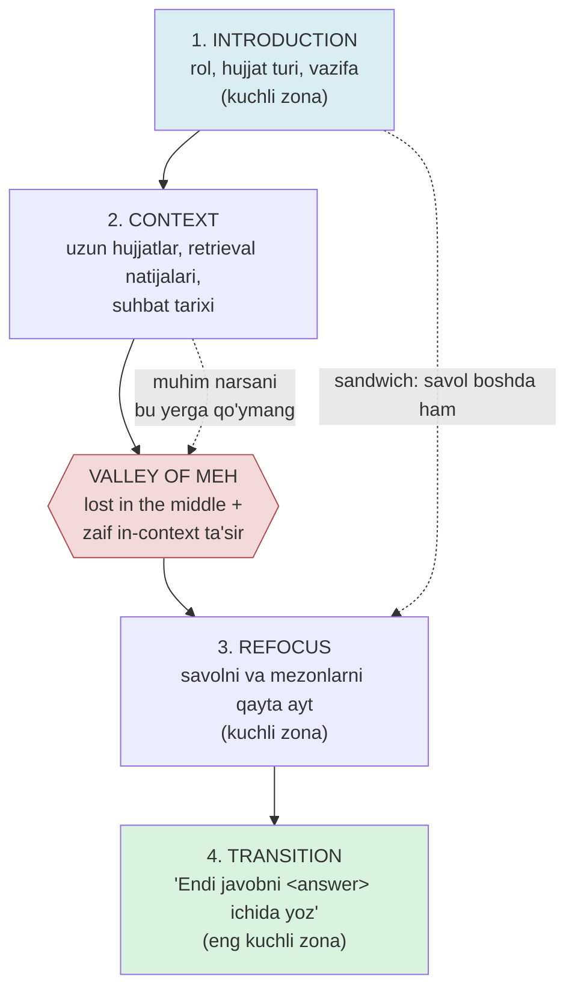

# 06. Prompt engineering asoslari

Production'da model tanlash bir marta bo'ladi, prompt esa har hafta o'zgaradi — va aynan prompt regressiyasi tufayli "hech narsa deploy qilmadik, lekin sifat tushdi" degan incident'lar tug'iladi. Ish suhbatida "prompt'ni qanday versiyalaysiz, A/B qilasiz va qaytarasiz (rollback)?" degan savol texnik savol sifatida beriladi: prompt — bu kod artefakti, string emas. Bu dars prompt'ni matn sifatida emas, **application qatlami** sifatida loyihalashga o'rgatadi.

---

## Nazariya (~30%)

### 1. Prompt engineering = so'z terish emas, qatlam dizayni

Berryman buni **The Loop** deb ataydi:

```
user muammosi -> [model domain'ga konvertatsiya] -> LLM completion -> [user domain'ga qaytarish] -> yechim
```

Backend tilida: LLM — bu tashqi servis, u **faqat matn tilida gapiradi**, request schema'si yo'q, response schema'si ham yo'q, va u har doim 200 qaytaradi (body kutganingizdan boshqacha bo'lsa ham). Demak siz bu servis uchun **serializer** (prompt) va **deserializer** (parser) ni o'zingiz yozasiz. Prompt engineering — shu ikki funksiyani loyihalash.

Prompt engineering darajalari (Berryman Ch1):

| Daraja | Nima qilinadi | Backend ekvivalenti |
|---|---|---|
| 1. Yupqa qatlam | User matnini deyarli o'zgarishsiz uzatish | Reverse proxy |
| 2. Kontekstni boyitish | Retrieval, tarix, boilerplate qo'shish | Request enrichment middleware |
| 3. Agency | Modelga tool va qaror erkinligi | Orkestrator / state machine |

Bu dars — 2-darajaning poydevori.

### 2. Little Red Riding Hood printsipi

Model **training datasidagi hujjatlarni mimic qiladi**. Shuning uchun prompt'ingiz model minglab marta ko'rgan hujjat turiga o'xshasa — completion barqaror bo'ladi. Berryman buni "yo'ldan chiqmang" (Little Red Riding Hood) deb ataydi.

> Tanish hujjat turlari: markdown report, chat transcript, XML/structured document, code file with comments. Notanish: sizning boshingizda tug'ilgan maxsus format.

Backend analogiyasi: peer servis HTTP/JSON tushunadi — unga o'zingiz o'ylab topgan binar protokolni yubormang. Ikkinchi oqibat: **grammatika uslubni chaqiradi**. Prompt'da typo va sinlashmagan gaplar bo'lsa, model "bu qoralama hujjat" deb qaror qiladi va javobni ham qoralama sifatida yozadi.

### 3. Prompt anatomiyasi va Valley of Meh

Berryman Ch6 ideal prompt strukturasi:

1. **Introduction** — hujjat turi, rol, vazifa (model "thought budget"ini erta yo'naltiradi)
2. **Context** — hujjatlar, misollar, tarix (eng katta, eng o'zgaruvchan qism)
3. **Refocus** — asosiy savol/mezonlarni qayta eslatish
4. **Transition** — muammo bayonidan yechimga qat'iy o'tish

Nega bu tartib? Ikkita effekt bir vaqtda ishlaydi:

- **In-context learning** — prompt oxiriga yaqin ma'lumot kuchliroq ta'sir qiladi
- **Lost in the middle** (Liu 2023) — model boshi va oxirini o'rtasidan yaxshiroq tushunadi

Ikkalasini qo'shsangiz — **Valley of Meh**: prompt o'rtasi eng zaif zona.



Bundan ikkita amaliy qoida chiqadi:

> **Rasmiy Claude qoidasi:** uzun hujjatni prompt'ning **yuqorisiga**, savolni **oxiriga** qo'ying. Uzun kontekstli vazifalarda bu 30% gacha sifat o'sishi beradi.

> **Sandwich texnikasi:** vazifani boshda qisqa ayting, oxirida to'liq takrorlang. Sabab (Berryman word-count misoli): agar savol hujjatdan keyin kelsa, model hujjatni **o'qiyotganda** nimaga e'tibor berishni bilmaydi; agar savol faqat boshda bo'lsa — u Valley of Meh'ga tushib qoladi.

### 4. Static va dynamic kontent

| | Static | Dynamic |
|---|---|---|
| Ta'rif | Har so'rovda bir xil | Har so'rovda boshqacha |
| Nima kiradi | Rol, vazifa ta'rifi, output format, cheklovlar, few-shot misollar | User matni, RAG natijalari, suhbat tarixi, DB'dan olingan fakt |
| Maqsadi | **Consistency** — barcha inputlar bir xil mezon bilan qayta ishlanadi | Savolning **obyekti** haqidagi ma'lumot |
| Qayerda turadi | System prompt / prompt boshi | User message oxiri |

Bu bo'linish faqat nazariy emas — u to'g'ridan-to'g'ri **pulga** aylanadi:

> **Cache-friendly tartib:** barqaror kontent oldinda, o'zgaruvchan kontent oxirida. Prompt prefiksidagi bitta bayt o'zgarsa, undan keyingi hamma narsa cache'dan tushadi. Shuning uchun `datetime.now()` ni system prompt'ga yozish = cache'ni o'ldirish. (Prompt caching kursning keyingi bo'limlarida alohida chuqur ko'riladi.)

### 5. Rasmiy 2026 qoidalari — checklist

1. **Clear va direct.** Prompt'ni "aqlli, lekin sizning kontekstingizni bilmaydigan yangi xodim"ga bering. U chalkashsa — model ham chalkashadi.
2. **Sababni ayting.** `NEVER use ellipses` emas, `javob text-to-speech bilan o'qiladi, shuning uchun ellipsis ishlatmang`. Model sababdan **umumlashtiradi** va siz o'ylamagan holatlarni ham to'g'ri hal qiladi.
3. **3-5 misol**, relevant va xilma-xil (edge case'lar bilan), `<example>` teglarida.
4. **XML teglar** — instruction / context / examples / input ni ajratish uchun. Claude XML'ga maxsus moslashgan.
5. **Rol — system prompt'da.** Bitta jumla ham natijani o'zgartiradi.
6. **"Nima qilma" emas, "nima qil".** Negativ ko'rsatma modelga taqiqlangan narsani "eslatib" turadi.
7. **Prompt uslubi javob uslubiga ta'sir qiladi.** Markdown'siz prompt → markdown'siz javob.
8. **Grounding:** "avval tegishli iqtiboslarni `<quotes>` ichida ko'chir, keyin javob ber".

### 6. Few-shot'ning 3 kamchiligi (Berryman Ch5)

Few-shot — formatni o'rgatishning eng oson yo'li, lekin uchta tuzog'i bor:

| Kamchilik | Nima bo'ladi | Yechim |
|---|---|---|
| **Yomon scale bo'ladi** | Uzun kontekstli misollar attention'ni chalkashtiradi | Kontekst katta bo'lsa — misol emas, aniq ko'rsatma |
| **Anchoring bias** | Misollar **taqsimoti** modelga kutilma o'rnatadi (har baho bir marta ko'rsatilsa → model uniform taqsimot deb o'ylaydi) | Real taqsimotdan reprezentativ sample oling |
| **Spurious pattern** | Misollar **tartibi** (ascending, "happy path first") natijani buzadi | Misollarni **shuffle** qiling |

---

## Amaliyot (~70%)

Barcha misollar mustaqil ishga tushadi. Umumiy tayyorgarlik:

```bash
pip install anthropic python-dotenv pydantic
echo 'ANTHROPIC_API_KEY=sk-ant-...' > .env
```

```python
# common.py — barcha misollar shu helper'dan foydalanadi
import anthropic
from dotenv import load_dotenv

load_dotenv()
client = anthropic.Anthropic()

def ask(system: str, user: str, model: str = "claude-opus-4-8") -> str:
    resp = client.messages.create(
        model=model,
        max_tokens=1024,
        system=system,
        messages=[{"role": "user", "content": user}],
    )
    return "".join(b.text for b in resp.content if b.type == "text")
```

### Predict / Run

#### 1-mashq: bitta vazifa, 4 xil prompt

Vazifa: support ticket'ni triage qilish (kategoriya + severity + javob-loyiha).

> **Ishga tushirishdan oldin bashorat qil:** qaysi variant JSON qaytaradi? Qaysi variantda `severity` qiymatlari 10 ta chaqiruvda ham bir xil bo'ladi? Qaysi variant eng ko'p output token yoqadi?

```python
# 01_four_prompts.py
from common import ask, client

TICKET = """Kecha 21:40 dan boshlab /api/v2/orders 502 qaytaryapti.
Faqat mobil ilovadan, web'da muammo yo'q. Buyurtma qabul qila olmayapmiz, 3 soat bo'ldi."""

# --- 1: yalang'och prompt (rol yo'q, format yo'q) ---
P1_SYS = ""
P1_USER = f"Bu ticketni tahlil qil:\n{TICKET}"

# --- 2: rol qo'shilgan (system prompt) ---
P2_SYS = (
    "Sen SaaS platformasining on-call support muhandisisan. "
    "Ticketlarni triage qilasan: kategoriya, severity va birinchi qadam."
)
P2_USER = f"Ticket:\n{TICKET}"

# --- 3: XML strukturali + aniq output format + sabab ---
P3_SYS = """Sen SaaS platformasining on-call support muhandisisan.

<task>
Ticketni triage qil va natijani <triage> tegi ichida JSON sifatida qaytar.
</task>

<schema>
{"category": "incident|bug|question|billing",
 "severity": "sev1|sev2|sev3",
 "affected_surface": "mobile|web|both|unknown",
 "first_step": "bitta jumla"}
</schema>

<rules>
- Javob to'g'ridan-to'g'ri PagerDuty API'ga yuboriladi, shuning uchun <triage> tegidan
  tashqarida hech narsa yozma (preamble ham, izoh ham).
- sev1 = pul oqimi to'xtagan yoki ma'lumot yo'qolyapti.
- Ma'lumot yetmasa "unknown" yoz, taxmin qilma.
</rules>"""
P3_USER = f"<ticket>\n{TICKET}\n</ticket>"

# --- 4: XML + few-shot (3 misol, xilma-xil, aralashtirilgan tartibda) ---
P4_SYS = P3_SYS + """

<examples>
<example>
<ticket>Hisob-fakturada QQS noto'g'ri hisoblanibdi, 12% o'rniga 15%.</ticket>
<triage>{"category":"billing","severity":"sev3","affected_surface":"unknown",
"first_step":"Billing jamoasiga eskalatsiya, tarif konfiguratsiyasini tekshirish"}</triage>
</example>
<example>
<ticket>Prod DB'da replikatsiya to'xtadi, read replica 40 daqiqa orqada.</ticket>
<triage>{"category":"incident","severity":"sev1","affected_surface":"both",
"first_step":"Replikatsiya slot'ini va WAL hajmini tekshirish, trafikni primary'ga o'tkazish"}</triage>
</example>
<example>
<ticket>Qanday qilib API kalitimni almashtiraman?</ticket>
<triage>{"category":"question","severity":"sev3","affected_surface":"unknown",
"first_step":"Docs'dagi key rotation bo'limiga havola yuborish"}</triage>
</example>
</examples>"""
P4_USER = P3_USER

for name, (sys_p, usr_p) in {
    "1-yalang'och": (P1_SYS, P1_USER),
    "2-rol": (P2_SYS, P2_USER),
    "3-XML": (P3_SYS, P3_USER),
    "4-XML+few-shot": (P4_SYS, P4_USER),
}.items():
    out = ask(sys_p, usr_p)
    tokens = client.messages.count_tokens(
        model="claude-opus-4-8",
        system=sys_p or "-",
        messages=[{"role": "user", "content": usr_p}],
    ).input_tokens
    print(f"\n===== {name} (input: {tokens} token) =====")
    print(out[:400])

# Output (qisqartirilgan):
# ===== 1-yalang'och (input: 62 token) =====
# Ticket tahlili:
# **Muammo:** /api/v2/orders endpoint'i 502 xato qaytaryapti...
# **Mumkin bo'lgan sabablar:** 1) Backend service ishdan chiqqan 2) Load balancer...
# (erkin markdown, har chaqiruvda boshqa struktura, parse qilib bo'lmaydi)
#
# ===== 2-rol (input: 91 token) =====
# **Kategoriya:** Incident
# **Severity:** SEV-2
# **Birinchi qadam:** Mobile gateway loglarini tekshirish...
# (struktura bor, lekin kalitlar nomi va shkala har safar o'zgarishi mumkin)
#
# ===== 3-XML (input: 214 token) =====
# <triage>{"category":"incident","severity":"sev1","affected_surface":"mobile",
# "first_step":"Mobil gateway va /api/v2/orders upstream health'ini tekshirish"}</triage>
#
# ===== 4-XML+few-shot (input: 412 token) =====
# <triage>{"category":"incident","severity":"sev1","affected_surface":"mobile",
# "first_step":"Mobil API gateway upstream'ini va 502 qaytarayotgan pod'larni tekshirish"}</triage>
```

Nima o'rgandik:

- 1 va 2 — **parse qilib bo'lmaydi**. Ular demo uchun yaxshi, production uchun yaroqsiz.
- 3 — birinchi ishlaydigan variant. E'tibor bering: `<rules>` da **sabab aytilgan** ("javob PagerDuty API'ga yuboriladi") — shuning uchun model preamble yozmaydi.
- 4 — few-shot severity chegarasini aniqlashtiradi, lekin input 2 barobar o'sdi. Agar 3-variant allaqachon barqaror bo'lsa — few-shot **kerak emas** (Berryman: "muammo shundoq ham ravshan bo'lsa, few-shot ishlatmang").

#### 2-mashq: "sababni ayting" qoidasi

```python
# 02_reason_why.py
from common import ask

QUESTION = "Postgres'da connection pool nima uchun kerak? Qisqa tushuntir."

BAD = "Hech qachon markdown, bullet list, sarlavha yoki emoji ishlatma."

GOOD = ("Javobing to'g'ridan-to'g'ri text-to-speech dvigateliga uzatiladi va ovoz "
        "chiqarib o'qiladi, shuning uchun matn ovozli o'qishga mos bo'lsin: "
        "markdown belgilar, bullet, sarlavha va emoji ovozda ma'nosiz chiqadi.")

print("--- TAQIQ ---\n", ask(BAD, QUESTION)[:300])
print("\n--- SABAB ---\n", ask(GOOD, QUESTION)[:300])

# Output:
# --- TAQIQ ---
# Connection pool ochiq TCP ulanishlarni qayta ishlatish uchun kerak. Postgres'da
# har bir ulanish alohida process ochadi, bu qimmat...
# (markdown yo'q, lekin matn hali ham "yozma" uslubda: qavslar, qisqartmalar, raqamlar)
#
# --- SABAB ---
# Postgres har bir yangi ulanish uchun alohida operatsion tizim jarayonini ishga
# tushiradi. Bu taxminan bir necha o'n millisekund vaqt va bir necha megabayt xotira
# talab qiladi. Connection pool tayyor ulanishlarni saqlab turadi va...
# (model qavslarni ochib yozgan, "ms" o'rniga "millisekund" degan — chunki U SABABNI BILADI)
```

> Model **sababdan umumlashtiradi**. Taqiq faqat aytilgan narsani yopadi; sabab siz o'ylamagan o'nlab holatni ham to'g'ri hal qiladi.

#### 3-mashq: uzun hujjatda savol pozitsiyasi

```python
# 03_position.py
from common import ask, client

# --- Sun'iy uzun hujjat: 40 ta "shovqin" paragrafi + 1 ta "needle" fakt ---
NOISE = "\n\n".join(
    f"### Bo'lim {i}\nBu bo'limda {i}-xizmatning deploy tartibi, health check "
    f"endpointi va rollback protsedurasi tavsiflanadi. Standart SLO 99.9%."
    for i in range(1, 41)
)
NEEDLE = ("### Bo'lim 17-a\nBilling xizmati uchun idempotency key TTL qiymati "
          "**26 soat** qilib belgilangan (default 24 soat emas), chunki tungi "
          "reconciliation job 25-soatda ishlaydi.")
DOC = NOISE.replace("### Bo'lim 18", NEEDLE + "\n\n### Bo'lim 18")

Q = "Billing xizmatida idempotency key TTL nechchi soat va nega aynan shuncha?"

# A: savol YUQORIDA, hujjat pastda (yomon tartib)
top = f"{Q}\n\n<document>\n{DOC}\n</document>"

# B: hujjat YUQORIDA, savol oxirida (rasmiy tavsiya)
bottom = (f"<document>\n{DOC}\n</document>\n\n"
          f"Yuqoridagi hujjatga tayanib javob ber.\n"
          f"Avval javobni tasdiqlovchi aniq iqtibosni <quotes> ichida ko'chir, "
          f"keyin <answer> ichida javob yoz.\n\n{Q}")

SYS = "Sen platforma hujjatlari bo'yicha yordamchisan. Faqat berilgan hujjatga tayan."

print("input tokens:", client.messages.count_tokens(
    model="claude-opus-4-8", system=SYS,
    messages=[{"role": "user", "content": bottom}]).input_tokens)

print("\n=== A: savol yuqorida ===\n", ask(SYS, top)[:250])
print("\n=== B: savol oxirida + grounding ===\n", ask(SYS, bottom)[:350])

# Output:
# input tokens: 1512
#
# === A: savol yuqorida ===
# Hujjatda billing xizmatining idempotency key TTL qiymati aniq ko'rsatilmagan.
# Standart 24 soat bo'lishi mumkin...
# (model 40 ta bir xil paragraf orasida "needle"ni o'tkazib yuborishi mumkin)
#
# === B: savol oxirida + grounding ===
# <quotes>Billing xizmati uchun idempotency key TTL qiymati 26 soat qilib
# belgilangan (default 24 soat emas), chunki tungi reconciliation job 25-soatda
# ishlaydi.</quotes>
# <answer>26 soat. Sabab: tungi reconciliation job 25-soatda ishga tushadi, shuning
# uchun TTL undan uzunroq bo'lishi kerak.</answer>
```

Ikki narsa bir vaqtda ishladi: **pozitsiya** (savol oxirida) va **grounding** (avval iqtibos, keyin javob). Grounding'ning yon foydasi — javobni **tekshirish** oson: `<quotes>` bo'sh bo'lsa, javob hallucination.

#### 4-mashq: anchoring bias'ni ko'rish

```python
# 04_anchoring.py
from common import ask

REVIEW = ("Kutubxona ishlaydi, docs bor, lekin async API'si yo'q va 2 yildan beri "
          "yangilanmagan. Biz uni prod'da ishlatyapmiz, katta muammo bo'lmadi.")

TASK = ("Quyidagi kutubxona sharhiga 1-5 shkalada baho ber (1=juda yomon, 5=a'lo). "
        "Faqat raqam qaytar.\n\n")

# --- A: uniform taqsimot (har baho bir marta) ---
UNIFORM = """<examples>
<example><review>Doim segfault beradi, docs yo'q.</review><rating>1</rating></example>
<example><review>Ishlaydi, lekin sekin va API noqulay.</review><rating>2</rating></example>
<example><review>O'rtacha: ishlaydi, docs bor, tezligi past.</review><rating>3</rating></example>
<example><review>Yaxshi kutubxona, kichik kamchiliklari bor.</review><rating>4</rating></example>
<example><review>Ajoyib: tez, docs to'liq, jamoa faol.</review><rating>5</rating></example>
</examples>

"""

# --- B: yuqoriga siljigan taqsimot (real feedback ko'pincha shunday bo'ladi) ---
SKEWED = """<examples>
<example><review>Yaxshi kutubxona, kichik kamchiliklari bor.</review><rating>4</rating></example>
<example><review>Ajoyib: tez, docs to'liq, jamoa faol.</review><rating>5</rating></example>
<example><review>Ishlaydi, docs biroz eskirgan.</review><rating>4</rating></example>
<example><review>Kutganimdan yaxshi chiqdi.</review><rating>5</rating></example>
<example><review>Zo'r, hech qanday muammo bo'lmadi.</review><rating>5</rating></example>
</examples>

"""

for name, shots in [("uniform", UNIFORM), ("skewed", SKEWED)]:
    ratings = [ask("", shots + TASK + REVIEW).strip() for _ in range(5)]
    print(f"{name:8} -> {ratings}")

# Output:
# uniform  -> ['3', '3', '3', '3', '2']
# skewed   -> ['4', '4', '4', '3', '4']
```

**Bir xil sharh, bir xil vazifa — ikki xil baho.** Misollar mazmuni emas, ularning **taqsimoti** modelga "kutilayotgan javob qayerda" degan signal berdi. Bu anchoring bias.

> Amaliy xulosa: few-shot misollarni "chiroyli bo'lsin" deb qo'lda tanlamang — **real ma'lumotdan reprezentativ sample** oling. Aks holda siz modelga o'zingiz sezmagan prior o'rnatasiz.

### Investigate / Modify

Har bir mashqda **avval nima bo'lishini yozing**, keyin ishga tushiring.

1. **XML teglarni olib tashlang.** `03_position.py` da `<document>` va `</document>` teglarini olib tashlang (matn o'zi qolsin). Model hujjat qayerda tugab, sizning ko'rsatmangiz qayerda boshlanganini qanday biladi? Nima buziladi va nega?

2. **Spurious pattern.** `04_anchoring.py` dagi UNIFORM misollarni ascending tartibda (1,2,3,4,5) qoldiring va o'sha kodni bir marta shuffle qilingan tartibda ishlating (`random.shuffle`). 10 tadan chaqiruv qiling va o'rtachani solishtiring. Tartib natijaga ta'sir qiladimi?

3. **Sababni olib tashlang.** `01_four_prompts.py` ning `P3_SYS` dan "Javob to'g'ridan-to'g'ri PagerDuty API'ga yuboriladi, shuning uchun..." jumlasini o'chirib, o'rniga quruq "Faqat JSON qaytar" yozing. Model preamble ("Mana triage natijasi:") qaytara boshlaydimi?

4. **Cache-friendly tartibni buzing.** `P4_SYS` (few-shot bloki) ni system'dan olib, user message'ning **oxiriga** ko'chiring — ticket matnidan keyin. Natija sifati o'zgaradimi? Prompt prefiksi endi har so'rovda bir xil qoladimi? (Javob: yo'q — ticket har safar boshqa, demak undan keyingi hamma narsa cache'dan tushadi.)

5. **Grounding'ni olib tashlang.** `03_position.py` ning B variantidan `<quotes>` talabini olib tashlang. Javob to'g'ri qolsa ham, endi uni **avtomatik tekshirish** imkoniyati bormi?

6. **Model uslubi.** `02_reason_why.py` dagi savolni markdown'siz, tinish belgisiz, kichik harflar bilan yozing (`postgresda connection pool nima uchun kerak`). Javob uslubi o'zgaradimi? (Little Red Riding Hood printsipi: prompt uslubi javob uslubini chaqiradi.)

### Make

**Challenge: "Kod review promptini loyihalash" + prompt registry**

Talab:

1. `prompts.py` fayli — **hech qanday API chaqiruvi yo'q**, faqat prompt'lar va metadata.
2. Pydantic `Prompt` klassi: `name`, `version`, `model`, `system`, `user_template`, `created_at`, `owner`, `notes`.
3. `PROMPTS` registry (dict) va `get(name, version=None)` funksiyasi — versiya berilmasa eng oxirgisini qaytaradi.
4. Kod review prompt'i quyidagi 5 talabga javob bersin: (a) rol system'da, (b) output XML/JSON strukturali, (c) har cheklov uchun **sabab** aytilgan, (d) 3 ta xilma-xil `<example>`, (e) hujjat/kod **yuqorida**, ko'rsatma **oxirida**.
5. `review.py` — registry'dan prompt oladi, kodni beradi, natijani parse qiladi.

<details>
<summary>Yechim</summary>

```python
# prompts.py — prompt'lar kod'dan ajratilgan, versiyalangan
from datetime import date
from pydantic import BaseModel

class Prompt(BaseModel):
    name: str
    version: str
    model: str
    system: str
    user_template: str          # {code} va {language} placeholder'lari
    created_at: date
    owner: str
    notes: str = ""

    def render(self, **kwargs) -> str:
        return self.user_template.format(**kwargs)

CODE_REVIEW_V1 = Prompt(
    name="code_review",
    version="1.0.0",
    model="claude-opus-4-8",
    created_at=date(2026, 7, 1),
    owner="platform-team",
    notes="Birinchi versiya. sabab-bilan-cheklov + 3 few-shot.",
    system="""Sen tajribali backend reviewersan. Sening review'ing avtomatik ravishda
GitHub PR kommentiga aylanadi.

<output_format>
Har topilma uchun bitta <finding> tegi. Boshqa hech narsa yozma.
<finding>
  <severity>blocker|major|minor|nit</severity>
  <line>qator raqami yoki 0</line>
  <problem>bir jumla</problem>
  <fix>bir jumla, aniq harakat</fix>
</finding>
</output_format>

<rules>
- Komment PR'ga bevosita joylanadi va uni odam o'qiydi, shuning uchun maqtov,
  kirish so'zi va xulosa paragrafi yozma: ular shovqin hosil qiladi.
- Kod ishlashiga ta'sir qilmaydigan uslub masalasi = "nit": jamoada linter bor,
  uslubni u hal qiladi.
- Xavfsizlik va ma'lumot yo'qolishi = doim "blocker".
- Ishonchsiz bo'lsang, topilma yozma: false positive review'ga bo'lgan ishonchni
  yo'q qiladi.
</rules>

<examples>
<example>
<code>rows = db.query(f"SELECT * FROM users WHERE id = {user_id}")</code>
<finding><severity>blocker</severity><line>1</line>
<problem>SQL injection: user_id to'g'ridan-to'g'ri so'rovga qo'yilgan.</problem>
<fix>Parametrlangan so'rovga o'tkazing: db.query("... WHERE id = $1", user_id).</fix>
</finding>
</example>
<example>
<code>def total(items): return sum(i.price for i in items)  # items: list[Item]</code>
<finding><severity>nit</severity><line>1</line>
<problem>Tip annotatsiyasi komment sifatida yozilgan.</problem>
<fix>Signaturaga ko'chiring: def total(items: list[Item]) -> Decimal.</fix>
</finding>
</example>
<example>
<code>resp = httpx.get(url)  # retry yo'q, timeout yo'q</code>
<finding><severity>major</severity><line>1</line>
<problem>Timeout yo'q: upstream osilib qolsa worker bloklanadi.</problem>
<fix>httpx.get(url, timeout=5.0) va 5xx uchun backoff bilan retry qo'shing.</fix>
</finding>
</example>
</examples>""",
    # DIQQAT: kod YUQORIDA, ko'rsatma OXIRIDA (savol pozitsiyasi qoidasi)
    user_template="""<code language="{language}">
{code}
</code>

Yuqoridagi kodni review qil. Avval e'tiborni tortgan qatorlarni <quotes> ichida
ko'chir, keyin <finding> teglarini yoz.""",
)

PROMPTS: dict[str, list[Prompt]] = {
    "code_review": [CODE_REVIEW_V1],
}

def get(name: str, version: str | None = None) -> Prompt:
    variants = PROMPTS[name]
    if version is None:
        return variants[-1]                      # eng oxirgi versiya
    return next(p for p in variants if p.version == version)
```

```python
# review.py
import re
import anthropic
from dotenv import load_dotenv
import prompts

load_dotenv()
client = anthropic.Anthropic()

SNIPPET = '''def charge(order_id, amount):
    key = str(uuid.uuid4())
    resp = httpx.post(PAY_URL, json={"order": order_id, "amount": amount, "key": key})
    return resp.json()["status"]'''

p = prompts.get("code_review")            # versiya berilmadi -> oxirgisi
resp = client.messages.create(
    model=p.model,
    max_tokens=2048,
    system=p.system,
    messages=[{"role": "user",
               "content": p.render(language="python", code=SNIPPET)}],
)
text = "".join(b.text for b in resp.content if b.type == "text")

findings = re.findall(r"<finding>(.*?)</finding>", text, re.S)
print(f"prompt={p.name}@{p.version} model={p.model} "
      f"in={resp.usage.input_tokens} out={resp.usage.output_tokens}")
print(f"topilmalar: {len(findings)}")
for f in findings:
    sev = re.search(r"<severity>(.*?)</severity>", f).group(1)
    prob = re.search(r"<problem>(.*?)</problem>", f, re.S).group(1).strip()
    print(f"  [{sev}] {prob}")

# Output:
# prompt=code_review@1.0.0 model=claude-opus-4-8 in=612 out=284
# topilmalar: 3
#   [blocker] Idempotency key har chaqiruvda yangi generatsiya qilinadi, retry'da
#             to'lov ikki marta o'tib ketishi mumkin.
#   [major] httpx.post da timeout yo'q, to'lov gateway osilsa worker bloklanadi.
#   [minor] resp.json()["status"] xatoni tekshirmaydi: 4xx/5xx da KeyError bo'ladi.
```

**Nega bu shunday qurilgan:**

- `prompts.py` da API chaqiruvi yo'q → prompt'ni **testda** (API'siz) render qilib, snapshot bilan solishtirish mumkin.
- `version` + `owner` + `notes` → sifat tushganda `git log prompts.py` javob beradi.
- System prompt to'liq **static** → cache prefiksi barqaror; kod (dynamic) user message'da.
- Har cheklov **sabab** bilan → model siz sanab o'tmagan holatlarni ham to'g'ri hal qiladi.

</details>

---

## Retrieval practice

1. Prompt'ning qaysi qismi eng zaif zona hisoblanadi va bu qaysi ikkita effektning kombinatsiyasi? Muhim ko'rsatmani u yerdan qanday qutqarasiz?
2. "NEVER use markdown" va "javob TTS bilan o'qiladi, shuning uchun markdown ishlatma" — model uchun farqi nima? Nega ikkinchisi kuchliroq?
3. Few-shot misollaringizning **taqsimoti** (masalan 5 ta misolning 4 tasi "sev1") natijaga qanday ta'sir qiladi? Bu tuzoqning nomi nima?
4. Nega system prompt'da `datetime.now()` yozish qimmatga tushadi? Cache-friendly prompt tartibi qanday bo'ladi?
5. Prompt'ni `prompts.py` ga chiqarish qanday to'rtta amaliy foyda beradi? (Ishorat: bittasi test bilan bog'liq.)
6. Uzun hujjatli vazifada savolni qayerga qo'yasiz va nega Berryman'ning "savolni oldin ayt" maslahati bunga zid emas?

---

## Manbalar

- **Berryman & Ziegler, "Prompt Engineering for LLMs" (O'Reilly, 2024)** — Ch4 (The Loop, Little Red Riding Hood printsipi), Ch5 (static va dynamic kontent, few-shot va uning 3 kamchiligi, clarification), Ch6 (prompt anatomiyasi, Valley of Meh, sandwich, structured document / XML)
- **Chip Huyen, "AI Engineering" (O'Reilly, 2025)** — Ch5 (best practices, in-context learning, system va user prompt, lost in the middle, prompt'larni kod'dan ajratish va versiyalash, prompt catalog)
- Anthropic rasmiy qo'llanmasi: [Prompt engineering overview](https://platform.claude.com/docs/en/build-with-claude/prompt-engineering/overview)
- [Be clear and direct](https://platform.claude.com/docs/en/build-with-claude/prompt-engineering/be-clear-and-direct)
- [Use XML tags](https://platform.claude.com/docs/en/build-with-claude/prompt-engineering/use-xml-tags)
- [Long context tips](https://platform.claude.com/docs/en/build-with-claude/prompt-engineering/long-context-tips)
- Liu et al., 2023 — "Lost in the Middle: How Language Models Use Long Contexts"
- Brown et al., 2020 — GPT-3 paper (in-context learning)

Keyingi dars: [07. Ilg'or prompt texnikalari](./07.%20Ilg'or%20prompt%20texnikalari.md) — CoT, reasoning-model paradoksi, self-consistency, decomposition va Reflexion.
