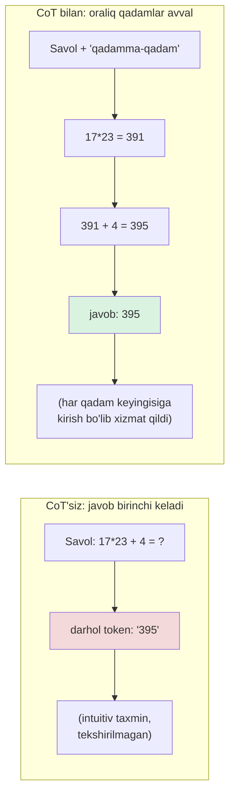
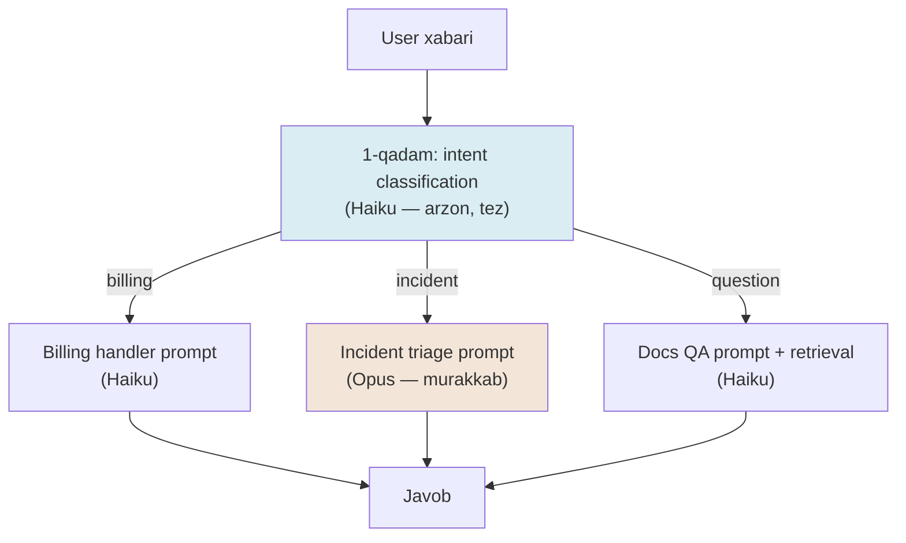
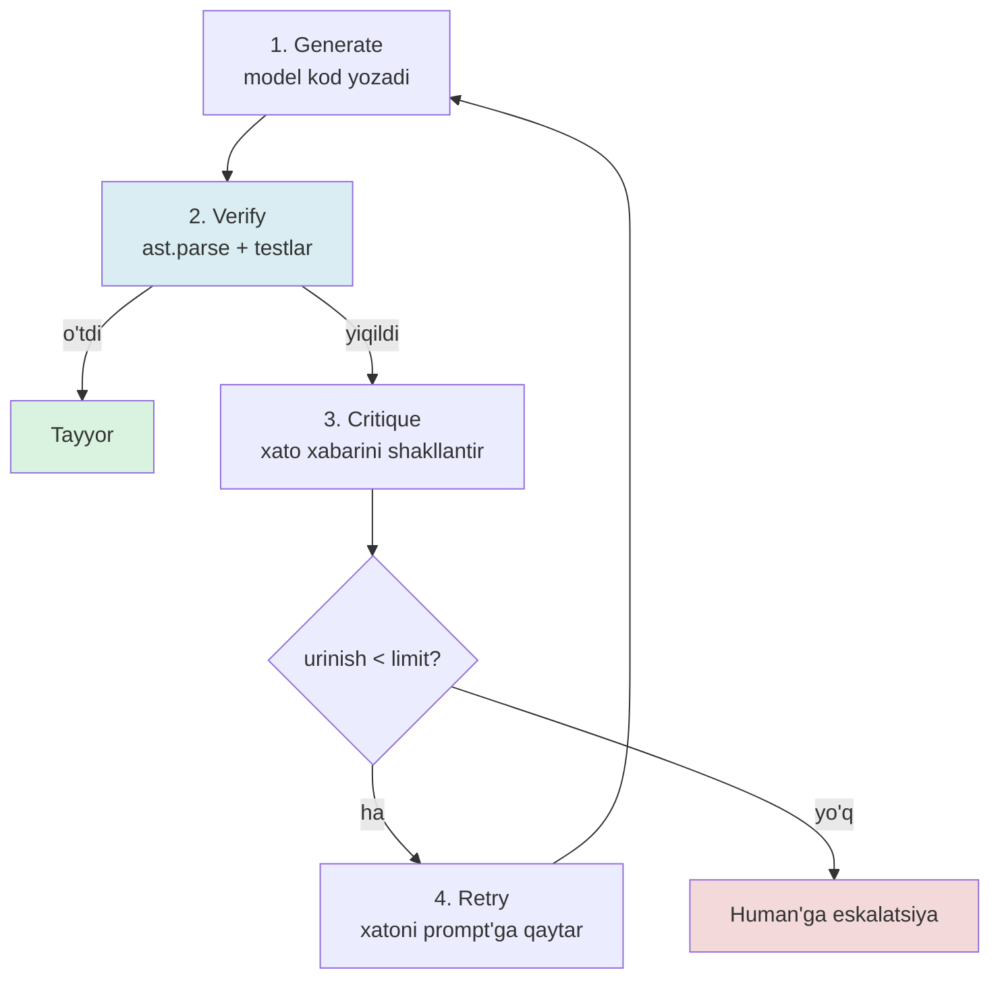

# 07. Ilg'or prompt texnikalari

2022-yildan buyon eng ko'p tarqalgan maslahat — "let's think step by step" qo'shish. 2026-yilda bu maslahat reasoning model'larda **foydasiz, ba'zan zararli** bo'lib qoldi, lekin arzon model'larda va thinking yopiq bo'lganda hali ham hayotni saqlaydi. Ish suhbatida "murakkab vazifada aniqlikni qanday oshirasiz — bitta katta prompt bilanmi yoki chain bilanmi, va nega?" degan savol muhandislik yetukligini o'lchaydi. Bu dars — CoT, uning 2026 paradoksi, self-consistency, decomposition va Reflexion.

---

## Nazariya (~30%)

### 1. Nega CoT umuman ishlaydi: model ichida internal monologue yo'q

Transformer autoregressiv: bir pass = bitta keyingi token, va token chiqdi — qaytarib bo'lmaydi (no backtracking). Attention'da axborot faqat **chapdan o'ngga va pastdan yuqoriga** oqadi (masking).

Buning muhandislik oqibati bor. Model qatlamlari soni cheklangan — demak bitta token ichida bajarilishi mumkin bo'lgan "fikrlash chuqurligi" ham cheklangan. Yuqori qatlam allaqachon hisoblab qo'ygan oraliq natijani **pastki qatlamga qaytarishning yagona yo'li** — uni **token sifatida chiqarish** va keyingi pass'da qayta o'qish.

> Model uchun "o'ylash" faqat **matnda ovoz chiqarib** mumkin. Odamning ichki ovozi bor — modelniki yo'q. CoT (Chain of Thought) shu ichki ovozning o'rnini bosadi: modelga oraliq qadamlarni **yozib** olishga ruxsat berasiz, va u o'zi yozgan qadamlarni keyingi qadam uchun kirish sifatida ishlatadi.

Backend analogiyasi: bu stateless HTTP handler'ga o'xshaydi — u ichki o'zgaruvchida holat saqlay olmaydi, faqat **response body**ga yozib, keyingi request'da o'sha body'ni qayta o'qishi mumkin. CoT — modelning "scratchpad"i.



O'lchovlar (Wei et al. 2022): GSM8K matematik masalalarda 20% dan 60% gacha o'sish (PaLM 540B). Sabab shu — model javobni "birinchi urishda" taxmin qilib, keyin uni oqlamaydi; qadamlar orqali **haqiqatan hisoblaydi**.

### 2. 2026 PARADOKSI — eng muhim qism

Reasoning model'lar (Claude adaptive thinking, o1, R1) **CoT'ni ichiga singdirib** kelgan. Ular javob berishdan oldin ichki reasoning bloki generatsiya qiladi. Demak:

> **"Think step by step" ni prompt'ga qo'shishning foydasi minimal, ba'zan zararli:** model allaqachon o'ylayapti, siz uni **ikki marta** o'ylashga majburlaysiz — ortiqcha token, ortiqcha latency, ba'zan chalkashlik.

Yangi qoida:

> CoT'ni **prompt bilan emas**, API parametri bilan boshqaring:
> `thinking={"type": "adaptive"}` + `output_config={"effort": "low|medium|high|xhigh|max"}`.
> Model o'zi qancha o'ylash kerakligini vazifa murakkabligiga qarab hal qiladi.

Unda CoT'ni nega hali ham o'rganamiz? Uchta sabab:

1. **Arzon/eski model'larda** (Haiku, OpenAI-compatible lokal modellar) thinking yo'q — CoT'ni prompt bilan qo'lda beryapsiz.
2. **Thinking yopiq bo'lganda** (latency byudjeti qattiq, yoki model reasoning'ni qo'llab-quvvatlamaganda).
3. **CoT — qolgan hamma texnikaning asosi.** Self-consistency, decomposition, Reflexion — barchasi "modelga yozib o'ylashga ruxsat ber" g'oyasiga tayanadi.

> ⚠️ Berryman (2024) va Huyen (2025) kitoblarida CoT'ni faqat prompt orqali beriladigan texnika sifatida ko'rsatiladi. 2026-da Claude'ning joriy modellarida bu birinchi tanlov **emas** — `thinking`/`effort` afzal. Tushuncha baribir kerak: sabab (internal monologue yo'q) o'zgarmagan, va prompt-CoT arzon/eski model'larda ishlaydi.

### 3. Texnikalar xaritasi

| Texnika | G'oya | Qachon ishlatiladi | Narx |
|---|---|---|---|
| Zero-shot CoT | "Let's think step by step" | Arzon model, oddiy reasoning | 1x + oraliq tokenlar |
| Few-shot CoT | Misolda qadamlarni ham ko'rsatasiz | Domain-specific format | 1x + katta prompt |
| Self-consistency | N ta yechim -> majority vote | Qimmat, muhim qaror | **N×** |
| Decomposition | Katta vazifani chain'ga bo'lish | Production'da eng foydali | qadamlar yig'indisi |
| Reflexion | Natijani tekshir -> xatoni qaytar -> qayta ur | Kod, verifikatsiya bor vazifa | 1x + retry'lar |
| Adaptive thinking | Model o'zi o'ylaydi (API) | Reasoning model, 2026 default | effort'ga bog'liq |

### 4. Self-consistency

CoT bir yo'ldan boradi; agar shu yo'lda xato bo'lsa — javob xato. Self-consistency (Wang 2023): **N ta mustaqil yechim** oling, eng ko'p uchraydigan javobni tanlang (majority vote). CoT ustiga +12-18% aniqlik.

> Claude'da OpenAI'dagi `n` parametri **yo'q** — siz shunchaki N marta chaqirasiz (yoki Batch API). Narx = N×, shuning uchun faqat qimmat, muhim qarorlarda.

Bundan kuchliroq g'oya — **verifier / reward model** (Huyen Ch2): N ta yechimni oddiy majority emas, alohida "baholovchi" model tanlaydi. Cobbe et al. (2021): yaxshi verifier ~30x model kattalashuviga teng samara beradi. DeepMind: ba'zan test-time compute'ni oshirish model parametrlarini oshirishdan foydaliroq.

### 5. Decomposition — production'da eng foydali texnika

Bitta shishgan 1500 tokenli prompt o'rniga vazifani **kichik promptlar zanjiriga** bo'lish. Bu "aqlliroq javob" uchun emas, **muhandislik** uchun:

- **Monitoring** — qaysi qadam sifat tushirdi, ko'rinadi
- **Debugging** — bitta qadamni izolyatsiyada qayta o'ynatish mumkin
- **Parallelization** — mustaqil qadamlar bir vaqtda ishlaydi
- **Model routing** — oddiy qadamga arzon model (Haiku), murakkabiga frontier (Opus)

GoDaddy misoli: 1500 tokenli support prompt'ni qadamlarga bo'lgach, sifat oshdi **va** narx tushdi. Klassik naqsh: `intent classification -> maxsus handler`.



Kamchilik: ko'proq so'rov, ko'proq latency. Lekin arzon modelni oddiy qadamga qo'yish odatda umumiy narxni **tushiradi**.

### 6. Reflexion, self-critique va boshqalar (qisqacha)

- **Reflexion** (2023): natijani mashina bilan tekshir (unit test, `ast.parse`, linter), xato bo'lsa **xato xabarini prompt'ga qaytar** va qayta urin. Kod generatsiyasida eng kuchli.
- **Self-critique**: model o'z javobini o'zi tekshiradi ("bu javobda xato bormi?"). Reflexion'ning LLM-only varianti — mashina verifikatori bo'lmaganda.
- **Plan-and-solve**: avval umumiy reja, keyin qadamlar bo'yicha bajarish.
- **Branch-solve-merge**: N mustaqil "solver" + bitta "merge" agent natijalarni birlashtiradi.
- **ReAct** (think -> act -> observe): bugungi kunda bu **agent loop'ning o'zi** — kursning agent bo'limida chuqur ko'riladi.

### 7. Prompt optimizatsiya vositalari — ogohlantirish bilan

DSPy, TextGrad, Promptbreeder — prompt'ni **avtomatik** optimallashtiradi (input/output/metrika/data berasiz, vosita optimal prompt topadi).

> ⚠️ **Ehtiyot:** bu vositalar **yashirin API chaqiruvlar** qiladi (30 misol × 10 variant = 300 call — hisobingizga tushadi). LangChain kabi framework'larning default prompt template'larida typo'lar topilgan va ular ogohlantirmasdan o'zgargan. Qoida: avval prompt'ni **o'zingiz** yozib, o'lchang; vosita — keyingi qadam, birinchisi emas.

---

## Amaliyot (~70%)

Umumiy helper:

```python
# common.py
import time
import anthropic
from dotenv import load_dotenv

load_dotenv()
client = anthropic.Anthropic()

def ask(user: str, system: str = "", model: str = "claude-opus-4-8",
        thinking: bool = False, effort: str = "medium") -> tuple[str, dict]:
    kwargs = dict(model=model, max_tokens=2048,
                  messages=[{"role": "user", "content": user}])
    if system:
        kwargs["system"] = system
    if thinking:
        kwargs["thinking"] = {"type": "adaptive"}
        kwargs["output_config"] = {"effort": effort}
    t0 = time.perf_counter()
    resp = client.messages.create(**kwargs)
    dt = time.perf_counter() - t0
    text = "".join(b.text for b in resp.content if b.type == "text")
    meta = {"out_tokens": resp.usage.output_tokens, "latency_s": round(dt, 2)}
    return text, meta
```

### Predict / Run

#### 1-mashq: 3 rejimni solishtirish — paradoksni o'z ko'zingiz bilan ko'ring

Mantiqiy masala (bir urishda adashish oson):

> Bir microservice'da 3 ta replica bor. Har biri sekundiga 40 ta so'rovni eplaydi. Load balancer round-robin. Bittasi ishdan chiqsa, qolgan ikkitasi 90% CPU'ga chiqadi. Agar SLO 99 so'rov/sekund bo'lsa, bitta replica yiqilganda SLO saqlanadimi?

```python
# 01_three_modes.py
from common import ask

Q = ("Bir microservice'da 3 ta replica bor, har biri sekundiga 40 so'rovni eplaydi. "
     "Bittasi yiqilsa qolgan 2 tasi 90% CPU'ga chiqadi. SLO = 99 so'rov/sekund. "
     "Bitta replica yiqilganda SLO saqlanadimi? Oxirgi qatorda faqat HA yoki YO'Q yoz.")

# --- a) oddiy: hech qanday reasoning ko'rsatma yo'q, thinking yo'q ---
a_txt, a_meta = ask(Q)

# --- b) prompt-CoT: "qadamma-qadam" (eski/arzon model uslubi) ---
b_txt, b_meta = ask("Qadamma-qadam hisoblab, keyin xulosa qil.\n\n" + Q)

# --- c) adaptive thinking + effort=high (2026 to'g'ri usul) ---
c_txt, c_meta = ask(Q, thinking=True, effort="high")

for name, txt, meta in [("a-oddiy", a_txt, a_meta),
                        ("b-prompt CoT", b_txt, b_meta),
                        ("c-thinking", c_txt, c_meta)]:
    verdict = txt.strip().splitlines()[-1]
    print(f"{name:14} | out={meta['out_tokens']:>4} tok | "
          f"{meta['latency_s']:>4}s | xulosa: {verdict}")

# Output (taxminiy):
# a-oddiy        | out=  12 tok |  0.9s | xulosa: HA
# b-prompt CoT   | out= 210 tok |  3.1s | xulosa: YO'Q
# c-thinking     | out=  40 tok |  4.4s | xulosa: YO'Q
#
# To'g'ri javob: YO'Q. 2 replica * 40 = 80 so'rov/sekund < 99 (90% CPU'da ham
# throughput ~40 bo'lib qoladi, CPU balandligi sig'imni oshirmaydi).
# a) oddiy rejim adashdi (12 token — hisoblamadi, taxmin qildi).
# b) prompt-CoT to'g'ri javob berdi, lekin 210 token yoqdi.
# c) thinking to'g'ri javob berdi, tashqi output kam (40 tok), lekin latency yuqori
#    (reasoning ichkarida). ESLATMA: c'ga "qadamma-qadam" QO'SHGANINGIZDA foyda emas,
#    ikki marta reasoning + ortiqcha token bo'ladi — bu paradoks.
```

> **Bashorat qiling:** `c` variantiga qo'shimcha "qadamma-qadam hisobla" jumlasini QO'SHSANGIZ, output token ko'payadimi kamayadimi? Aniqlik oshadimi? (Bu paradoksni tekshiradi.)

#### 2-mashq: self-consistency qo'lda (majority vote)

```python
# 02_self_consistency.py
from collections import Counter
from common import ask

# Adashish oson masala: ketma-ket foizli o'zgarish
Q = ("Bir API'ning p99 latency'si 200ms edi. Optimizatsiyadan keyin 25% tushdi, "
     "so'ng yangi feature qo'shilib 20% oshdi. Yakuniy p99 nechchi ms? "
     "Oxirgi qatorda faqat sonni yoz (ms belgisisiz).")

N = 5
answers = []
for i in range(N):
    # Claude'da n= parametri YO'Q — N marta chaqiramiz.
    # Har chaqiruvda model boshqa reasoning yo'lidan borishi mumkin.
    txt, _ = ask("Qadamma-qadam hisobla, keyin javob ber.\n\n" + Q)
    last = txt.strip().splitlines()[-1].strip()
    answers.append(last)
    print(f"  urinish {i+1}: {last}")

vote = Counter(answers).most_common()
print(f"\novozlar: {vote}")
print(f"self-consistency javobi (majority): {vote[0][0]}")

# Output:
#   urinish 1: 180
#   urinish 2: 180
#   urinish 3: 190      <- 200*0.75*1.20 emas, 200-25+20% deb noto'g'ri hisoblagan
#   urinish 4: 180
#   urinish 5: 180
#
# ovozlar: [('180', 4), ('190', 1)]
# self-consistency javobi (majority): 180
#
# To'g'ri: 200 * 0.75 * 1.20 = 180. Bitta urinish (190) adashdi, lekin
# majority vote uni "yutdi". Narx: 5x chaqiruv.
```

Bu naqshning production versiyasi: majority o'rniga **verifier** model yoki qat'iy tekshiruv (masalan javobni qayta hisoblash) qo'yasiz.

### Investigate / Modify

1. **Effort'ni tushiring.** `01_three_modes.py` ning `c` variantida `effort="high"` ni `effort="low"` ga o'zgartiring. Latency va output token qanday o'zgaradi? Javob to'g'ri qoladimi? (Effort — "qancha o'ylash"ning to'g'ridan-to'g'ri sozlagichi.)

2. **CoT'ni thinking ustiga qo'shing.** `c` variantiga `"Qadamma-qadam batafsil hisobla. "` prefiksini qo'shing va output token'ni solishtiring. Kamaydimi, ko'paydimi? Bu 2026 paradoksini tasdiqlaydimi?

3. **N ni oshiring.** `02_self_consistency.py` da `N=5` ni `N=9` qiling. Majority barqarorroq bo'ldimi? Narx qancha oshdi? Bir noto'g'ri javob ovoz taqsimotini o'zgartira oladimi?

4. **Verifier qo'shing.** `02` da majority o'rniga: har javobni Python'da `200 * 0.75 * 1.20` bilan solishtirib, mos kelganini tanlang. Endi 5 ta noto'g'ri javob bo'lsa nima bo'ladi? (Verifier majority'dan qaerda kuchli, qaerda ojiz?)

5. **Arzon modelda CoT.** `01` ning `b` (prompt-CoT) variantini `model="claude-haiku-4-5"` bilan ishlating. Haiku'da "qadamma-qadam" qo'shish aniqlikni oshiradimi? (Thinking yo'q model — prompt-CoT aynan shu yerda kerak.)

### Make

**Challenge 1: Decomposition + model routing**

Bitta shishgan support prompt o'rniga ikki qadamli pipeline quring: (1) intent classification — **Haiku**; (2) intent'ga qarab maxsus handler — oddiy intent'ga Haiku, `incident` uchun Opus. Har qadamning input/output token'ini alohida logging qiling.

<details>
<summary>Yechim</summary>

```python
# make1_routing.py
from common import client, ask

def classify(msg: str) -> str:
    sys = """Support xabarini bitta kategoriyaga ajrat.
Faqat bitta so'z qaytar: incident | billing | question | feedback."""
    txt, meta = ask(msg, system=sys, model="claude-haiku-4-5")
    print(f"  [classify] Haiku in-tokens hisobida, out={meta['out_tokens']}")
    return txt.strip().lower().split()[0]

# Handler'lar: intent -> (model, system prompt)
HANDLERS = {
    "incident": ("claude-opus-4-8",
        "Sen on-call SRE'san. Triage qil: severity (sev1-3), ta'sirlangan komponent, "
        "birinchi qadam. Faqat shu uch qatorni yoz."),
    "billing": ("claude-haiku-4-5",
        "Sen billing yordamchisisan. Muammoni bir jumlada tasnifla va keyingi qadamni ayt."),
    "question": ("claude-haiku-4-5",
        "Sen docs yordamchisisan. Qisqa, aniq javob ber."),
    "feedback": ("claude-haiku-4-5",
        "Sen product jamoasi assistentisan. Fikrni bir jumlada umumlashtir va teg qo'y."),
}

def route(msg: str) -> str:
    intent = classify(msg)
    model, sys = HANDLERS.get(intent, HANDLERS["question"])
    print(f"  [route] intent={intent} -> model={model}")
    txt, meta = ask(msg, system=sys, model=model)
    print(f"  [handle] out={meta['out_tokens']} latency={meta['latency_s']}s")
    return txt

TICKETS = [
    "Prod'da checkout 500 qaytaryapti, 15 daqiqadan beri, mijozlar to'lay olmayapti.",
    "Kecha 2 marta yechib olishibdi, refund qanday qilinadi?",
    "Webhook retry siyosati docs'da qayerda yozilgan?",
]
for t in TICKETS:
    print(f"\nTICKET: {t}")
    print("JAVOB:", route(t)[:200])

# Output (qisqartirilgan):
# TICKET: Prod'da checkout 500 qaytaryapti...
#   [classify] Haiku ... out=1
#   [route] intent=incident -> model=claude-opus-4-8      <- faqat bu Opus'ga bordi
#   [handle] out=48 latency=2.1s
# JAVOB: severity: sev1 / komponent: checkout API / birinchi qadam: ...
#
# TICKET: Kecha 2 marta yechib olishibdi...
#   [route] intent=billing -> model=claude-haiku-4-5      <- arzon model yetarli
# ...
#
# Diqqat: 3 tikketdan faqat bittasi (incident) qimmat Opus'ga bordi.
# Bitta 1500-tokenli "hammasini qiladigan" prompt bo'lganda uchalasi ham Opus yoqardi.
```

Nega bu yaxshi: monitoring (har qadamning token'i ko'rinadi), routing (narx tushadi), debugging (`classify` va `handle` alohida sinaladi).

</details>

**Challenge 2: Reflexion loop — kod generatsiya + verifikatsiya + retry**

Model'dan Python funksiya so'rang. Har javobni `ast.parse` bilan sintaktik tekshiring va bitta oddiy testni ishga tushiring. Xato bo'lsa — **xato xabarini** prompt'ga qaytarib, qayta so'rang. Maksimal 3 urinish (loop limiti — cheksiz retry'dan himoya).

<details>
<summary>Yechim</summary>

```python
# make2_reflexion.py
import ast
import textwrap
from common import client

TASK = ("Python funksiya yoz: `def parse_retry_after(header: str) -> int`. "
        "U HTTP Retry-After header'ini oladi: agar u butun son bo'lsa — sekundlarni "
        "int qaytar; agar HTTP-date bo'lsa — hozirgi vaqtdan farqni sekundlarda qaytar "
        "(manfiy bo'lsa 0). Faqat funksiya kodini ``` bloki ichida qaytar.")

def extract_code(text: str) -> str:
    if "```" in text:
        return text.split("```")[1].removeprefix("python").strip()
    return text.strip()

def verify(code: str) -> str | None:
    """Muvaffaqiyat bo'lsa None, aks holda XATO XABARI (model'ga qaytariladi)."""
    try:
        ast.parse(code)                              # 1) sintaksis
    except SyntaxError as e:
        return f"SyntaxError: {e}"
    ns: dict = {}
    try:
        exec(code, ns)                               # 2) yuklanadimi
        fn = ns["parse_retry_after"]
        assert fn("120") == 120, f'fn("120") != 120, oldi: {fn("120")}'
        assert fn("0") == 0
    except Exception as e:                           # 3) test fail -> xabar qaytadi
        return f"Test fail: {type(e).__name__}: {e}"
    return None

messages = [{"role": "user", "content": TASK}]
MAX_TRIES = 3
for attempt in range(1, MAX_TRIES + 1):
    resp = client.messages.create(model="claude-opus-4-8", max_tokens=1024,
                                  messages=messages)
    text = "".join(b.text for b in resp.content if b.type == "text")
    code = extract_code(text)
    err = verify(code)
    print(f"--- urinish {attempt}: {'OK' if err is None else 'FAIL'} ---")
    if err is None:
        print(textwrap.indent(code, "  "))
        break
    print("  xato:", err)
    # REFLEXION: xato xabarini suhbatga qo'shib qayta so'raymiz
    messages.append({"role": "assistant", "content": text})
    messages.append({"role": "user",
                     "content": f"Kod bu xato bilan yiqildi:\n{err}\n"
                                f"Sababini tuzatib, to'liq funksiyani qayta yoz."})
else:
    print(f"{MAX_TRIES} urinishda ham o'tmadi — human'ga eskalatsiya.")

# Output (taxminiy):
# --- urinish 1: FAIL ---
#   xato: Test fail: ValueError: invalid literal for int() with base 10: '120'
#         (model avval HTTP-date branch'ini sinab ko'rgan)
# --- urinish 2: OK ---
#   def parse_retry_after(header: str) -> int:
#       header = header.strip()
#       if header.isdigit():
#           return int(header)
#       from email.utils import parsedate_to_datetime
#       ...
```

Muhim nuqtalar:
- **Loop limiti** (`MAX_TRIES=3`) — 06-darsda tool use'da ko'rgan cheksiz loop xavfining aynan shu yerdagi ko'rinishi.
- Verifikator **mashina** (ast + assert), LLM emas — bu Reflexion'ni self-critique'dan kuchliroq qiladi: xato xabari haqiqiy, hallucination emas.
- Xato **strukturalangan** holda qaytadi (`type + message`), xom stack trace emas — model uni o'qib tuzata oladi.

</details>



---

## Retrieval practice

1. Nega modelga "yozib o'ylashga" ruxsat berish (CoT) aniqlikni oshiradi? Buni transformer arxitekturasining qaysi cheklovi bilan bog'laysiz?
2. Reasoning model'da (adaptive thinking yoqilgan) prompt'ga "let's think step by step" qo'shsangiz nima bo'ladi va nega? To'g'ri usul qanday?
3. Self-consistency CoT'dan qanday farq qiladi? Uning narxi qancha va qachon oqlanadi?
4. Decomposition "aqlliroq javob" bermasa ham, uni production'da nega afzal ko'rishadi? Kamida uchta muhandislik foydasini ayting.
5. Reflexion'da xato xabarini model'ga qaytarish — bu qaysi 05/tool-use darsidagi qaysi tamoyilga o'xshaydi? Nega mashina verifikatori LLM self-critique'dan ishonchliroq?
6. DSPy/TextGrad kabi avtomatik optimizatsiya vositalarini ishlatishdan oldin nimadan ogoh bo'lish kerak?

---

## Manbalar

- **Berryman & Ziegler, "Prompt Engineering for LLMs" (O'Reilly, 2024)** — Ch2 (autoregressiya, masking, "thinking aloud" — CoT'ning nazariy asosi), Ch8 (CoT, zero-shot CoT, pause tokens, ReAct, plan-and-solve, Reflexion, branch-solve-merge)
- **Chip Huyen, "AI Engineering" (O'Reilly, 2025)** — Ch2 (test-time compute, best-of-N, self-consistency, verifier / reward model ~30x samara), Ch5 (CoT, self-critique, murakkab vazifani bo'lish, GoDaddy misoli, DSPy/TextGrad ogohlantirishlari)
- Wei et al., 2022 — "Chain-of-Thought Prompting Elicits Reasoning in Large Language Models"
- Kojima et al., 2022 — "Large Language Models are Zero-Shot Reasoners" ("Let's think step by step")
- Wang et al., 2023 — "Self-Consistency Improves Chain of Thought Reasoning"
- Cobbe et al., 2021 — GSM8K + verifier
- Shinn et al., 2023 — "Reflexion: Language Agents with Verbal Reinforcement Learning"
- Anthropic rasmiy: [Extended thinking](https://platform.claude.com/docs/en/build-with-claude/extended-thinking) va [Chain of thought prompting](https://platform.claude.com/docs/en/build-with-claude/prompt-engineering/chain-of-thought)

Oldingi dars: [06. Prompt engineering asoslari](./06.%20Prompt%20engineering%20asoslari.md). Keyingi dars: [08. Prompt injection va himoya](./08.%20Prompt%20injection%20va%20himoya.md).
