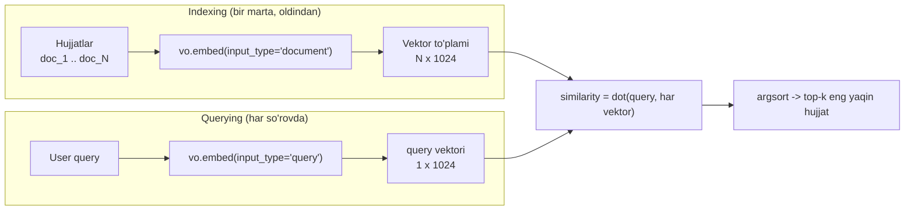

# 01. Embedding nima — vektor va semantic similarity

AI engineer ishining katta qismi — retrieval: semantic search, RAG, deduplication, recommendation, clustering. Bularning hammasi bitta savolga tayanadi: *"bu ikki matn ma'no jihatidan qanchalik yaqin?"*. Foydalanuvchi "parolni tiklash" deb qidiradi, hujjat esa "reset password" deb nomlangan — na hash lookup, na SQL `LIKE` bu ikkisini bog'lay oladi, chunki bitta ham umumiy bayt yoki so'z yo'q. Ish suhbatida *"semantic search qanday ishlaydi?"* deyarli standart savol — javobni shu darsdan boshlaymiz.

---

## Nazariya (~30%)

### 1. Uch xil "moslik" darajasi

Backend'da "ikki narsa mos keladimi?" degan savolga uch xil javob bor. Ular murakkablik bo'yicha bosqichlanadi — bu bo'limning markaziy g'oyasi.

**1-daraja. Hash / exact match — bayt-teng.**
`map[key]`, content-addressable storage, cache key — hammasi shu. Ikki qiymat **aynan bir xil baytlar** bo'lsa mos keladi, aks holda yo'q. O(1), arzon, ishonchli. Lekin qattiq: `"reset password"` va `"Reset password"` (bosh harf), yoki ikkilangan probel — mos **emas**.

> Backend analogiyasi (butun bo'lim shu ustiga quriladi): **hash = aniq moslik, embedding = semantik moslik**. Hash "bir xilmi?" deb so'raydi; embedding "qanchalik o'xshashmi?" deb so'raydi.

**2-daraja. Lexical match — so'z overlap.**
Inverted index (term -> documents mapping) ustida ishlaydi — Elasticsearch/Lucene shu. Evolyutsiya (Berryman, Ch5): **Jaccard similarity** (umumiy so'zlar / birlashgan so'zlar) -> **TF-IDF** (kam uchraydigan so'zga ko'proq vazn) -> **BM25** (TF-IDF ning hujjat uzunligi bo'yicha normalizatsiyalangan varianti). BM25 bugungacha kuchli baseline — Perplexity rahbari aytganidek, undan sezilarli o'zib ketish qiyin. Kuchli tomoni: tez, arzon, debug oson, va aniq keyword (error code `EADDRNOTAVAIL`, product nomi) topadi. Zaif tomoni: **umumiy so'z bo'lmasa ishlamaydi** — `"What's up?"` va `"How are you?"` bitta umumiy so'zga ega emas, demak topmaydi.

**3-daraja. Semantic match — ma'no yaqinligi.**
Matn **embedding** (ma'noni ifodalovchi sonli vektor)ga aylantiriladi, keyin ikki vektor orasidagi burchak o'lchanadi. `"What's up?"` va `"How are you?"` bironta umumiy so'zsiz ham yaqin chiqadi. Multilingual model bilan `"parolni tiklash"` va `"reset password"` ham yaqin bo'ladi. Zaif tomoni: qimmatroq (embed + storage + search), aniq keyword'ni "yashiradi", va "qora quti" — nega match bo'lmagani ko'rinmaydi.

| | Hash / exact | Lexical (BM25) | Semantic (embedding) |
|---|---|---|---|
| **Nimaga qaraydi** | aynan baytlar | umumiy so'zlar | ma'no |
| **Data strukturasi** | hash table | inverted index | vektor to'plami |
| **Narx** | eng arzon (O(1)) | arzon | qimmat (embed + search) |
| **Kuchli** | ID, cache, dedup | aniq keyword, debug oson | sinonim, til to'sig'i yo'q |
| **Zaif** | 1 bayt farq -> yo'q | umumiy so'z bo'lmasa yo'q | keyword yashiradi, opaque |
| **"parolni tiklash" -> "reset password"?** | yo'q | yo'q | **ha** |

Xulosa: uchtasi raqib emas — production'da ko'pincha **hybrid** (BM25 + embedding) ishlatiladi (3-bo'limda ko'ramiz). Bu darsda 3-darajaga — embedding'ga chuqurlashamiz.

### 2. Embedding aslida nima

> **Ta'rif (Huyen, Ch3):** embedding — asl ma'lumotning **ma'nosini saqlashga intiluvchi** sonli vakillik, ya'ni sobit uzunlikdagi float vektor.

Bir necha fakt:

- **O'lcham** tipik 256-3072 (kurs standarti `voyage-4`: **1024**). Bu raw matndan ancha kichik — "lower-dimensional representation".
- Vektor — ko'p o'lchamli fazodagi **nuqta**. Yaxshi embedding mezoni bitta: **o'xshash matn -> yaqin nuqta**. `"cat sits on a mat"` va `"dog plays on the grass"` yaqin; `"AI research is fun"` uzoq.
- Embedding faqat matn uchun emas — rasm, kod, product, foydalanuvchi uchun ham olinadi. Bir xil fazoga proyeksiya qilingan matn+rasm embedding'lari (CLIP) matn bilan rasm qidirishni beradi.

**Notional machine — kod ortida nima bo'ladi.** `vo.embed("connection pool")` chaqirganingizda matn model orqali o'tadi va chiqishda **1024 ta float**li massiv qaytadi. Bu massiv — 1024 o'lchamli fazodagi bitta nuqtaning koordinatalari. "O'xshashlik" = shu ikki nuqta orasidagi **burchak** (yo'nalish), masofa emas. Shuning uchun asosiy metrika — cosine (yoki normalizatsiyalangan vektorlarda unga teng dot product).

### 3. Nega Voyage AI — Anthropic embedding bermaydi

Bu bo'limning markaziy fakti: rasmiy hujjat so'zma-so'z aytadi — **"Anthropic does not offer its own embedding model."** Claude API'da embeddings endpoint **yo'q**. Anthropic o'z docs'ida **Voyage AI** ni tavsiya qiladi.

Kurs qarori:

- **Asosiy provider: Voyage AI** — Anthropic tavsiyasi, va har model uchun **200M token bepul** (butun kursni pulsiz o'tasiz; solishtirish uchun butun Wikipedia ~4-5B token). `pip install voyageai`, `VOYAGE_API_KEY`.
- **Muqobil: OpenAI** `text-embedding-3-small/large` — ish joyida eng ko'p uchraydi, 1 misolda ko'rsatamiz.
- **Lokal (API'siz): `sentence-transformers`** + `BAAI/bge-m3` (100+ til, o'zbekcha uchun ham eng yaxshi ochiq variant).

Berryman kitobida (2024) mini RAG misoli OpenAI + `faiss.IndexFlatL2` bilan yozilgan. **Kontsept to'g'ri, kod eskirgan kontekstda:** kitob 2024, ekotizim 2026. Biz Voyage + numpy ishlatamiz; FAISS 3-bo'limga (vector databases) qoladi.

### 4. Ikki bosqich: indexing va querying

Retrieval ikki fazadan iborat, va ular orasidagi bitta nozik farqni doim yodda tuting: `input_type`.

- **Indexing** (bir marta, oldindan): har hujjat `input_type="document"` bilan embed qilinadi va vektorlar saqlanadi.
- **Querying** (har so'rovda): user query `input_type="query"` bilan embed qilinadi, keyin barcha hujjat vektorlari bilan similarity hisoblanadi, top-k qaytadi.

`input_type` nega muhim? Voyage `"query"` va `"document"` uchun modelga **turli prefiks-prompt** qo'shadi ("Represent the query for retrieving..." / "Represent the document for retrieval..."). Query'ni `document` sifatida embed qilish — retrieval sifatini jimgina buzadigan eng keng tarqalgan xato. **Shuning uchun `input_type` hech qachon tashlab ketilmaydi.**



Similarity'ni **numpy** bilan brute-force hisoblaymiz (`np.dot`), FAISS'siz. Kichik korpusda (minglab vektorgacha) bu **to'g'ri tanlov** — hamma vektor bilan solishtirish aniq va tushunarli; ANN indekslari (HNSW va h.k.) katta korpusda kerak bo'ladi (3-bo'lim). Muhim fakt: **Voyage vektorlari L2-normalizatsiyalangan (uzunlik = 1)**, shuning uchun `dot == cosine` — bo'lishsiz, arzonroq. Buni kodda komment bilan belgilaymiz.

---

## Amaliyot (~70%)

### Tayyorgarlik

```bash
pip install voyageai python-dotenv numpy
# lokal muqobil uchun (ixtiyoriy): pip install sentence-transformers
```

`.env`:
```
VOYAGE_API_KEY=pa-...
```

---

### Predict / Run

#### 1-misol. Birinchi `embed()` chaqiruvi

Bashorat qiling: 2 ta matn yuborsak, `result.embeddings` qanday shaklda bo'ladi va bitta vektorda nechta son bor?

```python
# 01_first_embed.py
from dotenv import load_dotenv
import voyageai

load_dotenv()
vo = voyageai.Client()   # VOYAGE_API_KEY env'dan o'qiladi

texts = [
    "How do I reset my password?",
    "The connection pool is exhausted.",
]

result = vo.embed(texts, model="voyage-4", input_type="document")

vecs = result.embeddings                 # list[list[float]]
print("matnlar soni  :", len(vecs))
print("vektor uzunligi:", len(vecs[0]))
print("birinchi 5 komp:", [round(x, 4) for x in vecs[0][:5]])
print("total_tokens  :", result.total_tokens)

# Output (taxminan):
# matnlar soni  : 2
# vektor uzunligi: 1024
# birinchi 5 komp: [-0.0231, 0.0412, -0.0088, 0.0155, 0.0307]
# total_tokens  : 14
```

Har matn — 1024 ta float. `result.total_tokens` — usage (bepul kvotangizdan shuncha yechiladi). Bitta `embed()` chaqiruviga ko'p matn joylash HTTP overhead'ni tejaydi (batching).

#### 2-misol. Semantik yaqinlikni "his qilish"

Uch juft matn: sinonim juft, mavzudosh juft, aloqasiz juft. Bashorat qiling: qaysi juftning similarity'si eng yuqori, qaysiniki eng past bo'ladi?

```python
# 02_similarity.py
from dotenv import load_dotenv
import numpy as np
import voyageai

load_dotenv()
vo = voyageai.Client()

pairs = [
    ("How are you?",                       "What's up?"),                       # sinonim
    ("How do I speed up my SQL queries?",  "Database index tuning tips"),        # mavzudosh
    ("How do I reset my password?",        "The sky is blue today."),            # aloqasiz
]

# Barcha matnni bitta batch'da embed qilamiz
flat = [t for pair in pairs for t in pair]
vecs = np.array(vo.embed(flat, model="voyage-4", input_type="document").embeddings)

# Voyage vektorlari L2-normalizatsiyalangan (uzunlik = 1) -> dot == cosine
for i, (a, b) in enumerate(pairs):
    sim = float(np.dot(vecs[2 * i], vecs[2 * i + 1]))
    print(f"{sim:.3f}  | {a!r}  <->  {b!r}")

# Output (taxminan):
# 0.812  | 'How are you?'  <->  "What's up?"
# 0.671  | 'How do I speed up my SQL queries?'  <->  'Database index tuning tips'
# 0.294  | 'How do I reset my password?'  <->  'The sky is blue today.'
```

Diqqat: sinonim juftda bitta ham umumiy so'z yo'q, lekin similarity **0.8+** — lexical match bu yerda 0 berardi. Tartib: sinonim > mavzudosh > aloqasiz. Bu — semantic match'ning butun mohiyati.

#### 3-misol. Mini semantic search (top-3)

8 ta qisqa hujjat (backend mavzulari), query `"how to make my queries faster"`. Indexing'da `input_type="document"`, querying'da `input_type="query"` — farqni kodda kuzating.

```python
# 03_mini_search.py
from dotenv import load_dotenv
import numpy as np
import voyageai

load_dotenv()
vo = voyageai.Client()

docs = [
    "Add a B-tree index on the column to speed up slow queries.",
    "A connection pool reuses TCP connections to the database.",
    "Rate limiting protects an API from traffic spikes.",
    "Use EXPLAIN ANALYZE to find the slow part of a query.",
    "A goroutine is a lightweight thread managed by the Go runtime.",
    "Redis can cache query results to reduce database load.",
    "JWT tokens carry claims for stateless authentication.",
    "A load balancer spreads requests across many servers.",
]

# --- Indexing: hujjatlarni DOCUMENT sifatida embed qilamiz ---
doc_vecs = np.array(vo.embed(docs, model="voyage-4", input_type="document").embeddings)

# --- Querying: query'ni AYNAN QUERY sifatida embed qilamiz ---
query = "how to make my queries faster"
q_vec = np.array(vo.embed([query], model="voyage-4", input_type="query").embeddings[0])

# normalizatsiyalangan -> dot == cosine; matritsa ko'paytma = barcha similarity birdan
sims = doc_vecs @ q_vec
top3 = np.argsort(-sims)[:3]

print(f"Query: {query!r}\n")
for rank, i in enumerate(top3, 1):
    print(f"{rank}. {sims[i]:.3f}  {docs[i]}")

# Output (taxminan):
# Query: 'how to make my queries faster'
#
# 1. 0.704  Add a B-tree index on the column to speed up slow queries.
# 2. 0.633  Use EXPLAIN ANALYZE to find the slow part of a query.
# 3. 0.559  Redis can cache query results to reduce database load.
```

Uchala natija ham query tezligi haqida — hech biri `"make faster"` so'zlarini aynan takrorlamasa ham. `goroutine`, `JWT`, `load balancer` hujjatlari pastda qoldi. Bu — inverted index emas, ma'no ishlayapti.

#### 4-misol. Provider-agnostik pattern

Bitta interfeys — `embed_texts(texts, kind) -> list[list[float]]` — orqasida turli provider'lar. Provider almashtirish 1 qatorga tushadi.

```python
# 04_providers.py
from typing import Protocol
from dotenv import load_dotenv
import voyageai

load_dotenv()


class EmbeddingProvider(Protocol):
    def embed_texts(self, texts: list[str], kind: str) -> list[list[float]]: ...


class VoyageProvider:
    def __init__(self, model: str = "voyage-4"):
        self.vo = voyageai.Client()
        self.model = model

    def embed_texts(self, texts: list[str], kind: str) -> list[list[float]]:
        # kind ("document"|"query") to'g'ridan-to'g'ri input_type'ga o'tadi
        return self.vo.embed(texts, model=self.model, input_type=kind).embeddings


class LocalProvider:
    def __init__(self, model: str = "BAAI/bge-m3"):
        from sentence_transformers import SentenceTransformer
        self.model = SentenceTransformer(model)

    def embed_texts(self, texts: list[str], kind: str) -> list[list[float]]:
        # bge-m3 query/document assimetriyasini talab qilmaydi -> kind e'tiborsiz;
        # normalize_embeddings=True -> dot == cosine (Voyage bilan bir xil shart)
        return self.model.encode(texts, normalize_embeddings=True).tolist()


def demo(provider: EmbeddingProvider) -> None:
    vecs = provider.embed_texts(["connection pool", "database index"], kind="document")
    print(f"{type(provider).__name__:16} -> dim: {len(vecs[0])}")


demo(VoyageProvider())
# demo(LocalProvider())   # API'siz ishlash uchun; birinchi ishga tushishda model yuklab olinadi

# Output (taxminan):
# VoyageProvider   -> dim: 1024
```

`EmbeddingProvider` — Protocol (structural typing): ikkala klass ham bir xil metod imzosiga ega bo'lgani uchun bir-birining o'rniga ishlaydi. Kalendarda yangi provider paydo bo'lsa — yana bitta klass, qolgan kod tegilmaydi.

> **Tuzoq (jimgina xato):** turli model embedding'larini bitta indexda **aralashtirmang** — har model o'z fazosiga ega, ular orasidagi similarity ma'nosiz. Index metadata'sida model nomi + versiyani saqlang; model almashsa **butun korpus** qayta embed qilinadi.

---

### Investigate / Modify

**M1. `input_type` assimetriyasini buzing.**
`03_mini_search.py` da query'ni `input_type="query"` o'rniga `input_type="document"` bilan embed qiling. Top-3 tartibi va similarity qiymatlari qanday o'zgaradi? Qaysi natija "to'g'riroq" ko'rinadi? (Bu — production'da eng ko'p uchraydigan sifat-buzuvchi xato.)

**M2. Crosslingual match.**
`03_mini_search.py` dagi inglizcha korpusni saqlab, query'ni o'zbekchaga o'zgartiring: `"so'rovlarimni qanday tezlashtiraman"`. Top-3 baribir index/EXPLAIN/cache hujjatlarini topadimi? Keyin `LocalProvider("BAAI/bge-m3")` (multilingual) bilan takrorlang — farqi bormi? (Multilingual model o'zbekcha uchun sezilarli kuchli.)

**M3. Aynan dublikat -> similarity 1.0.**
Korpusga mavjud hujjatlardan birini **ikkinchi marta** aynan qo'shing, keyin shu matnni query qiling. Ikki nusxaning o'zaro similarity'si (`np.dot`) qanchaga teng bo'ladi? Nega aniq 1.0 (yoki 0.999...)? Bu deduplication qanday ishlashini ko'rsatadi: `sim > 0.98` -> ehtimol dublikat.

---

### Make

**Vazifa: `faq_bot.py` — semantik FAQ bot skeletoni.**

Talablar:

1. Kamida 5 ta `(savol, javob)` juftini oling. **Faqat savollarni** embed qiling (`input_type="document"`).
2. Foydalanuvchi savolini `input_type="query"` bilan embed qilib, eng yaqin FAQ savolini toping.
3. Eng yaqin similarity `THRESHOLD` dan past bo'lsa — `"Javob topilmadi"` qaytaring (aks holda bot har savolga zo'rma-zo'raki javob to'qiydi).
4. 3 ta test query bilan sinang: aniq mos, sinonim mos, va butunlay begona savol.

<details>
<summary>Yechim</summary>

```python
# faq_bot.py
from dotenv import load_dotenv
import numpy as np
import voyageai

load_dotenv()
vo = voyageai.Client()

FAQ = [
    ("How do I reset my password?",
     "Settings -> Security -> Reset password, keyin email'dagi link'ni bosing."),
    ("Why is my API returning 429?",
     "429 = rate limit. retry-after header'ni o'qib, backoff bilan qayta urining."),
    ("How do I speed up slow SQL queries?",
     "Filtrlanadigan ustunga index qo'ying va EXPLAIN ANALYZE bilan tekshiring."),
    ("Where can I find my invoice?",
     "Billing -> Invoices bo'limida har oylik invoice PDF sifatida turadi."),
    ("How do I rotate my API key?",
     "Dashboard -> API keys -> Revoke, keyin yangi key yarating."),
]

# --- Indexing: SAVOLLARNI (javoblarni EMAS) document sifatida embed qilamiz ---
# similarity != relevance: biz "eng o'xshash savol"ni izlaymiz, uning javobini qaytaramiz
questions = [q for q, _ in FAQ]
q_vecs = np.array(vo.embed(questions, model="voyage-4", input_type="document").embeddings)

THRESHOLD = 0.55   # empirik: model + korpus uchun sozlanadi, universal qiymat YO'Q


def answer(user_text: str) -> str:
    # query'ni AYNAN query sifatida embed qilamiz (assimetriya!)
    uv = np.array(vo.embed([user_text], model="voyage-4", input_type="query").embeddings[0])
    sims = q_vecs @ uv                 # normalizatsiyalangan -> dot == cosine
    best = int(np.argmax(sims))
    if sims[best] < THRESHOLD:
        return f"[{sims[best]:.2f}] Javob topilmadi."
    return f"[{sims[best]:.2f}] {FAQ[best][1]}"


for q in [
    "I forgot my password, how can I change it?",   # sinonim mos
    "my requests are getting rate limited",          # sinonim mos
    "what is the capital of France?",                # begona
]:
    print(f"Q: {q}\nA: {answer(q)}\n")

# Output (taxminan):
# Q: I forgot my password, how can I change it?
# A: [0.78] Settings -> Security -> Reset password, keyin email'dagi link'ni bosing.
#
# Q: my requests are getting rate limited
# A: [0.71] 429 = rate limit. retry-after header'ni o'qib, backoff bilan qayta urining.
#
# Q: what is the capital of France?
# A: [0.19] Javob topilmadi.
```

**Nima ko'ramiz:** bot bironta umumiy so'zsiz ham `"forgot my password"` ni `"reset password"` FAQ'iga bog'ladi (semantic). Begona savol threshold'dan pastda qolib, "topilmadi" oldi — bu guard bo'lmasa, bot Fransiya poytaxti haqida ham noto'g'ri FAQ javobini berardi. `THRESHOLD` — bir marta qotirilmaydi: model yoki korpus o'zgarsa qayta kalibrlanadi.

</details>

---

## Retrieval practice

1. Hash lookup semantic search'ni almashtira olmaydigan bitta konkret holatni ayting. Nega inverted index (BM25) ham bu holatda yordam bermaydi?
2. Nega kurs Voyage AI ishlatadi, Claude embedding'ini emas? (Ipucha: Anthropic docs so'zma-so'z nima deydi?)
3. `input_type="query"` va `input_type="document"` farqi nimada? Query'ni `document` sifatida embed qilsangiz nima yomonlashadi va nega bu xato "ko'rinmaydi"?
4. Nega bu darsda `np.dot` cosine similarity bilan aynan bir xil natija beradi? Bu qaysi shartga bog'liq — va shart buzilsa (masalan normalize qilinmagan lokal model) nima bo'ladi?
5. Ikki turli embedding model chiqargan vektorlarni to'g'ridan-to'g'ri solishtirsak nima bo'ladi? Bu production'da qanday xarajatga olib keladi?
6. FAQ bot'da nega threshold guard shart? Uni bir marta tanlab qotirib qo'yish nega xavfli?

---

## Manbalar

- **Chip Huyen, "AI Engineering" (2025)** — Ch3, Similarity Measurements + Introduction to Embedding (p.150-159): exact/lexical/semantic taqqoslash, cosine formulasi, embedding ta'rifi va MTEB. Ch6, RAG retrieval algorithms: term-based vs embedding-based, indexing/querying, naive kNN.
- **Berryman & Ziegler, "Prompt Engineering for LLMs" (2024)** — Ch5, Prompt Content: lexical retrieval (Jaccard -> TF-IDF -> BM25) vs neural retrieval, snippetizing. Kitobdagi mini RAG (OpenAI + FAISS) — kontsept to'g'ri, 2024 kodi.
- Anthropic Embeddings guide (Voyage AI tavsiyasi): https://platform.claude.com/docs/en/build-with-claude/embeddings
- Voyage AI docs — embeddings: https://docs.voyageai.com/docs/embeddings
- Voyage AI docs — pricing va bepul kvota: https://docs.voyageai.com/docs/pricing
- OpenAI embedding models (muqobil): https://openai.com/index/new-embedding-models-and-api-updates/
- Pinecone — vector similarity (cosine vs dot vs Euclidean): https://www.pinecone.io/learn/vector-similarity/
- MTEB leaderboard (model tanlash boshlanish nuqtasi): https://huggingface.co/spaces/mteb/leaderboard
- sentence-transformers (lokal muqobil): https://www.sbert.net/

---

Keyingi dars: similarity metrics'ni chuqurroq — cosine, dot product va Euclidean qachon bir xil, qachon farqli natija beradi.
