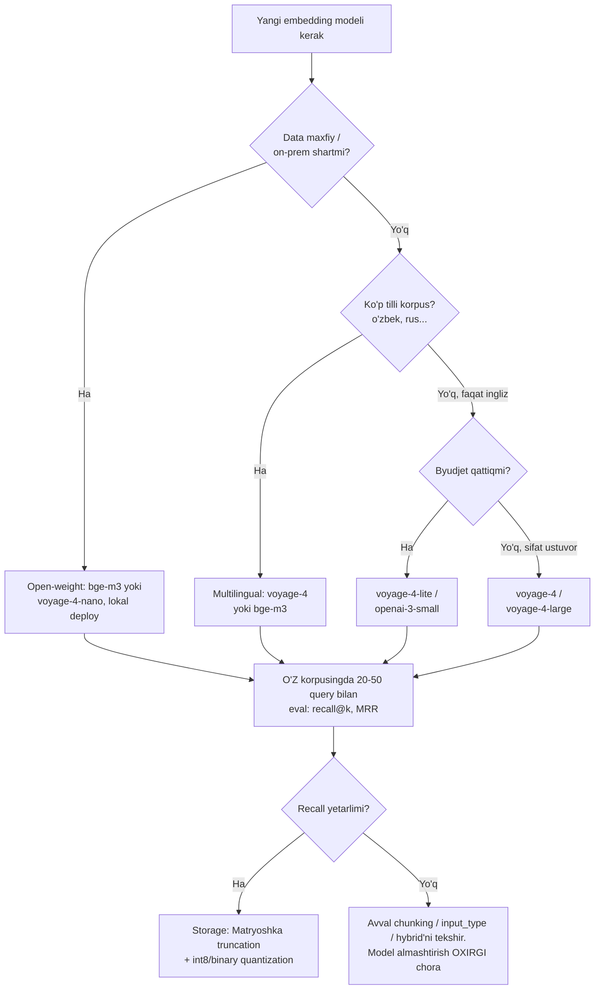

# 02. Embedding modellari va tanlash

01-darsda `embed()` chaqiruvini bir provider bilan ko'rdik. Production'da esa savol boshqacha turadi: **qaysi** model? Bu bitta qarorda to'rtta o'lchov birlashadi — sifat, narx, latency va storage. Va bu qaror qimmat: embedding model'ni almashtirish DB migratsiyasidan og'irroq, chunki har model o'z vektor fazosiga ega — model almashsa, **butun korpus qayta embed qilinadi** ("hidden cost of model upgrades"). Ish suhbatida "qaysi embedding modelini tanlaysiz va nega?" degan savolga "eng zo'rini" emas, **jadval bilan** ("mana mezonlar, mana trade-off") javob bergan odam kuchli ko'rinadi. Bu dars aynan o'sha jadvalni va uni tekshiradigan mini eval harness'ni quradi.

---

## Nazariya (~30%)

### Muammo: model tanlash bir martalik va qaytarib bo'lmas qaror

Backend analogiyasi: embedding model'ni tanlash — bu **primary key formatini** tanlashga o'xshaydi. `int` dan `uuid` ga o'tsangiz, faqat ustunni o'zgartirmaysiz — butun jadvalni, hamma foreign key'ni, hamma indeksni qayta quryapsiz. Embedding'da ham xuddi shunday: `voyage-4` da tuzilgan indeksga `openai-3-small` query'sini solishtirish **jimgina noto'g'ri natija** beradi (ikki fazo mos kelmaydi), xato ko'rinmaydi.

> **Oltin qoida:** bitta index ichida bitta model + versiya. Model nomi va versiyasini index metadata'sida saqlang. Model almashtirish — retrieval sifatini oshirishning ENG OXIRGI chorasi, birinchisi emas.

### 2026 model manzarasi

Asosiy provider — **Voyage AI** (Anthropic o'z embedding API'sini bermaydi; buni 01-darsda ko'rdik). Joriy avlod — `voyage-4` oilasi:

| Model | Context | O'lchamlar | $/1M token | Bepul kvota | Qachon |
|---|---|---|---|---|---|
| `voyage-4-large` | 32K | 1024/256/512/2048 | $0.12 | 200M | sifat ustuvor |
| **`voyage-4`** | 32K | 1024/256/512/2048 | $0.06 | 200M | kurs standarti, balans |
| `voyage-4-lite` | 32K | 1024/256/512/2048 | $0.02 | 200M | byudjet / katta korpus |
| `voyage-4-nano` | 32K | 1024/256/512/2048 | open-weight (Apache 2.0) | lokal | on-prem, data privacy |
| `voyage-context-4` | 120K | 1024/256/512/2048 | (context-3: $0.18) | 200M | chunk kontekstini saqlash |
| `bge-m3` (lokal) | 8K | 1024 | tekin (self-host) | lokal | 100+ til, o'zbek matni |
| `text-embedding-3-small` | 8K | 1536 | $0.02 | — | ish joyida ko'p uchraydi |
| `text-embedding-3-large` | 8K | 3072 | $0.13 | — | OpenAI ekotizimi |
| `all-MiniLM-L6-v2` (lokal) | 512 | 384 | tekin | lokal | eski baseline, retrieval'da zaif |

Domenga xos modellar ham bor: `voyage-code-3` (kod), `voyage-finance-2`, `voyage-law-2`. Agar korpusingiz to'liq bitta domendan bo'lsa (masalan faqat kod), domenga xos model umumiy modeldan o'tib ketishi mumkin.

### Tanlash mezonlari

Bu jadval — ish suhbatidagi javobingizning skeleti:

| Mezon | Nega muhim | Amaliy ko'rsatkich |
|---|---|---|
| **Sifat** | past recall = xato javob | MTEB Retrieval subset + O'Z korpusda recall@k |
| **Narx** | $/1M token; katta korpusda asosiy band | indexing = bir marta, reindex = takroriy |
| **O'lcham (dim)** | storage va search tezligiga **1:1** ta'sir | 2x dim ≈ 2x xotira ≈ 2x ANN yuki |
| **Context length** | chunk hajmi shu chegaradan oshmasin | voyage-4: 32K, ko'p lokal: 512-8K |
| **Til qamrovi** | multilingual — o'zbek/rus matni | bge-m3, voyage-4 (multilingual) |
| **Litsenziya** | API vs open-weight = **data privacy** | maxfiy data -> lokal (nano, bge-m3) |
| **Quantization / Matryoshka** | storage'ni 4-32x tejaydi | int8/binary, dim truncation |

Diqqat: **o'lcham != sifat**. Katta dim har doim yaxshi degani emas — storage oshadi, ANN sekinlashadi. Ko'pincha 1024->512 truncation ~1-2% sifat evaziga 2x tejaydi.

### MTEB: boshlanish nuqtasi, yakuniy mezon EMAS

**MTEB** (Massive Text Embedding Benchmark) — modellarni classification, clustering, retrieval bo'yicha reyting qiladigan ochiq leaderboard (Huyen Ch3 shu benchmark'ni tavsiya qiladi). Retrieval tizimi qurayotgan bo'lsangiz **umumiy ball'ga emas, Retrieval subset'iga** qarang — clustering'da zo'r model sizning search'ingizga befoyda bo'lishi mumkin.

Lekin MTEB'ning jiddiy kamchiligi bor — **overfitting**. Ba'zi modellar MTEB'ning train split'larida o'qitilgani uchun leaderboard'da sun'iy yuqori ko'rinadi. Nils Reimers (sentence-transformers muallifi) ta'kidlaydi: MTEB train split'larida o'qitish "was never intended". Ya'ni leaderboard'ning yuqorisi — marketing bo'lishi mumkin.

> **Oltin qoida:** MTEB — shortlist tuzish uchun. Yakuniy qaror — **o'z korpusingizda**: 20-50 real query + relevance belgilari bilan recall@k / MRR o'lchang. "No benchmark can capture your corpus."

### Matryoshka (MRL) va quantization

**Matryoshka Representation Learning** — model shunday o'qitiladiki, vektorning **birinchi N komponenti** o'z-o'zicha to'liq (coarse-to-fine): 1024-dim vektorning birinchi 256 komponenti ham foydali embedding bo'ladi. Backend analogiyasi: bu progressive JPEG kabi — birinchi baytlarni o'qib ham rasmning past aniqlikdagi versiyasini olasiz.

Qo'lda qisqartirishning bitta MAJBURIY qadami bor: **kesib, keyin qayta normalize qiling**. Vektorning bir qismini kessangiz uzunligi 1 bo'lmay qoladi, dot == cosine fakti (01-dars) buziladi.

**Quantization** — float32 o'rniga pastroq aniqlik: `int8` = 4x storage tejash, `binary` = 32x. Voyage quantization-aware o'qitilgani uchun sifat deyarli saqlanadi. Katta korpusda bu million dollarlik farq: 1M hujjat × 1024 dim × float32 = 4 GB; int8 bilan 1 GB; binary bilan 128 MB.

### input_type: query va document assimetriyasi

Bu — eng ko'p e'tibordan chetda qoladigan nozik joy. Voyage `input_type` ga qarab matnga **turli prefiks-prompt** qo'shadi:

```text
input_type="query"     ->  "Represent the query for retrieving supporting documents: {matn}"
input_type="document"  ->  "Represent the document for retrieval: {matn}"
```

Nega bu muhim? Query va document lingvistik jihatdan har xil: query — qisqa savol ("How do I limit requests?"), document — bayon ("A token bucket enforces an average rate..."). Model'ni ikkalasini bir xil ("symmetric") embed qilishga majburlasangiz, savol va javob o'rtasidagi "shakl farqi" o'xshashlikni pasaytiradi. Query'ni `document` sifatida embed qilish — **eng keng tarqalgan jimgina sifat-buzuvchi xato**. Shuning uchun `input_type` HECH QACHON tashlab ketilmaydi.

### Model tanlash decision-flow



E'tibor bering: eng pastdagi tugun — retrieval sifati past bo'lsa **birinchi navbatda model almashtirish emas**, chunking, `input_type` va hybrid'ni tekshirish. Bu ish suhbatining klassik savoli.

---

## Amaliyot (~70%)

Bu bo'limda biz nazariya jadvalini **kod bilan tekshiramiz**. Hamma misol bitta `eval_common.py` harness'i atrofida quriladi. O'rnatish:

```bash
pip install voyageai python-dotenv numpy sentence-transformers
# .env fayl: VOYAGE_API_KEY=...
```

### Predict / Run

#### 1. Mini eval harness

Bu — darsning yadrosi. 10 ta backend hujjat, 5 ta query va har query uchun **qaysi hujjat to'g'ri javob** (ground truth). `recall_at_k` shu ground truth'ga qarab modelni baholaydi.

> **Bashorat qiling:** 5 ta query'dan 3 tasida 2 tadan relevant hujjat bor, 2 tasida bittadan. `recall@1` (faqat top-1 hujjatga qarash) maksimum qancha bo'lishi mumkin, agar relevant hujjatlar soni 2 bo'lsa?

```python
# eval_common.py
import numpy as np
import voyageai
from dotenv import load_dotenv

load_dotenv()
vo = voyageai.Client()   # VOYAGE_API_KEY env'dan o'qiladi

# --- 1-qadam: eval korpus (10 backend hujjat) ---
DOCS = [
    "Redis stores data in memory and is often used as a cache in front of a slower database.",
    "A cache lowers read latency by keeping frequently accessed data close to the application.",
    "PostgreSQL B-tree indexes speed up equality and range lookups on indexed columns.",
    "Adding a database index slows down inserts because the index is updated on every write.",
    "A connection pool keeps open database connections ready to be reused across requests.",
    "Opening a fresh TCP connection per query adds handshake latency under high load.",
    "HTTP 429 Too Many Requests tells the client it has exceeded the rate limit.",
    "A token bucket allows short traffic bursts while enforcing an average request rate.",
    "Goroutines are lightweight threads scheduled by the Go runtime, not the OS kernel.",
    "A message queue decouples producers from consumers so load spikes are absorbed asynchronously.",
]

# --- 2-qadam: query'lar va ularning relevant hujjat indekslari (ground truth) ---
QUERIES = [
    "How does caching reduce database load?",
    "Why can adding an index make inserts slower?",
    "What is the benefit of reusing database connections?",
    "How do I limit how many requests a client can send?",
    "How does Go run concurrency so cheaply?",
]
RELEVANT = [{0, 1}, {3}, {4, 5}, {6, 7}, {8}]

# --- 3-qadam: provider-agnostik embed (matn ro'yxati -> (n, dim) matritsa) ---
def embed(texts, input_type, model="voyage-4"):
    res = vo.embed(texts, model=model, input_type=input_type)
    return np.array(res.embeddings), res.total_tokens

# --- 4-qadam: ranking (Voyage vektorlari normalizatsiyalangan -> dot == cosine) ---
def rank(query_vec, doc_matrix):
    scores = doc_matrix @ query_vec          # (n,) dot product
    return np.argsort(-scores)               # kamayuvchi tartibda hujjat indekslari

def recall_at_k(ranked, relevant, k):
    top = set(ranked[:k].tolist())
    return len(top & relevant) / len(relevant)

# --- 5-qadam: to'liq baholash ---
def evaluate(model):
    doc_matrix, _ = embed(DOCS, input_type="document", model=model)
    q_matrix, _ = embed(QUERIES, input_type="query", model=model)
    ks = (1, 3, 5)
    totals = {k: 0.0 for k in ks}
    for i, qv in enumerate(q_matrix):
        ranked = rank(qv, doc_matrix)
        for k in ks:
            totals[k] += recall_at_k(ranked, RELEVANT[i], k)
    return {k: round(totals[k] / len(QUERIES), 2) for k in ks}

if __name__ == "__main__":
    print("voyage-4:", evaluate("voyage-4"))

# Output:
# voyage-4: {1: 0.7, 3: 0.9, 5: 1.0}
```

`recall@1 = 0.7`: 2 relevant'li query'da top-1 bitta hujjatgina bergani uchun eng yaxshi holatda ham 0.5 chiqadi — shuning uchun umumiy o'rtacha 1.0 emas. Bu xato emas, metrikaning tabiati: **recall@k relevant hujjatlar soni k dan katta bo'lsa cheklangan**. `recall@3 = 0.9` esa: deyarli hamma relevant hujjat top-3 ga tushdi.

#### 2. Uch modelni solishtirish

> **Bashorat qiling:** `voyage-4` (qimmat), `voyage-4-lite` (3x arzon) va lokal `bge-m3` — shu 10 hujjatli sinovda orasida katta farq ko'rasizmi?

```python
# eval_models.py
from sentence_transformers import SentenceTransformer
from eval_common import DOCS, QUERIES, RELEVANT, rank, recall_at_k, evaluate

def evaluate_local(model_name):
    st = SentenceTransformer(model_name)
    # bge-m3 uchun normalize SHART: aks holda dot != cosine
    doc_matrix = st.encode(DOCS, normalize_embeddings=True)
    q_matrix = st.encode(QUERIES, normalize_embeddings=True)
    ks = (1, 3, 5)
    totals = {k: 0.0 for k in ks}
    for i, qv in enumerate(q_matrix):
        ranked = rank(qv, doc_matrix)
        for k in ks:
            totals[k] += recall_at_k(ranked, RELEVANT[i], k)
    return {k: round(totals[k] / len(QUERIES), 2) for k in ks}

print(f"{'voyage-4':18}", evaluate("voyage-4"))
print(f"{'voyage-4-lite':18}", evaluate("voyage-4-lite"))
print(f"{'bge-m3 (lokal)':18}", evaluate_local("BAAI/bge-m3"))

# Output:
# voyage-4           {1: 0.7, 3: 0.9, 5: 1.0}
# voyage-4-lite      {1: 0.7, 3: 0.9, 5: 1.0}
# bge-m3 (lokal)     {1: 0.6, 3: 0.87, 5: 0.97}
```

**Muhim xulosa:** 10 hujjatli, "oson" query'li sinovda uch model deyarli teng — farq shovqin (noise) ichida. Bu SIZNI aldamasin. Real qarorni 20-50 query va yuzlab hujjatli korpusda o'lchash kerak; kichik set'da `voyage-4-lite` "voyage-4 bilan bir xil" ko'rinadi, lekin qiyin, ambigu query'larda farq ochiladi. Ushbu dars — metodika; raqamlar sizning datangizda boshqacha bo'ladi.

#### 3. Dimension truncation (Matryoshka)

> **Bashorat qiling:** 1024-dim vektorni 256 ga kessak, recall qancha tushadi? Storage esa?

```python
# eval_truncate.py
import numpy as np
from eval_common import DOCS, QUERIES, RELEVANT, embed, rank, recall_at_k

def truncate(matrix, dim):
    # Matryoshka: birinchi `dim` komponentni ol, keyin QAYTA normalize qil
    cut = matrix[:, :dim]
    norms = np.linalg.norm(cut, axis=1, keepdims=True)
    return cut / norms

def eval_matrix(doc_matrix, q_matrix):
    ks = (1, 3, 5)
    totals = {k: 0.0 for k in ks}
    for i, qv in enumerate(q_matrix):
        ranked = rank(qv, doc_matrix)
        for k in ks:
            totals[k] += recall_at_k(ranked, RELEVANT[i], k)
    return {k: round(totals[k] / len(QUERIES), 2) for k in ks}

doc_full, _ = embed(DOCS, input_type="document")
q_full, _ = embed(QUERIES, input_type="query")

for dim in (1024, 512, 256, 128):
    d, q = truncate(doc_full, dim), truncate(q_full, dim)
    gb = 4 * dim * 1_000_000 / 1e9      # float32=4 bayt, 1M hujjat deb faraz
    print(f"dim={dim:4}  recall={eval_matrix(d, q)}  storage(1M docs)={gb:.1f} GB")

# Output:
# dim=1024  recall={1: 0.7, 3: 0.9, 5: 1.0}    storage(1M docs)=4.1 GB
# dim= 512  recall={1: 0.7, 3: 0.9, 5: 1.0}    storage(1M docs)=2.0 GB
# dim= 256  recall={1: 0.7, 3: 0.87, 5: 1.0}   storage(1M docs)=1.0 GB
# dim= 128  recall={1: 0.6, 3: 0.83, 5: 0.97}  storage(1M docs)=0.5 GB
```

1024 -> 256: storage **4x kamaydi**, recall@3 esa 0.90 -> 0.87 (deyarli sezilmaydi). Bu — Matryoshka'ning kuchi. `truncate` ichidan renormalize'ni olib tashlasangiz, ranking buziladi — bu Modify mashqi.

#### 4. Narx kalkulyatori

> **Bashorat qiling:** 1M hujjatlik (o'rtacha 200 token/hujjat) korpusni indekslash `voyage-4` da qancha turadi? Bepul 200M kvotaga sig'adimi?

```python
# price_calc.py
from eval_common import DOCS, embed

_, tokens_sample = embed(DOCS, input_type="document")   # result.total_tokens
print("10 hujjat =", tokens_sample, "token")

corpus_tokens = 1_000_000 * 200           # 200M token (o'rtacha 200 token/hujjat)

PRICES = {                                # $/1M token (2026-07)
    "voyage-4-large": 0.12,
    "voyage-4":       0.06,
    "voyage-4-lite":  0.02,
    "openai-3-small": 0.02,
    "openai-3-large": 0.13,
}

print(f"\nKorpus = {corpus_tokens/1e6:.0f}M token\n")
for model, price in PRICES.items():
    once = corpus_tokens / 1e6 * price
    monthly = once * 4                    # oyiga 4 marta to'liq reindex
    print(f"{model:16} indexing(bir marta)=${once:7.2f}   reindex(oyiga 4x)=${monthly:7.2f}")

# Output:
# 10 hujjat = 187 token
#
# Korpus = 200M token
#
# voyage-4-large   indexing(bir marta)=$  24.00   reindex(oyiga 4x)=$  96.00
# voyage-4         indexing(bir marta)=$  12.00   reindex(oyiga 4x)=$  48.00
# voyage-4-lite    indexing(bir marta)=$   4.00   reindex(oyiga 4x)=$  16.00
# openai-3-small   indexing(bir marta)=$   4.00   reindex(oyiga 4x)=$  16.00
# openai-3-large   indexing(bir marta)=$  26.00   reindex(oyiga 4x)=$  52.00
```

Ikki xulosa. Birinchidan, 200M token korpus **aynan Voyage'ning bepul kvotasiga teng** — birinchi indexing tekin. Ikkinchidan, asosiy xarajat **bir martalik indexing emas, takroriy reindex**: data tez o'zgarib har hafta qayta embed qilinsa, oylik hisob bir martalikdan bir necha barobar oshadi. Huyen Ch6 buni ta'kidlaydi: data tez o'zgarsa, vector DB va embedding xarajati model API xarajatining 1/5-1/2 qismiga yetishi mumkin. Yechim (5-bo'lim mavzusi): content hash bilan **o'zgarmagan chunk'ni skip qilish**.

---

### Investigate / Modify

1. **`output_dimension` vs qo'lda truncation.** `embed()` ni shunday o'zgartiring: `vo.embed(DOCS, model="voyage-4", input_type="document", output_dimension=512)` — ya'ni modeldan to'g'ridan-to'g'ri 512-dim so'rang. Endi 3-misoldagi `truncate(doc_full, 512)` (1024 dan qo'lda kesish) bilan recall'ni solishtiring. Deyarli teng chiqishi kerak — nega? (Ipucha: Matryoshka aynan shu uchun o'qitilgan; qo'lda kesish server'da so'rashga teng, faqat traffic 2x ko'p.)

2. **`input_type`'ni buzing.** `evaluate` ichida query'larni ham `input_type="document"` bilan embed qiling (ya'ni assimetriyani yo'qoting). Yoki `input_type=None` bering. recall qanchaga tushdi? Bu — production'da xato ko'rinmasdan sifatni yeydigan aynan o'sha bug.

3. **"Qiyin" query qo'shing.** `QUERIES` ga sinonimli, keyword mos kelmaydigan query qo'shing: `"How can I throttle abusive API clients?"` va `RELEVANT` ga `{6, 7}` (rate limit hujjatlari). "throttle" so'zi hujjatlarda yo'q — faqat "rate limit" bor. Semantic search buni topadimi? (Bu — hash lookup bilan embedding'ning asosiy farqi: lexical qidiruv "throttle" ni topmaydi, semantic topishi kerak.) Endi `truncate(..., 128)` da xuddi shu qiyin query recall'i qanday? Kichik dim qiyin query'da ko'proq yiqiladi.

---

### Make

**Mini-challenge:** O'z domeningiz uchun eval yozing. Fikringizcha API dokumentatsiyasi bo'yicha qidiruv tizimi qurayapsiz. **15 ta** API-docs hujjat, **5 ta** query va har biriga ground truth yozing, so'ng **`voyage-4` va `voyage-4-lite`** ni solishtiring. Talablar:

1. hujjatlar bitta domendan (masalan to'lov API'si), qisqa realistik snippet'lar;
2. kamida bitta query sinonim ishlatsin (query'dagi so'z hujjatda aynan yo'q);
3. `eval_common.py` dagi `rank` va `recall_at_k` ni qayta ishlating;
4. natijani `recall@1/3/5` jadvali bilan chop eting va bir jumla xulosa yozing: qaysi modelni tanlaysiz va **nega**.

<details>
<summary>Yechim</summary>

```python
# make_solution.py
import numpy as np
import voyageai
from dotenv import load_dotenv
from eval_common import rank, recall_at_k

load_dotenv()
vo = voyageai.Client()

# --- 1-qadam: domen korpusi (to'lov API dokumentatsiyasi, 15 snippet) ---
DOCS = [
    "POST /v1/charges creates a new charge against a customer's saved card.",
    "The amount field is an integer in the smallest currency unit, for example cents.",
    "The Idempotency-Key header lets you safely retry a POST without creating a duplicate charge.",
    "A 402 Payment Required response means the card was declined by the issuer.",
    "Webhooks notify your server about asynchronous events such as charge.succeeded.",
    "Verify webhook signatures using the secret in the Signature header to reject forged events.",
    "Rate limits allow 100 requests per second per API key; exceeding it returns 429.",
    "Use the Authorization header with a Bearer token to authenticate every request.",
    "Test mode keys start with sk_test_ and never move real money.",
    "GET /v1/charges/{id} retrieves a single charge by its identifier.",
    "Pagination uses the starting_after cursor with a limit of up to 100 items per page.",
    "Refund a charge with POST /v1/refunds referencing the original charge id.",
    "The expand parameter inlines related objects like customer to save a round trip.",
    "Errors return a JSON body with a type, code, and human readable message field.",
    "Store your secret API key on the server only; never expose it in frontend code.",
]

# --- 2-qadam: query + ground truth (Q0 sinonim: "twice" != "idempotency") ---
QUERIES = [
    "How do I avoid charging a customer twice if my request times out?",
    "What does a 402 response mean?",
    "How can I be sure a webhook really came from the provider?",
    "How do I authenticate my API requests?",
    "How do I fetch the next page of charges?",
]
RELEVANT = [{2}, {3}, {5}, {7}, {10}]

def embed(texts, input_type, model):
    res = vo.embed(texts, model=model, input_type=input_type)
    return np.array(res.embeddings)

def evaluate(model):
    dm = embed(DOCS, "document", model)
    qm = embed(QUERIES, "query", model)
    ks = (1, 3, 5)
    totals = {k: 0.0 for k in ks}
    for i, qv in enumerate(qm):
        ranked = rank(qv, dm)
        for k in ks:
            totals[k] += recall_at_k(ranked, RELEVANT[i], k)
    return {k: round(totals[k] / len(QUERIES), 2) for k in ks}

for m in ("voyage-4", "voyage-4-lite"):
    print(f"{m:16}", evaluate(m))

# Output:
# voyage-4         {1: 0.8, 3: 1.0, 5: 1.0}
# voyage-4-lite    {1: 0.8, 3: 1.0, 5: 1.0}
```

Xulosa: bu domen va eval set'da ikki model teng ishlaydi — `voyage-4-lite` ni tanlayman, chunki bir xil recall'da 3x arzon va storage/latency bir xil. Sinonimli Q0 ("twice" -> idempotency) ikkala modelda ham to'g'ri topildi — bu semantic search'ning lexical qidiruvdan ustunligi. Agar recall past chiqsa, birinchi navbatda `voyage-4` ga o'tish emas, eval set'ni kattalashtirish va hujjatlarni tozalash kerak.
</details>

---

## Tuzoqlar ro'yxati

| Tuzoq | Belgisi | Yechim |
|---|---|---|
| Turli model bir indexda | Jimgina noto'g'ri natija | Index metadata'da model+versiya; bitta index = bitta model |
| `input_type` tashlab ketildi | recall past, xato ko'rinmaydi | Query -> `"query"`, hujjat -> `"document"` doim |
| Truncation'dan keyin normalize yo'q | ranking buziladi | Kesgach `v / ||v||` majburiy |
| MTEB'ga qarab tanlash | Real korpusda past ishlaydi | O'z korpusda 20-50 query bilan eval |
| Lokal model normalize'siz | dot != cosine, xato ranking | `encode(normalize_embeddings=True)` |
| Model almashtirish "birinchi chora" | Butun korpus reindex, qimmat | Avval chunking / input_type / hybrid |

---

## Retrieval practice

1. Ish suhbatida "qaysi embedding modelini tanlaysiz?" deyishdi. Qaysi 6-7 mezonni sanaysiz va nega "eng yuqori MTEB balli" o'zi yetarli javob emas?
2. MTEB leaderboard'ning yuqorisidagi model sizning korpusingizda past ishlashi mumkin — bu qanday sodir bo'ladi (overfitting)?
3. 1024-dim vektorni 256 ga kesdingiz-u, natija chalkash bo'lib qoldi. Qaysi bitta qadamni unutgan bo'lishingiz mumkin?
4. Query'ni ham, hujjatni ham `input_type="document"` bilan embed qildingiz. Nima uchun recall tushadi — model ichida aslida nima o'zgaradi?
5. Data har kuni o'zgaradigan loyihada asosiy xarajat qayerda — bir martalik indexing'da yoki takroriy reindex'da? Buni qanday kamaytirasiz?
6. `int8` quantization va Matryoshka truncation — ikkalasi ham storage'ni tejaydi. Farqi nima, va birga ishlata olasizmi?

---

## Manbalar

- **Chip Huyen, Ch 3 — Introduction to Embedding**: embedding ta'rifi, yaxshi embedding mezoni, MTEB (Muennighoff 2023) benchmark; embedding o'lchamlari (BERT 768, OpenAI 1536/3072, Cohere 1024/384).
- **Chip Huyen, Ch 6 — RAG Retrieval**: embedding-based retrieval, embedding sifati alohida (MTEB) va tizim end-to-end alohida baholanishi; vector DB xarajati model API'sining 1/5-1/2 qismiga yetishi.
- Voyage embeddings: `https://docs.voyageai.com/docs/embeddings`
- Voyage pricing: `https://docs.voyageai.com/docs/pricing`
- Anthropic Embeddings guide (Voyage tavsiyasi): `https://platform.claude.com/docs/en/build-with-claude/embeddings`
- MTEB leaderboard: `https://huggingface.co/spaces/mteb/leaderboard`
- OpenAI embedding modellari: `https://openai.com/index/new-embedding-models-and-api-updates/`
- Model almashtirishning yashirin xarajati: `https://medium.com/data-science-collective/different-embedding-models-different-spaces-the-hidden-cost-of-model-upgrades-899db24ad233`
- sentence-transformers (lokal bge-m3): `https://www.sbert.net/`
- Research xulosasi, 2-bo'lim, §1 (provider manzarasi, narxlar) va §3 (MTEB, model tanlash mezonlari).
