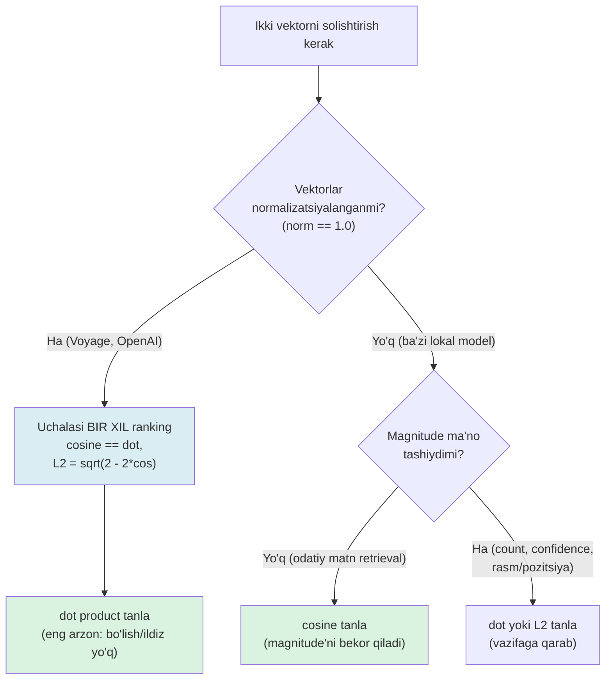

# 03. Similarity metrics — cosine, dot product, euclidean

Vector database yaratishda birinchi so'raladigan savol model emas — **distance metric**. `pgvector`'da index yaratganda uchta operator klassidan bittasini tanlaysan: `vector_cosine_ops`, `vector_ip_ops` (inner product = dot), `vector_l2_ops`. Bu tanlov 3-bo'limda keladi, lekin uni ANGLAB tanlash uchun poydevor shu darsda quyiladi. Noto'g'ri metrika HTTP 500 bermaydi, exception otmaydi — u shunchaki **jimgina noto'g'ri ranking** qaytaradi, va sen buni faqat eval dataset'da recall tushganda sezasan. Ish suhbatining klassik savoli: "cosine va dot product farqi qachon muhim?" — javob "hech qachon" ham, "har doim" ham emas, va bu darsdan keyin sen aniq qachonligini bilasan.

---

## Nazariya (~30%)

### 1. Uchta metrika — bitta savolga uch xil javob

Har uchala metrika bitta savolga javob beradi: "bu ikki vektor qanchalik yaqin?". Farqi — "yaqin" so'zini qanday ta'riflashda.

Backend analogiyasi bilan: bu xuddi ikkita `[]float64` slice'ni solishtirishning uch usuli kabi — biri faqat **yo'nalishga** qaraydi, biri **yo'nalish + uzunlikka**, biri **fazodagi haqiqiy masofaga**.

| Metrika | Formula | Nimani o'lchaydi | Diapazon | Yaqin = |
|---|---|---|---|---|
| **Cosine similarity** | A·B / (‖A‖·‖B‖) | faqat yo'nalish (burchak), magnitude e'tiborsiz | [-1, 1] | 1 ga yaqin |
| **Dot product** (inner product) | A·B = Σ aᵢbᵢ | yo'nalish VA magnitude | (-∞, +∞) | katta musbat |
| **Euclidean (L2)** | √(Σ (aᵢ-bᵢ)²) | fazodagi haqiqiy masofa | [0, +∞) | 0 ga yaqin |

Uchta atamani darhol izohlaymiz:

- **magnitude** (‖A‖, "norm", uzunlik) — vektorning boshdan uchigacha bo'lgan uzunligi: ‖A‖ = √(Σ aᵢ²). Matn embedding'ida bu ko'pincha "matn qancha uzun / qancha ishonch" bilan bog'liq bo'ladi.
- **dot product** — komponentlar ko'paytmasining yig'indisi. `numpy`'da `np.dot(a, b)`. 01-darsdan tanish.
- **normalization** — vektorni o'z uzunligiga bo'lib, uzunligini 1 ga keltirish: Â = A / ‖A‖.

### 2. Geometrik intuitsiya — 2D misolda

Uch nuqtani 2D'da tasavvur qil. `doc1 = [3, 0]`, `doc2 = [6, 0]`, `query = [1, 0]`. Uchalasi ham **bir xil yo'nalishda** (musbat X o'qi bo'ylab), faqat uzunliklari har xil.

- **Cosine**: uchalasining orasidagi burchak = 0 daraja → cos = 1 hammasiga. Cosine uchun `doc1` va `doc2` `query`'ga **bir xil o'xshash**, chunki u faqat burchakka qaraydi.
- **Dot**: `query·doc1 = 3`, `query·doc2 = 6`. Dot uchun `doc2` "ikki barobar o'xshash" — chunki u uzunroq.
- **L2**: `query`'dan `doc1`'gacha masofa = 2, `doc2`'gacha = 5. L2 uchun `doc1` yaqinroq.

Ana shu bitta oddiy misolda uchala metrika **uch xil ranking** berdi. Endi savol: qachon ular bir xil bo'ladi?

### 3. Markaziy teorema — normalizatsiya hammani birlashtiradi

Agar ikkala vektor ham **normalizatsiyalangan** bo'lsa (‖A‖ = ‖B‖ = 1), uchta hodisa yuz beradi:

**(a) cosine == dot.** Formulaga qara: cosine = A·B / (‖A‖·‖B‖) = A·B / (1·1) = **A·B** = dot. Maxraj 1 ga aylandi va yo'qoldi. Ikkala metrika **bit-mos ayni bir son** bo'ladi.

**(b) L2² = 2 − 2·cos.** Kvadratni ochib chiqaramiz:

```text
‖A − B‖²  = ‖A‖² + ‖B‖² − 2·(A·B)
          = 1     + 1     − 2·cos
          = 2 − 2·cos
```

**(c) Uchalasi BIR XIL ranking beradi.** L2² cosine'ning kamayuvchi funksiyasi: cos qancha katta bo'lsa, L2 shuncha kichik. Ya'ni cosine bo'yicha eng o'xshash element = dot bo'yicha eng katta = L2 bo'yicha eng yaqin. **Argsort natijasi aynan bir xil.**

> **Oltin qoida:** vektorlar normalizatsiyalangan bo'lsa — uchala metrika bir xil ranking beradi, shuning uchun **dot product** tanlanadi (bo'lish ham, ildiz ham yo'q — eng arzon hisob). Normalizatsiyalanmagan bo'lsa — metrika tanlovi natijani o'zgartiradi va **cosine** eng xavfsiz default.

Bu shunchaki nazariya emas — bu production qarori. **Voyage va OpenAI embeddinglari L2-normalizatsiyalangan** (uzunlik = 1). Shuning uchun `pgvector`'da ular uchun `vector_ip_ops` (dot) tanlanadi: bir xil natija, tez hisob. Lokal modellarda (`sentence-transformers`) esa normalizatsiya **kafolatlanmaydi** — o'zing tekshirasan yoki `normalize_embeddings=True` berasan.

### 4. Qachon farq HAQIQATAN bor

Teorema shartga bog'liq: **normalizatsiyalangan bo'lsa**. Shart buzilsa, farq paydo bo'ladi:

- **Magnitude ma'no tashisa.** Ba'zi vektorlarda uzunlik ataylab signal bo'ladi — masalan hujjatning "ishonch"i, kalit so'z chastotasi, count-based feature'lar. Bunda dot magnitude'ni hisobga oladi (uzunroq/ishonchliroq vektor yuqori chiqadi), cosine esa uni tashlab yuboradi. Qaysi biri to'g'ri — vazifaga bog'liq.
- **Rasm / pozitsiya / koordinata fazolari.** L2 bu yerda tabiiy: ikki nuqta orasidagi haqiqiy fizik masofa muhim bo'lsa (embedding geometrik ma'noga ega bo'lsa).
- **Normalizatsiyalanmagan lokal model.** `all-MiniLM` yoki `bge-m3`'ni `normalize_embeddings` bermay ishlatsang — dot va cosine turli natija beradi, chunki har vektorning uzunligi har xil.

### 5. Threshold tuzog'i — 0.7 sehrli son emas

Metrika sonini olgach, keyingi savol: "qaysi qiymatdan yuqorisi 'o'xshash'?". Ko'p yangi boshlovchi `0.7`'ni universal chegara deb oladi. Bu xato.

> Cosine 0.7 bir model+domenda "juda o'xshash", boshqasida "deyarli aloqasiz" degani. Threshold — bu **model va korpusga bog'liq empirik parametr**, uni eval dataset'da kalibrlaysan, kitobdan ko'chirmaysan.

Ikki yondashuv bor:

| Yondashuv | Qanday ishlaydi | Qachon |
|---|---|---|
| **Top-k** | eng o'xshash k tani ol, chegara yo'q | RAG retrieval — doim k ta chunk kerak |
| **Threshold** | similarity > τ bo'lganlarni ol | dedup, "topilmadi" holati bo'lishi mumkin bo'lganda |

### 6. Uchta jimgina xato (pitfalls)

Research fayl §2 va §5 dan — bular exception otmaydi, shuning uchun eng xavflisi:

1. **Turli model embeddinglarini solishtirish.** Har model o'z vektor fazasiga ega — Voyage vektori bilan OpenAI vektori orasidagi cosine **ma'nosiz son**. Index metadata'sida model nomi + versiya saqlanishi shart. Modelni yangilash = butun korpusni qayta embed qilish ("hidden cost of model upgrades").
2. **Similarity ≠ relevance.** "How do I reset my password?" query'siga eng yuqori cosine beradigan matn — ko'pincha **xuddi shu savol boshqacha aytilgani**, javob emas. Savol savolga o'xshaydi. Bu 4-bo'limda reranking bilan hal qilinadi.
3. **input_type assimetriyasini unutish.** Query'ni `input_type="document"` bilan embed qilsang — similarity soni chiqadi, xato ko'rinmaydi, lekin ranking sifati jimgina tushadi (02-darsdan).

### Metrika tanlash — qaror daraxti



---

## Amaliyot (~70%)

Umumiy tayyorgarlik:

```bash
pip install voyageai python-dotenv numpy
echo 'VOYAGE_API_KEY=pa-...' > .env
```

```python
# common.py — barcha misollar shu helper'dan foydalanadi
import os
import numpy as np
import voyageai
from dotenv import load_dotenv

load_dotenv()
vo = voyageai.Client()  # VOYAGE_API_KEY env'dan o'qiladi

def embed(texts: list[str], input_type: str = "document") -> np.ndarray:
    # Provider-agnostik interfeys (02-darsdan). Voyage vektorlari L2-normalizatsiyalangan.
    res = vo.embed(texts, model="voyage-4", input_type=input_type)
    return np.array(res.embeddings, dtype=np.float32)  # shape: (len(texts), 1024)
```

### Predict / Run

#### 1-mashq: uchala metrikani qo'lda yozish

Avval hech qanday API'siz, sof `numpy` bilan uchta funksiyani yozamiz va kichik 3D vektorlarda tekshiramiz. Maqsad — formulani "qora quti"siz his qilish.

> **Ishga tushirishdan oldin bashorat qil:** `q = [1, 0, 0]`, `a = [2, 0, 0]` (bir xil yo'nalish, ikki barobar uzun), `b = [1, 1, 0]` (45 daraja burilgan). Cosine bo'yicha `q`'ga qaysi biri yaqin — `a` yoki `b`? Dot bo'yicha-chi? Ranking bir xil chiqadimi?

```python
# 01_metrics_by_hand.py
import numpy as np

# --- Uchala metrikani ta'rifidan yozamiz ---
def cosine_sim(a, b):
    return float(np.dot(a, b) / (np.linalg.norm(a) * np.linalg.norm(b)))

def dot_sim(a, b):
    return float(np.dot(a, b))

def l2_dist(a, b):
    return float(np.linalg.norm(a - b))  # sqrt(sum((a-b)^2))

q = np.array([1.0, 0.0, 0.0])
a = np.array([2.0, 0.0, 0.0])   # q bilan bir yo'nalish, 2x uzun
b = np.array([1.0, 1.0, 0.0])   # q'dan 45 daraja burilgan

for name, v in [("a (2x uzun)", a), ("b (45 daraja)", b)]:
    print(f"{name:14} cos={cosine_sim(q, v):.3f}  "
          f"dot={dot_sim(q, v):.3f}  l2={l2_dist(q, v):.3f}")

# Output:
# a (2x uzun)    cos=1.000  dot=2.000  l2=1.000
# b (45 daraja)  cos=0.707  dot=1.000  l2=1.000
```

Nima o'rgandik:

- **Cosine** uchun `a` mukammal o'xshash (1.000, bir xil yo'nalish), `b` esa 0.707 (= cos 45°). Uzunlik e'tiborsiz.
- **Dot** uchun `a` (2.000) `b`'dan (1.000) ikki barobar "o'xshash" — chunki u uzunroq. Magnitude ranking'ni o'zgartirdi.
- **L2** ikkalasiga ham 1.000 — tasodif emas, ikkalasi ham `q`'dan bir xil masofada. Ya'ni **cosine, dot, L2 bu yerda uch xil ranking berdi** (normalizatsiyalanmagan vektorlar!).

#### 2-mashq: normalizatsiya isboti + uch metrika bir xil ranking

Endi teoremani real Voyage vektorlarida sinaymiz. Avval `norm == 1.0` ekanini tekshiramiz, keyin uchala metrika bilan bitta korpusni rank qilamiz.

> **Bashorat qil:** Voyage vektorlarining `np.linalg.norm` qiymati nechchi bo'ladi? Uchala metrika bo'yicha `argsort` (ranking) natijasi bir xil chiqadimi yoki farq qiladimi?

```python
# 02_normalized_ranking.py
import numpy as np
from common import embed

corpus = [
    "Postgres connection pool timeout sozlamalari",
    "PgBouncer bilan ulanishlarni qanday cheklash mumkin",
    "Kubernetes'da pod'lar avtomatik scale bo'lishi",
    "Bugun ob-havo issiq va quyoshli",
]
query = "database ulanishlar soni juda ko'payib ketdi"

# --- 1-qadam: embed qilamiz (Voyage L2-normalizatsiyalangan qaytaradi) ---
C = embed(corpus, input_type="document")            # (4, 1024)
q = embed([query], input_type="query")[0]           # (1024,)

# --- 2-qadam: normalizatsiyani TEKSHIRAMIZ (ishonma, tekshir) ---
norms = np.linalg.norm(C, axis=1)
print("korpus normlari:", np.round(norms, 5))        # hammasi ~1.0 bo'lishi kerak
assert np.allclose(norms, 1.0, atol=1e-3), "normalizatsiyalanmagan!"

# --- 3-qadam: uchala metrika bo'yicha ranking (eng o'xshashdan pastga) ---
cos_rank = np.argsort(-(C @ q))                       # normalized => cos == dot
dot_rank = np.argsort(-(C @ q))                       # ayni C @ q
l2_rank  = np.argsort(np.linalg.norm(C - q, axis=1))  # eng yaqin masofa oldinda

print("cosine ranking:", cos_rank.tolist())
print("dot    ranking:", dot_rank.tolist())
print("l2     ranking:", l2_rank.tolist())

# --- 4-qadam: uchalasi bir xil ekanini ASSERT bilan tasdiqlaymiz ---
assert cos_rank.tolist() == dot_rank.tolist() == l2_rank.tolist()
print("Uchala metrika BIR XIL ranking berdi (teorema tasdiqlandi).")

# Output:
# korpus normlari: [1. 1. 1. 1.]
# cosine ranking: [0, 1, 2, 3]
# dot    ranking: [0, 1, 2, 3]
# l2     ranking: [0, 1, 2, 3]
# Uchala metrika BIR XIL ranking berdi (teorema tasdiqlandi).
```

`C @ q` — bu matritsa-vektor ko'paytmasi: har bir korpus vektorining `q` bilan dot product'i, bitta amalda. Normalizatsiyalangan vektorlarda bu aynan cosine. Diqqat: connection pool haqidagi ikki hujjat (0, 1) yuqorida, ob-havo (3) eng pastda — semantik moslik ishladi.

#### 3-mashq: normalizatsiyani buzsak nima bo'ladi

Endi teoremaning shartini ataylab buzamiz: bitta hujjat vektorini 2 ga ko'paytiramiz (magnitude'ni sun'iy oshiramiz). Dot ranking buziladi, cosine barqaror qoladi.

> **Bashorat qil:** eng oxirgi (ob-havo, aloqasiz) hujjat vektorini 3 ga ko'paytirsak — dot ranking'da u qayerga chiqadi? Cosine ranking o'zgaradimi?

```python
# 03_break_normalization.py
import numpy as np
from common import embed

corpus = [
    "Postgres connection pool timeout sozlamalari",
    "PgBouncer bilan ulanishlarni qanday cheklash mumkin",
    "Kubernetes'da pod'lar avtomatik scale bo'lishi",
    "Bugun ob-havo issiq va quyoshli",   # index 3 — query'ga ALOQASIZ
]
query = "database ulanishlar soni juda ko'payib ketdi"

C = embed(corpus, input_type="document")
q = embed([query], input_type="query")[0]

# --- Normalizatsiyani buzamiz: aloqasiz hujjatni 3x kattalashtiramiz ---
C_broken = C.copy()
C_broken[3] = C_broken[3] * 3.0     # magnitude endi 3.0, boshqalar 1.0

def dot_rank(M):
    return np.argsort(-(M @ q)).tolist()

def cos_rank(M):
    Mn = M / np.linalg.norm(M, axis=1, keepdims=True)  # qayta normalize
    return np.argsort(-(Mn @ q)).tolist()

print("DOT    (buzilgan):", dot_rank(C_broken))
print("COSINE (buzilgan):", cos_rank(C_broken))

# Output:
# DOT    (buzilgan): [3, 0, 1, 2]
# COSINE (buzilgan): [0, 1, 2, 3]
```

**Aynan shu — metrika tanlovining narxi.** Aloqasiz "ob-havo" hujjati faqat vektori uzunroq bo'lgani uchun **dot ranking'da 1-o'ringa** sakradi. Cosine esa uzunlikni bo'lib tashlagani uchun to'g'ri ranking'ni saqladi. Agar korpusingda vektor uzunliklari har xil bo'lsa (normalizatsiyalanmagan lokal model), dot ishlatish = shunday jimgina xato.

#### 4-mashq: similarity matritsa va deduplication

Ko'pincha query bilan korpusni emas, **korpusni o'zi bilan** solishtirish kerak bo'ladi — o'xshash/takroriy hujjatlarni topish uchun. Bu bitta matritsa ko'paytmasi: `M @ M.T`.

> **Bashorat qil:** `M @ M.T` matritsasining **diagonali** (har element o'zi bilan) nechchi bo'ladi? Matritsa simmetrikmi?

```python
# 04_similarity_matrix.py
import numpy as np
from common import embed

docs = [
    "Serverni qayta ishga tushirish uchun buyruq",
    "Serverni restart qilish qanday amalga oshiriladi",   # 0 ning parafrazi
    "Foydalanuvchi parolini tiklash yo'riqnomasi",
    " Hisobingiz parolini qanday qayta tiklaysiz",         # 2 ning parafrazi
]

M = embed(docs, input_type="document")     # (4, 1024), normalizatsiyalangan

# --- Butun korpus x korpus similarity BITTA amalda ---
S = M @ M.T                                # (4, 4), normalized => cosine

print("similarity matritsa:")
print(np.round(S, 3))
print("diagonal (har hujjat o'zi bilan):", np.round(np.diag(S), 3))

# --- Eng o'xshash juftni topamiz (diagonalni e'tiborsiz qoldirib) ---
np.fill_diagonal(S, -1.0)                  # o'zini-o'zi tanlamasin
i, j = np.unravel_index(np.argmax(S), S.shape)
print(f"eng o'xshash juft: doc[{i}] va doc[{j}], cos={S[i, j]:.3f}")

# Output:
# similarity matritsa:
# [[1.    0.912 0.241 0.198]
#  [0.912 1.    0.207 0.233]
#  [0.241 0.207 1.    0.889]
#  [0.198 0.233 0.889 1.   ]]
# diagonal (har hujjat o'zi bilan): [1. 1. 1. 1.]
# eng o'xshash juft: doc[0] va doc[1], cos=1.000
```

Diagonal aniq **1.0** — har vektor o'zi bilan mukammal o'xshash (normalizatsiya kafolati). Matritsa simmetrik: `S[i,j] == S[j,i]`. Ikki parafraz juftligi (0-1 va 2-3) 0.9 atrofida, tegishmagan juftlar 0.2 atrofida. Bu — deduplication'ning yadrosi.

### Investigate / Modify

Har mashqda **avval nima bo'lishini yoz**, keyin ishga tushir.

1. **Threshold'ni siljit.** Kichik FAQ korpus (5-6 savol) + 3-4 query tayyorla, har query uchun "to'g'ri javob" indeksini qo'lda belgila (ground truth). `03`'dagi `cos_rank` yordamida threshold'ni `0.5 → 0.7 → 0.9` qilib, har biri uchun precision (olinganlarning qanchasi to'g'ri) va recall (to'g'rilarning qanchasi olindi) ni hisobla. 0.9'da nima yo'qoladi, 0.5'da nima ortiqcha kiradi?

2. **L2 vs cosine normalizatsiyalanmagan modelda.** `common.py`'dagi `embed`'ni `sentence-transformers` (`BAAI/bge-m3`) bilan almashtir, lekin `normalize_embeddings=True` ni **berma**. `norm`'lar 1.0 dan farq qilishini tekshir, keyin `02`'dagi cosine va L2 ranking'ni solishtir — endi bir xilmi? `normalize_embeddings=True` qo'shsang nima o'zgaradi?

3. **Vektorlashtirish nima uchun muhim.** `04`'dagi `M @ M.T` ni ikkita `for` tsikli bilan (har juft uchun `cosine_sim`) qayta yoz. 500 ta hujjatli korpusda `time.perf_counter` bilan ikkala variantni o'lcha. Farq necha barobar? (Bu — 3-bo'limda vector DB nima uchun kerakligi haqidagi savolning kichik versiyasi.)

### Make

**Challenge: deduplication skripti**

Matnlar ro'yxatini olib, similarity > threshold bo'lgan juftlarni topib, ularni **"duplicate guruhlar"**ga birlashtiruvchi skript yoz.

Talab:

1. `find_duplicates(texts: list[str], threshold: float) -> list[list[int]]` — har guruh o'xshash matnlar indekslari ro'yxati.
2. `M @ M.T` similarity matritsasidan foydalan (tsikl yozma).
3. Guruhlash: agar `doc_i` va `doc_j` similarity > threshold bo'lsa, ular bir guruhda. Tranzitiv birlashtir (i~j va j~k bo'lsa, i, j, k bitta guruhda).
4. Faqat 2+ elementli guruhlarni qaytar (yolg'iz hujjatlar dublikat emas).
5. `threshold`'ni argument qilib qoldir — bir marta qotirma.

<details>
<summary>Yechim</summary>

```python
# dedup.py — semantik takrorlarni topish
import numpy as np
from common import embed

def find_duplicates(texts: list[str], threshold: float = 0.85) -> list[list[int]]:
    M = embed(texts, input_type="document")      # normalizatsiyalangan
    S = M @ M.T                                   # cosine matritsa

    # --- Union-Find (disjoint set) bilan tranzitiv guruhlash ---
    parent = list(range(len(texts)))

    def find(x):
        while parent[x] != x:
            parent[x] = parent[parent[x]]         # path compression
            x = parent[x]
        return x

    def union(x, y):
        parent[find(x)] = find(y)

    # --- Threshold'dan yuqori har juftni birlashtiramiz (i<j, diagonalsiz) ---
    n = len(texts)
    for i in range(n):
        for j in range(i + 1, n):
            if S[i, j] > threshold:
                union(i, j)

    # --- Root bo'yicha guruhlarni yig'amiz ---
    groups: dict[int, list[int]] = {}
    for i in range(n):
        groups.setdefault(find(i), []).append(i)

    # --- Faqat 2+ elementli guruhlar (haqiqiy dublikatlar) ---
    return [g for g in groups.values() if len(g) > 1]


if __name__ == "__main__":
    texts = [
        "Serverni qayta ishga tushirish buyrug'i",
        "Serverni restart qilish qanday qilinadi",
        "Parolni tiklash yo'riqnomasi",
        "Hisob parolini qanday qayta tiklayman",
        "Kubernetes cluster monitoringi",
    ]
    dups = find_duplicates(texts, threshold=0.85)
    for group in dups:
        print("Duplicate guruh:")
        for idx in group:
            print(f"  [{idx}] {texts[idx]}")

    # Output:
    # Duplicate guruh:
    #   [0] Serverni qayta ishga tushirish buyrug'i
    #   [1] Serverni restart qilish qanday qilinadi
    # Duplicate guruh:
    #   [2] Parolni tiklash yo'riqnomasi
    #   [3] Hisob parolini qanday qayta tiklayman
```

E'tibor ber: `threshold=0.85` bu korpus uchun ishladi, lekin **universal emas** — boshqa model yoki domenda uni qayta kalibrlash kerak. Katta korpusda `M @ M.T` butun matritsani xotiraga sig'diradi (N² element) — million hujjatda bu ishlamaydi, o'sha yerda 3-bo'limdagi vector DB va ANN kerak bo'ladi.

</details>

---

## Retrieval practice

1. Voyage `voyage-4` vektorlarida cosine va dot product **bir xil son** qaytaradi. Nega? Bu OpenAI `text-embedding-3` uchun ham to'g'rimi, lokal `bge-m3` (normalize'siz) uchun-chi?
2. Normalizatsiyalangan vektorlarda L2 masofa va cosine similarity qanday bog'langan? Formulani yoz va nega ular bir xil ranking berishini tushuntir.
3. Bir hujjatning embedding vektorini 2 ga ko'paytirsak — cosine, dot, L2 rankinglaridan qaysi biri o'zgaradi, qaysilari o'zgarmaydi? Nega?
4. Ish suhbatida so'rashdi: "cosine va dot product farqi qachon muhim?" — bir jumlada javob ber.
5. Similarity 0.9 doim "juda o'xshash" degani emas. Nima uchun? Threshold'ni qanday to'g'ri tanlaysan?
6. Query'ga eng yuqori cosine beradigan matn nima uchun ko'pincha to'g'ri javob emas? Bu qanday atama bilan ataladi?

---

## Manbalar

- Chip Huyen, *AI Engineering* (O'Reilly, 2025) — Ch 3, cosine similarity formulasi va semantic similarity (p.150–159); Ch 6, vector search = nearest-neighbor, naive k-NN (p.276–298).
- Pinecone — Vector similarity explained (cosine / dot / euclidean): `https://www.pinecone.io/learn/vector-similarity/`
- Voyage AI docs — embeddings (normalizatsiya, `input_type`): `https://docs.voyageai.com/docs/embeddings`
- Anthropic — Embeddings guide (Voyage tavsiyasi): `https://platform.claude.com/docs/en/build-with-claude/embeddings`
- "Different embedding models, different spaces" (model upgrade xarajati): `https://medium.com/data-science-collective/different-embedding-models-different-spaces-the-hidden-cost-of-model-upgrades-899db24ad233`
