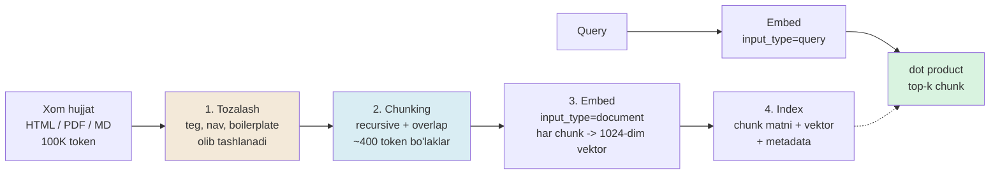

# 04. Matn tayyorlash va chunking

Production'da eng ko'p uchraydigan haqiqat shu: **chunking strategiyasi retrieval sifatini embedding model tanlashdan ko'proq belgilaydi.** Hujjatingiz 100K token, embedding model context'i 32K, foydalanuvchiga kerak javob esa ikki paragrafda yashiringan — matnni bo'lishdan boshqa yo'l yo'q, va uni qanday bo'lganingiz natijaning yarmini hal qiladi. Ish suhbatida "retrieval sifati past, birinchi nimani tekshirasiz?" degan savolga eng kuchli javob — "model almashtiraman" emas, balki **"chunking va input_type'ni ko'rib chiqaman"**: yomon bo'lingan matnda hatto MTEB reytingidagi birinchi model ham to'g'ri chunk'ni topa olmaydi.

---

## Nazariya (~30%)

### 1. Nega umuman chunking kerak — uchta bosim

Chunking bir hafsala emas, uchta qattiq cheklovning kesishmasidir:

| Bosim | Nima cheklaydi | Chunking'siz nima bo'ladi |
|---|---|---|
| **Model context limiti** | voyage-4 bir chaqiruvda 32K token qabul qiladi | 100K token hujjat sig'maydi: HTTP 400 yoki jimgina kesib tashlanadi (truncation) |
| **Retrieval granularity** | Bitta vektor = bitta "ma'no nuqtasi" | Butun hujjatning bitta vektori = ma'noning o'rtachasi, signal suyuladi |
| **Generative budget** | LLM prompt'iga faqat top-k chunk sig'adi | Kerakmas matn budjet, latency va "lost in the middle"ni yeydi |

Ikkinchi bosim eng nozigi. Butun hujjatni bitta 1024-o'lchamli vektorga siqish — bu backend tilida `SELECT AVG(meaning) FROM document` bajarish bilan bir xil: siz `WHERE` shartini yo'qotasiz. Kerak javob 500-so'zlik hujjatning bir jumlasida bo'lsa, o'sha jumla signal boshqa 499 so'zning "o'rtachasi" ichida ko'milib qoladi. Chunking — bu **granularity tanlashdir**: hujjatni indexlanadigan "yozuv"larga bo'lib, so'rov aynan kerakli yozuvga tegishini ta'minlash.

> **Oltin qoida:** chunk — bu sizning retrieval "yozuv"ingiz (record). U bitta g'oyani to'liq va faqat o'sha g'oyani o'z ichiga olsin — na ko'p, na kam.

Butun pipeline quyidagicha:



### 2. Strategiyalar shkalasi — soddadan aqllisiga

To'rtta bosqich bor, har biri oldingisining kamchiligini yopadi:

| Strategiya | Qanday ishlaydi | Plyus | Minus |
|---|---|---|---|
| **Fixed-size** (char/word/token) | Har N birlikdan qirqadi | Sodda, deterministik, tez | Gap o'rtasidan uzadi, strukturani inkor etadi |
| **Recursive** | Avval katta tabiiy chegara (section -> paragraf -> gap), sig'masagina maydaga tushadi | Bog'liq matn sun'iy uzilmaydi; **2026 default** | Biroz ko'proq kod |
| **Format-aware** | Hujjat strukturasidan foydalanadi (Markdown sarlavha, kod AST, Q&A pair) | Format bo'yicha eng izchil chunk | Har format uchun alohida parser kerak |
| **Semantic** | Gaplarni embed qilib, o'xshashlik keskin tushgan joyda kesadi | Eng izchil chegara | Qimmat: avval hamma narsani embed qilish kerak |

Recursive strategiya g'oyasi Huyen Ch6'da aniq: matnni **eng katta ma'noli chegaradan** bo'lishga urin, va faqat bo'lak model limitiga sig'masa keyingi mayda chegaraga tush. Shunda "bir mavzuga oid ikki gap" tasodifan ikki chunkka bo'linib ketmaydi.

### 3. 2026 baseline — nimadan boshlanadi

Search natijalari va Chroma tadqiqoti bir joyga keladi:

- **400-512 token, recursive splitting, 10-20% overlap** — sanoat konsensusi.
- Chroma raqamlari: recursive 400 token'da recall **~85-90%**; semantic chunking **~91-92%** (+2-3 punkt, lekin hisoblash sezilarli qimmat).
- Use-case bo'yicha: **faktik** savollar (aniq javob) -> kichikroq chunk (128-256); **analitik** savollar (kontekst kerak) -> kattaroq (512-1024).

> **Amaliy start:** recursive, ~400 token, 15% overlap. Semantic chunking'ni faqat o'z eval'ingizda recall yetishmaganda sinang — u pulini oqlamasligi mumkin.

### 4. Overlap — nega kerak

Recursive chunker ham chegarada bitta gapni ikkiga bo'lib yuborishi mumkin. Huyen'ning klassik misoli: "I left my wife | a note" — chegara aynan shu yerga tushsa, birinchi chunk "xotinimni tashlab ketdim", ikkinchisi "eslatma" bo'lib, ma'no butunlay buziladi. **Overlap** — ikki qo'shni chunk chegaradagi matnni **umumiy** ushlab turishi: 500 token chunk -> 50-100 token overlap.

Backend analogiyasi: bu stream processing'dagi **sliding window with stride < window** — chegarada turgan yozuv kamida bitta oynada to'liq ko'rinadi. Overlap'siz siz chegaralarda ma'lumot yo'qotasiz.

### 5. Chunk size — trade-off

| | Kichik chunk (128-256) | Katta chunk (512-1024) |
|---|---|---|
| Aniqlik | Yuqori: bitta g'oya, aniq moslik | Past: bir necha g'oya aralashadi |
| Kontekst | Yo'qoladi: "buni" nima anglatishi ko'rinmaydi | Saqlanadi |
| Storage / search | ~2x ko'p chunk = 2x vektor va 2x qidiruv | Kamroq |
| Signal | Toza | Suyuladi ("o'rtacha ma'no") |

Universal to'g'ri javob yo'q (Huyen: "eksperiment"). Lekin yo'nalish aniq: chunk kichraysa aniqlik oshadi, kontekst kamayadi va infratuzilma yuki ortadi.

### 6. Matn tozalash — embed'dan oldin

Xom hujjatlar HTML teg, navigatsiya menyusi, footer va boilerplate bilan to'la. Bularni embed qilsangiz — vektor **buziladi**: index kalitingizga shovqin quyasiz. Backend tilida bu — trailing whitespace yoki HTML qoldig'i bor ustunni indexlash: kalit endi toza mos kelmaydi.

```python
import re

def strip_html(text):
    text = re.sub(r"<script.*?</script>", " ", text, flags=re.S)   # skript butunlay
    text = re.sub(r"<[^>]+>", " ", text)                            # qolgan teglar
    return re.sub(r"\s+", " ", text).strip()                        # ortiqcha bo'shliq

print(strip_html('<div class="nav">Home | Docs</div><p>Rate limit: 100 so\'rov/s</p>'))

# Output:
# Home | Docs Rate limit: 100 so'rov/s
```

Teglar ketdi. E'tibor bering: "Home | Docs" navigatsiya matni hali qoldi — teg tozalash bu birinchi qadam; nav/boilerplate'ni domenga xos heuristika bilan ayrim olib tashlaysiz. Qoida sodda: **embed nima ko'rsa, o'shani "ma'no" deb qabul qiladi** — unga axlat ko'rsatmang.

### 7. Kelajak yo'nalishi — contextual retrieval

Chunk'ni butun hujjatdan uzib olsangiz, u kontekstini yo'qotadi: "429 qaytganda 5 soniya kut" chunk'i qaysi servis haqida ekanini bilmaydi. Ikki yechim bor:

- **Contextual retrieval** (Anthropic, 2024): har chunk'ga hujjat kontekstini tushuntiruvchi 50-100 token AI-generated prefiks qo'shiladi, keyin index qilinadi. Retrieval sezilarli yaxshilanadi.
- **voyage-context-4**: bu g'oyani model darajasida hal qiladi — `contextualized_embed()` bilan har chunk vektori butun hujjat kontekstini o'z ichiga oladi.

Bu darsda biz **arzon va kuchli variantni** ishlatamiz: Markdown sarlavha yo'lini har chunkka prefiks qilish (`[API Gateway > Rate limiting > Retry]`). Bu — hech qanday LLM chaqirmaydigan mini contextual-retrieval. To'liq contextual retrieval va `voyage-context-4` 4-bo'limda chuqur ko'riladi.

---

## Amaliyot (~70%)

Har blok oldidan **avval natijani bashorat qiling** (Predict), keyin ishga tushiring (Run). Kod bloklari `voyageai`, `numpy`, `python-dotenv` talab qiladi; `.env` da `VOYAGE_API_KEY` bo'lsin.

### 1-tajriba: naive fixed-size chunker

**Predict:** matnni har 8 so'zdan qirqsak, uchta gapdan iborat parcha nechta chunkka bo'linadi va chegaralar qayerga tushadi?

```python
# 01_fixed_chunker.py
# Fixed-size chunker: matnni har N so'zdan qirqadi. Eng sodda, eng qo'pol strategiya.

TEXT = (
    "Rate limiting API'ni haddan tashqari yukdan himoya qiladi. "
    "Token bucket algoritmi har mijozga sekundiga N token beradi. "
    "Token tugasa, so'rov 429 Too Many Requests bilan rad etiladi. "
    "Retry-After header mijozga qachon qayta urinishni aytadi."
)

def fixed_chunks(text, size_words=8):
    words = text.split()
    # --- har size_words so'zdan bir bo'lak, tabiiy chegaraga qaramaymiz ---
    return [" ".join(words[i:i + size_words])
            for i in range(0, len(words), size_words)]

for i, c in enumerate(fixed_chunks(TEXT, size_words=8)):
    print(f"chunk {i}: {c}")

# Output:
# chunk 0: Rate limiting API'ni haddan tashqari yukdan himoya qiladi.
# chunk 1: Token bucket algoritmi har mijozga sekundiga N token
# chunk 2: beradi. Token tugasa, so'rov 429 Too Many Requests
# chunk 3: bilan rad etiladi. Retry-After header mijozga qachon qayta
# chunk 4: urinishni aytadi.
```

Muammo ko'rinib turibdi: **"...sekundiga N token"** (chunk 1) va **"beradi..."** (chunk 2) — bitta gap ikkiga bo'lingan. "Token bucket ... N token" degan chunk "beradi"siz ma'nosini yo'qotadi; "beradi. Token tugasa..." esa subyektsiz osilib qoldi. Bu ikki chunkning vektori ham kerakli ma'noni to'liq ushlab tura olmaydi — retrieval "token bucket qancha token beradi?" query'siga ikkalasidan birini ham ishonch bilan qaytara olmaydi.

### 2-tajriba: recursive chunker + overlap

**Predict:** avval paragraf (`\n\n`), sig'masa gap (`. `) bo'yicha bo'lsak — chegaralar endi gap o'rtasiga tushadimi? Overlap qo'shsak chunk boshida nima paydo bo'ladi?

```python
# 02_recursive_chunker.py
# Recursive: avval katta chegara (paragraf), sig'masa gap, oxirida so'z.
# Token o'rniga ~4 belgi = 1 token taxmini (tiktoken YO'Q, tokenizer'ga bog'lanmaymiz).

DOC = (
    "Circuit breaker uzoq servis ishlamay qolganda so'rovlarni to'xtatadi. "
    "Closed holatda so'rovlar o'tadi va xatolar sanaladi. "
    "Xato chegaradan oshsa breaker Open holatga o'tadi va darhol xato qaytaradi.\n\n"
    "Half-open holatda breaker bitta sinov so'rovini o'tkazadi. "
    "Sinov muvaffaqiyatli bo'lsa breaker Closed holatga qaytadi."
)

def est_tokens(t):
    return max(1, len(t) // 4)                      # qo'pol, lekin reindexsiz taxmin

SEPS = ["\n\n", ". ", " ", ""]

def recursive_split(text, max_tokens, seps=SEPS):
    if est_tokens(text) <= max_tokens:
        return [text]
    sep, rest = seps[0], seps[1:]
    pieces = text.split(sep) if sep else list(text)
    out, buf = [], ""
    for piece in pieces:
        cand = f"{buf}{sep}{piece}" if buf else piece
        if est_tokens(cand) <= max_tokens:
            buf = cand                              # hali sig'yapti, yig'averamiz
        elif est_tokens(piece) > max_tokens and rest:
            if buf:
                out.append(buf); buf = ""
            out.extend(recursive_split(piece, max_tokens, rest))   # maydaroq chegara
        else:
            if buf:
                out.append(buf)
            buf = piece
    if buf:
        out.append(buf)
    return out

def add_overlap(chunks, overlap_words):
    if overlap_words <= 0 or len(chunks) < 2:
        return chunks
    out = [chunks[0]]
    for i in range(1, len(chunks)):
        # oldingi chunk oxiridan ~overlap_words so'z (1 so'z ~ 1 token taxmini)
        tail = " ".join(chunks[i - 1].split()[-overlap_words:])
        out.append(f"{tail} {chunks[i]}")
    return out

chunks = add_overlap(recursive_split(DOC, max_tokens=30), overlap_words=5)
for i, c in enumerate(chunks):
    print(f"[{i}] ({est_tokens(c)} tok) {c}")

# Output:
# [0] (30 tok) Circuit breaker uzoq servis ishlamay qolganda so'rovlarni to'xtatadi. Closed holatda so'rovlar o'tadi va xatolar sanaladi
# [1] (26 tok) so'rovlar o'tadi va xatolar sanaladi Xato chegaradan oshsa breaker Open holatga o'tadi va darhol xato qaytaradi.
# [2] (25 tok) o'tadi va darhol xato qaytaradi. Half-open holatda breaker bitta sinov so'rovini o'tkazadi. Sinov muvaffaqiyatli bo'lsa breaker Closed holatga qaytadi.
```

Ikki narsa o'zgardi. Birinchidan, chegaralar endi **gap oxiriga** tushadi, gap o'rtasiga emas — 1-tajribadagi "sekundiga N token | beradi" muammosi yo'qoldi. Ikkinchidan, har chunk boshida oldingi chunkning oxirgi so'zlari takrorlanmoqda (`so'rovlar o'tadi va xatolar sanaladi`) — bu overlap. Endi chegarada turgan g'oya kamida bitta chunkda **to'liq** mavjud.

### 3-tajriba: markdown-aware chunker (sarlavha yo'li prefiksi)

**Predict:** hujjatni sarlavhalar bo'yicha section'larga bo'lib, har chunkka `[Sarlavha > Ostki sarlavha]` prefiksini qo'ysak — "Retry" haqidagi chunk endi qaysi kontekstga tegishli ekanini o'zi aytadimi?

```python
# 03_markdown_chunker.py
import re

DOC = """# API Gateway

Gateway barcha tashqi so'rovlarni qabul qiladi.

## Rate limiting

Har mijozga sekundiga 100 so'rov ruxsat etiladi.

### Retry

429 qaytganda mijoz Retry-After header'iga qarab kutadi.
Eksponensial backoff qo'llanadi.

## Auth

Har so'rov Bearer token bilan kelishi shart.
"""

def markdown_sections(md):
    path, buf, sections = {}, [], []
    def flush():
        body = "\n".join(buf).strip()
        if body:
            prefix = " > ".join(path[k] for k in sorted(path))    # to'liq sarlavha yo'li
            sections.append((prefix, body))
    for line in md.splitlines():
        m = re.match(r"^(#{1,6})\s+(.*)", line)
        if m:
            flush(); buf.clear()
            level = len(m.group(1))
            for k in [k for k in path if k >= level]:             # chuqurroq darajalarni tashla
                del path[k]
            path[level] = m.group(2).strip()
        else:
            buf.append(line)
    flush()
    return sections

for prefix, body in markdown_sections(DOC):
    print(f"[{prefix}]\n{body}\n{'-' * 40}")

# Output:
# [API Gateway]
# Gateway barcha tashqi so'rovlarni qabul qiladi.
# ----------------------------------------
# [API Gateway > Rate limiting]
# Har mijozga sekundiga 100 so'rov ruxsat etiladi.
# ----------------------------------------
# [API Gateway > Rate limiting > Retry]
# 429 qaytganda mijoz Retry-After header'iga qarab kutadi.
# Eksponensial backoff qo'llanadi.
# ----------------------------------------
# [API Gateway > Auth]
# Har so'rov Bearer token bilan kelishi shart.
# ----------------------------------------
```

"429 qaytganda..." chunk'i endi `[API Gateway > Rate limiting > Retry]` prefiksini olib yuradi. "Gateway rate limit retry'ni qanday boshqaradi?" query'si bu prefiks tufayli chunk'ga ancha yaqinlashadi — chunki query so'zlari (`gateway`, `rate limit`, `retry`) endi chunk matnida bor. Bu — LLM chaqirmaydigan, deyarli tekin **contextual retrieval**.

### 4-tajriba: chunk size eksperimenti (embeddings bilan)

**Predict:** bitta postmortem matnini 12, 40 va 120 so'zli chunklarga bo'lib, "nega to'lov ikki marta yechildi?" query'siga eng yaqin chunkni topsak — qaysi o'lchamda similarity eng yuqori bo'ladi? Juda kichik va juda katta o'lchamda nega tushadi?

```python
# 04_size_experiment.py
import numpy as np
import voyageai
from dotenv import load_dotenv

load_dotenv()
vo = voyageai.Client()          # VOYAGE_API_KEY env'dan o'qiladi

DOC = (
    "2026-03-11 kuni to'lov servisida incident bo'ldi. "
    "Soat 02:14 da deploy chiqarildi va yangi retry logikasi qo'shildi. "
    "Payment gateway vaqtincha sekinlashdi va so'rovlar timeout bo'ldi. "
    "Retry mexanizmi har urinishda yangi idempotency key generatsiya qildi. "
    "Shuning uchun bitta to'lov gateway tomonidan ikki marta qabul qilindi. "
    "Mijozlardan ikki marta pul yechildi va 43 ta shikoyat keldi. "
    "Tuzatish: idempotency key endi so'rov boshida bir marta yaratiladi. "
    "Reconciliation job qo'shildi va ortiqcha to'lovlar avtomatik qaytariladi. "
    "SLO monitoringi timeout darajasini kuzatadi va deploy paytida alert yuboradi."
)
QUERY = "Nega bitta to'lov ikki marta yechildi?"

def fixed_chunks(text, size_words):
    w = text.split()
    return [" ".join(w[i:i + size_words]) for i in range(0, len(w), size_words)]

def best_chunk(chunks, query):
    # Voyage vektorlari L2-normalizatsiyalangan (uzunlik 1) -> dot == cosine
    doc_vecs = vo.embed(chunks, model="voyage-4", input_type="document").embeddings
    q_vec = vo.embed([query], model="voyage-4", input_type="query").embeddings[0]
    sims = np.array(doc_vecs) @ np.array(q_vec)
    i = int(sims.argmax())
    return float(sims[i]), chunks[i]

for size in (12, 40, 120):
    chunks = fixed_chunks(DOC, size)
    score, chunk = best_chunk(chunks, QUERY)
    print(f"size={size:3} so'z | chunks={len(chunks):2} | top sim={score:.3f}")
    print("   ", chunk[:88], "...")

# Output:
# size= 12 so'z | chunks= 9 | top sim=0.662
#     Shuning uchun bitta to'lov gateway tomonidan ikki marta qabul qilindi. Mijozlar ...
# size= 40 so'z | chunks= 3 | top sim=0.721
#     Retry mexanizmi har urinishda yangi idempotency key generatsiya qildi. Shuning uchun ...
# size=120 so'z | chunks= 1 | top sim=0.678
#     2026-03-11 kuni to'lov servisida incident bo'ldi. Soat 02:14 da deploy ...
```

Naqsh aynan nazariyadagidek. **size=12** — chunk aniq, lekin sabab ("retry yangi idempotency key generatsiya qildi") va oqibat ("ikki marta qabul qilindi") ikki chunkka bo'linib, top chunk faqat yarmini ushlaydi -> sim past. **size=120** — butun hujjat bitta chunk, javob deploy/SLO/reconciliation gaplari orasida suyuladi -> sim past. **size=40** — sabab va oqibat bitta chunkda, shovqinsiz -> sim eng yuqori. Kichik loyihada bu solishtirish uchun numpy `dot` yetarli; FAISS kabi vector DB 3-bo'lim mavzusi.

> **API'siz mashq:** `voyageai` o'rniga `sentence-transformers` + `BAAI/bge-m3` (`encode(..., normalize_embeddings=True)`) ishlatsangiz, qolgan kod o'zgarmaydi — `embed()` funksiyasini almashtirasiz, xolos.

### Investigate / Modify

Har mashqda **avval natijani bashorat qiling**, keyin o'zgartirib ishga tushiring.

1. **Overlap'ni 0 ga tushiring.** `02_recursive_chunker.py` da `overlap_words=0` qiling. Endi hosil bo'lgan chunklarni embed qilib, chegaradan o'tuvchi query bering: "Circuit breaker qachon Open bo'ladi va keyin nima qiladi?" (sabab bitta chunkda, oqibat qo'shnisida). Overlap borida va yo'qida top similarity'ni solishtiring — chegara-savolda natija qanchaga tushadi va nega?

2. **Tozalamasdan embed qiling.** Bitta toza chunkni oling, uni `<nav>...</nav><p>` va HTML teglar bilan "ifloslantiring", ikkalasini embed qiling va bir query bilan cosine'ni solishtiring (theory'dagi `strip_html` bor/yo'q variantda). Similarity qancha tushadi? Nega HTML teglar vektorni "shovqin" tomon suradi?

3. **Sarlavha prefiksini olib tashlang.** `03_markdown_chunker.py` da `[{prefix}]` qatorini olib tashlang. "Retry" chunk'ini prefiks bilan va prefikssiz embed qilib, "gateway rate limit retry qanday ishlaydi?" query'siga sim'ni o'lchang. Prefiks recall'ga qanday ta'sir qildi va nega bu mini contextual-retrieval deyiladi?

### Make

**Challenge: `chunk_file(path, max_tokens, overlap)`**

`.md` faylni o'qib, **markdown-aware + recursive fallback** bilan chunklar ro'yxatini qaytaruvchi funksiya yozing. Har chunk sarlavha yo'li prefiksini olib yursin, katta section'lar recursive tarzda bo'linsin, va section ichida overlap qo'shilsin. Bu funksiya keyingi darsdagi semantic search CLI loyihasida to'g'ridan-to'g'ri ishlatiladi.

Talab:
1. Signatura: `chunk_file(path, max_tokens=400, overlap=50)` -> `list[str]`.
2. Avval Markdown sarlavhalari bo'yicha section'larga bo'l (2-tajribadagi `markdown_sections`).
3. Har section body'si `max_tokens`dan katta bo'lsa — `recursive_split` bilan maydala.
4. Section ichidagi sub-chunklarga overlap qo'sh.
5. Har natijaviy chunk boshida `[sarlavha > yo'li]` prefiks bo'lsin (prefiks bo'sh bo'lsa qo'shilmasin).

<details>
<summary>Yechim</summary>

```python
# chunker.py — keyingi darsdagi semantic search CLI shu funksiyani import qiladi
import re

def est_tokens(t):
    return max(1, len(t) // 4)                 # ~4 belgi = 1 token (tiktoken YO'Q)

def _markdown_sections(md):
    path, buf, out = {}, [], []
    def flush():
        body = "\n".join(buf).strip()
        if body:
            prefix = " > ".join(path[k] for k in sorted(path))
            out.append((prefix, body))
    for line in md.splitlines():
        m = re.match(r"^(#{1,6})\s+(.*)", line)
        if m:
            flush(); buf.clear()
            level = len(m.group(1))
            for k in [k for k in path if k >= level]:
                del path[k]
            path[level] = m.group(2).strip()
        else:
            buf.append(line)
    flush()
    return out

_SEPS = ["\n\n", ". ", " ", ""]

def _recursive_split(text, max_tokens, seps=_SEPS):
    if est_tokens(text) <= max_tokens:
        return [text]
    sep, rest = seps[0], seps[1:]
    pieces = text.split(sep) if sep else list(text)
    out, buf = [], ""
    for piece in pieces:
        cand = f"{buf}{sep}{piece}" if buf else piece
        if est_tokens(cand) <= max_tokens:
            buf = cand
        elif est_tokens(piece) > max_tokens and rest:
            if buf:
                out.append(buf); buf = ""
            out.extend(_recursive_split(piece, max_tokens, rest))
        else:
            if buf:
                out.append(buf)
            buf = piece
    if buf:
        out.append(buf)
    return out

def _add_overlap(chunks, overlap):
    if overlap <= 0 or len(chunks) < 2:
        return chunks
    out = [chunks[0]]
    for i in range(1, len(chunks)):
        tail = " ".join(chunks[i - 1].split()[-overlap:])    # ~overlap token (1 so'z ~ 1 token)
        out.append(f"{tail} {chunks[i]}")
    return out

def chunk_file(path, max_tokens=400, overlap=50):
    with open(path, encoding="utf-8") as f:
        md = f.read()
    result = []
    for prefix, body in _markdown_sections(md):
        pieces = _add_overlap(_recursive_split(body, max_tokens), overlap)
        for p in pieces:
            result.append(f"[{prefix}]\n{p}" if prefix else p)
    return result

if __name__ == "__main__":
    chunks = chunk_file("api_docs.md", max_tokens=120, overlap=20)
    print(f"jami {len(chunks)} chunk")
    for i, c in enumerate(chunks[:3]):
        print(f"--- chunk {i} ({est_tokens(c)} token) ---")
        print(c[:120])

# Output:
# jami 7 chunk
# --- chunk 0 (18 token) ---
# [API Gateway]
# Gateway barcha tashqi so'rovlarni qabul qiladi.
# --- chunk 1 (14 token) ---
# [API Gateway > Rate limiting]
# Har mijozga sekundiga 100 so'rov ruxsat etiladi.
# --- chunk 2 (22 token) ---
# [API Gateway > Rate limiting > Retry]
# 429 qaytganda mijoz Retry-After header'iga qarab kutadi. Eksponensial backoff qo'llanadi.
```

**Nega bu shunday qurilgan:**

- **markdown-aware birinchi** -> har chunk tabiiy semantik chegarada (section) va sarlavha yo'li prefiksini oladi (mini contextual-retrieval).
- **recursive fallback** -> uzun section ham model limitiga sig'adi, lekin gap o'rtasidan uzilmaydi.
- **overlap section ichida** -> chegaradagi gap qo'shni chunkda ham to'liq bo'ladi.
- **est_tokens char-asosida** -> tokenizer'ga bog'lanmaymiz; model almashsa qayta indexlash shart emas (Voyage `total_tokens` aniq sonni beradi, lekin u faqat chaqiruvdan keyin ma'lum, chunking QARORI esa oldindan kerak).

</details>

---

## Retrieval practice

1. Butun hujjatni bitta vektorga embed qilsangiz, retrieval'da nima yo'qoladi? Nega buni `SELECT AVG(...)` ga o'xshatish mumkin?
2. Fixed-size va recursive chunker chegarani qayerga qo'yishda qanday farq qiladi? Recursive nima sababdan "sun'iy uzilish"ni kamaytiradi?
3. Overlap'ni 0 qilsangiz aynan qanday query turlarida natija yomonlashadi? "I left my wife | a note" misoli bu bilan qanday bog'liq?
4. Chunkni 128 tokendan 1024 tokenga oshirsangiz, aniqlik, kontekst va storage/search yukiga nima bo'ladi? Faktik va analitik savollar uchun qaysi tomonga siljiysiz?
5. Markdown sarlavha yo'lini chunkka prefiks qilish nega retrieval'ni yaxshilaydi va bu qanday qilib "arzon contextual retrieval" hisoblanadi?
6. Ish suhbatida "retrieval sifati past" desa, nega birinchi javob "kuchliroq embedding modelga o'tish" emas? Undan oldin qaysi uch narsani tekshirasiz?

---

## Manbalar

- **Chip Huyen, "AI Engineering" (O'Reilly, 2025)** — Ch6 (Retrieval Optimization: chunking, recursive splitting, overlap "I left my wife a note" misoli, chunk size trade-off, contextual retrieval kirishi)
- **Berryman & Ziegler, "Prompt Engineering for LLMs" (O'Reilly, 2024)** — Ch5 (snippetizing mezonlari: bitta g'oya bitta chunkda, sliding window va tabiiy chegaralar, kod uchun class kontekstini qo'shish)
- Firecrawl, "Best chunking strategies for RAG" (2026): [firecrawl.dev/blog/best-chunking-strategies-rag](https://www.firecrawl.dev/blog/best-chunking-strategies-rag)
- Qdrant, "Chunking strategies" darsi: [qdrant.tech/course/essentials/day-1/chunking-strategies](https://qdrant.tech/course/essentials/day-1/chunking-strategies/)
- Anthropic, "Contextual Retrieval": [anthropic.com/news/contextual-retrieval](https://www.anthropic.com/news/contextual-retrieval)
- Voyage AI embeddings docs: [docs.voyageai.com/docs/embeddings](https://docs.voyageai.com/docs/embeddings)

Keyingi dars — **bo'lim loyihasi: semantic search CLI**, unda shu darsdagi `chunk_file` funksiyasi to'g'ridan-to'g'ri ishlatiladi: `.md` fayllarni chunklab, embed qilib, brute-force kNN bilan qidiradigan to'liq quvvurni yig'amiz.
