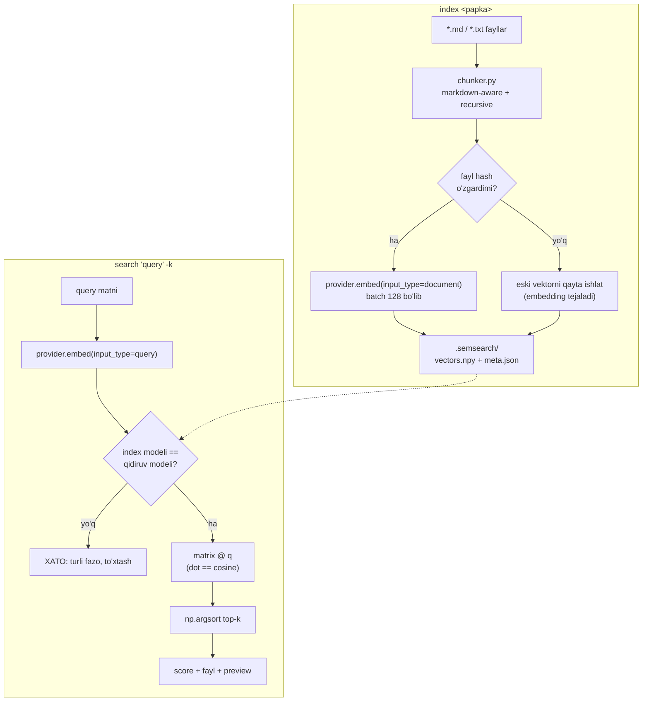
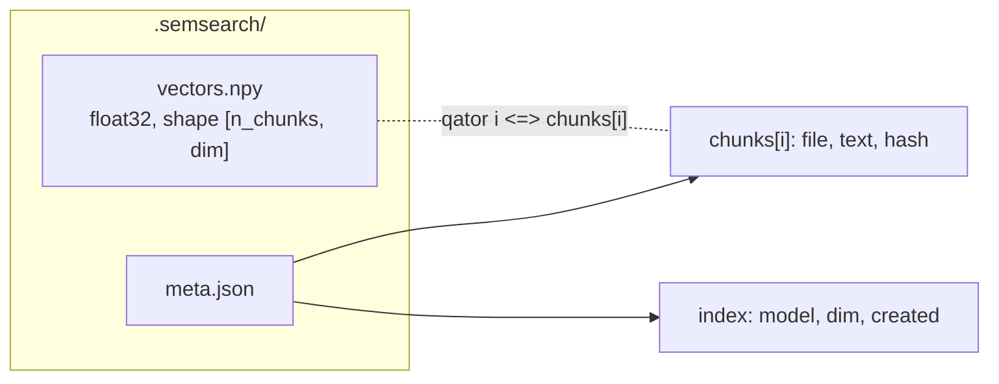

# 05. Bo'lim loyihasi — semantic search CLI

Sen `learning/` papkasida yuzlab markdown dars yozgansan. `grep "connection reset"` aniq stringni topadi, lekin qidiruvchi "ulanish uzilib qoladi" deb yozsa — `grep` hech narsa qaytarmaydi, chunki bu boshqa harflar. Ish suhbatida "RAG qildim" deyish emas, GitHub'dagi ishlaydigan repo gapiradi: bu bo'limda **`semsearch`** — lokal fayllar ustida ma'no bo'yicha qidiradigan CLI quramiz. Bu portfolio zanjirining ikkinchi bo'g'ini: 1-bo'limda `askops` agent qurgansan, 3-bo'limda `semsearch` indexini pgvector'ga ko'chiramiz, 4-bo'limda uni RAG'ga aylantiramiz. Ya'ni bugun yozgan kod tashlab yuboriladigan demo emas — keyingi ikki bo'limning poydevori.

> Bu nazariya darsi emas. Bu yerda **qurasan**. Kod bosqichma-bosqich o'sadi: har qadam oldingisining ustiga qo'shiladi va har qadamda ishlaydigan holatda qoladi. 01-04 darslarda ko'rgan `vo.embed()` + `input_type`, provider-agnostik pattern, `dot == cosine`, va `chunk_file()` — hammasi shu yerda bitta tizimga birlashadi.

---

## Nima quramiz — talablar

`semsearch` uchta buyruqli CLI (argparse subcommand pattern, `git`/`kubectl` kabi):

| Buyruq | Vazifa |
|---|---|
| `python semsearch.py index <papka>` | Papkadagi `.md`/`.txt` fayllarni topadi, chunklaydi, embed qiladi, indexni diskka yozadi |
| `python semsearch.py search "query" -k 5` | Query'ni embed qilib top-k chunkni chiqaradi (fayl + score + preview) |
| `python semsearch.py stats` | Index haqida: fayl/chunk soni, model, o'lcham, taxminiy narx |

Talablar ro'yxati — har biri production'da nega kerakligi bilan:

- **Index formati:** `.semsearch/` papkada ikki fayl — `vectors.npy` (numpy `float32` matritsa) va `meta.json` (har chunk uchun: fayl yo'li, chunk matni, content hash; index darajasida: model nomi, o'lcham, sana). Bu — columnar store mantiqi: vektor `i`-qatori metadata `i`-yozuviga to'g'ri keladi.
- **Model nomi metadata'da majburiy.** Boshqa model bilan qidirishga urinishda aniq xato beriladi. Turli model embeddinglarini bitta indexda solishtirish — **production xato #1**: jimgina noto'g'ri natija, hech qanday exception yo'q.
- **Incremental reindex:** har faylning `sha256` content hash'i saqlanadi; qayta `index`da o'zgarmagan fayllar skip qilinadi — embedding xarajati tejaladi. Data tez o'zgarganda embedding narxi asosiy bandga aylanadi.
- **Provider-agnostik:** `EmbeddingProvider` interfeysi, `VoyageProvider` (default, `voyage-4`, to'g'ri `input_type`) va `LocalProvider` (sentence-transformers, `BAAI/bge-m3`) — `--local` flag bilan almashtiriladi.
- **Search:** numpy dot product (vektorlar normalizatsiyalangan → `dot == cosine`), `np.argsort` bilan top-k. FAISS yo'q — kichik korpusda brute-force kNN to'g'ri va shaffof tanlov (vector DB 3-bo'limda).

---

## Arxitektura

Ikki oqim bor: **index** (offline, bir marta) va **search** (online, har query'da). Diagrammadagi ikki romb — `hash o'zgardimi?` va `model mos keldimi?` — loyiha "demo" bilan "production'ga yaqin"ni ajratadigan ikki qaror.



On-disk format — nega ikki fayl, bitta emas: vektorlar zich sonli matritsa (numpy `.npy` — mmap-friendly, tez), metadata esa matn (JSON — o'qiladigan, diff qilinadigan). Ularni aralashtirsang ikkalasini ham yo'qotasan.



Fayl strukturasi — provider almashtirish, chunker o'zgartirish va CLI bir-biriga tegmasin:

```text
semsearch/
├── .env.example
├── requirements.txt
├── chunker.py       # markdown-aware + recursive chunking (04-darsdan)
├── providers.py     # EmbeddingProvider + VoyageProvider + LocalProvider
├── index.py         # qurish / saqlash / yuklash / qidirish / stats
└── semsearch.py     # argparse CLI: index / search / stats
```

```text
# .env.example — haqiqiy kalitni .env ga yoz, .env ni .gitignore ga qo'sh
VOYAGE_API_KEY=your-voyage-api-key-here
```

```text
# requirements.txt
voyageai>=0.3
python-dotenv>=1.0
numpy>=1.26
sentence-transformers>=3.0   # faqat --local uchun kerak
```

---

## 1-qadam: CLI skeleti + argparse subcommand'lar

Avval eng oddiy ishlaydigan holat: buyruqlar parse bo'ladi, lekin hali hech narsa qilmaydi. `git commit`/`git log` kabi subcommand pattern'da har buyruq alohida funksiyaga (`set_defaults(func=...)`) bog'lanadi. `--local` flag'i index va search'ga tegishli, shuning uchun uni `parents` orqali umumiy parser'dan olamiz (stats'ga kerak emas).

```python
# semsearch.py — 1-qadam: CLI skeleti
import argparse
import sys


def cmd_index(args):
    print(f"[index] papka={args.folder} local={args.local}")


def cmd_search(args):
    print(f"[search] query={args.query!r} k={args.k} local={args.local}")


def cmd_stats(args):
    print("[stats]")


def build_parser():
    parser = argparse.ArgumentParser(prog="semsearch",
                                     description="Lokal fayllar ustida semantic search")
    sub = parser.add_subparsers(dest="command", required=True)

    common = argparse.ArgumentParser(add_help=False)          # --local: index va search uchun
    common.add_argument("--local", action="store_true",
                        help="Voyage o'rniga lokal model (BAAI/bge-m3)")

    pi = sub.add_parser("index", parents=[common], help="Papkani indexlash")
    pi.add_argument("folder", help=".md va .txt fayllar papkasi")
    pi.set_defaults(func=cmd_index)

    ps = sub.add_parser("search", parents=[common], help="Semantic qidiruv")
    ps.add_argument("query", help="Qidiruv matni")
    ps.add_argument("-k", type=int, default=5, help="Nechta natija (default 5)")
    ps.set_defaults(func=cmd_search)

    pt = sub.add_parser("stats", help="Index statistikasi")
    pt.set_defaults(func=cmd_stats)
    return parser


def main(argv):
    args = build_parser().parse_args(argv)
    args.func(args)


if __name__ == "__main__":
    main(sys.argv[1:])
```

```text
# Output:
# $ python semsearch.py index ./docs --local
# [index] papka=./docs local=True
#
# $ python semsearch.py search "connection pool tugadi" -k 3
# [search] query='connection pool tugadi' k=3 local=False
#
# $ python semsearch.py
# usage: semsearch [-h] {index,search,stats} ...
# semsearch: error: the following arguments are required: command
```

`required=True` tufayli buyruqsiz chaqirilsa aniq xato beradi — bu CLI'ning yaxshi xulqi. Endi har `cmd_*` funksiyasini haqiqiy mantiq bilan to'ldiramiz.

---

## 2-qadam: fayl yig'ish + chunking moduli

Embedding modellari uzun matnni yaxshi kodlamaydi: butun faylni bitta vektorga siqib bo'lmaydi, aks holda qidiruv "fayl bormi" darajasida bo'ladi, "qaysi paragraf" emas. 04-darsda ko'rgan yondashuv: **markdown-aware** (avval `#` sarlavhalari bo'yicha bo'lish, chunki mavzu chegarasi tabiiy chegara) + **recursive fallback** (bir bo'lim juda katta bo'lsa, so'zlar bo'yicha overlap bilan oynaga bo'lish). Maqsad ~400 token, ~15% overlap — chegarada bo'lingan gap ikkala chunk'da to'liq qolsin.

```python
# chunker.py — 2-qadam: markdown-aware + recursive chunking
from __future__ import annotations

import re
from pathlib import Path

TARGET_WORDS = 300      # ~400 token (Voyage tokenizeri lokal yo'q; 1 so'z ~ 1.3 token taxmini)
OVERLAP_WORDS = 45      # ~15% overlap


def approx_tokens(text: str) -> int:
    return round(len(text.split()) * 1.3)


def _sections(text: str) -> list[str]:
    """Matnni markdown sarlavhalari ('# ...') bo'yicha bloklarga ajratadi."""
    out, buf = [], []
    for line in text.splitlines(keepends=True):
        if re.match(r"^#{1,6}\s", line) and buf:
            out.append("".join(buf))
            buf = [line]
        else:
            buf.append(line)
    if buf:
        out.append("".join(buf))
    return out


def _window(words: list[str], size: int, overlap: int) -> list[str]:
    """Katta blokni overlap bilan oynalarga bo'ladi (recursive fallback)."""
    if len(words) <= size:
        return [" ".join(words)]
    step = size - overlap
    chunks = []
    for start in range(0, len(words), step):
        chunks.append(" ".join(words[start:start + size]))
        if start + size >= len(words):
            break
    return chunks


def chunk_text(text: str) -> list[str]:
    chunks, buf = [], []

    def flush():
        if buf:
            chunks.append(" ".join(buf))
            buf.clear()

    for section in _sections(text):
        words = section.split()
        if not words:
            continue
        if len(buf) + len(words) <= TARGET_WORDS:
            buf.extend(words)                            # kichik bo'limlarni birlashtiramiz
        elif len(words) <= TARGET_WORDS:
            flush()
            buf.extend(words)
        else:
            flush()
            chunks.extend(_window(words, TARGET_WORDS, OVERLAP_WORDS))
    flush()
    return [c.strip() for c in chunks if c.strip()]


def chunk_file(path: Path) -> list[str]:
    return chunk_text(path.read_text(encoding="utf-8", errors="replace"))
```

Sinov skripti — bir necha kichik bo'lim bitta chunk'ga birlashadi, katta fayl esa overlapli oynalarga bo'linadi:

```python
# demo_chunk.py — chunker sinovi
from chunker import approx_tokens, chunk_text

sample = """# Connection pool
Pool ochiq TCP ulanishlarni qayta ishlatadi: har so'rovda yangi handshake qilmaslik uchun.

## Sozlamalar
max_open va max_idle muhim. Juda kichik pool -> so'rovlar kutadi; juda katta -> DB yuki oshadi.
"""

chunks = chunk_text(sample)
print(f"jami {len(chunks)} chunk")
for i, c in enumerate(chunks):
    print(f"[{i}] ~{approx_tokens(c)} token | {c[:60]}...")

# Output:
# jami 1 chunk
# [0] ~44 token | # Connection pool Pool ochiq TCP ulanishlarni qayta ishla...
```

Kichik fayl bitta chunk berdi (to'g'ri — bo'lish faqat kerak bo'lganda). 900 so'zlik dars ~3 ta overlapli chunk beradi. Chunk hajmi trade-off: kichik chunk = aniqroq, lekin kontekst yo'qoladi va index 2x kattalashadi.

---

## 3-qadam: `EmbeddingProvider` interfeysi + ikki implementatsiya

01-darsning markaziy fakti: **Anthropic o'z embedding API'sini bermaydi** — Claude asosidagi kursda embeddings uchun Voyage AI ishlatiladi (Anthropic tavsiyasi, har model uchun 200M token bepul). Lekin kodni bitta provider'ga bog'lab qo'yish xato: model narxlari o'zgaradi, ish joyida OpenAI yoki lokal model kerak bo'lishi mumkin. Yechim — 01-04 darslarda ishlatgan **provider-agnostik pattern**: kod `embed(texts, input_type) -> list[list[float]]` interfeysini biladi, provider'ni bilmaydi. Provider almashtirish = bitta klass almashtirish.

```python
# providers.py — 3-qadam: provider-agnostik embedding
from __future__ import annotations

from typing import Protocol


class EmbeddingProvider(Protocol):
    """Har provider shu interfeysni beradi — index/search kodi provider'ni bilmaydi."""
    name: str            # metadata'da saqlanadi -> model fazolarini aralashtirmaslik uchun
    dim: int
    last_tokens: int

    def embed(self, texts: list[str], input_type: str) -> list[list[float]]:
        ...


class VoyageProvider:
    """Voyage AI — default. Vektorlar L2-normalizatsiyalangan (uzunlik 1) -> dot == cosine."""

    def __init__(self, model: str = "voyage-4") -> None:
        import voyageai
        self.client = voyageai.Client()      # VOYAGE_API_KEY env'dan o'qiladi
        self.name = model
        self.dim = 1024                      # voyage-4 default o'lchami
        self.last_tokens = 0

    def embed(self, texts: list[str], input_type: str) -> list[list[float]]:
        # input_type: document va query ASSIMETRIK -> retrieval'da hech qachon tashlanmaydi
        result = self.client.embed(texts, model=self.name, input_type=input_type)
        self.last_tokens = result.total_tokens
        return result.embeddings


class LocalProvider:
    """sentence-transformers + BAAI/bge-m3 — API'siz, 100+ til (o'zbek ham)."""

    def __init__(self, model: str = "BAAI/bge-m3") -> None:
        from sentence_transformers import SentenceTransformer
        self.model = SentenceTransformer(model)
        self.name = f"local:{model}"
        self.dim = self.model.get_sentence_embedding_dimension()
        self.last_tokens = 0                 # lokal model -> token hisobi yo'q (narx 0)

    def embed(self, texts: list[str], input_type: str) -> list[list[float]]:
        # normalize_embeddings=True -> vektor uzunligi 1 -> dot == cosine (Voyage bilan bir qoida)
        # bge-m3 query/document prefiksini talab qilmaydi, shuning uchun input_type e'tiborga olinmaydi
        return self.model.encode(texts, normalize_embeddings=True).tolist()


def get_provider(local: bool) -> EmbeddingProvider:
    return LocalProvider() if local else VoyageProvider()
```

Ikki nozik joy bir faylda: (1) `input_type` — `"document"` (index'da) va `"query"` (qidiruvda) uchun Voyage modelga turli prefiks qo'shadi; query'ni `document` sifatida embed qilish sifatni jimgina buzadi — bu **production xato #2**. (2) `name` — provider identifikatori metadata'ga yoziladi va `VoyageProvider` bilan qurilgan indexni `LocalProvider` bilan qidirishga urinsang aniq xato beradi.

```python
# demo_provider.py — provider sinovi
from dotenv import load_dotenv
from providers import get_provider

load_dotenv()
p = get_provider(local=False)
vecs = p.embed(["connection pool tugadi", "ulanishlar hovuzi to'ldi"], input_type="document")
print(f"model={p.name} dim={p.dim} tokens={p.last_tokens}")
print(f"vektor[0] ilk 3 komponent: {[round(x, 3) for x in vecs[0][:3]]}")

# Output:
# model=voyage-4 dim=1024 tokens=11
# vektor[0] ilk 3 komponent: [0.021, -0.045, 0.013]
```

---

## 4-qadam: index qurish + saqlash + partiyalab embed

Endi asosiy modul. Ikki ishni ajratamiz: `index.py` embed qiladi va diskka yozadi. Bu qadamda **oddiy** versiya — har faylni to'liq embed qiladi (incremental keyingi qadamda). Ikki muhim nuqta: **batch** — bitta `embed()` chaqiruvida 128 tagacha matn (HTTP overhead tejaladi, katta korpusda tsikl bilan bo'lib yuboriladi); va **saqlash formati** — `np.save` bilan `vectors.npy`, `json.dump` bilan `meta.json`, ular parallel massiv (qator `i` <-> chunk `i`).

```python
# index.py — 4-qadam: qurish + saqlash (oddiy, to'liq embed)
from __future__ import annotations

import hashlib
import json
from datetime import datetime, timezone
from pathlib import Path

import numpy as np

from chunker import approx_tokens, chunk_file
from providers import EmbeddingProvider

INDEX_DIR = Path(".semsearch")
VECTORS = "vectors.npy"
META = "meta.json"
BATCH = 128
SUFFIXES = {".md", ".txt"}
PRICE_PER_1M = {"voyage-4": 0.06, "voyage-4-lite": 0.02, "voyage-4-large": 0.12}


def file_hash(path: Path) -> str:
    return hashlib.sha256(path.read_bytes()).hexdigest()


def iter_files(folder: Path) -> list[Path]:
    return sorted(p for p in folder.rglob("*")
                  if p.is_file() and p.suffix.lower() in SUFFIXES)


def _batched_embed(provider, texts, input_type):
    if not texts:
        return np.zeros((0, provider.dim), dtype=np.float32), 0
    out, tokens = [], 0
    for i in range(0, len(texts), BATCH):                # partiyalab: HTTP overhead tejaladi
        out.extend(provider.embed(texts[i:i + BATCH], input_type=input_type))
        tokens += provider.last_tokens
    return np.asarray(out, dtype=np.float32), tokens


def _save(provider, chunks, matrix):
    INDEX_DIR.mkdir(exist_ok=True)
    np.save(INDEX_DIR / VECTORS, matrix)                 # zich matritsa -> binar .npy
    meta = {
        "model": provider.name,                          # model nomi metadata'da MAJBURIY
        "dim": provider.dim,
        "created": datetime.now(timezone.utc).isoformat(timespec="seconds"),
        "chunks": chunks,                                # chunks[i] <-> matrix qatori i
    }
    (INDEX_DIR / META).write_text(json.dumps(meta, ensure_ascii=False, indent=2),
                                  encoding="utf-8")


def build_index(folder: Path, provider: EmbeddingProvider) -> dict:
    chunks, texts = [], []
    for path in iter_files(folder):
        h = file_hash(path)
        for text in chunk_file(path):
            texts.append(text)
            chunks.append({"file": str(path), "text": text, "hash": h})

    matrix, tokens = _batched_embed(provider, texts, "document")
    _save(provider, chunks, matrix)

    price = PRICE_PER_1M.get(provider.name, 0.0)
    return {"files": len({c["file"] for c in chunks}), "chunks": len(chunks),
            "embedded": len(texts), "reused": 0, "model": provider.name,
            "dim": provider.dim, "tokens": tokens, "cost": tokens / 1e6 * price}
```

```text
# Output (cmd_index'ni 6-qadamda ulaganimizdan keyin):
# $ python semsearch.py index ./learning
# indexlandi: 42 fayl, 318 chunk (318 yangi, 0 qayta ishlatildi)
# model=voyage-4 dim=1024 | ~96000 token ~$0.0058
```

Diqqat: `matrix` — `float32`, `float64` emas. 318 chunk x 1024 dim x 4 bayt ~ 1.3 MB. `float64` ishlatsang 2x joy, sifat farqi nol. Bu — o'lcham va storage to'g'ridan-to'g'ri bog'liqligi (int8/binary quantization bilan yana 4x-32x tejash mumkin, lekin bu darsda oddiy `float32`).

---

## 5-qadam: incremental reindex (hash solishtirish)

Yuqoridagi `build_index` har chaqirilganda **butun korpusni** qayta embed qiladi. Bir fayl o'zgarsa 318 chunkni qaytadan embed qilish — bepul kvotani va vaqtni yoqib yuborish. Yechim: har fayl `sha256` hash'ini metadata'da saqlaymiz; qayta `index`da hash o'zgarmagan fayllarning eski vektorini **qayta ishlatamiz**, faqat o'zgargan/yangi fayllarni embed qilamiz. Bu — content-addressable cache mantiqi.

```python
# index.py — 5-qadam: build_index'ni incremental versiyaga almashtir
def _load_raw():
    meta_path = INDEX_DIR / META
    if not meta_path.exists():
        return None
    return json.loads(meta_path.read_text(encoding="utf-8"))


def build_index(folder: Path, provider: EmbeddingProvider) -> dict:
    old = _load_raw()
    reuse = old is not None and old["model"] == provider.name
    if old is not None and not reuse:                    # model o'zgardi -> fazo boshqa
        print(f"eslatma: model '{old['model']}' -> '{provider.name}', "
              f"butun korpus qayta embed qilinadi.")

    cache = {}                                           # fayl yo'li -> [(chunk, vektor), ...]
    if reuse:
        old_matrix = np.load(INDEX_DIR / VECTORS)
        for row, ch in enumerate(old["chunks"]):
            cache.setdefault(ch["file"], []).append((ch, old_matrix[row]))

    chunks, vectors = [], []
    pending_texts, pending_meta, reused = [], [], 0

    for path in iter_files(folder):
        rel, h = str(path), file_hash(path)
        hit = cache.get(rel)
        if hit and hit[0][0]["hash"] == h:               # fayl o'zgarmagan -> embedding tejaladi
            for ch, vec in hit:
                chunks.append(ch)
                vectors.append(vec)
            reused += len(hit)
            continue
        for text in chunk_file(path):                    # yangi/o'zgargan fayl -> navbatga
            pending_texts.append(text)
            pending_meta.append({"file": rel, "text": text, "hash": h})

    matrix, tokens = _batched_embed(provider, pending_texts, "document")
    for meta, vec in zip(pending_meta, matrix):
        chunks.append(meta)
        vectors.append(vec)

    final = (np.vstack(vectors) if vectors
             else np.zeros((0, provider.dim), dtype=np.float32)).astype(np.float32)
    _save(provider, chunks, final)

    price = PRICE_PER_1M.get(provider.name, 0.0)
    return {"files": len({c["file"] for c in chunks}), "chunks": len(chunks),
            "embedded": len(pending_texts), "reused": reused, "model": provider.name,
            "dim": provider.dim, "tokens": tokens, "cost": tokens / 1e6 * price}
```

```text
# Output:
# $ python semsearch.py index ./learning        # ikkinchi marta, hech narsa o'zgarmagan
# indexlandi: 42 fayl, 318 chunk (0 yangi, 318 qayta ishlatildi)
# model=voyage-4 dim=1024 | ~0 token ~$0.0000
#
# $ echo "yangi qator" >> ./learning/golang/06-context.md
# $ python semsearch.py index ./learning        # bitta fayl o'zgardi
# indexlandi: 42 fayl, 319 chunk (7 yangi, 312 qayta ishlatildi)
# model=voyage-4 dim=1024 | ~2100 token ~$0.0001
```

Uch narsaga e'tibor ber. (1) O'chirilgan fayllar avtomatik tushib qoladi — biz faqat hozir mavjud fayllarni aylanamiz. (2) Model o'zgarsa `reuse=False` bo'ladi va butun korpus qayta embed qilinadi — bu **to'g'ri**, chunki turli model vektorlarini aralashtirib bo'lmaydi (bu "model upgrade'ning yashirin narxi"). (3) `zip(pending_meta, matrix)` — metadata va vektor qat'iy bir tartibda qo'shiladi, aks holda qator `i` boshqa chunk'ga ishora qilib qoladi.

---

## 6-qadam: search buyrug'i + natija formatlash

Endi eng qiziq qism. Query'ni `input_type="query"` bilan embed qilamiz (assimetriya!), indexdagi matritsa bilan dot product olamiz va top-k'ni tanlaymiz. Vektorlar normalizatsiyalangani uchun dot product aynan cosine similarity beradi — bo'lishga hojat yo'q, `matrix @ q` bitta amalda hamma chunklar bilan o'xshashlikni hisoblaydi (bu — vektorlashtirilgan brute-force kNN).

```python
# index.py — 6-qadam: search + load
def load_index():
    meta = _load_raw()
    if meta is None:
        raise FileNotFoundError(
            f"{INDEX_DIR}/ topilmadi. Avval indexlang: python semsearch.py index <papka>")
    return meta, np.load(INDEX_DIR / VECTORS)


def search(provider: EmbeddingProvider, query: str, k: int) -> list[dict]:
    meta, matrix = load_index()
    if meta["model"] != provider.name:                   # model-mismatch himoyasi (7-qadamda batafsil)
        raise ValueError(
            f"Index modeli '{meta['model']}', qidiruv modeli '{provider.name}'. "
            f"Turli model fazolarini solishtirib bo'lmaydi: qayta indexlang yoki mos provider tanlang.")

    q = np.asarray(provider.embed([query], input_type="query")[0], dtype=np.float32)
    # vektorlar normalizatsiyalangan (uzunlik 1) -> dot product == cosine, bo'lish shart emas
    scores = matrix @ q                                  # shape (n_chunks,), bitta amalda hammasi
    top = np.argsort(-scores)[:k]                        # eng katta score birinchi
    return [{"score": float(scores[i]), **meta["chunks"][i]} for i in top]
```

CLI tomonda natijani chiroyli formatlaymiz — score, fayl, va chunk'ning bir qatorli preview'si:

```python
# semsearch.py — cmd_search (yakuniy)
from pathlib import Path

from index import search
from providers import get_provider


def cmd_search(args):
    provider = get_provider(args.local)
    try:
        hits = search(provider, args.query, args.k)
    except (FileNotFoundError, ValueError) as e:
        print(f"xato: {e}")
        return
    print(f"\nquery: {args.query!r}  (model={provider.name})\n")
    for rank, h in enumerate(hits, 1):
        preview = " ".join(h["text"].split())[:100]      # ko'p bo'shliqni bitta qatorga siqamiz
        print(f"{rank}. [{h['score']:.3f}] {h['file']}")
        print(f"   {preview}...\n")
```

```text
# Output:
# $ python semsearch.py search "goroutine qanday to'xtatiladi" -k 3
#
# query: "goroutine qanday to'xtatiladi"  (model=voyage-4)
#
# 1. [0.812] learning/golang/concurrency-patterns/06-context.md
#    context.WithCancel bilan goroutine to'xtatiladi: cancel() chaqirilganda ctx.Done() kanali...
#
# 2. [0.774] learning/golang/concurrency-patterns/03-channels.md
#    done kanali orqali signal yuborib goroutine'ni to'xtatish pattern'i: close(done) barcha...
#
# 3. [0.701] learning/golang/concurrency-patterns/08-worker-pool.md
#    worker'lar jobs kanali yopilganda for-range sikldan chiqadi va o'zini to'xtatadi...
```

Diqqat: birinchi natija "goroutine to'xtatish" so'zini aynan ishlatmagan bo'lishi mumkin — `grep` topmasdi. Semantic search ma'noni topdi: "cancel", "ctx.Done", "signal yuborish" — hammasi bir tushuncha atrofida. Bu — hash (aniq moslik) va embedding (semantik moslik) farqining amaliy ko'rinishi.

---

## 7-qadam: stats + model-mismatch himoyasi

`stats` — operator uchun: index qanchalik katta, qaysi model, diskda qancha joy, to'liq qayta qurish taxminan qancha turadi. Narxni saqlangan chunk matnlaridan `approx_tokens` bilan qayta baholaymiz (incremental tufayli qurish paytidagi token soni faqat yangi fayllarni qamraydi).

```python
# index.py — 7-qadam: stats
def stats() -> dict:
    meta, matrix = load_index()
    files = {c["file"] for c in meta["chunks"]}
    est_tokens = sum(approx_tokens(c["text"]) for c in meta["chunks"])
    price = PRICE_PER_1M.get(meta["model"], 0.0)
    disk = (INDEX_DIR / VECTORS).stat().st_size + (INDEX_DIR / META).stat().st_size
    return {"model": meta["model"], "dim": meta["dim"], "created": meta["created"],
            "files": len(files), "chunks": len(meta["chunks"]),
            "vectors_shape": tuple(matrix.shape), "disk_bytes": disk,
            "est_tokens": est_tokens, "est_cost": est_tokens / 1e6 * price}
```

Model-mismatch himoyasi — talablar ro'yxatidagi "production xato #1". `search()` ichida index modeli qidiruv modeliga teng emasligini tekshiramiz. Nega bu shunchalik muhim: `voyage-4` va `bge-m3` ikki butunlay boshqa vektor fazosi. Ularni dot product qilsang, kod **xato bermaydi** — shunchaki ma'nosiz raqamlar chiqadi va qidiruv jimgina buziladi. Aniq xato — jimgina noto'g'ri natijadan yuz barobar yaxshi.

```text
# Output:
# $ python semsearch.py stats
# semsearch index:
#   model      : voyage-4 (dim 1024)
#   yaratilgan : 2026-07-14T09:31:00+00:00
#   fayllar    : 42
#   chunklar   : 318
#   matritsa   : (318, 1024)
#   disk       : 1301.4 KB
#   ~narx      : ~$0.0058 (to'liq reindex, ~96000 token)
#
# $ python semsearch.py search "context cancel" --local     # voyage indexi, lokal model!
# xato: Index modeli 'voyage-4', qidiruv modeli 'local:BAAI/bge-m3'. Turli model
# fazolarini solishtirib bo'lmaydi: qayta indexlang yoki mos provider tanlang.
```

---

## To'liq yakuniy kod

`chunker.py` (2-qadam) va `providers.py` (3-qadam) o'zgarmadi. Quyida yakuniy `index.py` (4-7 qadamlar birlashgan) va yakuniy `semsearch.py`.

```python
# index.py — yakuniy
from __future__ import annotations

import hashlib
import json
from datetime import datetime, timezone
from pathlib import Path

import numpy as np

from chunker import approx_tokens, chunk_file
from providers import EmbeddingProvider

INDEX_DIR = Path(".semsearch")
VECTORS = "vectors.npy"
META = "meta.json"
BATCH = 128
SUFFIXES = {".md", ".txt"}
PRICE_PER_1M = {"voyage-4": 0.06, "voyage-4-lite": 0.02, "voyage-4-large": 0.12}


def file_hash(path: Path) -> str:
    return hashlib.sha256(path.read_bytes()).hexdigest()


def iter_files(folder: Path) -> list[Path]:
    return sorted(p for p in folder.rglob("*")
                  if p.is_file() and p.suffix.lower() in SUFFIXES)


def _batched_embed(provider, texts, input_type):
    if not texts:
        return np.zeros((0, provider.dim), dtype=np.float32), 0
    out, tokens = [], 0
    for i in range(0, len(texts), BATCH):
        out.extend(provider.embed(texts[i:i + BATCH], input_type=input_type))
        tokens += provider.last_tokens
    return np.asarray(out, dtype=np.float32), tokens


def _load_raw():
    meta_path = INDEX_DIR / META
    if not meta_path.exists():
        return None
    return json.loads(meta_path.read_text(encoding="utf-8"))


def _save(provider, chunks, matrix):
    INDEX_DIR.mkdir(exist_ok=True)
    np.save(INDEX_DIR / VECTORS, matrix)
    meta = {"model": provider.name, "dim": provider.dim,
            "created": datetime.now(timezone.utc).isoformat(timespec="seconds"),
            "chunks": chunks}
    (INDEX_DIR / META).write_text(json.dumps(meta, ensure_ascii=False, indent=2),
                                  encoding="utf-8")


def build_index(folder: Path, provider: EmbeddingProvider) -> dict:
    old = _load_raw()
    reuse = old is not None and old["model"] == provider.name
    if old is not None and not reuse:
        print(f"eslatma: model '{old['model']}' -> '{provider.name}', "
              f"butun korpus qayta embed qilinadi.")

    cache = {}
    if reuse:
        old_matrix = np.load(INDEX_DIR / VECTORS)
        for row, ch in enumerate(old["chunks"]):
            cache.setdefault(ch["file"], []).append((ch, old_matrix[row]))

    chunks, vectors = [], []
    pending_texts, pending_meta, reused = [], [], 0
    for path in iter_files(folder):
        rel, h = str(path), file_hash(path)
        hit = cache.get(rel)
        if hit and hit[0][0]["hash"] == h:
            for ch, vec in hit:
                chunks.append(ch)
                vectors.append(vec)
            reused += len(hit)
            continue
        for text in chunk_file(path):
            pending_texts.append(text)
            pending_meta.append({"file": rel, "text": text, "hash": h})

    matrix, tokens = _batched_embed(provider, pending_texts, "document")
    for meta, vec in zip(pending_meta, matrix):
        chunks.append(meta)
        vectors.append(vec)

    final = (np.vstack(vectors) if vectors
             else np.zeros((0, provider.dim), dtype=np.float32)).astype(np.float32)
    _save(provider, chunks, final)

    price = PRICE_PER_1M.get(provider.name, 0.0)
    return {"files": len({c["file"] for c in chunks}), "chunks": len(chunks),
            "embedded": len(pending_texts), "reused": reused, "model": provider.name,
            "dim": provider.dim, "tokens": tokens, "cost": tokens / 1e6 * price}


def load_index():
    meta = _load_raw()
    if meta is None:
        raise FileNotFoundError(
            f"{INDEX_DIR}/ topilmadi. Avval indexlang: python semsearch.py index <papka>")
    return meta, np.load(INDEX_DIR / VECTORS)


def search(provider: EmbeddingProvider, query: str, k: int) -> list[dict]:
    meta, matrix = load_index()
    if meta["model"] != provider.name:
        raise ValueError(
            f"Index modeli '{meta['model']}', qidiruv modeli '{provider.name}'. "
            f"Turli model fazolarini solishtirib bo'lmaydi: qayta indexlang yoki mos provider tanlang.")
    q = np.asarray(provider.embed([query], input_type="query")[0], dtype=np.float32)
    # normalizatsiyalangan vektorlar -> dot == cosine
    scores = matrix @ q
    top = np.argsort(-scores)[:k]
    return [{"score": float(scores[i]), **meta["chunks"][i]} for i in top]


def stats() -> dict:
    meta, matrix = load_index()
    files = {c["file"] for c in meta["chunks"]}
    est_tokens = sum(approx_tokens(c["text"]) for c in meta["chunks"])
    price = PRICE_PER_1M.get(meta["model"], 0.0)
    disk = (INDEX_DIR / VECTORS).stat().st_size + (INDEX_DIR / META).stat().st_size
    return {"model": meta["model"], "dim": meta["dim"], "created": meta["created"],
            "files": len(files), "chunks": len(meta["chunks"]),
            "vectors_shape": tuple(matrix.shape), "disk_bytes": disk,
            "est_tokens": est_tokens, "est_cost": est_tokens / 1e6 * price}
```

```python
# semsearch.py — yakuniy
import argparse
import sys
from pathlib import Path

from dotenv import load_dotenv

from index import build_index, search, stats
from providers import get_provider


def cmd_index(args):
    provider = get_provider(args.local)
    r = build_index(Path(args.folder), provider)
    print(f"indexlandi: {r['files']} fayl, {r['chunks']} chunk "
          f"({r['embedded']} yangi, {r['reused']} qayta ishlatildi)")
    print(f"model={r['model']} dim={r['dim']} | ~{r['tokens']} token ~${r['cost']:.4f}")


def cmd_search(args):
    provider = get_provider(args.local)
    try:
        hits = search(provider, args.query, args.k)
    except (FileNotFoundError, ValueError) as e:
        print(f"xato: {e}")
        return
    print(f"\nquery: {args.query!r}  (model={provider.name})\n")
    for rank, h in enumerate(hits, 1):
        preview = " ".join(h["text"].split())[:100]
        print(f"{rank}. [{h['score']:.3f}] {h['file']}")
        print(f"   {preview}...\n")


def cmd_stats(args):
    try:
        s = stats()
    except FileNotFoundError as e:
        print(f"xato: {e}")
        return
    print("semsearch index:")
    print(f"  model      : {s['model']} (dim {s['dim']})")
    print(f"  yaratilgan : {s['created']}")
    print(f"  fayllar    : {s['files']}")
    print(f"  chunklar   : {s['chunks']}")
    print(f"  matritsa   : {s['vectors_shape']}")
    print(f"  disk       : {s['disk_bytes'] / 1024:.1f} KB")
    print(f"  ~narx      : ~${s['est_cost']:.4f} (to'liq reindex, ~{s['est_tokens']} token)")


def build_parser():
    parser = argparse.ArgumentParser(prog="semsearch",
                                     description="Lokal fayllar ustida semantic search")
    sub = parser.add_subparsers(dest="command", required=True)

    common = argparse.ArgumentParser(add_help=False)
    common.add_argument("--local", action="store_true",
                        help="Voyage o'rniga lokal model (BAAI/bge-m3)")

    pi = sub.add_parser("index", parents=[common], help="Papkani indexlash")
    pi.add_argument("folder", help=".md va .txt fayllar papkasi")
    pi.set_defaults(func=cmd_index)

    ps = sub.add_parser("search", parents=[common], help="Semantic qidiruv")
    ps.add_argument("query", help="Qidiruv matni")
    ps.add_argument("-k", type=int, default=5, help="Nechta natija (default 5)")
    ps.set_defaults(func=cmd_search)

    pt = sub.add_parser("stats", help="Index statistikasi")
    pt.set_defaults(func=cmd_stats)
    return parser


def main(argv):
    load_dotenv()
    args = build_parser().parse_args(argv)
    args.func(args)


if __name__ == "__main__":
    main(sys.argv[1:])
```

README uslubidagi ishlatish:

```bash
# o'rnatish
python -m venv .venv && source .venv/bin/activate
pip install -r requirements.txt
cp .env.example .env      # VOYAGE_API_KEY ni yoz

# ishlatish
python semsearch.py index ./learning          # index qurish (Voyage)
python semsearch.py index ./learning --local  # API'siz, lokal bge-m3 bilan
python semsearch.py search "context cancel" -k 5
python semsearch.py stats
```

---

## Sinov — o'z korpusingda

Loyihaning haqiqiy sinovi: o'zingning `learning/` papkangda index qurib, real query'lar bilan tekshir. Uch xil query yoz va natijani ko'z bilan baho — bu "eval dataset"ning eng sodda ko'rinishi (rasmiy `recall@k` 04-darsda ko'rgan, bu qo'lda tekshiruv).

```bash
$ python semsearch.py index ./learning
indexlandi: 42 fayl, 318 chunk (318 yangi, 0 qayta ishlatildi)
model=voyage-4 dim=1024 | ~96000 token ~$0.0058

# 1) Semantik moslik: "mutex" so'zi yo'q query
$ python semsearch.py search "bir vaqtda ikki goroutine bitta o'zgaruvchini yozsa" -k 2
1. [0.79] learning/golang/concurrency-patterns/05-mutex.md
   sync.Mutex bir vaqtda faqat bitta goroutine kritik bo'limga kirishini kafolatlaydi...
2. [0.73] learning/golang/concurrency-patterns/07-race.md
   data race: ikki goroutine sinxronizatsiyasiz bir manzilga yozsa natija aniqlanmagan...

# 2) Ikkinchi indexlash -> hammasi qayta ishlatiladi (incremental ishlaydimi?)
$ python semsearch.py index ./learning
indexlandi: 42 fayl, 318 chunk (0 yangi, 318 qayta ishlatildi)
model=voyage-4 dim=1024 | ~0 token ~$0.0000

# 3) Keyword-heavy query -> semantic zaif (3-bo'lim uchun signal)
$ python semsearch.py search "EADDRINUSE" -k 2
1. [0.58] learning/network/tcp/bind.md
   ...  # aniq error kod embedding'da "yashiringan", score past
```

Kutilgan xulq: (1) so'z aynan mos kelmasa ham ma'no topiladi; (2) o'zgarmagan korpus ~0 token yoqadi; (3) aniq keyword (`EADDRINUSE`, versiya raqami) semantic search'da zaif ishlaydi — bu tasodif emas, bu **hybrid search** (BM25 + vector) kerakligining dalili, 3-bo'limda ko'ramiz.

---

## Kengaytirish g'oyalari

Har biri portfolio'ni kuchaytiradi va keyingi bo'limlarga ko'prik:

- **Hybrid search (BM25 + vector) — 3-bo'lim preview.** `EADDRINUSE` misolidagi muammoni yechadi. `rank_bm25` bilan lexical score hisobla, vektor score bilan birlashtir (masalan `0.5 * bm25_norm + 0.5 * cosine`). Aniq keyword'lar BM25 orqali, ma'no vektor orqali topiladi. Bu — production default.
- **Reranker (`rerank-2.5`).** Vektor top-50'ni ol, keyin Voyage reranker bilan qayta tartibla va top-5'ni qaytar. Reranker query+chunk juftligini birga o'qiydi (cross-encoder), shuning uchun aniqroq — lekin sekin, faqat kichik nomzodlar to'plamiga qo'llanadi.
- **Watch mode.** `python semsearch.py index ./learning --watch` — `watchdog` bilan papkani kuzat, fayl o'zgarganda faqat o'sha faylni reindex qil. Incremental logika allaqachon tayyor, faqat trigger qo'shiladi.
- **JSON output.** `search --json` — natijani `json.dumps` bilan chiqar. Shunda `semsearch` boshqa skriptga pipe qilinadi (`| jq`), ya'ni CLI'dan kutubxonaga aylanadi.

<details>
<summary>Hint: hybrid search'ni qayerdan boshlash</summary>

`meta["chunks"]` matnlarini `rank_bm25.BM25Okapi([c["text"].split() for c in chunks])` ga ber. Query uchun `bm25.get_scores(query.split())` -> lexical score massivi. Har ikki score'ni [0,1] ga min-max normalize qil (miqyoslari boshqa!), keyin qo'sh. Muhim: BM25 va cosine score'ni normalize qilmasdan qo'shsang, biri ikkinchisini bosib ketadi.
</details>

---

## O'z-o'zini tekshirish — checklist

Repo'ni ish suhbatida ochishdan oldin har bandni belgila. Belgilanmagan band — intervyuchining birinchi savoli.

**Funksionallik**

- [ ] `index` `.md`/`.txt` fayllarni rekursiv topadi, chunklaydi, embed qiladi
- [ ] `search` top-k'ni score bo'yicha tartiblab, fayl + preview bilan chiqaradi
- [ ] `stats` model, o'lcham, fayl/chunk soni va taxminiy narxni ko'rsatadi
- [ ] `--local` flag Voyage'ni bge-m3'ga almashtiradi, kodning qolgani o'zgarmaydi

**Production himoyalari**

- [ ] Model nomi `meta.json`da saqlanadi va mos kelmasa `search` aniq xato beradi (xato #1)
- [ ] `index` `input_type="document"`, `search` `input_type="query"` ishlatadi (xato #2)
- [ ] Incremental reindex: o'zgarmagan fayl `sha256` bo'yicha skip qilinadi, token yoqilmaydi
- [ ] Vektorlar `float32`, `dot == cosine` (normalizatsiya) kodda komment bilan belgilangan
- [ ] Batch embed (128) — bitta HTTP so'rovda ko'p matn

**Repo gigiyenasi**

- [ ] `README.md`: nima qiladi, o'rnatish, arxitektura diagrammasi, cheklovlar
- [ ] `.env.example` bor, haqiqiy `.env` `.gitignore`da; repo'da API key yo'q
- [ ] `requirements.txt` pinned versiyalar bilan
- [ ] Provider almashtirish bitta klass — tizim bitta vendor'ga bog'lanmagan

**Ish suhbatida qanday gapirasan**

> "semsearch — lokal fayllar ustida semantic search CLI. Uchta narsani ataylab yechdim: birinchidan, model nomini index metadata'siga yozdim va boshqa model bilan qidirishga urinishda xato beraman — turli embedding fazolarini aralashtirish jimgina noto'g'ri natija beradigan eng ko'p uchraydigan production xatosi. Ikkinchidan, incremental reindex: har faylning sha256'ini saqlab, o'zgarmagan fayllarni skip qilaman — data tez o'zgarganda embedding narxi asosiy xarajatga aylanadi. Uchinchidan, provider-agnostik: Voyage default, lekin bitta flag bilan lokal bge-m3'ga o'taman. FAISS ishlatmadim — kichik korpusda numpy brute-force to'g'ri tanlov; vector DB'ni keyingi bosqichda pgvector bilan qo'shaman."

Feynman testi: bu loyihani kod so'zlarini ishlatmasdan bir do'stingga uch jumlada tushuntira olasanmi? ("`grep` aniq harflarni topadi, semsearch ma'noni topadi. Har fayl matnini raqamlar vektoriga aylantirib saqlayman; qidiruvda query'ni ham vektorga aylantirib, eng yaqin vektorlarni qaytaraman. Bir xil model bilan qurilgan va qidirilgani, va o'zgarmagan faylni qayta hisoblamaslik — ikki asosiy ehtiyot.")

---

## Manbalar

**Kitoblar**

- Chip Huyen — *AI Engineering* (O'Reilly, 2025): Ch 3 — embeddings va similarity measurements; Ch 6 — RAG retrieval algoritmlari, chunking trade-off'lari, naive kNN kichik datasetga yetarli
- Berryman & Ziegler — *Prompt Engineering for LLMs* (O'Reilly, 2024): Ch 5 — retrieval, snippetizing, lexical vs neural (kod OpenAI+FAISS'da, kontsept to'g'ri)

**Rasmiy hujjatlar**

- [Anthropic — Embeddings guide](https://platform.claude.com/docs/en/build-with-claude/embeddings) — "Anthropic does not offer its own embedding model", Voyage tavsiyasi
- [Voyage AI — Embeddings](https://docs.voyageai.com/docs/embeddings) — `embed()`, `input_type`, normalizatsiya, `total_tokens`
- [Voyage AI — Pricing](https://docs.voyageai.com/docs/pricing) — model narxlari va bepul kvota
- [sentence-transformers](https://www.sbert.net/) — `SentenceTransformer`, `normalize_embeddings`

**Web**

- ["Different embedding models, different spaces" — model upgrade'ning yashirin narxi](https://medium.com/data-science-collective/different-embedding-models-different-spaces-the-hidden-cost-of-model-upgrades-899db24ad233)
- [Firecrawl — best chunking strategies (2026)](https://www.firecrawl.dev/blog/best-chunking-strategies-rag)
- [Pinecone — vector similarity guide](https://www.pinecone.io/learn/vector-similarity/)
