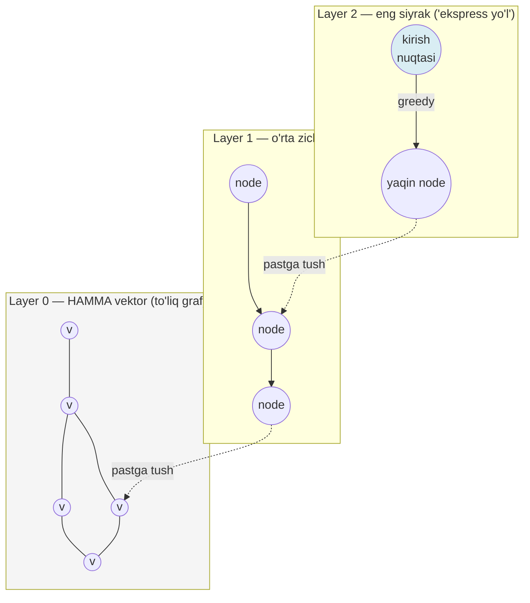

# 02. Index turlari — IVFFlat va HNSW

01-darsda indexsiz Seq Scan 10K qatorda ~4 ms edi — mukammal recall, arzon. Lekin `Execution Time` qatorlar soniga chiziqli o'sadi: 1M'da o'nlab millisekund, 10M'da **soniyalar**. `GET /search` endpoint'ingizning p95 SLA'si buni ko'tarmaydi. Yechim — ANN (approximate nearest neighbor) index: tezlikni ming baravar oshiradi, lekin evaziga recall 100%'dan pastga tushadi. Bu trade-off'ni ko'r-ko'rona emas, **o'lchab** boshqarish — aynan sizning ishingiz. Bu dars ikkita index turini ichidan tushuntiradi, parametrlarni ongli sozlashni va — eng muhimi — recall'ni raqam bilan o'lchashni o'rgatadi.

---

## Nazariya (~30%)

### 1. kNN vs ANN — nima uchun "approximate"

Exact kNN (01-dars) har vektorni tekshiradi: kafolatlangan to'g'ri, lekin O(n). Katta korpusda bu qimmat. ANN esa kelishuv taklif qiladi: **fazoning aksariyatini o'qimasdan tashlab yuboramiz**, faqat istiqbolli qismini tekshiramiz. Natijada 99% holatda haqiqiy top-k topiladi, 1% chetda qoladi — buni **recall** deb o'lchaymiz (`recall@10 = topilgan to'g'ri natijalar / 10`). Huyen Ch6 buni ANN-Benchmarks'ning to'rt metrikasi bilan baholaydi: **recall, QPS** (soniyasiga so'rov), **build time, index size**. Bu to'rttasi bir-biriga qarshi tortadi — bepul tushlik yo'q.

Huyen Ch6 bir necha ANN oilasini sanaydi: LSH (o'xshashlarni bir bucket'ga hash), IVF (klasterlar), HNSW (graf), Product Quantization (vektorni siqib saqlash). FAISS bularning ko'pini beradi; pgvector esa production'da eng foydali ikkitasiga fokuslanadi — **IVFFlat** (klasterlarga bo'lish) va **HNSW** (ko'p qatlamli graf). PQ uslubidagi siqish pgvector'da alohida `halfvec`/binary kvantlash sifatida keladi (bu darsda halfvec, 05-darsda binary + rerank). Mexanikasi butunlay boshqacha, shuning uchun parametrlari ham.

### 2. IVFFlat — fazoni klasterlarga bo'lish

IVFFlat (Inverted File with Flat compression) fazoni `lists` ta klasterga bo'ladi (K-means centroidlar). Har vektor eng yaqin centroidga tayinlanadi — bu **Voronoi hujayralari** kabi. Qidiruvda: avval query'ga eng yaqin `probes` ta centroidni topamiz, keyin **faqat o'sha hujayralar ichidagi** vektorlarni tekshiramiz. Qolgan hujayralar butunlay o'tkazib yuboriladi.

Ikki parametr:

- **`lists`** — nechta klaster. Rasmiy formula: `rows / 1000` (≤1M qator uchun), `sqrt(rows)` (1M+).
- **`probes`** — qidiruvda nechta klaster tekshiriladi. **Default 1 — recall dahshatli past**, chunki query aynan klaster chegarasida bo'lsa, qo'shni hujayradagi yaqinroq vektorlar butunlay ko'rilmaydi. Amalda 10–50 (yoki `sqrt(lists)`).

Muhim nozik nuqta: IVFFlat centroidlarni **mavjud datadan o'rganadi**, shuning uchun **bo'sh jadvalga qurib bo'lmaydi** (o'rganadigan taqsimot yo'q). Va ko'p yangi insert'dan keyin taqsimot siljisa centroidlar eskiradi → recall pasayadi → `REINDEX` kerak.

Konkret misolda: 100K vektor, `lists=100` → o'rtacha har hujayrada ~1000 vektor. `probes=1` faqat 1000 vektorni ko'radi (100x tezlik), lekin query hujayra chegarasida bo'lsa, qo'shni hujayradagi yaqinroq vektor ko'rilmay qoladi — recall pasayadi. `probes=10` o'nta eng yaqin hujayrani (~10K vektor) ko'radi: sekinroq, lekin chegara muammosi kamayadi. Ana shu `probes` — tezlik va recall orasidagi to'g'ridan-to'g'ri tugma.

### 3. HNSW — ko'p qatlamli graf (skip list'ning umumlashmasi)

HNSW'ni tushunish uchun sizga tanish **skip list**dan boshlaymiz. Skip list'da pastki qatlamda hamma element bor, yuqori qatlamlarda esa faqat ba'zilari — "ekspress yo'llar". Qidiruvda yuqoridan boshlab uzoq sakraysiz, keyin pastga tushib aniqlashtirasiz: O(log n).

HNSW (Hierarchical Navigable Small World) — aynan shu g'oyaning grafga umumlashtirilgani. Pastki qatlam (Layer 0) — **hamma** vektor, ular yaqin qo'shnilar bilan bog'langan graf. Yuqori qatlamlarda vektorlarning tobora kichik qismi — uzoq masofali "ekspress" bog'lanishlar. Qidiruv: eng yuqori qatlamdan kirib, har qadamda query'ga eng yaqin qo'shniga o'tasiz (greedy), tanlangan qatlamda tiqilib qolsangiz pastga tushasiz — Layer 0'gacha.



Uch parametr:

- **`m`** (default 16) — har node'ning maksimal bog'lanishlari. Kattaroq = zichroq graf, aniqroq, ko'proq xotira.
- **`ef_construction`** (default 64) — qurish paytida ko'riladigan kandidatlar ro'yxati. Kattaroq = sifatliroq graf, sekinroq build.
- **`ef_search`** (default 40) — **query paytidagi** kandidatlar ro'yxati; recall'ni real vaqtda boshqaradigan asosiy tugma. `ef_search >= LIMIT` bo'lishi shart.

IVFFlat'dan farqli — HNSW yangi insert'larni **qayta qurishsiz** hazm qiladi (graf'ga qo'shiladi), shuning uchun dinamik data'ga mos.

### 4. Operator class — index qaysi metrikaga qurilishi

Index yaratishda `vector_cosine_ops` kabi **operator class** tanlaysiz. Bu 01-darsdagi metrika tanlovini index darajasiga ko'taradi: index faqat o'z operatori uchun ishlaydi. Cosine index'i `<->` (L2) so'roviga yordam bermaydi — Postgres Seq Scan'ga tushadi.

| Operator class | Operator | Metrika | voyage-4 uchun |
|---|---|---|---|
| `vector_l2_ops` | `<->` | L2 | kerak emas |
| `vector_cosine_ops` | `<=>` | cosine distance | ishlaydi |
| `vector_ip_ops` | `<#>` | inner product | **eng arzon** |

voyage-4 normalizatsiyalangan (norm=1), shuning uchun `vector_ip_ops` + `<#>` `vector_cosine_ops`'dan arzonroq (na bo'lish, na ildiz) va **bir xil ranking** beradi — 01-darsdagi teorema. Darsning misollarida oydinlik uchun `vector_cosine_ops` ishlatamiz, lekin production'da normalizatsiyalangan embedding uchun `vector_ip_ops` tavsiya etiladi. Faqat qoidani unutmang: `ORDER BY`'dagi operator index operator class'iga **mos kelishi shart**.

### 5. Qaysi birini — 2026 amaliy qoidasi

| Mezon | HNSW | IVFFlat |
|---|---|---|
| Recall / QPS | yuqori (95%+ out of box) | `probes`'ga qattiq bog'liq |
| Build vaqti | sekin (0.8.x parallel build yordam beradi) | tez |
| Xotira | ko'p (graf RAM'da) | kam |
| Dinamik data | yaxshi (insert hazm qiladi) | recall drift → REINDEX |
| Bo'sh jadval | quriladi | qurilmaydi (centroid yo'q) |

> **Oltin qoida:** HNSW — 2026 production default; default parametrlar bilan boshlang, recall yetmasa avval `ef_search`, keyin `m`/`ef_construction`'ni oshiring. IVFFlat — asosan statik, juda katta dataset uchun, build vaqti va xotira qattiq cheklangan holatlarda.

---

## Amaliyot (~70%)

01-darsdagi `common.py` (embed + connect helper) va `chunks` jadvali kerak. Bu darsda o'lchov ma'noli bo'lishi uchun ~100K qatorli jadval faraz qilamiz (01-dars Modify #3'dagi `generate_series` bilan).

### Predict / Run

#### 1-mashq: IVFFlat va `probes`ning kuchi

Avval IVFFlat quramiz. `lists = rows/1000` — 100K uchun 100. Keyin `probes=1` va `probes=20` bilan bir xil query'ni ishlatib, natija ro'yxati o'zgarishini ko'ramiz.

> **Bashorat qil:** `probes=1` va `probes=20` bir xil top-10 ro'yxatini beradimi? Agar farq qilsa — qaysi biri exact kNN (01-dars) natijasiga yaqinroq bo'ladi?

```sql
-- IVFFlat data BOR jadvalda quriladi (K-means centroidlar datadan o'rganiladi)
CREATE INDEX chunks_ivf ON chunks
USING ivfflat (embedding vector_cosine_ops)
WITH (lists = 100);
```

```python
# 01_ivf_probes.py
from common import embed, connect

conn = connect()
qv = embed(["connection pool timeout muammosi"], input_type="query")[0]

with conn.cursor() as cur:
    for probes in (1, 20):
        cur.execute("SET ivfflat.probes = %s", (probes,))
        cur.execute(
            "SELECT id FROM chunks ORDER BY embedding <=> %s LIMIT 10", (qv,)
        )
        ids = [r[0] for r in cur.fetchall()]
        print(f"probes={probes:2}: {ids}")

# Output:
# probes= 1: [842, 119, 5507, 91123, 442, 88, 33001, 7, 60215, 15]
# probes=20: [842, 5507, 119, 88, 442, 7, 15, 91123, 60215, 33001, ... boshqa tartib]
```

`probes=1` faqat bitta klasterni ko'rdi — chegaradagi yaqin vektorlarni o'tkazib yubordi, tartib ham noto'g'ri. `probes=20` yigirma klasterni ko'rdi, natija exact'ga ancha yaqin. Bu research xato #2: *"index qo'ydim, natija yomon"* shikoyatlarining klassik sababi — `probes` default 1'da qolgan.

#### 2-mashq: HNSW qurish va `EXPLAIN ANALYZE` bilan Index Scan

Endi HNSW quramiz (avval IVFFlat'ni tashlab). `EXPLAIN ANALYZE` bilan Postgres endi Seq Scan emas, **Index Scan** ishlatishini tasdiqlaymiz — bu sizning tanish quroling.

> **Bashorat qil:** 01-darsda indexsiz `Execution Time` ~4 ms (10K qator) edi. HNSW bilan 100K qatorda `EXPLAIN` qaysi node'ni ko'rsatadi va vaqt Seq Scan'dan katta yoki kichik bo'ladi?

```sql
DROP INDEX IF EXISTS chunks_ivf;

CREATE INDEX chunks_hnsw ON chunks
USING hnsw (embedding vector_cosine_ops)
WITH (m = 16, ef_construction = 64);
```

```python
# 02_hnsw_explain.py
from common import embed, connect

conn = connect()
qv = embed(["connection pool timeout"], input_type="query")[0]

with conn.cursor() as cur:
    cur.execute("SET hnsw.ef_search = 40")     # default, LIMIT'dan katta bo'lsin
    cur.execute(
        "EXPLAIN ANALYZE SELECT id FROM chunks ORDER BY embedding <=> %s LIMIT 10",
        (qv,),
    )
    for (line,) in cur.fetchall():
        print(line)

# Output:
# Limit  (cost=... rows=10) (actual time=0.58..0.63 rows=10 loops=1)
#   ->  Index Scan using chunks_hnsw on chunks
#                                 (actual time=0.57..0.61 rows=10 loops=1)
#         Order By: (embedding <=> '[...]'::vector)
# Planning Time: 0.11 ms
# Execution Time: 0.66 ms
```

**Index Scan using chunks_hnsw** — Postgres graf bo'ylab navigatsiya qildi, butun jadvalni o'qimadi. 100K qatorda 0.66 ms, indexsiz esa bu ~40 ms bo'lardi. `Order By:` qatori index aynan `<=>` operatori uchun ishlayotganini ko'rsatadi — 01-dars Make'dagi eslatma shu yerda muhim: `ORDER BY`'da xom operator turishi shart, aks holda Index Scan o'rniga Seq Scan qaytadi.

> **Eslatma (01-darsga bog'lanish):** voyage-4 normalizatsiyalangan, shuning uchun `vector_ip_ops` (dot, `<#>`) index'i `vector_cosine_ops`'dan arzonroq va bir xil ranking beradi. `USING hnsw (embedding vector_ip_ops)` + `ORDER BY embedding <#> $1` — production'da tavsiya etilgan variant.

#### 3-mashq: recall'ni O'LCHASH — asosiy ko'nikma

Bu darsning yuragi. Approximate index qo'ydingiz — endi *qancha* approximate ekanini bilishingiz kerak. Usul: bir xil query'ni **exact** (index o'chirilgan) va **ANN** (index yoqilgan) bilan ishlatib, top-10 ro'yxatlarning kesishmasini o'lchash.

`SET enable_indexscan = off` — Postgres index'ni tashlab Seq Scan'ga tushadi = exact kNN = ground truth. Bu 01-darsdagi bilimni to'g'ridan-to'g'ri qayta ishlatadi.

> **Bashorat qil:** default `ef_search = 40` bilan HNSW recall@10 taxminan qancha bo'ladi — 0.7, 0.9, yoki 0.99? Uni oshirsak recall qaysi tomonga, latency qaysi tomonga siljiydi?

```python
# 03_recall.py
from common import embed, connect

conn = connect()

queries = [
    "connection pool timeout", "pgbouncer transaction rejimi",
    "kubernetes pod autoscale", "postgres vacuum sozlash",
    "index bloat muammosi", "replication lag",
    # ... jami 20 ta turli query
]
qvs = embed(queries, input_type="query")

def top_ids(cur, qv, k, exact: bool) -> set[int]:
    # exact=True: index'ni o'chirib Seq Scan = ground truth (01-dars)
    cur.execute("SET enable_indexscan = %s", ("off" if exact else "on",))
    cur.execute(
        "SELECT id FROM chunks ORDER BY embedding <=> %s LIMIT %s", (qv, k)
    )
    return {r[0] for r in cur.fetchall()}

def recall_at_k(ef_search: int, k: int = 10) -> float:
    total = 0.0
    with conn.cursor() as cur:
        cur.execute("SET hnsw.ef_search = %s", (ef_search,))
        for qv in qvs:
            exact = top_ids(cur, qv, k, exact=True)
            ann   = top_ids(cur, qv, k, exact=False)
            total += len(exact & ann) / k       # kesishma / k
    return total / len(qvs)

print(f"recall@10 (ef_search=40): {recall_at_k(40):.3f}")

# Output:
# recall@10 (ef_search=40): 0.934
```

0.934 — ya'ni o'rtacha har 10 to'g'ri natijadan ~9.3 tasi topildi, ~0.7 tasi chetda qoldi. Bu ko'p ilova uchun yetarli, lekin *siz buni endi bilasiz* — o'lchamasangiz, aniqlik jimgina yo'qolgan bo'lardi (research xato #4). RAG sifatingiz pasaysa, birinchi tekshiradigan raqam shu.

#### 4-mashq: halfvec bilan storage'ni 2x tejash

`halfvec` — float16 (yarim aniqlik). Storage `4*dim+8` o'rniga `2*dim+8` — ikki barobar kam, recall esa deyarli o'zgarmaydi ("arzon g'alaba"). Index'ni **expression** bilan quramiz.

```sql
-- halfvec expression index: storage 2x kam, recall deyarli teng
CREATE INDEX chunks_hnsw_half ON chunks
USING hnsw ((embedding::halfvec(1024)) halfvec_cosine_ops)
WITH (m = 16, ef_construction = 64);
```

```python
# 04_halfvec.py — query ham halfvec'ga cast bo'lishi SHART
from common import embed, connect

conn = connect()
qv = embed(["connection pool timeout"], input_type="query")[0]

with conn.cursor() as cur:
    cur.execute(
        """
        SELECT id, file
        FROM chunks
        ORDER BY embedding::halfvec(1024) <=> %s::halfvec(1024)
        LIMIT 5
        """,
        (qv,),
    )
    for id_, file in cur.fetchall():
        print(id_, file)

# Output:
# 842 pool.md
# 119 pgbouncer.md
# 5507 pool.md
# 442 pool.md
# 88 k8s.md
```

Query'da `<=>`ning ikkala tomoni ham `halfvec`'ga cast bo'lishi shart — aks holda Postgres expression index'ni taniy olmaydi va Seq Scan'ga tushadi.

> **Index o'lchov limiti tuzog'i:** HNSW/IVFFlat index `vector` tipi uchun **2000 o'lchamgacha**, `halfvec` uchun 4000 gacha ishlaydi. voyage-4 default 1024 — bemalol. Lekin `output_dimension=2048` tanlasangiz, `vector` tipida index **umuman qurilmaydi**: `ERROR: column cannot have more than 2000 dimensions for hnsw index`. Yechim — `halfvec(2048)` cast (limit 4000) yoki 1024'da qolish. Bu — voyage'ning `output_dimension` parametrini tanlashda esda tutiladigan cheklov.

#### 5-mashq: index size va build time — ANN-Benchmarks metrikalarini o'lchash

ANN-Benchmarks to'rt metrikasidan ikkitasini (recall, QPS) yuqorida ko'rdik. Qolgan ikkitasi — **index size** va **build time** — sizning tanish `pg_relation_size` va `\timing` quroling bilan o'lchanadi. Bu halfvec'ning 2x storage yutug'ini raqam bilan tasdiqlaydi.

> **Bashorat qil:** 100K qatorli `chunks`'da `chunks_hnsw` (vector) index'i va `chunks_hnsw_half` (halfvec) index'i o'lchamlari nisbati taxminan qancha bo'ladi — 1x, 1.5x, yoki 2x?

```sql
-- Index o'lchamlarini yonma-yon
SELECT pg_size_pretty(pg_relation_size('chunks_hnsw'))      AS hnsw_vector,
       pg_size_pretty(pg_relation_size('chunks_hnsw_half')) AS hnsw_halfvec,
       pg_size_pretty(pg_relation_size('chunks'))           AS jadval_main;

-- Output:
--  hnsw_vector | hnsw_halfvec | jadval_main
-- -------------+--------------+-------------
--  612 MB      | 328 MB       | 12 MB
```

```python
# 05_build_time.py — build vaqtini o'lchash
import time
from common import connect

conn = connect()
conn.autocommit = True                      # CREATE INDEX tranzaksiyadan tashqarida

with conn.cursor() as cur:
    cur.execute("DROP INDEX IF EXISTS chunks_hnsw")
    # --- default maintenance_work_mem yetmasa build disk'ga tushadi va sekinlashadi ---
    cur.execute("SET maintenance_work_mem = '2GB'")
    t0 = time.perf_counter()
    cur.execute(
        "CREATE INDEX chunks_hnsw ON chunks "
        "USING hnsw (embedding vector_cosine_ops) WITH (m = 16, ef_construction = 64)"
    )
    print(f"HNSW build: {time.perf_counter() - t0:.1f}s")

# Output:
# HNSW build: 41.3s
```

Ikki xulosa: `jadval_main` atigi 12 MB (vektorlar TOAST'da — 01-dars), lekin HNSW **index** 612 MB — graf va vektor nusxalari RAM'da yashashi kerak, aynan shuning uchun HNSW xotira talab qiladi. `halfvec` index esa 328 MB — deyarli 2x kam, recall'ga ta'sirsiz. Build 41s (100K qator) — 10M qatorda bu daqiqalar; shuning uchun `maintenance_work_mem` va parallel build muhim (tuzoq #4).

#### 6-mashq: QPS — o'tkazuvchanlikni o'lchash va to'rt metrikani bog'lash

Endi ANN-Benchmarks to'rtinchi metrikasi — **QPS** (queries per second). Latency bitta so'rovning kechikishi, QPS esa soniyasiga necha so'rov bajarilishi. Ular bog'liq, lekin bir xil emas: pool va parallellik QPS'ni oshiradi. Bu yerda bitta connection'da ketma-ket o'lchaymiz (quyi chegara), va `ef_search`ning recall ↔ QPS savdosini yopamiz.

> **Bashorat qil:** `ef_search`ni 40 → 400 oshirsak, QPS oshadimi yoki tushadimi? Bu recall grafigining teskarisi ekanini eslang (3-mashqda recall oshgan edi).

```python
# 06_qps.py — QPS o'lchash: recall ↔ tezlik savdosining ikkinchi tomoni
import time
from common import embed, connect

conn = connect()
queries = [ ... ]                       # 03_recall.py'dagi 20 query
qvs = embed(queries, input_type="query")

def qps(ef_search: int, rounds: int = 10) -> float:
    with conn.cursor() as cur:
        cur.execute("SET hnsw.ef_search = %s", (ef_search,))
        n, t0 = 0, time.perf_counter()
        for _ in range(rounds):
            for qv in qvs:
                cur.execute(
                    "SELECT id FROM chunks ORDER BY embedding <=> %s LIMIT 10", (qv,)
                )
                cur.fetchall()
                n += 1
        return n / (time.perf_counter() - t0)

for ef in (40, 100, 400):
    print(f"ef_search={ef:>3}: {qps(ef):>5.0f} QPS")

# Output:
# ef_search= 40:  1480 QPS
# ef_search=100:   770 QPS
# ef_search=400:   250 QPS
```

Endi to'rt metrikaning to'liq manzarasi qo'lingizda: `ef_search`ni oshirish **recall'ni** (3-mashq: 0.93 → 0.997) va **latency'ni** (Make: 0.66 → 3.94 ms) oshiradi, **QPS'ni** esa tushiradi (1480 → 250). `build time` va `index size` (5-mashq) esa `m`/`ef_construction`/tip (halfvec) bilan boshqariladi. Production tuning — shu besh raqamni SLA'ga qarab muvozanatlash. Eslatma: bu bitta connection'dagi ketma-ket son; connection pool bilan real QPS ancha yuqori bo'ladi (05-darsda pool sizing).

### Investigate / Modify

Har mashqda avval bashorat qiling.

1. **`lists`ni buzing.** IVFFlat'ni `lists = 5` bilan qayta quring (100K qator uchun juda kam). `probes=20`da ham recall qanday o'zgaradi? Endi `lists = 5000` (juda ko'p) bilan — build vaqti va recall'ga ta'siri qanday? Nima uchun `rows/1000` formulasi o'rta yechim?

2. **`ef_construction`ni oshiring.** HNSW'ni `ef_construction = 200` bilan qayta quring. Build vaqti (`\timing` yoki `time.perf_counter`) qancha o'sdi? Bir xil `ef_search`da recall yaxshilandimi? Bu "build'ga ko'proq sarflab, query'da bepul olish" savdosi.

3. **IVFFlat recall drift.** IVFFlat qurib recall o'lchang. Keyin jadvalning 50%'ini yangi (boshqa taqsimotli) data bilan `INSERT` qiling va recall'ni **qayta** o'lchang — tushdimi? `REINDEX INDEX chunks_ivf` qilib yana o'lchang. HNSW'da bu muammo nega yo'q?

4. **`vector_ip_ops` bilan qurib solishtiring.** HNSW'ni `USING hnsw (embedding vector_ip_ops)` bilan qayta quring va query'ni `ORDER BY embedding <#> %s`'ga o'zgartiring. `03_recall.py`'ni moslashtirib recall'ni o'lchang — `vector_cosine_ops` bilan bir xil chiqdimi (voyage-4 normalizatsiyalangan)? Endi ataylab xato qiling: `vector_ip_ops` index bor jadvalda `ORDER BY embedding <=> %s` (cosine) yozing — `EXPLAIN`'da Index Scan qoladimi yoki Seq Scan'ga tushadimi? Nega?

### Make

**Challenge: `ef_search` sweep — recall/latency jadvali**

`ef_search`'ni 10 → 40 → 100 → 400 qilib, har biri uchun recall@10 va median latency'ni o'lchab jadval chiqaradigan skript yozing. Maqsad — bitta tugma (`ef_search`) recall va tezlikni qanday almashtirishini o'z ko'zingiz bilan ko'rish.

Talab:

1. `03_recall.py`'dagi `recall_at_k`'ni qayta ishlating.
2. Latency: har `ef_search` uchun 20 query'ni `time.perf_counter` bilan o'lchab, **median**ni oling (o'rtacha emas — outlier'lardan himoya).
3. Jadval ustunlari: `ef_search | recall@10 | p50_ms`.
4. Xulosa qatorini chop eting: qaysi `ef_search` "recall ≥ 0.95 bo'lgan eng arzon" nuqta.

<details>
<summary>Yechim</summary>

```python
# ef_sweep.py — ef_search trade-off jadvali
import time
import statistics
from common import embed, connect

conn = connect()

queries = [ ... ]                       # 03_recall.py'dagi 20 query
qvs = embed(queries, input_type="query")

def top_ids(cur, qv, k, exact):
    cur.execute("SET enable_indexscan = %s", ("off" if exact else "on",))
    cur.execute("SELECT id FROM chunks ORDER BY embedding <=> %s LIMIT %s", (qv, k))
    return {r[0] for r in cur.fetchall()}

def measure(ef_search: int, k: int = 10):
    recalls, latencies = [], []
    with conn.cursor() as cur:
        # --- exact ground truth (index o'chirilgan) bir marta ---
        exact = [top_ids(cur, qv, k, exact=True) for qv in qvs]
        cur.execute("SET hnsw.ef_search = %s", (ef_search,))
        for qv, gt in zip(qvs, exact):
            t0 = time.perf_counter()
            ann = top_ids(cur, qv, k, exact=False)
            latencies.append((time.perf_counter() - t0) * 1000)   # ms
            recalls.append(len(gt & ann) / k)
    return statistics.mean(recalls), statistics.median(latencies)

print(f"{'ef_search':>9} | {'recall@10':>9} | {'p50_ms':>7}")
best = None
for ef in (10, 40, 100, 400):
    recall, p50 = measure(ef)
    print(f"{ef:>9} | {recall:>9.3f} | {p50:>7.2f}")
    if recall >= 0.95 and best is None:
        best = ef

print(f"\nrecall>=0.95 bo'lgan eng arzon ef_search: {best}")

# Output:
#  ef_search | recall@10 |  p50_ms
#         10 |     0.712 |    0.31
#         40 |     0.934 |    0.66
#        100 |     0.981 |    1.28
#        400 |     0.997 |    3.94
#
# recall>=0.95 bo'lgan eng arzon ef_search: 100
```

Jadval trade-off'ni yalang'ochlaydi: `ef_search` 10 → 400 recall'ni 0.71 → 0.997 ko'taradi, lekin latency 0.31 → 3.94 ms (~12x). "recall ≥ 0.95 uchun eng arzon" nuqta bu korpusda `ef_search=100`. Bu — production tuning'ning aynan usuli: SLA'ni belgilang (masalan recall ≥ 0.95, p50 ≤ 2 ms), jadvaldan mos nuqtani tanlang.

</details>

---

## Tuzoqlar

1. **`probes` / `ef_search`ni default'da qoldirish.** Ayniqsa `ivfflat.probes = 1` — recall dahshatli past. "Index qo'ydim, natija yomonlashdi" shikoyatining №1 sababi. Doim `SET` bilan sozlang va recall o'lchang.

2. **IVFFlat'ni bo'sh jadvalga qurish.** Centroidlar o'rganadigan data yo'q → ma'nosiz klasterlar → past recall. Data yuklangandan **keyin** quring, yoki HNSW tanlang (bu muammosiz).

3. **IVFFlat recall drift.** Ko'p yangi insert'dan keyin taqsimot siljiydi, centroidlar eskiradi. Vaqti-vaqti bilan `REINDEX`. Dinamik data'da HNSW afzalroq.

4. **Katta jadvalda default `maintenance_work_mem` bilan HNSW build.** Graf xotiraga sig'masa disk'ga tushadi — build soatlab cho'ziladi. Avval `SET maintenance_work_mem = '2GB'` va (0.8.x) parallel worker'lar. Graf query paytida ham RAM'da (shared_buffers / OS cache) bo'lishi kerak.

5. **Index o'lchov limitini unutish.** `vector` index ≤ 2000 dim. voyage `output_dimension=2048` → `vector` index qurilmaydi. `halfvec` cast yoki 1024.

6. **Recall'ni umuman o'lchamaslik.** Approximate index qo'yib aniqlik yo'qolganini sezmaslik — jimgina eng xavfli. Har index o'zgarishida `03_recall.py`ni ishlatishni odat qiling.

---

## Retrieval practice

1. IVFFlat va HNSW mexanikasi qanday farq qiladi? Qaysi parametr(lar) har birida recall'ni query paytida boshqaradi?
2. `ivfflat.probes = 1` nima uchun juda past recall beradi? Voronoi hujayralari va klaster chegarasi bilan tushuntiring.
3. HNSW'ni skip list bilan bir jumlada bog'lang: yuqori qatlamlar nima vazifani bajaradi?
4. `ef_search`ni 40'dan 400'ga oshirsangiz nima evaziga nima yaxshilanadi? Raqam bilan misol keltiring.
5. Recall@10'ni bir DB ichida qanday o'lchaysiz — ground truth'ni qayerdan olasiz? (01-darsdagi qaysi bilim ishlatiladi?)
6. Nima uchun IVFFlat bo'sh jadvalga qurilmaydi, HNSW esa quriladi? Qaysi biri ko'p insert'dan keyin REINDEX talab qiladi?
7. voyage `output_dimension=2048` tanlasangiz, `USING hnsw (embedding vector_cosine_ops)` nima uchun xato beradi va yechim nima?

---

## Manbalar

- Chip Huyen, *AI Engineering* (O'Reilly, 2025) — Ch 6, ANN algoritmlari (HNSW, IVF, PQ, LSH), ANN-Benchmarks 4 metrikasi (p.276–298).
- pgvector README (0.8.5) — HNSW/IVFFlat sintaksisi, parametrlar, o'lchov limitlari, halfvec: `https://github.com/pgvector/pgvector`
- pgvector 0.8.0 relizi (iterative scans, halfvec, parallel build): `https://www.postgresql.org/about/news/pgvector-080-released-2952/`
- AWS — IVFFlat vs HNSW deep dive: `https://aws.amazon.com/blogs/database/optimize-generative-ai-applications-with-pgvector-indexing-a-deep-dive-into-ivfflat-and-hnsw-techniques/`
- ParadeDB — pgvector tuning (m, ef_construction, ef_search, maintenance_work_mem): `https://www.paradedb.com/learn/postgresql/tuning-pgvector`
