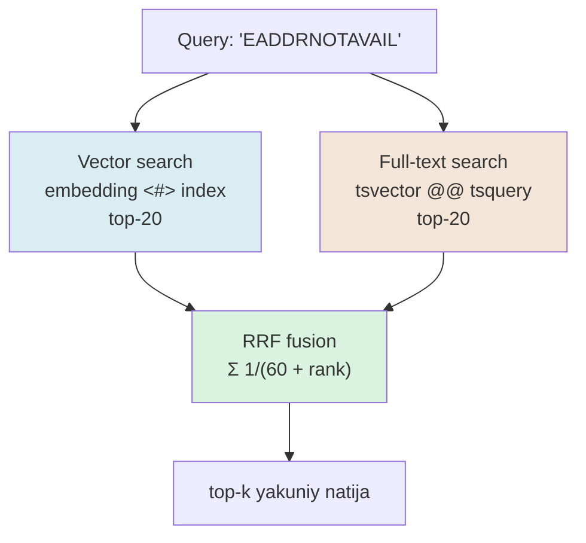

# 04. Hybrid search — full-text + vector, RRF

2-bo'limdagi `semsearch` loyihasida bitta zaiflikni ko'rgansan: pure vector search aniq keyword'larni — `EADDRNOTAVAIL`, versiya raqami (`v0.8.5`), funksiya nomi (`register_vector`) — semantic fazoda "yashiradi". Query aynan shu tokenni so'rasa ham, embedding uni ishonchli topolmaydi. Production o'lchovi ochiq: bitta RAG tizimida pure vector ~62% precision berdi, hybrid + RRF esa ~84% — exact-match query'larda deyarli mukammal. Bu dars aynan shu muammoni **ikkala dvigatelda** — full-text (Postgres'ning kuchli tomoni) + vector — production usulda yechadi, va natijalarni **RRF** bilan birlashtiradi.

---

## Nazariya (~30%)

### 1. Semantik qidiruvning ko'r nuqtasi

Embedding-based va term-based qidiruv bir-birining aynan zaif joyini yopadi. Huyen Ch6 (Table 6-2) ni sintez qilib:

| | Term-based (BM25 / tsvector) | Embedding-based (vector) |
|---|---|---|
| **Kuchi** | aniq keyword, error code, ID, nom, versiya | parafraz, sinonim, ma'no yaqinligi |
| **Zaifligi** | "reset password" ↔ "recover account" ni bog'lay olmaydi | `EADDRNOTAVAIL` ni "yashiradi" |
| **Indexing** | inverted index (`GIN`), tez, arzon | embedding + vector index, qimmatroq |
| **Out-of-box** | kuchli baseline (BM25) | fine-tune bilan o'tadi |

Perplexity CEO (Huyen keltiradi): "BM25'dan real yaxshilash qiyin". Ya'ni term-based hali ham kuchli baseline — uni tashlab emas, **ustiga** semantic qo'shiladi. Bu 2-bo'limdagi contextual retrieval g'oyasining davomi: keyword muammosini metadata bilan emas, ikkinchi qidiruv dvigateli bilan yopamiz.

### 2. Ikkita ro'yxatni birlashtirish — score aralashtirish muammosi

Ikki qidiruv ikki xil "ball" beradi:

- BM25 / `ts_rank_cd`: chegarasi yo'q, `0 .. 25+` oralig'ida, korpusga bog'liq.
- Cosine / dot: `-1 .. 1` (yoki `0 .. 1`).

Handbook'ning klassik usuli — **alpha-vaznli score**: `final = α·vector + (1−α)·text`. Muammo: ikki ball turli miqyosda, ularni qo'shishdan oldin normalizatsiya qilish kerak, normalizatsiya esa **kalibrlashga** muhtoj (min-max? z-score? qaysi korpusda?). Bitta query'da BM25 `18` bo'lsa, boshqasida `3` — normalizatsiya barqaror emas. Bu — 02-bo'limdagi "threshold 0.7 universal emas" tuzog'ining aynan o'zi, faqat ikki tizim orasida.

### 3. RRF — faqat rank, score emas

Reciprocal Rank Fusion muammoni ildizidan yechadi: **ballni umuman ishlatmaydi, faqat pozitsiyani (rank) oladi.**

> **RRF formulasi:** har hujjat `d` uchun `RRF(d) = Σᵢ 1 / (k + rankᵢ(d))`, bu yerda `rankᵢ(d)` — `d`ning `i`-ro'yxatdagi o'rni (1-dan boshlab), `k ≈ 60`.

Nega bu ishlaydi: BM25 `18` va cosine `0.9` — turli miqyos, lekin **"1-o'rin" ikkalasida ham 1-o'rin**. Rank universal birlik. Hujjat ikki ro'yxatda ham yuqori bo'lsa, ikkita `1/(60+rank)` qo'shiladi va u yuqoriga chiqadi; faqat bittasida bo'lsa — bitta hissa oladi.

`k = 60` (Cormack va boshqalar, 2009; Huyen ham shu qiymat) — sehrli emas, tanlangan konstanta. Uning roli: **yuqori o'rinlar orasidagi farqni yumshatish**. Kichik `k` (masalan 10) 1-o'rinni keskin ustun qiladi; katta `k` (200) ro'yxatlarni tekislaydi. `60` amalda barqaror default.

To'liq worked example — to'rt hujjat, ikki ro'yxat (`k=60`):

| Hujjat | Vector rank | Text rank | RRF hisob | RRF ball |
|---|---|---|---|---|
| A | 1 | — | `1/61` | 0.0164 |
| B | 3 | 2 | `1/63 + 1/62` | **0.0320** |
| C | — | 1 | `1/61` | 0.0164 |
| D | 2 | 4 | `1/62 + 1/64` | 0.0317 |

Yakuniy tartib: **B (0.0320) > D (0.0317) > A = C (0.0164)**. Diqqat: A vektorda **1-o'rinda** bo'lsa ham eng tepaga chiqmadi — u faqat bitta ro'yxatda mavjud. B esa ikkala dvigatelda ham yuqori, garchi hech qaysida 1-o'rin bo'lmasa ham. Bu — RRF'ning yuragi: **konsensus** yakka g'alabadan kuchliroq. Aynan shu 2-bo'limdagi `EADDRNOTAVAIL` muammosini yechadi — aniq token hujjat text'da 1-o'rin, vector'da 3-o'rin bo'lib, birlashtirilganda tepaga chiqadi.

### 4. Hybrid oqim



Ikki qidiruv **parallel** ketadi (ketma-ket reranking emas), keyin RRF ularni bitta tartibga qo'shadi. Postgres'da buni bitta SQL query'da qilamiz — o'quvchining eng kuchli maydoni.

### 5. Hybrid narxi va reranking'dan farqi

Hybrid tekin emas: ikki qidiruv + fusion = latency ikki qidiruvning maksimumi + arzon RRF qo'shuvi. Bu narxni qachon to'lash kerak?

- **Hybrid'ni skip qilish mumkin** — korpus sof tabiiy til bo'lsa, exact keyword/ID/error-code deyarli bo'lmasa, pure vector yetadi. Har doim hybrid qo'yish "cargo cult".
- **Hybrid kerak** — texnik korpus (kod, xato kodlari, versiyalar, funksiya nomlari), yoki foydalanuvchi aniq atamalarni qidiradigan domen (huquq, tibbiyot terminlari).

Huyen ikki **birlashtirish strategiyasini** ajratadi:

| | RRF (parallel ensemble) | Reranking (ketma-ket) |
|---|---|---|
| Mexanika | ikki qidiruv parallel → rank fusion | arzon retrieval → cross-encoder qayta tartiblaydi |
| Narx | model'siz, arzon | har (query, chunk) juftiga model chaqiruvi |
| Sifat | yaxshi | odatda yuqoriroq |
| Qachon | birinchi qadam, default | RRF yetmasa, top-N ni aniqlashtirish |

Xulosa: RRF — arzon, model'siz, **birinchi** yaxshilash qadami; reranking (cross-encoder) — qimmatroq, sifatliroq keyingi qadam. Reranking 4-bo'limda chuqur ko'riladi; bu darsda muhimi — RRF'ni to'g'ri qurish, chunki reranking ham ko'pincha uning ustiga qo'yiladi.

---

## Amaliyot (~70%)

### Tayyorgarlik

01-darsdagi `chunks` jadvali (pgvector, HNSW index) tayyor deb faraz qilamiz. Unga full-text ustuni qo'shamiz.

```bash
pip install psycopg[binary] pgvector voyageai python-dotenv numpy qdrant-client fastembed
# .env: VOYAGE_API_KEY, DATABASE_URL
```

```python
# common.py — embed helper (2-bo'lim provider pattern'i)
import os, numpy as np, voyageai
from dotenv import load_dotenv
load_dotenv()
vo = voyageai.Client()

def embed(texts, input_type="document"):
    res = vo.embed(texts, model="voyage-4", input_type=input_type)
    return np.array(res.embeddings, dtype=np.float32)
```

### Predict / Run

#### 1-mashq: tsvector generated column + GIN

Postgres full-text qidiruvni Rogov kursidan bilasan: `tsvector` + `GIN`. Buni `chunks` jadvaliga generated column sifatida qo'shamiz — content o'zgarsa `tsv` avtomatik yangilanadi.

> **Bir muhim tanlov:** `to_tsvector('simple', ...)` ni ishlatamiz, `'english'`ni emas. Nega? Postgres'da **`uzbek` konfiguratsiya yo'q** — o'zbek matni uchun `simple` (faqat tokenizatsiya + lowercase, stemming yo'q) yagona to'g'ri variant. Inglizcha korpus bo'lsa `'english'` (stemming: "running"→"run") ishlatiladi. Bu ochiq cheklov — yashirmaymiz.

```sql
-- schema_fts.sql
-- --- 1-qadam: tsvector generated column (content o'zgarsa avto-yangilanadi) ---
ALTER TABLE chunks ADD COLUMN tsv tsvector
  GENERATED ALWAYS AS (to_tsvector('simple', content)) STORED;

-- --- 2-qadam: GIN index (inverted index: term -> qatorlar) ---
CREATE INDEX chunks_tsv_idx ON chunks USING GIN (tsv);
```

```python
# 01_fts_only.py — sof full-text qidiruv
import os, psycopg

pg = psycopg.connect(os.environ["DATABASE_URL"])

sql = """
    SELECT id, file, ts_rank_cd(tsv, q) AS rank, left(content, 55) AS preview
    FROM chunks, websearch_to_tsquery('simple', %(q)s) q
    WHERE tsv @@ q
    ORDER BY rank DESC
    LIMIT 5
"""
with pg.cursor() as cur:
    cur.execute(sql, {"q": "EADDRNOTAVAIL bind"})
    for cid, file, rank, preview in cur.fetchall():
        print(f"{rank:.4f}  {file}  | {preview}")

# Output:
# 0.0991  network/sockets.md  | EADDRNOTAVAIL (99) xatosi odatda IP manzil...
# 0.0304  network/sockets.md  | bind() dan oldin SO_REUSEADDR sozlash kerak...
```

Ikki nuqta: (1) `websearch_to_tsquery` — foydalanuvchi so'rovini xavfsiz parse qiladi (`"..."`, `OR`, `-` ni tushunadi), `plainto_tsquery`dan kuchliroq; (2) `EADDRNOTAVAIL` faqat bitta hujjatda bor — full-text uni **aniq** topdi, embedding esa bu noyob tokenni yashirardi.

Muhim ogohlantirish: `ts_rank_cd` — **BM25 emas**. Postgres ranking'ida IDF (kamdan-uchraydigan term og'irroq) va document-length normalizatsiya default yo'q — sifati BM25'dan pastroq. RRF ichida bu muhim emas (faqat rank kerak, aniq ball emas). Haqiqiy BM25 Postgres'da kerak bo'lsa — ParadeDB `pg_search` extension'i.

#### 2-mashq: vector-only ko'r nuqtani ko'rsatadi

Endi ayni query'ni pure vector bilan ishga tushiramiz — nega hybrid kerakligini o'z ko'zing bilan ko'r.

> **Bashorat qil:** query "EADDRNOTAVAIL" bo'lsa, vector search'da aniq error-code hujjati (0-hujjat) nechanchi o'rinda chiqadi? "address not available" deb ta'riflagan parafraz hujjat (1-hujjat) undan yuqorimi yoki pastmi?

```python
# 02_vector_only.py
import os, psycopg
from pgvector.psycopg import register_vector
from common import embed

pg = psycopg.connect(os.environ["DATABASE_URL"])
register_vector(pg)

qv = embed(["EADDRNOTAVAIL"], input_type="query")[0]
sql = """
    SELECT id, file, left(content, 55) AS preview
    FROM chunks
    ORDER BY embedding <#> %(qv)s      -- <#> = negativ dot, ASC = eng o'xshash oldinda
    LIMIT 5
"""
with pg.cursor() as cur:
    cur.execute(sql, {"qv": qv})
    for i, (cid, file, preview) in enumerate(cur.fetchall(), 1):
        print(f"rank {i}  {file}  | {preview}")

# Output:
# rank 1  network/sockets.md  | 'address not available' xatosi va uni bartaraf...
# rank 2  network/routing.md  | Tarmoq interfeysiga IP manzil biriktirish...
# rank 3  network/sockets.md  | EADDRNOTAVAIL (99) xatosi odatda IP manzil...
```

Mana ko'r nuqta: aniq `EADDRNOTAVAIL` tokenli hujjat vector'da faqat **3-o'rinda**. Embedding uni parafraz ("address not available") va umumiy "IP manzil" hujjatlaridan pastga surdi — noyob token semantic signalni kam beradi. Full-text (1-mashq) uni 1-o'rinda topgan edi. Hybrid ikkalasini birlashtirib to'g'ri javobni yuqoriga ko'taradi.

#### 3-mashq: RRF SQL — bitta query'da fusion

Endi asosiy nuqta: ikki qidiruvni bitta SQL query'da RRF bilan birlashtiramiz. Ikki CTE (vektor va matn), har birida `ROW_NUMBER()` bilan rank, keyin `FULL OUTER JOIN` + `COALESCE` bilan RRF ballini yig'amiz.

> **Bashorat qil:** hujjat vektor ro'yxatida 3-o'rin, matn ro'yxatida 1-o'rin bo'lsa — uning RRF ballida nechta hissa qo'shiladi? Faqat vektorda 1-o'rin bo'lgan (matnda yo'q) hujjatdan yuqori chiqadimi?

```sql
-- rrf.sql — hybrid search bitta query'da
WITH vec AS (
    -- --- vektor top-20: subquery avval index bilan top-20 oladi, keyin rank ---
    SELECT id, ROW_NUMBER() OVER (ORDER BY dist) AS rank
    FROM (
        SELECT id, embedding <#> %(qv)s AS dist
        FROM chunks
        ORDER BY embedding <#> %(qv)s      -- HNSW index shu yerda ishlaydi
        LIMIT 20
    ) v
),
txt AS (
    -- --- full-text top-20 ---
    SELECT id, ROW_NUMBER() OVER (ORDER BY score DESC) AS rank
    FROM (
        SELECT id, ts_rank_cd(tsv, q) AS score
        FROM chunks, websearch_to_tsquery('simple', %(qt)s) q
        WHERE tsv @@ q
        ORDER BY score DESC
        LIMIT 20
    ) t
)
-- --- RRF: ikki ro'yxat ranklarini qo'shamiz (k=60), yo'qni COALESCE 0 qiladi ---
SELECT c.id, c.file, left(c.content, 50) AS preview,
       COALESCE(1.0 / (60 + vec.rank), 0.0)
     + COALESCE(1.0 / (60 + txt.rank), 0.0) AS rrf
FROM vec
FULL OUTER JOIN txt USING (id)
JOIN chunks c ON c.id = COALESCE(vec.id, txt.id)
ORDER BY rrf DESC
LIMIT 5;
```

Bir texnik nozik joy (backend-dev uchun muhim): `ROW_NUMBER()` window funksiyasini to'g'ridan-to'g'ri `ORDER BY embedding <#> $1 LIMIT 20` ustida ishlatsang, Postgres window uchun **butun jadvalni sort qilishga** majbur bo'ladi va HNSW index'ni tashlab yuboradi. Shuning uchun avval **subquery** (`LIMIT 20` — index ishlaydi), keyin tashqarida 20 qator ustidan `ROW_NUMBER`. Bu `EXPLAIN ANALYZE` bilan tekshiriladigan naqsh — ichki subquery'da `Index Scan using chunks_embedding_hnsw`, tashqarida arzon `Sort` (20 qator).

Bu SQL'ni Python'dan chaqirganda output:

```text
# Output (rrf.sql, qv=embed("EADDRNOTAVAIL"), qt="EADDRNOTAVAIL bind"):
#  id  | file                | preview                                | rrf
# -----+---------------------+----------------------------------------+--------
#  312 | network/sockets.md  | EADDRNOTAVAIL (99) xatosi odatda IP... | 0.03252
#  198 | network/sockets.md  | 'address not available' xatosi va uni  | 0.02581
#  205 | network/routing.md  | Tarmoq interfeysiga IP manzil biri...  | 0.01587
```

Aniq `EADDRNOTAVAIL` hujjati (312) endi **1-o'rinda**: full-text'da 1-o'rin (`1/61`) + vector'da 3-o'rin (`1/63`) = `0.0325`. Vector-only'da 1-o'rin bo'lgan parafraz hujjat (198) 2-o'ringa tushdi — u faqat bitta ro'yxatda kuchli edi. RRF konsensusni mukofotladi.

### Investigate / Modify

Har mashqda **avval bashorat qil**, keyin ishga tushir.

1. **`k`ni o'zgartir.** `rrf.sql`'dagi `60`ni `10` va `200`ga almashtir. `k=10`da nima kuchayadi (yuqori o'rinlar keskinlashadimi)? `k=200`da ranking qanchalik tekislanadi? Qaysi query turida qaysi biri yaxshiroq?

2. **CTE `LIMIT`ini kichraytir.** Ikkala CTE'da `LIMIT 20`ni `LIMIT 3`ga tushir. Nima yo'qoladi? (Maslahat: hujjat vektorda 5-o'rin, matnda yo'q bo'lsa — endi u umuman kandidat ro'yxatiga tushmaydi.) Bu — production'dagi tez-tez uchraydigan tuzoq.

3. **`english` vs `simple`.** Inglizcha korpusda `to_tsvector('english', content)` bilan yangi ustun yasab, "running servers"ni qidir. `simple`'da "running" va "run" turli term, `english`'da bitta (stemming). O'zbek matnida nega buni qilib bo'lmaydi?

4. **`EXPLAIN ANALYZE`.** `rrf.sql`'ni `EXPLAIN ANALYZE` bilan ishga tushir. Ichki vector subquery'da `Index Scan` ko'rinadimi? `ROW_NUMBER`ni subquery'siz to'g'ridan-to'g'ri yozsang, plan `Seq Scan`ga o'zgaradimi?

5. **Vaznli tsvector (`setweight`).** `chunks`ga `title` ustuni bo'lsa, `tsv`ni `setweight(to_tsvector('simple', title), 'A') || setweight(to_tsvector('simple', content), 'B')` qilib qayta yasab, sarlavhaga ko'proq vazn ber. `ts_rank_cd(tsv, q, ...)` ning `weights` argumenti (`{D, C, B, A}`) bilan A/B og'irliklarini o'zgartir. Bu text rankni, demak RRF natijasini qanday siljitadi? (Bu — Rogov kursidagi FTS relevancy tuning'ning hybrid'dagi qo'llanishi.)

### Qdrant'da hybrid — server-side fusion (qisqa)

pgvector'da RRF'ni qo'lda SQL bilan yozding. Qdrant buni **server-side** qiladi: bitta collection'da **named vectors** — dense (voyage-4) va sparse (BM25/SPLADE) — va `query_points` ichida `prefetch` + `FusionQuery(RRF)`.

```python
# 03_qdrant_hybrid.py — server-side RRF (konseptual skelet)
from qdrant_client import QdrantClient, models
from fastembed import SparseTextEmbedding      # BM25 sparse vektor generatori
from common import embed

qc = QdrantClient(url="http://localhost:6333")
bm25 = SparseTextEmbedding("Qdrant/bm25")

# --- 1-qadam: dense + sparse ikkala vektorni bitta collection'da ---
qc.create_collection(
    collection_name="hybrid",
    vectors_config={"dense": models.VectorParams(size=1024, distance=models.Distance.DOT)},
    sparse_vectors_config={"sparse": models.SparseVectorParams(modifier=models.Modifier.IDF)},
)
# (upsert: har point'da {"dense": voyage_vec, "sparse": bm25_vec} — qisqartirildi)

# --- 2-qadam: hybrid query — ikki prefetch, server RRF bilan qo'shadi ---
q = "EADDRNOTAVAIL bind xatosi"
dense_q = embed([q], input_type="query")[0].tolist()
sparse_q = next(bm25.query_embed(q))

hits = qc.query_points(
    collection_name="hybrid",
    prefetch=[
        models.Prefetch(query=dense_q, using="dense", limit=20),
        models.Prefetch(
            query=models.SparseVector(indices=sparse_q.indices.tolist(),
                                      values=sparse_q.values.tolist()),
            using="sparse", limit=20),
    ],
    query=models.FusionQuery(fusion=models.Fusion.RRF),   # server-side RRF
    limit=5,
).points
for h in hits:
    print(f"{h.score:.4f}  {h.payload.get('file')}")

# Output:
# 0.0325  network/sockets.md
# 0.0258  network/sockets.md
# 0.0159  network/routing.md
```

Farqi: pgvector'da fusion mantiqi **sizning SQL'ingizda** (to'liq nazorat, `JOIN` bilan ilova datasi), Qdrant'da fusion **serverda** (kod kam, lekin sparse vektorni fastembed bilan tayyorlash kerak). `SparseVectorParams(modifier=IDF)` — Qdrant BM25'ning IDF komponentini o'zi hisoblaydi. Ikkala yo'l ham RRF, natija bir xil tartibda.

### Make

**Challenge: uch rejimni solishtiruvchi skript**

`EADDRNOTAVAIL` kabi exact-keyword muammosini o'z ko'zing bilan o'lchash uchun, bitta query'ni **uchala rejimda** (vector-only, text-only, hybrid) ishlatib, natijalarni yonma-yon chiqaruvchi skript yoz.

Talab:

1. Kichik sinov korpusi (6-8 hujjat) yasab `chunks`ka yukla — bittasida aniq `EADDRNOTAVAIL (99)`, bittasi parafraz ("address not available"), qolganlari chalg'ituvchi (routing, permission, connection refused).
2. `vector_search(q, k)`, `text_search(q, k)`, `hybrid_search(q, k)` — uchtasi ham `[(rank, id, preview)]` qaytarsin.
3. `hybrid_search` bitta embed chaqiruvi + bitta RRF SQL bo'lsin (yuqoridagi `rrf.sql`).
4. Query = `"EADDRNOTAVAIL"` uchun uch ro'yxatni jadval bo'lib chiqar; aniq error-code hujjati har rejimda nechanchi o'rinda ekanini ko'rsat.

<details>
<summary>Yechim</summary>

```python
# compare_modes.py — vector / text / hybrid yonma-yon
import os, psycopg
from pgvector.psycopg import register_vector
from common import embed

pg = psycopg.connect(os.environ["DATABASE_URL"])
register_vector(pg)

def vector_search(q, k=5):
    qv = embed([q], input_type="query")[0]
    sql = "SELECT id, left(content,45) FROM chunks ORDER BY embedding <#> %s LIMIT %s"
    with pg.cursor() as cur:
        cur.execute(sql, (qv, k))
        return [(i, cid, prev) for i, (cid, prev) in enumerate(cur.fetchall(), 1)]

def text_search(q, k=5):
    sql = """SELECT id, left(content,45) FROM chunks, websearch_to_tsquery('simple', %s) tq
             WHERE tsv @@ tq ORDER BY ts_rank_cd(tsv, tq) DESC LIMIT %s"""
    with pg.cursor() as cur:
        cur.execute(sql, (q, k))
        return [(i, cid, prev) for i, (cid, prev) in enumerate(cur.fetchall(), 1)]

def hybrid_search(q, k=5):
    qv = embed([q], input_type="query")[0]
    sql = """
        WITH vec AS (
            SELECT id, ROW_NUMBER() OVER (ORDER BY dist) AS rank
            FROM (SELECT id, embedding <#> %(qv)s AS dist FROM chunks
                  ORDER BY embedding <#> %(qv)s LIMIT 20) v),
        txt AS (
            SELECT id, ROW_NUMBER() OVER (ORDER BY score DESC) AS rank
            FROM (SELECT id, ts_rank_cd(tsv, tq) AS score
                  FROM chunks, websearch_to_tsquery('simple', %(qt)s) tq
                  WHERE tsv @@ tq ORDER BY score DESC LIMIT 20) t)
        SELECT c.id, left(c.content,45),
               COALESCE(1.0/(60+vec.rank),0)+COALESCE(1.0/(60+txt.rank),0) AS rrf
        FROM vec FULL OUTER JOIN txt USING (id)
        JOIN chunks c ON c.id = COALESCE(vec.id, txt.id)
        ORDER BY rrf DESC LIMIT %(k)s
    """
    with pg.cursor() as cur:
        cur.execute(sql, {"qv": qv, "qt": q, "k": k})
        return [(i, cid, prev) for i, (cid, prev, _) in enumerate(cur.fetchall(), 1)]

if __name__ == "__main__":
    query = "EADDRNOTAVAIL"
    for name, fn in [("VECTOR", vector_search), ("TEXT", text_search), ("HYBRID", hybrid_search)]:
        print(f"\n=== {name} ===")
        for rank, cid, prev in fn(query, k=3):
            mark = "  <-- aniq error code" if "EADDRNOTAVAIL (99)" in prev else ""
            print(f"  {rank}. id={cid}  {prev}{mark}")

    # Output:
    # === VECTOR ===
    #   1. id=41  'address not available' xatosi va uni bar
    #   2. id=45  Tarmoq interfeysiga IP manzil biriktir
    #   3. id=40  EADDRNOTAVAIL (99) xatosi odatda IP ma  <-- aniq error code
    #
    # === TEXT ===
    #   1. id=40  EADDRNOTAVAIL (99) xatosi odatda IP ma  <-- aniq error code
    #
    # === HYBRID ===
    #   1. id=40  EADDRNOTAVAIL (99) xatosi odatda IP ma  <-- aniq error code
    #   2. id=41  'address not available' xatosi va uni bar
    #   3. id=45  Tarmoq interfeysiga IP manzil biriktir
```

Xulosa jadvalda ko'rinadi: **vector** aniq error-code hujjatini 3-o'ringa surdi; **text** uni topdi lekin faqat bitta natija berdi (parafrazni ko'rmadi — "address not available"da `EADDRNOTAVAIL` tokeni yo'q); **hybrid** ikkalasining kuchini oldi — aniq hujjat 1-o'rinda, parafraz 2-o'rinda. Aynan shu 62%→84% sakrashning mikroskopik ko'rinishi.

</details>

---

## Tuzoqlar

- **Score'larni normalizatsiyasiz qo'shish.** `α·cosine + (1−α)·bm25` — ikki miqyos aralashadi, natija chalkash. RRF buni yechadi (faqat rank).
- **`k=60`ni sehrli deb bilish.** U kalibrlanadigan parametr: exact-match ustun bo'lsa kichik `k`, umumiy semantic bo'lsa katta `k`.
- **CTE `LIMIT`ini juda kichik qo'yish.** `LIMIT 3` ikkala ro'yxatda — ko'p to'g'ri hujjat kandidatga ham tushmaydi. Odatda `20-100` kandidat, keyin RRF top-`k`.
- **`ROW_NUMBER`ni subquery'siz yozib index'ni yo'qotish.** Window funksiya global sort talab qiladi → HNSW ishlamaydi. Avval `LIMIT`li subquery.
- **`ts_rank_cd`ni BM25 deb o'ylash.** IDF/length normalizatsiya yo'q — RRF ichida yetarli, lekin haqiqiy BM25 kerak bo'lsa ParadeDB `pg_search`.

---

## Retrieval practice

1. Pure vector search `EADDRNOTAVAIL` kabi tokenni nega "yashiradi"? Term-based esa nega parafrazni topa olmaydi? Bitta jumlada har birining ko'r nuqtasini ayt.
2. RRF nima uchun score'ni emas, **rank**ni ishlatadi? Alpha-vaznli score usulining aynan qaysi muammosini bu chetlab o'tadi?
3. Hujjat A vektorda 1-o'rin (matnda yo'q), hujjat B vektorda 3-o'rin va matnda 2-o'rin. `k=60`da qaysi biri yuqori RRF ballini oladi? Hisobla.
4. RRF SQL'da nega `ROW_NUMBER()`ni to'g'ridan-to'g'ri `ORDER BY embedding <#> $1 LIMIT 20` ustida emas, alohida subquery ustida yozamiz? `EXPLAIN`da nima farq qiladi?
5. O'zbek matnida nega `to_tsvector('simple', ...)` ishlatasan, `'english'`ni emas? `simple` nimani qilmaydi?
6. `ts_rank_cd` haqiqiy BM25dan qanday farq qiladi, va nega bu RRF ichida muhim emas? Haqiqiy BM25 Postgres'da qayerdan olinadi?

---

## Manbalar

- Chip Huyen, *AI Engineering* (O'Reilly, 2025) — Ch 6, term-based vs embedding-based (Table 6-2), hybrid search va RRF formulasi `Σ 1/(k + r_i)`, k≈60 (p.276–298).
- Iusztin & Labonne, *LLM Engineer's Handbook* (Packt, 2024) — Ch 4, hybrid search (alpha-vaznli birlashtirish) va filtered vector search farqi (p.236–252).
- Jonathan Katz — Hybrid search with Postgres and pgvector: `https://jkatz05.com/post/postgres/hybrid-search-postgres-pgvector/`
- Hybrid + RRF case study (62%→84% precision): `https://dev.to/lpossamai/building-hybrid-search-for-rag-combining-pgvector-and-full-text-search-with-reciprocal-rank-fusion-6nk`
- Qdrant hybrid queries (prefetch + FusionQuery RRF): `https://qdrant.tech/documentation/search/hybrid-queries/`
- ParadeDB `pg_search` (Postgres'da haqiqiy BM25): `https://www.paradedb.com/learn/postgresql/tuning-pgvector`
- pgvector README: `https://github.com/pgvector/pgvector`
