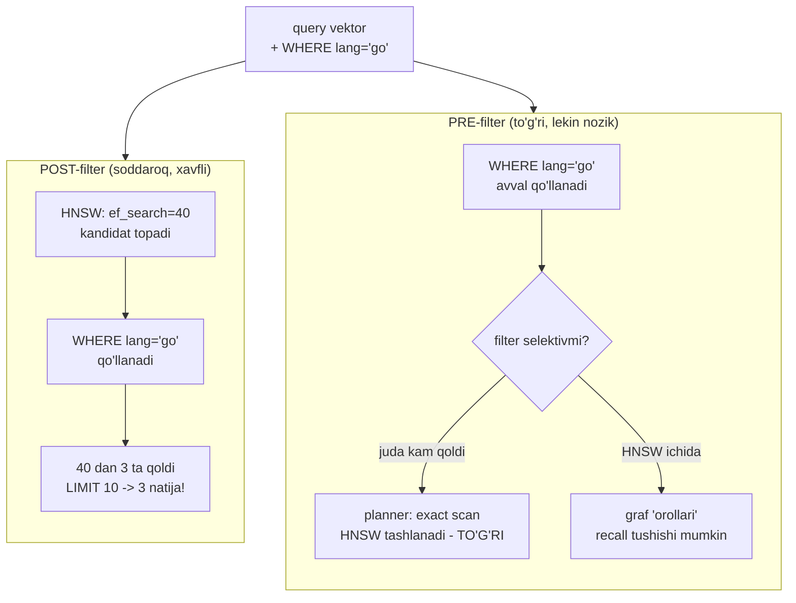
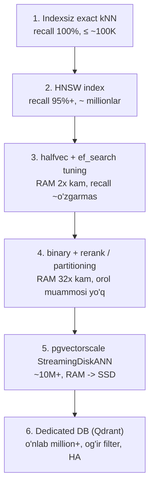

# 05. Metadata filtering va scale

Production'da "eng o'xshash 10 ta chunk" degan sof so'rov deyarli uchramaydi. Real so'rov har doim `WHERE` bilan keladi: `tenant_id = $1`, `lang = 'go'`, `updated_at > now() - interval '30 days'`, `status = 'published'`. Ana shu bir dona `WHERE` filtered vector search'ning eng ko'p uchraydigan production bug'ini ochadi — "filter qo'shdim, `LIMIT 10` so'radim, 3 natija keldi". Bu darsdan keyin nega bunday bo'lishini, `pgvector` va Qdrant buni qanday yechishini, va korpusing 100K'dan 100M'gacha o'sganda qaysi eskalatsiya qadamini bosishni bilasan — bu ish suhbatining "qachon pgvector'dan chiqasan" savolining aynan javobi.

---

## Nazariya (~30%)

### 1. Filter dilemmasi — pre vs post

02-darsda HNSW indexini `ef_search=40` bilan sozlagansan: index avval **40 ta kandidat** topadi, keyin ular orasidan `ORDER BY ... LIMIT k` bilan eng yaqinini beradi. Endi shu tasvirga `WHERE lang = 'go'` qo'shamiz. Savol — filter **qachon** qo'llanadi, qidiruvdan **oldin**mi yoki **keyin**mi? Bu ikki javobning har biri o'z zaifligi bilan keladi.

| | Post-filter | Pre-filter |
|---|---|---|
| Tartib | avval ANN top-m, keyin `WHERE` | avval `WHERE`, keyin qidiruv |
| Muammo | filter selektiv bo'lsa m'dan kam (yoki 0) natija — **false negative** | (a) juda selektiv bo'lsa planner index'ni tashlaydi; (b) HNSW grafida "orollar" |
| Kim | `pgvector`'ning tarixiy default xulqi | mantiqan to'g'ri, lekin graf uzilishi xavfi |

Post-filter tuzog'i sof arifmetika: `ef_search=40` kandidat topilsa va korpusning atigi 2% i `lang='go'` bo'lsa, o'rtacha 40 × 0.02 ≈ 0.8 ta kandidat filterdan o'tadi. Sen `LIMIT 10` so'raysan, index 3 ta qaytaradi — qolgan 7 tasi grafda bor edi, lekin `ef_search` oynasiga tushmadi. Hech qanday exception yo'q, `grep`'da ko'rinmaydi — bu **jimgina recall yo'qolishi** (2-bo'limdagi model-mismatch bilan bir tabiatli xato).

Pre-filter esa boshqa yara: filter 90%+ qatorni yo'q qilsa, HNSW grafida qolgan node'lar bir-biridan uzilib **disconnected islands** hosil qiladi — graf bo'ylab yurish (traversal) shu orollar orasida sakraya olmaydi va recall keskin tushadi.



### 2. pgvector yechimi — iterative index scans (0.8.0+)

Kitoblar (2024) bu muammoni "pre/post trade-off bor" deb qoldiradi. `pgvector` 0.8.0 amaliy yechim qo'shdi: **iterative index scans** — natija `LIMIT`'ga yetmasa, index skanni to'xtatmasdan **davom ettiradi**, yana kandidat oladi va filterdan o'tkazadi.

```sql
SET hnsw.iterative_scan = relaxed_order;   -- yoki strict_order; default off
SET hnsw.max_scan_tuples = 20000;          -- himoya limiti (default 20000)
```

Ikki rejim farqi muhim:

- **`strict_order`** — natijalar masofa bo'yicha qat'iy tartiblangan qaytadi, lekin kamroq kandidat ko'radi (biroz sekinroq, recall pastroq).
- **`relaxed_order`** — masofa tartibi biroz buzilishi mumkin, lekin ko'proq kandidat ko'radi (recall yaxshiroq). Aniq tartib kerak bo'lsa, tashqarida materialized CTE bilan qayta `ORDER BY` qilasan.

`max_scan_tuples` — himoya tormozi: filter deyarli hech narsani qoldirmasa, skan cheksiz cho'zilmasin (default 20000 tuple). IVFFlat'da ekvivalenti `ivfflat.iterative_scan = relaxed_order` + `ivfflat.max_probes` (IVFFlat'da `strict_order` yo'q).

### 3. Qdrant yechimi — filterable HNSW

03-darsda Qdrant'ni "qachon pgvector yetmay qoladi" konteksti bilan ko'rgansan. Filtered search aynan shu chegara signallaridan biri. Qdrant grafni **payload'lardan xabardor** holda quradi (**filterable HNSW**): filter shartlari graf tuzilishiga to'qib qo'yiladi, shuning uchun filtrli qidiruv graf ichida, orol muammosisiz amalga oshadi. Benchmark farqi shu yerdan: 500K vektor + 3 payload shart bilan Qdrant ~6ms, `pgvector` ~29ms. Bu — "og'ir filtered search" Qdrant tanlashning asosiy texnik sababi, marketing emas.

> Oltin qoida: `pgvector`'da filtrli har vector query'ni HAR DOIM `iterative_scan` bilan sina va `EXPLAIN ANALYZE` bilan planner qaysi yo'lni tanlaganini tekshir. Natija soni jim kamaysa — bu bug, exception emas.

---

## Amaliyot (~70%)

01-04 darslardagi `chunks` jadvaliga metadata ustunlarini qo'shamiz — filtered search shu ustunlar ustida ishlaydi:

```sql
-- chunks jadvaliga metadata (filter maydonlari)
ALTER TABLE chunks ADD COLUMN tenant_id int         NOT NULL DEFAULT 1;
ALTER TABLE chunks ADD COLUMN lang      text        NOT NULL DEFAULT 'en';
ALTER TABLE chunks ADD COLUMN status    text        NOT NULL DEFAULT 'published';
ALTER TABLE chunks ADD COLUMN updated_at timestamptz NOT NULL DEFAULT now();

-- filter ustunlariga oddiy B-tree (metadata index)
CREATE INDEX ON chunks (tenant_id);
CREATE INDEX ON chunks (lang);

-- vector index (cosine); voyage-4 normalizatsiyalangan -> <#> ham bir xil ranking, arzonroq
CREATE INDEX ON chunks USING hnsw (embedding vector_cosine_ops) WITH (m = 16, ef_construction = 64);
```

Faraz qilaylik korpusda 25600 chunk bor, ulardan atigi ~2% (`~512 ta`) `lang = 'go'`. Query vektorini SQL misollarida qisqalik uchun `'[...]'::vector` deb belgilaymiz (aslida bu `voyage-4` bilan `input_type="query"` embed qilingan 1024 o'lchamli vektor).

### Predict / Run

#### 1-mashq: post-filter qisqarishi va uni yamash

> **Ishga tushirishdan oldin bashorat qil:** `ef_search=40`, korpusda `lang='go'` chunklar 2%. Quyidagi so'rov `LIMIT 10` so'raydi — nechta qator qaytaradi, va nega? `Rows Removed by Filter` taxminan qancha bo'ladi?

```sql
SET hnsw.ef_search = 40;   -- default

EXPLAIN ANALYZE
SELECT id, file, embedding <=> '[...]'::vector AS distance
FROM chunks
WHERE lang = 'go'
ORDER BY embedding <=> '[...]'::vector
LIMIT 10;
```

```text
# Output (iterative_scan OFF — default):
 Limit  (actual rows=3 loops=1)
   ->  Index Scan using chunks_embedding_idx on chunks  (actual rows=3 loops=1)
         Order By: (embedding <=> '[...]'::vector)
         Filter: (lang = 'go')
         Rows Removed by Filter: 37
 Planning Time: 0.28 ms
 Execution Time: 1.41 ms
```

Mana o'sha bug: 10 so'radik, 3 keldi. Index 40 kandidat ko'rdi (`ef_search`), 37 tasini filter tashladi, 3 tasi o'tdi va shu bilan tugadi. Endi iterative scan yoqamiz:

```sql
SET hnsw.iterative_scan = relaxed_order;   -- yetmasa skanni davom ettir
SET hnsw.max_scan_tuples = 20000;

EXPLAIN ANALYZE
SELECT id, file, embedding <=> '[...]'::vector AS distance
FROM chunks
WHERE lang = 'go'
ORDER BY embedding <=> '[...]'::vector
LIMIT 10;
```

```text
# Output (iterative_scan = relaxed_order):
 Limit  (actual rows=10 loops=1)
   ->  Index Scan using chunks_embedding_idx on chunks  (actual rows=10 loops=1)
         Order By: (embedding <=> '[...]'::vector)
         Filter: (lang = 'go')
         Rows Removed by Filter: 498
 Planning Time: 0.29 ms
 Execution Time: 4.06 ms
```

Endi 10 ta to'liq natija — lekin narxi ko'rinib turibdi: `Rows Removed by Filter` 37 dan 498 ga chiqdi, `Execution Time` 3x oshdi. Iterative scan tekin emas — u shunchaki "yetarli kandidat topguncha qidir" degani. Selektiv filtrda bu adolatli narx; filter deyarli hech narsani qoldirmasa `max_scan_tuples`'ga urilib to'xtaydi.

`relaxed_order` va `strict_order` farqi natijaning **tartibida** ko'rinadi. Bir xil query'ni ikkalasi bilan ishga tushirib, `distance` ustuniga qara:

```text
# relaxed_order: ko'proq kandidat, lekin masofa qat'iy o'smaydi (0.19 dan keyin 0.17!)
 file                    | distance
-------------------------+----------
 go/06-context.md        |   0.188
 go/03-channels.md       |   0.194
 go/08-worker-pool.md    |   0.173   <- tartib buzilgan, lekin recall to'liq
 ...

# strict_order: masofa qat'iy o'sadi, lekin kamroq ko'rilgani uchun ba'zi yaqin natija tushib qolishi mumkin
 file                    | distance
-------------------------+----------
 go/06-context.md        |   0.188
 go/03-channels.md       |   0.194
 go/11-select.md         |   0.201
 ...
```

Amaliy tanlov: recall birinchi o'rinda bo'lsa `relaxed_order` (ko'p RAG holati), keyin natijani ilovada qayta `ORDER BY distance` qil. Qat'iy monotonik masofa kerak bo'lsa (masalan threshold cutoff) — `strict_order`.

#### 2-mashq: planner index'ni tashlaydi — va bu TO'G'RI

Endi juda selektiv filter: bitta kichik tenant, jami 50 ta chunk.

> **Bashorat qil:** `tenant_id = 42` da atigi 50 qator bor. Postgres HNSW indexdan foydalanadimi? EXPLAIN qanday node'larni ko'rsatadi?

```sql
EXPLAIN ANALYZE
SELECT id, file, embedding <=> '[...]'::vector AS distance
FROM chunks
WHERE tenant_id = 42
ORDER BY embedding <=> '[...]'::vector
LIMIT 5;
```

```text
# Output:
 Limit  (actual rows=5 loops=1)
   ->  Sort  (actual rows=5 loops=1)
         Sort Key: ((embedding <=> '[...]'::vector))
         Sort Method: top-N heapsort  Memory: 27kB
         ->  Bitmap Heap Scan on chunks  (actual rows=50 loops=1)
               Recheck Cond: (tenant_id = 42)
               ->  Bitmap Index Scan on chunks_tenant_id_idx  (actual rows=50 loops=1)
                     Index Cond: (tenant_id = 42)
 Planning Time: 0.19 ms
 Execution Time: 0.61 ms
```

HNSW umuman ishlatilmadi. Planner B-tree bilan 50 qatorni oldi, keyin ularni `top-N heapsort` bilan aniq tartibladi. Bu **bug emas — optimal qaror**: 50 qatorda exact kNN ham HNSW'dan tez, ham recall 100%. Bu 01-darsdagi "avval indexsiz o'lchang" xulosasining planner darajasidagi ko'rinishi. Planner bilan urishma — kichik natija to'plamida exact yutadi, buni u o'zi biladi.

#### 3-mashq: multitenancy — partitioning bilan orolni yo'q qilish

Selektiv `WHERE tenant_id = ...` filtri har query'da takrorlansa, uni index darajasiga ko'tarish mantiqiyroq. Postgres declarative partitioning: har tenant o'z partitsiyasi va o'z **kichik** HNSW grafini oladi — filter endi partition pruning bilan hal bo'ladi, graf orollari muammosi umuman tug'ilmaydi.

```sql
CREATE TABLE chunks (
    id         bigserial,
    tenant_id  int NOT NULL,
    file       text,
    content    text,
    embedding  vector(1024),
    PRIMARY KEY (id, tenant_id)
) PARTITION BY LIST (tenant_id);

-- katta tenant'lar o'z partitsiyasini oladi, qolganlar default'ga
CREATE TABLE chunks_acme   PARTITION OF chunks FOR VALUES IN (1);
CREATE TABLE chunks_globex PARTITION OF chunks FOR VALUES IN (2);
CREATE TABLE chunks_rest   PARTITION OF chunks DEFAULT;

-- HAR partitsiya o'z HNSW indexini oladi: kichik graf = tez build, orol muammosi yo'q
CREATE INDEX ON chunks_acme   USING hnsw (embedding vector_cosine_ops);
CREATE INDEX ON chunks_globex USING hnsw (embedding vector_cosine_ops);
CREATE INDEX ON chunks_rest   USING hnsw (embedding vector_cosine_ops);
```

Endi `WHERE tenant_id = 1 ORDER BY embedding <=> $1` faqat `chunks_acme` partitsiyasining kichik grafini skanlaydi (partition pruning) — filter allaqachon "bepul" qo'llangan. Qdrant'dagi ekvivalenti: **bitta collection + payload `group_id` filter** (rasmiy multitenancy tavsiyasi). Har tenant uchun alohida collection ochish — **anti-pattern**: minglab collection minglab HNSW grafi = RAM overhead portlaydi.

#### 4-mashq: partial index — issiq filter uchun

Partitioning butun jadval strukturasini o'zgartiradi. Agar filter bitta issiq shart bo'lsa (`status = 'published'` har query'da bor, korpusning ~20% i) — yengilroq quroling **partial index**. B-tree'dagi partial index'ni bilasan (`WHERE`li index); pgvector'da HNSW ham partial bo'la oladi: graf faqat filtered qatorlar ustida quriladi.

> **Bashorat qil:** `status = 'published'` bo'yicha partial HNSW qursak, `WHERE status = 'published' ORDER BY embedding <=> $1` so'rovi to'liq HNSW'dagi post-filter orol muammosiga uchraydimi? Nega yo'q?

```sql
-- partial HNSW: graf faqat published qatorlar ustida (kichikroq, filter "ichkarida")
CREATE INDEX chunks_pub_idx ON chunks
    USING hnsw (embedding vector_cosine_ops)
    WHERE status = 'published';

EXPLAIN ANALYZE
SELECT id, file, embedding <=> '[...]'::vector AS distance
FROM chunks
WHERE status = 'published'
ORDER BY embedding <=> '[...]'::vector
LIMIT 10;
```

```text
# Output:
 Limit  (actual rows=10 loops=1)
   ->  Index Scan using chunks_pub_idx on chunks  (actual rows=10 loops=1)
         Order By: (embedding <=> '[...]'::vector)
 Planning Time: 0.22 ms
 Execution Time: 1.05 ms
```

`Rows Removed by Filter` umuman yo'q — graf allaqachon faqat `published` qatorlardan tuzilgan, shuning uchun post-filter dilemmasi tug'ilmaydi va iterative scan kerak emas. Narxi: har issiq filter qiymati uchun bitta partial index. Bu **past kardinallikli, tez-tez ishlatiladigan** filter uchun (bir necha status, tur). `tenant_id` kabi yuqori kardinallikli filterga partial index yaramaydi — u yerda partitioning yoki iterative scan.

### Investigate / Modify

Yuqoridagi so'rovlarni ushbu o'zgartirishlar bilan qayta o'yna:

- 1-mashqda `hnsw.iterative_scan = strict_order` qo'y — natija tartibi va `Execution Time` `relaxed_order`'dan qanday farq qiladi?
- `ef_search` ni 40 dan 200 ga oshir (iterative scan'siz). Endi filter'dan yetarli kandidat o'tadimi? Bu iterative scan'ga muqobil yechimmi — qanday narx bilan?
- 2-mashqda `tenant_id = 42` o'rniga korpusning yarmini qamraydigan `lang = 'en'` qo'y. Planner endi HNSW'ni tanlaydimi yoki seq scan'ni? Nega selektivlik chegarasi qarorni o'zgartiradi?

### Scale — xotira aynan qancha?

Filter muammosini yechding, endi ikkinchi devor: **RAM**. HNSW grafi tez ishlashi uchun RAM (yoki OS cache)'ga sig'ishi kerak. "Nechta vektor ko'p?" savolining javobi bitta formulada — buni skript qilib qo'yamiz:

```python
# ram_estimate.py — index xotira hisob-kitobi (n x dim x bayt)
DIM = 1024

def storage_bytes(n: int, dim: int, kind: str) -> int:
    per_vec = {"float32": dim * 4, "halfvec": dim * 2, "binary": dim // 8}[kind]
    return n * (per_vec + 8)              # +8 bayt qator overhead (pgvector)

def hnsw_graph_bytes(n: int, m: int = 16) -> int:
    return n * (2 * m) * 8                # layer 0 da ~2*m qo'shni, har biri ~8 bayt (taxmin)

for n in (100_000, 1_000_000, 10_000_000):
    raw = storage_bytes(n, DIM, "float32")
    graph = hnsw_graph_bytes(n)
    half = storage_bytes(n, DIM, "halfvec")
    binr = storage_bytes(n, DIM, "binary")
    print(f"{n:>11,} vektor: float32 {raw/1e9:5.2f} GB + graf {graph/1e9:4.2f} GB "
          f"= {(raw+graph)/1e9:5.2f} GB")
    print(f"{'':>11}  halfvec {half/1e9:5.2f} GB | binary {binr/1e6:6.0f} MB "
          f"(+ rerank uchun asl vektor qoladi)")
```

```text
# Output:
    100,000 vektor: float32  0.41 GB + graf 0.03 GB =  0.44 GB
               halfvec  0.21 GB | binary     14 MB (+ rerank uchun asl vektor qoladi)
  1,000,000 vektor: float32  4.10 GB + graf 0.26 GB =  4.36 GB
               halfvec  2.06 GB | binary    136 MB (+ rerank uchun asl vektor qoladi)
 10,000,000 vektor: float32 41.04 GB + graf 2.56 GB = 43.60 GB
               halfvec 20.56 GB | binary   1360 MB (+ rerank uchun asl vektor qoladi)
```

10M vektor float32 HNSW ~44 GB RAM — mana bu yerda HNSW devorga uriladi. Ikki arzon g'alaba bor:

- **halfvec (float16):** `embedding::halfvec(1024)` — storage 2x kam, recall deyarli o'zgarmaydi. Expression index:
  ```sql
  CREATE INDEX ON chunks USING hnsw ((embedding::halfvec(1024)) halfvec_cosine_ops);
  ```
- **binary quantization:** 32x siqish, lekin faqat birinchi bosqich sifatida — aniqlik **rerank** bilan qaytariladi.

#### binary + rerank pattern (pgvector README)

```sql
-- binary index (32x kichik) — arzon birinchi bosqich
CREATE INDEX ON chunks USING hnsw ((binary_quantize(embedding)::bit(1024)) bit_hamming_ops);

-- ikki bosqich: binary bilan arzon top-20, keyin to'liq vektor bilan aniq top-5
WITH candidates AS (
    SELECT id, file, embedding
    FROM chunks
    ORDER BY binary_quantize(embedding)::bit(1024) <~> binary_quantize($1)::bit(1024)
    LIMIT 20
)
SELECT id, file, embedding <=> $1 AS distance
FROM candidates
ORDER BY distance
LIMIT 5;
```

Ichki so'rov butun korpus bo'yicha arzon Hamming masofasi (`<~>`) bilan 20 nomzodni ajratadi (RAM-yengil binary index), tashqi so'rov shu 20 tasini to'liq `float32` vektor bilan qayta tartiblaydi (aniq). Muhim tuzoq: rerank uchun **asl vektor jadvalda qolishi shart** — binary faqat index RAM'ini tejaydi, jadval storage'ini emas.

#### Build vaqti — maintenance_work_mem devori

Xotira nafaqat query, balki **index qurish** paytida ham chegara. HNSW grafi `maintenance_work_mem`'ga sig'masa, build diskga tushadi va soatlab cho'ziladi (research pitfall #7 — o'quvchiga tanish parametr, endi vector kontekstida). Katta jadvalda build oldidan:

```sql
SET maintenance_work_mem = '2GB';   -- graf RAM'da qurilsin, diskga tushmasin
SET max_parallel_maintenance_workers = 4;   -- 0.8.x parallel HNSW build (30-50% tezroq)

CREATE INDEX CONCURRENTLY ON chunks USING hnsw (embedding vector_cosine_ops);
```

`CONCURRENTLY` — jadvalni qulflab qo'ymaydi (production'da tirik trafik ustida build qilish uchun), lekin sekinroq. Parametrlar sessiya darajasida: build tugagach default'ga qaytadi.

### Make — "qaysi bosqichdaman" hisoboti

Ushbu skriptni yozib tugat: u DB'ga ulanadi, korpus hajmini va index turini aniqlaydi, taxminiy RAM'ni hisoblaydi va keyingi eskalatsiya qadamini tavsiya qiladi.

```python
# stage_report.py — korpusim qaysi eskalatsiya bosqichida?
import os
import psycopg
from pgvector.psycopg import register_vector

DIM = 1024

def report(conn) -> None:
    with conn.cursor() as cur:
        cur.execute("SELECT count(*) FROM chunks")
        n = cur.fetchone()[0]
        cur.execute("""
            SELECT indexdef FROM pg_indexes
            WHERE tablename = 'chunks'
              AND (indexdef LIKE '%USING hnsw%' OR indexdef LIKE '%USING ivfflat%')
        """)
        idx = [r[0] for r in cur.fetchall()]

    raw_gb = n * (DIM * 4 + 8) / 1e9
    has_ann = len(idx) > 0
    ann = "bor" if has_ann else "yo'q"
    print(f"chunks: {n:,} | float32 RAM ~ {raw_gb:.2f} GB | ANN index: {ann}")

    if n < 100_000 and not has_ann:
        print("bosqich 1: indexsiz exact yetarli. Latency o'lchagin, index shoshilma.")
    elif not has_ann:
        print("bosqich 2: HNSW index qo'sh (seq scan endi sekin bo'ladi).")
    elif raw_gb < 8:
        print("bosqich 3: HNSW yetadi. RAM siqilsa halfvec cast'ni sina.")
    elif raw_gb < 40:
        print("bosqich 4: halfvec + binary rerank yoki tenant partitioning haqida o'yla.")
    else:
        print("bosqich 5+: pgvectorscale (disk ANN) yoki Qdrant migratsiyasi vaqti keldi.")

with psycopg.connect(os.environ["DATABASE_URL"], autocommit=True) as conn:
    register_vector(conn)
    report(conn)
```

```text
# Output (semsearch korpusi pgvector'ga ko'chirilgandan keyin):
$ python stage_report.py
chunks: 318 | float32 RAM ~ 0.00 GB | ANN index: yo'q
bosqich 1: indexsiz exact yetarli. Latency o'lchagin, index shoshilma.
```

Sinov: korpusni sun'iy kattalashtir (`INSERT INTO chunks SELECT ... FROM generate_series`), HNSW qo'sh, skriptni qayta ishga tushir — hisobot bosqichni to'g'ri o'zgartiryaptimi?

---

## Eskalatsiya zinapoyasi

Butun bo'limning yakuniy xaritasi. Har bosqich oldingisi yetmay qolganda keladi — oldindan sakrama, bu **premature optimization**.



| Bosqich | Texnika | Miqyos | RAM ta'siri | Recall |
|---|---|---|---|---|
| 1 | Indexsiz exact kNN | ≤ ~100K | faqat data | 100% |
| 2 | HNSW | ~ millionlar | data + graf | 95%+ |
| 3 | halfvec + `ef_search` tuning | bir necha million | 2x kam | ~o'zgarmas |
| 4 | binary + rerank / partitioning | ~10M gacha | 32x kam (asl vektor qoladi) | rerank tiklaydi |
| 5 | pgvectorscale (StreamingDiskANN) | ~10M+ | RAM → SSD | 99% @ tuned |
| 6 | Qdrant (dedicated) | o'nlab million+, og'ir filter | shard/replica | filterable HNSW |

5-bosqich (pgvectorscale, Timescale extension) HNSW'ni disk-based **StreamingDiskANN** bilan almashtiradi: 50M vektorda ~470 QPS @ 99% recall, RAM o'rniga SSD. 6-bosqich — 03-darsdagi Qdrant signallari. Ko'pchilik loyiha 2-3 bosqichda umrbod qoladi.

> Huyen (Ch6) ogohlantirishi kuchda: vector DB xarajati model API xarajatining **1/5–1/2** qismigacha yetishi mumkin. halfvec/binary/partitioning estetika emas — bu to'g'ridan-to'g'ri pul masalasi.

---

## Ko'p uchraydigan xatolar

- **Filter qo'shgach natija soni kamayganini payqamaslik.** `iterative_scan` yoqilmagan holda `WHERE` + `LIMIT` jimgina kam natija beradi. Har filtrli query'ni EXPLAIN bilan tekshir, `actual rows` ni `LIMIT` bilan solishtir.
- **Selektiv filtrda planner index tashlaganini "bug" deyish.** Kichik natija to'plamida exact scan tez va aniq — bu to'g'ri qaror, majburan HNSW'ga o'tkazma.
- **binary_quantize'ni rerank'siz ishlatish.** Faqat binary bilan qidirsang aniqlik tushadi; ichki binary top-N + tashqi to'liq vektor rerank majburiy.
- **halfvec/binary'da asl vektorni o'chirib yuborish.** Rerank uchun `float32` ustun jadvalda qolishi shart, aks holda aniqlikni tiklab bo'lmaydi.
- **Har tenant uchun alohida Qdrant collection.** Minglab kichik collection = minglab HNSW grafi = RAM overhead. Bitta collection + payload filter to'g'ri yo'l.
- **Oldindan pgvectorscale/Qdrant'ga sakrash.** 100K vektorda dedicated DB — bekorga qo'shilgan operatsion yuk (monitoring, backup, upgrade). Avval o'lcha.

---

## Retrieval practice

1. "Filter qo'shdim, `LIMIT 10` so'radim, 3 natija keldi." `ef_search` va filter selektivligi bu sonni qanday belgilaydi? Iterative scan'siz muammoni yana qanday (vaqtinchalik) yumshatish mumkin va uning narxi nima?
2. Juda selektiv filtrda Postgres planner HNSW indexni tashlab `Bitmap Index Scan` + `Sort` tanladi. Bu bug'mi? Nega ha yoki yo'q — recall va latency nuqtai nazaridan javob ber.
3. `hnsw.iterative_scan` da `relaxed_order` va `strict_order` farqi nima? Qaysi birini tanlaganingda natijani tashqarida qayta `ORDER BY` qilishing kerak bo'ladi va nega?
4. 5M × 1024 `float32` HNSW indexi taxminan qancha RAM yeydi? Uni ~2x va ~32x kamaytirishning ikki yo'lini ayt, har birining narxini (recall / rerank / storage) tushuntir.
5. `status = 'published'` (past kardinallik, issiq filter) uchun partial HNSW index qo'yding — nega bunda post-filter orol muammosi umuman tug'ilmaydi? Xuddi shu yondashuvni nega `tenant_id`ga (yuqori kardinallik) qo'llab bo'lmaydi?
6. Multitenancy: qaysi holatda pgvector partitioning, qaysi holatda Qdrant "bitta collection + payload filter"? Minglab kichik partition yoki collection nega yomon?
7. Qdrant filtrli benchmark'da pgvector'dan sezilarli tez (6ms vs 29ms). Qanday mexanizm buni ta'minlaydi, va nega bu tezlik "boshidanoq Qdrant" degani emas?

---

## Manbalar

- Chip Huyen, *AI Engineering* (O'Reilly, 2025) — Ch 6: retrieval algoritmlari, vector DB xarajati model API'ning 1/5–1/2 qismigacha, tanlash mezonlari (p.276–298).
- Iusztin & Labonne, *LLM Engineer's Handbook* (Packt, 2024) — Ch 4: pre/post metadata filtering, alohida metadata index, filtered vs hybrid search.
- pgvector README (0.8.5) — iterative scans, halfvec, binary quantization + rerank: `https://github.com/pgvector/pgvector`
- pgvector 0.8.0 relizi (iterative index scans): `https://www.postgresql.org/about/news/pgvector-080-released-2952/`
- "The Achilles heel of vector search: filters" (pre/post-filtering): `https://yudhiesh.github.io/2025/05/09/the-achilles-heel-of-vector-search-filters/`
- ParadeDB — pgvector tuning (ef_search, maintenance_work_mem): `https://www.paradedb.com/learn/postgresql/tuning-pgvector`
- pgvectorscale (StreamingDiskANN, disk-based ANN): `https://github.com/timescale/pgvectorscale`
- Qdrant — filtering va payload index: `https://qdrant.tech/documentation/search/filtering/`
