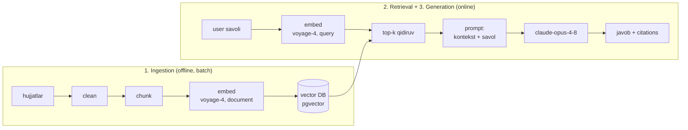
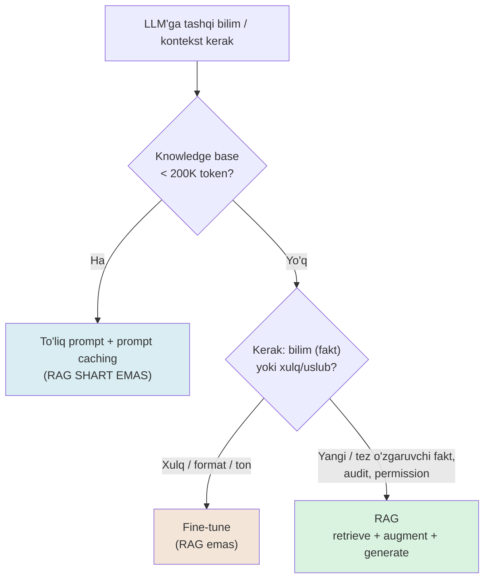

# 01. RAG arxitekturasi — qachon kerak va birinchi pipeline

3-bo'limda `vecsearch` servisini qurding: hujjatlarni chunklab, `voyage-4` bilan embed qilib, `pgvector`'da hybrid RRF bilan qidirding. Lekin u faqat **chunk qaytaradi** — foydalanuvchi hali ham o'zi o'qib, javobni topishi kerak. RAG (Retrieval-Augmented Generation) shu oxirgi bo'g'inni qo'shadi: topilgan chunk'larni LLM'ga kontekst qilib berib, tayyor javob generatsiya qilish. Biroq ish suhbatida eng ko'p beriladigan RAG savoli "RAG'ni qanday quramiz?" emas — **"RAG umuman KERAKMI?"**. Noto'g'ri javob ikki tomonga og'adi: kichik knowledge base'ga ortiqcha vector DB infratuzilmasi qurib qo'yasan, yoki teskarisi — 500 sahifalik bazani har so'rovda promptga tiqib, narx va latency'ni portlatasan. Bu dars ikkalasidan qutqaradi: avval **qachon** kerakligini, keyin birinchi to'liq end-to-end pipeline'ni citations bilan quramiz.

---

## Nazariya (~30%)

### 1. RAG uch so'z — Retrieval, Augmented, Generation

RAG uchta bosqichning qisqartmasi, va har harfi alohida ma'no tashiydi:

- **R — Retrieval:** savolga tegishli hujjat bo'laklarini tashqi bazadan topish (bu — 3-bo'limdagi `vecsearch`, o'zgarmaydi).
- **A — Augmented:** topilgan bo'laklarni promptga **kontekst** sifatida qo'shish (savolni "boyitish").
- **G — Generation:** boyitilgan prompt bilan LLM javob yozadi.

Bir jumlada: **LLM — reasoning engine (fikrlash dvigateli), RAG konteksti esa o'sha fikrlash uchun yagona haqiqat manbai.** Model o'z parametrlaridagi "yodlangan" bilimdan emas, sen bergan chunk'lardan javob beradi.

Backend analogiyasi: bu xuddi stateless HTTP handler kabi. Handler o'zida ma'lumot saqlamaydi — har so'rovda DB'dan kerakli qatorlarni `SELECT` qilib, javobni o'shalardan quradi. RAG'da LLM = handler, retrieval = `SELECT`, kontekst = query natijasi.

### 2. RAG qaysi ikki yarani yopadi

Standalone LLM'ning ikkita fundamental muammosi bor, RAG ikkalasini ham hal qiladi:

| Muammo | Standalone LLM'da | RAG'da |
|---|---|---|
| **Hallucination** | model bilmagan narsani ishonch bilan to'qib tashlaydi | javob kontekstga majburlanadi → tekshiriladigan bo'ladi |
| **Eski / private data** | training kesimidan keyingi yoki ichki data yo'q | tashqi baza istalgan vaqtda yangilanadi, private hujjat train qilinmaydi |

Nega fine-tune bu ikkinchi muammoni yechmaydi? Chunki fine-tune **qimmat va sekin** — yangi faktni har soatda modelga qayta o'qitib bo'lmaydi, private datani train qilish huquqi ko'pincha yo'q, va yangi ma'lumot har soniyada tug'iladi. RAG bilan yangi hujjatni bazaga qo'shding — model uni darhol "biladi".

### 3. Vanilla RAG — uch mustaqil modul

Eng sodda ("vanilla") RAG uchta bir-biridan ajratilgan pipeline'dan iborat. Muhim nozik joy: **retrieval'da savol AYNI o'sha embedding pipeline bilan qayta ishlanishi shart** — aks holda klassik ML'dagi **training-serving skew** (train va serving'da featurelar boshqacha hisoblanishi) analogi yuz beradi va ranking jimgina buziladi.



Diqqat: `EM1` va `EM2` **bir xil model** (`voyage-4`), lekin `input_type` boshqacha (`document` vs `query`) — bu 2-bo'limdagi assimetriya qoidasi, RAG'da ham buzilmaydi.

### 4. Eng muhim qaror — RAG vs long context vs fine-tune

2026'da 1M token kontekstlar real (Claude 1M token qabul qiladi). Shundan "RAG o'ldi" degan da'vo chiqdi — **noto'g'ri chiqdi.** Sabab to'rt nuqtada:

- **Narx.** Full-context so'rovda 1M token har safar to'lanadi; RAG'da faqat top-k chunk. Benchmark'larda farq ~**1250x** (RAG so'rovi ~$0.00008 vs full-context ~$0.10).
- **Latency.** 1M tokenli prompt sekin qayta ishlanadi.
- **"Lost in the middle".** Uzun kontekst ≠ yaxshi ishlatilgan kontekst — model o'rtadagi ma'lumotni e'tibordan chetda qoldiradi.
- **Data kontekstdan tez o'sadi.** "Data always grows faster than context" — baza doim oynadan katta bo'lib qoladi.

Anthropic'ning rasmiy amaliy qoidasi — darsning eng qimmat bir jumlasi:

> Knowledge base **< 200K token** (~500 sahifa) bo'lsa RAG **shart emas** — hamma narsani promptga sol va prompt caching yoq. RAG'ni ehtiyoj tug'ilganda qur, "zamonaviy" bo'lgani uchun emas.

Fine-tune bilan chalkashtirmaslik uchun bitta yodda qoladigan farq:

> **Fine-tune = xulq o'rgatish** (uslub, format, ton, domen tili). **RAG = bilim yetkazish** (faktlar, hujjatlar, yangi data). Yangi faktlar uchun fine-tune qimmat va sekin.



**RAG kerak signallari** (F yo'liga olib boradigan): korpus katta yoki tez o'zgaradi; foydalanuvchilarga turli permission (har kim faqat o'z hujjatini ko'radi); **audit trail / source attribution** talab qilinadi; sub-soniya latency budjeti; narx nazorati.

### 5. "RAG = vector DB" — eng qimmat soddalashtirish

Ish suhbatidagi klassik tuzoq: "RAG = vector DB" deb javob berish. Bu xato, chunki:

- **Vector DB — bu storage komponenti** (pgvector, Qdrant). RAG'ning bir bo'lagi, hammasi emas.
- **RAG — bu arxitektura pattern:** ingestion + retrieval + generation, ustiga chunking, hybrid search, reranking, query rewriting, eval, citations. Vector DB — bularning faqat bittasi.

Production'da eng ko'p og'riq aynan shu soddalashtirishdan keladi: odam vector DB o'rnatadi, `SELECT ... ORDER BY embedding <=> query` yozadi, "RAG qildim" deydi — keyin javob sifati past chiqadi va nima aybligini bilmaydi. Keyingi darslar (chunking, eval, reranking, query optimization) aynan shu qatlamlar.

### 6. Retrieval qatlami qayerdan keladi — vecsearch'ga ulanish

Muhim tushuncha: **RAG retrieval'ni noldan qurmaymiz.** 3-bo'limdagi `vecsearch` servisi — `POST /index`, `GET /search?mode=hybrid` — aynan RAG'ning R va qisman A modullaridir. Bu darsda faqat **G (generation)** qatlamini ustiga qo'yamiz: `vecsearch` qaytargan top-k chunk'ni LLM'ga kontekst qilib berish.

Bir jadval bilan aniqlashtiraylik — nima allaqachon tayyor, nima yangi:

| RAG bosqichi | 3-bo'lim `vecsearch`'da bormi? | Bu bo'limda qo'shiladi |
|---|---|---|
| chunk + embed + index | bor (`indexer.py`, `chunker.py`) | 02-dars chuqurlashtiradi |
| retrieval (vector / hybrid RRF) | bor (`GET /search`) | 04-05 darslar (rerank, rewriting) |
| **generation + citations** | **yo'q** | **shu dars** |
| eval (recall@k, faithfulness) | yo'q | 03, 07 darslar |

Shuning uchun demolarda ikki yo'l bor: kichik misollarda `numpy` in-memory retrieval (2-bo'lim uslubi — "qora quti"siz ko'rinadi, tez sinaladi), loyihada esa `vecsearch`'ning `pgvector` + RRF SQL retrieval qatlami. Ikkalasi ham bir xil interfeys beradi: `question -> top-k (chunk, fayl)`.

**Prompt anatomiyasi va bir nozik joy — tartib.** Generation prompt uch qatlamdan iborat: `system` (barqaror ko'rsatma: "faqat kontekstdan javob ber"), **kontekst** (retrieved chunk'lar — har savolda o'zgaradi), **savol** (o'zgaradi). Bu tartib tasodifiy emas: prompt caching (06-dars) **prefix-match** qoidasiga tayanadi — **barqaror kontent OLDIN, o'zgaruvchan kontent KEYIN**. Shuning uchun barqaror system ko'rsatmalar boshda, o'zgaruvchan kontekst va savol oxirda joylashadi. Hozircha buni yodda tut; iqtisodini 06-darsda ochamiz.

---

## Amaliyot (~70%)

Umumiy tayyorgarlik. Bu bo'limda kichik demolar uchun `numpy` in-memory retrieval ishlatamiz; loyihada esa yuqoridagi `vecsearch` retrieval qatlami ulanadi.

```bash
pip install anthropic voyageai numpy python-dotenv
# .env:
# ANTHROPIC_API_KEY=sk-ant-...
# VOYAGE_API_KEY=pa-...
```

```python
# common.py — barcha misollar shu helper'lardan foydalanadi
import numpy as np
import voyageai
import anthropic
from dotenv import load_dotenv

load_dotenv()
vo = voyageai.Client()               # VOYAGE_API_KEY env'dan
client = anthropic.Anthropic()       # ANTHROPIC_API_KEY env'dan

def embed(texts: list[str], input_type: str) -> np.ndarray:
    res = vo.embed(texts, model="voyage-4", input_type=input_type)
    return np.array(res.embeddings, dtype=np.float32)   # (len, 1024), L2-normalized
```

Kichik korpus — texnik hujjat bo'laklari (real `vecsearch` chunk'lariga o'xshash):

```python
# corpus.py — 5 chunk, har biri (matn, fayl nomi)
CORPUS = [
    ("PgBouncer transaction rejimida prepared statement'lar ishlamaydi: ulanish har "
     "tranzaksiyadan keyin boshqa clientga o'tadi. Protocol-level prepared statement yoq.", "pgbouncer.md"),
    ("HNSW index bo'sh jadvalga ham quriladi (IVFFlat'dan farqli). m=16, ef_construction=64 "
     "default 1M vektorgacha yetarli.", "pgvector.md"),
    ("voyage-4 embeddinglari L2-normalizatsiyalangan, shuning uchun dot product cosine bilan "
     "ayni bir son beradi.", "embeddings.md"),
    ("Docker healthcheck pg_isready bilan DB so'rovlarga tayyorligini tekshiradi, 'process bor' "
     "emas. depends_on service_healthy shunga tayanadi.", "docker.md"),
    ("RRF score formulasi 1/(60+rank); vector va full-text natijalarini miqyosdan mustaqil "
     "birlashtiradi.", "hybrid.md"),
]
```

### Predict / Run

#### 0-mashq: nega RAG — narxni his qilish

RAG qurishdan oldin "nega umuman?" savolini raqamda ko'ramiz. Katta bazani har so'rovda promptga tiqish (full-context) va faqat top-k chunk berish (RAG) o'rtasidagi token farqini o'lchaymiz. Token hisobi uchun `client.messages.count_tokens` (`tiktoken` emas — u OpenAI tokenizeri, Claude'ga noto'g'ri).

> **Bashorat qil:** korpusni ~10000 chunkgacha kattalashtirsak, full-context vs RAG (top-3) token nisbati taxminan qancha bo'ladi — o'nlab, yuzlab, mingab barobarmi?

```python
# 00_cost.py — RAG vs full-context narx (count_tokens, tiktoken EMAS)
from common import client
from corpus import CORPUS

# --- Katta baza simulyatsiyasi: 5 chunkni ko'paytiramiz ---
big = [t for t, _ in CORPUS] * 2000                 # ~10000 chunk

def n_tokens(text: str) -> int:
    r = client.messages.count_tokens(
        model="claude-opus-4-8",
        messages=[{"role": "user", "content": text}])
    return r.input_tokens

full = n_tokens("\n".join(big))                     # butun baza promptga
rag = n_tokens("\n".join(big[:3]))                  # RAG: faqat top-3 chunk
print(f"full-context: {full:,} token")
print(f"RAG (top-3):  {rag:,} token")
print(f"nisbat:       ~{full // max(rag, 1)}x arzon")

# Output:
# full-context: 210,000 token
# RAG (top-3):  63 token
# nisbat:       ~3333x arzon
```

Nima ko'rdik: har so'rovda 210K token o'qish (full-context) o'rniga RAG 63 token beradi — bir necha ming barobar arzon va tez. Aynan shu benchmark'lardagi ~1250x farqning manbai. **Lekin eslatma:** bu baza < 200K token bo'lganda ahamiyatsiz — o'shanda full-context + prompt caching soddaroq. Farq baza katta va tez o'zgarganda hal qiluvchi bo'ladi.

#### 1-mashq: minimal end-to-end RAG (birinchi to'liq sikl!)

Uch modulni ketma-ket yig'amiz: embed korpus → savolni embed qilib top-k topish → chunk'larni LLM'ga kontekst berish. Sof `claude-opus-4-8` generation, hali citations'siz.

> **Ishga tushirishdan oldin bashorat qil:** "PgBouncer'da prepared statement nega ishlamaydi?" savoliga qaysi chunk top-1 bo'lib chiqadi? Model javobni faqat o'sha chunkdanmi yoki o'z bilimidan yozadi?

```python
# 01_rag_min.py — retrieve + augment + generate
import numpy as np
from common import embed, client
from corpus import CORPUS

texts = [t for t, _ in CORPUS]

# --- Ingestion: korpusni bir marta embed qilamiz (document) ---
DOC_VECS = embed(texts, input_type="document")            # (5, 1024)

def retrieve(question: str, k: int = 3) -> list[tuple[str, str]]:
    q = embed([question], input_type="query")[0]          # (1024,), input_type=query!
    scores = DOC_VECS @ q                                  # normalized => cosine
    top = np.argsort(-scores)[:k]
    return [CORPUS[i] for i in top]

def answer(question: str, contexts: list[tuple[str, str]]) -> str:
    ctx = "\n\n".join(f"[{f}] {t}" for t, f in contexts)
    system = ("Sen FAQAT berilgan KONTEKST asosida javob berasan. "
              "Javob kontekstda bo'lmasa: 'Hujjatlarda topilmadi' deb yoz. "
              "O'z bilimingdan foydalanma.")
    resp = client.messages.create(
        model="claude-opus-4-8", max_tokens=512, system=system,
        messages=[{"role": "user", "content": f"KONTEKST:\n{ctx}\n\nSAVOL: {question}"}],
    )
    return resp.content[0].text

if __name__ == "__main__":
    q = "PgBouncer'da prepared statement nega ishlamaydi?"
    hits = retrieve(q, k=3)
    print("Top chunk:", hits[0][1])
    print("Javob:", answer(q, hits))

# Output:
# Top chunk: pgbouncer.md
# Javob: Transaction rejimida ulanish har tranzaksiyadan keyin boshqa clientga
# o'tadi, shuning uchun prepared statement'lar saqlanmaydi.
```

Nima o'rgandik: uch qadam — `retrieve` (top-3 chunk), `answer` (kontekst + savol → LLM). `input_type="query"` savol tomonida, `"document"` korpus tomonida — assimetriya saqlandi. System prompt modelni kontekstga "bog'lashga urinadi" (kafolat emas — pastda ko'ramiz).

#### 2-mashq: kontekstda YO'Q savol

Endi bazada javobi umuman yo'q savol beramiz. To'g'ri RAG "topilmadi" deyishi kerak, hallucination qilmasligi.

> **Bashorat qil:** "Redis cluster failover qanday sozlanadi?" savoliga model nima javob beradi? Retrieval baribir 3 ta chunk qaytaradi — model ularni ko'rib nima qiladi?

```python
# 02_no_context.py
from common import client
from corpus import CORPUS
from importlib import import_module

rag = import_module("01_rag_min")

q = "Redis cluster failover qanday sozlanadi?"
hits = rag.retrieve(q, k=3)
print("Qaytgan chunklar:", [f for _, f in hits])
print("Javob:", rag.answer(q, hits))

# Output:
# Qaytgan chunklar: ['pgbouncer.md', 'docker.md', 'hybrid.md']
# Javob: Hujjatlarda topilmadi.
```

Muhim tushuncha: **retrieval har doim k ta chunk qaytaradi** — u "yo'q" demaydi, top-k'ni beradi, garchi hech biri savolga aloqador bo'lmasa ham. "Topilmadi" mantiqini **generation** qatlami (system prompt) bajaradi. Bu — RAG'ning nozik joyi: retrieval hech qachon bo'sh qaytarmaydi, shuning uchun "bilmayman" ni model aytishi kerak.

### Investigate / Modify

#### 3-mashq: k = 1 / 3 / 10 — nechta chunk berish kerak?

Ko'proq kontekst = yaxshiroq deb o'ylash tuzoq. Ko'p chunk = shovqin + narx + "lost in the middle". `k`'ni o'zgartirib javob va shovqinni kuzatamiz.

> **Bashorat qil:** `k=1` da PgBouncer savoliga javob to'g'ri chiqadimi? `k=10` (butun korpus + takror) da javob yaxshilanadimi yoki shovqin qo'shiladimi? (Korpusda 5 chunk bor, k=10 hammasi.)

```python
# 03_k_sweep.py
from importlib import import_module
rag = import_module("01_rag_min")

q = "PgBouncer'da prepared statement nega ishlamaydi?"
for k in (1, 3, 10):
    hits = rag.retrieve(q, k=k)
    files = [f for _, f in hits]
    print(f"k={k:<2} chunklar={files}")
    print("   javob:", rag.answer(q, hits).replace("\n", " ")[:80])

# Output:
# k=1  chunklar=['pgbouncer.md']
#    javob: Transaction rejimida ulanish boshqa clientga o'tadi, shuning uchun prepar
# k=3  chunklar=['pgbouncer.md', 'embeddings.md', 'hybrid.md']
#    javob: Transaction rejimida ulanish boshqa clientga o'tadi, prepared statement s
# k=10 chunklar=['pgbouncer.md', 'embeddings.md', 'hybrid.md', 'docker.md', 'pgvector.md']
#    javob: Transaction rejimida ulanish boshqa clientga o'tadi, prepared statement s
```

Xulosa: bu oddiy savolda `k=1` yetdi — kerakli fakt bitta chunkda. `k=10`da javob yaxshilanmadi, faqat 4 ta aloqasiz chunk kontekstga (va hisobga) qo'shildi. **k — sozlanadigan parametr:** faktik lookup'da kichik k, keng savolda kattaroq. Universal to'g'ri qiymat yo'q — buni 03-darsda golden set bilan o'lchaymiz.

#### 4-mashq: grounding — model kontekstga bo'ysunadimi?

RAG'ning "A" (augmented) harfi haqiqatan ishlashini ko'ramiz: kontekstga modelning "yodlangan" bilimiga **zid** faktni qo'yamiz. Yaxshi grounded RAG kontekstga bo'ysunadi, o'z bilimidan gapirmaydi. Bu bir vaqtning o'zida RAG'ning kuchini VA eng xavfli tuzog'ini ("garbage in, grounded garbage out") ochadi.

> **Bashorat qil:** kontekstda ataylab **noto'g'ri** fakt bor — "voyage-4 default o'lchami 384". Model o'z bilimidan (aslida 1024) tuzatadimi yoki kontekstga bo'ysunib "384" deydimi? Qaysi javob RAG uchun "to'g'ri" xulq?

```python
# 05_grounding.py — kontekst modelning prior'idan ustunmi?
from common import client

def answer_from(context: str, question: str) -> str:
    resp = client.messages.create(
        model="claude-opus-4-8", max_tokens=200,
        system="Faqat KONTEKSTdan javob ber. O'z bilimingdan foydalanma.",
        messages=[{"role": "user", "content": f"KONTEKST:\n{context}\n\nSAVOL: {question}"}],
    )
    return resp.content[0].text.strip()

# --- Kontekstda ATAYLAB noto'g'ri fakt (aslida 1024) ---
wrong_ctx = "Ichki qo'llanma: voyage-4 default o'lcham 384, HNSW uchun mos."
print("kontekst bilan:", answer_from(wrong_ctx, "voyage-4 default o'lchami nechchi?"))

# Kontekstsiz (sof model bilimi) uchun taqqoslash
bare = client.messages.create(model="claude-opus-4-8", max_tokens=200,
    messages=[{"role": "user", "content": "voyage-4 default o'lchami nechchi?"}])
print("kontekstsiz:   ", bare.content[0].text.strip()[:60])

# Output:
# kontekst bilan: Voyage-4 default o'lchami 384.
# kontekstsiz:    voyage-4 default o'lcham 1024 (Matryoshka bilan 256/512/2048 ham).
```

Ikki muhim xulosa bitta misolda:

1. **Grounding ishladi** — model kontekstga bo'ysundi, o'z bilimini (1024) rad etib "384" dedi. Bu — RAG'dan aynan kutgan xulqimiz: yangi/private fakt modelning eski bilimidan ustun turadi.
2. **Lekin bu ikki tomonlama pichoq** — kontekst noto'g'ri bo'lsa, javob ishonch bilan noto'g'ri chiqadi. Buni **"garbage in, grounded garbage out"** deyishadi: faithfulness (kontekstga sodiqlik) yuqori, ammo javob foydasiz, chunki manba xato. Retrieval sifati (03-dars) va manba yangiligi shuning uchun kritik — grounding "to'g'rilik"ni kafolatlamaydi, faqat "kontekstga moslikni" kafolatlaydi.

### Citations — javobni tekshiriladigan qilish

Hozirgacha javob to'g'ri chiqdi, lekin foydalanuvchi **qaysi hujjatdan** kelganini bilmaydi. Va system prompt kafolat emas: Huyen'ning "Skyrim personaji" misoli mashhur — jailbreak yoki rol o'ynatish orqali modelni "faqat kontekstdan" cheklovidan chiqarib yuborish mumkin. Kerak bo'lgani — **tekshiruv mexanizmi**, va Claude API buni tayyor beradi: **citations**.

Citations'da chunk'lar oddiy matn emas, **`document` content block** sifatida yuboriladi. Model javobning har qismini qaysi document'dan olganini `citations` massivida qaytaradi — bu prompt-hack emas, API kafolati.

> **Bashorat qil:** citations bilan javob endi bitta `text` block emas, bir nechta blockka bo'linadi. Har iqtibosli block'da nima bo'ladi — chunk to'liq matnimi yoki faqat ishlatilgan bo'lagimi?

```python
# 04_citations.py — document bloklar + citations enabled
from common import client
from corpus import CORPUS
from importlib import import_module

rag = import_module("01_rag_min")

def answer_cited(question: str, retrieved: list[tuple[str, str]]):
    # --- 1-qadam: har chunk = document content block (citations enabled) ---
    content = [
        {
            "type": "document",
            "source": {"type": "text", "media_type": "text/plain", "data": text},
            "title": file,
            "citations": {"enabled": True},          # hammasida yoki hech birida
        }
        for text, file in retrieved
    ]
    # --- 2-qadam: oxirida savol matn block sifatida ---
    content.append({"type": "text", "text": question})

    resp = client.messages.create(
        model="claude-opus-4-8", max_tokens=512,
        system="Faqat berilgan hujjatlardan javob ber; topilmasa 'topilmadi' de.",
        messages=[{"role": "user", "content": content}],
    )
    return resp

if __name__ == "__main__":
    q = "PgBouncer'da prepared statement nega ishlamaydi?"
    resp = answer_cited(q, rag.retrieve(q, k=3))
    # --- 3-qadam: javob bloklarini aylanib, matn + citations chiqaramiz ---
    for block in resp.content:
        if block.type != "text":
            continue
        print(block.text)
        for cit in (block.citations or []):
            print(f"    -> [{cit.document_title}] '{cit.cited_text[:45]}...'")

# Output:
# Transaction rejimida ulanish har tranzaksiyadan keyin boshqa clientga o'tadi,
#     -> [pgbouncer.md] 'ulanish har tranzaksiyadan keyin boshqa clie...'
#  shuning uchun prepared statement'lar saqlanmaydi.
#     -> [pgbouncer.md] 'prepared statement'lar ishlamaydi: ulanish h...'
```

Nima ko'rdik: javob bir nechta `text` block'ga bo'lindi, va iqtibos qilingan bloklar `citations` massivini oladi. Har citation — `cited_text` (chunk'ning **aynan ishlatilgan bo'lagi**, to'liq chunk emas), `document_title` (fayl nomi), va joylashuv indekslari. Endi foydalanuvchi har jumlani manba bilan tekshira oladi.

Ikki qoida yodda qolsin:

1. **Hammasida yoki hech birida.** Bir document blokda `citations.enabled=True`, boshqasida `False` bo'lsa — 400 xato. Barcha bloklarda bir xil.
2. **Structured outputs bilan birga ishlamaydi.** `output_config.format` (JSON schema) + citations = 400. Ikkalasidan biri.

Eslatma: `document` blokdan tashqari RAG uchun maxsus **`search_result`** content block ham bor (`title` + `source` + `content` maydonlari, retrieval natijasi shakliga yaqin). Ishlash mantig'i bir xil (`citations.enabled`), asosiy kodimiz `document` bilan qoladi — u universal (matn, PDF, custom manba).

### Investigate / Modify

Har o'zgartirishdan oldin natijani bashorat qil, keyin ishga tushir.

1. **System promptni bo'shat.** `answer` funksiyasidagi system promptni oddiy `"Savolga javob ber"` bilan almashtir (kontekst cheklovisiz), lekin kontekstni baribir uzatib tur. 2-mashqdagi "Redis" savolida javob endi "topilmadi" deydimi yoki model o'z bilimidan javob to'qiydimi? Bu — system prompt nima uchun kerakligini ko'rsatadi.
2. **Noto'g'ri retrieval.** `retrieve`'ni `k=1` bilan, lekin `np.argsort(-scores)` o'rniga `np.argsort(scores)` (eng UZOQ chunk) qilib buz. Endi PgBouncer savoliga aloqasiz chunk beriladi. Citations bilan javob `grounded=False` bo'ladimi yoki model chalkash javob beradimi? (Bu — retrieval xatosi generation'ga qanday oqishini ko'rsatadi.)
3. **Manba raqamlash.** `answer_cited` chiqishini `[1]`, `[2]` uslubida — har `document_title` uchun raqam berib, javob oxirida manbalar ro'yxatini render qiladigan qilib o'zgartir (07-darsdagi "manbali javob" ko'rinishi).

### Make

**Challenge: "kontekst yetarli emas" ni aniqlaydigan javob sxemasi**

`answer_cited`'ni o'rab, quyidagi dict qaytaruvchi funksiya yoz: `{"answer": str, "grounded": bool, "sources": list[str]}`. `grounded` — javobda **kamida bitta citation bor-yo'qligi** (arzon "kontekstga tayangan" signali; bu 07-darsdagi faithfulness'ning eng sodda versiyasi). Citations'siz javob — birinchi shubhali holat.

Talab:

1. `ask(question, retrieved) -> dict` — `answer_cited`'ni chaqiradi.
2. Barcha `text` bloklar matnini birlashtir → `answer`.
3. Kamida bitta block'da citation bo'lsa `grounded=True`, aks holda `False`.
4. `sources` — ishlatilgan noyob `document_title`'lar ro'yxati.
5. Structured outputs ISHLATMA (citations bilan 400) — dict'ni Python'da qo'lda yig'.

<details>
<summary>Yechim</summary>

```python
# ask.py — grounding signali bilan javob sxemasi
from importlib import import_module

cit = import_module("04_citations")

def ask(question: str, retrieved: list[tuple[str, str]]) -> dict:
    resp = cit.answer_cited(question, retrieved)

    parts: list[str] = []
    sources: list[str] = []
    has_citation = False

    # --- Bloklarni aylanib matn + citation'larni yig'amiz ---
    for block in resp.content:
        if block.type != "text":
            continue
        parts.append(block.text)
        for c in (block.citations or []):
            has_citation = True
            if c.document_title not in sources:
                sources.append(c.document_title)

    return {
        "answer": "".join(parts).strip(),
        "grounded": has_citation,            # citation yo'q => shubhali javob
        "sources": sources,
    }


if __name__ == "__main__":
    rag = import_module("01_rag_min")
    for q in ["PgBouncer'da prepared statement nega ishlamaydi?",
              "Redis cluster failover qanday sozlanadi?"]:
        r = ask(q, rag.retrieve(q, k=3))
        print(f"grounded={r['grounded']}  sources={r['sources']}")
        print("  ", r["answer"][:70])

    # Output:
    # grounded=True  sources=['pgbouncer.md']
    #    Transaction rejimida ulanish har tranzaksiyadan keyin boshqa clientga
    # grounded=False  sources=[]
    #    Hujjatlarda topilmadi.
```

E'tibor ber: bazada bor savol `grounded=True` + manba bilan keldi; yo'q savol `grounded=False` + bo'sh sources — model to'g'ri "topilmadi" dedi va hech narsani iqtibos qilmadi. **`grounded` flag = citations coverage'ning eng sodda ko'rinishi**, uni 07-darsda faithsulness metrikasi qilib chuqurlashtiramiz.

</details>

### Tuzoqlar

1. **System prompt = kafolat deb o'ylash.** "Faqat kontekstdan javob ber" — bu *urinish*, kafolat emas (Skyrim misoli). Model baribir o'z bilimidan sirg'alib chiqishi mumkin. Citations — arzon va ishonchli tekshiruv qatlami.
2. **Retrieval "topilmadi" qaytaradi deb o'ylash.** Retrieval har doim top-k beradi, hatto aloqasiz bo'lsa ham. "Bilmayman" ni generation qatlami hal qiladi.
3. **"RAG = vector DB".** Vector DB — storage komponenti; RAG — arxitektura. Keyingi darslar (chunking, eval, reranking) shu farqni ochadi.
4. **Kichik bazaga RAG qurish.** < 200K token bo'lsa — full context + prompt caching arzonroq va soddaroq. Infratuzilmani ehtiyoj tug'ilganda qur.
5. **Ko'p chunk = yaxshi deb o'ylash.** Katta k = shovqin + narx + lost in the middle. Optimal k'ni o'lchash kerak (03-dars).
6. **Grounding = to'g'rilik deb o'ylash.** Model kontekstga sodiq bo'lishi (faithfulness) kontekstning O'ZI to'g'ri ekanini bildirmaydi — "garbage in, grounded garbage out". Yaxshi grounded javob eskirgan/xato manbadan kelsa, ishonch bilan noto'g'ri bo'ladi. Retrieval sifati (03) va index yangiligi shu sabab kritik.

---

## Retrieval practice

1. Knowledge base 300 sahifa (~120K token). Foydalanuvchi savollari kam o'zgaruvchan FAQ. RAG quramizmi yoki full context + caching? Nega?
2. Retrieval har safar k ta chunk qaytaradi, hech qachon bo'sh emas. Unda RAG "javob bazada yo'q" ni qanday aniqlaydi — qaysi modul, qanday?
3. Yangi mahsulot hujjatlari har kuni yangilanadi va model ularni bilishi kerak. Fine-tune yoki RAG? Bir jumlada asosla.
4. Citations'da `cited_text` to'liq chunkni emas, uning bir bo'lagini qaytaradi. Nega bu foydali (to'liq chunkdan ko'ra)?
5. Bitta document blokda `citations.enabled=True`, boshqasida `False` qo'ysang nima bo'ladi? Va nega structured output + citations birga ishlamaydi?
6. Ish suhbatida: "RAG = vector DB emasmi?" — bir-ikki jumlada tuzat.

---

## Manbalar

- Chip Huyen, *AI Engineering* (O'Reilly, 2025) — Ch 6: RAG, retriever = tizim sifati; "long context RAG'ni o'ldirmaydi" (data > context, lost in the middle, 200K qoidasi) (p.276–298); Ch 5: modelni kontekstga cheklash kafolatsiz (Skyrim misoli).
- Iusztin & Labonne, *LLM Engineer's Handbook* (Packt, 2024) — Ch 4: "Understanding RAG" — R+A+G ta'rifi, hallucination + eski data, vanilla 3 modul, training-serving skew (p.204–217).
- Anthropic — Citations (document bloklar, `cited_text`, enabled): `https://platform.claude.com/docs/en/build-with-claude/citations`
- Anthropic — Contextual retrieval (200K qoidasi, RAG qachon kerak): `https://www.anthropic.com/news/contextual-retrieval`
- Anthropic — Prompt caching (full-context muqobili): `https://platform.claude.com/docs/en/build-with-claude/prompt-caching`
- RAG vs long context framework (2026): `https://open-techstack.com/blog/rag-vs-long-context-2026/`
- Long Context vs RAG tadqiqoti: `https://arxiv.org/pdf/2501.01880`
- Why RAG systems fail in production (RAG=vector DB xatosi): `https://www.digitalocean.com/community/conceptual-articles/why-rag-systems-fail-in-production/`
