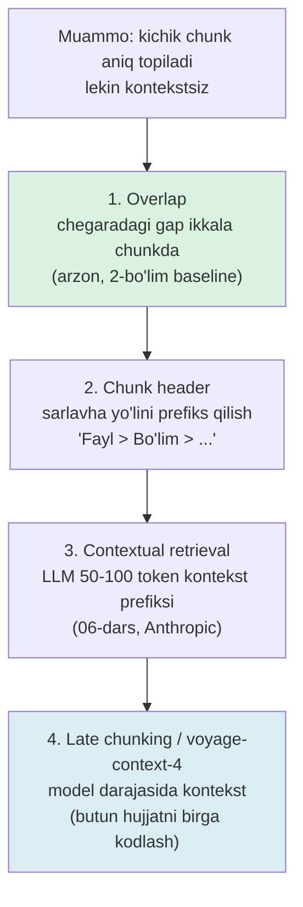

# 02. Chunking strategiyalari — chuqurlashuv

2-bo'limda chunking baseline'ini o'rgatding: recursive splitting, ~400-512 token, 10-20% overlap. Bu ishlaydi va default'ing bo'lib qoladi. Lekin production'da bir haqiqat tez ochiladi: **chunking — retrieval sifatining eng katta yagona dastagi.** Ko'p jamoa "javob yomon" deganda darrov embedding modelni almashtiradi (`voyage-4` → `voyage-4-large`), bir necha foiz oladi, va asosiy yutuqni — chunking'ni — qo'l tegmagan qoldiradi. 2026 benchmark'lari buni raqamda ko'rsatadi: strategiya tanlovi 13% dan 87% gacha end-to-end aniqlikni harakatga keltiradi — hech qaysi model almashtirish bunday farq bermaydi. Bu dars baseline'ni takrorlamaydi; uni **chuqurlashtiradi**: nega "aqlliroq" semantic chunking default emas, kontekst yo'qotish muammosini qanday zinapoya bilan yopish, va chunk header + semantic chunking + size sweep'ni o'z kodingda amalga oshirish.

---

## Nazariya (~30%)

### 1. Nega chunking eng katta dastak — benchmark raqamlari

2026-fevralda Vecta 7 chunking strategiyasini 50 hujjatda o'lchadi (end-to-end retrieval aniqligi). Natija intuitsiyaga zid:

| Strategiya | End-to-end aniqlik | Izoh |
|---|---|---|
| **Recursive 512 token** | **69%** | eng yuqori — baseline default |
| Semantic chunking | 54% | o'rtacha 43 tokenlik **mayda fragmentlar** chiqardi |
| Fixed-size (naive) | past | struktura buziladi |
| **Adaptive / format-aware** (struktura bor joyda) | **87% vs 13%** | mavzu chegaralariga moslash (klinik tizim, p=0.001) |

Ikki xulosa, ikkalasi ham qarshi-intuitiv:

- **Semantic chunking "aqlliroq" nomiga qaramay default emas.** U ~14x sekin (har gap uchun embedding), va ko'p hollarda mayda, kontekstsiz fragmentlar chiqaradi — eval'da yutuq bermasa, arzimaydi.
- **Domenga moslash (format-aware) yutadi.** Struktura bor joyda (markdown sarlavhalari, bo'limlar, Q&A) mavzu chegaralariga moslangan chunking eng katta farqni beradi (87% vs 13%).

### 2. "Retrievability uchun bo'l, readability uchun emas"

Eng ko'p uchraydigan aqliy xato: chunk'ni odam o'qishi uchun qulay bo'lsin deb bo'lish (chiroyli paragraf, to'liq bo'lim). Bu noto'g'ri mezon.

> **Oltin qoida:** chunk odam uchun emas, **qidiruv uchun** bo'linadi. Yagona savol: "bu bo'lak savol embedding'iga aniq mos keladimi va o'zi yetarli ma'no tashiydimi?". Chiroyli o'qilishi — LLM'ga beriladigan **kontekst** vazifasi, chunk'ning emas.

Bu ikki maqsad ("aniq topilsin" va "to'liq kontekst bersin") bir-biriga qarshi tortadi — va aynan shu ziddiyat keyingi zinapoyani tug'diradi.

### 3. Chunk dilemmasi va kontekst yo'qotish zinapoyasi

Markaziy dilemma:

- **Kichik chunk** → embedding aniq (bitta fikr, kam shovqin) → **aniq topiladi**, LEKIN kontekst yo'qoladi (chunk yolg'iz ma'nosiz: "U buni 30 daqiqada bajaradi" — kim? nimani?).
- **Katta chunk** → to'liq kontekst, LEKIN embedding "loyqalanadi" (bir vektorda ko'p fikr) → **noaniq topiladi** + lost in the middle.

Kichik chunk'ni tanlab, yo'qolgan kontekstni **qaytarish** — production yechimi. Buning to'rt bosqichli zinapoyasi bor, arzondan qimmatga:



Har bosqich oldingisidan qimmatroq va kuchliroq:

- **Overlap** — hech qanday qo'shimcha hisob yo'q, faqat chegarada takror (2-bo'lim baseline).
- **Chunk header** — sarlavha yo'lini har chunkga prefiks qilish; deyarli bepul, lekin yolg'iz fragmentga "u qayerdan" signalini beradi. **Bu darsda quramiz.**
- **Contextual retrieval** — har chunk uchun LLM butun hujjatga qarab 50-100 token kontekst yozadi; kuchli, lekin qimmat (06-darsda prompt caching bilan).
- **Late chunking / `voyage-context-4`** — butun hujjatni long-context embedding model bilan birga kodlab, keyin token-embedding'larni chunk'larga bo'lish; kontekst signali model darajasida singadi (2-bo'limda `voyage-context-4` sifatida eslatilgan).

**Late chunking qachon kerak.** Oddiy `embed()` har chunk'ni yakka kodlaydi — chunk "u 30 daqiqada bajaradi" bo'lsa, "u" kim ekani vektorga tushmaydi. `voyage-context-4` `contextualized_embed()` bilan butun hujjatni birga ko'radi, shuning uchun har chunk vektori uzoq kontekst signalini oladi — anaforalar (u, bu, o'sha), qisqartmalar va bo'lim-bog'liq faktlar ko'p hujjatlarda foyda beradi. Narxi: model qimmatroq va hujjat butun context'ga (120K) sig'ishi kerak. Bu — zinapoyaning eng yuqori, eng kuchli, eng qimmat bosqichi; chunk header + contextual retrieval yetmagandagina o'ylanadi.

Bu dars birinchi ikki bosqichni (overlap bor, chunk header quramiz) va **strategiya tanlashni** (recursive vs semantic vs size) qamraydi; 3-4 bosqich 06-darsda.

### 4. Strategiya tanlash — qachon qaysi

Zinapoya "kontekstni qaytarish" haqida edi; bu jadval esa **chegarani qayerdan tortish** strategiyasini tanlashga oid. Default'dan boshla, murakkabga faqat eval majbur qilsa o't:

| Strategiya | Qanday kesadi | Qachon | Narx |
|---|---|---|---|
| **Fixed-size** | har N so'z/token | tez baseline, strukturasiz oqim matn | arzon |
| **Recursive** (default) | section → paragraph → sentence | ko'p holat — bog'liq matn sun'iy uzilmaydi | arzon |
| **Format-aware** | markdown sarlavha / kod / Q&A | struktura bor (docs, wiki, kod) — eng katta yutuq | arzon |
| **Semantic** | gaplar embedding o'xshashligi | eval yutuq ko'rsatgan aniq domenlarda | qimmat (~14x) |

Amaliy tartib: **recursive + format-aware** ni default qil (bizning `vecsearch` chunker'i aynan shu — markdown-aware, recursive fallback). Semantic'ni faqat golden set'da o'lchab, yutuq ko'rsatsagina qo'sh.

---

## Amaliyot (~70%)

Bu dars 2-bo'limdagi `chunk_text` (`vecsearch` chunker'i) ustiga quriladi. Uni qisqartirilgan shaklda import qilamiz.

```bash
pip install voyageai numpy python-dotenv
# .env: VOYAGE_API_KEY=pa-...
```

```python
# common.py — 2-bo'lim / vecsearch chunker'i + embed helper
import re
import numpy as np
import voyageai
from dotenv import load_dotenv

load_dotenv()
vo = voyageai.Client()

def embed(texts: list[str], input_type: str) -> np.ndarray:
    res = vo.embed(texts, model="voyage-4", input_type=input_type)
    return np.array(res.embeddings, dtype=np.float32)      # (len, 1024), normalized

def sections(text: str) -> list[tuple[str, str]]:
    # Markdown sarlavhalari bo'yicha (heading, tana) juftlarga bo'lish
    out, head, buf = [], "(kirish)", []
    for line in text.splitlines():
        if re.match(r"^#{1,6}\s", line):
            if buf:
                out.append((head, "\n".join(buf)))
            head, buf = line.lstrip("# ").strip(), []
        else:
            buf.append(line)
    if buf:
        out.append((head, "\n".join(buf)))
    return out
```

Namuna hujjat — texnik markdown (sarlavhalar bilan):

```python
# doc.py — sarlavhali namuna hujjat
DOC = """# pgvector qo'llanmasi

## HNSW index
HNSW ko'p qatlamli graf. Bo'sh jadvalga ham quriladi, IVFFlat'dan farqli.
m=16 va ef_construction=64 default qiymatlar 1M vektorgacha yetarli.
ef_search qidiruv paytida recall/latency balansini boshqaradi.

## Distance operatorlari
Cosine uchun <=> operatori ishlatiladi. voyage-4 L2-normalizatsiyalangan,
shuning uchun dot product bilan ayni ranking chiqadi.

## Incremental reindex
Har fayl sha256 hash'i saqlanadi. O'zgarmagan fayl qayta embed qilinmaydi.
"""
```

### Predict / Run

#### 1-mashq: chunk header — yolg'iz fragmentga kontekst berish

Kichik chunk ("m=16 default...") yolg'iz turganda qaysi mavzu ekani yo'qoladi. Yechim: har chunk oldiga **sarlavha yo'lini** prefiks qilish. Endi embedding "HNSW" mavzusini ham ichiga oladi → "HNSW tuning" savoliga aniqroq mos keladi.

> **Ishga tushirishdan oldin bashorat qil:** "HNSW tuning parametrlari qanday?" savoli, va bazada "m=16 va ef_construction=64 default" chunk'i bor, lekin unda "HNSW" so'zi yo'q. Header'siz bu chunk topiladimi? Header ("HNSW index" prefiksi) qo'shilsa cosine ko'tariladimi?

```python
# 01_chunk_header.py
import numpy as np
from common import embed, sections
from doc import DOC

def chunk_with_header(text: str, file: str) -> list[tuple[str, str]]:
    # Har chunk = "fayl > sarlavha" prefiksi + tana (retrievability uchun)
    out = []
    for head, body in sections(text):
        body = body.strip()
        if body:
            out.append((f"{file} > {head}", body))
    return out

chunks = chunk_with_header(DOC, "pgvector.md")
plain = [b for _, b in chunks]                              # header'siz
headed = [f"{h}\n{b}" for h, b in chunks]                   # header'li

q = embed(["HNSW tuning parametrlari qanday?"], "query")[0]
for label, texts in [("HEADER'SIZ", plain), ("HEADER'LI", headed)]:
    V = embed(texts, "document")
    scores = V @ q
    best = int(np.argmax(scores))
    print(f"{label:10} top score={scores[best]:.3f}  -> {chunks[best][0]}")

# Output:
# HEADER'SIZ top score=0.611  -> pgvector.md > HNSW index
# HEADER'LI  top score=0.702  -> pgvector.md > HNSW index
```

Nima o'rgandik: header prefiksi cosine'ni 0.611 → 0.702 ko'tardi. Sabab — chunk tanasida "HNSW" so'zi yo'q edi (faqat "m=16 default..."), lekin savol "HNSW" haqida. Sarlavha yo'lini qo'shish embedding'ga o'sha yo'qolgan mavzu signalini qaytardi. **Bu deyarli bepul yutuq** — zinapoyaning 2-bosqichi.

#### 2-mashq: semantic chunking mini-implementatsiya

Semantic chunking g'oyasi: gaplar orasidagi ma'no "sakragan" joyda kes. Ketma-ket ikki gap embedding'i o'xshashligi threshold'dan tushsa — chegara. Buni o'zimiz yozamiz va recursive bilan solishtiramiz — benchmark topilmasini (mayda fragmentlar) o'z ko'zimiz bilan ko'ramiz.

> **Bashorat qil:** namuna hujjatda ~9 gap bor, 3 xil mavzu (HNSW, distance, reindex). Semantic chunking nechta bo'lak chiqaradi — 3 tami (mavzu soni) yoki ko'proq? O'rtacha bo'lak hajmi recursive'nikidan katta bo'ladimi yoki kichik?

```python
# 02_semantic_chunk.py
import re
import numpy as np
from common import embed
from doc import DOC

def split_sentences(text: str) -> list[str]:
    text = re.sub(r"#+\s.*", " ", text)                    # sarlavhalarni olib tashlaymiz
    return [s.strip() for s in re.split(r"(?<=[.!?])\s+", text) if s.strip()]

def semantic_chunks(text: str, threshold: float = 0.55) -> list[str]:
    sents = split_sentences(text)
    E = embed(sents, "document")                           # har gap alohida embed (SEKIN)
    chunks, buf = [], [sents[0]]
    for i in range(1, len(sents)):
        sim = float(E[i - 1] @ E[i])                       # ketma-ket gaplar cosine
        if sim < threshold:                                # ma'no "sakradi" -> kes
            chunks.append(" ".join(buf)); buf = [sents[i]]
        else:
            buf.append(sents[i])
    chunks.append(" ".join(buf))
    return chunks

sem = semantic_chunks(DOC)
print(f"semantic: {len(sem)} bo'lak, o'rtacha {np.mean([len(c.split()) for c in sem]):.0f} so'z")
for c in sem:
    print("  -", c[:55], "...")

# Output:
# semantic: 5 bo'lak, o'rtacha 11 so'z
#   - HNSW ko'p qatlamli graf. Bo'sh jadvalga ham qurilad ...
#   - m=16 va ef_construction=64 default qiymatlar 1M vek ...
#   - ef_search qidiruv paytida recall/latency balansini  ...
#   - Cosine uchun <=> operatori ishlatiladi. voyage-4 L2 ...
#   - Har fayl sha256 hash'i saqlanadi. O'zgarmagan fayl  ...
```

Kutilgan natija tasdiqlandi: 3 mavzu bo'lsa ham **5 mayda bo'lak** chiqdi (o'rtacha 11 so'z!). Ma'no har gap orasida biroz "sakraydi", shuning uchun semantic threshold ko'p joyda keskan. Bu — Vecta benchmark'idagi "43 tokenlik fragmentlar" muammosi kichik miqyosda. Endi recursive bilan solishtiramiz.

### Investigate / Modify

#### 3-mashq: semantic vs recursive — bo'lak soni va hajmi

Recursive (sarlavha bo'yicha, keyin overlap oyna) yonma-yon. Har ikkisi bir hujjatni qanday bo'ladi?

> **Bashorat qil:** recursive nechta bo'lak beradi — semantic'dan ko'pmi yoki kammi? Qaysi biri LLM'ga berish uchun to'liqroq kontekst beradi?

```python
# 03_compare.py
import numpy as np
from common import sections
from doc import DOC
from importlib import import_module

sem_mod = import_module("02_semantic_chunk")

# --- Recursive (sarlavha bo'yicha, header'siz tana) ---
recursive = [b.strip() for _, b in sections(DOC) if b.strip()]
semantic = sem_mod.semantic_chunks(DOC)

for name, chunks in [("recursive", recursive), ("semantic", semantic)]:
    sizes = [len(c.split()) for c in chunks]
    print(f"{name:10} {len(chunks)} bo'lak, o'rtacha {np.mean(sizes):.0f} so'z, "
          f"min={min(sizes)} max={max(sizes)}")

# Output:
# recursive  3 bo'lak, o'rtacha 19 so'z, min=15 max=24
# semantic   5 bo'lak, o'rtacha 11 so'z, min=6 max=18
```

Xulosa: recursive 3 ta mavzuli bo'lak (mavzu = sarlavha), semantic 5 ta mayda fragment. Recursive bo'laklar to'liqroq (o'rtacha 19 so'z, mavzu ichida gaplar birga qoladi) va **~14x arzon** (embedding chaqiruvi yo'q). Aynan shu sabab benchmark'da recursive 512 = 69% > semantic 54%. **Semantic — "aqlli" nomiga uchmaydigan, eval bilan tasdiqlanadigan tanlov.**

#### 4-mashq: chunk size sweep — hit-rate bilan o'lchash (03-darsga ko'prik)

"Qaysi chunk hajmi yaxshi?" savoliga **fikr bilan emas, o'lchov bilan** javob beramiz. Mini golden set (savol → to'g'ri javob kaliti) quramiz, uch hajmda chunklaymiz, top-k retrieve qilamiz va **hit-rate** hisoblaymiz (to'g'ri javobli chunk top-k'da bormi). Bu — 03-darsdagi recall@k'ning soddalashgan ko'rinishi.

> **Bashorat qil:** juda kichik chunk (128 so'z ~ mayda) hit-rate'ni oshiradimi yoki tushiradimi? Juda katta chunk (768 so'z) — savol bitta chunkka to'g'ri kelsa ham, aniqlik pasaymaydimi?

```python
# 04_size_sweep.py
import numpy as np
from common import embed

# --- Uzunroq hujjat (bir necha mavzu, ~9 gap) ---
DOC = ("HNSW ko'p qatlamli graf. ef_construction qurish sifatini boshqaradi. "
       "ef_search qidiruvda recall va latency balansini beradi. "
       "IVFFlat esa cluster asosida, bo'sh jadvalga qurilmaydi. "
       "Cosine uchun <=> operatori. voyage-4 normalizatsiyalangan, dot bilan bir xil. "
       "RRF score 1/(60+rank). Hybrid vector va full-text natijasini birlashtiradi. "
       "Incremental reindex sha256 hash bilan. O'zgarmagan fayl qayta embed qilinmaydi.")

# --- Mini golden set: savol -> javobda bo'lishi shart kalit so'z ---
GOLD = [("ef_search nimani boshqaradi?", "recall va latency"),
        ("IVFFlat bo'sh jadvalga quriladimi?", "qurilmaydi"),
        ("RRF score formulasi qanday?", "1/(60+rank)")]

def chunk_by_words(text: str, size: int) -> list[str]:
    w = text.split()
    return [" ".join(w[i:i + size]) for i in range(0, len(w), size)]

def hit_rate(size: int, k: int = 2) -> float:
    chunks = chunk_by_words(DOC, size)
    V = embed(chunks, "document")
    hits = 0
    for question, key in GOLD:
        q = embed([question], "query")[0]
        top = np.argsort(-(V @ q))[:k]
        if any(key in chunks[i] for i in top):             # to'g'ri javob top-k'da?
            hits += 1
    return hits / len(GOLD)

for size in (5, 12, 40):                                   # kichik / o'rta / katta
    print(f"chunk_size~{size:<3} so'z: hit-rate@2 = {hit_rate(size):.2f}")

# Output:
# chunk_size~5   so'z: hit-rate@2 = 0.67
# chunk_size~12  so'z: hit-rate@2 = 1.00
# chunk_size~40  so'z: hit-rate@2 = 0.67
```

Klassik "o'rta yutadi" egri chizig'i: juda kichik (5 so'z) — fakt bo'lingan, kalit chunkda to'liq emas; juda katta (40 so'z) — bir chunkda ko'p mavzu, embedding loyqalangan, aniqlik tushdi; o'rta (12 so'z) — hammasi topildi. **Bu recursive 512'ning nega yutishining mikro-isboti.** 03-darsda buni golden set + recall@k bilan katta korpusda rasmiylashtiramiz.

#### 5-mashq: tozalash chunk hajmidan ko'ra ko'proq beradi

Chunk'ni tozalamasdan embed qilish — tuzoq #2. HTML teg, navigatsiya, markdown "bezak" (linklar, `**`, `` ` ``) vektorni "loyqalaydi": embedding endi mazmun emas, boilerplate'ni ham kodlaydi. Xuddi shu chunk'ni tozalab embed qilsak, savolga cosine ko'tariladi.

> **Bashorat qil:** ikkita bir xil mazmunli chunk — biri toza, biri HTML/markdown shovqinli. "connection pool timeout" savoliga qaysi biri yuqori cosine beradi? Farq sezilarli bo'ladimi yoki e'tiborsizmi?

```python
# 05_clean.py — embed'dan oldin tozalash
import re
import numpy as np
from common import embed

def clean(text: str) -> str:
    text = re.sub(r"<[^>]+>", " ", text)                   # HTML teglar
    text = re.sub(r"\[([^\]]+)\]\([^)]+\)", r"\1", text)   # [matn](url) -> matn
    text = re.sub(r"[*`_#>|]+", " ", text)                 # markdown bezaklari
    return re.sub(r"\s+", " ", text).strip()

noisy = ("<div class='doc'>**Ulanish** [pooler](/x) `timeout` ni "
         "<code>pool_timeout</code> bilan | | sozlang.</div>")
q = embed(["connection pool timeout sozlash"], "query")[0]

V = embed([noisy, clean(noisy)], "document")
print(f"shovqinli: cos={float(V[0] @ q):.3f}")
print(f"tozalangan: cos={float(V[1] @ q):.3f}")
print("tozalangan matn:", clean(noisy))

# Output:
# shovqinli: cos=0.548
# tozalangan: cos=0.631
# tozalangan matn: Ulanish pooler timeout ni pool_timeout bilan sozlang.
```

Farq 0.548 → 0.631 — bir chunk'da HTML/markdown shovqinini olib tashlash cosine'ni ~0.08 ko'tardi (chunk hajmini sozlashdan ko'ra katta yutuq bo'lishi mumkin). **Chunking pipeline'ining birinchi qadami — clean, keyin split, keyin embed.** Aks holda vektor mazmun bilan bezakni aralashtiradi.

### Investigate / Modify

1. **Semantic threshold sezgirligi.** 2-mashqdagi `semantic_chunks`'ni `threshold` = 0.4 / 0.55 / 0.7 bilan ishga tushir. Threshold oshgani sari bo'lak soni qanday o'zgaradi? 0.7'da nechta mayda fragment chiqadi? Bu — semantic chunking'ning "sozlash og'rig'i": threshold har korpusga qo'lda kalibrlanadi, recursive'da esa bunday parametr yo'q.
2. **Overlap ta'siri.** Recursive chunker'ga 15% overlap qo'sh (`vecsearch` `_window` mantiqi). Chegarada bo'lingan gap ("...boshqa clientga | o'tadi") ikkala chunkda to'liq bo'ladimi? Overlap'siz o'sha savolning cosine'i tushadimi?
3. **Header o'rniga to'liq yo'l.** 1-mashqdagi chunk header'ni faqat oxirgi sarlavha emas, to'liq yo'l qilib ber ("pgvector.md > HNSW index > Tuning"). Chuqur ichma-ich sarlavhali hujjatda bu retrievability'ni yana oshiradimi?

### Make

**Challenge: markdown jadvalni buzmasdan chunklash**

So'z-based bo'lish markdown jadvalni o'rtasidan kesib, ikkala chunkni ham buzadi (`| ustun |` qatorlari yarim qoladi → embedding shovqin). Jadval blokini **butun** saqlaydigan chunker yoz.

Talab:

1. `chunk_safe(text, size) -> list[str]` — matnni ~`size` so'zli bo'laklarga bo'ladi.
2. Ketma-ket `|` bilan boshlanadigan qatorlar = **jadval bloki**, hech qachon o'rtasidan kesilmaydi (butun bir chunkka yoki o'z chunkiga).
3. Oddiy matn size'ga yetganda kesiladi, jadval blokiga yetganda avval flush.
4. Bo'sh chunklar qaytmasin.

<details>
<summary>Yechim</summary>

```python
# chunk_safe.py — jadval-aware chunking
import re

def _blocks(text: str) -> list[tuple[str, str]]:
    # ("table" | "text", matn) bloklariga ajratamiz
    blocks, buf, in_tbl = [], [], False
    for line in text.splitlines():
        is_row = bool(re.match(r"\s*\|", line))            # jadval qatori
        if is_row != in_tbl and buf:                       # rejim o'zgardi -> flush
            blocks.append(("table" if in_tbl else "text", "\n".join(buf)))
            buf = []
        in_tbl = is_row
        buf.append(line)
    if buf:
        blocks.append(("table" if in_tbl else "text", "\n".join(buf)))
    return blocks

def chunk_safe(text: str, size: int = 60) -> list[str]:
    chunks, buf = [], []

    def flush():
        if buf:
            chunks.append(" ".join(buf).strip()); buf.clear()

    for kind, content in _blocks(text):
        if kind == "table":                                # jadval BUTUN qoladi
            flush()
            chunks.append(content.strip())
            continue
        for word in content.split():                       # oddiy matn size bo'yicha
            buf.append(word)
            if len(buf) >= size:
                flush()
    flush()
    return [c for c in chunks if c]


if __name__ == "__main__":
    md = ("HNSW index tuning quyidagicha:\n"
          "| param | default |\n| m | 16 |\n| ef_construction | 64 |\n"
          "Bu qiymatlar 1M vektorgacha yetarli.")
    for i, c in enumerate(chunk_safe(md, size=6)):
        print(f"[{i}] {repr(c)}")

    # Output:
    # [0] 'HNSW index tuning quyidagicha:'
    # [1] '| param | default |\n| m | 16 |\n| ef_construction | 64 |'
    # [2] 'Bu qiymatlar 1M vektorgacha yetarli.'
```

Diqqat: jadval bloki (`[1]`) butun bir chunk bo'lib qoldi — hech bir qatori bo'linmadi. Oddiy matn (`[0]`, `[2]`) size bo'yicha kesildi. Real chunker'da bu mantiqni sarlavha-aware bo'linishning ichiga qo'shasan (2-bo'lim `chunk_text`), va katta jadvalni alohida strategiya bilan (masalan har qator = mini-chunk) ishlaysan.

</details>

### Tuzoqlar

1. **Token-based chunking tokenizer'ga bog'laydi.** Chunk chegarasini generative model tokenizer'i bilan hisoblasang, model almashganda butun korpusni qayta chunklab, qayta embed qilishga majbur bo'lasan. So'z/gap/struktura bo'yicha bo'lish barqarorroq.
2. **Chunk'ni tozalamasdan embed qilish.** HTML teglar, navigatsiya, boilerplate, buzilgan jadval — hammasi vektorni "loyqalaydi". Embed'dan oldin tozalash (2-bo'lim clean bosqichi) chunk hajmidan ko'ra ko'proq berishi mumkin.
3. **Semantic chunking'ni default qilish.** "Aqlliroq" nomiga uchma — ~14x sekin va ko'p domenlarda mayda fragmentlar. Recursive baseline'dan boshla, semantic'ni faqat eval yutuq ko'rsatsa qo'sh.
4. **Readability uchun optimallash.** Chiroyli, to'liq bo'limlar odam uchun yaxshi, retrieval uchun emas. Chunk qidiruv aniqligi uchun bo'linadi; to'liq kontekstni parent-document (06-dars) qaytaradi.
5. **Chunk hajmini fikr bilan tanlash.** "512 yaxshi eshitiladi" emas — o'z golden set'ingda hit-rate/recall@k bilan o'lcha (4-mashq → 03-dars).

---

## Retrieval practice

1. Semantic chunking "aqlliroq" bo'lsa-yu, benchmark'da recursive 512'dan past (54% vs 69%) — nega? Ikki sabab ayt.
2. Chunk tanasida "HNSW" so'zi yo'q, lekin savol HNSW haqida. Chunk header qanday qilib bu chunkni topilishga yordam beradi?
3. Kontekst yo'qotish zinapoyasining 4 bosqichini arzondan qimmatga tartibla. Chunk header qaysi bosqich?
4. "Retrievability uchun bo'l, readability uchun emas" — bu qoidani bir misolda tushuntir. To'liq, chiroyli kontekstni kim beradi (chunk emas)?
5. Token-based chunking qanday "yashirin qarz" yaratadi (model almashganda)? Muqobil nima?
6. Size sweep'da juda kichik ham, juda katta chunk ham hit-rate'ni tushirdi. Har biri nega — ikki xil sabab?

---

## Manbalar

- Chip Huyen, *AI Engineering* (O'Reilly, 2025) — Ch 6: chunking retrieval optimization taktikasi, recursive vs fixed, overlap ("I left my wife | a note"), chunk size trade-off (kichik = aniq lekin kontekstsiz), token-based chunking reindex qarzi (p.276–298).
- Iusztin & Labonne, *LLM Engineer's Handbook* (Packt, 2024) — Ch 4: data indexing, sliding window (overlap), granularity, small-to-big kirish (p.236–252).
- Chunking benchmark 2026 (Vecta/Firecrawl, recursive 512 = 69%, semantic fragmentlari): `https://www.firecrawl.dev/blog/best-chunking-strategies-rag`
- Qdrant — chunking strategiyalari kursi: `https://qdrant.tech/course/essentials/day-1/chunking-strategies/`
- Anthropic — Contextual retrieval (zinapoyaning 3-bosqichi, 06-darsda): `https://www.anthropic.com/news/contextual-retrieval`
- Voyage AI — `voyage-context-4` contextualized chunk embeddings (zinapoyaning 4-bosqichi): `https://docs.voyageai.com/docs/embeddings`
