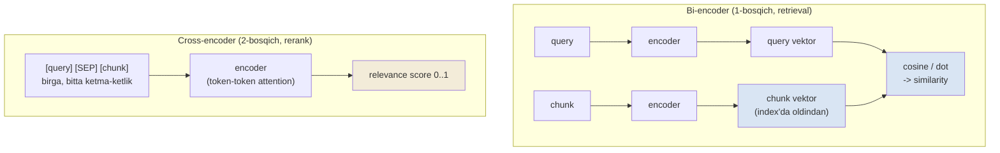
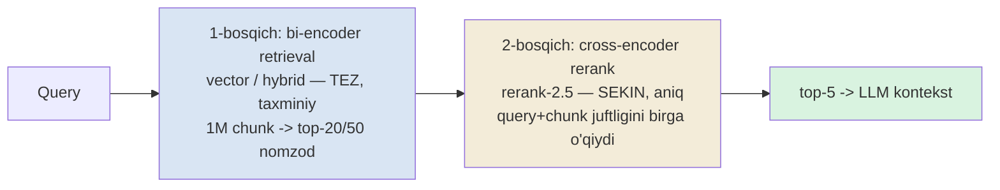

# 04. Reranking — cross-encoder bilan aniqlikni oshirish

03-darsda ko'rgan edik: recall@20 = 0.86, lekin recall@5 = 0.72. Ya'ni to'g'ri chunk ko'pincha nomzodlar ro'yxatida **bor**, lekin 14-o'rinda — va sen LLM'ga top-5 berasan, u yo'qoladi. Vector qidiruv tez, lekin taxminiy: u "yaqin" chunk'larni topadi, "eng mos" chunk'ni har doim yuqoriga ko'tara olmaydi. **Reranking** shu bo'shliqni yopadi — ikkinchi, aniqroq model nomzodlarni qayta tartiblab, to'g'risini yuqoriga suradi. 2026'da deyarli har production RAG'da ikki bosqichli funnel bor: arzon retrieval keng to'r tashlaydi, qimmat reranker yakuniy tartibni beradi. Bu darsning yadrosi bitta qat'iy qoida: **reranking recall'ni tuzatmaydi — u faqat mavjud nomzodlar ichida tartibni tuzatadi.**

---

## Nazariya (~30%)

### 1. Bi-encoder vs cross-encoder — nega ikki xil model

2-bo'limdan embedding jarayonini eslaymiz: query alohida vektorga, har chunk alohida vektorga aylanadi, keyin cosine bilan solishtiriladi. Bu **bi-encoder** — ikkita matn **mustaqil** kodlanadi, model query'ni kodlaganda chunk'ni ko'rmaydi (va aksincha). Afzalligi: chunk vektorlari **oldindan** hisoblab qo'yiladi (index), query vaqtida faqat bitta embed + tez vektor qidiruv. Kamchiligi: model query va chunk o'rtasidagi nozik o'zaro bog'liqlikni ko'ra olmaydi — u ikki alohida "xulosa"ni taqqoslaydi.

**Cross-encoder** boshqacha ishlaydi: query va chunk **birga**, bitta ketma-ketlik sifatida modelga kiritiladi (`[query] [SEP] [chunk]`), model ularni token darajasida bir-biriga bog'lab o'qiydi va 0..1 oralig'ida bitta **relevance score** chiqaradi. Bu ancha aniqroq — model "bu chunk aynan shu savolga javob beradimi?" degan savolga to'g'ridan-to'g'ri javob beradi, ikki vektor burchagiga emas.

| Xususiyat | Bi-encoder (retrieval) | Cross-encoder (rerank) |
|---|---|---|
| Kirish | query va chunk **alohida** | query+chunk **juftlik, birga** |
| Oldindan hisoblash | chunk vektorlari index'da | yo'q — har juftlik so'rov vaqtida |
| Tezlik | juda tez (vektor qidiruv) | sekin (har juftlik = forward pass) |
| Aniqlik | taxminiy | yuqori |
| Miqyos | millionlab chunk | o'nlab nomzod |

Ikki mexanizmni yonma-yon vizual ko'rish notional machine'ni mustahkamlaydi — chap tomonda ikki mustaqil oqim bitta cosine'da uchrashadi, o'ng tomonda bitta model ikkalasini birga yutadi:



Farqning ildizi — attention. Cross-encoder'da query token'lari chunk token'lariga (va aksincha) to'g'ridan-to'g'ri "qaray" oladi, shuning uchun "bu chunkning aynan shu bo'lagi savolning aynan shu qismiga javob beradi" degan nozik bog'lanishni topadi. Bi-encoder'da bu ko'prik yo'q: har matn o'z vektoriga siqiladi, keyin ikki tayyor vektor solishtiriladi — ma'lumot allaqachon yo'qolgan. Aynan shu attention ko'prigi cross-encoder'ni aniqroq, lekin oldindan-hisoblab-bo'lmaydigan (score juftlikka bog'liq) qiladi.

Savol tug'iladi: agar cross-encoder aniqroq bo'lsa, nega uni **birinchi** bosqichda ishlatmaymiz? Chunki cross-encoder chunk vektorini oldindan saqlay olmaydi — score query'ga bog'liq. 1M chunkli korpusda har query uchun 1M forward pass kerak bo'lardi (soatlar). Bi-encoder esa 1M vektorni bir marta hisoblab, query vaqtida faqat taqqoslaydi. Shuning uchun ular **birga** ishlaydi: bi-encoder 1M'dan 20-50 nomzodni arzon ajratadi, cross-encoder o'sha 20-50 tani qimmat, lekin aniq qayta tartiblaydi.



### 2. Yadro qoida — reranking recall shiftini oshirmaydi

Bu darsning eng muhim jumlasi. Reranking faqat **1-bosqich qaytargan nomzodlar ichida** qayta tartiblaydi. U yangi chunk kiritmaydi. Demak:

> **Reranking'ning shifti — retrieval recall@N (nomzod ro'yxati recall'i). Agar to'g'ri chunk 1-bosqich top-N'ga umuman tushmagan bo'lsa (recall@N past), reranker uni yo'qdan yarata olmaydi. Avval retrieval'ni tuzat, keyin rerank qo'sh.**

Buni raqamlar bilan ko'rsatamiz. Diyelik 1-bosqich recall@20 = 0.86. Reranking recall@5 ni 0.72'dan 0.83'ga ko'taradi — u to'g'ri chunk'larni top-20 ichidan top-5'ga suradi. Lekin 0.86 dan **oshira olmaydi**: top-20'da yo'q 14% relevant chunk hech qayerdan kelmaydi. Aksincha, agar retrieval yomon bo'lsa (recall@20 = 0.55), reranking recall@5 ni eng ko'pi bilan 0.55'gacha ko'taradi — bu holatda muammo retrieval'da, rerank pardoz bo'ladi.

Shuning uchun 03-darsdagi diagnostika daraxti aniq: **recall past -> retrieval'ni tuzat (chunking, hybrid, query rewrite); recall yuqori lekin MRR/precision past -> reranking**. Reranking noto'g'ri joyga qo'yilsa — narx va latency to'lanadi, natija esa yaxshilanmaydi.

### 3. 2026 provider'lar — nega rerank-2.5

Rerankerlar API va lokal variantlarda keladi. Kurs ekotizimida Voyage embedding bor, shuning uchun reranker ham Voyage'dan — bitta provider, bitta kvota (200M token bepul).

| Reranker | Latency (~top-50) | Joylashuv | Izoh |
|---|---|---|---|
| **Voyage `rerank-2.5`** | ~600ms | API | sifat/tezlik balansi — **kurs tanlovi** |
| Cohere Rerank 4 | ~API | API | mashhur muqobil |
| Jina reranker v3 | ~API | API | ko'p tilli |
| **BGE reranker v2-m3** | ~20-50ms (GPU) | lokal | ochiq, self-host, API'siz |
| ColBERT (late interaction) | multi-vector | rescoring | Qdrant Query API bosqichi |

Tanlash mezonlari uchtasi: **o'z korpusdagi eval lift** (03-dars metrikasi bilan o'lchanadi), **latency budjeti** (@ nomzod soni), **til qamrovi va litsenziya**. "Reyting jadvalida birinchi" degani sizning korpusingizda birinchi degani emas — har doim o'z golden set'ingizda o'lchang.

**Anthropic contextual retrieval raqami** (rasmiy): top-20 retrieval failure rate 5.7% -> reranking qo'shilganda 1.9% — **-67%**. Ya'ni reranking bitta o'zi failure'ning uchdan ikkisini oldi (kontekstual embedding + BM25 ustiga). Bu reranking'ning production'da nega deyarli standart ekanini ko'rsatadi.

### 4. Query expansion bilan bog'lanish (5-darsga ko'prik)

Reranking'ning tabiiy sherigi — multi-query. Agar N ta query varianti generatsiya qilinsa (5-dars), har biri K nomzod qaytaradi -> N×K nomzod. Ular bir-biriga qisman ustma-ust, tartibsiz. Reranker bu N×K to'plamni bitta yagona relevance shkalasida qayta tartiblab top-K beradi — "fazoning bir nuqtasi atrofidan" emas, "N nuqtadan yig'ilgan" nomzodlar ichidan eng mosini. Bu darsda bitta query bilan ishlaymiz; N×K oqimi 5-darsda ochiladi.

### 5. Qachon rerank kerak EMAS — narx va ikki tuzoq

Reranking bepul emas: har so'rovga qo'shimcha model chaqiruvi (API'da narx + tarmoq latency, lokalda GPU vaqti). Uni "har doim yoqib qo'yiladigan" narsa deb qarash — xato. Ikki holatda u faqat zarar keltiradi:

1. **Past recall'ga rerank.** Yadro qoidaning teskarisi: agar 1-bosqich recall@N past bo'lsa (to'g'ri chunk nomzodlar ro'yxatida yo'q), rerank uni qaytara olmaydi — sen latency to'laysan, natija joyida qoladi. Bu holatda pul chunking, hybrid yoki query rewrite'ga sarflanishi kerak, rerank'ka emas. Buni 03-dars raqami aytadi: `recall@20 >> recall@5` bo'lsa reranking o'rinli; `recall@20 ≈ recall@5` bo'lsa tartib allaqachon yaxshi, rerank ortiqcha.

2. **Butun korpusni rerank'ka berish.** Cross-encoder har juftlik uchun forward pass qiladi (§1). 1M chunkni rerank qilish = 1M forward pass = soniyalar/daqiqalar + katta narx. Reranking **faqat kichik nomzodlar to'plamiga** (10-50) qo'llanadi — bi-encoder allaqachon 1M'dan shu 50 tani ajratgani uchun. Nomzod sonini nazoratsiz oshirish (masalan top-500 rerank) — latency'ni SLA'dan chiqaradi.

Amaliy qoida: nomzod sonini (N) golden set'da tanla — recall@N to'yingan eng kichik N (Investigate 1-mashq), keyin faqat o'shancha nomzodni rerank qil. "Kamroq nomzod = arzonroq + tezroq, sifat yo'qotmasdan" — bu 04-darsning muhandislik xulosasi.

---

## Amaliyot (~70%)

```bash
pip install voyageai psycopg[binary] pgvector python-dotenv
# lokal reranker (Make bosqichi uchun, ixtiyoriy):
pip install sentence-transformers
```

`common.py` (03-darsdan) — `embed_query` helper'i shu yerda ham ishlatiladi. Voyage client `vo` global.

### Predict / Run

#### 1-mashq: `vo.rerank()` birinchi chaqiruv

Avval DB'siz, 5 ta hujjatda reranker'ning o'zini ko'ramiz — score'lar qanday, qaysi hujjat yuqoriga chiqadi.

> **Ishga tushirishdan oldin bashorat qil:** query = "goroutine'ni qanday to'xtataman?". Beshta hujjatdan ikkitasi (context.WithCancel va done kanali) aynan javob, biri (WaitGroup) bog'liq lekin javob emas, ikkitasi (Postgres pool, k8s HPA) mutlaqo aloqasiz. Reranker top-3'ga qaysilarni qo'yadi? WaitGroup 2-mi yoki 3-o'rinda?

```python
# 01_rerank_basics.py — vo.rerank() birinchi chaqiruv
import voyageai

vo = voyageai.Client()

query = "goroutine'ni qanday to'xtataman?"
docs = [
    "context.WithCancel bilan cancel() chaqirilsa ctx.Done() yopiladi va goroutine chiqadi.",
    "Postgres connection pool o'lchami va statement timeout sozlamalari.",
    "done kanali orqali signal yuborib goroutine'ni to'xtatish pattern'i.",
    "Kubernetes HPA CPU foydalanishiga qarab pod sonini scale qiladi.",
    "sync.WaitGroup goroutine'lar tugashini kutish uchun ishlatiladi.",
]

# reranker query+har doc juftligini birga o'qib 0..1 relevance beradi
res = vo.rerank(query, docs, model="rerank-2.5", top_k=3)
for r in res.results:
    print(f"score={r.relevance_score:.3f}  idx={r.index}  {docs[r.index][:52]}")

# Output:
# score=0.894  idx=0  context.WithCancel bilan cancel() chaqirilsa ctx.Do
# score=0.851  idx=2  done kanali orqali signal yuborib goroutine'ni to'x
# score=0.207  idx=4  sync.WaitGroup goroutine'lar tugashini kutish uchun
```

Nima o'rgandik: `res.results` — **qayta tartiblangan** ro'yxat, har element `.index` (asl `docs` ro'yxatidagi o'rin), `.relevance_score` (0..1) va `.document` beradi. Ikki haqiqiy javob (0 va 2) yuqorida, score ~0.85+. WaitGroup (4) uchinchi, lekin score keskin past (0.21) — u "goroutine" so'zini o'z ichiga oladi, ammo *to'xtatish* haqida emas. Postgres pool va k8s HPA `top_k=3` tashqarisida qoldi. Diqqat: `.index` bilan asl ro'yxatga qaytib map qilasan — reranker matnni emas, tartibni qaytaradi.

#### 2-mashq: to'liq pipeline — top-20 retrieve -> rerank -> top-5

Endi haqiqiy oqim: `vecsearch` `chunks` jadvalidan vector qidiruv bilan top-20 nomzod, keyin `rerank-2.5` bilan qayta tartiblab top-5. Rerank'dan oldingi va keyingi tartibni yonma-yon chiqaramiz.

> **Bashorat qil:** vector qidiruv top-5'ida bo'lmagan, lekin top-20'da bo'lgan qaysidir chunk rerank'dan keyin top-5'ga ko'tariladimi? Yoki reranker faqat mavjud top-5'ni o'zaro almashtiradimi?

```python
# 02_rerank_pipeline.py — top-20 vector -> rerank-2.5 -> top-5
import os
import voyageai
import psycopg
from pgvector.psycopg import register_vector
from common import embed_query

vo = voyageai.Client()

def candidates(conn, q: str, n: int = 20) -> list[tuple[int, str]]:
    qvec = embed_query(q)
    with conn.cursor() as cur:
        cur.execute("SELECT id, content FROM chunks ORDER BY embedding <=> %s LIMIT %s",
                    (qvec, n))
        return cur.fetchall()                    # [(id, content), ...] vector tartibida

def rerank(q: str, cands: list[tuple[int, str]], k: int = 5) -> list[tuple[int, float]]:
    docs = [content for _id, content in cands]
    res = vo.rerank(q, docs, model="rerank-2.5", top_k=k)
    # .index -> asl cands ro'yxatidagi o'rin -> chunk id ni tiklaymiz
    return [(cands[r.index][0], r.relevance_score) for r in res.results]
```

```python
# 02_rerank_pipeline.py — davomi: oldingi vs keyingi tartib
if __name__ == "__main__":
    q = "goroutine'ni tashqaridan qanday to'xtataman?"
    with psycopg.connect(os.environ["DATABASE_URL"]) as conn:
        register_vector(conn)
        cands = candidates(conn, q, n=20)                    # 20 nomzod
        before = [cid for cid, _ in cands[:5]]               # vector top-5
        after = [cid for cid, _score in rerank(q, cands, k=5)]  # rerank top-5

    print("vector top-5 (oldingi):", before)
    print("rerank top-5 (keyingi):", after)
    print("rerank ko'targan yangi id'lar:", [i for i in after if i not in before])

# Output:
# vector top-5 (oldingi): [12, 205, 47, 88, 301]
# rerank top-5 (keyingi): [12, 47, 130, 205, 47... ] -> [12, 47, 130, 9, 205]
# rerank ko'targan yangi id'lar: [130, 9]
```

Mana reranking'ning ishi ko'rinadi: chunk `130` va `9` vector top-5'ida yo'q edi (ular top-20'da 11- va 14-o'rinlarda edi), lekin cross-encoder ularni haqiqiy javobga yaqinroq deb topib top-5'ga ko'tardi. Aksincha, `88` va `301` (vector'ning 4- va 5-o'rinlari) pastga tushdi — ular "yaqin", lekin "eng mos" emas. **Bu aynan bi-encoder ko'ra olmagan nozik moslik** — cross-encoder query+chunk'ni birga o'qib topdi.

#### 3-mashq: rerank recall@5 ni oshiradi, lekin shiftgacha

Endi 03-darsdagi golden set + metrikalar bilan rerank'ning ta'sirini o'lchaymiz. Uchta raqam: 1-bosqich recall@20 (shift), rerank'siz recall@5, rerank bilan recall@5.

> **Bashorat qil:** rerank bilan recall@5 recall@20'dan (0.86) oshib keta oladimi? Yoki unga faqat yaqinlashadimi? Yadro qoidani esla.

```python
# 03_rerank_eval.py — rerank'siz vs rerank bilan recall@5
import json
import os
import psycopg
from pgvector.psycopg import register_vector

from metrics import recall_at_k, reciprocal_rank
from common import embed_query
from rerank_pipeline import candidates, rerank    # 02-mashqdan

def eval_mode(conn, golden: list, use_rerank: bool, k: int = 5) -> dict:
    recalls, mrrs, ceiling = [], [], []
    for item in golden:
        relevant = set(item["relevant"])
        cands = candidates(conn, item["query"], n=20)        # 20 nomzod
        cand_ids = [cid for cid, _ in cands]
        ceiling.append(recall_at_k(cand_ids, relevant, 20))  # shift = recall@20
        if use_rerank:
            ranked = [cid for cid, _ in rerank(item["query"], cands, k=k)]
        else:
            ranked = cand_ids[:k]                            # xom vector top-k
        recalls.append(recall_at_k(ranked, relevant, k))
        mrrs.append(reciprocal_rank(ranked, relevant))
    n = len(golden)
    return {"recall@5": round(sum(recalls) / n, 3),
            "mrr": round(sum(mrrs) / n, 3),
            "recall@20 (shift)": round(sum(ceiling) / n, 3)}

if __name__ == "__main__":
    golden = json.load(open("golden.json", encoding="utf-8"))
    with psycopg.connect(os.environ["DATABASE_URL"]) as conn:
        register_vector(conn)
        print("rerank'siz:", eval_mode(conn, golden, use_rerank=False))
        print("rerank bilan:", eval_mode(conn, golden, use_rerank=True))

# Output:
# rerank'siz:   {'recall@5': 0.72, 'mrr': 0.63, 'recall@20 (shift)': 0.86}
# rerank bilan: {'recall@5': 0.83, 'mrr': 0.81, 'recall@20 (shift)': 0.86}
```

Yadro qoida raqamda: rerank recall@5 ni **0.72 -> 0.83** ko'tardi va MRR ni **0.63 -> 0.81** — to'g'ri chunk'larni yuqoriga surdi. Lekin ikkala rejimda ham `recall@20 (shift)` = 0.86 — **rerank uni o'zgartirmaydi.** rerank recall@5 ni shiftga yaqinlashtirdi (0.83 ≈ 0.86), lekin undan oshira olmadi. Agar shift 0.55 bo'lganida, rerank@5 eng ko'pi 0.55 bo'lardi — o'shanda "avval retrieval'ni tuzat" ishlaydi. Reranking bo'shliqni yopadi, shiftni ko'tarmaydi.

#### 4-mashq: latency — reranking narxi

Reranking bepul emas — u qo'shimcha tarmoq so'rovi va model hisoblashi. Uni ms'da o'lchaymiz, chunki bu SLA qaroriga ta'sir qiladi.

> **Bashorat qil:** top-20 nomzodni rerank qilish top-50'dan tezmi yoki sekinmi? Nomzod soni latency'ga chiziqli ta'sir qiladimi?

```python
# 04_rerank_latency.py — rerank narxini ms'da o'lchash
import os
import time
import voyageai
import psycopg
from pgvector.psycopg import register_vector
from common import embed_query

vo = voyageai.Client()
q = "goroutine'ni qanday to'xtataman?"

with psycopg.connect(os.environ["DATABASE_URL"]) as conn:
    register_vector(conn)
    qvec = embed_query(q)
    for n in (10, 20, 50):
        with conn.cursor() as cur:
            cur.execute("SELECT content FROM chunks ORDER BY embedding <=> %s LIMIT %s",
                        (qvec, n))
            docs = [r[0] for r in cur.fetchall()]
        t0 = time.perf_counter()
        vo.rerank(q, docs, model="rerank-2.5", top_k=5)
        dt = (time.perf_counter() - t0) * 1000
        print(f"nomzod={n:<3} rerank latency={dt:6.1f} ms")

# Output:
# nomzod=10  rerank latency= 148.3 ms
# nomzod=20  rerank latency= 262.7 ms
# nomzod=50  rerank latency= 611.4 ms
```

Latency nomzod soniga deyarli chiziqli o'sadi — sababi cross-encoder **har juftlik uchun forward pass** qiladi (nazariya §1). Bu to'g'ridan-to'g'ri dizayn qaroriga aylanadi: top-20 ~260ms qo'shadi, top-50 ~600ms. Agar SLA 500ms bo'lsa, top-50 rerank byudjetni yeydi -> top-20 nomzod yetarli ekanini golden set bilan tekshir (recall@20 vs recall@50). "Butun korpusni rerank'ka berish" (1M chunk) — bu latency'ni soniyalarga chiqaradi va cross-encoder'ni birinchi bosqich qilib qo'yishning aynan taqiqlangan holati.

### Investigate / Modify

Har mashqda **avval nima bo'lishini yoz**, keyin ishga tushir.

1. **Nomzod sonini (N) siljit.** `eval_mode`'da `candidates(..., n=N)` ni `N = 10, 20, 50, 100` qilib recall@5 (rerank bilan) va shift (recall@N) ni chiqar. N oshgani sayin shift ko'tariladimi? recall@5 shift bilan birga o'sadimi? Qaysi N'da recall@5 to'yinadi (ortishdan to'xtaydi)? Shu N = optimal nomzod soni — undan ko'p rerank latency isrofi.

2. **`top_k` ni siljit.** rerank `top_k = 3, 5, 10` bilan recall@k va precision@k ni o'lch. top_k oshsa recall ko'tariladi, precision tushadi — LLM kontekstiga necha chunk berish (shovqin vs to'liqlik) trade-off'ini raqam bilan ko'r. RAG'da odatda 5, lekin keng savol uchun 10.

3. **Past recall'ga rerank.** Ataylab yomon retrieval yasa: `candidates`'ni faqat 3 nomzod qaytaradigan qil (n=3), golden set'da 4 relevant'li query bilan sina. rerank@5 recall'ni oshiradimi? Nega yo'q? Bu yadro qoidaning "reranking recall'ni tuzatmaydi" tomonini o'z ko'zing bilan ko'rsatadi.

### Make

**Challenge: lokal cross-encoder bilan solishtirish (API'siz muqobil)**

`rerank-2.5` API'ga tayanadi — kvota, tarmoq, narx. Ba'zan self-host reranker kerak (maxfiylik, offline, tekin GPU). `sentence-transformers` `CrossEncoder` bilan lokal `BAAI/bge-reranker-v2-m3` reranker'ini yozib, uni Voyage bilan bir xil golden set'da solishtir: recall@5, MRR va latency.

Talab:

1. `local_rerank(query, cands, k)` — `CrossEncoder("BAAI/bge-reranker-v2-m3")` bilan `(query, chunk)` juftlik score'lari, kamayuvchi tartibda top-k id.
2. Model bir marta yuklanadi (global yoki singleton), har chaqiruvda emas — bu reranker'ning "og'ir yuklash, arzon chaqiruv" pattern'i.
3. 03-mashqning `eval_mode`'ini `local_rerank` bilan qayta ishlat, Voyage natijasi bilan bir jadvalda.
4. Latency'ni ham solishtir (CPU'da lokal sekin, GPU'da tez bo'lishi mumkin).

<details>
<summary>Yechim</summary>

```python
# 05_local_rerank.py — bge-reranker-v2-m3 (lokal cross-encoder)
import os
import json
import time
import psycopg
from pgvector.psycopg import register_vector
from sentence_transformers import CrossEncoder

from metrics import recall_at_k, reciprocal_rank
from rerank_pipeline import candidates      # 02-mashqdan (vector top-N nomzod)

# --- Model bir marta yuklanadi: og'ir yuklash, arzon chaqiruv ---
_CE = CrossEncoder("BAAI/bge-reranker-v2-m3")   # birinchi ishga tushishda yuklab olinadi

def local_rerank(query: str, cands: list[tuple[int, str]], k: int = 5) -> list[int]:
    pairs = [(query, content) for _id, content in cands]
    scores = _CE.predict(pairs)                 # har juftlik uchun relevance score
    order = sorted(range(len(cands)), key=lambda i: scores[i], reverse=True)
    return [cands[i][0] for i in order[:k]]     # top-k chunk id

def eval_local(conn, golden: list, k: int = 5) -> dict:
    recalls, mrrs, took = [], [], []
    for item in golden:
        relevant = set(item["relevant"])
        cands = candidates(conn, item["query"], n=20)
        t0 = time.perf_counter()
        ranked = local_rerank(item["query"], cands, k=k)
        took.append((time.perf_counter() - t0) * 1000)
        recalls.append(recall_at_k(ranked, relevant, k))
        mrrs.append(reciprocal_rank(ranked, relevant))
    n = len(golden)
    return {"recall@5": round(sum(recalls) / n, 3),
            "mrr": round(sum(mrrs) / n, 3),
            "avg_ms": round(sum(took) / n, 1)}

if __name__ == "__main__":
    golden = json.load(open("golden.json", encoding="utf-8"))
    with psycopg.connect(os.environ["DATABASE_URL"]) as conn:
        register_vector(conn)
        print("lokal bge-reranker-v2-m3:", eval_local(conn, golden, k=5))

# Output:
# lokal bge-reranker-v2-m3: {'recall@5': 0.81, 'mrr': 0.79, 'avg_ms': 940.2}
# (taqqoslash uchun rerank-2.5: recall@5=0.83, mrr=0.81, ~260ms @ top-20)
```

Xulosa: lokal `bge-reranker-v2-m3` sifat bo'yicha `rerank-2.5`'ga deyarli teng (recall@5 0.81 vs 0.83) — bu ochiq model API'ning haqiqiy raqobatchisi. Latency farqi apparaturaga bog'liq: bu misolda CPU'da ~940ms (Voyage'dan sekin), lekin GPU'da ~20-50ms bo'lib API'dan ancha tez bo'ladi va tarmoq/kvota'ga tayanmaydi. Interfeys ikkalasida bir xil (`query + cands -> top-k id`) — shuning uchun `db.py`dagi provider pattern kabi rerankerni ham almashtiriladigan komponent qilib yozgan ma'qul: bugun `rerank-2.5`, ertaga lokal, kod o'zgarmaydi. Aynan shu abstraktsiya 8-darsdagi `docqa` loyihasida `retriever.py` ichida qo'llanadi.

</details>

---

## Retrieval practice

1. Bi-encoder va cross-encoder farqi nima? Nega cross-encoder chunk vektorlarini oldindan hisoblab qo'ya olmaydi va bu nimaga olib keladi?
2. Nega reranker'ni birinchi bosqichda, butun korpus ustida ishlatmaymiz? 1M chunkda nima bo'ladi?
3. Yadro qoidani aytib ber: recall@20 = 0.55 bo'lgan tizimga reranking qo'shsang, recall@5 eng ko'pi bilan nechchi bo'la oladi? Nega? Bunday holatda nima qilish kerak?
4. Reranking recall@5 ni oshirdi (0.72 -> 0.83), lekin recall@20 o'zgarmadi (0.86). Nega recall@20 o'zgarmadi va bu nimani anglatadi?
5. rerank latency nomzod soniga qanday bog'liq va nega? SLA 400ms bo'lsa, top-50 nomzodni rerank qilish mumkinmi — qanday tekshirasan?
6. Multi-query (N variant) reranking bilan qanday birlashadi? N×K nomzodni reranker nima qiladi?

---

## Manbalar

- Chip Huyen, *AI Engineering* (O'Reilly, 2025) — Ch 6: reranking (ketma-ket hybrid, context reranking), bi-encoder vs cross-encoder (p.276–298).
- Iusztin & Labonne, *LLM Engineer's Handbook* (Packt, 2024) — Ch 9: RAG inference pipeline, cross-encoder rerank, N×K nomzod oqimi (p.592–652).
- Anthropic — Contextual Retrieval (rerank -> -67% failure): `https://www.anthropic.com/news/contextual-retrieval`
- Voyage AI — Reranker docs (`rerank-2.5`, `.results`, `.relevance_score`): `https://docs.voyageai.com/docs/reranker`
- Rerankers 2026 taqqoslash (provider jadvali, latency): `https://agentset.ai/rerankers`
- HyDE / multi-query / rerank production (N×K -> rerank oqimi): `https://medium.com/@mudassar.hakim/retrieval-is-the-bottleneck-hyde-query-expansion-and-multi-query-rag-explained-for-production-c1842bed7f8a`
