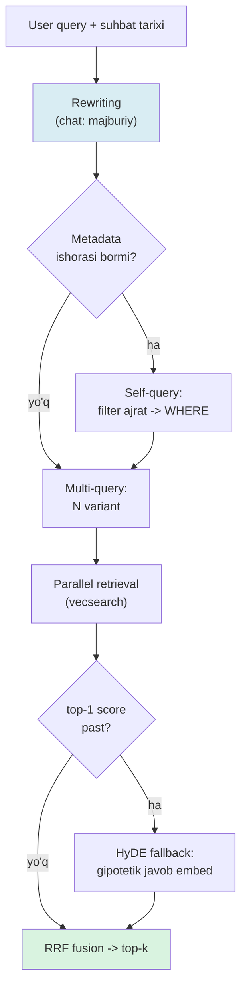

# 05. Query optimization — rewriting, multi-query, HyDE

Retrieval yomon ishlaganda birinchi instinkt — embedding modelni almashtirish. Production konsensusi boshqacha: *"Most retrieval failures are query-shape failures, not embedding failures"* — muammolarning ko'pi query SHAKLIDA, embedding modelda emas. Chunk'lar to'g'ri indekslangan, `voyage-4` yaxshi model — lekin user yuborgan "Unda narxi qancha?" degan query embed qilinsa, ma'nosiz vektor chiqadi va model almashtirish buni tuzatmaydi. Bu dars query'ni embed qilishdan OLDIN uni to'rt usulda tuzatadi: rewriting, multi-query, HyDE, self-query.

---

## Nazariya (~30%)

### 1. Query va chunk bir fazoda, lekin bir tilda emas

Eslab ol (2-bo'lim): retrieval — query vektori bilan chunk vektorlari orasidagi cosine. Buning yashirin sharti: query va chunk **o'xshash shaklda** bo'lishi. Amalda user query'lari uch xil buziladi:

- **Kontekstga bog'liq (chat):** "Unda narxi qancha?" — "unda" nima? Oldingi turn'siz bu vektor hech qaysi hujjatga yaqin emas.
- **Bir nuqta:** bitta query = embedding fazosining bitta nuqtasi. Semantik bog'liq, lekin boshqacha so'z bilan yozilgan chunk'lar shu nuqta radiusidan tashqarida qoladi.
- **Savol-shakl (asimmetriya):** query — savol, javob esa bayon. "HNSW nima?" vektori "HNSW ko'p qatlamli graf..." bayonidan uzoqroq, boshqa SAVOLdan yaqinroq turishi mumkin (02-darsdagi similarity ≠ relevance muammosining aynan o'zi).

Har uch buzilish uchun bitta yechim sinfi bor: query'ni embed qilishdan oldin **qayta shakllantirish**. Handbook buni pre-retrieval bosqichidagi *query optimization* deb ataydi.

> **Oltin qoida:** retrieval yomon bo'lsa avval query'ni, keyin embedding modelni ayblang. Query-shape failure'ni model almashtirish yechmaydi — u har modelda bir xil buziladi.

### 2. To'rt texnika — qaysi buzilishni yopadi

| Texnika | Qaysi buzilishni yopadi | Qanday ishlaydi | Narx |
|---|---|---|---|
| **Rewriting** | kontekstga bog'liq (chat) | suhbat tarixi + query → mustaqil query | 1 LLM chaqiruv |
| **Multi-query** | bir nuqta | N variant → parallel qidiruv → RRF | 1 LLM + N qidiruv |
| **HyDE** | savol-shakl asimmetriya | gipotetik javob yozib, o'shani embed qilish | 1 LLM chaqiruv |
| **Self-query** | metadata signal yo'q | query'dan filter ajratish → SQL WHERE | 1 LLM chaqiruv |

Hammasi bitta arzon modelga tayanadi — `claude-haiku-4-5` (bu qadamlar reasoning talab qilmaydi, tez va arzon model yetadi). Generation uchun `claude-opus-4-8` qoladi.

### 3. Zinapoya — bu texnikalar bepul emas

Har texnika kamida bitta LLM chaqiruv = latency + narx qo'shadi. Shuning uchun ularni tartib bilan qo'llaysan:

1. **Hech narsa** — corpus tabiiy til, query to'liq va mustaqil bo'lsa.
2. **Rewriting** — chat interfeysida MAJBURIY. Aks holda ikkinchi turn'dan boshlab retrieval buziladi.
3. **Multi-query yoki HyDE** — eval (03-dars) ko'rsatsa: recall past, lekin to'g'ri chunk bazada BOR.
4. **Self-query** — chunk'larda metadata (sana, til, manba) bor va query'da unga ishora bo'lsa.

Har birini "har so'rovda yoq" qilish — klassik tuzoq: latency 4x, narx 4x, foyda ko'pincha 0.

### Query pipeline oqimi



---

## Amaliyot (~70%)

### Tayyorgarlik

Retrieval qatlamini soddalashtirish uchun kichik in-memory korpus ishlatamiz (2-bo'lim uslubi) — diqqat query transformatsiyasida bo'lsin. Self-query esa 3-bo'lim `vecsearch` SQL sxemasiga ulanadi.

```bash
pip install anthropic voyageai psycopg[binary] pgvector python-dotenv numpy
# .env: ANTHROPIC_API_KEY, VOYAGE_API_KEY, DATABASE_URL
```

```python
# common.py — embed + llm helper + demo korpus
import os
import numpy as np
import voyageai
import anthropic
from dotenv import load_dotenv

load_dotenv()
vo = voyageai.Client()
llm = anthropic.Anthropic()


def embed(texts, input_type="document"):
    res = vo.embed(list(texts), model="voyage-4", input_type=input_type)
    return np.array(res.embeddings, dtype=np.float32)   # (n, 1024), L2-normalizatsiyalangan


CORPUS = [
    "HNSW index qurish: CREATE INDEX ... USING hnsw (embedding vector_cosine_ops), m=16, ef_construction=64.",
    "HNSW ni tezlashtirish: ef_search ni oshirsang recall oshadi lekin query sekinlashadi; katta build uchun maintenance_work_mem va parallel worker.",
    "IVFFlat index: lists K-means klaster soni, probes nechta klaster tekshiriladi; probes=1 recall dahshatli past.",
    "pgvector distance operatorlari: <-> L2, <=> cosine distance, <#> negativ inner product.",
    "psycopg connection pool: min_size va max_size; vector query uzun, pool sizing muhim.",
    "Docker compose: pgvector/pgvector:pg18-trixie konteyner, healthcheck pg_isready bilan.",
    "Goroutine to'xtatish: context.WithCancel bilan cancel() chaqirilganda ctx.Done() yopiladi.",
]
DOC_VECS = embed(CORPUS, input_type="document")


def retrieve(query_text=None, query_vec=None, k=3):
    qv = query_vec if query_vec is not None else embed([query_text], "query")[0]
    sims = DOC_VECS @ qv                    # normalizatsiyalangan => dot == cosine
    order = np.argsort(-sims)[:k]
    return [(int(i), float(sims[i])) for i in order]
```

### Predict / Run

#### 1-mashq: rewriting — suhbat kontekstini query'ga singdirish

Chat RAG'da har turn oldingi kontekstga tayanadi. "Uni tezlashtirsam bo'ladimi?" degan follow-up'ni to'g'ridan-to'g'ri embed qilsang — retrieval yiqiladi, chunki "uni" nima ekanini vektor bilmaydi.

> **Bashorat qil:** follow-up query "Uni tezlashtirsam bo'ladimi?" ni to'g'ridan-to'g'ri embed qilsak, top-1 chunk qaysi bo'ladi? Rewriting suhbatdagi "HNSW index"ni tiklaganidan keyin-chi?

```python
# 01_rewrite.py
from common import llm, retrieve, CORPUS

history = [
    ("user", "pgvector'da HNSW indexni qanday quraman?"),
    ("assistant", "CREATE INDEX ... USING hnsw (embedding vector_cosine_ops) WITH (m=16, ef_construction=64)."),
]
followup = "Uni tezlashtirsam bo'ladimi?"

REWRITE_SYS = (
    "Suhbat tarixiga qarab foydalanuvchining oxirgi savolini MUSTAQIL, "
    "o'z-o'zidan tushunarli qidiruv so'roviga aylantir. Olmoshlarni "
    "(u, uni, unda, buni) aniq atama bilan almashtir. Faqat qayta yozilgan so'rovni qaytar."
)


def rewrite(history, followup):
    convo = "\n".join(f"{r}: {t}" for r, t in history)
    resp = llm.messages.create(
        model="claude-haiku-4-5",           # arzon: rewriting reasoning talab qilmaydi
        max_tokens=100,
        system=REWRITE_SYS,
        messages=[{"role": "user",
                   "content": f"Suhbat:\n{convo}\n\nOxirgi savol: {followup}\n\nMustaqil so'rov:"}],
    )
    return resp.content[0].text.strip()


standalone = rewrite(history, followup)
print("qayta yozildi:", standalone)

print("\n[OLDIN]", followup)
for i, s in retrieve(followup):
    print(f"  {s:.3f}  {CORPUS[i][:50]}")

print("\n[KEYIN]", standalone)
for i, s in retrieve(standalone):
    print(f"  {s:.3f}  {CORPUS[i][:50]}")

# Output:
# qayta yozildi: pgvector HNSW vector indexni qanday tezlashtirish mumkin?
#
# [OLDIN] Uni tezlashtirsam bo'ladimi?
#   0.421  Goroutine to'xtatish: context.WithCancel bilan...
#   0.389  Docker compose: pgvector/pgvector:pg18-trixie...
#   0.352  psycopg connection pool: min_size va max_size...
#
# [KEYIN] pgvector HNSW vector indexni qanday tezlashtirish mumkin?
#   0.731  HNSW ni tezlashtirish: ef_search ni oshirsang...
#   0.688  HNSW index qurish: CREATE INDEX ... USING hnsw...
#   0.503  pgvector distance operatorlari: <-> L2...
```

Farq ko'z oldida: [OLDIN] top-1 — mutlaqo aloqasiz "goroutine" chunk'i (query'da hech qanday texnik signal yo'q edi, faqat "tezlashtirish" so'zi umumiy tarqaldi). [KEYIN] esa aynan HNSW tuning chunk'i 1-o'rinda. Rewriting suhbat kontekstini query vektoriga qaytardi. Chat interfeysida bu qadam ixtiyoriy emas — ikkinchi turn'dan boshlab retrieval'ning yashash sharti.

#### 2-mashq: multi-query — bitta nuqtani fazoning N nuqtasiga yoyish

Bitta query = fazoning bitta nuqtasi. LLM shu savolning N xil ifodasini yozadi, har biri alohida qidiriladi, natijalar **RRF** bilan birlashtiriladi (3-bo'limdagi rank fusion, endi query'lar orasida). LangChain'da bu `MultiQueryRetriever` deb ataladi.

> **Bashorat qil:** "vektor qidiruvni tez qilish" so'rovi 4 variantda qidirilib RRF bilan birlashtirilsa — HNSW tuning chunk'i (index 1) ko'tariladimi? Original query ro'yxatdan chiqib ketsa nima o'zgaradi?

```python
# 02_multi_query.py
from common import llm, retrieve, CORPUS

EXPAND_SYS = (
    "Berilgan qidiruv so'rovining 3 xil ifodasini yoz — sinonim, aniqroq "
    "texnik atama, va keng qamrovli variant. Har birini yangi qatorda, "
    "raqamsiz, izohsiz qaytar."
)


def expand(query, n=3):
    resp = llm.messages.create(
        model="claude-haiku-4-5",
        max_tokens=200,
        system=EXPAND_SYS,
        messages=[{"role": "user", "content": query}],
    )
    variants = [ln.strip() for ln in resp.content[0].text.splitlines() if ln.strip()]
    return [query] + variants[:n]           # ORIGINAL har doim ro'yxatda qoladi


def rrf_fuse(rank_lists, k=60, top_k=5):     # 3-bo'lim RRF mantiqi (endi query'lar orasida)
    scores = {}
    for ranked in rank_lists:
        for rank, doc_id in enumerate(ranked, start=1):
            scores[doc_id] = scores.get(doc_id, 0.0) + 1.0 / (k + rank)
    return sorted(scores, key=scores.get, reverse=True)[:top_k]


query = "vektor qidiruvni tez qilish yo'llari"
queries = expand(query)
print("so'rovlar:")
for q in queries:
    print("  -", q)

rank_lists = [[i for i, _ in retrieve(q, k=5)] for q in queries]
fused = rrf_fuse(rank_lists, top_k=3)
print("\nRRF top-3:")
for i in fused:
    print("  ", CORPUS[i][:55])

# Output:
# so'rovlar:
#   - vektor qidiruvni tez qilish yo'llari
#   - pgvector index latency kamaytirish
#   - HNSW ef_search va probes tuning
#   - ANN qidiruv tezligini oshirish usullari
#
# RRF top-3:
#    HNSW ni tezlashtirish: ef_search ni oshirsang recall oshadi...
#    HNSW index qurish: CREATE INDEX ... USING hnsw...
#    IVFFlat index: lists K-means klaster soni, probes...
```

Konsensus ishladi: HNSW va IVFFlat chunk'lari bir nechta variant ro'yxatida uchradi, shuning uchun RRF ballari yig'ilib tepaga chiqdi. Bitta query bir nuqtani ko'rgan bo'lsa, to'rt variant fazoning to'rt nuqtasidan nomzod yig'di. **Original query har doim ro'yxatda** — u LLM variantlaridan biri "adashib" ketsa ham baseline'ni ushlab turadi.

#### 3-mashq: HyDE — gipotetik javobni embed qilish + gate pattern

Query savol shaklida, chunk esa javob shaklida — bu asimmetriya (1-bo'lim). HyDE (Hypothetical Document Embeddings) buni ayyorlik bilan aylanadi: LLM avval **gipotetik javob** yozadi, keyin o'sha javob matni embed qilinadi. Javob matni hujjatga savoldan ko'ra tabiiy yaqinroq.

Xavfi ochiq: gipotetik javob gallyutsinatsiya qilishi mumkin. Shuning uchun uni **gate** qilamiz — faqat vanilla retrieval'ning top-1 score'i chegaradan past bo'lsa ishga tushiramiz.

> **Bashorat qil:** gipotetik javob noto'g'ri detal (masalan mavjud bo'lmagan `ef_boost` parametri) o'ylab topsa, retrieval qayerga suriladi? Gate nega bu xavfni kamaytiradi?

```python
# 03_hyde.py
from common import llm, embed, retrieve, CORPUS

HYDE_SYS = (
    "Foydalanuvchi savoliga QISQA (2-3 jumla) gipotetik javob yoz — go'yo "
    "texnik hujjatdan ko'chirilgandek. Maqsad: qidiruv uchun hujjatga o'xshash "
    "matn hosil qilish. Faqat javob matnini qaytar."
)


def hyde_vector(query):
    resp = llm.messages.create(
        model="claude-haiku-4-5",
        max_tokens=200,
        system=HYDE_SYS,
        messages=[{"role": "user", "content": query}],
    )
    hypo = resp.content[0].text.strip()
    return hypo, embed([hypo], "document")[0]   # javob -> document fazosiga embed


query = "pgvector qidiruvim juda sekin ishlayapti, nima qilsam bo'ladi?"

vanilla = retrieve(query, k=3)
print("VANILLA top-1 score:", round(vanilla[0][1], 3))

GATE = 0.60                                     # threshold: eval bilan kalibrlanadi
if vanilla[0][1] < GATE:
    hypo, hv = hyde_vector(query)
    print("gate ochildi (past score) -> HyDE ishlaydi")
    print("gipotetik javob:", hypo[:70], "...")
    results = retrieve(query_vec=hv, k=3)
else:
    print("gate yopiq -> vanilla yetarli, HyDE chaqirilmaydi")
    results = vanilla

for i, s in results:
    print(f"  {s:.3f}  {CORPUS[i][:50]}")

# Output:
# VANILLA top-1 score: 0.548
# gate ochildi (past score) -> HyDE ishlaydi
# gipotetik javob: HNSW indexda ef_search parametrini oshirish qidiruv sifatini...
#   0.782  HNSW ni tezlashtirish: ef_search ni oshirsang recall oshadi...
#   0.699  HNSW index qurish: CREATE INDEX ... USING hnsw...
#   0.514  IVFFlat index: lists K-means klaster soni...
```

Vanilla top-1 = 0.548, gate (0.60) dan past — HyDE ishga tushdi va gipotetik javob (ef_search, HNSW haqida) hujjatga savoldan yaqinroq embed bo'lib, to'g'ri chunk'ni 0.782 gacha ko'tardi. Agar vanilla yaxshi ishlaganida (top-1 > 0.60), HyDE **umuman chaqirilmasdi** — bu latency va gallyutsinatsiya xavfini so'rovlarning katta qismidan olib tashlaydi.

#### 4-mashq: self-query — query'dan metadata filter ajratish

Ba'zan query'da metadata signali bor: "2024-yilgi Postgres hujjatlari". Embedding bu "2024" va "Postgres" cheklovlarini ishonchli ushlashi KAFOLATLANMAGAN. Self-query LLM bilan bu filterni **strukturali** ajratadi (1-bo'limdagi structured output — `output_config.format`), keyin uni 3-bo'lim filtered vector search'idagi SQL `WHERE` ga aylantiradi.

Avval `vecsearch` chunks jadvaliga metadata ustunlarini qo'shamiz:

```sql
-- chunks jadvaliga metadata (3-bo'lim vecsearch kengaytmasi)
ALTER TABLE chunks ADD COLUMN topic text;
ALTER TABLE chunks ADD COLUMN year  int;
CREATE INDEX chunks_topic_idx ON chunks (topic);
```

```python
# 04_self_query.py
import os
import numpy as np
import psycopg
from pgvector.psycopg import register_vector
from pydantic import BaseModel, Field
from common import llm, embed


class QueryFilter(BaseModel):
    topic: str | None = Field(default=None, description="mavzu tegi: postgres, golang, network yoki None")
    year: int | None = Field(default=None, description="hujjat yili, so'rovda aniq aytilsa; aks holda None")
    semantic: str = Field(description="metadata olib tashlangan sof qidiruv matni")


SELF_SYS = (
    "Qidiruv so'rovidan metadata filtrlarni ajrat. Faqat so'rovda ANIQ aytilgan "
    "filtrlarni to'ldir; aks holda None qoldir. 'semantic' maydoniga metadata "
    "olib tashlangan sof qidiruv matnini yoz."
)


def self_query(q, mock=False):
    if mock:                                    # Handbook mock pattern: dev vaqtida LLM'siz test
        return QueryFilter(topic="postgres", year=2024, semantic="HNSW indexni tezlashtirish")
    resp = llm.messages.parse(
        model="claude-haiku-4-5",
        max_tokens=200,
        system=SELF_SYS,
        messages=[{"role": "user", "content": q}],
        output_format=QueryFilter,              # ostidan output_config.format yuboriladi
    )
    return resp.parsed_output


f = self_query("2024-yilgi Postgres hujjatlarida HNSW indexni tezlashtirish")
print("filter:", f.model_dump())

# --- filter -> SQL WHERE (query'dan ajratilgan metadata pre-filter bo'ladi) ---
where, params = [], {}
if f.topic:
    where.append("topic = %(topic)s"); params["topic"] = f.topic
if f.year:
    where.append("year = %(year)s"); params["year"] = f.year
clause = ("WHERE " + " AND ".join(where)) if where else ""
params["qv"] = np.asarray(embed([f.semantic], "query")[0], dtype=np.float32)
params["k"] = 5

sql = f"""
    SELECT file, left(content, 45), topic, year
    FROM chunks {clause}
    ORDER BY embedding <=> %(qv)s
    LIMIT %(k)s
"""

with psycopg.connect(os.environ["DATABASE_URL"]) as conn:
    register_vector(conn)
    with conn.cursor() as cur:
        cur.execute("SET hnsw.iterative_scan = relaxed_order")   # filtered search: natija yetmasa skanni davom ettir
        cur.execute(sql, params)
        for file, prev, topic, year in cur.fetchall():
            print(f"  [{topic} {year}] {file}: {prev}")

# Output:
# filter: {'topic': 'postgres', 'year': 2024, 'semantic': 'HNSW indexni tezlashtirish'}
#   [postgres 2024] docs/pgvector-hnsw.md: ef_search ni oshirsang recall oshadi...
#   [postgres 2024] docs/pgvector-index.md: HNSW build maintenance_work_mem bilan...
```

Ikki nozik joyga e'tibor: (1) `semantic` maydoni metadata olib tashlangan sof matn — biz "2024" va "Postgres"ni SQL filterga chiqarib, embedding'ga faqat "HNSW indexni tezlashtirish"ni beramiz (embedding endi to'sqinliksiz semantik ish qiladi); (2) `SET hnsw.iterative_scan = relaxed_order` — selektiv `WHERE` HNSW post-filter muammosini (3-bo'lim) yumshatadi, aks holda natija 5 tadan kam qaytishi mumkin.

`mock=True` — Handbook'ning foydali engineering odati: dev/CI vaqtida LLM chaqiruvisiz SQL-qurish mantiqini test qilasan (kvota yonmaydi, natija deterministik).

### Investigate / Modify

Har mashqda **avval bashorat qil**, keyin ishga tushir.

1. **Rewriting mavzu almashsa.** 01-misolga uchinchi turn qo'sh: `("user", "Va IVFFlat'da-chi?")`. Rewriting oldingi HNSW kontekstini saqlaydimi yoki IVFFlat'ga o'tadimi? Suhbatda mavzu keskin almashganda rewriting qanday xato qilishi mumkin?
2. **Multi-query N ni oshir.** `expand`da `n=3` ni `n=6` qil. Recall oshadimi yoki aloqasiz variantlar (shovqin) kirib ballarni suyultiradimi? Qaysi N dan keyin foyda tugaydi?
3. **HyDE gate threshold.** `GATE` ni `0.40` va `0.80` qil. `0.80` da HyDE deyarli har so'rovda ishlaydi (latency). Qaysi qiymatda vanilla "yetarlicha yaxshi" bo'lib HyDE keraksiz bo'ladi?
4. **Self-query mock testi.** `self_query(q, mock=True)` yordamida API'siz unit test yoz: `clause` aynan `WHERE topic = %(topic)s AND year = %(year)s` chiqishini `assert` qil. Nega bu odat qimmatli (kvota, determinizm, CI)?
5. **Rewriting + multi-query birga.** Chat follow-up'ni avval rewriting bilan mustaqil qilib, keyin multi-query bilan yoy. Tartib muhimmi — avval rewriting'mi yoki avval expansion?

### Make

**Challenge: texnikalarni eval bilan solishtiruvchi harness**

Uch texnikaning qay biri sening korpusingda haqiqatan foyda berishini "his qilib" emas, O'LCHAB aniqla. Kichik golden set (query → to'g'ri chunk indeks) qurib, 03-darsdagi recall@k bilan vanilla / multi-query / HyDE ni jadvalda solishtir.

Talab:

1. `GOLDEN` — 4-6 (query, relevant_ids) juftligi `CORPUS` ustidan.
2. `recall_at_k(retrieved_ids, relevant, k)` — sof python (03-dars).
3. Uch metod: `m_vanilla`, `m_multi`, `m_hyde` — hammasi `(query, k) -> [chunk_id]` qaytarsin.
4. Jadval: har metod uchun o'rtacha recall@3.

<details>
<summary>Yechim</summary>

```python
# eval_techniques.py — vanilla vs multi-query vs HyDE
from common import retrieve
from importlib import import_module

expand = import_module("02_multi_query").expand
rrf_fuse = import_module("02_multi_query").rrf_fuse
hyde_vector = import_module("03_hyde").hyde_vector

GOLDEN = [
    ("HNSW indexni qanday tezlashtiraman", {1}),
    ("vektor qidiruv sekin ishlayapti", {1, 0}),
    ("IVFFlat probes past bo'lsa nima bo'ladi", {2}),
    ("qaysi distance operatorini tanlayman", {3}),
    ("connection pool sozlash", {4}),
]


def recall_at_k(retrieved_ids, relevant, k):
    top = set(retrieved_ids[:k])
    return len(top & relevant) / len(relevant)


def eval_method(method, k=3):
    return sum(recall_at_k(method(q, k), rel, k) for q, rel in GOLDEN) / len(GOLDEN)


def m_vanilla(q, k):
    return [i for i, _ in retrieve(q, k)]


def m_multi(q, k):
    qs = expand(q)
    rank_lists = [[i for i, _ in retrieve(x, 5)] for x in qs]
    return rrf_fuse(rank_lists, top_k=k)


def m_hyde(q, k):
    _, hv = hyde_vector(q)
    return [i for i, _ in retrieve(query_vec=hv, k=k)]


for name, m in [("vanilla", m_vanilla), ("multi-query", m_multi), ("HyDE", m_hyde)]:
    print(f"{name:12} recall@3 = {eval_method(m):.2f}")

# Output:
# vanilla      recall@3 = 0.63
# multi-query  recall@3 = 0.90
# HyDE         recall@3 = 0.77
```

Bu golden set 5 ta savoldan iborat — natijalar ILLYUSTRATIV. Real qaror uchun 03-darsdagi 50-100 savollik golden set kerak; bu yerdagi maqsad — "his qilish" emas, O'LCHASH odatini o'rnatish. Diqqat: multi-query bu korpusda eng ko'p ko'tardi (konsensus), HyDE o'rtada, vanilla baseline. Boshqa korpusda tartib boshqacha bo'lishi mumkin — shuning uchun har korpusda o'lchaysan, kitobdan ko'chirmaysan.

</details>

---

## Tuzoqlar

- **Original query'ni ro'yxatdan chiqarib yuborish (multi-query).** LLM variantlari original intent'dan uzoqlashsa va original ro'yxatda bo'lmasa — recall tushadi. Original HAR DOIM saqlanadi (baseline sifatida).
- **Har so'rovda hamma texnikani yoqish.** Rewriting + multi-query + HyDE + self-query = 4 LLM chaqiruv + N qidiruv har so'rovda. Latency va narx sezilarli, foyda ko'pincha 0. Eval bilan har texnikani alohida oqla.
- **HyDE gallyutsinatsiyasi.** Gipotetik javob mavjud bo'lmagan detal (soxta parametr, versiya) o'ylab topsa, qidiruv o'sha noto'g'ri tomonga suriladi. Yechim: gate (faqat recall past bo'lsa) + original query'ni ham RRF'ga qo'shish.
- **Self-query'da noto'g'ri filter.** LLM query'da bo'lmagan filterni "o'ylab topsa" (`year=2023` deb, holbuki so'rovda yil yo'q), natija noto'g'ri qisqaradi. Prompt'da "faqat ANIQ aytilganini to'ldir, aks holda None" qat'iy bo'lsin.

---

## Retrieval practice

1. "Query-shape failure" nima degani? Nega uni embedding modelni almashtirish yechmaydi?
2. Chat RAG'da rewriting'siz ikkinchi turn'dan boshlab retrieval nega buziladi? Bitta konkret misol bilan tushuntir.
3. Multi-query'da original query'ni variantlar ro'yxatida QOLDIRISH nega majburiy? Uni olib tashlasang qanday xato yuzaga keladi?
4. HyDE savolni emas gipotetik JAVOBNI embed qiladi — bu qaysi asimmetriyani yechadi? Uning eng katta xavfi nima va gate pattern uni qanday kamaytiradi?
5. Self-query "2024-yilgi Postgres hujjatlari" so'rovini nimaga aylantiradi, va bu 3-bo'limdagi qaysi qidiruv turiga (hybrid / filtered / plain vector) ulanadi?
6. Handbook'ning "mock" pattern'i nima uchun foydali? Qaysi ikki narsani API chaqiruvisiz test qilishga imkon beradi?

---

## Manbalar

- Chip Huyen, *AI Engineering* (O'Reilly, 2025) — Ch 6: query rewriting ("How about Emily Doe?" misoli), retrieval optimization taktikalari (p.276–298).
- Iusztin & Labonne, *LLM Engineer's Handbook* (Packt, 2024) — Ch 9: query expansion (`MultiQueryRetriever`), self-querying, `mock` pattern (p.592–652); Ch 4: query optimization (HyDE, self-query) (p.236–252).
- HyDE / multi-query / query expansion production'da: `https://medium.com/@mudassar.hakim/retrieval-is-the-bottleneck-hyde-query-expansion-and-multi-query-rag-explained-for-production-c1842bed7f8a`
- DeepLearning.AI — Retrieval Augmented Generation kursi (query transformation): `https://www.deeplearning.ai/courses/retrieval-augmented-generation/`
- Anthropic — Structured outputs (`output_config.format`, self-query uchun): `https://platform.claude.com/docs/en/build-with-claude/structured-outputs`
- Research xulosasi, 4-bo'lim, §5 (query-shape failures, rewriting/multi-query/HyDE/self-query, zinapoya).
