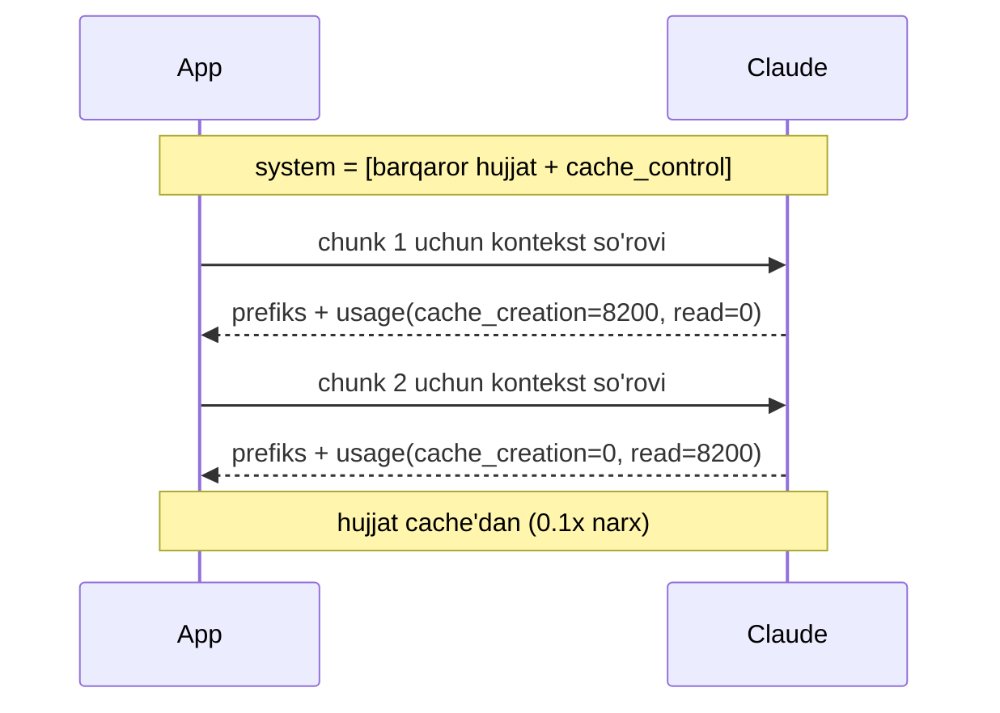

# 06. Advanced indexing — parent-document va contextual retrieval

02-darsda chunk hajmi dilemmasini ko'rgansan: kichik chunk aniq topiladi lekin kontekst yo'qoladi, katta chunk kontekstli lekin embedding aniqligi past. Bu dilemmani chunk hajmini "to'g'rilashga" urinib yechib bo'lmaydi — u index tomonida, **qidirish birligini berish birligidan AJRATIB** yechiladi. Ikki texnika: parent-document retrieval (kichik chunk bilan qidir, katta parent'ni ber) va Anthropic'ning contextual retrieval'i (har chunk oldiga LLM yozgan kontekst prefiksi, prompt caching bilan arzon). Rasmiy raqamlar: contextual retrieval retrieval failure'ni -49%, reranking bilan -67% kamaytiradi.

---

## Nazariya (~30%)

### 1. Bitta chunk ikki vazifani bajaraolmaydi

Retrieval unit (embed qilinadigan, qidiriladigan bo'lak) va generation unit (LLM'ga kontekst sifatida beriladigan bo'lak) — ikki xil talab:

| | Retrieval xohlaydi | Generation xohlaydi |
|---|---|---|
| Hajm | kichik, fokusli | keng |
| Sabab | aniq embedding, kam shovqin | javob uchun yetarli material |

Bitta hajm ikkalasini ham qondirolmaydi — kichik qilsang generation kontekstsiz qoladi, katta qilsang embedding "loyqalanadi". Yechim: ikki birlikni **ajratish**.

### 2. Small-to-big / parent document retrieval

KICHIK bola (child) chunk bilan qidir → uning KATTA parent'ini (bo'lim yoki hujjat) LLM'ga ber. Score kichik chunk'dan (aniq moslik), kontekst parent'dan (to'liq material). Broad-context savollarda 15-30% yaxshilanish; sof faktik lookup'da shart emas.

Ikki implementatsiya:
- **(a) parent_id mapping jadval** — chunks jadvaliga `parent_id` + alohida `parents` jadvali (bizning SQL yo'li).
- **(b) sentence-window** — topilgan gap atrofidagi oynani qaytarish (DeepLearning.AI advanced RAG kursining asosiy texnikasi).

### 3. Auto-merging retrieval

Bitta parent'ning **>=2 bolasi** top-N'ga tushsa — alohida bolalarni emas, parent'ning o'zini qaytar. Ko'p bola bir parent'dan chiqishi — kuchli konsensus signali: javob o'sha butun bo'limda.


### 4. Contextual retrieval (Anthropic) — chunk'ni kontekstga joylashtirish

Muammo: chunk hujjatdan uzib olinganda ishoralar ma'nosini yo'qotadi. "Q3 daromadi 3% oshdi" — qaysi kompaniya, qaysi yil? Embedding bu chunk'ni to'g'ri joyga qo'yolmaydi, chunki kontekst yo'qolgan.

Yechim: har chunk oldiga LLM yozgan **50-100 tokenlik kontekst prefiksi** qo'shiladi ("Bu ACME Corp 2023 Q3 moliyaviy hisobotidan; oldingi choraklar bilan taqqoslash bo'limidan:"), KEYIN embed + BM25 index qilinadi. Anthropic rasmiy raqamlari (top-20 retrieval failure rate, kombinatsiyalar):

| Usul | Failure rate | Yaxshilanish |
|---|---|---|
| Baseline (oddiy chunk) | 5.7% | — |
| + contextual embeddings | 3.7% | **-35%** |
| + contextual BM25 (hybrid) | 2.9% | **-49%** |
| + reranking | 1.9% | **-67%** |

Diqqat: bu bo'lim texnikalarining **kombinatsiyasi**. Contextual BM25 = 3-bo'lim tsvector index'iga prefiksli matnni kiritish (prefiks ham qidiriladi); reranking = 04-dars. Ya'ni -67% raqami uch darsning birga ishlashidan keladi.

### 5. Prompt caching iqtisodi — nega prefiksisiz qimmat

Har chunk uchun prefiks generatsiya qilish = har chunk uchun butun hujjatni LLM'ga yuborish. 100 chunk'li hujjatda hujjat **100 marta** yuboriladi → input token narxi ko'payadi.

Yechim: hujjatni bir marta cache'ga yoz (`cache_control: {"type": "ephemeral"}`), keyingi har chunk so'rovi cache'dan o'qiydi (cache read narxi = oddiy input'ning **0.1x**). Anthropic hisobi: **prompt caching bilan ~$1.02 / 1M hujjat token** — caching'siz bu bir necha barobar qimmat.

**Prefiks-match qoidasi (kritik):** cache faqat prompt'ning boshidan mos kelgan qismini qayta ishlatadi. Demak **barqaror kontent (butun hujjat) OLDIN, o'zgaruvchan kontent (aynan shu chunk) KEYIN** joylashishi shart. Tartib buzilsa — o'zgaruvchan chunk boshda bo'lsa — har so'rov cache'ni buzadi va tejash yo'qoladi.

> **Oltin qoida:** contextual retrieval prefiksni chunk oldiga qo'yib qidiruv ANIQLIGINI oshiradi; prompt caching esa uni ARZON qiladi. Ikkalasi birga ishlaydi — biri sifat, biri narx.



---

## Amaliyot (~70%)

### Tayyorgarlik

3-bo'lim `vecsearch` chunks jadvali (pgvector, HNSW) tayyor deb faraz qilamiz. Unga parent qatlamini qo'shamiz.

```bash
pip install anthropic voyageai psycopg[binary] pgvector python-dotenv numpy
# .env: ANTHROPIC_API_KEY, VOYAGE_API_KEY, DATABASE_URL
```

```python
# common.py — embed + llm helper (avvalgi darslardan)
import os
import numpy as np
import voyageai
import anthropic
from dotenv import load_dotenv

load_dotenv()
vo = voyageai.Client()
llm = anthropic.Anthropic()


def embed(texts, input_type="document"):
    res = vo.embed(list(texts), model="voyage-4", input_type=input_type)
    return np.array(res.embeddings, dtype=np.float32)
```

### Predict / Run

#### 1-mashq: parents jadvali + small-to-big JOIN

Avval sxema: `parents` jadvali (katta bo'limlar) + `chunks.parent_id` (kichik bola qaysi parent'ga tegishli). Bola chunk embedding bilan qidiriladi, parent kontekst JOIN bilan qaytariladi.

```sql
-- parents.sql — vecsearch chunks kengaytmasi (small-to-big)
CREATE TABLE IF NOT EXISTS parents (
    id      bigserial PRIMARY KEY,
    file    text NOT NULL,
    section text NOT NULL,            -- katta bo'lim / hujjat matni (LLM kontekstiga boradi)
    UNIQUE (file, section)
);

ALTER TABLE chunks ADD COLUMN parent_id bigint REFERENCES parents(id);
CREATE INDEX chunks_parent_idx ON chunks (parent_id);
```

Endi ingestion tomoni: hujjatni **ikki granularlikda** yozamiz. Parent = mantiqiy bo'lim (markdown sarlavhasi bo'yicha, 2-bo'lim `chunker`iga o'xshash); bola = o'sha parent ichidagi kichik oyna. Parent embed QILINMAYDI (u faqat kontekst uchun), faqat bolalar embed qilinadi.

```python
# 00_index_parents.py — parent (bo'lim) + child (kichik chunk) yozish
import os
import re
import numpy as np
import psycopg
from pgvector.psycopg import register_vector
from common import embed


def split_children(section, size=60, overlap=15):     # bo'lim ichida kichik oynalar
    words = section.split()
    if len(words) <= size:
        return [" ".join(words)]
    step = size - overlap
    return [" ".join(words[i:i + size]) for i in range(0, len(words), step)]


def index_doc(conn, file, text):
    sections = [s for s in re.split(r"\n(?=#{1,6}\s)", text) if s.strip()]
    with conn.cursor() as cur:
        for section in sections:                       # 1) parent yoz (embed QILINMAYDI)
            cur.execute("INSERT INTO parents (file, section) VALUES (%s, %s) "
                        "ON CONFLICT (file, section) DO UPDATE SET section = EXCLUDED.section "
                        "RETURNING id", (file, section))
            parent_id = cur.fetchone()[0]

            children = split_children(section)         # 2) kichik bolalar -> embed
            vecs = embed(children, "document")
            for i, (ch, v) in enumerate(zip(children, vecs)):
                cur.execute(
                    "INSERT INTO chunks (file, chunk_ix, content, file_hash, embedding, parent_id) "
                    "VALUES (%s, %s, %s, %s, %s, %s) ON CONFLICT (file, chunk_ix) DO NOTHING",
                    (file, i, ch, "hash", np.asarray(v, dtype=np.float32), parent_id))
    conn.commit()


with psycopg.connect(os.environ["DATABASE_URL"]) as conn:
    register_vector(conn)
    index_doc(conn, "docs/pgvector.md",
              "# HNSW\nef_search default 40, LIMIT'dan katta bo'lishi kerak. m=16 default.\n"
              "# IVFFlat\nprobes klaster sonini belgilaydi, default 1 recall past.")
    with conn.cursor() as cur:
        cur.execute("SELECT count(*) FROM parents")
        cur.execute("SELECT count(*), count(DISTINCT parent_id) FROM chunks")
        print("chunks va parent bog'lanishi:", cur.fetchone())

# Output:
# chunks va parent bog'lanishi: (4, 2)
```

Muhim qaror: parent'lar embed **qilinmaydi** — ular index'da qidirilmaydi, faqat `parent_id` orqali JOIN bilan olinadi. Faqat kichik bolalar vektor oladi (embedding precision). Bu small-to-big'ning yuragi: qidirish birligi (bola) va berish birligi (parent) turli granularlikda.

> **Bashorat qil:** query "ef_search nima" bo'lsa — kichik bola chunk "ef_search default 40..." topiladi, lekin LLM'ga uning KATTA parent'i (butun HNSW bo'limi) beriladi. Agar parent butun 30-sahifali hujjat bo'lsa, javob sifati oshadimi yoki tushadimi?

```python
# 01_small_to_big.py
import os
import numpy as np
import psycopg
from pgvector.psycopg import register_vector
from common import embed

SMALL_TO_BIG_SQL = """
    SELECT c.id AS child_id, c.parent_id,
           left(c.content, 45) AS child_preview,
           left(p.section, 70) AS parent_preview,
           c.embedding <=> %(qv)s AS distance
    FROM chunks c
    JOIN parents p ON p.id = c.parent_id
    ORDER BY c.embedding <=> %(qv)s
    LIMIT %(k)s
"""


def small_to_big(conn, query, k=5):
    qv = np.asarray(embed([query], "query")[0], dtype=np.float32)
    with conn.cursor() as cur:
        cur.execute(SMALL_TO_BIG_SQL, {"qv": qv, "k": k})
        rows = cur.fetchall()

    seen, contexts = set(), []                    # parent dedupe: bir parent bir marta
    for child_id, parent_id, child_prev, parent_prev, dist in rows:
        if parent_id in seen:
            continue
        seen.add(parent_id)
        contexts.append({"parent_id": parent_id, "score": round(1.0 - float(dist), 3),
                         "matched": child_prev, "context": parent_prev})
    return contexts


with psycopg.connect(os.environ["DATABASE_URL"]) as conn:
    register_vector(conn)
    for c in small_to_big(conn, "ef_search nima uchun kerak"):
        print(f"score={c['score']}  moslashgan bola: {c['matched']}")
        print(f"    -> LLM kontekst (parent): {c['context']}")

# Output:
# score=0.784  moslashgan bola: ef_search default 40, LIMIT'dan katta bo'lishi kerak
#     -> LLM kontekst (parent): HNSW index sozlamalari: m va ef_construction build vaqtida...
# score=0.612  moslashgan bola: probes klaster sonini belgilaydi, default 1
#     -> LLM kontekst (parent): IVFFlat index: lists K-means klaster soni; probes...
```

Mexanika: `ORDER BY c.embedding <=> qv` — kichik bola vektori bo'yicha aniq moslik topiladi (embedding precision). Lekin `p.section` — parent'ning butun matni — LLM'ga uzatiladi (generation context). Score kichik bola'niki, kontekst katta parent'niki. Parent dedupe muhim: bir parent'dan bir nechta bola topilsa, kontekst bir marta kiritiladi (aks holda LLM'ga takror material ketadi).

#### 2-mashq: contextual retrieval + prompt caching (tejash isboti)

Endi Anthropic'ning contextual retrieval'i. Butun hujjatni `system`ga cache_control bilan joylashtir, har chunk uchun `claude-haiku-4-5` bilan qisqa kontekst prefiksi generatsiya qil. `usage` orqali caching ishlayotganini KO'RSAT.

> **Bashorat qil:** birinchi so'rovda `cache_creation_input_tokens` katta, `cache_read` = 0 bo'ladi. Ikkinchi so'rovda-chi? Agar hujjatni `system`ga emas, har `messages` ichiga (chunk'dan OLDIN) qo'ysang, cache_read nima bo'ladi?

```python
# 02_contextual.py
from pathlib import Path
from common import llm

DOC = Path("corpus/pgvector-guide.md").read_text(encoding="utf-8")   # ~8000 token hujjat

CTX_SYS_STABLE = "Sen hujjat bo'laklariga qisqa qidiruv-konteksti yozadigan yordamchisan."

CONTEXT_PROMPT = (
    "Quyidagi chunk'ni butun hujjat ichida joylashtiradigan QISQA (1 jumla, 50-100 token) "
    "kontekst yoz — qidiruv aniqligini oshirish uchun. Faqat kontekstni qaytar.\n\n"
    "<chunk>\n{chunk}\n</chunk>"
)


def contextualize(chunk):
    resp = llm.messages.create(
        model="claude-haiku-4-5",                 # chunk-kontekst uchun arzon model yetadi
        max_tokens=150,
        system=[
            {"type": "text", "text": CTX_SYS_STABLE},
            {"type": "text",                       # BARQAROR kontent OLDIN
             "text": f"<document>\n{DOC}\n</document>",
             "cache_control": {"type": "ephemeral"}},   # butun hujjat cache'ga
        ],
        messages=[{"role": "user",                 # O'ZGARUVCHAN kontent (chunk) KEYIN
                   "content": CONTEXT_PROMPT.format(chunk=chunk)}],
    )
    u = resp.usage
    return resp.content[0].text.strip(), u.cache_creation_input_tokens, u.cache_read_input_tokens


chunks = [
    "ef_search default 40, LIMIT'dan katta bo'lishi kerak.",
    "probes=1 recall dahshatli past bo'ladi.",
]
for i, ch in enumerate(chunks):
    ctx, created, read = contextualize(ch)
    print(f"chunk {i}: cache_creation={created}  cache_read={read}")
    print(f"  prefiks: {ctx[:65]}")
    print(f"  index matni: [{ctx[:28]}...] {ch}")

# Output:
# chunk 0: cache_creation=8214  cache_read=0        <- birinchi so'rov: hujjat cache'ga yozildi
#   prefiks: pgvector HNSW index sozlamalari bo'limidan; query vaqtidagi...
#   index matni: [pgvector HNSW index sozlamalari...] ef_search default 40...
# chunk 1: cache_creation=0  cache_read=8214        <- ikkinchi so'rov: hujjat cache'dan (0.1x)
#   prefiks: pgvector IVFFlat index bo'limidan; probes klaster sonini...
#   index matni: [pgvector IVFFlat index bo'limidan...] probes=1 recall...
```

Tejash isboti ko'z oldida: chunk 0 da `cache_creation=8214` (hujjat cache'ga yozildi, to'liq narx), chunk 1 da `cache_read=8214` (hujjat cache'dan o'qildi, 0.1x narx). 100 chunk'li hujjatda hujjat 100 marta o'qilardi — caching bilan bir marta yoziladi, 99 marta arzon o'qiladi. **Index matni** = prefiks + asl chunk; aynan shu embed + tsvector'ga kiritiladi (contextual BM25).

#### 3-mashq: prefiksli vs prefikssiz recall@5

Prefiks retrieval'ga qanchalik ta'sir qiladi? Kontekstsiz (ishoralar bilan) chunk'lar va prefiksli chunk'larni embed qilib, kichik golden set'da recall solishtir (03-dars).

> **Bashorat qil:** "U default 40..." kabi kontekstsiz chunk "HNSW ef_search" query'siga topiladimi? Prefiks "pgvector HNSW ef_search sozlamasi:" ni old qismga qo'shsa, recall qanday o'zgaradi?

```python
# 03_prefix_recall.py
import numpy as np
from common import embed

raw = [                                            # hujjatdan uzilgan, ishorali chunk'lar
    "U default 40, LIMIT'dan katta bo'lishi kerak.",           # "u" = ef_search?
    "Bu qiymat 1 bo'lsa recall dahshatli past.",              # "bu" = probes?
    "Goroutine to'xtatish uchun cancel() chaqiriladi.",       # chalg'ituvchi
]
prefixed = [                                       # + contextual prefiks
    "pgvector HNSW ef_search sozlamasi: u default 40, LIMIT'dan katta bo'lishi kerak.",
    "pgvector IVFFlat probes: bu qiymat 1 bo'lsa recall dahshatli past.",
    "Go concurrency: goroutine to'xtatish uchun cancel() chaqiriladi.",
]
GOLDEN = [("HNSW ef_search nechchi bo'lishi kerak", {0}),
          ("IVFFlat probes past bo'lsa nima bo'ladi", {1})]


def recall_at_k(vecs, k=2):
    total = 0.0
    for q, rel in GOLDEN:
        qv = embed([q], "query")[0]
        order = np.argsort(-(vecs @ qv))[:k].tolist()
        total += len(set(order) & rel) / len(rel)
    return total / len(GOLDEN)


print("kontekstsiz recall@2:", round(recall_at_k(embed(raw)), 2))
print("prefiksli   recall@2:", round(recall_at_k(embed(prefixed)), 2))

# Output:
# kontekstsiz recall@2: 0.50
# prefiksli   recall@2: 1.00
```

Kontekstsiz chunk'da "u default 40" — embedding "u" nima ekanini bilmaydi, query'ga zaif mos keladi. Prefiks "pgvector HNSW ef_search sozlamasi:" olmoshni aniq atamaga bog'ladi va recall 0.50 → 1.00 ga ko'tarildi. Bu — Anthropic'ning -35% failure kamayishining mikroskopik ko'rinishi. Prefiks embed'ga ham, tsvector'ga ham kiradi (hybrid'da ikki tomondan foyda).

### Investigate / Modify

Har mashqda **avval bashorat qil**, keyin ishga tushir.

1. **Parent hajmini oshir.** 01-misolda `parents.section` ni butun hujjat (bir necha bo'lim) qilib qo'y. LLM javob sifati oshadimi? Parent 20-sahifa bo'lsa "lost in the middle" (1-bo'lim) qaytadimi? Parent qanchalik katta bo'lishi kerak — bo'limmi, hujjatmi?
2. **Cache prefiks-match'ni buz.** 02-misolda hujjatni `system`dan `messages` ichiga, chunk'dan OLDIN ko'chir. Ikkinchi so'rovda `cache_read` hali ham 8214 mi yoki 0 ga tushdimi? Tejash yo'qoldimi?
3. **Kichik hujjat.** 02-misoldagi `DOC` ni 500 tokenlik kichik matnga almashtir. `cache_creation` va `cache_read` nima bo'ladi? (Ipucha: hujjat minimal cache prefiksidan — Haiku'da ~2048, Opus 4.8'da 4096 token — kichik bo'lsa caching JIMGINA ishlamaydi.)
4. **Contextual BM25.** 03-misoldagi prefiksli chunk'larni `chunks` jadvaliga yozib (`tsv` generated column prefiksni ham indekslaydi), full-text qidiruvda prefiks yordam berishini tekshir. Prefiksdagi "pgvector", "HNSW" so'zlari tsvector'da qidirilishi mumkinmi?
5. **Auto-merge vs dedupe.** 01-misoldagi oddiy dedupe (birinchi bola) o'rniga, bir parent'dan nechta bola topilganini sana. 2+ bola bo'lsa parent'ni, aks holda bola'ni qaytar — bu keyingi Make.

### Make

**Challenge: auto-merging retrieval**

Small-to-big'ni kuchaytir: top-N bola chunk'larni parent bo'yicha guruhla. Agar bir parent'dan **>=2 bola** topilgan bo'lsa — alohida bolalarni emas, parent'ning to'liq matnini qaytar (kuchli konsensus). Yolg'iz bola o'zi qoladi.

Talab:

1. `auto_merge(hits, parents, min_children=2)` — `hits`: `[{"child_id","parent_id","content","score"}]`, `parents`: `{parent_id: text}`.
2. Bir parent'dan `>= min_children` bola bo'lsa → parent qatori (score = bolalarning eng yaxshisi).
3. Yolg'iz bola → o'zi qoladi.
4. Natija score bo'yicha kamayuvchi tartibda.

<details>
<summary>Yechim</summary>

```python
# auto_merge.py — bir parentdan 2+ bola topilsa parent'ni qaytar
from collections import defaultdict


def auto_merge(hits, parents, min_children=2):
    by_parent = defaultdict(list)
    for h in hits:
        by_parent[h["parent_id"]].append(h)

    merged = []
    for pid, children in by_parent.items():
        if len(children) >= min_children:                    # konsensus -> parent
            best = max(c["score"] for c in children)
            merged.append({"type": "parent", "id": pid, "score": best,
                           "content": parents[pid], "merged_children": len(children)})
        else:                                                # yolg'iz bola -> o'zi
            for c in children:
                merged.append({"type": "child", "id": c["child_id"],
                               "score": c["score"], "content": c["content"]})
    return sorted(merged, key=lambda x: x["score"], reverse=True)


if __name__ == "__main__":
    parents = {
        10: "HNSW to'liq bo'lim: qurish (m, ef_construction), query (ef_search), parallel build...",
        20: "IVFFlat to'liq bo'lim: lists, probes, bo'sh jadvalga qurmaslik, REINDEX...",
    }
    hits = [
        {"child_id": 1, "parent_id": 10, "content": "ef_search default 40", "score": 0.78},
        {"child_id": 2, "parent_id": 10, "content": "m=16 default", "score": 0.71},
        {"child_id": 3, "parent_id": 20, "content": "probes=1 past recall", "score": 0.69},
    ]
    for m in auto_merge(hits, parents):
        tag = f"parent (x{m['merged_children']} bola)" if m["type"] == "parent" else "child"
        print(f"{m['score']:.2f}  [{tag}]  {m['content'][:48]}")

    # Output:
    # 0.78  [parent (x2 bola)]  HNSW to'liq bo'lim: qurish (m, ef_construction)
    # 0.69  [child]  probes=1 past recall
```

Parent 10 dan 2 ta bola topildi (ef_search + m) → bolalar o'rniga butun HNSW bo'limi qaytdi (score = eng yaxshi bola 0.78). Parent 20 dan faqat 1 bola → o'zi qoldi. Eslatma: `min_children` va parent hajmi bog'liq — parent juda katta bo'lsa auto-merge "lost in the middle" keltiradi, shuning uchun parent = mantiqiy bo'lim, butun hujjat emas.

</details>

---

## Tuzoqlar

- **Parent juda katta.** Parent butun 30-sahifali hujjat bo'lsa, LLM'ga berilganda "lost in the middle" (1-bo'lim) qaytadi — o'rtadagi javob e'tibordan chetda qoladi. Parent = mantiqiy bo'lim (section), butun hujjat emas.
- **Cache prefiks-match buzilishi.** O'zgaruvchan kontent (chunk) hujjatdan OLDIN qo'yilsa, har so'rov cache'ni buzadi → `cache_read=0`, tejash yo'qoladi. Barqaror kontent (hujjat) HAR DOIM oldin.
- **Kichik hujjatga caching.** Hujjat minimal cache prefiksidan (Haiku ~2048, Opus 4.8 4096 token) kichik bo'lsa, caching jimgina ishlamaydi (`cache_creation` va `cache_read` ikkalasi ham 0/kichik). Kichik korpusga contextual retrieval + caching arziydimi — o'lchab tekshir.
- **200K tokendan kichik bazaga RAG.** Anthropic qoidasi: baza ~200K tokendan kichik bo'lsa RAG ham, contextual retrieval ham kerak emas — to'liq kontekst + prompt caching arzonroq va soddaroq (research §1).
- **Prefiks-only qidiruv.** Faqat prefiksni indekslab asl chunk'ni tashlab yuborish — teskari xato: prefiks kontekst beradi, javob esa asl chunk matnida. Index matni = prefiks + asl chunk.

---

## Retrieval practice

1. Nega bitta chunk hajmi retrieval va generation talablarini bir vaqtda qondirolmaydi? Small-to-big bu ikki talabni qanday ajratadi?
2. Auto-merging qachon parent'ni qaytaradi, qachon bolani? Qaysi signalga tayanadi va nega u "konsensus" deb ataladi?
3. Contextual retrieval prefiksi qaysi muammoni yechadi? "Q3 daromadi 3% oshdi" chunk'i uchun prefiks nimani qo'shadi va bu embedding'ga qanday yordam beradi?
4. Contextual retrieval'da prompt caching bo'lmasa nega qimmat? Prefiks-match qoidasi nima va u buzilsa aynan nima yo'qoladi?
5. Anthropic -67% raqami qaysi UCH texnikaning kombinatsiyasidan keladi? Har biri bu bo'limning qaysi darsida o'tilgan?
6. `usage`dagi `cache_creation_input_tokens` va `cache_read_input_tokens` farqi nima? Qaysi biri "hujjat cache'dan o'qildi" (tejash) isboti?

---

## Manbalar

- Anthropic — Introducing Contextual Retrieval (rasmiy raqamlar -35/-49/-67%, prompt, caching iqtisodi): `https://www.anthropic.com/news/contextual-retrieval`
- Anthropic — Prompt caching (`cache_control: ephemeral`, `cache_read_input_tokens`, prefix-match): `https://platform.claude.com/docs/en/build-with-claude/prompt-caching`
- Chip Huyen, *AI Engineering* (O'Reilly, 2025) — Ch 6: contextual retrieval (chunk'ga metadata/kontekst qo'shish), chunk size trade-off (p.276–298).
- Iusztin & Labonne, *LLM Engineer's Handbook* (Packt, 2024) — Ch 4: small-to-big (kichik chunk qidir, katta kontekst ber) (p.236–252).
- Parent document retrieval: `https://zeroentropy.dev/concepts/parent-document-retrieval/`
- Small-to-big retrieval (Sophia Yang): `https://medium.com/data-science/advanced-rag-01-small-to-big-retrieval-172181b396d4`
- DeepLearning.AI — Building and Evaluating Advanced RAG (sentence-window, auto-merging): `https://www.deeplearning.ai/courses/building-evaluating-advanced-rag/`
- Research xulosasi, 4-bo'lim, §6 (small-to-big, auto-merging, contextual retrieval raqamlari, prompt caching iqtisodi).
