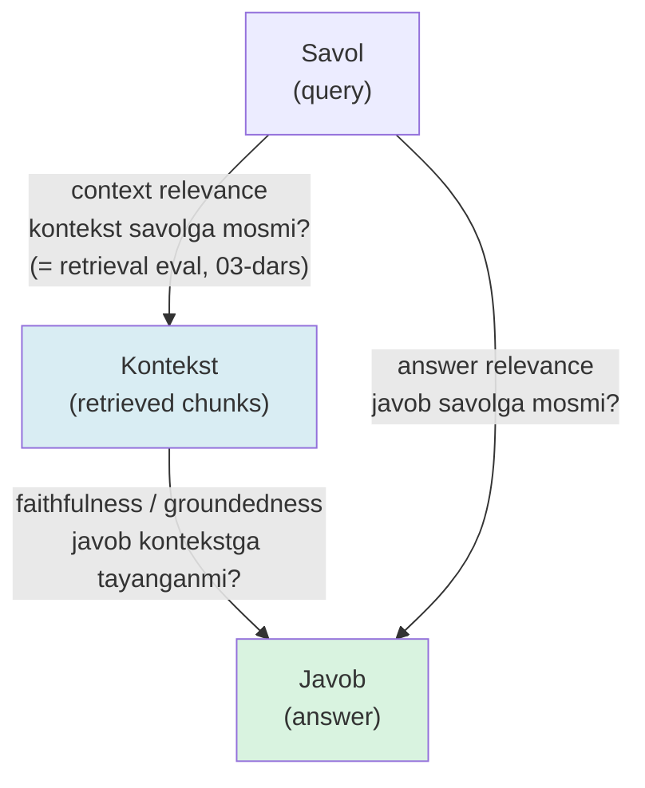

# 07. RAG javob sifati — faithfulness, relevance va citations

03-darsda retrieval sifatini o'lchading — to'g'ri chunk'lar top-k'ga tushdimi. Lekin bu zanjirning yarmi: retrieval mukammal bo'lsa ham, model kontekstni e'tiborsiz qoldirib o'z og'zidan gapirishi, yoki savolga umuman javob bermay chetga chiqib ketishi mumkin. Bu darsda javobning o'zini o'lchaymiz: **faithfulness** (javob kontekstga tayanganmi), **answer relevance** (javob savolga mosmi) va **citations** (Claude API'ning har jumlani manbaga bog'laydigan funksiyasi — endi "qaysi hujjatdan" savoli prompt-hack emas, API kafolati). Ish suhbatining kunma-kun murakkablashayotgan savoli shu: "RAG javobi past sifatli — retrieval'mi, generation'mi aybdor, va buni qanday isbotlaysan?".

---

## Nazariya (~30%)

### 1. Retrieval eval yetarli emas — generation ham buziladi

03-darsdagi recall@k faqat **bitta bosqichni** o'lchaydi: to'g'ri chunk top-k'ga tushdimi. Lekin RAG'da retrieval'dan keyin generation keladi, va u mustaqil ravishda buziladi:

- Model kontekstda bor javobni **e'tiborsiz qoldirib**, o'zining parametrik bilimidan (training'dan qolgan) gapiradi — ba'zan to'g'ri, ba'zan gallyutsinatsiya.
- Model kontekstdan **qisman** oladi, qolganini to'qib qo'shadi.
- Model savolga **javob bermaydi** — chiroyli, ammo mavzudan chetdagi matn qaytaradi.

> System prompt'da "faqat kontekstdan javob ber" deyish — **niyat**, kafolat emas (Huyen Ch5). Model instruksiyani buzishi mumkin. Shuning uchun niyatni o'lchaydigan metrika kerak.

### 2. RAG triad — uch tomon, uch xil buziladi

RAG javob sifati bitta son emas — **uch mustaqil o'lchov** (DeepLearning.AI advanced RAG kursi / TruLens "RAG triad"). Uchburchakning uchta uchi bor: savol, kontekst, javob. Har tomon alohida buziladi va alohida o'lchanadi.



| Tomon | Savol | Qanday buziladi | Qayerda o'lchaymiz |
|---|---|---|---|
| **Context relevance** | kontekst savolga mosmi? | retrieval noto'g'ri chunk topdi | 03-dars (recall@k, MRR) |
| **Faithfulness** | javob kontekstga tayanganmi? | model o'z bilimidan gapirdi / to'qidi | bu dars (claim tekshiruv + citations) |
| **Answer relevance** | javob savolga mosmi? | grammatik to'g'ri, lekin mavzudan chetda | bu dars (teskari savol + cosine) |

Diqqat: **uchala tomon yuqori bo'lsa ham javob foydasiz bo'lishi mumkin** — agar kontekstning o'zi noto'g'ri (eskirgan hujjat) bo'lsa. Bu "garbage in, grounded garbage out" holati; §5'da qaytamiz.

### 3. Ragas ta'riflari — metrikalar qanday hisoblanadi

**Ragas** (open-source RAG eval toolkit; Iusztin & Labonne Ch7) ikki metrikani LLM yordamida hisoblaydi. Bu darsda ikkalasining ham qo'lda mini-versiyasini yozamiz.

- **Faithfulness** = javob atomar **claim**'larga (mustaqil faktik da'volarga) bo'linadi, keyin har claim kontekstdan kelib chiqishi tekshiriladi. Score = `tasdiqlangan claim / jami claim`. Nega bir chaqiruvda "javob to'g'rimi?" deb so'ramaymiz — dekompozitsiya har da'voni alohida, yumshoq o'rtacha bilan baholaydi; bitta yolg'on gap butun javobni "no" qilib yubormaydi.
- **Answer relevancy** = LLM **javobdan** bir nechta savol generatsiya qiladi (bu javob qaysi savolga mos?), keyin ular bilan **original savol** orasidagi o'rtacha cosine similarity olinadi. G'oya: agar javob savolga mos bo'lsa, undan tiklangan savollar originalga yaqin bo'ladi. Bu "to'g'ri, lekin mavzudan chetga" javoblarni tutadi.
- **Context precision / recall** — bular retrieval metrikalar, 03-darsda qo'lda yozgansan; Ragas ularni ham triad'ga qo'shadi.

### 4. LLM-judge — kuchli, ammo ko'r ishonib bo'lmaydi (2026)

Faithfulness va answer relevance'ni LLM hisoblaydi — ya'ni **model modelni baholaydi**. Bu qulay, lekin cheklovlari hujjatlashtirilgan:

- Ragas metrikalarining **inson bahosi bilan korrelatsiyasi cheklangan** — bir tadqiqotda harmonic mean ~0.55. Ya'ni metrika 0.8 chiqarsa, inson ham 0.8 deydi degani emas.
- **LLM-judge bias'lari:** *position* (birinchi ko'rsatilgan javobni afzal ko'rish), *verbosity* (uzunroq javobni "yaxshiroq" deb baholash), *self-enhancement* (o'z oilasidagi model javobini yuqori baholash).

> **Oltin qoida:** metrika raqamiga ko'r ishonma — u **relativ signal**, absolyut haqiqat emas. "A konfiguratsiyada faithfulness 0.62, B'da 0.81" degan taqqoslash qimmatli; "faithfulness 0.81, demak yaxshi" degani xavfli. Har release'da bir necha javobni **qo'lda spot-check** qil.

Muqobillar: DeepEval, ARES (sintetik data + fine-tuned DeBERTa classifier — o'qitilgach tez va izchil). Chuqur eval (Ragas pipeline, ARES, statistik ishonch) 6-bo'limda; bu dars **poydevor** — tushunchalar va qo'lda mini-implementatsiya.

### 5. Citations — arzon faithfulness signali

Claude API'ning **citations** funksiyasi javobning har qismini qaysi hujjatning qaysi bo'lagidan kelganini qaytaradi (§7 amaliyotda chuqur). Bu faithfulness'ning eng arzon signali:

- **Iqtibosli** jumlalar — kontekstga bog'langan (grounded), ishonchli.
- **Iqtibossiz** jumlalar — model o'zidan qo'shgan bo'lishi mumkin; **birinchi tekshiriladigan joy** shu.

Va **grounded garbage** holati: agar kontekstdagi hujjat eskirgan/noto'g'ri bo'lsa, javob unga sodiq bo'ladi (faithfulness = 1.0, citations to'la), lekin fakt noto'g'ri. Metrika buni ushlay olmaydi — bu **context relevance** (retrieval sifati) va manba yangiligining muammosi, javob sifatining emas. Shuning uchun triad'ning uchala tomoni ham kerak.

### 6. Ikki manba bloki + diagnostika tartibi

Citations ikki xil content blok bilan ishlaydi. Bu darsda `document` (oddiy matn — bizning stack), lekin RAG uchun maxsus `search_result` bloki ham bor (`title` + `source` URL + `content`) — qidiruv natijasini API'ga bevosita uzatish uchun. Ikkalasida `citations: {"enabled": True}` bir xil ishlaydi; asosiy kodda `document` ishlatamiz.

Metrikalar tayyor bo'lgach, "javob yomon" shikoyati aniq **tartibda** tekshiriladi (research xatosi #1 — ko'p jamoa shu yerda adashib to'g'ridan-to'g'ri modelni almashtiradi):

| Tartib | Metrika | Past bo'lsa — sabab | Qayerda tuzatasan |
|---|---|---|---|
| 1 | context relevance (recall@k) | to'g'ri chunk top-k'ga tushmadi | chunking / hybrid / rerank (03-04-dars) |
| 2 | faithfulness | kontekst to'g'ri, model e'tiborsiz | system prompt, coverage'ni ko'r |
| 3 | answer relevance | grounded, savoldan chetda | rewriting (05-dars) yoki model |

> Tartib muhim: retrieval'ni o'lchamasdan generation'ni tuzatish — ko'r-ko'rona ish. Avval "to'g'ri kontekst bormidi?", keyin "kontekst bilan nima qildi?".

---

## Amaliyot (~70%)

Umumiy tayyorgarlik. Retrieval'ni bu darsda soddalashtiramiz (kichik in-memory korpus) — diqqat javob sifatida; loyihada (08) bu `vecsearch` retrieval qatlamiga ulanadi.

```bash
pip install anthropic voyageai numpy python-dotenv
# .env: ANTHROPIC_API_KEY=sk-ant-...  VOYAGE_API_KEY=pa-...
```

```python
# common.py — barcha misollar shu klientlardan foydalanadi
import os
import anthropic
import voyageai
from dotenv import load_dotenv

load_dotenv()
client = anthropic.Anthropic()   # ANTHROPIC_API_KEY env'dan
vo = voyageai.Client()           # VOYAGE_API_KEY env'dan

# Kichik korpus: retrieval allaqachon shu 3 chunk'ni topgan deb faraz qilamiz (title bilan)
RETRIEVED = [
    ("Goroutine — Go runtime tomonidan boshqariladigan yengil ip. Minglab goroutine "
     "bitta OS thread ustida multiplekslanadi; stack boshida ~2KB, kerak bo'lsa o'sadi.",
     "golang/concurrency.md"),
    ("Channel — goroutine'lar orasida ma'lumot uzatuvchi tipli quvur. Buffersiz channel'da "
     "yuboruvchi qabul qiluvchini kutadi (sinxron uzatish).",
     "golang/channels.md"),
    ("context.Context — bekor qilish signali va deadline'ni goroutine daraxti bo'ylab tarqatadi. "
     "cancel() chaqirilganda ctx.Done() kanali yopiladi.",
     "golang/context.md"),
]
```

### Predict / Run

#### 1-mashq: citations bilan grounded javob render qilish

Retrieved chunk'larni `document` content block sifatida yuboramiz, har blokda `citations: {"enabled": True}`. Javob qaytganda Claude uni **bir nechta text blokka bo'ladi**: iqtibosli bloklarda `citations` massivi bor, iqtibossizlarida yo'q. Shu strukturani `[n]` uslubida render qilamiz.

> **Ishga tushirishdan oldin bashorat qil:** agar model kontekstda **yo'q** bir jumla qo'shsa (masalan "Go 2009-yilda chiqqan" — korpusda yo'q), o'sha jumla `citations` massiviga ega bo'ladimi yoki bo'lmaydimi?

```python
# 01_citations.py
from common import client, RETRIEVED

def ask_with_citations(chunks, question):
    # --- 1-qadam: har chunk'ni document blokka o'raymiz, citations yoqamiz ---
    content = [
        {"type": "document",
         "source": {"type": "text", "media_type": "text/plain", "data": text},
         "title": title,
         "citations": {"enabled": True}}          # hammasida yoki hech birida
        for text, title in chunks
    ] + [{"type": "text", "text": question}]       # oxirida savol matni

    # --- 2-qadam: opus generation, "faqat kontekstdan" ko'rsatmasi system'da ---
    return client.messages.create(
        model="claude-opus-4-8",
        max_tokens=1024,
        system=("Faqat berilgan hujjatlardan javob ber. Har da'voni hujjatga asosla. "
                "Hujjatlarda javob bo'lmasa 'Hujjatlarda topilmadi' de."),
        messages=[{"role": "user", "content": content}],
    )
```

```python
# 01_citations.py — davomi: javobni [n] bilan render qilish
def render(resp):
    body, sources = [], []                         # sources: [n] tartibida (title, cited_text)
    for block in resp.content:
        if block.type != "text":
            continue
        cites = getattr(block, "citations", None) or []
        if cites:                                  # iqtibosli blok -> [n] markerlari
            marks = ""
            for c in cites:
                sources.append((c.document_title, c.cited_text))
                marks += f"[{len(sources)}]"
            body.append(block.text + marks)
        else:
            body.append(block.text)                # iqtibossiz blok -> tekshiruv nishoni
    return "".join(body), sources


resp = ask_with_citations(RETRIEVED, "Goroutine nima va u qanday to'xtatiladi?")
answer, sources = render(resp)
print(answer, "\n\nManbalar:")
for i, (title, cited) in enumerate(sources, 1):
    print(f"  [{i}] {title}: \"{cited[:60]}...\"")

# Output:
# Goroutine — Go runtime tomonidan boshqariladigan yengil ip.[1] Uni to'xtatish uchun
# context.Context ishlatiladi: cancel() chaqirilganda ctx.Done() kanali yopiladi.[2]
#
# Manbalar:
#   [1] golang/concurrency.md: "Goroutine — Go runtime tomonidan boshqariladigan yengil..."
#   [2] golang/context.md: "cancel() chaqirilganda ctx.Done() kanali yopiladi..."
```

<details>
<summary>Bashorat javobi</summary>

Kontekstda **yo'q** jumla `citations` massivini **olmaydi** — citation faqat berilgan hujjatning matniga bog'lana oladigan qism uchun chiqadi. Shuning uchun javobdagi iqtibossiz text blok = model kontekstdan tashqaridan qo'shgan ehtimoli bor jumla. Bu bizga **bepul faithfulness signali** beradi: `render`'da iqtibossiz bloklar ajralib turadi, ularni birinchi bo'lib tekshiramiz.

</details>

Notional machine: `resp.content` — bloklar ro'yxati. Claude iqtibosli javobni jumla-jumla bo'ladi; har `text` blok mustaqil, `.citations` esa `char_location` obyektlari (`cited_text`, `document_index`, `document_title`, `start_char_index`, `end_char_index`). Biz `document_index` orqali qaysi chunk'ligini, `cited_text` orqali aynan qaysi bo'lagini bilamiz — bu prompt bilan "iltimos manba ko'rsat" deyishdan farqli, model to'qib chiqara olmaydigan, API generatsiya paytida biriktirgan ma'lumot.

#### 2-mashq: qo'lda mini-faithfulness (claim dekompozitsiyasi)

Ragas faithfulness'ning yadrosi: javobni atomar claim'larga bo'lib, har birini kontekstga solishtirish. Arzon qadam — `claude-haiku-4-5`.

> **Bashorat qil:** agar javobga bitta to'qilgan gap qo'shsak ("Goroutine 2009-yilda ixtiro qilingan" — kontekstda yo'q), 3 claim'dan nechtasi tasdiqlanadi va faithfulness score qancha bo'ladi?

```python
# 02_faithfulness.py
from common import client, RETRIEVED

def extract_claims(answer):
    # --- javobni mustaqil faktik da'volarga ajratamiz (arzon model yetarli) ---
    resp = client.messages.create(
        model="claude-haiku-4-5",
        max_tokens=400,
        system=("Berilgan javobni mustaqil, atomar faktik da'volarga (claim) ajrat. "
                "Har qatorda bitta claim, raqam yoki belgisiz."),
        messages=[{"role": "user", "content": answer}],
    )
    return [ln.strip("-• ").strip() for ln in resp.content[0].text.splitlines() if ln.strip()]

def verify(claim, context):
    # --- claim SHU kontekstdan kelib chiqadimi? ha/yo'q ---
    resp = client.messages.create(
        model="claude-haiku-4-5",
        max_tokens=8,
        system="Da'vo faqat berilgan kontekstdan kelib chiqadimi? Faqat 'ha' yoki 'yo'q' deb javob ber.",
        messages=[{"role": "user", "content": f"Kontekst:\n{context}\n\nDa'vo: {claim}"}],
    )
    return resp.content[0].text.strip().lower().startswith("ha")

def faithfulness(answer, chunks):
    context = "\n\n".join(text for text, _ in chunks)
    claims = extract_claims(answer)
    verdicts = [(c, verify(c, context)) for c in claims]
    score = sum(v for _, v in verdicts) / len(verdicts) if verdicts else 0.0
    return score, verdicts
```

```python
# 02_faithfulness.py — davomi: grounded vs to'qilgan javob
grounded = ("Goroutine yengil ip bo'lib, Go runtime tomonidan boshqariladi. "
            "context.Context bekor qilish signalini tarqatadi.")
hallucinated = grounded + " Goroutine 2009-yilda ixtiro qilingan va C++ thread'idan tez."

for label, ans in [("grounded", grounded), ("hallucinated", hallucinated)]:
    score, verdicts = faithfulness(ans, RETRIEVED)
    print(f"\n{label}: faithfulness = {score:.2f}")
    for claim, ok in verdicts:
        print(f"   {'OK ' if ok else 'YO`Q'} {claim}")

# Output:
# grounded: faithfulness = 1.00
#    OK  Goroutine yengil ip bo'lib, Go runtime tomonidan boshqariladi
#    OK  context.Context bekor qilish signalini tarqatadi
#
# hallucinated: faithfulness = 0.50
#    OK  Goroutine yengil ip bo'lib, Go runtime tomonidan boshqariladi
#    OK  context.Context bekor qilish signalini tarqatadi
#    YO`Q Goroutine 2009-yilda ixtiro qilingan
#    YO`Q Goroutine C++ thread'idan tez
```

To'qilgan javobda ikki yangi claim kontekstda yo'q — score `2/4 = 0.50`. Diqqat: `hallucinated` gaplari **haqiqatda to'g'ri** bo'lishi mumkin (Go 2009-yilda chiqqan) — lekin faithfulness "haqiqatmi?" emas, "**kontekstdan kelib chiqdimi?**" degan savolga javob beradi. RAG'da bu aynan kerakli o'lchov: javob berilgan manbaga sodiqmi.

#### 3-mashq: answer relevance (teskari savol + cosine)

Answer relevancy javobdan savollar tiklaydi va original savolga cosine bilan solishtiradi — "to'g'ri, lekin mavzudan chetga" javoblarni tutadi.

> **Bashorat qil:** savol "Goroutine nima?" bo'lsa, lekin javob channel haqida gapirsa — tiklangan savollar originalga yaqin bo'ladimi? Cosine yuqorimi past?

```python
# 03_answer_relevance.py
import numpy as np
from common import client, vo

def gen_questions(answer, n=3):
    # --- javob qaysi savolga mos? n ta ehtimoliy savol tiklaymiz ---
    resp = client.messages.create(
        model="claude-haiku-4-5",
        max_tokens=256,
        system=f"Berilgan javob qaysi savolga javob bo'lishi mumkin? Aniq {n} ta savol yoz, "
               "har qatorda bitta.",
        messages=[{"role": "user", "content": answer}],
    )
    return [ln.strip("-• 1234567890.").strip()
            for ln in resp.content[0].text.splitlines() if ln.strip()][:n]

def answer_relevance(question, answer):
    gen = gen_questions(answer)
    q = np.array(vo.embed([question], model="voyage-4", input_type="query").embeddings[0])
    G = np.array(vo.embed(gen, model="voyage-4", input_type="query").embeddings)
    return float((G @ q).mean()), gen        # voyage normalizatsiyalangan => dot == cosine

question = "Goroutine nima?"
on_topic = "Goroutine — Go runtime boshqaradigan yengil ip, minglab goroutine bir thread'da ishlaydi."
off_topic = "Channel — goroutine'lar orasida ma'lumot uzatuvchi tipli quvur."

for label, ans in [("on-topic", on_topic), ("off-topic", off_topic)]:
    score, gen = answer_relevance(question, ans)
    print(f"{label}: answer_relevance = {score:.2f}  <- {gen[0]}")

# Output:
# on-topic:  answer_relevance = 0.87  <- Goroutine nima va qanday ishlaydi?
# off-topic: answer_relevance = 0.41  <- Channel nima uchun ishlatiladi?
```

`off_topic` javobi grammatik to'g'ri va hatto kontekstga sodiq (channel chunk'idan olingan — faithfulness yuqori bo'lardi!), lekin **savolga javob bermaydi**. Answer relevance uni ushlaydi: tiklangan savollar "channel nima?" atrofida, "goroutine nima?"dan uzoq — cosine 0.41. Bu faithfulness'ning **ko'ra olmaydigan** buzilishi.

### Investigate / Modify

#### 4-mashq: bitta metrika yetmaydi — uch javob turi

Endi ikki metrikani birlashtirib, uch xil buzilgan javobni yonma-yon ajratamiz. Har javob turi qaysi metrikada "yiqiladi"ni ko'ramiz.

> **Bashorat qil:** jadvalni ko'rishdan oldin — "o'z bilimidan gapirgan" javob (kontekstni e'tiborsiz, lekin savolga mos) qaysi metrikada past bo'ladi: faithfulness'da, answer relevance'da, yoki ikkalasida?

```python
# 04_three_answers.py
from common import RETRIEVED
from importlib import import_module
faithfulness = import_module("02_faithfulness").faithfulness
answer_relevance = import_module("03_answer_relevance").answer_relevance

Q = "Goroutine nima va qanday to'xtatiladi?"
answers = {
    "grounded":      "Goroutine — Go runtime boshqaradigan yengil ip; context.Context "
                     "bekor qilish signalini tarqatadi, cancel() ctx.Done() kanalini yopadi.",
    "o'z bilimidan": "Goroutine Go 1.0'dan beri bor, `go` kaliti bilan ishga tushadi va "
                     "GOMAXPROCS OS thread'lar sonini belgilaydi.",   # to'g'ri, ammo kontekstsiz
    "mavzudan chetga": "Channel — goroutine'lar orasida ma'lumot uzatuvchi tipli quvur.",
}
for label, ans in answers.items():
    f, _ = faithfulness(ans, RETRIEVED)
    r, _ = answer_relevance(Q, ans)
    print(f"{label:16} faithfulness={f:.2f}  answer_relevance={r:.2f}")

# Output:
# grounded         faithfulness=1.00  answer_relevance=0.86
# o'z bilimidan    faithfulness=0.25  answer_relevance=0.83
# mavzudan chetga  faithfulness=1.00  answer_relevance=0.39
```

Xulosa jadvali — **hech bir metrika yolg'iz yetarli emas**:

| Javob turi | faithfulness | answer relevance | Kim ushlaydi |
|---|---|---|---|
| **Grounded (to'g'ri)** | 1.00 | 0.86 | — (yaxshi) |
| **O'z bilimidan** (kontekstsiz, savolga mos) | 0.25 | 0.83 | faqat **faithfulness** |
| **Mavzudan chetga** (kontekstga sodiq, savoldan uzoq) | 1.00 | 0.39 | faqat **answer relevance** |
| **Grounded garbage** (kontekst eskirgan) | 1.00 | 0.86 | **HECH QAYSI** → spot-check |

Oxirgi qator — darsning eng muhim ogohlantirishi. Agar retrieval eskirgan hujjat topgan bo'lsa, javob unga sodiq (faithfulness 1.0), savolga mos (relevance yuqori), lekin **fakt noto'g'ri**. Buni metrika ushlamaydi — bu context relevance (03-dars) va manba yangiligi (08-loyihada index yangilash) muammosi. "Garbage in, grounded garbage out".

### Make

**Challenge: citations coverage metrikasi**

Javobning qancha qismi haqiqatan manbaga bog'langanini o'lchaydigan **eng arzon** faithfulness proksisi yoz — hech qanday qo'shimcha LLM chaqiruvsiz, faqat `resp` strukturasidan.

Talab:

1. `citations_coverage(resp) -> float` — javob **belgilarining** (character) qancha ulushi iqtibosli text bloklarda ekanini qaytar.
2. Formula: `(iqtibosli bloklardagi belgilar) / (jami text belgilar)`.
3. `resp.content`'dagi faqat `type == "text"` bloklarni hisobga ol; `.citations` bo'sh yoki yo'q bo'lsa — iqtibossiz.
4. Bo'sh javobda 0.0 qaytar (nolga bo'lish yo'q).

<details>
<summary>Yechim</summary>

```python
# coverage.py — javobning necha foizi manbaga bog'langan
def citations_coverage(resp) -> float:
    cited_chars, total_chars = 0, 0
    for block in resp.content:
        if block.type != "text":
            continue
        n = len(block.text)
        total_chars += n
        if getattr(block, "citations", None):      # iqtibosli blok
            cited_chars += n
    return cited_chars / total_chars if total_chars else 0.0


if __name__ == "__main__":
    from importlib import import_module
    m = import_module("01_citations")
    from common import RETRIEVED

    grounded = m.ask_with_citations(RETRIEVED, "Goroutine nima va qanday to'xtatiladi?")
    leaky = m.ask_with_citations(RETRIEVED, "Go qachon chiqqan va kim yaratgan?")  # kontekstda yo'q

    print(f"grounded coverage: {citations_coverage(grounded):.2f}")
    print(f"leaky    coverage: {citations_coverage(leaky):.2f}")

    # Output:
    # grounded coverage: 0.91
    # leaky    coverage: 0.18
```

`leaky` savoliga javob kontekstda yo'q — model "Hujjatlarda topilmadi" deyishi yoki o'zidan gapirishi mumkin; ikki holatda ham iqtibosli belgilar ulushi keskin tushadi (0.18). Bu metrikaning kuchi: **bepul** (LLM chaqiruvsiz), tez, va production'da har javob uchun log'ga yozib qo'yish mumkin — coverage keskin tushgan javoblarni monitoring'da avtomatik belgilaysan. Zaifligi: coverage baland bo'lishi javob **to'g'ri** deganini bildirmaydi (grounded garbage). Signal, hukm emas.

</details>

### Uchta tuzoq

1. **Structured outputs + citations = 400.** Ikkalasi bir so'rovda ishlamaydi (1-bo'limdagi `output_config.format` bilan citations to'qnashadi). Agar javobni JSON sxemaga solishing **va** iqtibos kerak bo'lsa: avval citations bilan generatsiya qil, keyin natijani alohida arzon chaqiruvda strukturaga sol — yoki citations'siz JSON'ni tanla. Bitta so'rovda ikkalasini kutma.
2. **Faithsfulness yuqori, ammo javob eskirgan.** Metrika "kontekstga sodiqmi?" deydi, "haqiqatmi?" demaydi. Yangilik retrieval qatlamining (index freshness) mas'uliyati — 08-loyihada incremental reindex bilan yopiladi.
3. **Judge raqamiga ko'r ishonish.** faithfulness 0.81'ni "yaxshi" deb deploy qilish — korrelatsiya ~0.55. To'g'ri usul: metrikani **konfiguratsiyalarni taqqoslash** uchun ishlat (A vs B), absolyut sifat sertifikati sifatida emas, va har release'da spot-check qil.

---

## Retrieval practice

1. RAG triad'ning uch tomonini ayt. Retrieval eval (03-dars) qaysi tomonni o'lchaydi, bu darsdagi ikki metrika qaysilarini?
2. Faithsfulness va answer relevance ikkalasi ham yuqori, lekin javob amalda foydasiz — bu qanday holat, va nega hech bir metrika uni ushlamaydi?
3. Javobdagi bir text blokda `citations` massivi bo'sh. Bu nimadan darak beradi va uni birinchi bo'lib nima uchun tekshirasan?
4. Ragas faithfulness nega javobni claim'larga bo'ladi? Bir chaqiruvda "javob to'g'rimi?" deb so'rashdan farqi nima?
5. LLM-judge korrelatsiyasi ~0.55 va verbosity/position bias'lari bor. Bunday metrikadan production'da qanday **to'g'ri** foydalanasan (uch amaliy qoida)?
6. Structured outputs va citations bir so'rovda 400 beradi. Ikkalasi ham kerak bo'lsa qanday ishlaysan?

---

## Manbalar

- Iusztin & Labonne, *LLM Engineer's Handbook* (Packt, 2024) — Ch 7: RAG evaluation, Ragas (faithfulness, answer relevancy, context precision/recall), ARES (p.508–517).
- Chip Huyen, *AI Engineering* (O'Reilly, 2025) — Ch 5: gallyutsinatsiya, "kontekstga cheklash kafolat emas"; Ch 6: RAG post-retrieval sifat.
- Anthropic — Citations (document block, `cited_text`/`document_index`, structured output cheklovi): `https://platform.claude.com/docs/en/build-with-claude/citations`
- Ragas docs — faithfulness / answer relevancy formulasi: `https://docs.ragas.io/`
- DeepLearning.AI — Building and Evaluating Advanced RAG (RAG triad / TruLens): `https://www.deeplearning.ai/courses/building-evaluating-advanced-rag/`
- 10 common RAG mistakes (citations'siz javob, judge'ga ko'r ishonish): `https://towardsdatascience.com/10-common-rag-mistakes-we-keep-seeing-in-production/`
