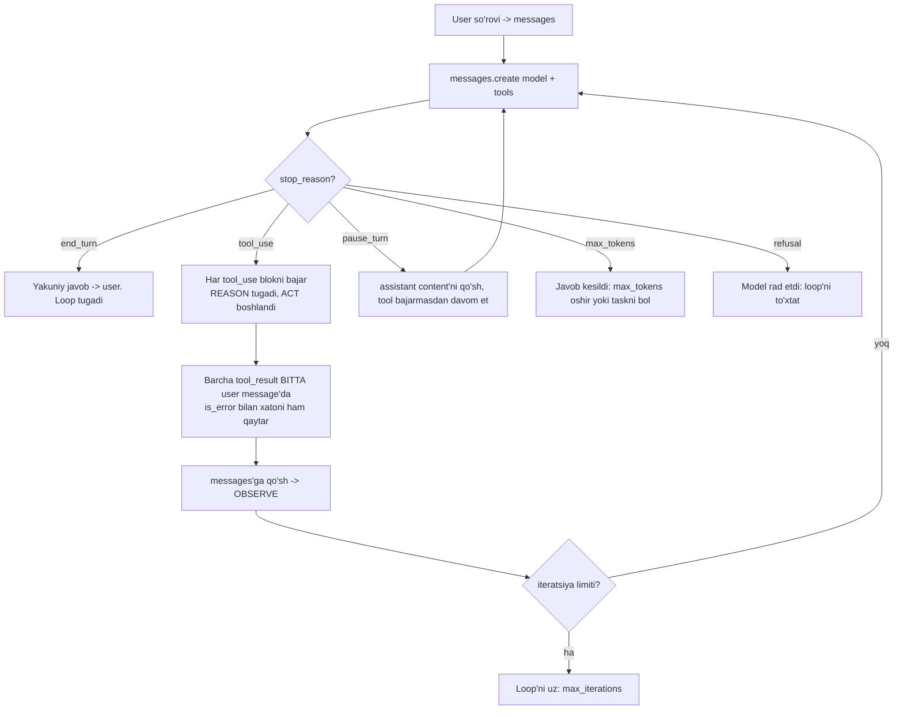

# 01. Agent nima — loop, environment, tools

2026 ish e'lonlarida "agentic systems", "autonomous agents", "agent orchestration" har kunda uchraydi va ko'pincha sirli tuyuladi. Aslida siz bu mexanikani 1-bo'limning "Tool use" darsida allaqachon yozgansiz: `while stop_reason == "tool_use"` loop'i — bu agentning yuragi. Bu darsda o'sha loop'ni bir marta chaqiruvdan **muhitni his qiladigan, ko'p qadamli ish bajaradigan agent**ga aylantiramiz va "agent" so'zidagi sehrni tortib olamiz.

> Agent — bu yangi API rejimi emas. Bu sizning tool loop'ingiz + muhit + to'xtash qoidalari. Boshqa hamma narsa shu uch narsaning ustidagi qatlam.

---

## Nazariya (~30%)

### 1. Agent = environment + actions

Huyen (Russell & Norvig ta'rifiga tayanib) agentni ikki narsa bilan belgilaydi:

- **environment** (muhit) — agent qayerda ishlaydi. Use case belgilaydi: Minecraft o'yini, internet, yoki terminal + fayl tizimi.
- **actions** (harakatlar) — agent muhitga qanday ta'sir qiladi. Aynan **tool'lar** bu to'plamni kengaytiradi.

Backend analogiyasi: agent — bu uzoq yashaydigan **worker process**. Uning environment'i — u ulangan tizimlar (fayl tizimi, DB, HTTP API). Uning action'lari — bu process chaqira oladigan RPC'lar. Model o'zi hech narsa qilmaydi; u faqat "keyingi qaysi RPC'ni qaysi argument bilan chaqiray" deb qaror qiladi, chaqiruvni esa **sizning kodingiz** bajaradi (buni 1-bo'limda ko'rdik).

Bog'liqlik ikki tomonlama va buni yodda tutish muhim:

- Environment qaysi tool mumkinligini belgilaydi (terminal muhitida `read_file` bor, brauzerda `click` bor).
- Tool inventory agent qaysi environment'da ishlay olishini cheklaydi (faqat `search` tool'i bor bo'lsa, u faylni o'zgartira olmaydi).

Misollar Huyen'dan: ChatGPT ham agent (web search + Python + rasm tool'lari bilan); RAG tizimi ham agent (retriever va SQL executor — bu tool'lar). **SWE-agent** (Yang, 2024): environment = kompyuter (terminal + fayl tizimi), action'lar = repo bo'ylab yurish, fayl qidirish, faylni ko'rish, qatorlarni tahrirlash. Biz shu darsda mayda SWE-agent yozamiz.

### 2. Agent loop anatomiyasi: reason -> act -> observe

Agent bir chaqiruvda ish tugatmaydi. U **tsiklda** ishlaydi: o'ylaydi (reason), tool chaqiradi (act), natijani ko'radi (observe) va yana o'ylaydi. Huyen'ning Kitty Vogue misoli aynan shu: model reason qiladi -> SQL generatsiya -> SQL bajariladi -> tool natijasi ustida yana reason ("ma'lumot yetarli emas") -> yana SQL -> yakuniy javob -> "task tugadi".

API darajasida bu tsiklni `stop_reason` boshqaradi — bu sizning loop'ingizning **state machine holati**:



Diqqat: "reason" qadami endi prompt'dagi maxsus pattern emas — bu modelning o'z ichki reasoning'i. Siz faqat loop'ni aylantirasiz va natijalarni qaytarasiz.

### 3. Nega agent kuchli model talab qiladi

Bitta chaqiruvda arzon model yetishi mumkin. Agentda ikki sabab uni buzadi (Huyen):

**1. Compound mistakes (xatolarning ko'payishi).** Har qadam mustaqil emas — keyingi qadam oldingisining natijasiga tayanadi. Agar har qadam 95% aniq bo'lsa:

| Qadamlar soni | Umumiy aniqlik |
|---|---|
| 1 | 95% |
| 10 | 0.95^10 ~ 60% |
| 100 | 0.95^100 ~ 0.6% |

Ya'ni har qadamdagi kichik xato ko'payib, uzun zanjirda natijani nolga tushiradi. Backend analogiyasi: 10 ta microservice ketma-ket chaqiriladi, har biri 99% uptime bo'lsa ham, zanjir uptime'i 90% ga tushadi — faqat bu yerda "uptime" o'rniga "to'g'ri qaror".

**2. Higher stakes (yuqori tavakkal).** Tool'lar bilan model faqat matn emas, **action** chiqaradi. Xato javob — noqulaylik; xato `DELETE` — falokat. Shuning uchun agentda kuchliroq model (`claude-opus-4-8`) va qat'iy to'xtash qoidalari kerak.

### 4. "Should I Build an Agent?" — 4 mezon

Har bir masala agent talab qilmaydi. Anthropic 4 ta savolni tekshirishni tavsiya qiladi va **bittasiga "yo'q" bo'lsa — oddiyroq darajaga tushing** (bitta call yoki workflow, keyingi darsda):

1. **Complexity** — task ko'p qadamli va oldindan to'liq spec qilib bo'lmaydimi? (Qadamlar soni oldindan noma'lummi?)
2. **Value** — natija yuqori cost va latency'ni oqlaydimi?
3. **Viability** — model bu turdagi taskda yetarlicha kuchlimi?
4. **Cost of error** — xatolarni ushlab, qaytarib bo'ladimi (test, review, rollback)?

> "Start simple." Ko'p ilova uchun retrieval + bir necha misol bilan bitta LLM call yetadi. Agent — oxirgi chora, birinchi emas.

### 5. Agent qurishning 4 yo'li

Ikki mustaqil savolni ajrating: **harness kim beradi** (loop + context management) va **deployment kim beradi** (infra). Shu bo'yicha 4 yo'l bor:

| # | Yondashuv | Siz yozasiz | Harness/Deploy | Qachon |
|---|---|---|---|---|
| 1 | **Manual loop** (`while stop_reason == "tool_use"`) | Loop'ning o'zini | Ikkalasi sizda | Loop'ni to'liq nazorat qilish. **Kursning asosiy yo'li** |
| 2 | **Tool Runner** (SDK beta) | Faqat tool funksiyalar | SDK loop beradi | Boilerplate'ni olib tashlash; per-turn hook'lar. 04-darsda |
| 3 | **Managed Agents** (REST beta) | Config + tool result'lar | Anthropic harness + sandbox | Server-managed stateful agent |
| 4 | **Claude Agent SDK** (alohida paket) | Prompt + options | Claude Code harness + tayyor tool'lar | Batteries-included coding agent |

Biz **1-yo'ldan** boshlaymiz — chunki mexanikani ko'rmasdan abstraksiyani ishlata olmaysiz. Abstraksiya sinsa (u sinadi), loop'ni qo'lda debug qila olishingiz kerak. Tool Runner (2-yo'l) 04-darsda, Managed/Agent SDK — kontekst uchun bilib qo'yish.

---

## Amaliyot (~70%) — PRIMM

1-bo'limda bitta-ikkita tool'li loop yozdik. Endi uni **fayl tizimi ustida ishlaydigan agent**ga aylantiramiz: 3 ta tool (`list_dir`, `read_file`, `run_python`), barcha `stop_reason` holatlari, parallel tool use, `is_error` va `max_iterations`.

```bash
pip install anthropic python-dotenv
```

Barcha kod bitta faylga tushadi (`file_agent.py`) va mustaqil ishga tushadi. `.env` da `ANTHROPIC_API_KEY` bor deb hisoblaymiz. Agent xavfsiz sinash uchun o'zi vaqtinchalik **workspace** papkasini yaratadi.

### Predict / Run

#### 1-qadam. Workspace va tool implementatsiyalari

Avval **bashorat qiling:** `read_file("../../../etc/passwd")` deb chaqirilsa, `safe_path` nima qaytaradi?

```python
# file: file_agent.py  (1-qism: setup va tool'lar)
import os
import json
import subprocess
import sys
import tempfile
from dotenv import load_dotenv
import anthropic

load_dotenv()
client = anthropic.Anthropic()

MODEL = "claude-opus-4-8"

# --- 1-qadam: sinov uchun vaqtinchalik workspace yaratamiz ---
WORKSPACE = os.path.realpath(tempfile.mkdtemp(prefix="agent_ws_"))
with open(os.path.join(WORKSPACE, "config.json"), "w") as f:
    f.write('{"service": "payments", "timeout_ms": 3000, "retries": 2}')
with open(os.path.join(WORKSPACE, "notes.txt"), "w") as f:
    f.write("payments upstream sekin\nauth normal\nsearch shard muammosi\n")
os.mkdir(os.path.join(WORKSPACE, "logs"))
```

Path guard — bu agent xavfsizligining birinchi qatlami (chuqur 08-darsda). Model bergan `path` **ishonchsiz input** (1-bo'limda ko'rgan qoida): uni canonical shaklga keltirib, workspace ichida qolishini majburlaymiz.

```python
# file: file_agent.py  (davomi)

# --- 2-qadam: path guard — model bergan yo'l workspace'dan chiqmasin ---
def safe_path(user_path):
    full = os.path.realpath(os.path.join(WORKSPACE, user_path))
    if os.path.commonpath([full, WORKSPACE]) != WORKSPACE:
        raise ValueError(f"Ruxsat yo'q: '{user_path}' workspace'dan tashqarida.")
    return full


# --- 3-qadam: uchta tool implementatsiyasi ---
def list_dir(path="."):
    target = safe_path(path)
    names = sorted(os.listdir(target))
    return {"path": path, "entries": names}


def read_file(path, max_lines=50):
    target = safe_path(path)
    with open(target, "r") as fh:
        lines = fh.read().splitlines()
    truncated = len(lines) > max_lines
    body = "\n".join(lines[:max_lines])
    return {"path": path, "content": body, "truncated": truncated}


def run_python(code):
    # DIQQAT: bu ixtiyoriy kodni ijro etadi. Prod'da SANDBOX shart (08-dars).
    proc = subprocess.run(
        [sys.executable, "-c", code],
        capture_output=True, text=True, timeout=5,
    )
    return {"stdout": proc.stdout.strip(), "stderr": proc.stderr.strip()}
```

`safe_path` javobi: `../../../etc/passwd` `os.path.realpath` dan keyin `/etc/passwd` ga aylanadi, `commonpath` esa WORKSPACE'ga teng bo'lmaydi, shuning uchun `ValueError` tashlanadi — fayl **ochilmaydi ham**. Bu poka-yoke: xato qilib bo'lmaydigan interfeys.

#### 2-qadam. Tool schema'lari va dispatcher

Tool schema — bu model uchun **yagona hujjat** (1-bo'lim qoidasi): description'da faqat *nima* emas, *qachon* chaqirishni ham yozamiz.

```python
# file: file_agent.py  (davomi: tool ta'riflari)
TOOLS = [
    {
        "name": "list_dir",
        "description": (
            "Workspace ichidagi papka mazmunini qaytaradi. "
            "Qanday fayllar borligini bilish kerak bo'lganda birinchi chaqiring."
        ),
        "input_schema": {
            "type": "object",
            "properties": {
                "path": {"type": "string", "description": "Nisbiy yo'l, standart: '.'"}
            },
        },
    },
    {
        "name": "read_file",
        "description": (
            "Matnli faylni o'qiydi. Fayl ichidagi ma'lumot kerak bo'lganda chaqiring. "
            "Katta fayllar max_lines gacha kesiladi (truncated=true belgisi bilan)."
        ),
        "input_schema": {
            "type": "object",
            "properties": {
                "path": {"type": "string", "description": "Fayl yo'li, masalan: config.json"},
                "max_lines": {"type": "integer", "description": "Standart: 50"},
            },
            "required": ["path"],
        },
    },
    {
        "name": "run_python",
        "description": (
            "Kichik Python kod bo'lagini ijro etib stdout/stderr qaytaradi. "
            "Hisob-kitob yoki ma'lumotni qayta ishlash kerak bo'lganda chaqiring."
        ),
        "input_schema": {
            "type": "object",
            "properties": {"code": {"type": "string", "description": "Ijro etiladigan Python kod"}},
            "required": ["code"],
        },
    },
]

REGISTRY = {"list_dir": list_dir, "read_file": read_file, "run_python": run_python}
```

Dispatcher har doim `{"content": str, "is_error": bool}` qaytaradi — 1-bo'limdagi pattern. Xato bo'lsa **model tuzata oladigan** xabar qaytaramiz, xom stack trace emas:

```python
# file: file_agent.py  (davomi: dispatcher)
def execute_tool(name, args):
    fn = REGISTRY.get(name)
    if fn is None:
        return {"content": f"Noma'lum tool: {name}", "is_error": True}
    try:
        result = fn(**args)
        return {"content": json.dumps(result, ensure_ascii=False), "is_error": False}
    except subprocess.TimeoutExpired:
        return {"content": "Kod 5 soniyada tugamadi (timeout). Soddaroq kod yozing.", "is_error": True}
    except Exception as e:
        return {"content": f"Tool xatosi: {e}", "is_error": True}
```

#### 3-qadam. Agent loop — barcha stop_reason'lar bilan

Bu darsning yuragi. 1-bo'limdagi loop'dan farqi: hamma `stop_reason` holatini to'g'ri qayta ishlaymiz va `max_iterations` bilan cheklaymiz.

```python
# file: file_agent.py  (davomi: loop)
def run_agent(user_msg, max_iterations=12):
    system = (
        "Sen fayl tizimida ishlaydigan yordamchi agentsan. "
        "Tool'lar bilan workspace'ni tekshir, javobga yetarli ma'lumot yig'ilgach "
        "oddiy matn bilan javob ber."
    )
    messages = [{"role": "user", "content": user_msg}]

    for i in range(max_iterations):
        resp = client.messages.create(
            model=MODEL,
            max_tokens=2048,
            system=system,
            tools=TOOLS,
            messages=messages,
        )
        print(f"[iter {i}] stop_reason={resp.stop_reason} "
              f"out_tokens={resp.usage.output_tokens}")

        # --- pause_turn: server-side ish uzildi, tool bajarmaymiz, davom etamiz ---
        if resp.stop_reason == "pause_turn":
            messages.append({"role": "assistant", "content": resp.content})
            continue

        # --- max_tokens: javob kesildi, bu XATO holat, jimgina davom etmaymiz ---
        if resp.stop_reason == "max_tokens":
            return {"ok": False, "reason": "max_tokens"}

        # --- refusal: model xavfsizlik sabab rad etdi ---
        if resp.stop_reason == "refusal":
            return {"ok": False, "reason": "refusal"}

        # --- end_turn: model gapini tugatdi, yakuniy javobni yig'amiz ---
        if resp.stop_reason == "end_turn":
            text = "".join(b.text for b in resp.content if b.type == "text")
            return {"ok": True, "text": text}

        # --- tool_use: hamma tool_use blokni bajaramiz ---
        messages.append({"role": "assistant", "content": resp.content})
        results = []
        for block in resp.content:
            if block.type == "tool_use":
                out = execute_tool(block.name, block.input)
                print(f"   -> {block.name}({block.input}) is_error={out['is_error']}")
                results.append({
                    "type": "tool_result",
                    "tool_use_id": block.id,
                    "content": out["content"],
                    "is_error": out["is_error"],
                })
        # QAT'IY: barcha tool_result BITTA user message ichida
        messages.append({"role": "user", "content": results})

    return {"ok": False, "reason": "max_iterations"}
```

E'tibor bering: `pause_turn` da `continue` qilamiz (tool yo'q, faqat davom etamiz), `end_turn` da chiqamiz, `tool_use` da hammasini bajarib **bitta** user message qaytaramiz. Bu to'rt holatni chalkashtirish — production agentdagi eng ko'p uchraydigan bug.

#### 4-qadam. Ishga tushiramiz

```python
# file: file_agent.py  (davomi: run)
if __name__ == "__main__":
    out = run_agent("workspace'da qanday fayllar bor va config.json'da qaysi servis sozlangan?")
    print("\n=== JAVOB ===")
    print(out)

# Output:
# [iter 0] stop_reason=tool_use out_tokens=71
#    -> list_dir({'path': '.'}) is_error=False
# [iter 1] stop_reason=tool_use out_tokens=54
#    -> read_file({'path': 'config.json'}) is_error=False
# [iter 2] stop_reason=end_turn out_tokens=48
#
# === JAVOB ===
# {'ok': True, 'text': "Workspace'da 3 ta element bor: config.json, notes.txt va
#  logs/ papkasi. config.json'da 'payments' servisi sozlangan (timeout 3000ms,
#  2 marta retry)."}
```

Kuzating: agent **o'zi** ketma-ketlikni tanladi — avval `list_dir` (nima borligini bilish), keyin `read_file` (config'ni o'qish), keyin `end_turn`. Siz hech qanday "avval buni, keyin buni" deb yozmadingiz. Bu workflow'dan farqi: yo'lni model boshqardi.

#### 5-qadam. Parallel tool use va is_error bir loop'da

Endi ikkita faylni solishtirishni so'raymiz — model ikkalasini **bitta turn'da** o'qishi mumkin (parallel), va biri mavjud bo'lmasa `is_error` oqimini ko'ramiz.

Bashorat: `read_file("config.json")` va `read_file("missing.txt")` bitta turn'da chaqirilsa, `results` ro'yxatida nechta element bo'ladi va model keyin nima qiladi?

```python
# file: file_agent.py  (yangi so'rov bilan)
out = run_agent("config.json va missing.txt fayllarini o'qib, farqini ayt.")
print(out)

# Output:
# [iter 0] stop_reason=tool_use out_tokens=88
#    -> read_file({'path': 'config.json'}) is_error=False
#    -> read_file({'path': 'missing.txt'}) is_error=True
# [iter 1] stop_reason=end_turn out_tokens=57
# {'ok': True, 'text': "config.json o'qildi (payments servisi sozlamasi). Lekin
#  'missing.txt' fayli workspace'da yo'q, shuning uchun solishtira olmadim.
#  Mavjud fayllar: config.json, notes.txt. Qaysi birini solishtiray?"}
```

Uch nuqta:

1. Bitta assistant message'da **ikkita** `tool_use` bloki keldi -> `results` ro'yxatida ikkita `tool_result`, ikkalasi ham **bitta** user message'da. Bu 1-bo'limdagi qat'iy qoida: bo'lib yuborsangiz model parallel chaqirishni "unutadi".
2. Xato bo'lgan tool tashlab yuborilmadi — `is_error: true` bilan qaytdi. Model xatoni **o'qidi** va boshqa yo'l tanladi (mavjud fayllarni taklif qildi), agent o'lmadi.
3. `FileNotFoundError` xom holda ketmadi — `execute_tool` uni "Tool xatosi: ..." ga o'radi.

### Investigate / Modify

Har mashqda avval **bashorat qiling**, keyin ishga tushiring va NEGA shundayligini tushuntiring.

**M1. `max_iterations=1` qo'ying.** `run_agent`'ni `max_iterations=1` bilan chaqiring va murakkab so'rov bering.

<details><summary>Kutilgan natija</summary>

Birinchi iteratsiya `tool_use` qaytaradi, loop tugaydi -> `{'ok': False, 'reason': 'max_iterations'}`. Muhim savol: user nima ko'radi? `max_iterations`'ga urilish **kutilgan holat**, exception emas — uni shunday ishlang: qisman natijani ko'rsating yoki "aniqroq so'rang" deb javob bering. 1-bo'limdagi budget loop bilan bir mantiq.
</details>

**M2. Yangi tool qo'shing: `write_file`.** `write_file(path, content)` tool'ini yozing (`safe_path` bilan!), `REGISTRY` va `TOOLS`'ga qo'shing. Keyin "notes.txt oxiriga 'tekshirildi' qatorini qo'sh" deb so'rang.

<details><summary>Kutilgan natija</summary>

```python
def write_file(path, content):
    target = safe_path(path)
    with open(target, "w") as fh:
        fh.write(content)
    return {"path": path, "bytes": len(content.encode("utf-8"))}
```

Bu **write action** — Huyen bo'yicha "perceive" emas "act". `read_file`/`list_dir` read-only edi; `write_file` muhitni **o'zgartiradi**. Shuning uchun uni oddiy tool sifatida ochib qo'yish xavfli — 08-darsda buni approval gate (human-in-the-loop) ortiga qo'yamiz. Hozircha ko'ryapsizki: bitta tool qo'shish = bitta REGISTRY yozuvi + bitta schema. Agent avtomatik undan foydalana boshlaydi.
</details>

**M3. `is_error`ni olib tashlang.** `execute_tool`da `is_error` maydonini `tool_result`dan chiqarib tashlang (natijani oddiy string qiling) va 5-qadamdagi `missing.txt` so'rovini takrorlang.

<details><summary>Kutilgan natija</summary>

Ko'pincha model baribir tuzatadi (matnni o'qiydi), lekin xavf bor: u xato matnini **muvaffaqiyatli natija** deb qabul qilib, "missing.txt fayli: Tool xatosi..." degan g'alati javob berishi mumkin. `is_error: true` — modelga "bu qadam muvaffaqiyatsiz" degan aniq signal. Bepul, shuning uchun doim qo'ying.
</details>

**M4. `run_python` orqali path guard'ni sinang.** "workspace tashqarisidagi /etc/hostname faylini o'qi" deb so'rang.

<details><summary>Kutilgan natija</summary>

Ikki yo'l bo'lishi mumkin. (a) Model `read_file("/etc/hostname")` chaqiradi -> `safe_path` `ValueError` tashlaydi -> `is_error: true` -> model "workspace tashqarisiga ruxsat yo'q" deb tushuntiradi. (b) Model `run_python`'da `open("/etc/hostname")` yozib guard'ni **aylanib o'tishga** urinadi. Ikkinchisi muhim saboq: `run_python` — bu ochiq eshik, path guard uni to'smaydi. Aynan shuning uchun `run_python` prod'da OS sandbox ichida ishlashi shart. Bitta tool'ni himoyalash yetmaydi — butun environment chegaralanishi kerak (08-dars).
</details>

### Make

**Challenge: mini fayl-agent — `word_count` va `grep_dir` tool'lari bilan.**

Yuqoridagi `file_agent.py` skeletidan foydalanib, ikki yangi tool qo'shing va shu bilan ishlaydigan agent yozing:

- `word_count(path)` — fayldagi qatorlar, so'zlar va belgilar sonini qaytaradi (`wc` kabi)
- `grep_dir(pattern, path=".")` — papkadagi barcha matnli fayllarda `pattern` (oddiy substring) uchraydigan qatorlarni topadi, natija **paginated** (maksimum 20 mos qator, `truncated` belgisi bilan)

Shartlar:
1. `max_iterations = 10`
2. Tool xatosi -> `is_error: true` + model tuzata oladigan xabar
3. `grep_dir` natijasi 20 qatordan oshsa kesilsin (token tejamkorlik — Huyen tool design qoidasi)
4. So'rov: "workspace'da 'payments' so'zi qaysi fayllarda uchraydi va notes.txt necha qatordan iborat?"

<details><summary>Yechim</summary>

```python
# file: search_agent.py
import os
import json
import tempfile
from dotenv import load_dotenv
import anthropic

load_dotenv()
client = anthropic.Anthropic()
MODEL = "claude-opus-4-8"

# --- workspace tayyorlash ---
WORKSPACE = os.path.realpath(tempfile.mkdtemp(prefix="search_ws_"))
with open(os.path.join(WORKSPACE, "notes.txt"), "w") as f:
    f.write("payments upstream sekin\nauth normal\npayments retry qo'shildi\n")
with open(os.path.join(WORKSPACE, "config.json"), "w") as f:
    f.write('{"service": "payments", "timeout_ms": 3000}')


def safe_path(user_path):
    full = os.path.realpath(os.path.join(WORKSPACE, user_path))
    if os.path.commonpath([full, WORKSPACE]) != WORKSPACE:
        raise ValueError(f"Ruxsat yo'q: {user_path}")
    return full


def word_count(path):
    with open(safe_path(path), "r") as fh:
        text = fh.read()
    return {"lines": len(text.splitlines()), "words": len(text.split()), "chars": len(text)}


def grep_dir(pattern, path="."):
    base = safe_path(path)
    hits = []
    for name in sorted(os.listdir(base)):
        full = os.path.join(base, name)
        if not os.path.isfile(full):
            continue
        try:
            with open(full, "r") as fh:
                for lineno, line in enumerate(fh, 1):
                    if pattern in line:
                        hits.append({"file": name, "line": lineno, "text": line.rstrip()})
        except UnicodeDecodeError:
            continue  # binar fayllarni o'tkazib yuboramiz
    # --- pagination: 20 qatordan oshmasin (token tejamkorlik) ---
    truncated = len(hits) > 20
    return {"matches": hits[:20], "total": len(hits), "truncated": truncated}


TOOLS = [
    {
        "name": "word_count",
        "description": "Fayldagi qator, so'z va belgi sonini qaytaradi. Fayl hajmini bilish uchun chaqiring.",
        "input_schema": {
            "type": "object",
            "properties": {"path": {"type": "string"}},
            "required": ["path"],
        },
    },
    {
        "name": "grep_dir",
        "description": (
            "Papkadagi barcha matnli fayllarda berilgan matn (substring) uchraydigan "
            "qatorlarni topadi. Qaysi faylda biror so'z borligini bilish uchun chaqiring. "
            "Eng ko'pi 20 mos qator qaytaradi."
        ),
        "input_schema": {
            "type": "object",
            "properties": {
                "pattern": {"type": "string", "description": "Qidiriladigan matn bo'lagi"},
                "path": {"type": "string", "description": "Papka yo'li, standart: '.'"},
            },
            "required": ["pattern"],
        },
    },
]

REGISTRY = {"word_count": word_count, "grep_dir": grep_dir}


def execute_tool(name, args):
    fn = REGISTRY.get(name)
    if fn is None:
        return {"content": f"Noma'lum tool: {name}", "is_error": True}
    try:
        return {"content": json.dumps(fn(**args), ensure_ascii=False), "is_error": False}
    except Exception as e:
        return {"content": f"Tool xatosi: {e}", "is_error": True}


def run_agent(user_msg, max_iterations=10):
    messages = [{"role": "user", "content": user_msg}]
    for i in range(max_iterations):
        resp = client.messages.create(
            model=MODEL, max_tokens=2048, tools=TOOLS, messages=messages,
        )
        print(f"[iter {i}] stop={resp.stop_reason}")
        if resp.stop_reason == "end_turn":
            return "".join(b.text for b in resp.content if b.type == "text")
        if resp.stop_reason in ("max_tokens", "refusal"):
            return f"[to'xtatildi: {resp.stop_reason}]"
        if resp.stop_reason == "pause_turn":
            messages.append({"role": "assistant", "content": resp.content})
            continue

        messages.append({"role": "assistant", "content": resp.content})
        results = []
        for block in resp.content:
            if block.type == "tool_use":
                out = execute_tool(block.name, block.input)
                print(f"   -> {block.name}({block.input})")
                results.append({
                    "type": "tool_result",
                    "tool_use_id": block.id,
                    "content": out["content"],
                    "is_error": out["is_error"],
                })
        messages.append({"role": "user", "content": results})
    return "[max_iterations]"


print(run_agent("workspace'da 'payments' so'zi qaysi fayllarda uchraydi va notes.txt necha qatordan iborat?"))

# Output:
# [iter 0] stop=tool_use
#    -> grep_dir({'pattern': 'payments'})
#    -> word_count({'path': 'notes.txt'})
# [iter 1] stop=end_turn
# 'payments' so'zi 2 faylda uchraydi: notes.txt (2 marta: 1- va 3-qatorda) va
# config.json (1 marta). notes.txt jami 3 qatordan iborat.
```

E'tibor bering: model ikkala tool'ni **bitta turn'da parallel** chaqirdi (`grep_dir` va `word_count`), chunki ular bir-biriga bog'liq emas — bu goroutine fan-out'ga o'xshaydi. `grep_dir`dagi pagination esa katta repo'da agentni ma'lumot ostida ko'mib qo'ymaslik uchun (03-darsda tool design'ni chuqur ochamiz).
</details>

Keyingi darsda ([02. Workflow patterns](02.%20Workflow%20patterns%20—%20chaining,%20routing,%20parallelization.md)) teskari savolni beramiz: bu ochiq loop har doim ham keraksmi? Ko'p holatda yo'l oldindan ma'lum — u holda agent emas, **workflow** yetadi va u arzonroq, ishonchliroq.

---

## Retrieval practice

1. Huyen agentni ikki narsa bilan belgilaydi. Qaysi ikkitasi va ular orasidagi bog'liqlik nega ikki tomonlama?
2. Har qadam 95% aniq bo'lgan agent 20 qadamlik taskda taxminan qancha aniqlik beradi? Bu raqam nega arzon o'rniga kuchli model talab qiladi?
3. Loop'ingiz `stop_reason == "pause_turn"` oldi. `tool_use` dan farqli ravishda nima qilasiz va nega tool bajarmaysiz?
4. Bitta assistant javobida 3 ta `tool_use` bloki bor, biri xato tashladi. Nechta `tool_result` va nechta user message yuborasiz? Xato tool'ni tashlab yuborsangiz nima buziladi?
5. "Should I Build an Agent?" 4 mezonidan qaysi biriga "yo'q" javob bersangiz, `DELETE` chiqaradigan agent qurmaslik kerak — va o'rniga nima qilasiz?
6. `read_file` uchun `safe_path` guard bor, lekin `run_python` uni aylanib o'tadi. Nega bitta tool'ni himoyalash yetmaydi va environment darajasida nima kerak?

---

## Manbalar

- **Chip Huyen, "AI Engineering" (O'Reilly, 2025)** — Ch 6 "Agents": agent = environment + actions ta'rifi (p.299), reason-act-observe loop (Kitty Vogue misoli), compound mistakes va higher stakes (p.300), tool 3 kategoriyasi (p.301), SWE-agent.
- Anthropic engineering — "Building effective agents": agent vs workflow, "Should I build an agent?", augmented LLM, "start simple": https://www.anthropic.com/engineering/building-effective-agents
- Anthropic docs — Agent SDK va tool use overview: https://platform.claude.com/docs/en/build-with-claude/tool-use/overview
- HF Agents Course — Thought/Action/Observation tsikli (U1): https://huggingface.co/learn/agents-course

> Eslatma: `temperature`, `top_p`, `budget_tokens`, assistant prefill parametrlari joriy Claude modellarida (Opus 4.7+) **400 xato** beradi — bu darsdagi kodda ular ishlatilmaydi. Token hisobi kerak bo'lsa `client.messages.count_tokens(...)` orqali (tiktoken emas).
