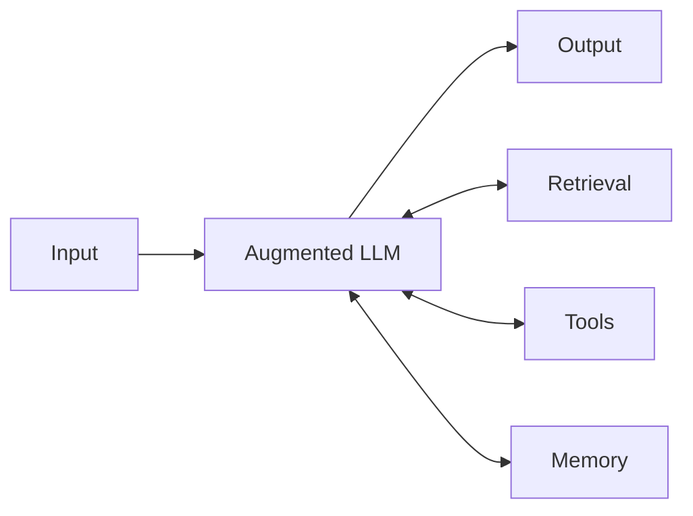
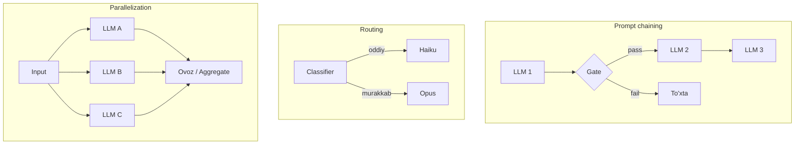

# 02. Workflow patterns — chaining, routing, parallelization

O'tgan darsda agent loop yozdik — model yo'lni o'zi boshqaradigan ochiq tsikl. Lekin production'da eng ko'p uchraydigan xato **shu**: masala oddiy bo'lsa ham unga agent qurish, keyin uni debug qila olmaslik. Ko'p ilova uchun yo'l oldindan ma'lum — bunda **workflow** yetadi: arzonroq, ishonchliroq, kuzatiladigan. Bu dars Anthropic taksonomiyasini — 5 workflow pattern'ni raw API'da yozib o'rgatadi va "qachon agent, qachon workflow" degan ish suhbati savoliga aniq javob beradi.

> Workflow'da yo'lni SIZ chizasiz (kod), agentda yo'lni MODEL tanlaydi. Murakkablik oshgani sari debug qiyinlashadi — shuning uchun eng oddiy ishlaydigan darajadan boshlang.

---

## Nazariya (~30%)

### 1. Workflow vs agent — asosiy ajratish

Anthropic ikki tushunchani qat'iy ajratadi:

| | **Workflow** | **Agent** |
|---|---|---|
| Yo'lni kim boshqaradi | Siz (oldindan yozilgan kod yo'llari) | Model (dinamik) |
| Qadamlar soni | Oldindan ma'lum | Oldindan noma'lum |
| Debug | Oson (har qadam alohida) | Qiyin (model qarori) |
| Latency / cost | Bashoratli | O'zgaruvchan |
| Qachon | Task strukturasi barqaror | Ochiq masala, yo'l qotib bo'lmaydi |

Backend analogiyasi: workflow — bu **oldindan yozilgan pipeline** (CI bosqichlari, ETL DAG). Agent — bu **runtime'da yo'lni tanlaydigan router** (feature flag'lar asosida o'zini yo'naltiradigan servis). Ikkinchisi kuchli, lekin har qaror bir nuqta xatolik.

### 2. Poydevor blok: augmented LLM

Barcha pattern'lar bitta g'ishtdan quriladi — **augmented LLM**: model + retrieval + tools + memory. Bu 1-4 bo'limlarda yig'ganingiz: tool use (05-dars), embeddings/retrieval (RAG), structured output.



Workflow — bu shu bloklarni **kod bilan** ulash. Agent — bu blokni **loop ichiga** qo'yish. Ya'ni siz allaqachon hamma qismni bilasiz; bu darsda ularni ulash sxemalarini o'rganamiz.

### 3. Besh workflow pattern



Qolgan ikkitasi (orchestrator-workers va evaluator-optimizer) alohida — pastda.

**1. Prompt chaining** — task'ni ketma-ket qadamlarga bo'lasiz, har biri oldingisining output'ini oladi. Oraliqda **gate** (dastur tomonda tekshiruv) qo'yiladi: natija yaroqsiz bo'lsa zanjir shu yerda to'xtaydi.
- *Qachon:* task tabiiy ketma-ket qadamlarga bo'linsa (avval reja, keyin yozish; avval xulosa, keyin tarjima).
- *Backend analogiya:* Unix pipe / CI pipeline. Har stage keyingisiga input beradi; bitta stage yiqilsa keyingilar ishlamaydi.

**2. Routing** — input'ni klassifikatsiya qilib, unga mos maxsus yo'lga yo'naltirasiz. Muhim foyda: **oddiy savolni arzon modelga** (`claude-haiku-4-5`) yuborish, murakkabni kuchligiga (`claude-opus-4-8`).
- *Qachon:* input turlari aniq ajraladi va har biriga boshqacha ishlov kerak.
- *Backend analogiya:* L7 load balancer / nginx `location` bloklari. So'rov turini ko'rib, mos backend'ga uzatadi. Arzon modelga yo'naltirish = statik kontentni CDN'dan berish, dinamikani app server'ga.

**3. Parallelization** — bitta ishni bir vaqtda bir nechta chaqiruvga bo'lasiz. Ikki ko'rinish:
- *Sectioning:* mustaqil bo'laklarni parallel (uzun hujjatning 5 bo'limini bir vaqtda tahlil).
- *Voting:* bitta task'ni N marta bajarib, natijalarni **ovozga** qo'yish (ishonchni oshirish).
- *Qachon:* bo'laklar bir-biriga bog'liq emas (sectioning) yoki bitta javobga ishonchni oshirish kerak (voting — guardrail).
- *Backend analogiya:* goroutine fan-out / `ThreadPoolExecutor`. Mustaqil ishlarni parallel bajarib, natijalarni yig'asiz.

**4. Orchestrator-workers** — markaziy LLM subtask'larni **dinamik** belgilaydi (parallelization'dan farqi: bo'laklar oldindan noma'lum), keyin worker'lar bajaradi, natijalar sintez qilinadi.
- *Qachon:* subtask'lar oldindan ma'lum emas (ko'p faylli kod o'zgarishi — qaysi fayllar noma'lum).
- Bu kirish darajasida eslatiladi; **chuqur 07-darsda** (multi-agent) ochamiz.

**5. Evaluator-optimizer** — ikki rolli loop: **generator** javob yozadi, **evaluator** uni baholab feedback beradi, generator qayta yozadi.
- *Qachon:* aniq baholash mezoni bor va iteratsiya sifatni oshiradi (tarjima nozikligi, kod sifati).
- *Backend analogiya:* CI review loop / lint-fix-lint. Kod push -> review bot xato topadi -> tuzatasiz -> qayta review. Yashil bo'lguncha aylanadi.

> Qoida: bitta pattern yetsa, ikkitasini birlashtirmang. Anthropic'ning eng ko'p ko'rgan xatosi — "underlying model task'ni umuman uddalay oladimi" degan savolni tekshirmasdan orchestration qatlamini ortiqcha murakkablashtirish.

---

## Amaliyot (~70%) — PRIMM

Uch pattern'ni raw API'da yozamiz. Framework yo'q — Anthropic tavsiyasi: "Start by using LLM APIs directly; many patterns can be implemented in a few lines of code."

```bash
pip install anthropic pydantic python-dotenv
```

### Predict / Run

#### 1-pattern. Prompt chaining + gate

Zanjir: **matn -> xulosa -> (gate) -> tarjima -> (sifat gate)**. Gate — bu dastur tomondagi tekshiruv: xulosa mantiqsiz bo'lsa, tarjimaga pul sarflamaymiz.

Bashorat: agar `summary` bo'sh string qaytarsa (model xato qildi), kod qaysi qatorda to'xtaydi?

```python
# file: 01_chaining.py
from dotenv import load_dotenv
import anthropic

load_dotenv()
client = anthropic.Anthropic()
MODEL = "claude-opus-4-8"


def ask(system, user, model=MODEL, max_tokens=1024):
    resp = client.messages.create(
        model=model,
        max_tokens=max_tokens,
        system=system,
        messages=[{"role": "user", "content": user}],
    )
    return "".join(b.text for b in resp.content if b.type == "text").strip()


ARTICLE = (
    "2026-07-13 kechqurun payments servisi 40 daqiqa davomida 502 qaytardi. "
    "Sabab: connection pool 20 ta ulanishga cheklangan edi, upstream postgres "
    "p99 latency 2.4 soniyaga chiqqach ulanishlar band bo'lib qoldi va navbat "
    "137 tagacha o'sdi. Yechim: pool 60 ga oshirildi, sekin query indeks bilan "
    "tuzatildi, alerting p99 uchun 1 soniyaga sozlandi."
)

# --- 1-qadam: xulosa (opus) ---
summary = ask(
    "Sen texnik tahrirchisan. Matnni 2 jumlada, asosiy faktlarni saqlab xulosala.",
    ARTICLE,
)
print("XULOSA:", summary)

# --- GATE 1: dastur tomonda tekshiruv (LLM emas, arzon) ---
words = len(summary.split())
if words < 5 or words > 60:
    raise SystemExit(f"Gate FAIL: xulosa {words} so'z (kutilgan 5-60). Zanjir to'xtadi.")

# --- 2-qadam: tarjima (opus) ---
translation = ask(
    "Sen tarjimonsan. Berilgan o'zbekcha matnni tabiiy ingliz tiliga tarjima qil.",
    summary,
)
print("TARJIMA:", translation)

# --- GATE 2: LLM sifat tekshiruvi (haiku ham yetadi) ---
verdict = ask(
    "Tarjima asl matnning ma'nosini to'liq saqlaganmi? FAQAT bitta so'z: PASS yoki FAIL.",
    f"ASL:\n{summary}\n\nTARJIMA:\n{translation}",
    model="claude-haiku-4-5",
    max_tokens=10,
)
print("SIFAT GATE:", verdict)

# Output:
# XULOSA: 2026-07-13 kuni payments servisi 40 daqiqa 502 qaytardi, chunki 20 lik
# connection pool upstream postgres sekinlashuvi (p99 2.4s) tufayli to'ldi va
# navbat 137 ga o'sdi. Pool 60 ga oshirilib, sekin query indekslandi va p99
# alerti 1 soniyaga sozlandi.
# TARJIMA: On 2026-07-13, the payments service returned 502 errors for 40 minutes
# because the 20-connection pool filled up due to upstream postgres slowdown
# (p99 2.4s), growing the queue to 137. The pool was raised to 60, the slow query
# was indexed, and the p99 alert was tuned to 1 second.
# SIFAT GATE: PASS
```

Diqqat: gate'lar **zanjirdagi valve'lar**. Gate 1 — dastur tomonda (bepul, tez). Gate 2 — LLM tekshiruvi (arzon modelda). Bashorat javobi: `summary` bo'sh bo'lsa `words == 0` -> `raise SystemExit` -> zanjir tarjimaga o'tmasdan to'xtaydi. Bu chaining'ning butun qiymati: har qadamni tekshirib, keyingisiga o'tasiz.

#### 2-pattern. Routing — arzon vs kuchli modelga yo'naltirish

Savolni **structured output** (1-bo'lim 04-dars) bilan tasniflaymiz, keyin oddiyni `haiku`ga, murakkabni `opus`ga yo'naltiramiz. Klassifikatorning o'zi ham arzon modelda ishlaydi.

Bashorat: "HTTP 502 nima?" degan savol qaysi model'ga ketadi va nega bu pul tejaydi?

```python
# file: 02_routing.py
from enum import Enum
from pydantic import BaseModel, Field
from dotenv import load_dotenv
import anthropic

load_dotenv()
client = anthropic.Anthropic()

CHEAP = "claude-haiku-4-5"
STRONG = "claude-opus-4-8"


class Category(str, Enum):
    SIMPLE = "simple"
    COMPLEX = "complex"


class Routing(BaseModel):
    category: Category = Field(
        description="simple = fakt yoki ta'rif; complex = ko'p qadamli tahlil, debug, dizayn"
    )
    reason: str = Field(description="Bir jumlada sabab")


def classify(question):
    # --- klassifikatsiya arzon modelda, schema bilan kafolatlangan ---
    resp = client.messages.parse(
        model=CHEAP,
        max_tokens=200,
        system=(
            "Foydalanuvchi savolini tasnifla. Oddiy fakt yoki ta'rif = simple. "
            "Ko'p qadamli mulohaza, debug yoki dizayn talab qilsa = complex."
        ),
        messages=[{"role": "user", "content": question}],
        output_format=Routing,
    )
    return resp.parsed_output


def answer(question):
    route = classify(question)
    model = CHEAP if route.category == Category.SIMPLE else STRONG
    print(f"[route] {route.category.value} -> {model}  ({route.reason})")
    resp = client.messages.create(
        model=model,
        max_tokens=1024,
        messages=[{"role": "user", "content": question}],
    )
    return "".join(b.text for b in resp.content if b.type == "text").strip()


for q in [
    "HTTP 502 nima degani?",
    "payments servisida connection pool exhausted xatosini qanday debug qilib, qaytalanmasligini ta'minlayman?",
]:
    print(answer(q))
    print("---")

# Output:
# [route] simple -> claude-haiku-4-5  (502 - bu oddiy ta'rif savoli)
# HTTP 502 Bad Gateway - proxy yoki gateway upstream serverdan yaroqsiz javob
# olgani. Odatda upstream o'lgan, timeout bo'lgan yoki noto'g'ri javob qaytargan.
# ---
# [route] complex -> claude-opus-4-8  (ko'p qadamli debug va oldini olish talab qilinadi)
# Debug qadamlar: 1) pool metrikalarini oching (active/idle/waiting)...
# [uzun, bosqichma-bosqich javob]
# ---
```

Nega bu tejaydi: birinchi savol `haiku`ga ketdi — u `opus`dan sezilarli arzon va tez. Klassifikator ham `haiku`da ishladi (qisqa system + qisqa output). Ya'ni ish e'lonlaridagi "cost optimization" aynan shu: har so'rovga eng kuchli modelni tashlamaysiz, avval tasniflab arzoniga yo'naltirasiz. Bu nginx'da statik faylni CDN'ga, dinamikani app'ga yuborish bilan bir mantiq.

#### 3-pattern. Parallelization — voting bilan xavfsizlik tekshiruvi

Bitta kod bo'lagini **uch marta parallel** baholaymiz va **ovozga** qo'yamiz (majority vote). Bitta chaqiruv adashishi mumkin; uch mustaqil baho ishonchni oshiradi — bu guardrail pattern.

Bashorat: uch reviewer'ning ikkitasi "xavfli" desa, qaror nima bo'ladi? Nega parallel (ketma-ket emas)?

```python
# file: 03_voting.py
from concurrent.futures import ThreadPoolExecutor
from pydantic import BaseModel, Field
from dotenv import load_dotenv
import anthropic

load_dotenv()
client = anthropic.Anthropic()
CHEAP = "claude-haiku-4-5"


class Verdict(BaseModel):
    safe: bool = Field(description="Kod xavfsizmi: command injection, secret leak, RCE yo'qmi")
    reason: str = Field(description="Bir jumlada asos")


CODE = (
    "def run(cmd):\n"
    "    import os\n"
    "    os.system('sh -c ' + cmd)   # user input to'g'ridan-to'g'ri shell'ga\n"
)


def review_once(_):
    resp = client.messages.parse(
        model=CHEAP,
        max_tokens=300,
        system=(
            "Sen xavfsizlik reviewerisan. Berilgan kodda xavf bormi baho ber: "
            "command injection, secret leak, RCE. Faqat kodga qarab hukm chiqar."
        ),
        messages=[{"role": "user", "content": CODE}],
        output_format=Verdict,
    )
    return resp.parsed_output


def vote(n=3):
    # --- N ta bahoni PARALLEL olamiz (goroutine fan-out ekvivalenti) ---
    with ThreadPoolExecutor(max_workers=n) as ex:
        verdicts = list(ex.map(review_once, range(n)))
    unsafe_votes = sum(1 for v in verdicts if not v.safe)
    # --- majority: 2 va undan ko'p "xavfli" -> BLOCK ---
    decision = "BLOCK" if unsafe_votes >= 2 else "ALLOW"
    return decision, verdicts


decision, verdicts = vote()
for i, v in enumerate(verdicts):
    print(f"reviewer {i}: safe={v.safe} | {v.reason}")
print("QAROR:", decision)

# Output:
# reviewer 0: safe=False | User input to'g'ridan-to'g'ri os.system'ga uzatilgan - command injection
# reviewer 1: safe=False | cmd sanitizatsiyasiz shell'ga qo'shilgan, RCE mumkin
# reviewer 2: safe=False | os.system + string concatenation klassik shell injection
# QAROR: BLOCK
```

Bashorat javobi: ikki "xavfli" ovoz -> `BLOCK`. Parallel muhim, chunki uch chaqiruv bir-biriga bog'liq emas — ketma-ket qilsangiz latency 3 barobar oshadi, natija o'zgarmaydi. `ThreadPoolExecutor` bu yerda yetadi: chaqiruvlar I/O-bound (tarmoq kutish), CPU emas. Voting'ning kuchi: bitta model instansiyasi noto'g'ri "safe=True" desa ham, boshqa ikkitasi uni bosadi.

### Investigate / Modify

Har mashqda avval **bashorat qiling**, keyin ishga tushiring va NEGA shundayligini tushuntiring.

**M1. Chaining gate'ni qattiqlashtiring.** `01_chaining.py`da Gate 1 chegarasini `words > 15` bo'lsa fail qiling va ishga tushiring.

<details><summary>Kutilgan natija</summary>

Xulosa odatda 20-40 so'z bo'ladi -> `SystemExit` bilan zanjir to'xtaydi, tarjimaga o'tmaydi. Bu gate'ning maqsadi: **downstream qadamga yaroqsiz input o'tkazmaslik**. Real tizimda `raise` o'rniga xatoni log qilib, "xulosa juda uzun, qayta urinaman" degan retry yoki fallback qo'yasiz. Gate — bu CI'dagi failing test: keyingi stage'ni bloklaydi, exception bilan butun tizimni o'ldirmaydi.
</details>

**M2. Routing klassifikatorini opusda ishlating.** `classify` ichida `model=CHEAP` ni `STRONG`ga o'zgartiring va farqni o'ylang.

<details><summary>Kutilgan natija</summary>

Klassifikatsiya biroz aniqroq bo'lishi mumkin, LEKIN endi HAR so'rov kamida bitta `opus` chaqiruvidan o'tadi — routing'ning butun tejamkorligi yo'qoladi. Routing'ning maqsadi arzon qadam bilan qimmat qadamdan qochish edi; klassifikatorni qimmat qilsangiz, o'zingizni o'zingiz mag'lub qildingiz. Klassifikator har doim eng arzon ishonchli modelda ishlashi kerak.
</details>

**M3. Voting'ni 5 ta ovozga oshiring va tie holatini o'ylang.** `vote(n=5)` qiling. `n` juft (masalan 4) bo'lsa nima bo'ladi?

<details><summary>Kutilgan natija</summary>

`n=5` da majority chegarasi `>= 3` bo'lishi kerak (hozirgi `>= 2` xato bo'lib qoladi). Juft `n` (4) da 2-2 teng ovoz (tie) mumkin — bunda default qaror kerak. Xavfsizlik uchun to'g'ri default: **teng bo'lsa BLOCK** ("fail closed"). Backend qoidasi: ikkilanishda xavfsiz tomonni tanla — ochiq eshik qoldirgandan ko'ra keraksiz bloklagan yaxshi.
</details>

**M4. Chaining va routing'ni birlashtiring.** Routing'da `complex` yo'lni chaining bilan almashtiring (avval reja, keyin javob). Qachon bu ortiqcha murakkablik bo'ladi?

<details><summary>Kutilgan natija</summary>

Bu ishlaydi va real tizimlar shunday quriladi (composable pattern'lar). Lekin xavf: har qo'shimcha qadam yana bir nuqta xatolik va yana latency. Agar `simple` yo'l foydalanuvchilarning 90% ini qoplasa, `complex` yo'lni over-engineer qilishdan oldin o'lchang — balki bitta yaxshi opus chaqiruvi yetadi. "Model task'ni umuman uddalaydimi" degan savolni orchestration'dan OLDIN javob bering.
</details>

### Make

**Challenge: evaluator-optimizer loop (generator + critic, 2 iteratsiya).**

Beshinchi pattern'ni yozing: **generator** git diff uchun commit xabari yozadi, **evaluator** uni conventional-commits qoidalariga solishtiradi va feedback beradi, generator qayta yozadi. Loop tasdiqlanguncha yoki 2 iteratsiya bo'lguncha aylanadi.

Shartlar:
1. Evaluator **structured output** qaytarsin (`approved: bool`, `feedback: str`)
2. Maksimum 2 iteratsiya; tasdiqlansa erta chiq
3. Generator oldingi feedback'ni hisobga olsin (elaboration: birinchi iteratsiyada feedback yo'q)
4. Evaluator arzon modelda (`haiku`), generator kuchligida (`opus`)

<details><summary>Yechim</summary>

```python
# file: 04_evaluator_optimizer.py
from pydantic import BaseModel, Field
from dotenv import load_dotenv
import anthropic

load_dotenv()
client = anthropic.Anthropic()
GEN = "claude-opus-4-8"
CRITIC = "claude-haiku-4-5"

DIFF = (
    "diff --git a/pool.py b/pool.py\n"
    "- MAX_CONN = 20\n"
    "+ MAX_CONN = 60\n"
    "+ POOL_TIMEOUT_S = 1.0\n"
    "  # payments incident: pool exhausted, p99 2.4s, queue 137\n"
)


class Review(BaseModel):
    approved: bool = Field(description="Xabar conventional-commits qoidalariga to'liq mos kelsa true")
    feedback: str = Field(description="approved=false bo'lsa aniq tuzatish yo'nalishi; aks holda bo'sh")


def generate(feedback=None):
    # --- elaboration: feedback bo'lsa uni hisobga olamiz ---
    user = (
        "Quyidagi git diff uchun conventional-commits uslubidagi commit xabarini yoz. "
        "Format: 'type: qisqa sarlavha' (imperativ ohang, sarlavha <=72 belgi).\n\n" + DIFF
    )
    if feedback:
        user += (
            "\n\nOldingi urinishga reviewer tanqidi:\n" + feedback +
            "\nShu tanqidni hisobga olib qayta yoz."
        )
    resp = client.messages.create(
        model=GEN,
        max_tokens=200,
        messages=[{"role": "user", "content": user}],
    )
    return "".join(b.text for b in resp.content if b.type == "text").strip()


def critique(message):
    resp = client.messages.parse(
        model=CRITIC,
        max_tokens=300,
        system=(
            "Sen commit xabar reviewerisan. Talablar: conventional-commits format "
            "(type: subject), imperativ ohang, sarlavha <=72 belgi, aniq va faktik. "
            "Hammasiga mos bo'lsa approved=true, aks holda approved=false va aniq feedback."
        ),
        messages=[{"role": "user", "content": message}],
        output_format=Review,
    )
    return resp.parsed_output


feedback = None
final = None
for i in range(2):
    draft = generate(feedback)
    review = critique(draft)
    print(f"[iter {i}] approved={review.approved}")
    print("  draft:", draft)
    final = draft
    if review.approved:
        break
    print("  feedback:", review.feedback)
    feedback = review.feedback

print("\nYAKUNIY:", final)

# Output:
# [iter 0] approved=False
#   draft: Increased connection pool size and added timeout to fix payments incident
#   where the pool was exhausted under upstream postgres slowdown
#   feedback: 'type:' prefiksi yo'q va sarlavha 72 belgidan uzun. 'fix:' bilan boshlab,
#   sarlavhani qisqartiring, detallarni body'ga o'tkazing.
# [iter 1] approved=True
#   draft: fix: raise db pool to 60 and add 1s timeout
#
#   payments pool exhausted under postgres p99 2.4s (queue 137); raise MAX_CONN
#   20 -> 60 and set POOL_TIMEOUT_S=1.0.
#
# YAKUNIY: fix: raise db pool to 60 and add 1s timeout
#
# payments pool exhausted under postgres p99 2.4s (queue 137); raise MAX_CONN
# 20 -> 60 and set POOL_TIMEOUT_S=1.0.
```

E'tibor bering: bu **CI review loop**ning aynan o'zi — generator "push" qiladi, critic "review" beradi, generator "fix" qiladi. Ikki chegara muhim: `approved=True` bo'lsa erta chiqamiz (keraksiz iteratsiyaga pul bermaymiz), va `range(2)` cheksiz loop'dan himoya qiladi (01-darsdagi `max_iterations` mantiq). Evaluator-optimizer agent EMAS — yo'l qat'iy (generate -> critique -> generate), model uni boshqarmaydi. Shuning uchun u agentdan arzon va bashoratli.
</details>

---

## Xulosa: qaysi pattern qachon

| Pattern | Qachon | Backend analogiya |
|---|---|---|
| Prompt chaining | Task ketma-ket qadamlarga bo'linadi | Unix pipe / CI pipeline |
| Routing | Input turlari aniq ajraladi (+ cost optimization) | L7 load balancer / nginx location |
| Parallelization | Mustaqil bo'laklar yoki ishonch uchun voting | goroutine fan-out / ThreadPoolExecutor |
| Orchestrator-workers | Subtask'lar dinamik (07-darsda) | Dinamik task decomposition |
| Evaluator-optimizer | Aniq baho mezoni + iteratsiya foyda beradi | CI review / lint-fix loop |

01-darsdagi ochiq agent loop bilan solishtiring: agent — yo'lni model tanlaganda. Bu darsda yo'lni **siz** chizdingiz. Keyingi darslarda tool sifatini ([03. Tool design](03.%20Tool%20design%20—%20agent%20uchun%20yaxshi%20tool%20yozish.md)) va planning/reflection'ni ([04. Planning va reflection](04.%20Planning%20va%20reflection%20—%20ReAct,%20Reflexion,%20Tool%20Runner.md)) chuqurlashtiramiz — o'shanda yana agentga qaytamiz.

---

## Retrieval practice

1. Workflow va agent orasidagi bitta asosiy farq nima, va bu farq debug'ga qanday ta'sir qiladi?
2. Prompt chaining'da gate nima uchun kerak? Gate'ni olib tashlasangiz, birinchi qadam yaroqsiz output bersa nima bo'ladi?
3. Routing'da klassifikatorning o'zini nega eng arzon modelda ishlatasiz? Uni opusga o'tkazsangiz nima yo'qoladi?
4. Parallelization'ning ikki ko'rinishi (sectioning va voting) nimasi bilan farq qiladi? Har biriga bittadan misol.
5. Voting'da 4 ta reviewer 2-2 teng ovoz berdi. Xavfsizlik tekshiruvida qaysi default qarorni tanlaysiz va nega?
6. "Should I build an agent" 4 mezonidan o'tmagan task uchun bu darsdagi qaysi pattern ko'pincha yetadi?

---

## Manbalar

- Anthropic engineering — "Building effective agents": workflow vs agent ajratishi, augmented LLM, 5 pattern (prompt chaining, routing, parallelization, orchestrator-workers, evaluator-optimizer): https://www.anthropic.com/engineering/building-effective-agents
- **Chip Huyen, "AI Engineering" (O'Reilly, 2025)** — Ch 6: planning'ni execution'dan ajratish, control flow (sequential/parallel/if/for), intent classifier yordamchi agent sifatida, reflection (ReAct/Reflexion).
- Anthropic docs — Messages API va structured output (`output_config.format`, `messages.parse`): https://platform.claude.com/docs/en/build-with-claude/structured-outputs
- HF Agents Course — "framework'lar bir xil asoslarning implementatsiyasi" ramkasi (U2): https://huggingface.co/learn/agents-course

> Eslatma: routing va voting'da `claude-haiku-4-5` (arzon), murakkab yo'lda `claude-opus-4-8` ishlatildi — sana suffiksisiz. `temperature`/`top_p`/prefill parametrlari joriy modellarda 400 xato, shuning uchun determinizmni **kod** (gate, structured output schema) bilan boshqaramiz, sampling parametri bilan emas.
