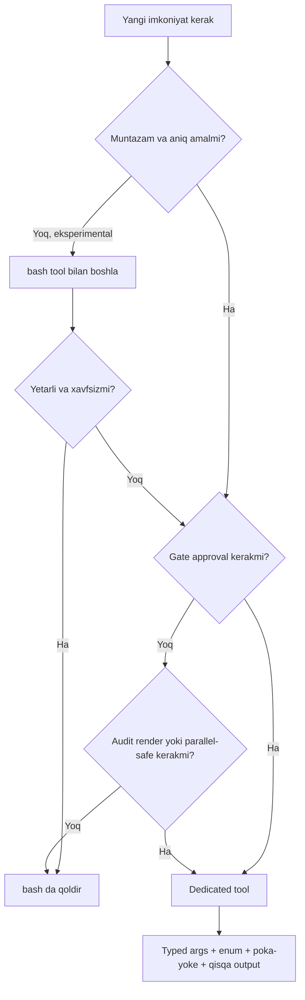

# 03. Tool design — agent uchun yaxshi tool yozish

Ish e'lonlarida "agentic systems" yozilgan har bir vakansiyada aslida yashiringan talab bor: model emas, siz yozgan **tool'lar** agentni ishlatadi yoki sindiradi. Production'da agent ko'pincha "model ahmoq" bo'lgani uchun emas, balki tool nomi noaniq, output ichida faqat raw ID qaytgani yoki argument sxemasi yumshoq bo'lgani uchun yiqiladi. Bu darsda asosiy da'voni kod bilan isbotlaymiz: **tool sifati = agent sifati**, va tool description yozish ham xuddi prompt engineering kabi iterativ ish (ACI — Agent-Computer Interface).

1-bo'limning Tool use darsida biz tool ta'rifi, `tool_use` blok, `tool_result`, `input_schema` mexanikasini yozgan edik. Bu yerda mexanikani takrorlamaymiz — endi savol boshqa: **qanday** tool yozsang agent kamroq adashadi.

---

## Nazariya (~30%)

### 1. Tool — bu API, lekin consumer'ing LLM

Backend'da REST API yozganingda consumer — boshqa dasturchi. U OpenAPI hujjatini o'qiydi, noaniq bo'lsa sizga Slack'da yozadi, kod bazasiga qaraydi. LLM esa boshqacha consumer:

| REST API consumer (dasturchi) | Tool consumer (LLM) |
|---|---|
| Hujjat noaniq bo'lsa so'raydi | Faqat `name` + `description` + `input_schema` ni ko'radi, so'ramaydi |
| Kod bazasiga qarab kontekst yig'adi | Faqat siz bergan matndan qaror qiladi |
| Deterministik — bir xil input, bir xil chaqiruv | Ehtimoliy — description yomon bo'lsa gohida to'g'ri, gohida 404 |
| Retry logikasini o'zi yozadi | Xato output'ni ko'rib "o'zicha" boshqa yo'l tanlaydi |

> Tool nomi, description va sxema — bu agent uchun **yagona hujjat va yagona type system**. Bu matnlar so'rov paytida modelning kontekstiga yuklanadi, ya'ni ular ham prompt. Yomon description = agentga yomon prompt.

### 2. Huyen: tool'larning 3 kategoriyasi

Har bir tool nima qilishiga qarab uch guruhdan biriga tushadi. Bu bo'linish keyingi darslarda (planning, xavfsizlik) markaziy bo'ladi:

| Kategoriya | Nima qiladi | Backend misoli | Xatar darajasi |
|---|---|---|---|
| **Knowledge augmentation** (read-only) | Muhitni ko'radi, o'zgartirmaydi | `SELECT`, retriever, `list_dir`, search API | Past — natijasi xato bo'lsa qaytadan chaqirasan |
| **Capability extension** | Modelning tug'ma zaifligini yopadi | calculator, unit converter, code interpreter | O'rta — code interpreter injection xavfi |
| **Write actions** | Muhitni O'ZGARTIRADI | `UPDATE`/`DELETE`, email yuborish, to'lov | Yuqori — qaytarib bo'lmaydi |

Eng muhim ajratma — **read-only vs write**. Read-only tool "perceive" (his qilish), write tool "act" (ta'sir) qiladi. Huyen buni aniq aytadi: "stajyorga production DB'ni o'chirish huquqini bermaganingizdek, ishonchsiz agentga bank o'tkazmasini bermang". Bu chegara 08-darsda (agent xavfsizligi) approval gate'ning asosi bo'ladi — hozircha shuni yodda tut: har tool'ni yozayotganda "bu read-only'mi yoki write'mi?" degan savolni birinchi ber.

### 3. Anthropic: samarali tool'ning 5 tamoyili

Anthropic'ning "Writing effective tools for agents" maqolasi SWE-bench'da SOTA bergan amaliyotni 5 qoidaga jamlaydi:

1. **Strategik tanlov** — mavjud API'ni bir-bir o'rab chiqma (thin wrapper). Kam sonli, yuqori leverage'li tool yoz. `create_row` + `read_row` + `update_row` o'rniga agent haqiqatda bajaradigan `schedule_meeting` kabi bitta kuchli tool.
2. **Aniq nom va namespace** — `search_users` vs `search_docs`. O'xshash prefiksli tool'lar (`get_user`, `find_user`) modelni adashtiradi — bu sizning routing table'ingizda ikkita bir xil route bo'lgani bilan bir xil.
3. **Mazmunli kontekst qaytar** — output'da raw `user_id=8841c2` emas, `"Ali Valiyev (VIP mijoz, 3 buyurtma)"`. Model o'qiy oladigan maydonlarni ber.
4. **Token tejamkorlik** — pagination, truncation, filtering. Agent ma'lumot ostida ko'milib qolmasin: 10000 qatorli javob context window'ni yeydi va keyingi qadamni buzadi.
5. **Description = prompt engineering** — "Call this when..." trigger shartini yoz. Kichik aniqlashtirish (masalan "returns newest first") aniqlikni sezilarli oshiradi.

### 4. Poka-yoke: argumentni xato qilib bo'lmaydigan qil

**Poka-yoke** (yaponcha "xatoni oldini olish") — dizaynni shunday tuzasan-ki, noto'g'ri ishlatib bo'lmaydi. Backend'da buni har kuni ishlatasan:

- `status VARCHAR` o'rniga `status` ustuniga `CHECK (status IN (...))` yoki enum
- funksiya argumenti `string` o'rniga typed enum
- `NOT NULL` constraint

Agent tool'ida ayni shu. Klassik misol SWE-bench'dan: agentga fayl yo'lini **relative** (`../src/main.py`) berishga ruxsat berilganda u current directory'ni chalkashtirib doim adashardi. Yechim — sxemada **absolute path talab qilish**. Xato qilishning imkoniyatini dizayn darajasida yo'q qilish, "ehtiyot bo'l" deb yozishdan kuchliroq.

```python
# YOMON: model istalgan string beradi, yarmi noto'g'ri
{"path": {"type": "string", "description": "File path"}}

# YAXSHI: poka-yoke — faqat absolute, enum bilan cheklangan format
{"path": {
    "type": "string",
    "pattern": "^/.*",
    "description": "Absolute path starting with /. Relative paths are rejected."
}}
```

### 5. bash'dan boshla, keraklisini dedicated tool'ga ko'tar

Ko'p dasturchi darrov har amal uchun alohida tool yozadi. Anthropic'ning amaliy qoidasi teskari: **kenglik uchun bash'dan boshla, aniq sabab bo'lganda dedicated tool'ga ko'tar.**

| | bash tool | Dedicated tool |
|---|---|---|
| Leverage | Juda keng — istalgan buyruq | Tor — bitta aniq amal |
| Harness'ga qaytadi | Opaque string (matn) | Typed, strukturali natija |
| Gate/approval qo'yish | Qiyin | Oson — argument typed |
| Parallel-safe belgilash | Yo'q | Ha |
| Audit / render | Qiyin | Oson |

Dedicated tool'ga ko'tarishning **4 sababi**: (1) **gate** — approval kerak (write action), (2) **render** — natijani chiroyli ko'rsatish kerak, (3) **audit** — har chaqiruvni log qilish shart, (4) **parallel-safe** — bir vaqtda xavfsiz chaqirilishi kerak. Qaytarib bo'lmas amal (email, delete, payment) doim dedicated + approval.



### 6. Tool selection: kam bo'lsa yaxshiroq (ablation)

Ko'p tool = ko'p qobiliyat, LEKIN ikki narxi bor: (1) hamma description context'ga yuklanadi va token yeydi, (2) o'xshash tool'lar orasida model adashadi. Huyen amaliy metod beradi — **ablation study**: bir tool'ni olib tashlab ko'rsatkichni o'lchaysan; agar tushmasa — o'sha tool ortiqcha, olib tashla.

Yana bir foydali diagnostika — **tool call distribution**: agent qaysi tool'ni qancha chaqirganini plot qilib ko'rasan. Agar biror tool deyarli chaqirilmasa yoki doim xato bilan chaqirilsa — nomi/description'i yomon, refactor kerak.

---

## Amaliyot (~70%)

### Predict/Run 1 — YOMON tool, sxemasi bilan

Quyida haqiqatda ish beradigan, lekin yomon dizaynli tool ta'rifi. Uni agentga bersak — muammolar boshlanadi. Avval o'zing xato qiladigan model bo'lib o'yla.

```python
# --- YOMON tool: nomi noaniq, param nomsiz, description bosh ---
bad_tool = {
    "name": "query",
    "description": "Query the database",
    "input_schema": {
        "type": "object",
        "properties": {
            "q": {"type": "string"},
        },
        "required": ["q"],
    },
}

# Executor: raw ID qaytaradi, cheksiz royxat, human-readable emas
def run_bad_query(q):
    # Mock DB: buyurtmalar
    rows = [
        {"id": "o_8841c2", "u": "u_31", "s": 2, "amt": 149000},
        {"id": "o_9930ff", "u": "u_31", "s": 1, "amt": 52000},
        {"id": "o_1120aa", "u": "u_77", "s": 3, "amt": 890000},
    ]
    # Hech qanday filtr yoki limit yoq — hammasini raw qaytaradi
    return str(rows)

print(run_bad_query("shipped orders"))
# Output:
# [{'id': 'o_8841c2', 'u': 'u_31', 's': 2, 'amt': 149000}, {'id': 'o_9930ff',
#  'u': 'u_31', 's': 1, 'amt': 52000}, {'id': 'o_1120aa', 'u': 'u_77',
#  's': 3, 'amt': 890000}]
```

Bu tool bilan agent nima qiladi? `q` — free string, shuning uchun model "shipped orders" deb yozadi, lekin executor bu matnni umuman ishlatmaydi (filtr yo'q). Output'da `s: 2` nima degani? Model bilmaydi. `u_31` kim? Bilmaydi. Natija: agent keyingi qadamda yana `query` chaqiradi yoki xayoliy javob to'qiydi.

> Muammolar ro'yxati: (1) `query` nomi — nima query? (2) `description` trigger shartsiz, (3) `q` param nomsiz va free-form, (4) enum yo'q, (5) limit/pagination yo'q, (6) output raw ID va sonli kod — human-readable emas.

### Predict/Run 2 — YAXSHI tool (refactor)

Endi ayni shu tool'ni 5 tamoyil bo'yicha qayta yozamiz. Predict qil: qaysi o'zgarish agent aniqligiga eng ko'p ta'sir qiladi?

```python
# --- YAXSHI tool: aniq nom, "Call this when", enum, limit, human output ---
good_tool = {
    "name": "search_orders",
    "description": (
        "Search a customer's orders by status. Call this when the user "
        "asks about order history, delivery status, or refunds. "
        "Read-only: does NOT modify anything. "
        "Returns at most `limit` orders, newest first."
    ),
    "input_schema": {
        "type": "object",
        "properties": {
            "status": {
                "type": "string",
                "enum": ["pending", "shipped", "delivered", "cancelled"],
                "description": "Order status to filter by.",
            },
            "limit": {
                "type": "integer",
                "description": "Max orders to return, 1 to 50.",
                "default": 20,
            },
        },
        "required": ["status"],
    },
}
```

Executor'ni ham human-readable qilamiz — bu tamoyil 3 va 4:

```python
STATUS_CODE = {1: "pending", 2: "shipped", 3: "delivered", 4: "cancelled"}
USERS = {"u_31": "Ali Valiyev", "u_77": "Nodira Karimova"}

def run_search_orders(status, limit=20):
    # --- 1-qadam: mock DB (yangi to eski tartibda) ---
    rows = [
        {"id": "o_1120aa", "u": "u_77", "s": 3, "amt": 890000},
        {"id": "o_8841c2", "u": "u_31", "s": 2, "amt": 149000},
        {"id": "o_9930ff", "u": "u_31", "s": 1, "amt": 52000},
    ]
    # --- 2-qadam: status boyicha filtr (poka-yoke: enum kafolatlaydi) ---
    picked = [r for r in rows if STATUS_CODE[r["s"]] == status]
    # --- 3-qadam: limit (token tejamkorlik) ---
    picked = picked[:limit]
    if not picked:
        return "No orders found with status '" + status + "'."
    # --- 4-qadam: human-readable output (raw ID emas) ---
    lines = []
    for r in picked:
        who = USERS.get(r["u"], r["u"])
        amount = "{:,} soum".format(r["amt"])
        lines.append("Order " + r["id"] + " | " + who + " | " + amount)
    return "\n".join(lines)

print(run_search_orders("shipped"))
# Output:
# Order o_8841c2 | Ali Valiyev | 149,000 soum
```

Endi agent output'ni to'g'ridan-to'g'ri o'qiy oladi — "Ali Valiyev, shipped, 149000 soum". `status` enum bo'lgani uchun model xayoliy status ("in_transit") berolmaydi — poka-yoke. Ikkala versiyani yonma-yon qo'yamiz:

| Aspekt | YOMON `query` | YAXSHI `search_orders` |
|---|---|---|
| Nom | Noaniq | Aniq, namespaced |
| Description | "Query the database" | Trigger shart + read-only belgisi |
| Param | `q` free string | `status` enum + `limit` |
| Xato input imkoni | Yuqori | Enum bilan yopilgan |
| Output | Raw ID va kodlar | Human-readable satrlar |
| Token xavfi | Cheksiz royxat | Limit bilan cheklangan |

### Run 3 — description iteratsiyasi (ACI = prompt engineering)

Description'ni bir marta yozib qo'ymaysan — uni prompt kabi iteratsiya qilasan. `search_repo` tool'ining uch avlodini ko'raylik:

```python
# --- v1: minimal, agent qachon chaqirishni bilmaydi ---
desc_v1 = "Search the repository."

# --- v2: trigger shart qoshildi ---
desc_v2 = (
    "Search the codebase for a text pattern. "
    "Call this when you need to find where a function, symbol, "
    "or string is used before reading full files."
)

# --- v3: chegara + output shakli + token ogohlantirish ---
desc_v3 = (
    "Search the codebase for a text pattern (literal, not regex). "
    "Call this when you need to find where a function, symbol, or string "
    "is used BEFORE reading full files. Returns up to 30 matches as "
    "`path:line: text`. If truncated, narrow the pattern. Read-only."
)

for i, d in enumerate([desc_v1, desc_v2, desc_v3], start=1):
    print("v" + str(i) + " uzunligi:", len(d), "belgi")
# Output:
# v1 uzunligi: 22 belgi
# v2 uzunligi: 141 belgi
# v3 uzunligi: 232 belgi
```

v1 → v3 o'tishda har jumla agentning bitta xatosini yopadi: v2 "qachon" ni aytadi (behuda chaqiruvni kamaytiradi), v3 "literal, not regex" hallucination'ni, "up to 30 matches" token portlashini, "if truncated, narrow" esa agentga qutulish yo'lini beradi. Description uzunroq bo'ldi, lekin token narxi tool call xatosidan arzon.

### Run 4 — `tool_choice` variantlari

Model tool chaqirishni HAR DOIM o'zi hal qilishi shart emas. `tool_choice` bilan boshqarasan (1-bo'lim Tool use darsidan tanish, bu yerda to'liq ro'yxat):

```python
# tool_choice variantlari (Anthropic Messages API)
CHOICES = {
    "auto": {"type": "auto"},            # default: model ozi hal qiladi
    "any":  {"type": "any"},             # majburan biror tool chaqiradi
    "force_one": {"type": "tool", "name": "search_orders"},  # aynan shu tool
    "none": {"type": "none"},            # tool chaqirishni taqiqlaydi
}

for name, cfg in CHOICES.items():
    print(name, "->", cfg)
# Output:
# auto -> {'type': 'auto'}
# any -> {'type': 'any'}
# force_one -> {'type': 'tool', 'name': 'search_orders'}
# none -> {'type': 'none'}
```

Qachon qaysi biri kerak:

| Variant | Ma'nosi | Backend analogiyasi | Qachon |
|---|---|---|---|
| `auto` | Model xohlasa chaqiradi | Optional middleware | Odatiy agent loop |
| `any` | Albatta biror tool | Majburiy routing | "Har savolga tool bilan javob ber" |
| `{"type":"tool", "name":...}` | Aynan bitta tool | Hardcoded route | Birinchi qadam aniq bo'lganda |
| `none` | Tool yo'q | Tool'larni o'chirish | Yakuniy javob bosqichi |

Yana bir muhim flag — `disable_parallel_tool_use: true`. Default'da model bitta javobda bir nechta `tool_use` blok yubora oladi (1-bo'limda ko'rgan parallel qoida). Agar tool'laring bir-biriga bog'liq bo'lsa yoki ketma-ketlik muhim bo'lsa, buni `true` qilib bitta chaqiruvga cheklaysan.

### Run 5 — tool call distribution (ablation hamrohi)

Nazariyada aytdik: ortiqcha yoki xato ko'p chiqadigan tool'ni topish uchun Huyen ikki diagnostika beradi — **tool call distribution** va **ablation**. Ikkalasi ham oddiy hisob, API kerak emas. Agent sessiyalaridan yig'ilgan log ustida ishlaymiz:

```python
# 05_tool_distribution.py — qaysi tool ortiqcha, qaysi biri xato beradi
from collections import Counter

# --- 1-qadam: agent sessiyalaridan yigilgan tool call log (mock) ---
call_log = [
    "search_repo", "read_file", "read_file", "search_repo",
    "read_file", "run_python", "search_repo", "read_file",
    "run_python", "run_python", "list_dir",
]
# is_error=True bilan qaytgan chaqiruvlar (03-dars: xatoni tashlamay qaytaramiz)
error_log = ["run_python", "run_python"]

# --- 2-qadam: chastota taqsimoti ---
dist = Counter(call_log)
errs = Counter(error_log)
for tool, n in dist.most_common():
    rate = errs.get(tool, 0) / n
    bar = "#" * n
    print(tool.ljust(12), str(n).rjust(2), bar.ljust(5), "err={:.0%}".format(rate))
# Output:
# read_file     4 ####  err=0%
# search_repo   3 ###   err=0%
# run_python    3 ###   err=67%
# list_dir      1 #     err=0%
```

Ikki xulosa chiqadi, ikkalasi ham amal talab qiladi:

- `list_dir` — butun log'da 1 marta. **Ablation nomzodi**: uni olib tashlab ko'rsatkichni o'lchaysan; tushmasa — olib tashla (kamroq tool = context va adashish kamayadi).
- `run_python` — 3 chaqiruvdan 2 tasi xato (67%). **Refactor nomzodi**: nomi yoki description'i modelni noto'g'ri argument berishga undayapti; poka-yoke'ni kuchaytir yoki tool'ni ikkiga bo'l (03-dars, 5-tamoyil iteratsiyasi).

> Bu diagnostikalar 6-bo'limdagi (evaluation) failure detection'ga ko'prik: aynan shu tool call distribution + error rate agent eval'ining birinchi jadvali bo'ladi.

### Bir og'iz: `strict` va structured outputs bog'lanishi

1-bo'limning Structured output darsida `output_config.format` bilan modelning JSON javobini sxemaga majbur qilgan eding. Tool input'lari uchun ham shunga o'xshash kafolat bor: sxemani qat'iy (strict) qilib belgilaganda, model bergan `input` sxemaga aynan mos keladi — enum'dan tashqari qiymat, yetishmayotgan required maydon bo'lmaydi. Bu poka-yoke'ni API darajasida kuchaytiradi: sen kodda `STATUS_CODE[r["s"]]` yozganingda `status` enum'dan chetga chiqmasligiga ishonishing mumkin. (Eslatma: MCP tool'lari va ba'zi rejimlar bilan strict mos kelmaydi — 06-darsda ko'ramiz.)

---

### Investigate/Modify — o'zgartirish mashqlari

**Mashq 1.** `search_orders` ga `since` parametri qo'sh: faqat berilgan ISO sanadan keyingi buyurtmalar qaytsin. Sxemaga description yoz va poka-yoke uchun format ko'rsat (`"ISO date, e.g. 2026-01-01"`). Executor'da mock `date` maydonini qo'shib filtrni yoz.

**Mashq 2.** `run_search_orders` ni shunday o'zgartir-ki, agar natija `limit`dan ko'p bo'lsa, oxirida `"... 12 more orders. Narrow with a status filter."` degan qator qaytsin. Bu tamoyil 4 (token tejamkorlik) ning pagination ko'rinishi — agent qisqartirilganini biladi va o'zini to'g'rilaydi.

**Mashq 3.** YOMON `query` tool'ini bir bosqichda emas, bosqichma-bosqich yaxshila: avval faqat nomni tuzat (`query` → `search_orders`), keyin ishga tushirib ko'r; keyin enum qo'sh; keyin output'ni human-readable qil. Har qadamdan keyin "agent endi qaysi xatoni qila olmaydi?" degan bir jumla yoz.

<details>
<summary>Mashq 1 uchun ishorai</summary>

Sxemaga `"since": {"type": "string", "description": "ISO date, e.g. 2026-01-01. Only orders on or after this date."}` qo'sh. Mock rows'ga `"date": "2026-03-11"` kabi maydon qo'sh va filtrda oddiy string taqqoslash yetadi (ISO sanalar leksikografik tartibda to'g'ri solishtiriladi): `[r for r in picked if r["date"] >= since]`.
</details>

---

### Make — mini-challenge: docqa retriever'ini agent tool'iga o'rash

4-bo'limda `docqa` loyihasida hybrid retrieval + rerank + citations yozgan eding. Endi o'sha retriever'ni agent chaqira oladigan **tool**ga aylantir. Vazifa — mexanika emas (uni bilasan), balki **dizayn**: yaxshi description, poka-yoke'li sxema va **qisqartirilgan output**.

Talablar:
1. Nom: `search_docs` (namespace — `search_orders`dan farqli).
2. Description: "Call this when..." trigger + read-only belgisi + output shakli.
3. Sxema: `query` (matn) + `n_results` (1-8 chegarali integer, default 3).
4. Output: har chunk uchun manba nomi + qisqartirilgan matn (masalan 200 belgi) + o'xshashlik bali. Raw embedding vektor QAYTMASIN (token portlashi).
5. Retriever'ni lokal mock bilan yoz (haqiqiy DB chaqirmaydi).

<details>
<summary>Yechim</summary>

```python
# --- 1-qadam: tool tarifi (dizayn shu yerda) ---
search_docs_tool = {
    "name": "search_docs",
    "description": (
        "Search the internal knowledge base for relevant passages. "
        "Call this when the user asks a factual question that needs "
        "documentation, policy, or reference material. Read-only. "
        "Returns up to `n_results` passages as `source | score | snippet`. "
        "Snippets are truncated to 200 chars; open the source for full text."
    ),
    "input_schema": {
        "type": "object",
        "properties": {
            "query": {
                "type": "string",
                "description": "Natural language search query.",
            },
            "n_results": {
                "type": "integer",
                "description": "Number of passages to return, 1 to 8.",
                "default": 3,
            },
        },
        "required": ["query"],
    },
}

# --- 2-qadam: lokal mock retriever (docqa dan soddalashtirilgan) ---
DOCS = [
    {"source": "refund_policy.md",
     "text": "Refunds are processed within 14 days. Items must be unused "
             "and in original packaging. Digital goods are non-refundable "
             "unless faulty. Contact support with your order id.",
     "score": 0.88},
    {"source": "shipping.md",
     "text": "Standard delivery takes 3 to 5 business days. Express delivery "
             "is next business day for orders placed before 2 PM.",
     "score": 0.61},
    {"source": "warranty.md",
     "text": "Electronics carry a 12 month warranty covering manufacturing "
             "defects. Accidental damage is not covered.",
     "score": 0.42},
]

def run_search_docs(query, n_results=3):
    # --- 3-qadam: mock retrieval (haqiqatda pgvector/rerank chaqiriladi) ---
    n_results = max(1, min(n_results, 8))   # poka-yoke: chegarani majbur qil
    hits = sorted(DOCS, key=lambda d: d["score"], reverse=True)[:n_results]
    if not hits:
        return "No relevant passages found."
    # --- 4-qadam: qisqartirilgan, human-readable output ---
    lines = []
    for h in hits:
        snippet = h["text"][:200]
        if len(h["text"]) > 200:
            snippet = snippet + "..."
        lines.append(h["source"] + " | " + str(h["score"]) + " | " + snippet)
    return "\n".join(lines)

print(run_search_docs("how long do refunds take", n_results=2))
# Output:
# refund_policy.md | 0.88 | Refunds are processed within 14 days. Items must
#  be unused and in original packaging. Digital goods are non-refundable
#  unless faulty. Contact support with your order id.
# shipping.md | 0.61 | Standard delivery takes 3 to 5 business days. Express
#  delivery is next business day for orders placed before 2 PM.
```

E'tibor ber: output'da embedding vektor ham, chunk'ning to'liq 5000 belgili matni ham yo'q — faqat manba, bal va 200 belgili snippet. Agent kerak bo'lsa `read_file(source)` bilan to'liq matnni oladi. Bu tamoyil 4 (token tejamkorlik) va progressive disclosure: kam ber, kerak bo'lsa ko'proq so'rasin.
</details>

---

## Retrieval practice

Javoblarni yozma — xotirangdan chiqar, keyin darsga qaytib tekshir:

1. Nega tool `description` ni "prompt engineering" deb ataymiz? U qayerga va qachon yuklanadi?
2. Read-only va write action tool'lar orasidagi chegara nega faqat "toza dizayn" emas, balki xavfsizlik masalasi? (08-darsni oldindan o'yla.)
3. Poka-yoke nima va absolute path misolida u qanday xatoni **dizayn darajasida** yo'q qiladi?
4. Anthropic "bash'dan boshla, keyin dedicated'ga ko'tar" deydi. Qaysi 4 sabab bo'lganda dedicated tool'ga ko'tarasan?
5. Ablation study nima uchun kerak — 30 ta tool'li agentning aniqligi nega 8 ta tool'likidan yomon bo'lishi mumkin?
6. `tool_choice` ning `any` va `{"type":"tool","name":...}` variantlari orasidagi farq nima, har biri qachon kerak?

---

## Manbalar

- **Chip Huyen, "AI Engineering" (2025)** — Ch 6, Agents + Memory (p.298–328): tool'larning 3 kategoriyasi (knowledge augmentation / capability extension / write actions), read-only vs write, tool selection va ablation study, tool call distribution.
- **Anthropic Engineering — "Writing effective tools for agents"** (anthropic.com/engineering/writing-tools-for-agents): 5 tamoyil, human-readable output, pagination/truncation, description = prompt.
- **Anthropic Engineering — "Building effective agents"** (anthropic.com/engineering/building-effective-agents): ACI, poka-yoke, absolute path SWE-bench misoli, "give the model tokens to think".
- **Anthropic API — agent-design / tool use**: bash vs dedicated tool qarori (gate/render/audit/parallel-safe), `tool_choice` variantlari, `disable_parallel_tool_use`.
- Kurs ichida: 1-bo'lim "05. Tool use" (tool ta'rifi, `tool_use`/`tool_result` mexanikasi), "04. Structured output" (`strict` sxema bog'lanishi). Keyingi dars: [04. Planning va reflection — ReAct, Reflexion, Tool Runner](04. Planning va reflection — ReAct, Reflexion, Tool Runner.md).
