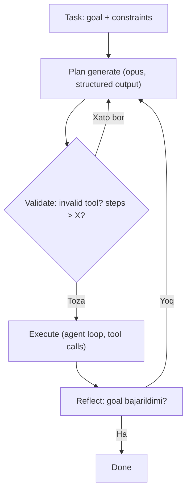

# 04. Planning va reflection — ReAct, Reflexion, Tool Runner

Agar tool'laring yaxshi bo'lsa ham (03-dars), agent baribir yiqilishi mumkin: u behuda 40 qadam qilib API byudjetini yoqadi, yoki "vazifani bajardim" deb ishonadi, aslida yo'q. Ish e'lonlarida "agentic reasoning", "self-correcting agents" degan iboralar aynan shu haqda. Agent muvaffaqiyatining ikkinchi ustuni — **reja (planning)** va **o'z-o'zini tekshirish (reflection)**. Bu darsda uchta narsani kod bilan yechamiz: rejani ijrodan ajratish, reflection loop, va bularni Tool Runner bilan qanchalik qisqa yozish mumkinligi.

01-darsda agent loop'ni yozgan eding: `reason → act → observe`. Bu darsda o'sha loop'ning ikki tomonini kuchaytiramiz — oldiga **plan**, oxiriga **reflection** qo'shamiz.

---

## Nazariya (~30%)

### 1. Plan ≠ execution

Backend'da bu ajratma sizga tanish: Postgres so'rovni ikki bosqichda bajaradi — avval **planner** `EXPLAIN` bilan reja tuzadi (qaysi indeks, qaysi join tartibi), keyin **executor** o'sha rejani ijro etadi. Ikki bosqich alohida bo'lgani uchun sen rejani bajarilishidan OLDIN ko'rib, yomon bo'lsa to'xtata olasan.

Agent'da xuddi shu kerak. Huyen ogohlantiradi: agar planning'ni execution'dan ajratmasang, model **1000 qadamlik behuda rejani soatlab bajarib API pulini yoqadi**. Yechim — oqimni bo'lish:



To'liq jarayonda 4 bosqich bor: (1) **plan generation** (task'ni qadamlarga bo'lish), (2) **reflection** ("reja o'zi yaxshimi?"), (3) **execution** (tool call'lar), (4) **reflection** ("goal bajarildimi?"). Validatsiyani heuristika (invalid tool bormi, qadamlar soni X dan oshdimi) yoki AI judge bajaradi.

### 2. Planning granularity: funksiya nomi vs natural language

Reja qanchalik batafsil bo'lsin? Ikki chekka bor va ular klassik coupling savoli:

| | Batafsil reja (funksiya nomlari) | Yuqori daraja (natural language) |
|---|---|---|
| Generatsiyasi | Qiyin (model aniq nom bilishi kerak) | Oson |
| Bajarilishi | Oson (to'g'ridan-to'g'ri) | **Translator** kerak |
| Tool o'zgarsa | Sinadi — `get_time` → `get_current_time` bo'lsa hamma prompt yangilanadi | Robust — matn o'zgarmaydi |
| Backend analogiyasi | Tight coupling (hardcoded funksiya nomi) | Interface + adapter |

`get_time` → `get_current_time` misoli — bu sizga tanish tight coupling og'rig'i: funksiya imzosini o'zgartirsang, uni ishlatgan hamma joy sinadi. Natural language reja ("hozirgi vaqtni ol") robust, lekin uni haqiqiy tool call'ga aylantiruvchi **translator** kerak — bu oson vazifa, arzon model (haiku) bajaradi. **Hierarchical planning** trade-off'ni yengadi: yuqori daraja robust, past daraja aniq.

### 3. Control flow — reja shakli

Reja shunchaki tekis ro'yxat emas. Xuddi dasturdagi kabi control flow'ga ega bo'lishi mumkin: **sequential** (ketma-ket), **parallel** (bir vaqtda — 10 saytni parallel ochish), **if** (shart), **for** (takror). Farqi: bu yerda qaysi control flow ishlatishni **model** hal qiladi. Parallel qadamlar latency'ga katta ta'sir qiladi — 10 fayl ketma-ket o'qilsa sekin, parallel bo'lsa tez (goroutine fan-out kabi).

### 4. FM reja qila oladimi? (qisqa bahs)

Bu ochiq ilmiy savol. **LeCun**: autoregressive LLM haqiqiy planning qila olmaydi. **Kambhampati**: LLM bilim ekstraksiyada zo'r, planning'da emas. Qarshi argument: planning aslida **search** (backtracking bilan), LLM path'ni qayta ko'rib chiqishi mumkin; asosiy muammo — model action'ning natijasini oldindan bilmaydi (**world model** yetishmasligi). Amaliy xulosa: hozircha rejani validatsiya va reflection bilan qo'llab-quvvatlash shart — model o'zi mukammal reja bermaydi.

### 5. Planning failures — bularni sanashdan eval boshlanadi

Huyen agent xatolarini aniq kategoriyalarga bo'ladi. Bu ro'yxat 6-bo'limda (evaluation) markaziy bo'ladi, lekin planning'ni tushunish uchun hozir kerak:

| Failure turi | Misol |
|---|---|
| **Invalid tool** | `bing_search` chaqirildi, lekin inventory'da yo'q |
| **Valid tool + invalid params** | `lbs_to_kg(x, y)` — funksiya bitta argument oladi |
| **Valid tool + noto'g'ri qiymat** | 100 o'rniga 120 uzatildi |
| **Goal failure** | Task yechilmadi yoki constraint buzildi ($5000 byudjet oshib ketdi) |
| **Reflection error** | Agent "bajardim" deydi, aslida yo'q — 50 odam / 30 xona, 40 tasi joylashtirildi, agent "hammasi joylashdi" deb ishonadi |

Reflection error eng xavflisi — agent o'ziga yolg'on ishonadi. Shuning uchun reflection qadami sodda "bajardimmi?" emas, aniq mezon bilan tekshirilishi kerak.

### 6. ReAct va Reflexion — ikki asosiy pattern

**ReAct** (Yao 2022) — agent'larning standart pattern'i: **Thought → Act → Observation** ni bir-biriga o'rish. Diqqat qil: bu aynan 01-darsdagi loop'ing! Har iteratsiyada:

- **Thought** = model tool chaqirishdan oldin yozgan matn ("payments servisini tekshirishim kerak")
- **Act** = `tool_use` blok (tool chaqiruvi)
- **Observation** = `tool_result` (tool natijasi)

Ya'ni sen ReAct'ni allaqachon yozgansan, faqat nomini bilmagansan. "Thought" muhim — modelga o'ylash uchun token berish aniqlikni oshiradi (bu 03-darsdagi ACI tamoyili "give the model tokens to think" bilan bir xil g'oya).

**Reflexion** (Shinn 2023) — ReAct ustiga **evaluator + self-reflection** moduli qo'shadi. Agent bitta urinishni (trajectory) bajaradi, evaluator uni baholaydi, agent o'ziga qisqa **fikr** yozadi ("o'tgan safar search'ni juda keng qildim"), va keyingi urinishda o'sha fikrni ishlatadi. Bu actor-critic'ga o'xshaydi: bir modul harakat qiladi, boshqasi tanqid qiladi. Narxi — token va latency; foydasi — sifat sakrashi.

> Oltin qoida: reflection ishlash uchun majburiy emas, lekin muvaffaqiyat uchun zarur. Reja agentni yo'ldan chiqmaslikka majbur qiladi; reflection esa chiqib ketganini tuzatadi.

---

## Amaliyot (~70%)

Quyida 01-darsdagi fayl-agent tool inventory'sini ishlatamiz (`read_file`, `list_dir`, `search_repo`, `run_python`). API kalitisiz ishga tushmasa ham, `# Output` izohlari haqiqiy API javob strukturasiga mos.

### Predict/Run 1 — reja generatsiyasi (structured output) + validatsiya

Rejani erkin matn sifatida emas, **structured output** bilan olamiz (1-bo'lim "04. Structured output" darsidan tanish `messages.parse`). Shunda reja mashina o'qiy oladigan ro'yxat bo'ladi va uni validatsiya qila olamiz. Predict qil: model reja ichiga inventory'da yo'q tool yozib qo'ysa, nima qilamiz?

```python
# 01_plan_generate.py
import os
import anthropic
from pydantic import BaseModel, Field
from typing import List
from dotenv import load_dotenv

load_dotenv()
client = anthropic.Anthropic()

# --- 1-qadam: reja sxemasi (har qadam = tool + sabab) ---
class PlanStep(BaseModel):
    tool: str = Field(description="Tool name, must be from the inventory")
    args_summary: str = Field(description="Short natural language of the arguments")
    reason: str = Field(description="Why this step is needed")

class Plan(BaseModel):
    steps: List[PlanStep]

TOOL_INVENTORY = ["read_file", "list_dir", "search_repo", "run_python"]

PLANNER_SYSTEM = (
    "You are a planner for a file-analysis agent. "
    "Break the task into an ordered list of steps. "
    "Each step must use exactly one tool from this inventory: "
    + ", ".join(TOOL_INVENTORY) + ". "
    "Keep the plan short (max 6 steps). Do NOT execute anything."
)

task = ("Find every file that still calls the deprecated function "
        "`old_login()` and list which files need updating.")

# --- 2-qadam: opus dan strukturali reja soraymiz ---
resp = client.messages.parse(
    model="claude-opus-4-8",
    max_tokens=1500,
    system=PLANNER_SYSTEM,
    messages=[{"role": "user", "content": task}],
    output_format=Plan,
)
plan = resp.parsed_output

for i, step in enumerate(plan.steps, start=1):
    print(str(i) + ". " + step.tool + " -> " + step.args_summary)
# Output:
# 1. search_repo -> pattern "old_login(" across the repo
# 2. read_file -> open each file that matched to confirm real call sites
# 3. run_python -> group matches by file and format an update checklist
```

Reja tayyor, lekin **hali hech narsa bajarilmadi** — bu plan/execution ajratmasining butun mohiyati. Endi rejani ijro etishdan OLDIN validatsiya qilamiz:

```python
# --- 3-qadam: heuristik validatsiya (arzon, deterministik) ---
MAX_STEPS = 6

def validate_plan(plan):
    errors = []
    if len(plan.steps) > MAX_STEPS:
        errors.append("too_many_steps: " + str(len(plan.steps)))
    for i, step in enumerate(plan.steps, start=1):
        if step.tool not in TOOL_INVENTORY:
            errors.append("step " + str(i) + ": invalid_tool '" + step.tool + "'")
    return errors

errors = validate_plan(plan)
if errors:
    print("REJECTED:", errors)   # -> qayta reja soraymiz (loop)
else:
    print("PLAN OK: " + str(len(plan.steps)) + " steps, all tools valid")
# Output:
# PLAN OK: 3 steps, all tools valid
```

E'tibor ber: bu validatsiya API chaqirmaydi — sof deterministik heuristika. `invalid_tool` va `too_many_steps` — Huyen ro'yxatidagi planning failure'larning aynan o'zi. Agar reja rad etilsa, xatoni model'ga qaytarib yangi reja so'raysan (diagrammadagi orqaga qaytish o'qi).

> Model'ga `structured output` bergani `tool` maydonini string qiladi, lekin uning inventory'da borligini **kafolatlamaydi**. Shuning uchun `validate_plan` shart — sxema formatni majbur qiladi, mazmunni emas.

### Predict/Run 1b — yuqori darajali reja + translator

Yuqoridagi reja qadamlariga aniq tool nomini yozdik (`search_repo`). Nazariyada aytdik: bu **tight coupling** — `search_repo` ni ertaga `grep_code` deb qayta nomlasang, planner prompt'ini ham yangilashing kerak. Robustroq yo'l — planner **natural language** reja bersin (tool nomisiz), keyin arzon **translator** har qadamni aniq tool call'ga aylantirsin. Predict qil: tool qayta nomlansa endi nechta joyni o'zgartirasan?

```python
# 01b_translator.py — robust reja + arzon translator
import anthropic
from pydantic import BaseModel, Field
from dotenv import load_dotenv

load_dotenv()
client = anthropic.Anthropic()

TOOL_INVENTORY = ["read_file", "list_dir", "search_repo", "run_python"]

# --- 1-qadam: tool nomisiz, robust reja (planner shuni beradi) ---
nl_plan = [
    "find every place old_login is called",
    "open the first matched file to confirm it is a real call",
    "group the matches by file and print an update checklist",
]

# --- 2-qadam: translator har qadamni bitta aniq tool call'ga aylantiradi ---
class ToolCall(BaseModel):
    tool: str = Field(description="One tool from the inventory")
    args: str = Field(description="Concrete arguments as a short string")

TRANSLATOR_SYSTEM = (
    "Translate ONE high-level step into a single concrete tool call. "
    "Inventory: " + ", ".join(TOOL_INVENTORY) + ". Output one call only."
)

def translate(step):
    resp = client.messages.parse(
        model="claude-haiku-4-5",       # translator = oson vazifa -> arzon model
        max_tokens=300,
        system=TRANSLATOR_SYSTEM,
        messages=[{"role": "user", "content": step}],
        output_format=ToolCall,
    )
    return resp.parsed_output

for step in nl_plan:
    call = translate(step)
    print(call.tool + "(" + call.args + ")")
# Output:
# search_repo(pattern="old_login(")
# read_file(path="auth/legacy.py")
# run_python(code="group matches by file and print a checklist")
```

Javob: agar `search_repo` → `grep_code` bo'lsa, sen faqat `TOOL_INVENTORY` ro'yxatini yangilaysan — `nl_plan` matni tegilmaydi, chunki u tool nomiga bog'liq emas. Bu **hierarchical planning**: yuqori qatlam (natural language) robust, past qatlam (translator) aniq. Narxi — bitta qo'shimcha haiku chaqiruvi har qadamga, lekin bu opus rejasini sindirmaslikdan arzon.

### Predict/Run 2 — rejani ijro etish (ReAct loop)

Reja tasdiqlandi. Endi execution — bu 01-darsdagi agent loop. API kalitisiz to'liq chaqira olmaymiz, shuning uchun tool'larni mock qilamiz va loop trajektoriyasini ko'rsatamiz. Diqqat: bu ReAct — har iteratsiya Thought/Act/Observation.

```python
# 02_execute.py (mock tool'lar bilan — ReAct trajektoriyasi)

# --- 1-qadam: mock tool implementatsiyalari ---
def search_repo(pattern):
    hits = {
        "old_login(": ["auth/legacy.py:44", "api/v1/session.py:12", "tests/test_auth.py:88"],
    }
    return hits.get(pattern, [])

def read_file(path):
    mock = {
        "auth/legacy.py": "def old_login(user):  # TODO remove\n    return _login(user)",
    }
    return mock.get(path, "<file not found>")

TOOLS = {"search_repo": search_repo, "read_file": read_file}

# --- 2-qadam: mock trajektoriya (haqiqatda model qaytaradi) ---
trajectory = [
    ("Thought", "Avval old_login( ni butun repo boyicha qidiraman."),
    ("Act", "search_repo(pattern='old_login(')"),
    ("Observation", str(search_repo("old_login("))),
    ("Thought", "3 fayl topildi. Birinchisini ochib haqiqiy chaqiruvligini tasdiqlayman."),
    ("Act", "read_file(path='auth/legacy.py')"),
    ("Observation", read_file("auth/legacy.py")),
    ("Thought", "Bu haqiqiy chaqiruv. Endi royxatni yigib javob beraman."),
]

for role, content in trajectory:
    print("[" + role + "] " + content)
# Output:
# [Thought] Avval old_login( ni butun repo boyicha qidiraman.
# [Act] search_repo(pattern='old_login(')
# [Observation] ['auth/legacy.py:44', 'api/v1/session.py:12', 'tests/test_auth.py:88']
# [Thought] 3 fayl topildi. Birinchisini ochib haqiqiy chaqiruvligini tasdiqlayman.
# [Act] read_file(path='auth/legacy.py')
# [Observation] def old_login(user):  # TODO remove
#     return _login(user)
# [Thought] Bu haqiqiy chaqiruv. Endi royxatni yigib javob beraman.
```

Bu trajektoriya ReAct'ning ta'rifi: **Thought** (reason) → **Act** (tool call) → **Observation** (natija), takror. Haqiqiy loop'da `Thought` va `Act` model javobidan, `Observation` esa sizning `execute_tool`'ingizdan keladi.

### Predict/Run 3 — reflection qadami ("goal bajarildimi?")

Execution tugadi. Agent "bajardim" deb ishonishiga ishonmaymiz (reflection error!) — aniq mezon bilan tekshiramiz. Reflection'ni ham structured output bilan olamiz:

```python
# 03_reflect.py
import anthropic
from pydantic import BaseModel, Field
from dotenv import load_dotenv

load_dotenv()
client = anthropic.Anthropic()

# --- 1-qadam: reflection sxemasi (mezon aniq) ---
class Reflection(BaseModel):
    goal_achieved: bool = Field(description="True only if the original goal is fully met")
    missing: str = Field(description="What is still missing, or 'nothing'")
    next_action: str = Field(description="One of: 'done', 'replan'")

REFLECT_SYSTEM = (
    "You are a strict evaluator. Given the original task and what the agent "
    "produced, decide if the goal is FULLY met. Do not be generous. "
    "If any file from the search was not accounted for, goal_achieved is false."
)

task = "List every file that calls old_login() and needs updating."
agent_output = ("Files to update: auth/legacy.py. "
                "(api/v1/session.py and tests/test_auth.py were not checked.)")

# --- 2-qadam: baho olamiz ---
resp = client.messages.parse(
    model="claude-haiku-4-5",       # baholash arzon qadam -> haiku
    max_tokens=500,
    system=REFLECT_SYSTEM,
    messages=[{"role": "user", "content": "TASK: " + task + "\n\nOUTPUT: " + agent_output}],
    output_format=Reflection,
)
verdict = resp.parsed_output
print("achieved:", verdict.goal_achieved)
print("missing:", verdict.missing)
print("next:", verdict.next_action)
# Output:
# achieved: False
# missing: api/v1/session.py and tests/test_auth.py were never opened or confirmed
# next: replan
```

Reflection `False` qaytardi va `replan` dedi — chunki agent 3 fayldan 1 tasini tekshirdi, xolos. Bu aynan Huyen'ning **reflection error**iga qarshi mudofaa: mezon aniq ("agar biror fayl hisobga olinmagan bo'lsa — false"), shuning uchun agent o'ziga yolg'on ishona olmaydi. `next_action == "replan"` bo'lsa, diagrammadagi orqaga qaytish o'qi bilan yangi reja so'raysan.

### Predict/Run 4 — xuddi shu agent, endi Tool Runner bilan

01-darsda manual loop (`while stop_reason == "tool_use"`) ni O'ZING yozgansan — mexanikani to'liq ko'rding. Endi mexanikani bilganingdan keyin, boilerplate'ni SDK olib beradi. **Tool Runner** — bu `anthropic` SDK ichidagi yordamchi (framework EMAS, aloqasi yo'q): sen faqat tool funksiyalarni yozasan, loop'ni u aylantiradi.

```python
# 04_tool_runner.py
import anthropic
from anthropic import beta_tool
from dotenv import load_dotenv

load_dotenv()
client = anthropic.Anthropic()

# --- 1-qadam: tool = oddiy funksiya. Sxema signaturadan + docstring dan ---
@beta_tool
def search_repo(pattern: str) -> str:
    """Search the codebase for a literal text pattern.

    Call this to find where a symbol is used before reading full files.

    Args:
        pattern: The literal text to search for, e.g. old_login(
    """
    hits = ["auth/legacy.py:44", "api/v1/session.py:12"]
    return "\n".join(hits)

@beta_tool
def read_file(path: str) -> str:
    """Read a text file and return its contents.

    Args:
        path: Absolute path to the file.
    """
    return "def old_login(user): ..."

# --- 2-qadam: loop ni SDK aylantiradi (harness) ---
runner = client.beta.messages.tool_runner(
    model="claude-opus-4-8",
    max_tokens=8000,
    tools=[search_repo, read_file],
    messages=[{"role": "user", "content": "Find files calling old_login()"}],
)

for message in runner:
    print("stop_reason:", message.stop_reason)
# Output:
# stop_reason: tool_use
# stop_reason: tool_use
# stop_reason: end_turn
```

Diqqat qilinadigan nuqtalar:

1. **Schema avtomatik** — `search_repo(pattern: str)` signaturasi + docstring'dan `input_schema` generatsiya bo'ladi. Docstring baribir muhim (u description bo'ladi) — ya'ni 03-darsdagi ACI qoidalari bu yerda ham amal qiladi.
2. **Qator soni** — manual loop'da tool_use blokni parse qilish, `tool_result` yig'ish, `messages` ga append qilish qo'lda edi (~40 qator). Tool Runner'da bu ~12 qator. Nima ketdi: boilerplate. Nima qoldi: tool funksiyalar va ularning sifati.
3. **Per-turn hook'lar** — approval yoki natijani o'zgartirish uchun `runner.set_messages_params()`, `runner.generate_tool_call_response()` bor (08-darsda HITL uchun ishlatamiz).

> Ogohlantirish: Python Tool Runner (0.116.0 holatida) `pause_turn` ni avtomatik davom ettirmaydi — server-side tool limiti urilsa, paused turn loop'ni jimgina tugatadi. Server tool'lar aralashtirsang, `message.stop_reason` ni o'zing tekshir. Shuning uchun **manual loop hali ham kerak**: loop'ni to'liq nazorat qilish, beta'ga bog'lanmaslik yoki noodatiy `stop_reason` mantiqi kerak bo'lganda.

Qachon Tool Runner, qachon manual loop:

| | Manual loop (01-dars) | Tool Runner |
|---|---|---|
| Boilerplate | Sen yozasan | SDK oladi |
| `stop_reason` nazorati | To'liq sizda | Ba'zi hollarda (`pause_turn`) qo'lda tekshir |
| Beta bog'liqligi | Yo'q | Ha (beta yordamchi) |
| Qachon | To'liq nazorat, murakkab oqim | Standart tool loop, tez yozish |

---

### Investigate/Modify — o'zgartirish mashqlari

**Mashq 1.** `validate_plan` ga uchinchi heuristika qo'sh: reja ketma-ket ikki marta bir xil tool'ni bir xil `args_summary` bilan chaqirsa — rad et (`duplicate_step`). Bu behuda takror qadamlarni ushlaydi.

**Mashq 2.** Predict/Run 3 dagi `Reflection` sxemasiga `confidence` maydonini qo'sh (`"low" | "medium" | "high"` enum) va reflection'ni faqat `confidence == "high"` bo'lganda `done` deb qabul qil. Past ishonchda qo'shimcha tekshiruv qadamini majbur qil.

**Mashq 3.** Predict/Run 4 dagi `read_file` docstring'ini 03-dars poka-yoke tamoyili bilan kuchaytir: absolute path talab qilishni docstring'da aniq yoz va tool ichida `path` `/` bilan boshlanmasa `is_error` ma'nosidagi matn qaytar.

<details>
<summary>Mashq 1 uchun ishorai</summary>

Loop'da oldingi qadamni eslab tur:

```python
def validate_plan(plan):
    errors = []
    if len(plan.steps) > MAX_STEPS:
        errors.append("too_many_steps: " + str(len(plan.steps)))
    prev = None
    for i, step in enumerate(plan.steps, start=1):
        if step.tool not in TOOL_INVENTORY:
            errors.append("step " + str(i) + ": invalid_tool '" + step.tool + "'")
        key = step.tool + "|" + step.args_summary
        if key == prev:
            errors.append("step " + str(i) + ": duplicate_step")
        prev = key
    return errors
```
</details>

---

### Make — mini-challenge: plan validator (heuristika + AI judge)

Ikki qatlamli plan validator yoz. **Qatlam 1** — arzon deterministik heuristika (invalid tool, `> MAX_STEPS`, duplicate). **Qatlam 2** — heuristikadan o'tsa, `claude-haiku-4-5` bilan AI judge: "bu reja goal'ga mantiqan olib boradimi?" degan structured output baho. Heuristika ushlay olmaydigan mantiqiy xatolarni (masalan: fayl yozishdan oldin o'qimagan) AI judge ushlaydi.

Talablar:
1. `validate_plan_heuristic(plan) -> list[str]` — sof funksiya, API'siz.
2. `validate_plan_ai(task, plan) -> Verdict` — haiku bilan, structured output (`plausible: bool`, `problem: str`).
3. `validate(task, plan)` — avval heuristika; xato bo'lsa darrov rad et (haiku'ni behuda chaqirmA); toza bo'lsa AI judge'ga uzat.

<details>
<summary>Yechim</summary>

```python
# make_validator.py
import anthropic
from pydantic import BaseModel, Field
from typing import List
from dotenv import load_dotenv

load_dotenv()
client = anthropic.Anthropic()

TOOL_INVENTORY = ["read_file", "list_dir", "search_repo", "run_python"]
MAX_STEPS = 6

class PlanStep(BaseModel):
    tool: str
    args_summary: str
    reason: str

class Plan(BaseModel):
    steps: List[PlanStep]

class Verdict(BaseModel):
    plausible: bool = Field(description="True if the plan logically reaches the goal")
    problem: str = Field(description="The main logical flaw, or 'none'")

# --- Qatlam 1: arzon heuristika (deterministik, API'siz) ---
def validate_plan_heuristic(plan):
    errors = []
    if len(plan.steps) > MAX_STEPS:
        errors.append("too_many_steps: " + str(len(plan.steps)))
    for i, step in enumerate(plan.steps, start=1):
        if step.tool not in TOOL_INVENTORY:
            errors.append("step " + str(i) + ": invalid_tool '" + step.tool + "'")
    return errors

# --- Qatlam 2: AI judge (mantiqiy xatolar uchun, arzon model) ---
JUDGE_SYSTEM = (
    "You judge whether an ordered plan of tool calls logically achieves "
    "the task. Flag ordering mistakes (e.g. writing a file before reading it) "
    "and missing steps. Be strict."
)

def validate_plan_ai(task, plan):
    steps_text = "\n".join(
        str(i) + ". " + s.tool + " (" + s.args_summary + ")"
        for i, s in enumerate(plan.steps, start=1)
    )
    resp = client.messages.parse(
        model="claude-haiku-4-5",
        max_tokens=500,
        system=JUDGE_SYSTEM,
        messages=[{"role": "user", "content": "TASK: " + task + "\n\nPLAN:\n" + steps_text}],
        output_format=Verdict,
    )
    return resp.parsed_output

# --- Orkestratsiya: arzonni oldin, qimmatni keyin ---
def validate(task, plan):
    errors = validate_plan_heuristic(plan)
    if errors:
        return (False, errors)                 # haiku'ni behuda chaqirmaymiz
    verdict = validate_plan_ai(task, plan)
    if not verdict.plausible:
        return (False, [verdict.problem])
    return (True, [])

# Demo
demo_plan = Plan(steps=[
    PlanStep(tool="run_python", args_summary="write summary.md", reason="save result"),
    PlanStep(tool="search_repo", args_summary="find old_login(", reason="locate usages"),
])
ok, problems = validate("List files calling old_login()", demo_plan)
print("ok:", ok)
print("problems:", problems)
# Output:
# ok: False
# problems: ['Plan writes the summary before searching; ordering is reversed']
```

E'tibor ber: heuristika bu rejani o'tkazdi (ikkala tool valid, 2 qadam), lekin **mantiqiy** xato bor — natija yozilyapti hali qidirilmasdan. Buni faqat AI judge ushladi. Ikki qatlam bir-birini to'ldiradi: heuristika arzon va aniq (format xatolari), AI judge qimmat va mazmunli (mantiq xatolari).
</details>

---

## Retrieval practice

Javoblarni yozma — xotirangdan chiqar:

1. Nega plan'ni execution'dan ajratamiz? Ajratmasak qanday konkret zarar bo'ladi (Postgres analogiyasi bilan ayt)?
2. `get_time` → `get_current_time` misoli qaysi planning granularity muammosini ko'rsatadi? Natural language reja buni qanday yengadi va uning narxi nima?
3. ReAct'ning uch qadami nima, va ular 01-darsdagi agent loop'ning qaysi qismlariga to'g'ri keladi?
4. Reflexion ReAct ustiga nimani qo'shadi? Actor-critic bilan o'xshashligi nimada?
5. "Reflection error" nima va nega u eng xavfli planning failure? Predict/Run 3 kodi unga qanday qarshi turadi?
6. Tool Runner manual loop'dan qaysi holatlarda kam ish talab qiladi, va qaysi bitta muhim `stop_reason` uchun manual tekshiruv hali ham kerak?

---

## Manbalar

- **Chip Huyen, "AI Engineering" (2025)** — Ch 6, Agents (p.304–323): plan ≠ execution, planning granularity va translator, control flow, FM planner bahsi (LeCun/Kambhampati), planning failures ro'yxati, ReAct va Reflexion, reflection joylari.
- **Yao et al., 2022 — "ReAct: Synergizing Reasoning and Acting"**: Thought → Act → Observation pattern.
- **Shinn et al., 2023 — "Reflexion"**: evaluator + self-reflection moduli, trajectory baholash.
- **Anthropic API — Tool Runner (beta)**: `beta_tool`, `client.beta.messages.tool_runner`, docstring'dan sxema, per-turn hook'lar, `pause_turn` ogohlantirishi (Python runner avto-davom ettirmaydi).
- **Anthropic Engineering — "Building effective agents"**: reja qadamlarini shaffof ko'rsatish (transparency), simplicity tamoyili.
- Kurs ichida: 1-bo'lim "04. Structured output" (`messages.parse`, `output_config.format`), 1-bo'lim "05. Tool use" (agent loop). Oldingi dars: [03. Tool design — agent uchun yaxshi tool yozish](03. Tool design — agent uchun yaxshi tool yozish.md).
