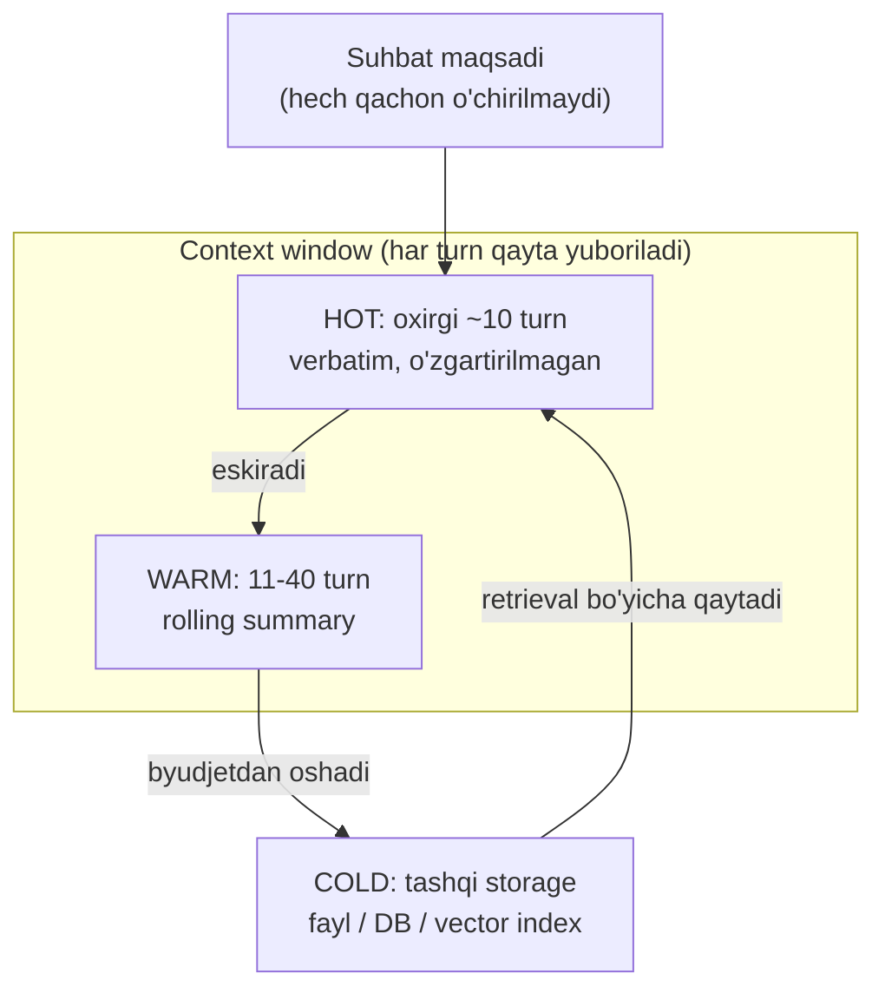

# 05. Agent memory va context engineering

Bir savolli chatbotni yozish oson. Qiyinchilik 40-chi turn'da boshlanadi: har turn'da tool_result kontekstga qo'shiladi, 200K token to'ladi, har chaqiruvda butun tarixni qayta yuborasiz (cost chiziqli o'sadi), va model o'rtadagi muhim ma'lumotni "lost in the middle" tufayli ko'rmay qoladi. Production agent'ning asosiy og'rig'i model emas — kontekst boshqaruvi. Ish e'lonlaridagi "long-running agents", "context engineering", "session memory" iboralari aynan shu haqda. Bu darsda uzun sessiyani kesh ierarxiyasi kabi boshqarishni kod bilan yozamiz.

---

## Nazariya (~30%)

### 1. LLM API stateless: model hech narsa eslamaydi

Eng muhim intuitsiya, undan qolgani kelib chiqadi. `client.messages.create(...)` — bu stateless REST endpoint. Har chaqiruvda **butun** `messages` ro'yxatini qayta yuborasiz; server oldingi so'rovni eslamaydi.

Backend analogiyasi: bu connection pool bilan turadigan session emas — har HTTP so'rov self-contained. "Session state" degan narsa server tomonida yo'q, u sizning application'ingizda yashaydi.

> "Memory" — bu modelning xususiyati emas, sizning application state'ingiz. Model'ning yagona xotirasi — siz shu so'rovga qo'shgan `messages`.

Bundan ikki oqibat chiqadi:
- **Cost.** N-chi turn'da siz 1..N turn'larni qayta yuborasiz. 60 turn'lik sessiya oxirida har chaqiruv 100K+ input token bo'lishi mumkin. Tokenlar takror-takror pul.
- **Sifat.** Kontekst uzayganda model o'rtadagi ma'lumotni yomon eslaydi (lost in the middle). Ko'proq kontekst != yaxshiroq kontekst.

Demak vazifa: **kontekstga faqat kerakli qismni qo'yish**, qolganini tashqarida saqlash.

### 2. Huyen 3 mexanizmi: xotira qayerda yashaydi

Chip Huyen agent xotirasini uch qatlamga ajratadi. Backend'da bu tanish taqsimot:

| Mexanizm | Nima | Backend analogiyasi | Qachon o'zgaradi |
|---|---|---|---|
| **Internal knowledge** | Model weight'lariga muzlatilgan bilim | Compiled-in konstantalar | Faqat model/finetune yangilansa |
| **Short-term memory** | Joriy kontekst window (`messages`) | Request-scoped state | Har turn'da |
| **Long-term memory** | Tashqi manba, retrieval bilan olinadi | Database / cache | Xohlagancha, modelni qaytadan train qilmasdan |

Joylash qoidasi **chastota bo'yicha**: hamma task'ga kerak bo'lsa — internal (finetune qimmat, lekin har query'da bepul keladi); kamdan-kam kerak bo'lsa — long-term (retrieval bilan chaqiriladi); faqat joriy task uchun — short-term.

Long-term memory'ning katta afzalligi: modelni yangilamasdan bilimni **o'chirish** mumkin. Eskirgan faktni fayldan o'chirdingiz — tamom. Weight'dan bilimni o'chirib bo'lmaydi.

### 3. Management strategiyalari va FIFO tuzog'i

Short-term memory sig'imi cheklangan, demak eskilarni chiqarib turish kerak. Uch strategiya:

**FIFO** — oxirgi N message/token'ni saqla, qolganini tashla (LangChain'ning eng oddiy varianti). Sodda, lekin bitta o'lik tuzog'i bor:

> Suhbat **maqsadi** ko'pincha eng boshda aytiladi ("men Postgres migratsiyasini nol downtime bilan qilmoqchiman"). FIFO uni birinchi bo'lib o'chiradi. 30 turn'dan keyin agent nima uchun ishlayotganini unutadi.

**Summary** — eski turn'larni tashlamasdan, arzon model bilan **xulosa** qilib almashtir. Redundancy yo'qoladi, muhim qaror qoladi. Amaliyot qismida shuni yozamiz.

**Reflection usuli** (Liu 2023) — har action'dan keyin yangi ma'lumotni long-term'ga `insert / merge / replace` qilishni hal qilish. Qarama-qarshi fakt kelsa (eski qiymat != yangi qiymat), eskisini almashtirasiz. Bu memory'ni haqiqat manbai sifatida toza tutadi.

### 4. 2026 pattern: ierarxik memory (hot / warm / cold)

2026'da dominant pattern — xotirani uch qatlamli kesh sifatida qurish. Bu backend'chi uchun tanish: CPU L1/L2/L3 va RAM ierarxiyasi bilan bir mantiq.



- **HOT** — oxirgi ~10 turn, aynan o'z holicha kontekstda. Tez, aniq, lekin qimmat.
- **WARM** — 11-40 turn, siqilgan (rolling summary). Cost tushadi, detal biroz yo'qoladi.
- **COLD** — undan eskisi tashqi storage'da; kerak bo'lsagina retrieval bilan qaytariladi (bu — 4-bo'limdagi RAG, endi agent xotirasi sifatida).

Umumiy tamoyil bitta jumla: **"store full state outside the model"** — to'liq holatni model tashqarisida (fayl/DB) saqla, har turn'ga faqat kerakli qismini kompilyatsiya qil. Kontekst window = ekran, storage = disk.

### 5. Prompt caching: agent'da nega tartib muhim

Anthropic prompt caching kontekst prefiksini keshlaydi (bir xil boshlanish qayta yuborilsa arzonlashadi). Agent'da bundan foydalanish uchun kontekstni **barqaror qismdan boshlab, o'zgaruvchan qismni oxirga** qo'yish kerak:

- system prompt **muzlatilgan** bo'lsin (har turn'da o'zgarmasin);
- tool ro'yxati **deterministik** tartibda bo'lsin;
- volatile kontent (yangi tool_result'lar) oxirida.

Ogohlantirish: tool qo'shish yoki olib tashlash butun cache prefiksini invalidatsiya qiladi. Shuning uchun agent loop davomida tool ro'yxatini o'zgartirmang.

---

## Amaliyot (~70%)

Uch bosqichli PRIMM: tayyor kodni o'qib chiqasiz (Predict/Run), keyin o'zgartirasiz (Modify), oxirida noldan yozasiz (Make).

### Predict / Run

#### 1-misol. Memory tool: fayl-backend + path guard

Anthropic'ning `memory_20250818` tool'i **client-side**: model `view / create / str_replace / insert / delete / rename` komandalarini chiqaradi, `/memories` katalogidagi amallarni esa **siz** bajarasiz. Bu 1-bo'limda yozgan tool use loop'ining aynan o'zi — faqat tool'ni Anthropic nomlaydi, ijrosini biz beramiz.

Eng muhim joyi — **path guard**. Model bergan `path` ishonchsiz input (1-bo'lim 08-darsdagi injection xuddi shu yerda ish beradi): agar model `../../etc/passwd` yuborsa, uni katalog ichida ushlab qolish kerak.

```python
# file: memory_store.py
import os


class MemoryStore:
    """memory_20250818 komandalarini lokal katalogda bajaradi."""

    def __init__(self, root):
        # --- 1-qadam: xotira ildizini kanonik absolyut yo'lga aylantiramiz ---
        self.root = os.path.realpath(root)
        os.makedirs(self.root, exist_ok=True)

    def _safe_path(self, model_path):
        # --- path guard: model "/memories/..." yuboradi, biz root'ga bog'laymiz ---
        rel = model_path.lstrip("/")
        if rel.startswith("memories"):
            rel = rel[len("memories"):].lstrip("/")
        candidate = os.path.realpath(os.path.join(self.root, rel))
        # kanonik yo'l root ichida qolishini TEKSHIRAMIZ (.. va symlink rad etiladi)
        if candidate != self.root and not candidate.startswith(self.root + os.sep):
            raise ValueError("path katalogdan tashqariga chiqdi: " + model_path)
        return candidate

    def execute(self, cmd):
        # --- komandani route qilamiz (backend'dagi handler dispatch kabi) ---
        name = cmd.get("command")
        if name == "view":
            return self._view(cmd["path"])
        if name == "create":
            return self._create(cmd["path"], cmd.get("file_text", ""))
        if name == "str_replace":
            return self._str_replace(cmd["path"], cmd["old_str"], cmd["new_str"])
        if name == "insert":
            return self._insert(cmd["path"], cmd["insert_line"], cmd["insert_text"])
        if name == "delete":
            return self._delete(cmd["path"])
        if name == "rename":
            return self._rename(cmd["old_path"], cmd["new_path"])
        raise ValueError("noma'lum command: " + str(name))

    def _view(self, path):
        p = self._safe_path(path)
        if os.path.isdir(p):
            items = sorted(os.listdir(p))
            return "Katalog /memories:\n" + "\n".join(items) if items else "Katalog bo'sh."
        with open(p, "r", encoding="utf-8") as f:
            return f.read()

    def _create(self, path, text):
        p = self._safe_path(path)
        os.makedirs(os.path.dirname(p), exist_ok=True)
        with open(p, "w", encoding="utf-8") as f:
            f.write(text)
        return "Yaratildi: " + path

    def _str_replace(self, path, old, new):
        p = self._safe_path(path)
        with open(p, "r", encoding="utf-8") as f:
            data = f.read()
        if old not in data:
            raise ValueError("old_str topilmadi")
        with open(p, "w", encoding="utf-8") as f:
            f.write(data.replace(old, new, 1))
        return "Almashtirildi: " + path

    def _insert(self, path, line, text):
        p = self._safe_path(path)
        with open(p, "r", encoding="utf-8") as f:
            lines = f.readlines()
        lines.insert(line, text if text.endswith("\n") else text + "\n")
        with open(p, "w", encoding="utf-8") as f:
            f.writelines(lines)
        return "Qo'shildi: " + path

    def _delete(self, path):
        os.remove(self._safe_path(path))
        return "O'chirildi: " + path

    def _rename(self, old_path, new_path):
        os.rename(self._safe_path(old_path), self._safe_path(new_path))
        return "Nomi o'zgardi: " + old_path + " -> " + new_path
```

Himoya qatlamini yana bir bor ta'kidlaymiz: `_safe_path` ichida `os.path.realpath` symlink'ni ochadi va `..` ni normalizatsiya qiladi, so'ng natija root prefiksi bilan boshlanishini tekshiradi — bu path guard. Yuqoridagi blok memory tool'ning to'liq backend'i. Endi uni agent loop'ga ulaymiz. Diqqat: memory tool `context-management-2025-06-27` beta header'ini talab qiladi, shuning uchun `client.beta.messages.create` ishlatamiz.

```python
# file: memory_agent.py
from dotenv import load_dotenv
from anthropic import Anthropic
from memory_store import MemoryStore

load_dotenv()
client = Anthropic()               # ANTHROPIC_API_KEY .env'dan o'qiladi
store = MemoryStore("./agent_memory")

SYSTEM = (
    "Sen uzoq muddatli loyihada ishlaydigan agentsan. "
    "Progress fayllaringni /memories katalogida yuritasan. "
    "Har topshiriq boshida avval /memories ni view qilib eski holatni o'qi."
)


def run_turn(user_text, messages):
    # --- 1-qadam: user xabarini tarixga qo'shamiz ---
    messages.append({"role": "user", "content": user_text})
    while True:
        # --- 2-qadam: model chaqiruvi (tool ro'yxati DETERMINISTIK) ---
        resp = client.beta.messages.create(
            model="claude-opus-4-8",
            max_tokens=4096,
            betas=["context-management-2025-06-27"],
            system=SYSTEM,
            tools=[{"type": "memory_20250818", "name": "memory"}],
            messages=messages,
        )
        messages.append({"role": "assistant", "content": resp.content})
        if resp.stop_reason != "tool_use":
            return resp, messages

        # --- 3-qadam: memory komandalarini biz bajaramiz (client-side) ---
        results = []
        for block in resp.content:
            if block.type == "tool_use" and block.name == "memory":
                try:
                    out = store.execute(block.input)
                    results.append({"type": "tool_result",
                                    "tool_use_id": block.id, "content": out})
                except ValueError as e:
                    # path guard yoki topilmagan fayl -> model TUZATA oladigan xato
                    results.append({"type": "tool_result", "tool_use_id": block.id,
                                    "content": "XATO: " + str(e), "is_error": True})
        # --- 4-qadam: BARCHA tool_result BITTA user message'da (parallel qoidasi) ---
        messages.append({"role": "user", "content": results})


if __name__ == "__main__":
    history = []
    resp, history = run_turn(
        "Loyiha: askops CLI. Bugun auth modulini ko'rib chiqdim, "
        "token refresh'da bug bor. Buni progress fayliga yozib qo'y.",
        history,
    )
    print(resp.content[-1].text)

# Output:
# (model avval memory{command:"view", path:"/memories"} chaqiradi -> "Katalog bo'sh.")
# (keyin memory{command:"create", path:"/memories/progress.md",
#   file_text:"# askops progress\n\n## Ochiq buglar\n- auth: token refresh xato\n"})
# Yozib qo'ydim. /memories/progress.md yaratildi, auth token refresh bug'i
# "Ochiq buglar" ro'yxatiga kiritildi. Keyingi sessiyada shu fayldan davom etaman.
```

E'tibor bering: agar dasturingizni qayta ishga tushirsangiz, `./agent_memory/progress.md` fayl diskda qoladi — bu **sessiyalar aro** (cross-session) xotira. `messages` ro'yxati nolga tushadi, lekin fayl turadi.

#### 2-misol. Qo'lda summary: warm qatlamni haiku bilan siqish

Memory tool sessiyalar aro yordam beradi, lekin bitta uzun sessiya ichidagi context to'lishini yechmaydi. Buning uchun **rolling summary**: N turn'dan oshsa, eski turn'larni arzon model (haiku) bilan xulosa qilib almashtiramiz. Bu — hot/warm ierarxiyasining qo'lda implementatsiyasi.

Kalit nuqta: **suhbat maqsadi (birinchi message) va oxirgi K turn hech qachon siqilmaydi**. Bu FIFO tuzog'idan himoya.

```python
# file: rolling_summary.py
from anthropic import Anthropic

client = Anthropic()


def render_transcript(msgs):
    # --- turn'larni oddiy matnga yig'amiz (faqat text bloklar) ---
    lines = []
    for m in msgs:
        content = m["content"]
        if isinstance(content, str):
            lines.append(m["role"] + ": " + content)
        else:
            for b in content:
                text = getattr(b, "text", None) if not isinstance(b, dict) else b.get("text")
                if text:
                    lines.append(m["role"] + ": " + text)
    return "\n".join(lines)


def compact_history(messages, keep_last=4):
    # --- 1-qadam: hot qatlam kichik bo'lsa, hech narsa qilmaymiz ---
    if len(messages) <= keep_last + 2:
        return messages

    goal_msg = messages[0]                  # suhbat maqsadi -> daxlsiz
    warm = messages[1:-keep_last]           # siqiladigan o'rta qatlam
    hot = messages[-keep_last:]             # oxirgi turn'lar -> verbatim

    # --- 2-qadam: warm qatlamni arzon model bilan xulosa qilamiz ---
    resp = client.messages.create(
        model="claude-haiku-4-5",
        max_tokens=1024,
        system="Sen suhbat log'ini siquvchi yordamchisan. "
               "Faqat qarorlar, faktlar va ochiq masalalarni saqla. Bandlar bilan yoz.",
        messages=[{"role": "user",
                   "content": "Quyidagi suhbatni 8 banddan oshirmay xulosa qil:\n\n"
                              + render_transcript(warm)}],
    )
    summary = resp.content[0].text

    # --- 3-qadam: warm qatlamni bitta summary message bilan almashtiramiz ---
    summary_msg = {"role": "user",
                   "content": "[Oldingi suhbat xulosasi]\n" + summary}
    return [goal_msg, summary_msg] + hot


if __name__ == "__main__":
    fake = [{"role": "user", "content": "Maqsad: askops CLI'ni yozish"}]
    for i in range(1, 13):
        fake.append({"role": "assistant", "content": "turn " + str(i) + " javob"})
        fake.append({"role": "user", "content": "turn " + str(i) + " savol"})
    print("Oldin:", len(fake), "message")
    compacted = compact_history(fake, keep_last=4)
    print("Keyin:", len(compacted), "message")
    print(compacted[1]["content"][:60], "...")

# Output:
# Oldin: 25 message
# Keyin: 6 message
# [Oldingi suhbat xulosasi]
# - askops CLI arxitekturasi kelishildi: cobra + viper ...
```

25 message 6 message'ga tushdi: `[maqsad] + [summary] + oxirgi 4 turn`. Input token keskin kamaydi, lekin agent na maqsadini, na yaqin kontekstini yo'qotdi.

#### 3-misol. Server-side vositalar: context editing va compaction

Yuqoridagi summary'ni qo'lda yozdik. Anthropic'da buning ikki server-side varianti bor. Ularni jadvalda solishtiramiz:

| Mexanizm | Nima qiladi | Qayerda | Beta header |
|---|---|---|---|
| **Context editing** (`clear_tool_uses_20250919`) | Eski tool_result bloklarni **O'CHIRADI** (xulosa emas) | Server-side | `context-management-2025-06-27` |
| **Compaction** (`compact_20260112`) | Eski kontekstni server-side **XULOSA** qiladi | Server-side | `compact-2026-01-12` |
| **Qo'lda summary** (2-misol) | Warm turn'larni haiku bilan siqadi | Client-side | yo'q |

Context editing — eski tool output endi kerak bo'lmaganda (masalan katta `read_file` natijasi ishlatilib bo'lgach) uni butunlay o'chiradi:

```python
# file: context_editing_demo.py  (jonli API'siz demo — API shaklini ko'rsatadi)
resp = client.beta.messages.create(
    model="claude-opus-4-8",
    max_tokens=4096,
    betas=["context-management-2025-06-27"],
    context_management={
        "edits": [{"type": "clear_tool_uses_20250919"}]
    },
    tools=TOOLS,
    messages=messages,
)
# Output:
# Eski tool_use / tool_result bloklar server tomonda tozalanadi;
# resp.usage.input_tokens sezilarli kamayadi (o'chirilgan bloklar hisobga kirmaydi).
```

Compaction — suhbat context window'ga yaqinlashganda eski qismni server o'zi xulosa qiladi. Bu yerda **bitta kritik qoida** bor:

> Compaction javobdagi `compaction` blokni keyingi so'rovda **qaytarish SHART**. Amalda bu shuni anglatadi: `response.content` ni har doim to'liq holicha `messages`ga append qiling, blok turlarini filtrlamang. Aks holda server siqilgan holatni tiklay olmaydi.

```python
# file: compaction_demo.py  (jonli API'siz demo)
resp = client.beta.messages.create(
    model="claude-opus-4-8",
    max_tokens=4096,
    betas=["compact-2026-01-12"],
    context_management={
        "edits": [{"type": "compact_20260112"}]
    },
    tools=TOOLS,
    messages=messages,
)
# TO'G'RI: to'liq content'ni append qilamiz -> compaction blok ham kiradi
messages.append({"role": "assistant", "content": resp.content})

# XATO bo'lardi: faqat text bloklarni olib qolish -> keyingi turn 400 yoki
# siqilgan kontekst yo'qoladi:
# messages.append({"role": "assistant",
#                  "content": [b for b in resp.content if b.type == "text"]})

# Output:
# resp.content ichida compaction blok keladi; to'liq append qilingach
# keyingi so'rovda resp.usage.input_tokens siqilgan holatni aks ettiradi.
```

Qaysi birini tanlash: to'liq nazorat va debug muhim bo'lsa (2-misoldagidek) qo'lda summary; oddiy va API'ga tayanmoqchi bo'lsangiz server-side variant. Ko'p agent'da ikkalasi birga: sessiya ichida compaction, sessiyalar aro memory tool.

### Investigate / Modify

Quyidagi o'zgartirishlarni yuqoridagi kodda o'zingiz sinab ko'ring.

**Modify 1 — path guard'ni sinash.** `memory_agent.py`ga sun'iy topshiriq qo'shing: model'dan `/memories/../secret.txt` ga yozishni so'rating (yoki `store.execute({"command": "create", "path": "/memories/../secret.txt", "file_text": "x"})` ni to'g'ridan-to'g'ri chaqiring). `_safe_path` `ValueError` tashlashi va loop'da `is_error: True` bo'lib qaytishi kerak. Model xatoni ko'rib boshqa yo'l tanlashini kuzating.

<details>
<summary>Kutilgan natija</summary>

`store.execute` `ValueError("path katalogdan tashqariga chiqdi: /memories/../secret.txt")` tashlaydi, chunki `realpath` `..` ni normalizatsiya qiladi va natija `self.root` prefiksidan chiqib ketadi. Loop bu xatoni `tool_result` sifatida `is_error: True` bilan qaytaradi. `secret.txt` fayl **yaratilmaydi**. Bu — 08-darsda ko'radigan defense-in-depth qatlamining birinchisi.
</details>

**Modify 2 — `keep_last`ni o'zgartiring.** `compact_history`da `keep_last=4` ni `keep_last=8` qiling. Nima o'zgaradi: hot qatlam kattalashadi (ko'proq verbatim turn), summary kechroq ishga tushadi, cost yuqoriroq lekin yaqin kontekst aniqroq. `keep_last=1` qilib ko'ring — agent oxirgi javobidan boshqa hech narsani verbatim ko'rmaydi, ba'zi ergashuvchi savollar ("uni ham qo'sh") ma'nosini yo'qotadi.

**Modify 3 — memory'ni sessiya boshida avtomatik o'qish.** Hozir model o'zi `view` qilishga qaror qiladi. Buni majburiy qiling: `run_turn` ichida, birinchi user message'dan oldin `store.execute({"command": "view", "path": "/memories"})` natijasini system prompt'ga yoki birinchi user message'ga qo'shing. Bu "har boot'da state'ni yuklab olish" — agent hech qachon bo'sh kontekstdan boshlamaydi.

### Make: scratchpad notes pattern

Endi mustaqil mini-challenge. Ierarxik memory'ning eng arzon va eng samarali varianti — **scratchpad notes**: agent muhim topilmalarni bitta `notes.md` fayliga yozadi va yangi sessiyada uni o'qiydi. Tadqiqotlar (Anthropic, Sourcegraph) buni agent sifatini sezilarli oshiruvchi eng oddiy pattern deb ko'rsatadi.

Topshiriq: `memory_20250818`siz, o'zingizning ikki tool'ingiz bilan implementatsiya qiling:
- `read_notes()` — `notes.md`ni o'qib qaytaradi (yo'q bo'lsa bo'sh matn);
- `append_note(text)` — matnni `notes.md` oxiriga qo'shadi (append-only, immutable — eski yozuv o'chirilmaydi).

Agent loop'ni shunday quring: har sessiya boshida `read_notes` natijasi kontekstga qo'yiladi, sessiya davomida muhim topilma bo'lganda `append_note` chaqiriladi. "Bitta saboq = bitta qator" qoidasiga amal qiling.

<details>
<summary>Yechim</summary>

```python
# file: scratchpad_agent.py
import os
from dotenv import load_dotenv
from anthropic import Anthropic

load_dotenv()
client = Anthropic()
NOTES = "notes.md"

TOOLS = [
    {
        "name": "read_notes",
        "description": "Oldingi sessiyalardan yig'ilgan notes.md faylini o'qiydi. "
                       "Yangi topshiriq boshida MAJBURIY chaqir.",
        "input_schema": {"type": "object", "properties": {}},
    },
    {
        "name": "append_note",
        "description": "Muhim, kelajakda kerak bo'ladigan bitta topilmani notes.md "
                       "oxiriga qo'shadi. Har chaqiruvda BITTA qisqa qator yoz.",
        "input_schema": {
            "type": "object",
            "properties": {"text": {"type": "string"}},
            "required": ["text"],
        },
    },
]


def run_tool(name, args):
    # --- ikki tool: read va write (append-only) ---
    if name == "read_notes":
        if not os.path.exists(NOTES):
            return "notes.md hali bo'sh."
        with open(NOTES, "r", encoding="utf-8") as f:
            return f.read()
    if name == "append_note":
        with open(NOTES, "a", encoding="utf-8") as f:      # append -> immutable
            f.write("- " + args["text"].strip() + "\n")
        return "Yozildi."
    raise ValueError("noma'lum tool: " + name)


def run(user_text):
    messages = [{"role": "user", "content": user_text}]
    while True:
        resp = client.messages.create(
            model="claude-opus-4-8", max_tokens=2048,
            system="Sen davomiy agentsan. Sessiya boshida read_notes chaqir, "
                   "muhim topilmani append_note bilan saqla.",
            tools=TOOLS, messages=messages,
        )
        messages.append({"role": "assistant", "content": resp.content})
        if resp.stop_reason != "tool_use":
            return resp.content[-1].text
        results = []
        for b in resp.content:
            if b.type == "tool_use":
                out = run_tool(b.name, b.input)
                results.append({"type": "tool_result",
                                "tool_use_id": b.id, "content": out})
        messages.append({"role": "user", "content": results})


if __name__ == "__main__":
    print(run("askops repo'da retry logikasi qayerda? Topsang notes'ga yoz."))

# Output:
# (read_notes -> "notes.md hali bo'sh.")
# (append_note{text:"retry logikasi internal/http/retry.go da, backoff 3 urinish"})
# retry logikasi internal/http/retry.go faylida, exponential backoff, 3 urinish.
# Topilmani notes.md ga saqlab qo'ydim -> keyingi sessiyada qayta izlamayman.
```

Nega append-only: notes'ni `str_replace` bilan tahrirlash model'ni eski (ehtimol noto'g'ri tuzatilgan) holatga olib borishi mumkin. Append-only log — immutable audit izi, xuddi 08-darsdagi audit log kabi. Eskirgan yozuvni o'chirish kerak bo'lsa, buni alohida "curation" qadamida qiling, oddiy oqimda emas.
</details>

---

## Retrieval practice

Javoblarni yozmadik — o'zingiz eslab, keyin darsdan tekshiring.

1. `client.messages.create` stateless bo'lsa, agent ikki turn orasida "nimani gaplashganini" qanday eslaydi? Server tomonida qanaqadir session state bormi?
2. FIFO strategiyasining "o'lik tuzog'i" nima edi va uni oldini olish uchun qaysi ikki qism hech qachon siqilmasligi kerak?
3. Ierarxik memory'da HOT, WARM va COLD qatlamlar orasidagi asosiy trade-off nima (cost va aniqlik bo'yicha)?
4. Memory tool `memory_20250818` "client-side" deganda aniq nimani anglatadi — kim `view/create` amallarini bajaradi va path xavfsizligi kimning zimmasida?
5. Compaction ishlatganda `response.content`ni nega to'liq holicha `messages`ga qaytarish shart? Faqat text bloklarni qoldirsangiz nima buziladi?

---

## Manbalar

- **Chip Huyen, "AI Engineering" (O'Reilly, 2025)** — Ch 6, Memory bo'limi (p.323-328): 3 mexanizm (internal / short-term / long-term), FIFO / summary / reflection strategiyalari, joylash qoidasi. Konspekt: `x. Manbalar/konspekt-huyen.md`, "Ch 6 — Agents + Memory" bo'limi.
- **research-5-agents.md** (bu bo'limning haqiqat manbai) — §1.7 Memory tool (`memory_20250818`, path xavfsizligi), §1.8 context editing va compaction beta'lari, §8 ierarxik memory (hot/warm/cold), "store full state outside the model".
- **Anthropic docs** — Memory tool, Context editing (`clear_tool_uses`) va Compaction: docs.anthropic.com/en/docs/agents-and-tools/tool-use.
- **ACE — Agentic Context Engineering** (ICLR 2026) — kontekstni strukturali bulletlar sifatida saqlab Generator/Reflector/Curator bilan inkremental yangilash; "structured note-taking" oqimining akademik shakli.
- Keyingi dars: **06. MCP — Model Context Protocol** — tool'lar va resource'larni standart protokol orqali ulash; memory backend'ni MCP server sifatida ochish g'oyasiga ko'prik.
