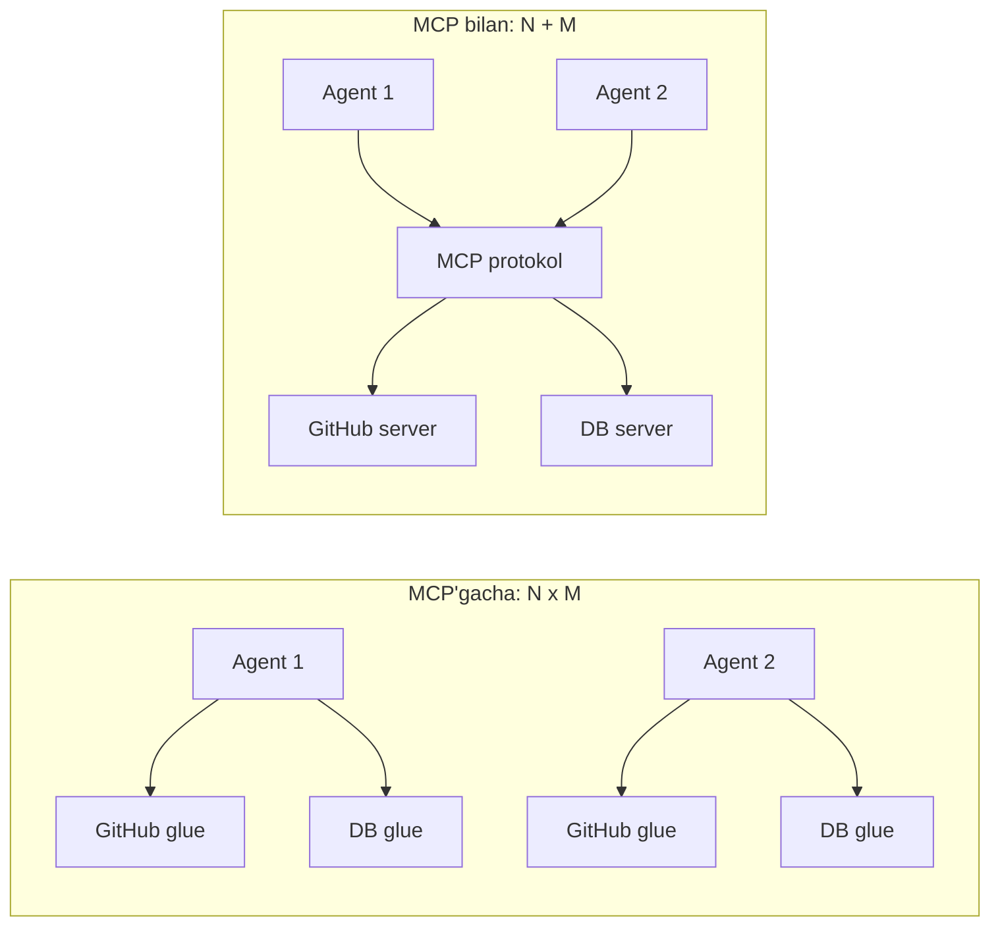
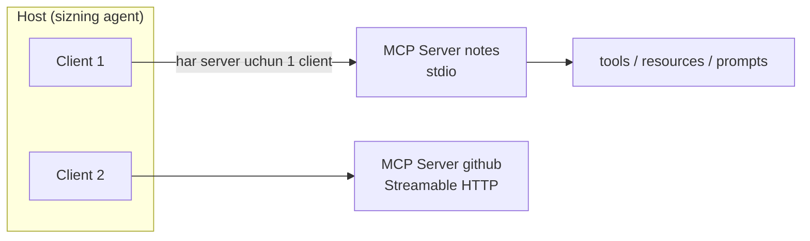
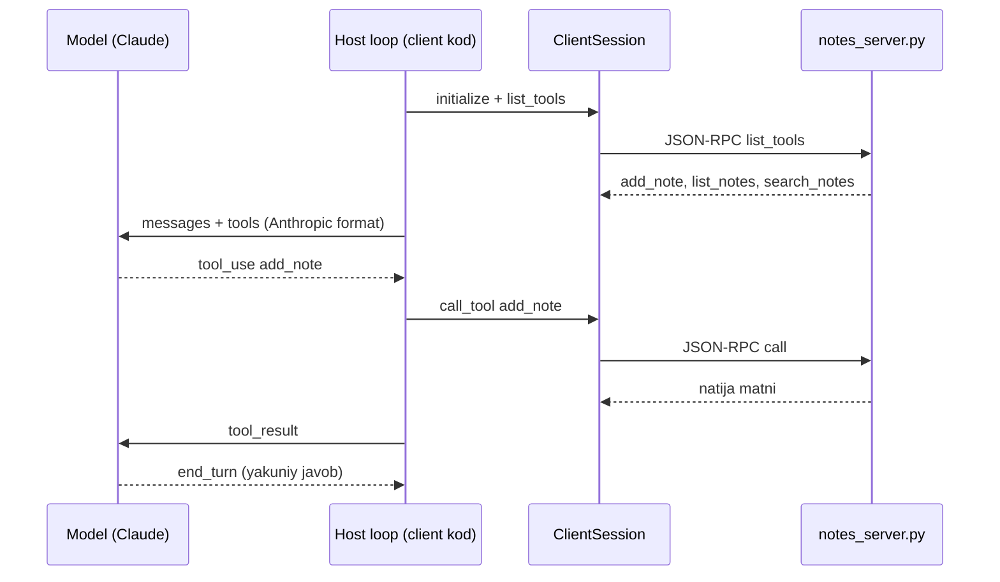

# 06. MCP — Model Context Protocol

Oldingi darslarda tool'ni har safar qo'lda yozdik: `input_schema`, ijro funksiyasi, loop'ga ulash. Endi tasavvur qiling — sizda 5 ta agent va 8 ta integratsiya (GitHub, Postgres, Slack, fayl tizimi...). Har agent har integratsiyani o'zicha ulaydi: 5 x 8 = 40 ta bir xil bog'lovchi kod. MCP aynan shu N x M portlashini yechadi: integratsiyani **bir marta** protokol sifatida yozasiz, har agent uni **bir marta** ulaydi. 2026 ish e'lonlarida "MCP server", "tool integration", "agent connectivity" iboralari shu haqda. Bu darsda o'z MCP server'ingizni yozib, uni Claude'ga ikki xil yo'l bilan ulaymiz.

---

## Nazariya (~30%)

### 1. N x M muammosi va LSP yechimi

Analogiya backend dunyosidan, aniq va texnik: **LSP (Language Server Protocol)**.

LSP'gacha har code editor har programming til uchun alohida integratsiya yozardi: VS Code x Go, VS Code x Rust, Vim x Go, Vim x Rust... M ta editor x N ta til = **M x N** ta integratsiya. Har editor jamoasi har tilni qaytadan qo'llab-quvvatlashi kerak edi.

LSP protokolni standartlashtirdi: har editor **bitta** LSP client yozadi, har til **bitta** language server yozadi. Endi xarajat M x N emas, **M + N**. Yangi til chiqsa — bitta server yozasiz, hamma editor darrov uni oladi.

MCP xuddi shuni AI ilovalar uchun qiladi:



> MCP = tool va data-manba integratsiyasi uchun standart protokol. LSP editor x til muammosini yechganidek, MCP AI-ilova x tool integratsiyasini yechadi.

("USB-C for AI" degan marketing analogiyasini biz ishlatmaymiz — LSP texnik jihatdan aniqroq va sizga tanish.)

### 2. Arxitektura: host / client / server

MCP uch komponentli. Backend'da bu client-server modelining tanish ko'rinishi:

| Komponent | Nima | Backend analogiyasi |
|---|---|---|
| **Host** | AI ilova (sizning agent, Claude Desktop, IDE) | Application process |
| **Client** | Host ichidagi bog'lovchi, har server uchun bittadan | Connection / driver instance |
| **Server** | Tool/resource/prompt'larni ochib beruvchi jarayon | Microservice / sidecar |

Muhim nuqta: **bitta server uchun bitta client**. Host bir nechta server bilan ishlasa, har biriga alohida client ochadi — xuddi har DB uchun alohida connection pool kabi.



### 3. Primitivlar: tools / resources / prompts

Server uch xil narsa ochishi mumkin. Ularni HTTP metodlari bilan solishtirish oson:

| Primitiv | Kim boshlaydi | HTTP analogiyasi | Misol |
|---|---|---|---|
| **tools** | Model chaqiradi | `POST` (action) | `add_note`, `run_query` |
| **resources** | Ilova o'qiydi | `GET` (read-only data) | `notes://all`, fayl mazmuni |
| **prompts** | User tanlaydi | Saqlangan template / slash-komanda | "kod review qil" shabloni |

Client tomonida ham ikki primitiv bor (qisqacha):
- **sampling** — server host'dan LLM chaqiruvini so'raydi (server o'zi model'ga murojaat qilmaydi, host qiladi — kalit host'da qoladi).
- **elicitation** — server user'dan qo'shimcha ma'lumot so'raydi (masalan tasdiqlash).

Bu darsda asosan **tools** bilan ishlaymiz (Make qismida resource qo'shamiz).

### 4. Transportlar: stdio va Streamable HTTP

Client server bilan qanday gaplashadi — ikki asosiy transport:

| Transport | Qayerda | Backend analogiyasi |
|---|---|---|
| **stdio** | Lokal (server subprocess) | Unix pipe: stdin/stdout orqali JSON-RPC |
| **Streamable HTTP** | Remote (tarmoq orqali) | HTTP endpoint |

Ikkalasi ostida **JSON-RPC** yotadi. Eski **HTTP+SSE** transporti **deprecated** — provayderlarda o'chirilyapti, yangi kodda ishlatmang.

### 5. 2026 holati

MCP tez rivojlanmoqda, sana bilan aniq bo'ling:

- **Joriy spec: 2025-11-25.** Keyingisi: **2026-07-28 RC** (2026-05-21 lock qilingan).
- 2026-07-28 RC'ning asosiy o'zgarishi — **stateless arxitektura**: handshake/session ID olib tashlanadi, har so'rov self-contained. Backend'da bu tanish: sticky session'siz, load balancer ortida turadigan stateless REST — istalgan instansiya istalgan so'rovni ko'taradi.
- Yangi headerlar: `Mcp-Method` / `Mcp-Name` (gateway routing uchun), cache metadata (`ttlMs`, `cacheScope`), W3C Trace Context `_meta`da.

### 6. Ekotizim va xavflar (qisqa, chuqur 08-darsda)

MCP ekotizimi juda tez o'sdi — oyiga 97M+ yuklab olish. Lekin adoption governance'dan o'zib ketdi ("brittle phase"):

- Server'larning **82%** path traversal'ga zaif, faqat **8.5%** OAuth ishlatadi.
- **Registry poisoning** real: 11 registry'dan 9 tasi zararli paketni qabul qilgan.
- **Tool poisoning** — zararli server tool description ichiga yashirin ko'rsatma joylaydi. Diqqat: **description model kontekstiga kiradi** (1-bo'lim 05-darsdan bilamiz — description model uchun yagona hujjat). Ya'ni tool description ham injection vektori.

> Amaliy qoida: faqat **ishonchli** server'ni ulang, description'larni ko'rib chiqing, versiyani pin qiling. Bu — 08-darsdagi agent xavfsizligining bir qismi.



---

## Amaliyot (~70%)

Uch bosqichli PRIMM. `notes` server'ni yozamiz (05-darsdagi scratchpad g'oyasining protokol shaklidagi davomi), keyin uni ikki yo'l bilan Claude'ga ulaymiz.

O'rnatish: `pip install anthropic mcp python-dotenv`. Konvertor uchun qo'shimcha: `pip install "anthropic[mcp]"` (Python 3.10+).

### Predict / Run

#### 1-misol. FastMCP bilan `notes` server yozish (stdio)

Rasmiy `mcp` SDK'da server yozishning eng qisqa yo'li — `FastMCP` klassi. `@mcp.tool()` dekorator funksiyani tool'ga aylantiradi va **schema'ni type hint + docstring'dan avtomatik generatsiya qiladi** (biz 1-bo'limda `input_schema`ni qo'lda yozgan edik — bu shuning qisqartmasi).

```python
# file: notes_server.py
from mcp.server.fastmcp import FastMCP

mcp = FastMCP("notes")

_NOTES = []   # oddiy in-memory store (demo uchun; keyin faylga ko'chiramiz)


@mcp.tool()
def add_note(text: str) -> str:
    """Yangi eslatma qo'shadi.

    Args:
        text: saqlanadigan eslatma matni.
    """
    _NOTES.append(text)
    return "Qo'shildi. Jami eslatma: " + str(len(_NOTES))


@mcp.tool()
def list_notes() -> str:
    """Barcha eslatmalarni raqamlangan ro'yxat qilib qaytaradi."""
    if not _NOTES:
        return "Eslatmalar yo'q."
    return "\n".join(str(i) + ". " + n for i, n in enumerate(_NOTES, 1))


@mcp.tool()
def search_notes(query: str) -> str:
    """Eslatmalar ichidan matn bo'yicha qidiradi.

    Args:
        query: qidiruv so'zi.
    """
    hits = [n for n in _NOTES if query.lower() in n.lower()]
    return "\n".join(hits) if hits else "Hech narsa topilmadi."


if __name__ == "__main__":
    mcp.run(transport="stdio")

# Output (to'g'ridan-to'g'ri ishga tushirsangiz):
# server stdin'dan JSON-RPC so'rov kutib turadi, hech narsa chop etmaydi.
# Uni o'zi ishlatmaysiz — client subprocess sifatida ko'taradi (2-misol).
```

E'tibor bering: `add_note` — **write** action (POST), `list_notes`/`search_notes` — **read-only** (GET). Bu ajratish 08-darsda permission ladder uchun kerak bo'ladi.

#### 2-misol. Lokal stdio bilan ulash: mexanikani qo'lda ko'rish

Endi server'ni Claude'ga ulaymiz. Birinchi yo'l — **lokal stdio**: `mcp` SDK'ning `ClientSession`'i server'ni subprocess sifatida ko'taradi, biz tool'larni Anthropic formatiga **qo'lda** map qilamiz va tanish agent loop'ni aylantiramiz. Bu — mexanikani ochiq ko'rsatuvchi variant.

Kod async, chunki `ClientSession` async. Lekin ichidagi loop 1-bo'lim 05-darsdagi loop'ning aynan o'zi:

```python
# file: notes_client.py
import asyncio
from dotenv import load_dotenv
from anthropic import Anthropic
from mcp import ClientSession, StdioServerParameters
from mcp.client.stdio import stdio_client

load_dotenv()
client = Anthropic()

SERVER = StdioServerParameters(command="python", args=["notes_server.py"])


def to_anthropic(mcp_tools):
    # --- list_tools natijasini Anthropic tool formatiga QO'LDA map qilamiz ---
    out = []
    for t in mcp_tools:
        out.append({
            "name": t.name,
            "description": t.description or "",
            "input_schema": t.inputSchema,   # MCP JSON Schema -> input_schema
        })
    return out


async def main(user_text):
    # --- 1-qadam: server'ni subprocess sifatida ko'taramiz (stdio transport) ---
    async with stdio_client(SERVER) as (read, write):
        async with ClientSession(read, write) as session:
            await session.initialize()               # JSON-RPC handshake
            listed = await session.list_tools()
            tools = to_anthropic(listed.tools)
            print("Server tool'lari:", [t["name"] for t in tools])

            # --- 2-qadam: tanish agent loop ---
            messages = [{"role": "user", "content": user_text}]
            while True:
                resp = client.messages.create(
                    model="claude-opus-4-8", max_tokens=2048,
                    tools=tools, messages=messages,
                )
                messages.append({"role": "assistant", "content": resp.content})
                if resp.stop_reason != "tool_use":
                    print(resp.content[-1].text)
                    return

                # --- 3-qadam: tool chaqiruvini MCP server'ga uzatamiz ---
                results = []
                for b in resp.content:
                    if b.type == "tool_use":
                        r = await session.call_tool(b.name, b.input)
                        text = r.content[0].text if r.content else ""
                        results.append({"type": "tool_result",
                                        "tool_use_id": b.id, "content": text})
                messages.append({"role": "user", "content": results})


if __name__ == "__main__":
    asyncio.run(main(
        "Eslatma qo'sh: relizni juma kuni chiqaramiz. Keyin ro'yxatni ko'rsat."
    ))

# Output:
# Server tool'lari: ['add_note', 'list_notes', 'search_notes']
# (model add_note{text:"relizni juma kuni chiqaramiz"} -> "Qo'shildi. Jami eslatma: 1")
# (model list_notes{} -> "1. relizni juma kuni chiqaramiz")
# Eslatma saqlandi. Joriy ro'yxat:
# 1. relizni juma kuni chiqaramiz
```

Bu misolning qiymati: `to_anthropic` funksiyasi MCP protokoli va Anthropic API o'rtasidagi **ko'prik**ni ochiq ko'rsatadi. `inputSchema` (MCP) to'g'ridan-to'g'ri `input_schema`ga (Anthropic) tushadi — bir xil JSON Schema. Sehr yo'q.

#### 3-misol. Konvertor + tool_runner: boilerplate'ni SDK oladi

Mexanikani ko'rgach, kundalik ishda `anthropic[mcp]` konvertori loop'ni qisqartiradi. `async_mcp_tool` MCP tool'ni to'g'ridan-to'g'ri `tool_runner`ga beriladigan tool'ga aylantiradi (04-darsdagi Tool Runner bilan bir mantiq):

```python
# file: notes_client_runner.py  (anthropic[mcp] konvertori bilan)
import asyncio
from anthropic import AsyncAnthropic
from anthropic.lib.tools.mcp import async_mcp_tool
from mcp import ClientSession, StdioServerParameters
from mcp.client.stdio import stdio_client

client = AsyncAnthropic()
SERVER = StdioServerParameters(command="python", args=["notes_server.py"])


async def main():
    async with stdio_client(SERVER) as (read, write):
        async with ClientSession(read, write) as session:
            await session.initialize()
            listed = await session.list_tools()
            # --- MCP tool -> tool_runner uchun tayyor tool (qo'lda mapping YO'Q) ---
            tools = [async_mcp_tool(session, t) for t in listed.tools]
            runner = client.beta.messages.tool_runner(
                model="claude-opus-4-8", max_tokens=2048,
                tools=tools,
                messages=[{"role": "user", "content": "Eslatmalarni ko'rsat"}],
            )
            async for message in runner:
                print(message.stop_reason)


if __name__ == "__main__":
    asyncio.run(main())

# Output:
# tool_use      (runner list_notes'ni o'zi chaqiradi va natijani qaytaradi)
# end_turn
```

Pozitsiya: mexanikani bilganingizdan keyin konvertor foydali — loop'ni har safar qo'lda yozmaysiz. Lekin 09-loyihada biz atayin qo'lda mapping'ni ham ko'rsatamiz, chunki debug paytida nima sodir bo'layotganini to'liq ko'rish kerak.

#### 4-misol. Remote server: MCP connector (server-side)

Yuqoridagi ikki misol **lokal** (subprocess). Remote server uchun Anthropic'ning **MCP connector**'i bor: siz loop yozmaysiz, Anthropic serveri o'zi remote MCP server'ga Streamable HTTP orqali ulanadi. Beta header: `mcp-client-2025-11-20`.

**Muhim qoida:** `mcp_servers` va `tools` (mcp_toolset) **birga** kelishi shart — biri boshqasisiz validation xatosi:

```python
# file: mcp_connector_demo.py  (remote, jonli API'siz demo)
resp = client.beta.messages.create(
    model="claude-opus-4-8", max_tokens=1024,
    betas=["mcp-client-2025-11-20"],
    mcp_servers=[{
        "type": "url",
        "url": "https://mcp.example.com/mcp",
        "name": "notes-remote",
        # "authorization_token": "..."   # ixtiyoriy, remote auth uchun
    }],
    tools=[{"type": "mcp_toolset", "mcp_server_name": "notes-remote"}],
    messages=[{"role": "user", "content": "Eslatmalarni ko'rsat"}],
)
# Output:
# resp.content ichida mcp_tool_use / mcp_tool_result bloklar keladi;
# Anthropic serveri remote server'ni CHAQIRIB natijani model'ga o'zi uzatadi.
# Siz call_tool yozmaysiz -- loop server tomonda.
```

Ikki yo'lni jamlaymiz:

| Yo'l | Server qayerda | Loop kim yozadi | Transport |
|---|---|---|---|
| stdio client (2-3 misol) | Lokal subprocess | Siz (yoki tool_runner) | stdio |
| MCP connector (4-misol) | Remote URL | Anthropic serveri | Streamable HTTP |

### Investigate / Modify

**Modify 1 — protokol ajralishini his qilish.** `notes_server.py`ga to'rtinchi tool qo'shing:

```python
@mcp.tool()
def delete_note(index: int) -> str:
    """Berilgan raqamli eslatmani o'chiradi.

    Args:
        index: 1 dan boshlanadigan eslatma raqami.
    """
    if index < 1 or index > len(_NOTES):
        return "Bunday raqamli eslatma yo'q."
    removed = _NOTES.pop(index - 1)
    return "O'chirildi: " + removed
```

`notes_client.py`ni **hech o'zgartirmasdan** qayta ishga tushiring. `Server tool'lari:` ro'yxatida `delete_note` avtomatik paydo bo'ladi. Bu — N + M ning amaliy foydasi: server o'zgardi, client o'zgarmadi.

<details>
<summary>Nima uchun ishlaydi</summary>

Client tool ro'yxatini qattiq kodlamaydi — u har ishga tushishda `session.list_tools()` bilan server'dan **so'raydi**. Yangi tool qo'shsangiz, `list_tools` uni qaytaradi, `to_anthropic` uni Anthropic formatga o'rab beradi, model uni ko'radi. Aynan LSP'da yangi til qo'shilganda editor kodini o'zgartirmaganingiz kabi.
</details>

**Modify 2 — tool xatosini boshqarish.** `notes_client.py`ning 3-qadamida `session.call_tool` ni `try/except`ga o'rang: xato bo'lsa `tool_result`ni `is_error: True` bilan qaytaring (1-bo'lim 05-darsdagi qoida). Server yiqilsa ham agent o'lmasligi kerak.

<details>
<summary>Yechim</summary>

```python
for b in resp.content:
    if b.type == "tool_use":
        try:
            r = await session.call_tool(b.name, b.input)
            text = r.content[0].text if r.content else ""
            results.append({"type": "tool_result",
                            "tool_use_id": b.id, "content": text})
        except Exception as e:
            results.append({"type": "tool_result", "tool_use_id": b.id,
                            "content": "Tool xatosi: " + str(e), "is_error": True})
```

Model `is_error` natijasini ko'rib boshqa yo'l tanlaydi (masalan boshqa tool yoki user'dan aniqlik so'raydi), o'rniga stack trace user'ga tushmaydi.
</details>

**Modify 3 — connector'da allowlist (least privilege).** 4-misolda `add_note` (write) tool'ini o'chirib, faqat read-only tool'larni qoldiring. `mcp_toolset` `default_config` va `configs` bilan boshqariladi:

```python
tools=[{
    "type": "mcp_toolset",
    "mcp_server_name": "notes-remote",
    "default_config": {"enabled": False},        # standart: hamma tool o'chiq
    "configs": {                                  # faqat sanab o'tilganlar yoniq
        "list_notes": {"enabled": True},
        "search_notes": {"enabled": True},
    },
}],
```

Endi model `add_note`ni umuman ko'rmaydi. Bu — 08-darsdagi permission ladder'ning MCP darajasidagi ko'rinishi: ishonchsiz remote server'dan faqat read-only primitivlarni ochasiz.

### Make: notes server'ni fayl-backend + resource bilan kengaytirish

Mustaqil challenge. Ikki narsa qiling:

1. `_NOTES` in-memory ro'yxatini **fayl-backend**ga ko'chiring (`notes.json`), shunda server qayta ishga tushganda eslatmalar saqlanib qoladi (05-darsdagi cross-session xotira g'oyasi). `add_note`/`search_notes` fayldan o'qib-yozsin.
2. Server'ga **resource** qo'shing — `notes://all` — barcha eslatmalarni read-only ko'rsatadigan resurs (tool emas, resource: ilova o'qiydi, model chaqirmaydi).

<details>
<summary>Yechim</summary>

```python
# file: notes_server_v2.py
import json
import os
from mcp.server.fastmcp import FastMCP

mcp = FastMCP("notes")
STORE = "notes.json"


def _load():
    # --- fayldan o'qish (yo'q bo'lsa bo'sh ro'yxat) ---
    if not os.path.exists(STORE):
        return []
    with open(STORE, "r", encoding="utf-8") as f:
        return json.load(f)


def _save(notes):
    with open(STORE, "w", encoding="utf-8") as f:
        json.dump(notes, f, ensure_ascii=False)


@mcp.tool()
def add_note(text: str) -> str:
    """Yangi eslatma qo'shadi (faylga saqlanadi).

    Args:
        text: saqlanadigan eslatma matni.
    """
    notes = _load()
    notes.append(text)
    _save(notes)
    return "Qo'shildi. Jami eslatma: " + str(len(notes))


@mcp.tool()
def search_notes(query: str) -> str:
    """Eslatmalar ichidan matn bo'yicha qidiradi.

    Args:
        query: qidiruv so'zi.
    """
    hits = [n for n in _load() if query.lower() in n.lower()]
    return "\n".join(hits) if hits else "Hech narsa topilmadi."


@mcp.resource("notes://all")
def all_notes() -> str:
    """Barcha eslatmalarni read-only resurs sifatida ochadi."""
    notes = _load()
    if not notes:
        return "Eslatmalar yo'q."
    return "\n".join(str(i) + ". " + n for i, n in enumerate(notes, 1))


if __name__ == "__main__":
    mcp.run(transport="stdio")

# Output:
# server ishga tushadi; add_note chaqirilsa notes.json faylga yoziladi.
# Client tomonda: session.list_resources() -> [notes://all];
# session.read_resource("notes://all") -> eslatmalar matni.
```

Farqni sezing: **tool** (`add_note`, `search_notes`) — model **chaqiradi** (POST/GET action). **resource** (`notes://all`) — host ilova **o'qiydi** va kontekstga qo'yadi, model uni "chaqirmaydi". Bu ajratish MCP'ning muhim dizayn qarori: side-effect'li action va toza read-only data alohida primitivlar.
</details>

---

## Retrieval practice

Javoblarni yozmadik — avval o'zingiz eslang, keyin darsdan tekshiring.

1. LSP analogiyasida N x M nima edi va MCP uni nimaga (qanday formulaga) aylantiradi? Yangi integratsiya qo'shilganda xarajat qanday o'zgaradi?
2. Host, client va server — uchtasidan qaysi biri sizning agent kodingiz, qaysi biri subprocess bo'lib ishlaydi? "Bir server uchun bir client" qoidasi nimani anglatadi?
3. tools, resources va prompts primitivlari orasidagi farq nima — qaysi birini model chaqiradi, qaysi birini ilova o'qiydi, qaysi birini user tanlaydi?
4. stdio va Streamable HTTP transportlari orasidagi tanlov nimaga bog'liq? MCP connector qaysi transportni ishlatadi va loop'ni kim yozadi?
5. Tool poisoning nima uchun ishlaydi — ya'ni zararli tool description qanday qilib model xatti-harakatiga ta'sir qiladi? (Maslahat: description model uchun nima ekanini 1-bo'limdan eslang.)

---

## Manbalar

- **research-5-agents.md** (bu bo'limning haqiqat manbai) — §5 MCP 2026 holati (spec 2025-11-25, 2026-07-28 RC, stateless, transportlar, ekotizim/xavflar statistikasi), §1.6 MCP connector (`mcp-client-2025-11-20`, `mcp_servers` + `mcp_toolset`), §1.5 `anthropic[mcp]` konvertor va tool_runner, §9 HF MCP kurs kontseptlari.
- **modelcontextprotocol.io** — rasmiy spec va SDK; server yozish: `mcp` SDK, `FastMCP` klassi, `@mcp.tool()`, `mcp.run(transport="stdio")`.
- **blog.modelcontextprotocol.io** — 2026-07-28 RC o'zgarishlari (stateless arxitektura, `Mcp-Method`/`Mcp-Name` headerlar, cache metadata).
- **Anthropic docs** — MCP connector (Messages API'da server-side MCP): docs.anthropic.com/en/docs/agents-and-tools/mcp-connector.
- **HuggingFace MCP Course** (huggingface.co/learn/mcp-course) — host/client/server terminologiyasi, tools/resources/prompts kontseptlari (kod bizniki — raw Claude API).
- Oldingi dars: **05. Agent memory va context engineering** — `notes` server shu yerdagi scratchpad/cross-session xotira g'oyasining protokol shaklidagi davomi.
- Keyingi darslar: **08. Agent xavfsizligi** — tool poisoning, allowlist, ishonchsiz server'lar chuqur; **09. Bo'lim loyihasi (repoagent)** — MCP server + qo'lda konvertor bilan to'liq agent.
