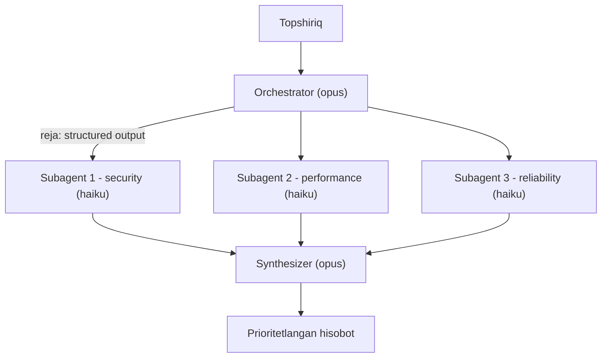

# 07. Multi-agent patterns va framework tanlovi

2026-yil ish e'lonlarida "multi-agent orchestration" va "LangGraph/CrewAI tajribasi" tez-tez uchraydi, lekin ko'p jamoalar bitta agent yetadigan joyda 5 ta agent qurib, keyin nega debug qilib bo'lmasligini tushunmay o'tiradi. Bu darsda ikki muhandislik qarorini aniqlashtiramiz: **qachon** bitta agent yetmaydi (va orchestrator-workers'ni raw API'da o'zimiz yozamiz), va **qaysi** framework'ni tanlash marketing emas, arxitektura talabi bilan belgilanadi. Bu ish suhbatida "nega framework ishlatmadingiz" degan savolga aniq javob beradigan qism.

---

## Nazariya (~30%)

### 1. Bitta agent yetmaydigan payt

01-04 darslarda qurgan agent'imiz bitta loop edi: `while stop_reason == "tool_use"`. Bitta model, bitta kontekst, ketma-ket tool call'lar. Bu ko'p ishga yetadi. Lekin ikkita holatda u tiqiladi:

1. **Parallellik** — topshiriq mustaqil bo'laklarga bo'linadi va ular bir vaqtda ishlashi mumkin. Bitta loop ketma-ket ishlaydi, ya'ni 5 ta mustaqil tekshiruvni birin-ketin qiladi.
2. **Kontekst izolyatsiyasi** — har bo'lak o'z fokusiga ega bo'lishi kerak, boshqa bo'lakning shovqini uni chalg'itmasligi kerak. Bitta kontekstda hamma narsa aralashadi.

Backend analogiyasi aniq: bu **goroutine fan-out** pattern'i. Bitta so'rov keladi, uni N ta mustaqil ishga bo'lasan, har birini alohida goroutine'da ishga tushirasan, natijalarni bitta channel'da yig'asan. Multi-agent tizim — aynan shu, faqat "goroutine" o'rniga "subagent" (o'z system prompt va tool'lari bilan alohida LLM chaqiruvi).

### 2. Orchestrator-workers — asosiy pattern

Anthropic o'zining Research tizimini aynan shunday qurgan: **lead agent** (orchestrator) topshiriqni qabul qiladi, uni 3-5 subtask'ga bo'ladi, har subtask uchun ixtisoslashgan **subagent** ochadi, ular **parallel** ishlaydi, natijalar oxirida sintez qilinadi (+ alohida citation bosqichi).

> **Oltin qoida:** Orchestrator dinamik reja tuzadi, subagent'lar parallel bajaradi, kontekst BO'LISHILMAYDI. Har subagent'ga kerak bo'lgan hamma narsa uning topshirig'ida aytilishi shart.



Raqamlar (Anthropic ichki research eval'i):

| Ko'rsatkich | Qiymat |
|---|---|
| Single-agent Opus'dan sifat o'sishi | **+90.2%** |
| Token sarfi (oddiy chatga nisbatan) | **~15x** |
| Odatiy subagent soni | 3-5 |

15x token — bu bejiz emas. Multi-agent parallellik va izolyatsiya uchun **narx to'laydi**. Shuning uchun uni faqat foyda 15x xarajatni oqlaganda ishlatasan (01-darsdagi "Should I Build an Agent?" 4 mezonining "Value" qismi).

### 3. Subagent kontrakti

Anthropic'ning eng qimmatli saboqi: subagent'lar kontekstni **bo'lishmaydi**. Lead agent nimani bilsa, subagent uni ko'rmaydi — u faqat o'z topshirig'ini oladi. Shuning uchun har topshiriq to'liq **kontrakt** bo'lishi kerak:

| Kontrakt qismi | Nima yoziladi |
|---|---|
| **Objective** | Subagent aynan nimani aniqlashi kerak |
| **Output format** | Natija qanday ko'rinishda qaytishi kerak |
| **Tools / manba** | Qaysi tool'lar, qaysi manbalar ruxsat etilgan |
| **Chegara** | Nimaga TEGMASLIK kerak (fokus tashqarisi) |

Bu backend'dagi **API kontrakti** bilan bir xil: mikroservis chaqiruvida "men nima yuborsam, sen nima qaytarasan"ni to'liq belgilaysan, chunki servis sening ichki holatingni ko'rmaydi.

Subagent sonini belgilash qoidasi (Anthropic prompt'ida kodlangan):

| Topshiriq turi | Subagent soni |
|---|---|
| Oddiy fakt | 1 |
| Taqqoslash (2-3 variant) | 2-4 |
| Murakkab research | 10+ |

### 4. Erta xatolar — nega prompt engineering muhim

Anthropic'ning birinchi versiyalari klassik multi-agent tuzoqlariga tushgan:

- Oddiy savolga **50 ta subagent** ochib yuborish (fan-out nazoratsiz).
- Mavjud bo'lmagan manbani **cheksiz** izlash (subagent to'xtash shartini bilmaydi).
- Subagent'lar bir-birini ortiqcha update bilan **chalg'itishi**.

Yechim yangi model emas — yaxshiroq prompt: orchestrator'ga "oddiy savolga 1 agent yetadi" qoidasini, subagent'ga aniq to'xtash shartini kodlash. Bu Huyen'ning fikri bilan mos: **intent classifier** ham agent, **actor-critic** (bittasi bajaradi, boshqasi baholaydi) ham multi-agent workflow. Aslida "plan generate → validate → execute" uch komponentini alohida agent desak, ko'p agentic workflow shu yerga keladi.

### 5. Qachon multi-agent KERAK EMAS

Bu darsning eng muhim fikri, chunki eng ko'p xato shu yerda:

- **Ketma-ket bog'liqlik bo'lsa** — 2-qadam 1-qadam natijasini kutsa, parallellik yo'q, multi-agent faqat murakkablik qo'shadi.
- **Bitta agent konteksti yetsa** — hamma narsa bitta kontekstga sig'sa, izolyatsiya keraksiz.

Multi-agent = **parallellik + kontekst izolyatsiyasi** uchun. Ikkalasi ham kerak bo'lmasa — 01-darsdagi oddiy loop yetadi.

---

### 6. Framework tanlovi — muhandislik qarori

Endi ikkinchi qaror. Har biri bir xil asosni (loop + tool call + state) turlicha o'raydi. Farqni bilmasang, marketing sahifasiga qarab tanlaysan.

| Framework | Kuchi | Zaifligi | Qachon |
|---|---|---|---|
| **LangGraph** | Graph abstraksiya: aniq state, checkpointing, human-in-the-loop, replay, audit trail | ReAct agent smolagents'da ~40 qator bo'lsa, bu yerda ~120; o'rganish egri chizig'i tik | Production/enterprise: durable state + audit shart bo'lsa |
| **CrewAI** | Rol/goal/backstory bilan tez prototip; koordinatsiyani o'zi taxmin qiladi | 5-agent pipeline'da xato debug qilish opaque (ichi ko'rinmaydi) | Tez prototip, standart workflow |
| **smolagents** | Eng sodda, code-first (CodeAgent action'ni Python kod sifatida yozadi), HF lokal modellar | Production emas: state management, HITL, observability yo'q | O'quv, research, lokal modellar |
| **Raw API (bizniki)** | To'liq nazorat, shaffoflik, minimal dependency; Anthropic tavsiyasi | Loop/state/retry o'zingniki | Kontrakt aniq; debug muhim |

Benchmark (o'rta murakkablikdagi task, lokal LLM):

```
LangGraph  76%  |  smolagents 73%  |  CrewAI 71%  |  AutoGen 68%
```

Farq bor, lekin **dramatik emas**. Xulosa muhim: **model sifati framework tanlovidan ko'ra ko'proq ahamiyatga ega**. Eng keng tarqalgan xato aynan shu haqiqatni e'tiborsiz qoldiradi:

> *"Over-engineering the orchestration layer before validating that the underlying model can handle the task at all."*
> Ostidagi model topshiriqni umuman uddalay oladimi — buni tekshirmasdan turib orchestratsiya qatlamini ortiqcha murakkablashtirish.

Va debug muammosi klassik dasturdan qiyinroq: bu yerda failure mode ko'pincha exception emas — **"model yomon qaror qildi"**. Framework abstraksiyasi prompt va model javobini yashiradi, shuning uchun buni topish yanada qiyinlashadi.

**Framework kodi qanday ko'rinadi** (quyidagilar ```text bloklarda — bular *pseudocode*, bizning stack EMAS; biz raw Claude API'da yozamiz):

```text
# smolagents CodeAgent - pseudocode, bizning stack EMAS.
# Action'lar Python kod sifatida generatsiya qilinadi va sandbox'da bajariladi.
from smolagents import CodeAgent, InferenceClientModel

agent = CodeAgent(tools=[search_tool], model=InferenceClientModel())
agent.run("2026-yilda eng ko'p yuklab olingan MCP server qaysi?")
# ~5 qator, lekin loop/state/HITL yashirin - production'ga tayyor emas.
```

```text
# LangGraph StateGraph - pseudocode, bizning stack EMAS.
# Graph = node'lar + edge'lar; state explicit, checkpointer bilan replay mumkin.
from langgraph.graph import StateGraph, END

class State(TypedDict):
    task: str
    findings: list

def orchestrate(state): ...   # rejani tuzadi
def worker(state): ...        # subtask bajaradi
def synthesize(state): ...    # birlashtiradi

g = StateGraph(State)
g.add_node("orchestrate", orchestrate)
g.add_node("worker", worker)
g.add_node("synthesize", synthesize)
g.add_edge("orchestrate", "worker")
g.add_edge("worker", "synthesize")
g.add_edge("synthesize", END)
g.set_entry_point("orchestrate")
app = g.compile(checkpointer=sqlite_saver)   # durable state + audit trail
app.invoke({"task": "..."}, config={"configurable": {"thread_id": "1"}})
# ~20 qator: state va checkpoint uchun to'lov. Enterprise flow'da oqlanadi.
```

Anthropic pozitsiyasi aniq: **avval raw API'da yoz**, ko'p pattern bir necha qatorda ishlaydi. Framework abstraksiya qatlami qo'shadi — prompt va javoblar ko'rinmay qoladi, debug qiyinlashadi. Framework ishlatsang ham, ostidagi kodni tushun.

---

## Amaliyot (~70%)

Orchestrator-workers'ni raw API'da to'liq yozamiz. `.env` da `ANTHROPIC_API_KEY` bor deb hisoblaymiz.

```bash
pip install anthropic pydantic python-dotenv
```

### Predict / Run

**Ssenariy:** bitta `payments-api` handler kodini production'ga tayyorlik uchun tekshiramiz. Orchestrator tekshiruvni mustaqil yo'nalishlarga bo'ladi (security, performance, reliability), har yo'nalishni alohida subagent parallel tekshiradi, natijalar bitta prioritetlangan ro'yxatga sintez qilinadi.

#### 1-qism. Orchestrator topshiriqni bo'ladi

> **Bashorat qiling:** orchestrator structured output bilan nechta subtask qaytaradi va ular qanday fokuslarga bo'linadi?

```python
# file: 01_orchestrator.py
import concurrent.futures
from dotenv import load_dotenv
import anthropic
from pydantic import BaseModel, Field

load_dotenv()
client = anthropic.Anthropic()

# --- Tahlil qilinadigan material: bitta servis handler'i ---
SERVICE_CODE = """
@app.post("/charge")
def charge(req):
    conn = psycopg2.connect(DSN)                                  # har so'rovda yangi ulanish
    cur = conn.cursor()
    cur.execute(f"SELECT * FROM cards WHERE id = {req.card_id}")   # SQL string
    row = cur.fetchone()
    stripe.Charge.create(amount=req.amount, source=row[3])
    return {"ok": True}                                           # xato ushlanmagan, log yo'q
"""

# --- 1-qadam: orchestrator rejasining strukturasi ---
class Subtask(BaseModel):
    id: str = Field(description="qisqa identifikator, masalan sec-1")
    objective: str = Field(description="subagent aynan nimani aniqlashi kerak")
    focus: str = Field(description="yagona yo'nalish: security, performance yoki reliability")

class Plan(BaseModel):
    subtasks: list[Subtask]

# --- 2-qadam: orchestrator (opus) topshiriqni MUSTAQIL bo'laklarga bo'ladi ---
ORCH_SYSTEM = (
    "Sen lead reviewer'san. Berilgan kodni production tayyorligi uchun tekshirishni "
    "MUSTAQIL yo'nalishlarga bo'l. Har subtask bitta focus'ga tegishli bo'lsin va "
    "boshqalari bilan kesishmasin. Oddiy kodga 1 ta, murakkabga 2-3 ta subtask yetadi."
)

plan_resp = client.messages.parse(
    model="claude-opus-4-8",
    max_tokens=800,
    system=ORCH_SYSTEM,
    messages=[{"role": "user", "content": SERVICE_CODE}],
    output_format=Plan,
)
plan = plan_resp.parsed_output
for st in plan.subtasks:
    print(f"[{st.id}] {st.focus}: {st.objective}")

# Output:
# [sec-1] security: SQL injection va karta ma'lumotining ochilishini tekshir
# [perf-1] performance: ulanish boshqaruvi va query samaradorligini tekshir
# [rel-1] reliability: xatoliklarni ushlash va observability yetishmasligini tekshir
```

Diqqat: orchestrator kodga **3 fokus** ajratdi va har birini alohida `objective` bilan berdi. Bu structured output (04-darsdan) — reja schema bo'yicha kafolatlangan, "erkin matndan subtask ajratib olish" bosqichi yo'q.

#### 2-qism. Subagent'lar parallel ishlaydi

> **Bashorat qiling:** 3 subagent ketma-ket ishlasa 3x vaqt ketardi. `concurrent.futures` bilan qancha tejaladi va natijalar qaysi tartibda qaytadi?

```python
# file: 01_orchestrator.py (davomi)

# --- 3-qadam: subagent KONTRAKTI prompt'da kodlanadi ---
def build_subagent_system(st):
    return (
        f"Sen {st.focus} bo'yicha tor mutaxassis subagent'san.\n"
        f"OBJECTIVE: {st.objective}\n"
        "CHEGARA: faqat shu focus'ga oid muammolarni yoz, boshqasiga TEGMA.\n"
        "FORMAT: har muammo bitta qator: '- [jiddiylik] muammo -> tavsiya'.\n"
        "Faqat aniq topilmalar, kirish so'zisiz."
    )

def run_subagent(st):
    # Subagent'ga kerakli hamma narsa (kod) topshiriqda beriladi - kontekst BO'LISHILMAYDI.
    resp = client.messages.create(
        model="claude-haiku-4-5",
        max_tokens=600,
        system=build_subagent_system(st),
        messages=[{"role": "user", "content": SERVICE_CODE}],
    )
    return st.id, st.focus, resp.content[0].text

# --- 4-qadam: fan-out - subagent'lar PARALLEL (goroutine fan-out kabi) ---
findings = []
with concurrent.futures.ThreadPoolExecutor(max_workers=4) as pool:
    for sid, focus, text in pool.map(run_subagent, plan.subtasks):
        findings.append((sid, focus, text))
        print(f"\n=== {sid} ({focus}) ===\n{text}")

# Output:
# === sec-1 (security) ===
# - [critical] card_id f-string bilan SQL'ga qo'yilgan -> parametrlangan query ishlat
# - [high] SELECT * butun karta qatorini oladi -> faqat kerakli ustunlar
#
# === perf-1 (performance) ===
# - [high] har so'rovda yangi psycopg2 ulanishi -> connection pool ishlat
# - [medium] ulanish yopilmayapti -> context manager yoki finally
#
# === rel-1 (reliability) ===
# - [critical] stripe.Charge xatosi ushlanmagan -> try/except + idempotency key
# - [medium] hech qanday log yo'q -> structured log qo'sh
```

`pool.map` natijalarni **topshiriq tartibida** qaytaradi (garchi ular parallel bajarilsa ham) — shuning uchun output deterministik. Har subagent o'z `SERVICE_CODE` nusxasini oladi: bu kontekst izolyatsiyasi. `security` subagent'i `performance` subagent'ining fikrini ko'rmaydi — shuning uchun ular bir-birini chalg'itmaydi.

#### 3-qism. Sintez

```python
# file: 01_orchestrator.py (davomi)

# --- 5-qadam: lead agent (opus) topilmalarni bitta ro'yxatga sintez qiladi ---
combined = "\n\n".join(
    f"## {focus} ({sid})\n{text}" for sid, focus, text in findings
)

synth_resp = client.messages.create(
    model="claude-opus-4-8",
    max_tokens=800,
    system=(
        "Subagent topilmalarini bitta prioritetlangan ro'yxatga birlashtir. "
        "Takrorlarni olib tashla, eng xavflisini tepaga qo'y."
    ),
    messages=[{"role": "user", "content": combined}],
)
print(synth_resp.content[0].text)

# Umumiy token hisobi (15x narxni ko'rish uchun):
total = plan_resp.usage.output_tokens + synth_resp.usage.output_tokens
print("orchestrator + synth output tokens:", total)

# Output:
# Production'dan oldin (jiddiylik bo'yicha):
# 1. [critical] SQL injection (card_id f-string) -> parametrlangan query
# 2. [critical] Stripe xatosi ushlanmagan -> try/except + idempotency key
# 3. [high] Har so'rovda yangi DB ulanishi -> connection pool
# 4. [high] SELECT * karta ma'lumotini ochyapti -> faqat kerakli ustunlar
# 5. [medium] Log va ulanishni yopish yo'q
# orchestrator + synth output tokens: 214
```

Butun oqim: 1 orchestrator call (opus) + 3 subagent call (haiku, parallel) + 1 synthesizer call (opus) = 5 model chaqiruvi. Bitta agent'da bu 1 chaqiruv bo'lardi. Mana o'sha 15x narx — lekin har fokus izolyatsiyada, chuqurroq tekshirilgan.

### Investigate / Modify

1. **Kontekst izolyatsiyasini buz.** `run_subagent` da `messages` dan `SERVICE_CODE` ni olib tashla, faqat `objective` qolsin. Subagent nima qiladi? (Ipucha: u kodni ko'rmaydi — kontekst bo'lishilmaydi, shuning uchun umumiy maslahat beradi yoki "kod ko'rsating" deydi.) Bu subagent kontraktida "kerakli hamma narsani berish" nega majburiy ekanini ko'rsatadi.
2. **Fan-out'ni nazoratdan chiqar.** `ORCH_SYSTEM` dan "Oddiy kodga 1 ta... 2-3 ta yetadi" qatorini olib tashla va murakkabroq (50 qatorli) kod ber. Nechta subtask chiqadi? Bu Anthropic'ning "50 subagent" muammosining kichik ko'rinishi — token narxi qanday o'sadi?
3. **Parallelni ketma-ketga aylantir.** `ThreadPoolExecutor` o'rniga oddiy `for st in plan.subtasks: run_subagent(st)` yoz va `time.time()` bilan ikkala variantni o'lcha. Farqni bir jumlada tushuntir: `concurrent.futures` nega bu yerda kerak?
4. **Subagent'ni opus'ga ko'tar.** `run_subagent` da `claude-haiku-4-5` ni `claude-opus-4-8` ga o'zgartir. Topilmalar sezilarli yaxshilandimi? Agar yo'q — bu subagent uchun qaysi modelni tanlash kerakligi haqida nima deydi (narx farqi ~5x)?

### Make

**Mini-challenge:** `handle(task)` funksiyasini yoz — u **routing + orchestrator** kombinatsiyasi bo'lsin (02-darsdagi routing pattern'ini eslab):

1. Avval haiku bilan topshiriqni klassifikatsiya qil (structured output): `simple` (bitta o'tishda bajariladi) yoki `complex` (mustaqil yo'nalishlarga bo'linadi).
2. `simple` bo'lsa — to'g'ridan-to'g'ri bitta haiku call, orchestrator ishlatilmaydi (arzon yo'l).
3. `complex` bo'lsa — yuqoridagi orchestrator-workers oqimini ishga tushir (fan-out).

Maqsad: 15x token'ni faqat kerak bo'lganda to'lash.

<details>
<summary>Yechim</summary>

```python
# file: make_router.py
import concurrent.futures
from dotenv import load_dotenv
import anthropic
from pydantic import BaseModel, Field

load_dotenv()
client = anthropic.Anthropic()

class Route(BaseModel):
    complexity: str = Field(description="simple yoki complex")
    reason: str = Field(description="qisqa sabab")

class Subtask(BaseModel):
    id: str
    objective: str
    focus: str

class Plan(BaseModel):
    subtasks: list[Subtask]

# --- 1-qadam: arzon model bilan routing qarori ---
def classify(task):
    resp = client.messages.parse(
        model="claude-haiku-4-5",
        max_tokens=200,
        system=(
            "Topshiriq bitta o'tishda bajariladimi (simple) yoki mustaqil "
            "yo'nalishlarga bo'linadimi (complex)? Faqat shu ikkitasidan birini tanla."
        ),
        messages=[{"role": "user", "content": task}],
        output_format=Route,
    )
    return resp.parsed_output

# --- 2-qadam: complex uchun orchestrator-workers ---
def run_subagent(st, task):
    resp = client.messages.create(
        model="claude-haiku-4-5",
        max_tokens=600,
        system=f"Sen {st.focus} subagent'san. OBJECTIVE: {st.objective}. Faqat shu focus.",
        messages=[{"role": "user", "content": task}],
    )
    return st.focus, resp.content[0].text

def run_orchestrator(task):
    plan = client.messages.parse(
        model="claude-opus-4-8",
        max_tokens=800,
        system="Topshiriqni 2-3 mustaqil focus'ga bo'l.",
        messages=[{"role": "user", "content": task}],
        output_format=Plan,
    ).parsed_output

    parts = []
    with concurrent.futures.ThreadPoolExecutor(max_workers=4) as pool:
        futures = [pool.submit(run_subagent, st, task) for st in plan.subtasks]
        for f in concurrent.futures.as_completed(futures):
            parts.append(f.result())

    combined = "\n\n".join(f"## {focus}\n{text}" for focus, text in parts)
    synth = client.messages.create(
        model="claude-opus-4-8",
        max_tokens=800,
        system="Topilmalarni bitta prioritetlangan ro'yxatga birlashtir.",
        messages=[{"role": "user", "content": combined}],
    )
    return synth.content[0].text

# --- 3-qadam: routing gate ---
def handle(task):
    route = classify(task)
    print(f"[route] {route.complexity} - {route.reason}")
    if route.complexity == "simple":
        r = client.messages.create(
            model="claude-haiku-4-5",
            max_tokens=600,
            messages=[{"role": "user", "content": task}],
        )
        return r.content[0].text
    return run_orchestrator(task)

if __name__ == "__main__":
    print(handle("psycopg2 ulanishini qanday yopaman?"))
    print("---")
    print(handle("Bu to'lov servisini production'ga tayyorlik uchun har tomonlama tekshir."))

# Output:
# [route] simple - bitta aniq savol, yagona javob yetadi
# `with conn:` yoki try/finally ichida conn.close() chaqir; connection pool ishlatsang
# pool.putconn(conn) bilan qaytar.
# ---
# [route] complex - production tekshiruvi bir nechta mustaqil yo'nalishga bo'linadi
# Production'dan oldin (jiddiylik bo'yicha):
# 1. [critical] ...
# 2. [high] ...
```

Asosiy nuqta: routing gate 15x narxli fan-out'ni faqat topshiriq haqiqatan murakkab bo'lganda ochadi. Oddiy savol arzon yo'ldan ketadi. Bu 02-dars (routing) va bu dars (orchestrator) pattern'larining kombinatsiyasi — production'da eng ko'p uchraydigan tuzilma. E'tibor ber: bu yerda `as_completed` ishlatildi (natija kelgan tartibda), oldingi misolda `pool.map` (topshiriq tartibida) — ikkalasi ham to'g'ri, tanlash tartib muhimligiga bog'liq.
</details>

---

## Xulosa

- Multi-agent faqat ikki holatda kerak: **parallellik** va **kontekst izolyatsiyasi**. Ikkalasi ham yo'q bo'lsa — bitta loop yetadi.
- **Orchestrator-workers** asosiy pattern: lead reja tuzadi, subagent'lar parallel bajaradi, sintez birlashtiradi.
- **Subagent kontrakti** = objective + format + tools + chegara; subagent'lar kontekstni bo'lishmaydi.
- Multi-agent sifatni ~90% oshirishi mumkin, lekin ~15x token to'laydi — faqat foyda oqlaganda.
- Framework tanlash arxitektura talabi bilan: durable state/audit → LangGraph, tez prototip → CrewAI, o'quv/lokal → smolagents, aniq kontrakt → raw API.
- Model sifati framework tanlovidan muhimroq; eng katta xato — model'ni sinamasdan orchestratsiyani murakkablashtirish.

## Retrieval practice

1. Bitta agent loop qaysi ikki aniq holatda tiqiladi va nega multi-agent buni hal qiladi?
2. Subagent kontekstni bo'lishmaydi — bu qoida subagent kontraktiga qanday talab qo'yadi? "Kontekst izolyatsiyasini buz" mashg'ulotida nima kuzatding?
3. Orchestrator-workers +90.2% sifat beradi, lekin ~15x token. Qaysi mezon bu almashtirilishni oqlaydimi yoki yo'qmi degan qarorni belgilaydi?
4. LangGraph va raw API o'rtasida tanlashda "durable state va audit trail" talabi bo'lmasa, qaysi biri va nega?
5. "Over-engineering the orchestration layer" xatosining aniq ma'nosi nima va uni oldini olish uchun birinchi nima tekshiriladi?
6. `pool.map` va `as_completed` orasidagi farq — qaysi holatda qay birini tanlaysan?

## Manbalar

- **Anthropic Engineering, "How we built our multi-agent research system"** — orchestrator-worker arxitekturasi, +90.2% / ~15x token, subagent kontrakti, erta xatolar (50 subagent, cheksiz izlash): `https://www.anthropic.com/engineering/multi-agent-research-system`
- **Anthropic Engineering, "Building effective agents"** — workflow vs agent, "start with LLM APIs directly", framework abstraksiyasi ogohlantirishi: `https://www.anthropic.com/engineering/building-effective-agents`
- **Chip Huyen, "AI Engineering" (Ch 6)** — intent classifier agent sifatida, actor-critic, generate/validate/execute uch komponenti multi-agent'ga aylanishi.
- Framework benchmark va "over-engineering the orchestration layer" tahlili (2026 production taqqoslashlari): raw API vs LangGraph vs CrewAI vs smolagents.
- Research xulosasi, 5-bo'lim, §4 (multi-agent saboqlar) va §6 (framework taqqoslash).
