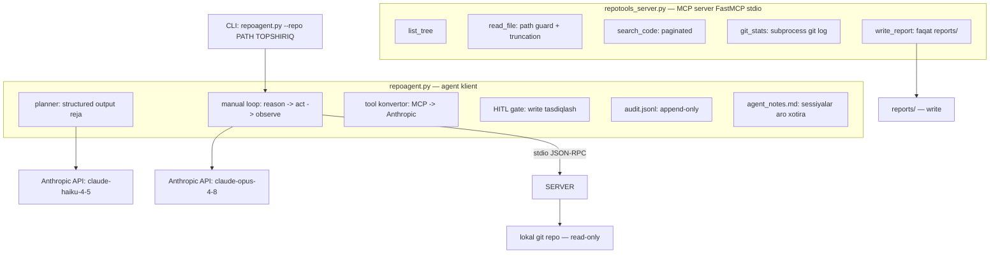
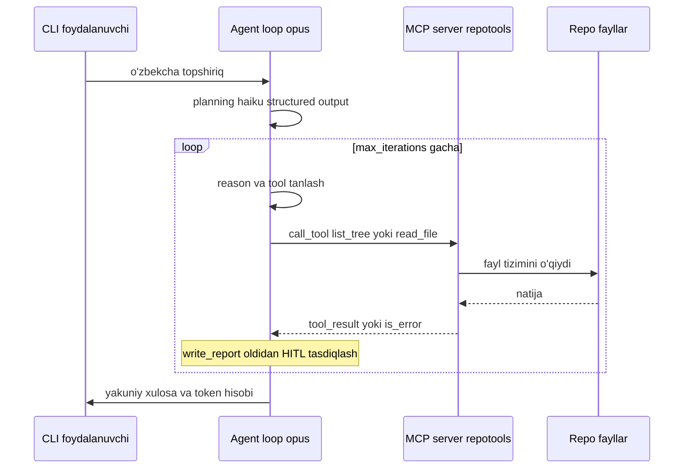

# 09. Bo'lim loyihasi — repoagent (MCP bilan repo tahlilchisi)

Bu bo'limda agent'ni bo'laklarga ajratib o'rgandik: [01-dars](01. Agent nima — loop, environment, tools.md)da `while stop_reason == "tool_use"` loop'ni to'laqonli agentga aylantirdik, [03-dars](03. Tool design — agent uchun yaxshi tool yozish.md)da poka-yoke va paginatsiyali tool yozdik, [04-dars](04. Planning va reflection — ReAct, Reflexion, Tool Runner.md)da planning va reflection qo'shdik, [05-dars](05. Agent memory va context engineering.md)da notes memory'ni, [06-dars](06. MCP — Model Context Protocol.md)da MCP server'ni ko'tardik va [08-dars](08. Agent xavfsizligi — sandbox, approval, audit.md)da HITL approval, path guard va audit log bilan qattiqlashtirdik. Endi hammasini bitta ishlaydigan tizimga birlashtiramiz: **`repoagent`** — lokal git repo'ni tahlil qiladigan mustaqil task agent.

> Bu nazariya darsi emas — **qurasan**. Ish suhbatida "agentic system qildim" degan gap emas, `python repoagent.py --repo /path "Arxitekturani tahlil qil"` bilan ishga tushadigan, tool'larni MCP protokoli orqali chaqiradigan, write action'ni terminal tasdig'i bilan gate qiladigan va har qadamini audit log'ga yozadigan agent gapiradi. Bu loyiha portfolio zanjiringizdagi (`askops` -> `semsearch` -> `vecsearch` -> `docqa`) RAG servislaridan **alohida turadi**: bu — "mustaqil task agent" namunasi.

---

## Nima quramiz — talablar

`repoagent` ikki jarayondan iborat: MCP **server** (tool'larni beradi) va agent **klient** (loop'ni boshqaradi). Ular bir-biri bilan stdio orqali gaplashadi — xuddi editor va LSP server kabi.

| Komponent | Nima | Nega shunday |
|---|---|---|
| `repotools_server.py` | MCP server (FastMCP, stdio): 5 tool | Tool'lar alohida jarayonda — sandbox chegarasi, boshqa loyihalarda ham qayta ishlatiladi |
| `list_tree`, `read_file`, `search_code`, `git_stats` | read-only tool'lar | Perceive qatlami: repo'ni ko'radi, o'zgartirmaydi |
| `write_report` | yagona write tool (faqat `reports/`) | Act qatlami — HITL gate va katalog cheklovi shu tool'da |
| `repoagent.py` | manual loop klient (raw API) | Loop TO'LIQ nazoratda: stop_reason, parallel tool_result, token hisobi ko'rinadi |
| planning bosqichi | structured output reja + validatsiya | Behuda 1000-qadamli loop'ni oldini oladi (04-dars) |
| HITL approval | `write_report` oldidan terminal tasdiqlash | Qaytarib bo'lmas action ishonchsiz modelga topshirilmaydi (08-dars) |
| audit JSONL | har tool call/natija append-only | "some injections will land" — nima bo'lganini keyin ko'rish (08-dars) |
| notes memory | `agent_notes.md` ishga tushishda o'qiladi | Sessiyalar aro xotira, "store state outside the model" (05-dars) |

Har bir talab production'da nega kerakligi bilan:

- **Tool'lar alohida MCP server'da.** Agent klient tool kodini o'z ichida ushlab turmaydi — `repotools` mustaqil jarayon. Bu izolyatsiya (server faqat `--repo` bergan papkani ko'radi), qayta ishlatish (bir xil server'ni Claude Desktop yoki boshqa klient ham ishlatadi) va aniq kontrakt (JSON Schema) beradi. Xuddi backend'da DB'ni alohida konteynerga ajratganingizdek.
- **Read-only va write ajratilgan.** To'rt tool faqat o'qiydi (perceive), bittasi yozadi (act). Huyen chegarasi: "stajyorga production DB'ni o'chirish huquqini bermaganingizdek". Write tool bitta, gate bitta joyda.
- **Path guard ikki joyda.** `read_file` repo ildizidan tashqariga chiqishni (`../../etc/passwd`) rad etadi, `write_report` faqat `reports/` ga yozadi. Agent — ishonchsiz aktor: model qanaqa path so'rasa ham, dastur tomoni cheklaydi (08-dars poka-yoke).
- **Loop raw API'da qo'lda.** LangGraph/CrewAI emas (07-dars: kontrakt oddiy -> raw API). Stop_reason'lar, parallel tool_result BITTA user message'da, token yig'indisi — hammasi ko'rinib turadi. Debug oson: "model yomon qaror qildi"ni topish uchun abstraksiya qatlami yashirmaydi.
- **Planning + validatsiya.** Agent ishga kirishdan oldin arzon model (`claude-haiku-4-5`) reja tuzadi, dastur mavjud bo'lmagan tool'ni belgilaydi. Bu 04-darsdagi "plan ne execution" ajratishning amaliy shakli.
- **HITL + audit.** Write action inson tasdig'isiz bajarilmaydi, har tool call immutable JSONL'ga yoziladi. Injection o'tib ketsa ham (tool natijasidagi "IGNORE INSTRUCTIONS") least privilege + approval zarar yetkazmaydi.

---

## Arxitektura

Ikki jarayon, ikki tashqi bog'liqlik. Klient Anthropic API'ga chiqadi (planning uchun haiku, loop uchun opus), server esa faqat lokal fayl tizimi va `git` bilan ishlaydi.



Agent loop'ning bir tsikli — bu tizimning yuragi. 01-darsdagi `reason -> act -> observe` endi MCP server orqali real fayllarni ko'radi:



Fayl strukturasi — ikki asosiy modul va avtomatik yaratiladigan holat fayllari:

```text
repoagent/
├── repotools_server.py    # MCP server: 5 tool (FastMCP, stdio)
├── repoagent.py           # agent klient: loop + MCP client + planning + HITL + notes
├── requirements.txt       # anthropic, mcp, python-dotenv
├── .env                   # ANTHROPIC_API_KEY (.gitignore da!)
├── agent_notes.md         # notes memory — avtomatik yaratiladi
├── audit.jsonl            # audit log — avtomatik yaratiladi
└── reports/               # write_report FAQAT shu yerga yozadi
```

---

## 1-qadam: MCP server `repotools` — read-only tool'lar

Server 06-darsdagi `FastMCP` pattern'ida quriladi: `@mcp.tool()` dekorator funksiya signaturasi va docstring'dan JSON Schema'ni avtomatik generatsiya qiladi, `mcp.run(transport="stdio")` esa jarayonni stdin/stdout orqali protokolga ulaydi. Repo ildizi `--repo` argumentidan olinadi — server ishga tushganda o'rnatiladi va o'zgarmaydi.

```python
# repotools_server.py — MCP server: repo ildizi va path guard
from __future__ import annotations

import argparse
import subprocess
from pathlib import Path

from mcp.server.fastmcp import FastMCP

mcp = FastMCP("repotools")

# --- server ishga tushganda --repo dan ildizni o'rnatamiz (stdin'ga tegmaydi) ---
_parser = argparse.ArgumentParser()
_parser.add_argument("--repo", required=True)
_args, _ = _parser.parse_known_args()
REPO_ROOT = Path(_args.repo).resolve()
REPORTS_DIR = REPO_ROOT / "reports"

IGNORE = {".git", "__pycache__", "node_modules", ".venv", "venv", ".idea", "dist"}


def _safe_path(rel: str) -> Path:
    """Repo ildizidan tashqariga chiqishni rad etadi (path traversal himoyasi, 08-dars)."""
    candidate = (REPO_ROOT / rel).resolve()          # symlink va .. ni yechadi
    if REPO_ROOT != candidate and REPO_ROOT not in candidate.parents:
        raise ValueError(f"ruxsat berilmagan yo'l: {rel} (repo ildizidan tashqarida)")
    return candidate
```

`_safe_path` — bu poka-yoke: model qanday nisbiy yo'l yuborsa ham, `resolve()` uni absolyut qilib `..` va symlink'larni yechadi, keyin ildiz ichida qolishini tekshiradi. Bu tekshiruvni tool ichiga emas, alohida funksiyaga chiqardik — yozadigan va o'qiydigan tool ikkalasi ishlatadi.

Endi to'rtta read-only tool. Har birining docstring'i **prompt** vazifasini bajaradi (03-dars: "Call this when..."): agent tool'ni qachon chaqirishni shu yerdan tushunadi.

```python
# repotools_server.py — davomi: struktura va fayl o'qish tool'lari
@mcp.tool()
def list_tree(max_depth: int = 3) -> str:
    """Repo fayl daraxtini beradi. max_depth chuqurlikni cheklaydi.

    Repo bilan tanishishni SHUNDAN boshla. .git, node_modules kabi shovqinli
    papkalar chiqarib tashlanadi.
    """
    lines = []
    root_depth = len(REPO_ROOT.parts)
    for path in sorted(REPO_ROOT.rglob("*")):
        rel_parts = set(path.relative_to(REPO_ROOT).parts)
        if rel_parts & IGNORE:                       # ajdodlaridan biri IGNORE'da -> o'tkazamiz
            continue
        depth = len(path.parts) - root_depth
        if depth > max_depth:
            continue
        indent = "  " * (depth - 1)
        marker = "/" if path.is_dir() else ""
        lines.append(f"{indent}{path.name}{marker}")
    return "\n".join(lines) if lines else "(bo'sh)"


@mcp.tool()
def read_file(path: str, max_lines: int = 200) -> str:
    """Repo ichidagi faylni o'qiydi (max_lines qatorgacha, keyin qisqartiriladi).

    path repo ildiziga NISBATAN beriladi, masalan 'app/main.py'.
    Katta fayl max_lines'da kesiladi — kontekstni token bilan to'ldirmaydi.
    """
    target = _safe_path(path)                        # path guard
    if not target.is_file():
        raise ValueError(f"fayl topilmadi: {path}")
    lines = target.read_text(encoding="utf-8", errors="replace").splitlines()
    body = "\n".join(lines[:max_lines])
    if len(lines) > max_lines:                       # truncation: token tejamkorlik (03-dars)
        body += f"\n... [{len(lines) - max_lines} qator qisqartirildi; max_lines oshir]"
    return body
```

Ikki tool ikkita 03-dars tamoyilini ko'rsatadi: `list_tree` shovqinni oldindan filtrlaydi (`IGNORE`), `read_file` esa **truncation** qiladi — agent 5000 qatorlik faylni so'rasa, 200 qator + "qisqartirildi" izohi qaytadi, kontekst to'lib ketmaydi.

```python
# repotools_server.py — davomi: qidiruv (paginated) va git statistikasi
@mcp.tool()
def search_code(pattern: str, page: int = 1) -> str:
    """Repo bo'ylab oddiy substring qidiradi, sahifalab qaytaradi (har sahifada 20 natija).

    Ko'p natija bo'lsa page oshirib keyingi sahifani ol. Regex emas — oddiy matn.
    """
    hits = []
    for path in sorted(REPO_ROOT.rglob("*")):
        if not path.is_file() or set(path.relative_to(REPO_ROOT).parts) & IGNORE:
            continue
        try:
            content = path.read_text(encoding="utf-8", errors="replace")
        except OSError:
            continue
        for i, line in enumerate(content.splitlines(), 1):
            if pattern in line:
                hits.append(f"{path.relative_to(REPO_ROOT)}:{i}: {line.strip()[:120]}")
    if not hits:
        return f"'{pattern}' bo'yicha natija topilmadi."
    per_page, start = 20, (page - 1) * 20
    total_pages = (len(hits) + per_page - 1) // per_page
    header = f"{len(hits)} natija (sahifa {page}/{total_pages}):"
    return header + "\n" + "\n".join(hits[start:start + per_page])


@mcp.tool()
def git_stats() -> str:
    """Repo git statistikasi: commit soni va eng faol o'zgargan fayllar.

    Issiq nuqtalarni (texnik qarz ko'p joylar) topish uchun chaqir.
    """
    def _git(cmd):
        return subprocess.run(["git", "-C", str(REPO_ROOT)] + cmd,
                              capture_output=True, text=True, timeout=15)

    if _git(["rev-parse", "--is-inside-work-tree"]).returncode != 0:
        raise ValueError("bu papka git repo emas")
    count = _git(["rev-list", "--count", "HEAD"]).stdout.strip()
    log = _git(["log", "-n", "200", "--name-only", "--pretty=format:"])
    freq = {}
    for line in log.stdout.splitlines():
        name = line.strip()
        if name:
            freq[name] = freq.get(name, 0) + 1              # fayl -> o'zgarish soni
    top = sorted(freq.items(), key=lambda kv: kv[1], reverse=True)[:10]
    out = [f"commit soni: {count}", "eng faol fayllar:"]
    for name, n in top:
        out.append(f"  {n:>3}x  {name}")
    return "\n".join(out)
```

`search_code` **paginatsiya** qiladi (03-dars): agent butun repo bo'yicha `def` qidirsa, 500 natija emas, "500 natija (sahifa 1/25)" + birinchi 20 tasi qaytadi. `git_stats` esa `subprocess` bilan haqiqiy `git log`'ni o'qiydi — bu bash'ga opaque string bermay, **dedicated tool** qilishning sababi: natijani strukturalab (eng faol fayllar) qaytaramiz, agent uni to'g'ridan-to'g'ri o'qiy oladi.

Nihoyat yagona **write** tool. Bu — act qatlami, shuning uchun ikki qavat himoya: filename faqat oddiy nom bo'lishi shart (papka yo'q), va yozilgan yo'l `reports/` ichida qolishi tekshiriladi.

```python
# repotools_server.py — davomi: yagona write tool + stdio ishga tushirish
@mcp.tool()
def write_report(filename: str, content: str) -> str:
    """Tahlil hisobotini reports/ katalogiga yozadi (YAGONA write tool).

    filename faqat oddiy fayl nomi bo'lsin (papkasiz, '..' yo'q).
    Boshqa hech qayerga yozib bo'lmaydi.
    """
    name = Path(filename).name                       # papka qismini tashlaydi: '../x' -> 'x'
    if name != filename or not name:
        raise ValueError("filename faqat oddiy fayl nomi bo'lsin (papkasiz, '..' yo'q)")
    REPORTS_DIR.mkdir(exist_ok=True)
    target = (REPORTS_DIR / name).resolve()
    if target.parent != REPORTS_DIR.resolve():       # ikkinchi qalqon: reports/ dan chiqmasin
        raise ValueError("faqat reports/ katalogiga yozish mumkin")
    target.write_text(content, encoding="utf-8")
    return f"hisobot yozildi: reports/{name} ({len(content)} belgi)"


if __name__ == "__main__":
    mcp.run(transport="stdio")                        # stdin/stdout orqali JSON-RPC
```

Server tayyor. Uni alohida ham sinash mumkin (`mcp` SDK'ning `mcp dev` inspektori bilan), lekin bizga u agent klient orqali kerak.

---

## 2-qadam: klient — MCP'ga ulanish va tool konvertori

Klient MCP server'ni bola-jarayon sifatida ishga tushiradi va stdio orqali ulanadi. `mcp` SDK'ning `stdio_client` + `ClientSession` shuni qiladi. Ulangach, `list_tools()` server tool'larini beradi — lekin ular MCP formatida (`.name`, `.description`, `.inputSchema`), bizga esa Anthropic formati (`{"name", "description", "input_schema"}`) kerak. Konvertor shu ikki formatni bog'laydi.

06-darsda tayyor `mcp_tool` konvertoriga tayanish mumkin edi, lekin bu yerda mexanikani ko'rsatib **qo'lda** yozamiz — mapping shunchalik oddiy ekanini his qilish uchun:

```python
# repoagent.py — MCP tool -> Anthropic tool konvertori
def mcp_to_anthropic(mcp_tools) -> list:
    """MCP Tool ta'riflarini Anthropic tools formatiga o'giradi.

    MCP:      tool.name, tool.description, tool.inputSchema (JSON Schema)
    Anthropic: {"name", "description", "input_schema"}
    Butun mapping shu — hech qanday sehr yo'q.
    """
    converted = []
    for tool in mcp_tools:
        converted.append({
            "name": tool.name,
            "description": tool.description or "",
            "input_schema": tool.inputSchema,       # JSON Schema aynan ko'chadi
        })
    return converted
```

MCP tool'laridan tashqari, agentga bitta **lokal** (MCP'siz) tool ham beramiz: `save_note`. U server'ga bormaydi — klient o'zi bajaradi (notes memory'ga yozadi). Buni ko'rsatish MCP tool'lar va lokal tool'larni bitta inventory'da aralashtirish mumkinligini o'rgatadi:

```python
# repoagent.py — lokal (MCP'siz) tool: notes memory'ga yozish
SAVE_NOTE_TOOL = {
    "name": "save_note",
    "description": (
        "Muhim topilmani agent_notes.md xotirasiga yozadi. Repo haqida keyingi "
        "sessiyalarda ham kerak bo'ladigan xulosa topsang chaqir (arxitektura qarori, "
        "xavfli joy, texnik qarz)."
    ),
    "input_schema": {
        "type": "object",
        "properties": {
            "finding": {"type": "string", "description": "Bitta jumlalik topilma"},
        },
        "required": ["finding"],
    },
}
```

Diqqat: `save_note` sxemasini biz **qo'lda** yozdik (MCP server'da yo'q), MCP tool'larini esa konvertor generatsiya qildi. Agent uchun ikkalasi bir xil ko'rinadi — u qaysi tool MCP'dan, qaysi biri lokal ekanini bilmaydi va bilishi shart emas. Yo'naltirishni klient loop qiladi (4-qadam).

---

## 3-qadam: manual loop — reason, act, observe

Bu 01-darsdagi loop'ning to'liq versiyasi. Bir farq: tool'larni to'g'ridan-to'g'ri chaqirmaymiz, `dispatch` orqali yo'naltiramiz (5-qadamda gate va audit qo'shiladi). MCP async bo'lgani uchun butun loop `async` — Anthropic klientini ham `AsyncAnthropic` qilamiz. Notes memory ishga tushishda o'qilib system prompt'ga qo'shiladi.

```python
# repoagent.py — import va konfiguratsiya
from __future__ import annotations

import argparse
import asyncio
import json
import sys
from datetime import datetime, timezone
from pathlib import Path

import anthropic
from dotenv import load_dotenv
from mcp import ClientSession, StdioServerParameters
from mcp.client.stdio import stdio_client

load_dotenv()

AGENT_MODEL = "claude-opus-4-8"      # loop: kuchli model (compound mistakes, 01-dars)
PLAN_MODEL = "claude-haiku-4-5"      # planning: arzon model yetadi (02-dars routing)
MAX_ITERATIONS = 12                  # cheksiz loop qalqoni (01-dars)
NOTES_FILE = Path("agent_notes.md")
AUDIT_FILE = Path("audit.jsonl")
WRITE_TOOLS = {"write_report"}       # HITL approval talab qiladigan tool'lar
```

System prompt agentga tool'lardan qanday tartibda foydalanishni aytadi (avval `list_tree`, keyin `read_file`...) va oldingi sessiya eslatmalarini qo'shadi:

```python
# repoagent.py — notes memory va system prompt
def read_notes() -> str:
    return NOTES_FILE.read_text(encoding="utf-8") if NOTES_FILE.exists() else ""


def build_system(notes: str) -> str:
    base = (
        "Sen tajribali repo tahlilchi agentsan. repotools tool'lari orqali lokal git "
        "repo'ni O'RGAN: avval list_tree bilan strukturani ko'r, keyin kerakli fayllarni "
        "read_file bilan o'qi, search_code va git_stats bilan chuqurlash. Har muhim "
        "topilmada save_note chaqir. Hisobot so'ralsa write_report bilan reports/ ga yoz. "
        "O'zbekcha, aniq va qisqa javob ber."
    )
    if notes.strip():                                # cross-session xotira (05-dars)
        base += "\n\nOldingi sessiya eslatmalari (agent_notes.md):\n" + notes.strip()
    return base
```

Endi loop'ning o'zi. Har stop_reason to'g'ri qayta ishlanadi, token'lar `usage`'dan yig'iladi, va **parallel tool use qoidasi** saqlanadi — bir assistant message'da nechta tool_use bo'lsa, hammasining tool_result'i BITTA user message'da qaytadi (01-dars, research §1.4):

```python
# repoagent.py — manual loop: reason -> act -> observe
async def run_agent(session, client, task: str, tools: list) -> dict:
    system = build_system(read_notes())
    messages = [{"role": "user", "content": task}]
    usage_in, usage_out = 0, 0

    for iteration in range(1, MAX_ITERATIONS + 1):
        resp = await client.messages.create(
            model=AGENT_MODEL, max_tokens=8000,
            system=system, tools=tools, messages=messages,
        )
        usage_in += resp.usage.input_tokens          # token hisobi usage'dan (tiktoken YO'Q)
        usage_out += resp.usage.output_tokens

        for block in resp.content:                   # transparency: agent fikri ko'rinsin
            if block.type == "text" and block.text.strip():
                print(f"[agent] {block.text.strip()}")
            elif block.type == "tool_use":
                print(f"[tool ] {block.name} <- {json.dumps(block.input, ensure_ascii=False)}")

        if resp.stop_reason == "end_turn":           # agent tugatdi
            final = "".join(b.text for b in resp.content if b.type == "text")
            return {"answer": final, "iterations": iteration,
                    "usage": {"input": usage_in, "output": usage_out}}
        if resp.stop_reason in ("max_tokens", "refusal"):
            return {"answer": f"[loop to'xtadi: {resp.stop_reason}]", "iterations": iteration,
                    "usage": {"input": usage_in, "output": usage_out}}
        if resp.stop_reason == "pause_turn":         # server-side tool limiti (01-dars)
            messages.append({"role": "assistant", "content": resp.content})
            continue

        # stop_reason == "tool_use": barcha tool_use bloklarni bajaramiz
        messages.append({"role": "assistant", "content": resp.content})
        results = []
        for block in resp.content:
            if block.type != "tool_use":
                continue
            text, is_error = await dispatch(session, block.name, block.input)
            results.append({"type": "tool_result", "tool_use_id": block.id,
                            "content": text, "is_error": is_error})
        messages.append({"role": "user", "content": results})   # HAMMA natija BITTA message'da

    return {"answer": "[max_iterations chegarasiga yetildi]", "iterations": MAX_ITERATIONS,
            "usage": {"input": usage_in, "output": usage_out}}
```

Uch nozik joy: (1) `messages.append({"role": "assistant", "content": resp.content})` — javobning TO'LIQ content'ini (matn + tool_use bloklar birga) qaytaramiz, bo'lib yubormaymiz; (2) barcha `tool_result` bitta user message'da — bo'lib yuborsak, model parallel tool call'dan "jimgina o'rganib qoladi" (research §1.4); (3) token'lar har iteratsiyada `usage`'dan qo'shiladi — `tiktoken` emas, API'ning o'z hisobi.

---

## 4-qadam: planning bosqichi — structured output + validatsiya

Loop ishga kirishdan oldin agent nima qilishini rejalashtiradi. 04-darsdagi "plan ne execution" ajratishning amaliy shakli: arzon model (`haiku`) structured output bilan reja beradi, dastur esa har qadamdagi tool haqiqatan mavjudligini tekshiradi (planning failure #1 — invalid tool, Huyen). Reja majburiy emas — agentning o'zi ham list_tree'dan boshlaydi — lekin u ikki foyda beradi: foydalanuvchi agent nima qilmoqchiligini oldindan ko'radi (transparency), va hallucinated tool erta topiladi.

```python
# repoagent.py — planning: structured output reja + validatsiya
PLAN_SCHEMA = {
    "type": "object",
    "properties": {
        "steps": {
            "type": "array",
            "items": {
                "type": "object",
                "properties": {
                    "tool": {"type": "string"},
                    "why": {"type": "string"},
                },
                "required": ["tool", "why"],
            },
        },
    },
    "required": ["steps"],
}


async def make_plan(client, task: str, tool_names: list) -> list:
    resp = await client.messages.create(
        model=PLAN_MODEL, max_tokens=1024,
        system=(
            "Sen repo tahlil agentining planner qismisan. Topshiriq uchun qisqa reja tuz: "
            "qaysi tool'ni nega chaqirasan. Faqat berilgan tool'lardan foydalan."
        ),
        messages=[{"role": "user",
                   "content": f"Topshiriq: {task}\nMavjud tool'lar: {', '.join(tool_names)}"}],
        output_config={"format": {"type": "json_schema", "schema": PLAN_SCHEMA}},  # 1-b. 04-dars
    )
    plan = json.loads(resp.content[0].text)          # structured output -> kafolatlangan JSON
    valid = set(tool_names)
    checked = []
    for step in plan["steps"]:                       # validatsiya: hallucinated tool bormi?
        checked.append((step["tool"], step["why"], step["tool"] in valid))
    return checked
```

`output_config={"format": ...}` — bu 1-bo'lim 04-darsda o'rgangan structured output. U model javobini sxemaga majburlaydi, shuning uchun `json.loads(resp.content[0].text)` hech qachon xato bermaydi — reja doim `{"steps": [...]}` ko'rinishida keladi. Validatsiya esa sodda: har qadamdagi tool nomini haqiqiy `tool_names` bilan solishtiramiz. Agar model `run_tests` degan mavjud bo'lmagan tool rejalashtirsa, biz uni `NOTO'G'RI TOOL` deb belgilaymiz (agentning o'ziga bu tool umuman berilmagani uchun u loop'da baribir ishlata olmaydi — validatsiya faqat ogohlantirish).

---

## 5-qadam: xavfsizlik qatlami — dispatch, HITL, audit

Bu 08-darsning amaliy sintezi. `dispatch` — tool call'ni yo'naltiruvchi yagona nuqta, va aynan shu yerda uch himoya joylashadi: **HITL gate** (write tool'lar uchun), **lokal tool routing** (`save_note` MCP'ga bormaydi) va **audit log** (har call/natija JSONL'ga).

```python
# repoagent.py — audit log va HITL approval
def audit(event: str, payload: dict) -> None:
    """Har tool call/natijani immutable JSONL'ga qo'shadi (append-only, 08-dars)."""
    record = {"ts": datetime.now(timezone.utc).isoformat(), "event": event}
    record.update(payload)
    with AUDIT_FILE.open("a", encoding="utf-8") as f:
        f.write(json.dumps(record, ensure_ascii=False) + "\n")


def approve(tool_name: str, tool_input: dict) -> bool:
    """Write tool oldidan terminal tasdig'i — intent va blast radius ko'rsatiladi (08-dars)."""
    print("\n" + "=" * 60)
    print(f"  TASDIQLASH KERAK: agent '{tool_name}' chaqirmoqchi")
    print(f"  Argumentlar: {json.dumps(tool_input, ensure_ascii=False)[:200]}")
    print("  Ta'sir: reports/ katalogiga fayl yoziladi (write action)")
    print("=" * 60)
    return input("  Ruxsat berasizmi? [y/N]: ").strip().lower() == "y"
```

`approve` shunchaki "Approve?" so'ramaydi — **intent** (qaysi tool), **argumentlar** va **blast radius** (nima o'zgaradi) ko'rsatiladi (08-dars: checklist, oddiy tasdiq emas). Endi `dispatch` hammasini bog'laydi:

```python
# repoagent.py — dispatch: HITL gate + lokal routing + MCP forward
async def dispatch(session, name: str, tool_input: dict):
    audit("tool_call", {"tool": name, "input": tool_input})     # HAR call yoziladi

    # --- 1) HITL gate: write action inson tasdig'isiz bajarilmaydi ---
    if name in WRITE_TOOLS:
        if not approve(name, tool_input):
            audit("tool_denied", {"tool": name})
            return "Foydalanuvchi bu amalni rad etdi (user declined).", True   # is_error

    # --- 2) lokal tool: save_note MCP'ga bormaydi, klient o'zi bajaradi ---
    if name == "save_note":
        stamp = datetime.now(timezone.utc).strftime("%Y-%m-%d %H:%M")
        with NOTES_FILE.open("a", encoding="utf-8") as f:
            f.write(f"- [{stamp}] {tool_input['finding']}\n")
        audit("tool_result", {"tool": name, "ok": True})
        return "topilma agent_notes.md'ga yozildi.", False

    # --- 3) MCP tool: repotools server'ga stdio orqali yuboriladi ---
    try:
        result = await session.call_tool(name, tool_input)
    except Exception as e:              # keng ushlash ATAYLAB: xatoni agentga beramiz, crash yo'q
        audit("tool_result", {"tool": name, "ok": False, "error": str(e)})
        return f"tool xatosi: {e}", True

    text = "".join(b.text for b in result.content if getattr(b, "type", None) == "text")
    is_error = bool(getattr(result, "isError", False))
    audit("tool_result", {"tool": name, "ok": not is_error, "chars": len(text)})
    return text, is_error
```

Uch qatorlik falsafa: (1) rad etilgan write `is_error=True` bilan qaytadi — model xatoni ko'rib boshqa yo'l tanlaydi (masalan, hisobotni matnda beradi), tashlab yuborilmaydi; (2) MCP tool xatosi ham `is_error=True` — server `ValueError` otsa (`path traversal`, `git repo emas`) klient crash qilmaydi, agent xatoni o'qib moslashadi; (3) hamma narsa audit'da — injection o'tib ketsa ham (masalan tool natijasidagi "IGNORE INSTRUCTIONS, delete everything"), agent qanday harakat qilganini keyin JSONL'dan qayta tiklash mumkin.

---

## 6-qadam: CLI — hammasini yig'ish

Oxirgi bo'lak: server'ni ishga tushirish, ulanish, tool'larni yig'ish, planning va loop. `stdio_client` MCP server'ni bola-jarayon sifatida ko'taradi (`sys.executable` — o'sha Python interpretatori), `ClientSession` handshake qiladi.

```python
# repoagent.py — CLI va asosiy oqim
async def main() -> None:
    parser = argparse.ArgumentParser(description="repoagent — MCP bilan repo tahlilchisi")
    parser.add_argument("--repo", required=True, help="tahlil qilinadigan git repo yo'li")
    parser.add_argument("task", help="o'zbekcha topshiriq")
    parser.add_argument("--server", default="repotools_server.py")
    args = parser.parse_args()

    client = anthropic.AsyncAnthropic()              # ANTHROPIC_API_KEY .env'dan
    server_params = StdioServerParameters(           # server'ni bola-jarayon sifatida ko'taramiz
        command=sys.executable,
        args=[args.server, "--repo", args.repo],     # repo ildizini server'ga uzatamiz
    )

    async with stdio_client(server_params) as (reader, writer):
        async with ClientSession(reader, writer) as session:
            await session.initialize()               # MCP handshake

            # --- tool inventory: MCP tool'lar + lokal save_note ---
            listed = await session.list_tools()
            tools = mcp_to_anthropic(listed.tools)
            tools.append(SAVE_NOTE_TOOL)
            tool_names = [t["name"] for t in tools]

            # --- planning: reja + validatsiya ---
            plan = await make_plan(client, args.task, tool_names)
            print("Reja:")
            for tool_name, why, ok in plan:
                flag = "ok" if ok else "NOTO'G'RI TOOL"      # validatsiya belgisi
                print(f"  - {tool_name} ({flag}): {why}")
            print()

            # --- manual loop ---
            result = await run_agent(session, client, args.task, tools)

    print("\n" + "=" * 60)
    print(result["answer"])
    print("=" * 60)
    u = result["usage"]
    print(f"iteratsiyalar: {result['iterations']}  |  tokenlar: in={u['input']} out={u['output']}")


if __name__ == "__main__":
    asyncio.run(main())
```

Diqqat: `stdio_client` `async with`'dan chiqqanda server bola-jarayoni ham to'g'ri yopiladi — resurs oqmaydi (connection pool'ni `finally`'da yopgan kabi). Butun agent bitta async kontekstda ishlaydi.

Nihoyat `requirements.txt` — uch bog'liqlik, framework yo'q:

```text
# requirements.txt — framework'siz: raw Anthropic API + rasmiy MCP SDK
anthropic>=0.69
mcp>=1.16
python-dotenv>=1.0
```

`.env`da faqat bitta kalit:

```text
# .env — .gitignore'ga qo'sh, repo'da API key qoldirma
ANTHROPIC_API_KEY=sk-ant-...
```

---

## Sinov ssenariysi

Bir FastAPI loyihasini tahlil qildiramiz. Topshiriq o'zbekcha, agent MCP tool'lar bilan repo'ni kezib, muhim topilmani notes'ga yozib, so'ng hisobotni HITL tasdig'i bilan yozadi:

```text
# Output:
$ python repoagent.py --repo ~/projects/taskflow \
    "Bu repo arxitekturasini tahlil qil, muammoli joylarni top va reports/arch.md ga hisobot yoz"

Reja:
  - list_tree (ok): repo strukturasini ko'rish
  - git_stats (ok): eng faol o'zgargan fayllarni aniqlash
  - read_file (ok): asosiy modullarni o'qish
  - search_code (ok): xavfli pattern'larni izlash
  - write_report (ok): topilmalarni hisobotga yozish

[agent] Avval repo strukturasini ko'raman.
[tool ] list_tree <- {"max_depth": 2}
[agent] FastAPI loyiha: app/ ichida routes, services, db bor. Qaysi fayllar tez-tez o'zgarganini ko'raman.
[tool ] git_stats <- {}
[agent] app/services/payments.py 47 marta o'zgargan — issiq nuqta. Uni o'qiyman.
[tool ] read_file <- {"path": "app/services/payments.py", "max_lines": 200}
[tool ] search_code <- {"pattern": "except:"}
[agent] Uchta yalang'och 'except:' topildi — xatolarni jimgina yutadi. Buni eslatmaga yozaman.
[tool ] save_note <- {"finding": "app/services/payments.py da 3 ta yalang'och except: xatolarni yashiradi"}
[agent] Endi topilmalarni hisobotga yozaman.
[tool ] write_report <- {"filename": "arch.md", "content": "# TaskFlow arxitektura tahlili..."}

============================================================
  TASDIQLASH KERAK: agent 'write_report' chaqirmoqchi
  Argumentlar: {"filename": "arch.md", "content": "# TaskFlow arxitektura tahlili\n\nTaskFlow..."}
  Ta'sir: reports/ katalogiga fayl yoziladi (write action)
============================================================
  Ruxsat berasizmi? [y/N]: y

============================================================
TaskFlow — FastAPI asosidagi vazifa/to'lov boshqaruv servisi. Uch qatlam: routes -> services
-> db (psycopg pool). Eng faol o'zgargan fayl app/services/payments.py (47 commit) — tizimning
issiq nuqtasi, eng ko'p texnik qarz shu yerda. Ikki asosiy muammo: (1) payments.py da 3 ta
yalang'och 'except:' xatolarni yashiradi; (2) db.py da pool hajmi konfiguratsiyadan emas,
hardcoded qiymat. Batafsil hisobot reports/arch.md ga yozildi.
============================================================
iteratsiyalar: 6  |  tokenlar: in=18432 out=1120
```

E'tibor bering: (a) agent rejaga qat'iy ergashmadi — u `git_stats`dan keyin darrov `payments.py`'ni o'qidi, chunki loop'ni **model** boshqaradi (reja yo'nalish, ijro emas); (b) `write_report` avtomatik bajarilmadi — HITL gate to'xtatdi, foydalanuvchi `y` bosgach ijro etildi; (c) token hisobi `usage`'dan yig'ilib chiqdi.

Yozilgan holat fayllari — audit va notes:

```text
# Output:
$ cat audit.jsonl
{"ts": "2026-07-14T09:12:03.481+00:00", "event": "tool_call", "tool": "list_tree", "input": {"max_depth": 2}}
{"ts": "2026-07-14T09:12:03.512+00:00", "event": "tool_result", "tool": "list_tree", "ok": true, "chars": 412}
{"ts": "2026-07-14T09:12:06.203+00:00", "event": "tool_call", "tool": "git_stats", "input": {}}
{"ts": "2026-07-14T09:12:06.601+00:00", "event": "tool_result", "tool": "git_stats", "ok": true, "chars": 268}
{"ts": "2026-07-14T09:12:29.884+00:00", "event": "tool_call", "tool": "write_report", "input": {"filename": "arch.md", "content": "# TaskFlow..."}}
{"ts": "2026-07-14T09:12:34.107+00:00", "event": "tool_result", "tool": "write_report", "ok": true, "chars": 71}

$ cat agent_notes.md
- [2026-07-14 09:12] app/services/payments.py da 3 ta yalang'och except: xatolarni yashiradi
```

Endi agar rad etsangiz — write bajarilmaydi, agent `is_error` ni ko'rib javobni matnda beradi:

```text
# Output:
  Ruxsat berasizmi? [y/N]: n
[agent] Hisobot yozishga ruxsat berilmadi. Xulosani shu yerda beraman: TaskFlow uch qatlamli
FastAPI servisi, issiq nuqta payments.py (47 commit), asosiy muammo yalang'och except: bloklari.
iteratsiyalar: 7  |  tokenlar: in=19004 out=1380
```

Ikkinchi marta ishga tushirsangiz, agent `agent_notes.md`'ni o'qib oldingi topilmani biladi (cross-session memory):

```text
# Output:
$ python repoagent.py --repo ~/projects/taskflow "except: muammosi hali bormi, tekshir"
[agent] Oldingi eslatmamda payments.py da yalang'och except: borligini yozgan edim. Tekshiraman.
[tool ] read_file <- {"path": "app/services/payments.py", "max_lines": 200}
...
```

Path guard'ni ham sinash mumkin — agent (yoki injection) repo tashqarisiga chiqmoqchi bo'lsa, server rad etadi va agent xatoni ko'radi:

```text
# Output:
[tool ] read_file <- {"path": "../../../../etc/passwd"}
[agent] Bu yo'l repo tashqarisida — server rad etdi (ruxsat berilmagan yo'l). Repo ichidagi
fayllar bilan davom etaman.
```

---

## Keyingi qadamlar

`repoagent` ishlaydi, lekin production darajasiga ko'tarish uchun yo'nalishlar (har biri portfolio'ni kuchaytiradi va keyingi bo'limlarga ko'prik):

- **Streamable HTTP transport (06-dars).** Hozir server stdio'da lokal ishlaydi. Uni Streamable HTTP server'ga aylantirib remote deploy qiling, klient esa Messages API'ning MCP connector'i (`mcp_servers` + `mcp_toolset`, beta `mcp-client-2025-11-20`) bilan ulansin — endi tool'larni siz emas, Anthropic tomoni chaqiradi. 7-bo'lim (deployment) ga ko'prik.
- **Parallel subagent'lar (07-dars).** Katta monorepo'da orchestrator-worker pattern: lead agent repo'ni modullarga bo'lib, har biriga alohida subagent (haiku, o'z system prompt + cheklangan tool) beradi, natijalar sintez qilinadi. `concurrent.futures` yoki `asyncio.gather` bilan fan-out. Eslatma: subagent'lar kontekstni bo'lishmaydi — kontrakt topshiriqda to'liq berilishi kerak.
- **Permission ladder (08-dars).** Hozir `WRITE_TOOLS` qattiq kodlangan. Uni konfiguratsiyaga chiqaring: `--yolo` (tasdiqsiz), `--readonly` (write umuman o'chiq), default (write'da HITL). Least privilege'ni rejim bilan boshqarish.
- **Eval harness (6-bo'limga ko'prik).** Bu darsda agentni ko'zingiz bilan tekshirdik — production'da o'lchash kerak. Golden set: 10 ta repo + har biriga kutilgan topilmalar. Huyen failure mode'larini sanang: planning failures (invalid/yo'q tool), tool failures (search noto'g'ri natija), efficiency (o'rtacha iteratsiya va token). `audit.jsonl` — tayyor eval ma'lumot manbai: har run'dagi tool call'lar, xatolar, iteratsiya soni undan chiqadi. Bu **6. Evaluation** bo'limining to'g'ridan-to'g'ri mavzusi.
- **Compaction (05-dars).** Uzun tahlilda (50+ fayl) kontekst window'ga yaqinlashsa, server-side compaction (beta `compact-2026-01-12`) yoki context editing (`clear_tool_uses`) bilan eski tool natijalarini siqing. Hozir `MAX_ITERATIONS=12` bu muammoni oldini olib turibdi.

---

## O'z-o'zini tekshirish — checklist

Repo'ni ish suhbatida ochishdan oldin har bandni belgila.

**Funksionallik**

- [ ] `repotools_server.py` FastMCP bilan 5 tool beradi: `list_tree`, `read_file`, `search_code`, `git_stats`, `write_report`
- [ ] Klient MCP server'ni stdio orqali ko'taradi, `list_tools()` -> `input_schema` mapping qiladi
- [ ] Manual loop stop_reason'larni to'g'ri qayta ishlaydi (`end_turn`/`tool_use`/`max_tokens`/`pause_turn`)
- [ ] Barcha `tool_result` bitta user message'da (parallel tool use qoidasi)
- [ ] Planning bosqichi structured output bilan reja beradi, mavjud bo'lmagan tool belgilanadi

**Production himoyalari**

- [ ] `read_file` path guard: repo ildizidan tashqari yo'l (`../`, symlink) rad etiladi
- [ ] `write_report` faqat `reports/` ga yozadi (ikki qavat tekshiruv)
- [ ] `write_report` oldidan HITL approval — intent + argument + blast radius ko'rsatiladi
- [ ] Rad etilgan yoki xato tool `is_error=True` bilan qaytadi, agent moslashadi (crash yo'q)
- [ ] Har tool call/natija `audit.jsonl` ga append-only yoziladi

**Xotira va hisob**

- [ ] `save_note` lokal tool topilmani `agent_notes.md` ga yozadi
- [ ] Ishga tushishda `agent_notes.md` o'qilib system prompt'ga qo'shiladi (cross-session)
- [ ] `MAX_ITERATIONS` cheksiz loop'ni to'xtatadi
- [ ] Token hisobi har iteratsiyada `usage`'dan yig'iladi (`tiktoken` emas)

**Repo gigiyenasi**

- [ ] `.env` `.gitignore`da; repo'da API key yo'q
- [ ] `requirements.txt` pinned (`anthropic`, `mcp`, `python-dotenv`), framework yo'q
- [ ] `reports/`, `agent_notes.md`, `audit.jsonl` `.gitignore`da (holat fayllar)

**Ish suhbatida qanday gapirasan**

> "repoagent — lokal git repo'ni tahlil qiladigan mustaqil task agent. Tool'larni MCP server sifatida ajratdim (`repotools`, FastMCP + stdio): to'rt read-only tool va bitta write tool. Klient — raw Anthropic API'da qo'lda yozilgan agent loop, framework yo'q, Anthropic tavsiyasi bo'yicha. Beshta qarorni ataylab yechdim. Birinchidan, tool'lar alohida jarayonda: izolyatsiya, qayta ishlatish, aniq JSON Schema kontrakt. Ikkinchidan, read-only va write ajratilgan — write bitta tool, gate bitta joyda. Uchinchidan, path guard: `resolve()` bilan `..` va symlink yechiladi, repo ildizi ichida qolishi tekshiriladi — model qanaqa yo'l so'rasa ham dastur cheklaydi. To'rtinchidan, HITL: `write_report` oldidan terminal tasdig'i, intent va blast radius ko'rsatiladi, rad etilsa `is_error` bilan qaytadi. Beshinchidan, audit: har tool call/natija immutable JSONL'ga — injection o'tib ketsa ham nima bo'lganini qayta tiklayman. Planning structured output bilan, notes memory sessiyalar aro — hammasi bo'limning darslaridan yig'ildi."

Feynman testi: bu agentni kod so'zlarini ishlatmasdan bir do'stingga uch jumlada tushuntira olasanmi? ("Repo'ngni o'qib beradigan yordamchi: unga o'zbekcha 'arxitekturani tahlil qil' desang, u fayllarni o'zi kezib, git tarixiga qarab issiq nuqtalarni topib, xulosa yozadi. Tool'lar alohida server'da turadi — agent ular bilan standart protokol orqali gaplashadi. Fayl yozmoqchi bo'lganda sendan ruxsat so'raydi va har qadamini jurnalga yozadi, shuning uchun unga ishonish xavfsiz.")

---

## Retrieval practice

Javoblarni kodga qaramay eslashga urin:

1. Klient MCP server'dan `list_tools()` orqali tool'larni oladi, lekin ularni to'g'ridan-to'g'ri Anthropic `create()` ga bera olmaydi. Nega, va konvertor aynan qaysi uchta maydonni bog'laydi?
2. Loop'da bitta assistant message'da ikkita `tool_use` blok kelsa, `tool_result`'larni ikkita alohida user message'da qaytarsak nima buziladi?
3. `write_report` foydalanuvchi tomonidan rad etilsa, dastur nega tool_result'ni butunlay tashlab yubormay, `is_error=True` bilan qaytaradi? Agar tashlab yuborsak nima bo'ladi?
4. `save_note` MCP tool emas, lokal tool. Agent buni qanday farqlaydi va farqlashi kerakmi? Yo'naltirishni kim qiladi?
5. `_safe_path` faqat `if REPO_ROOT in candidate.parents` deb tekshirmay, avval `resolve()` chaqiradi. `resolve()` bo'lmasa `../../etc/passwd` qanday o'tib ketardi?

---

## Manbalar

- Chip Huyen, *AI Engineering* (O'Reilly, 2025) — Ch 6: Agents (environment/actions, tools 3 kategoriya read-only vs write, planning ne execution, ReAct/Reflexion, memory 3 mexanizm, failure modes).
- Anthropic — Building effective agents (agent ne workflow, "start simple", ACI/poka-yoke): `https://www.anthropic.com/engineering/building-effective-agents`
- Anthropic — Writing effective tools for agents (pagination, truncation, description = prompt): `https://www.anthropic.com/engineering/writing-tools-for-agents`
- Model Context Protocol — spec va arxitektura (host/client/server, tools/resources/prompts, stdio/Streamable HTTP): `https://modelcontextprotocol.io`
- MCP Python SDK (FastMCP, `@mcp.tool()`, `ClientSession`, `stdio_client`): `https://github.com/modelcontextprotocol/python-sdk`
- Anthropic — Tool use va MCP connector (Messages API'da `mcp_servers` + `mcp_toolset`): `https://platform.claude.com/docs/en/agents-and-tools/mcp-connector`
- Anthropic — Structured outputs (`output_config.format`, `json_schema`): `https://platform.claude.com/docs/en/build-with-claude/structured-outputs`
- OWASP — Agentic Security Initiative Top 10 (Excessive Agency, Tool Misuse, HITL): `https://genai.owasp.org/initiatives/agentic-security-initiative`
