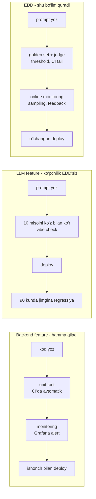
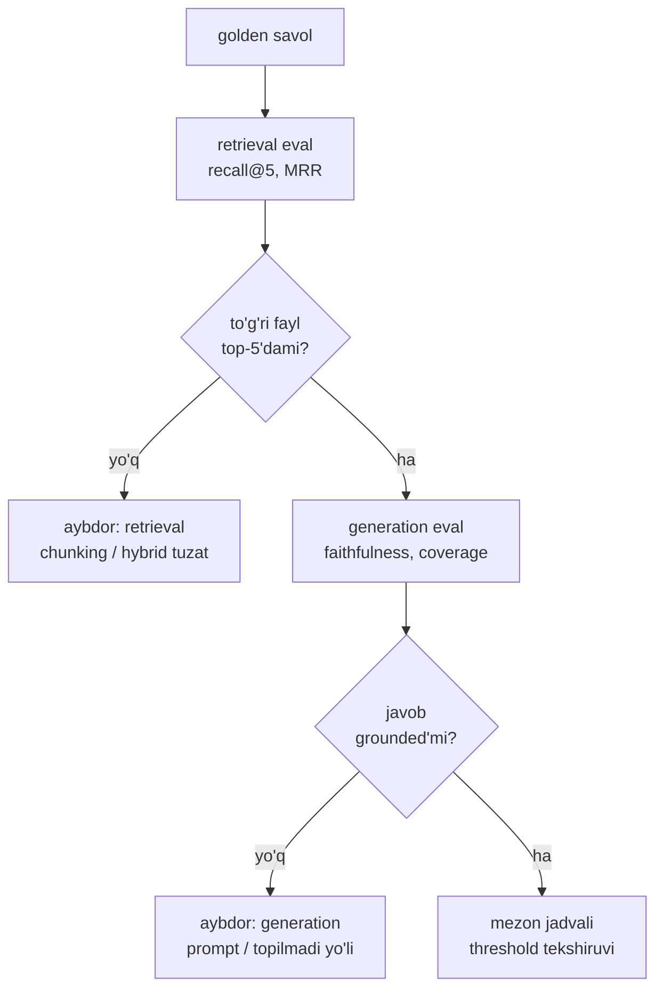

# 01. Nega eval — evaluation-driven development

> **Bu darsda:** LLM feature'ni "vibe check" bilan emas, o'lchov bilan ishga chiqarish falsafasini o'rnatamiz: evaluation-driven development (mezonlarni koddan oldin belgilash). Nega LLM baholash klassik testdan qiyin, exact vs subjective farqi, 4 mezon guruhi va eval pipeline'ni 3 qadamda dizayn qilish. Ishda bu — "LLM feature'ni qanday test qilasiz, regression'ni qanday ushlaysiz?" degan intervyu savoliga va production'ga chiqarish qaroriga to'g'ridan-to'g'ri javob.

## Nazariya (~30%)

### 1. Muammo: eval'siz LLM feature = testsiz merge + monitoringsiz deploy

Backend'da hech kim testsiz kodni master'ga merge qilmaydi va monitoringsiz servisni deploy qilmaydi. LLM feature'da esa ko'pchilik aynan shuni qiladi: 10 ta sevimli prompt'ni ko'z bilan sinaydi, "yaxshi ko'rinadi" deydi va ship qiladi. Bu **vibe check** — o'lchov emas, taassurot.

Bahosi qimmat. Real hodisalar (Huyen Ch3):

- **Air Canada** chatboti yolg'on qaytarish siyosatini to'qidi; sud kompaniyani chatbot aytgan pulni to'lashga majbur qildi.
- Advokatlar ChatGPT to'qigan sud ishlarini dalil sifatida topshirdi va jarima oldi.
- a16z so'rovi: 70 qaror qabul qiluvchidan atigi 6 tasi modelni o'lchangan eval bilan tanlagan; qolgani og'zaki mish-mish bilan.
- 2026 sanoat statistikasi: LLM app'larning ~40% birinchi 90 kunda sezilarli sifat regressiyasiga uchraydi — chunki nima yaxshilanib, nima buzilganini o'lchaydigan mexanizm yo'q.

Yechim nomi bor — **evaluation-driven development (EDD)**: mezonlarni kod yozishdan OLDIN aniqlash. Bu software'dagi test-driven development'ning to'g'ridan-to'g'ri analogi. TDD'da avval failing test yozasan, keyin uni yashil qiladigan kod. EDD'da avval "yaxshi javob" nima ekanini o'lchaydigan eval yozasan, keyin uni o'tkazadigan prompt/retrieval/model.

> Oltin qoida: eval'siz LLM feature — bu testsiz merge va monitoringsiz deploy, bir vaqtning o'zida. Eval bu bezak emas, bu sizning CI/CD'ingizning LLM qismidagi green/red signali.



### 2. Nega LLM eval klassik testdan qiyin — 5 sabab

Backend test'da `assert add(2, 2) == 4` — javob bitta, aniq. LLM'da bu ishlamaydi (Huyen Ch3):

1. **Model aqlliroq — baholash qiyinroq.** 1-sinf matematika xatosini hamma ko'radi; PhD darajadagi mulohaza xatosini tekshirish uchun mavzuni chuqur bilish kerak.
2. **Open-ended tabiat.** Klassifikatsiyada javoblar to'plami yopiq; ochiq generatsiyada to'g'ri javoblar cheksiz — kutilgan chiqishlar ro'yxatini tuzib bo'lmaydi.
3. **Black box.** Model ichi yopiq — faqat chiqish orqali baholay olasan.
4. **Benchmark'lar tez to'yinadi.** GLUE (2018) bir yilda SuperGLUE'ga; MMLU (2020) MMLU-Pro'ga. Benchmark ochilishi bilan foydasi kamayadi.
5. **Ko'lam kengaygan.** General-purpose model'da faqat ma'lum task'ni o'lchamaysan — yangi qobiliyatlarni ham kashf qilishing kerak.

Xulosa: universal metrika yo'q. Sizga app'ingizga xos, o'zingiz quradigan eval kerak — aynan shuni bu bo'lim o'rgatadi.

### 3. Exact vs subjective — ikki dunyo

Eval metodlari ikki lagerga bo'linadi. Bu farqni tushunmaslik eng ko'p uchraydigan boshlang'ich xato.

| | Exact evaluation | Subjective evaluation |
|---|---|---|
| Hukm | Aniq, baho beruvchiga bog'liq emas | Judge o'zgarsa ball o'zgaradi |
| Misollar | functional correctness (pass@k), exact match, similarity vs reference | AI judge (faithfulness, relevance) |
| Backend analogi | `assert result == expected` | code review — reviewer'ga bog'liq |
| Qachon | kod, math, text-to-SQL, aniq javobli | ochiq generatsiya, xulosa, RAG javobi |

**Functional correctness** — eng ishonchli exact metrika: tizim maqsadli funksiyani bajaradimi? Kod uchun bu **execution accuracy** — LeetCode uslubi: generatsiya qilingan kodni unit testlarga qo'yasan. Undan **pass@k** o'sadi: har masalaga k sample generatsiya qilinadi; birortasi HAMMA testdan o'tsa masala yechilgan. Kutilganidek pass@1 < pass@3 < pass@10 — ko'proq urinish, ko'proq imkoniyat. Buni amaliyotda qo'lda hisoblaymiz.

Subjective tarafda AI judge turadi — bu bo'limning yadrosi (03-dars). Hozircha bitta narsani yod tut: judge chiqargan raqam mutlaq haqiqat emas, o'lchov asbobining ko'rsatkichi — asbobni kalibrlash kerak.

### 4. 4 mezon guruhi va eval pipeline'ni 3 qadamda dizayn qilish

Huyen (Ch4) har LLM tizim uchun 4 mezon guruhini ajratadi. docqa (4-bo'lim savol-javob servisi) misolida:

| Guruh | Nima o'lchaydi | docqa'da |
|---|---|---|
| **Domain-specific** | Domenni tushunadimi | Hujjatdagi faktni to'g'ri topadimi |
| **Generation** | Chiqish sifati, faithfulness | Javob kontekstga tayanganmi, coverage |
| **Instruction-following** | Ko'rsatmaga amal qiladimi | "Topilmadi" desin deganda to'qimaydimi |
| **Cost & latency** | Qancha turadi, qancha kutasan | savol boshiga USD, p90 latency |

Eval pipeline'ni dizayn qilishning 3 qadami (Huyen Ch4 — bu bo'lim loyihasining ham skeleti):

1. **Har komponentni ALOHIDA bahola.** Resume-parser misoli: PDF->text (similarity bilan) va text->maydon (accuracy bilan) alohida o'lchanadi — aks holda qayer singanini bilmaysan. docqa'da bu 4-bo'limdan tanish diagnostika tartibi: avval retrieval (recall@5), keyin generation (faithfulness) — MISS bo'lsa aybdor retrieval, past coverage bo'lsa aybdor generation.
2. **Eval guideline yoz — eng muhim qadam.** Eng qiyini: "good" nima degani? **correct != good.** LinkedIn misoli: nomzodga "Siz bu ish uchun umuman mos emassiz" — texnik jihatdan to'g'ri, lekin foydasiz javob. Har mezonga scoring rubric + misollar; keyin biznes metrikaga bog'la: factual consistency 80% = ticketlarning 30%ini avtomatlash, 98% = 90%. Raqam biznesga ulanmasa, u shunchaki raqam.
3. **Metod va datani aniqla.** Har mezonga mos metod: toxicity — kichik classifier, relevance — semantic similarity, factual consistency — AI judge. **Mix-and-match:** arzon classifier 100% traffic'da + qimmat judge 1%da — ishonch va narx balansi.



### 5. Eval set qancha katta bo'lsin

"Nechta savol yetadi?" — bu savol OpenAI qoidasi bilan javob topadi: farqni 95% ishonch bilan ko'rish uchun kerakli sample farq kichraygan sari 10x oshadi.

| Ko'rmoqchi bo'lgan farq | Kerakli sample soni |
|---|---|
| 30% | ~10 |
| 10% | ~100 |
| 3% | ~1000 |
| 1% | ~10000 |

lm-evaluation-harness mediana 1000 misol ishlatadi. Lekin sizga necha kerakligini raqam emas, **bootstrap** aytadi: mavjud ballarni qayta-qayta o'rniga qo'yib resample qilasan; agar o'rtacha 90% dan 70% gacha sakrasa — set juda kichik. Buni amaliyotda kod bilan ko'ramiz.

## Amaliyot (~70%)

### Predict / Run: pass@k qo'lda

Avval bashorat qil: 5 masala, har biriga 10 sample generatsiya qildik. Bir masalada 10 tadan 3 tasi hamma testdan o'tdi. Agar shu masaladan k=3 sample tanlasak, kamida bittasi o'tishi ehtimoli qancha? Endi kodni o'qi — HumanEval aynan shu tarafsiz baholovchini ishlatadi.

```python
# pass_at_k.py — HumanEval uslubidagi pass@k qo'lda hisoblash
from math import comb

# --- 1-qadam: har masala uchun n=10 sample generatsiya qildik ---
# correct = HAMMA unit testdan o'tgan sample'lar soni (0..n)
N = 10
PROBLEMS = [
    {"id": "two_sum",         "correct": 10},   # oson: hamma sample o'tdi
    {"id": "merge_intervals", "correct": 3},    # o'rta
    {"id": "lru_cache",       "correct": 0},    # model umuman yecha olmadi
    {"id": "word_ladder",     "correct": 7},
    {"id": "median_streams",  "correct": 1},    # faqat 1 sample o'tdi
]

# --- 2-qadam: pass@k ning tarafsiz baholovchisi ---
# k sample tanlaganda kamida bittasi HAMMA testdan o'tish ehtimoli
def pass_at_k(n: int, c: int, k: int) -> float:
    if n - c < k:          # o'tmaganlar k dan kam -> albatta bittasi o'tadi
        return 1.0
    return 1.0 - comb(n - c, k) / comb(n, k)

# --- 3-qadam: butun suite bo'yicha o'rtacha ---
def suite_pass_at_k(problems: list[dict], k: int) -> float:
    scores = [pass_at_k(N, p["correct"], k) for p in problems]
    return sum(scores) / len(scores)

for k in (1, 3, 10):
    print(f"pass@{k:<2} = {suite_pass_at_k(PROBLEMS, k):.2f}")

# Output:
# pass@1  = 0.42
# pass@3  = 0.60
# pass@10 = 0.80
```

Nima bo'lyapti: pass@1 = har masala uchun `correct/n` ning o'rtachasi (0.42) — bitta urinishda o'rtacha muvaffaqiyat. pass@10 = agar 10 tadan bittasi to'g'ri bo'lsa masala yechilgan — `lru_cache` (0 to'g'ri) tashqari hamma yechildi, shuning uchun 0.80. Bu raqam **agent** yoki **best-of-N** strategiyasining qiymatini aynan o'lchaydi: ko'proq sample olsang, functional correctness qancha o'sadi. `if n - c < k` sharti chegara holatni ushlaydi — bu yerda `match/case` ishlatmadik, oddiy `if` (Python 3.9 mosligi).

### Investigate / Modify: docqa mezon jadvali va regression tekshiruvi

Endi Huyen Table 4-3 uslubidagi mezon jadvalini docqa uchun kodda yozamiz. Har mezon: metrika + threshold + yo'nalish. Bu — 06-dars loyihasidagi `regression.py` ning yadrosi.

```python
# criteria.py — docqa uchun eval mezon jadvali (Huyen Table 4-3 uslubi)
# Har mezon: metrika nomi + threshold + yo'nalish. Bu regression checker'ning yuragi.
CRITERIA = [
    {"name": "retrieval recall@5",   "metric": "recall_at_5",  "threshold": 0.75, "op": ">="},
    {"name": "faithfulness judge",   "metric": "faithfulness", "threshold": 0.90, "op": ">="},
    {"name": "answer relevance",     "metric": "relevance",    "threshold": 0.85, "op": ">="},
    {"name": "citations coverage",   "metric": "coverage",     "threshold": 0.70, "op": ">="},
    {"name": "cost savolga USD",     "metric": "cost_usd",     "threshold": 0.02, "op": "<="},
    {"name": "latency p90 soniya",   "metric": "latency_p90",  "threshold": 4.0,  "op": "<="},
]

def check(measured: dict) -> bool:
    all_pass = True
    for c in CRITERIA:
        got = measured[c["metric"]]
        if c["op"] == ">=":                 # match/case emas -> if/elif (3.9 mos)
            ok = got >= c["threshold"]
        else:
            ok = got <= c["threshold"]
        all_pass = all_pass and ok
        flag = "PASS" if ok else "FAIL"
        print(f"[{flag}] {c['name']:<22} {got:<7} chegara {c['op']} {c['threshold']}")
    return all_pass

# bugungi run natijasi (retrieval_eval + judge + report chiqishi — 06-dars harness)
today = {"recall_at_5": 0.80, "faithfulness": 0.93, "relevance": 0.88,
         "coverage": 0.71, "cost_usd": 0.014, "latency_p90": 3.6}

print("REGRESSION:", "PASS" if check(today) else "FAIL")

# Output:
# [PASS] retrieval recall@5     0.8     chegara >= 0.75
# [PASS] faithfulness judge     0.93    chegara >= 0.9
# [PASS] answer relevance       0.88    chegara >= 0.85
# [PASS] citations coverage     0.71    chegara >= 0.7
# [PASS] cost savolga USD       0.014   chegara <= 0.02
# [PASS] latency p90 soniya     3.6     chegara <= 4.0
# REGRESSION: PASS
```

Modify mashqi: `today` dagi `coverage` ni 0.71 dan 0.62 ga tushir va qayta ishga tushir. Nima kutasan?

<details>
<summary>Yechim</summary>

`coverage 0.62` uchun `0.62 >= 0.70` yolg'on -> `[FAIL] citations coverage`, va `all_pass` False bo'lgani uchun oxirida `REGRESSION: FAIL`. CI'da bu funksiya `return` qiymati exit code'ga aylanadi (`sys.exit(0 if check(...) else 1)`) — exit code 1 pipeline'ni qizil qiladi, xuddi failing pytest kabi. Aynan shu bitta FAIL production'ga chiqishni to'xtatadi: coverage tushdi degani javoblar manbaga kamroq bog'langan, ya'ni hallucination xavfi oshgan. Threshold binary emas, oraliq — 0.70 ni sen biznes talabidan tanlaysan (past coverage qancha ticket'ni xavf ostiga qo'yadi).
</details>

### Investigate / Modify: bootstrap bilan eval set yetarliligini tekshirish

10 savollik golden set'da recall@5 = 0.80 chiqdi. Bu raqamga ishonsa bo'ladimi? Bootstrap javob beradi: ballarni o'rniga qo'yib resample qilib, o'rtachaning ishonch oralig'ini chiqaramiz.

```python
# bootstrap.py — golden set yetarlicha kattami? Bitta raqamga ishonch oralig'i
import random

random.seed(42)

# 10 savol ustida recall@5 (1 = to'g'ri fayl top-5'da, 0 = yo'q)
recalls_10 = [1, 1, 0, 1, 1, 1, 0, 1, 1, 1]        # o'rtacha 0.80

def bootstrap_ci(scores: list[float], rounds: int = 2000) -> tuple[float, float]:
    n = len(scores)
    means = []
    for _ in range(rounds):
        sample = [random.choice(scores) for _ in range(n)]   # o'rniga qo'yib resample
        means.append(sum(sample) / n)
    means.sort()
    lo = means[int(0.05 * rounds)]     # 5-persentil
    hi = means[int(0.95 * rounds)]     # 95-persentil
    return lo, hi

lo, hi = bootstrap_ci(recalls_10)
print(f"n=10:  recall=0.80  90% CI = [{lo:.2f}, {hi:.2f}]")

# xuddi shu 0.80, lekin 100 savolda (80 hit / 20 miss)
recalls_100 = [1] * 80 + [0] * 20
lo, hi = bootstrap_ci(recalls_100)
print(f"n=100: recall=0.80  90% CI = [{lo:.2f}, {hi:.2f}]")

# Output:
# n=10:  recall=0.80  90% CI = [0.60, 1.00]
# n=100: recall=0.80  90% CI = [0.73, 0.87]
```

Xulosa ko'z oldida: ikkalasida ham o'rtacha 0.80, lekin 10 savolda ishonch oralig'i [0.60, 1.00] — deyarli hech narsa aytmaydi, sizning "0.80" bir savol o'zgarishi bilan 0.70 yoki 0.90 bo'lishi mumkin. 100 savolda [0.73, 0.87] — endi ikki prompt versiyasini solishtirsang, farq shovqin emasligiga ishonasan. **Qoida:** ikki run orasidagi farq CI kengligidan kichik bo'lsa, u farqqa ishonma — golden set'ni kattalashtir. Bu bevosita 02-darsga olib boradi: golden set qanday quriladi va o'sadi.

### Make: o'z loyihang uchun eval criteria + rubric yoz

`askops` (1-bo'lim CLI) yoki `quizgen` (test generator) loyihangni ol. Vazifa: uning uchun (a) 3-5 mezonli criteria jadvali (yuqoridagi `CRITERIA` formatida) va (b) bitta mezon uchun PASS/FAIL rubric — misollar bilan. Rubric "correct != good" tamoyilini aks ettirsin.

<details>
<summary>Yechim — quizgen uchun namuna</summary>

Criteria jadvali:

```python
QUIZGEN_CRITERIA = [
    {"name": "savol grounded",   "metric": "grounded_rate", "threshold": 0.95, "op": ">="},
    {"name": "distractor sifati","metric": "distractor_ok", "threshold": 0.85, "op": ">="},
    {"name": "yagona to'g'ri",   "metric": "single_answer", "threshold": 1.00, "op": ">="},
    {"name": "cost 10 savolga",  "metric": "cost_usd",      "threshold": 0.05, "op": "<="},
]
```

"distractor sifati" uchun PASS/FAIL rubric:

- **PASS** — noto'g'ri variantlar ishonarli va mavzuga tegishli, lekin aniq xato (masalan "goroutine" savolida "thread" — yaqin, ammo noto'g'ri).
- **FAIL** — distractor'lar aniq bema'ni ("banan", "5-payshanba") yoki bir nechtasi ayni paytda to'g'ri.

"correct != good" bu yerda: texnik jihatdan to'g'ri savol, lekin distractor'lari shunchalik bema'niki, sinaluvchi to'g'ri javobni bilmasa ham topadi — bu savol grounded (correct), lekin foydasiz (not good). Rubric aynan shu farqni ushlaydi.
</details>

## Retrieval practice

Javobsiz — o'zing eslab chiqar (spaced repetition uchun ertaga va 3 kundan keyin qayt).

1. "Evaluation-driven development" test-driven development'dan nimasi bilan farq qiladi va nimasi bilan bir xil?
2. Nega bitta universal "quality" metrikasi LLM uchun yetmaydi — Huyen'ning 5 sababidan kamida 3 tasini ayt.
3. Functional correctness (exact) va AI judge (subjective) o'rtasidagi asosiy farq nima — qaysi biri judge o'zgarganda ballni o'zgartiradi?
4. Eval pipeline'ni komponentlarga bo'lib baholash nega end-to-end bahodan yaxshiroq? docqa misolida MISS bo'lsa aybdorni qanday topasan?
5. "0.80 recall" degan raqamga qachon ishonasan, qachon yo'q — bootstrap qanday hal qiladi?

## Manbalar

- Huyen, "AI Engineering" — Ch3 Evaluation Methodology (nega qiyin, exact vs subjective, pass@k) va Ch4 Evaluate AI Systems (EDD, 4 mezon guruhi, pipeline 3 qadam, eval set hajmi).
- Iusztin & Labonne, "LLM Engineer's Handbook" — Ch7 Evaluating LLMs (benchmark = signal, haqiqat manbai emas).
- LLM testing guide (Langfuse): `https://langfuse.com/blog/2025-10-21-testing-llm-applications`
- CI/CD LLM evaluation guide: `https://latitude.so/blog/ultimate-ci-cd-llm-evaluation-guide`
- Anthropic token counting (cost estimate uchun): `https://platform.claude.com/docs/en/build-with-claude/token-counting`

---

Keyingi darsda "har mezonga golden set kerak" tezisini amalga oshiramiz: production failure'lardan silver->gold zinapoyagacha yashovchi dataset qanday quriladi.
