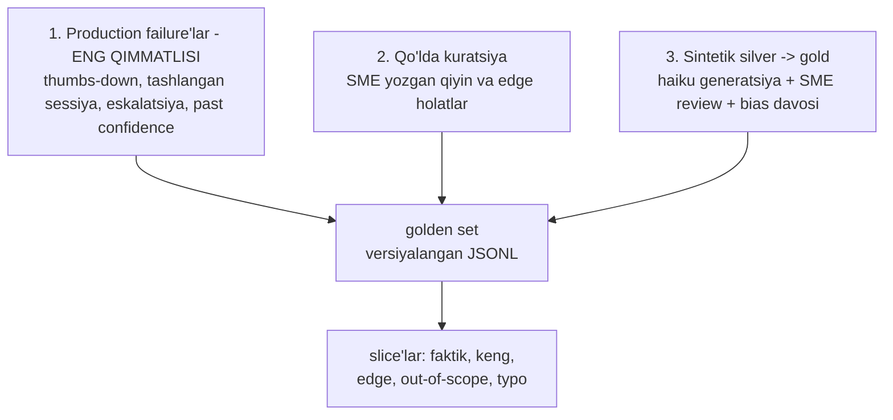

# 02. Golden dataset qurish

> **Bu darsda:** 4-bo'limdagi 10 savollik golden set'ni "yashovchi" datasetga aylantiramiz: manbalar piramidasi (production failure -> qo'lda kuratsiya -> sintetik silver->gold), sintetik generatsiya va uning bias'ini davolash, anotatsiya guideline, slicing va Simpson paradoksi, JSONL versiyalash. Ishda bu — regression test'ing nimaga qarab qizil bo'lishini belgilaydigan asos; golden set sifatsiz bo'lsa, undagi hamma metrika ham sifatsiz.

## Nazariya (~30%)

### 1. Muammo: 10 savollik golden set o'ladi

4-bo'limda docqa uchun `eval.py` yozgansan: 10 savol, har biriga qaysi fayl relevant, recall@5 va coverage chiqadi. Bu boshlang'ich uchun to'g'ri edi. Lekin u ikki sababdan o'ladi:

- **Qamrov tor.** 10 savol faqat "oson" holatlarni ushlaydi. Typo'li so'rov, korpusda javobi yo'q savol, ikki hujjatga tegishli savol — ularning hech biri sinovda yo'q. Production shu joylardan sinadi.
- **Muzlab qoladi.** Golden set bir marta yozilib, git'ga tashlanib unutiladi. Production'da yangi failure'lar paydo bo'ladi — golden set ularni bilmaydi, shuning uchun regression test ularni hech qachon ushlamaydi.

Yechim — golden set'ni **yashovchi hujjat** deb qarash: kod bilan birga versiyalanadi, production'dan failure'lar oqib keladi, slice'larga bo'linadi. Backend analogiyasi to'g'ridan-to'g'ri: golden files — snapshot test'laringning etaloni; bug topilsa, avval uni ushlaydigan test qo'shasan, keyin tuzatasan. Golden set — LLM feature'ning golden files'i.

> Oltin qoida: golden set bir marta quriladigan artefakt emas, doim o'sadigan test suite. Har production failure — regression test'ga aylanmagan bug.

### 2. Manbalar piramidasi: qayerdan savol olinadi

Golden set uch manbadan to'ldiriladi, sifat va narx bo'yicha tartibda:



- **Production failure'lar** — oltin. Ular real distribution'ni aks ettiradi va real og'riqni ko'rsatadi. Bu 04-darsdagi feedback loop'ning yadrosi: real shikoyat -> golden set'ga yozuv.
- **Qo'lda kuratsiya** — domen eksperti (SME, subject-matter expert) qiyin va edge holatlarni ataylab yozadi (ikki hujjatga tegishli savol, ziddiyatli fakt).
- **Sintetik** — eng arzon, eng past sifat: model hujjatdan savol generatsiya qiladi. Bu **silver** (xom); SME review yoki bias audit'dan o'tgach **gold** bo'ladi.

Konsensus (2026): bitta feature uchun 50-100 yaxshi tanlangan misol yetarli start — ~40-60 core + ~15-25 edge. Ming savol shart emas; sifatli 50 ta soxta 500 tadan yaxshi.

### 3. Sintetik generatsiya va uning bias'i

Sintetik savol yozish 1-bo'limdagi `quizgen` bilan bir xil mexanika: structured output (`messages.parse`) + arzon model (haiku) hujjatdan savol-javob juftini qaytaradi. Buni amaliyotda yozamiz.

Lekin tuzoq bor — buni 4-bo'limda o'lchagansan: **sintetik savol hujjatning leksikasini takrorlaydi.** Model "Goroutine — yengil ip" jumlasidan "Yengil ip nima?" degan savol yozadi; retrieval uni juda oson topadi, chunki savol va chunk bir xil so'zlardan iborat. Natijada recall sun'iy yuqori chiqadi — dataset o'zini aldaydi.

Uch davo:

1. **Paraphrase majburlash.** Prompt'da "hujjatning aynan so'zlarini takrorlama, real foydalanuvchidek tabiiy so'ra" deb yozasan.
2. **Real query aralashtirish.** Production log'idagi haqiqiy savollarni sintetiklarga qo'shasan — ular tabiiy leksik farqni olib keladi.
3. **SME review.** Odam sintetik savolni o'qib, "buni foydalanuvchi shunday so'ramaydi" deganini tashlaydi yoki qayta yozadi. Bu — silver'ni gold'ga ko'taruvchi qadam.

### 4. Anotatsiya guideline va inter-annotator agreement

Golden set'ga "to'g'ri javob" yorlig'ini qo'yadigan odamlar bir xil qoidaga amal qilishi kerak — aks holda dataset ichida ziddiyat bo'ladi. Buning uchun **anotatsiya guideline** yoziladi: har slice nima, "topilmadi" qachon to'g'ri javob, ikki fayl tegishli bo'lsa ikkalasi ham `relevant_files`ga kiradimi.

Guideline yaxshi ishlayotganini **inter-annotator agreement (IAA)** o'lchaydi: ikki odam bir xil 10 savolga mustaqil yorliq qo'yadi, nechtasida kelishishdi. 10 tadan 8 tasida bir xil desa — 80% raw agreement. Agreement past bo'lsa (masalan 60%), muammo odamda emas, guideline'da: u noaniq, qayta yozish kerak. (Tasodifiy kelishuvni hisobga oladigan Cohen's kappa ham bor, lekin start uchun oddiy % yetadi.)

### 5. Slicing va Simpson paradoksi

Bitta umumiy raqam — masalan "recall = 0.62" — aldaydi. Uni **slice'lar**ga bo'lib o'lchash kerak: til, savol turi (faktik / keng), edge, out-of-scope, typo. Slicing ikki narsani beradi: bias'ni fosh qiladi (uzun savollarda yomonmi?) va debug'ni yo'naltiradi (qaysi slice past?).

Eng xavfli holat — **Simpson paradoksi**: A varianti har slice'da B'dan yaxshi, lekin umumiy ballda yomon ko'rinadi. Bu ikki variant turli distribution'da sinalganda yuz beradi (masalan A ko'proq qiyin savollarga tushgan). Faqat umumiy raqamga qaragan odam noto'g'ri variantni tanlaydi. Buni amaliyotda raqam bilan ko'rsatamiz — bu darsda ko'z ochadigan lahza.

### 6. Versiyalash va "test setni leak qilma" qoidasi

Golden set — JSONL fayl, git'da kod bilan birga versiyalanadi. Har o'zgarish changelog bilan boradi:

```text
golden_v1.jsonl -> golden_v2.jsonl (2026-07)
+ 6 out-of-scope savol (production'da "topilmadi" yo'li sinardi)
+ 4 typo slice (real query log'idan)
~ q07 tuzatildi: relevant_files noto'g'ri fayl ko'rsatgan edi
- q03 o'chirildi: dublikat
```

Nega JSONL: har qator mustaqil yozuv, git diff toza ko'rinadi (bitta savol qo'shilsa bitta qator o'zgaradi), stream'lab o'qiladi. Nega versiya: judge yoki prompt o'zgarsa, `golden_v1` va `golden_v2` ballari taqqoslanmasligini bilishing kerak.

Qat'iy qoida: **golden savollarni prompt misollariga leak qilma.** Agar test savol prompt'ining few-shot misoliga kirsa, model uni yodlagan bo'ladi — eval o'zini aldaydi. Bu contamination'ning lokal versiyasi (05-darsda benchmark contamination sifatida qaytadi).

## Amaliyot (~70%)

### Predict / Run: JSONL sxema + loader/validator

Avval golden set'ning bir necha qatorini ko'r. Har qator bitta savol: `id`, `question`, ground truth fayllar (recall uchun), kutilgan faktlar (03-darsdagi faithfulness judge uchun) va `slice`.

```jsonl
{"id": "q01", "question": "Goroutine nima?", "relevant_files": ["/corpus/golang/concurrency.md"], "expected_facts": ["goroutine yengil ijro ipi", "runtime boshqaradi"], "slice": "faktik"}
{"id": "q02", "question": "Buferli va bufersiz channel farqi nimada?", "relevant_files": ["/corpus/golang/channels.md"], "expected_facts": ["bufersiz sinxron", "buferli sig'imga ega"], "slice": "keng"}
{"id": "q03", "question": "docqa Kubernetes'ni qanday deploy qiladi?", "relevant_files": [], "expected_facts": ["hujjatlarda yo'q"], "slice": "out-of-scope"}
```

Endi loader — u har qatorni sxemaga solib tekshiradi, `slice` ruxsat etilganmi va `id` takrorlanmaganmi nazorat qiladi. Bu harness'ga kirishdagi qalqon: buzuq golden set jimgina noto'g'ri metrika bermasin.

```python
# golden_schema.py — golden set yozuvi + JSONL loader/validator
import json
from pydantic import BaseModel, ValidationError

ALLOWED_SLICES = {"faktik", "keng", "edge", "out-of-scope", "typo"}

# --- 1-qadam: bitta golden yozuvning sxemasi ---
class GoldenItem(BaseModel):
    id: str
    question: str
    relevant_files: list[str]     # recall@k uchun ground truth
    expected_facts: list[str]     # faithfulness judge uchun (03-dars)
    slice: str

# --- 2-qadam: JSONL'ni qator-qator validatsiya bilan yuklash ---
def load_golden(path: str) -> list[GoldenItem]:
    items, seen = [], set()
    with open(path, encoding="utf-8") as f:
        for lineno, line in enumerate(f, 1):
            line = line.strip()
            if not line:
                continue
            try:
                item = GoldenItem.model_validate_json(line)
            except ValidationError as e:
                raise ValueError(f"{lineno}-qatorda sxema xatosi: {e}")
            if item.slice not in ALLOWED_SLICES:      # match/case emas — oddiy if
                raise ValueError(f"{lineno}-qator: noma'lum slice '{item.slice}'")
            if item.id in seen:
                raise ValueError(f"{lineno}-qator: takroriy id '{item.id}'")
            seen.add(item.id)
            items.append(item)
    return items

golden = load_golden("golden/golden_v1.jsonl")
print(f"yuklandi: {len(golden)} savol")
print("slice'lar:", sorted({g.slice for g in golden}))

# Output:
# yuklandi: 22 savol
# slice'lar: ['edge', 'faktik', 'keng', 'out-of-scope', 'typo']
```

Uch himoya diqqatga arziydi: sxema xatosi qator raqami bilan aytiladi (qaysi qatorni tuzatishni bilasan), noma'lum slice rad etiladi (typo'li slice nomi sekin bias kiritmaydi), takroriy `id` tutiladi (bitta savolni ikki marta hisoblab metrikani buzmaysan).

### Investigate / Modify: sintetik savol generatori

Endi silver savollarni yozamiz — haiku + `messages.parse`, xuddi quizgen'dagidek. Batches yo'q (u 04-darsda), oddiy loop.

```python
# synth_gen.py — hujjatdan sintetik savol-javob (silver) generatsiya
import anthropic
from pydantic import BaseModel
from dotenv import load_dotenv

load_dotenv()
client = anthropic.Anthropic()   # ANTHROPIC_API_KEY .env'dan

# --- 1-qadam: chiqish sxemasi (structured output) ---
class QAPair(BaseModel):
    question: str
    answer: str
    source_fact: str      # javob qaysi jumladan chiqdi (grounding uchun)

# --- 2-qadam: paraphrase majburlaydigan prompt (bias davosi) ---
GEN_PROMPT = """Sen eval dataset quruvchisan. Berilgan hujjat parchasidan
javobi parchada bor bitta aniq savol yoz. MUHIM: parchaning aynan so'zlarini
takrorlama — real foydalanuvchi so'raganidek, boshqa so'zlar bilan so'ra.

Hujjat parchasi:
{chunk}"""

def gen_one(chunk: str) -> QAPair:
    resp = client.messages.parse(
        model="claude-haiku-4-5",
        max_tokens=512,
        messages=[{"role": "user", "content": GEN_PROMPT.format(chunk=chunk)}],
        output_format=QAPair,
    )
    return resp.parsed_output

# --- 3-qadam: chunk'lar ustida oddiy loop ---
CHUNKS = [
    "Goroutine — Go runtime boshqaradigan yengil ijro ipi. 'go' kalit so'zi bilan ishga tushadi.",
    "Bufersiz channel jo'natish va qabulni sinxronlashtiradi: jo'natuvchi qabul qiluvchini kutadi.",
]

for i, chunk in enumerate(CHUNKS, 1):
    qa = gen_one(chunk)
    print(f"[{i}] Q: {qa.question}")
    print(f"    A: {qa.answer}")

# Output:
# [1] Q: Go'da yangi yengil ijro ipini qanday boshlash mumkin?
#     A: 'go' kalit so'zi bilan; uni Go runtime boshqaradi.
# [2] Q: Nega bufersiz channelga yozish qabul qiluvchi tayyor bo'lguncha kutadi?
#     A: Chunki bufersiz channel jo'natish va qabulni sinxronlashtiradi.
```

Diqqat: chiqqan savollar chunk'ning aynan so'zlarini takrorlamaydi ("yengil ijro ipi" -> "yangi yengil ijro ipini qanday boshlash") — paraphrase ko'rsatmasi ishladi. Bu hali **silver**: SME o'qib tasdiqlamaguncha golden'ga qo'shilmaydi. `source_fact` esa 03-darsdagi faithfulness judge uchun ground truth beradi.

Modify mashqi: bu skript sintetik bias'ni to'liq yo'qotmaydi. Uni kamaytirish uchun yana qanday ikki o'zgartirish kiritasan?

<details>
<summary>Yechim</summary>

1. **Real query aralashtirish.** `CHUNKS`dan tashqari, production log'idan olingan haqiqiy foydalanuvchi savollarini ham datasetga qo'shish — ular sintetik generatsiya ushlay olmaydigan tabiiy so'zlashuv va typo'larni olib keladi. Sintetik va real nisbatini (masalan 60/40) yozib qo'yasan.
2. **Silver/gold status maydoni.** `QAPair`ga `status: str` qo'shib, sintetiklarni `"silver"` deb belgilaysan; faqat SME review'dan o'tganini `"gold"` qilasan. Harness eval'da faqat gold'ni ishlatadi, silver'ni review navbatida ushlab turadi — bu silver->gold zinapoyasini kodda majburlaydi.
</details>

### Investigate / Modify: slice bo'yicha agregatsiya

Umumiy raqam qayerda muammo borligini yashiradi. Slice bo'yicha bo'lib ko'rsatadigan funksiya yozamiz — bu 06-dars `report.py` ning yadrosi.

```python
# slice_agg.py — slice bo'yicha o'rtacha ball (bias'ni fosh qiladi)
from collections import defaultdict

# har yozuv: eval natijasi + qaysi slice'ga tegishli
RESULTS = [
    {"id": "q1", "slice": "faktik",       "recall": 1.0},
    {"id": "q2", "slice": "faktik",       "recall": 1.0},
    {"id": "q3", "slice": "keng",         "recall": 1.0},
    {"id": "q4", "slice": "keng",         "recall": 0.0},
    {"id": "q5", "slice": "out-of-scope", "recall": 0.0},
    {"id": "q6", "slice": "out-of-scope", "recall": 1.0},   # "topilmadi" to'g'ri
    {"id": "q7", "slice": "typo",         "recall": 0.0},
    {"id": "q8", "slice": "typo",         "recall": 1.0},
]

def by_slice(results: list[dict], metric: str) -> tuple[dict, float]:
    buckets = defaultdict(list)
    for r in results:
        buckets[r["slice"]].append(r[metric])
    rows = {s: sum(v) / len(v) for s, v in buckets.items()}
    overall = sum(r[metric] for r in results) / len(results)
    return rows, overall

rows, overall = by_slice(RESULTS, "recall")
for s in sorted(rows):
    print(f"{s:<14} recall={rows[s]:.2f}")
print(f"{'UMUMIY':<14} recall={overall:.2f}")

# Output:
# faktik         recall=1.00
# keng           recall=0.50
# out-of-scope   recall=0.50
# typo           recall=0.50
# UMUMIY         recall=0.62
```

Umumiy 0.62 raqami "faktik" slice mukammal (1.00), qolgani esa 0.50 ekanini yashiradi. Slicing'siz sen umumiy 0.62 ni ko'rib chunking'ni tuzatishga urinasan — aslida faktik savollar zo'r ishlaydi, muammo out-of-scope va typo'da. Slice debug'ni to'g'ri joyga yo'naltiradi.

### Investigate / Modify: Simpson paradoksini kodda ko'rsatish

Endi eng xavfli holatni raqam bilan ko'ramiz. Ikki prompt versiyasi (A va B) turli traffic taqsimotida sinaldi — real production tuzog'i.

```python
# simpson.py — nega faqat umumiy ballga qarash aldaydi
# A ko'proq QIYIN savolga tushdi, B ko'proq OSON savolga (taqsimot farqli)
DATA = {
    #              (to'g'ri, jami) easy         (to'g'ri, jami) hard
    "A": {"easy": (9, 10),  "hard": (36, 90)},
    "B": {"easy": (77, 90), "hard": (3, 10)},
}

def rate(pair: tuple[int, int]) -> float:
    hit, total = pair
    return hit / total

for model in ("A", "B"):
    d = DATA[model]
    tot_hit = d["easy"][0] + d["hard"][0]
    tot_all = d["easy"][1] + d["hard"][1]
    print(f"{model}: easy={rate(d['easy']):.2f}  hard={rate(d['hard']):.2f}"
          f"  UMUMIY={tot_hit / tot_all:.2f}")

# Output:
# A: easy=0.90  hard=0.40  UMUMIY=0.45
# B: easy=0.86  hard=0.30  UMUMIY=0.80
```

Ko'z oldida paradoks: A **har slice'da** B'dan yaxshi (easy 0.90 > 0.86, hard 0.40 > 0.30), lekin UMUMIY ballda B yutadi (0.80 vs 0.45). Sabab — A savollarining 90% qiyin (90 hard / 10 easy), B'niki teskari. Faqat umumiy raqamga qaragan odam B'ni tanlaydi — noto'g'ri qaror. Davosi ikkita: (1) ikkala variantni **bir xil** golden set'da sinash; (2) natijani doim slice bo'yicha solishtirish, umumiyga ishonmaslik.

### Make: docqa golden setini 20+ savolga kengaytirish rejasi

4-bo'limdagi 10 savollik `eval.py` golden setini oling. Vazifa: uni 20+ savolli, versiyalangan `golden_v1.jsonl`ga aylantirish rejasini yozing — har slice uchun necha savol va manba (production / kuratsiya / sintetik). Yuqoridagi sxema (`GoldenItem`) formatida kamida 3 ta yangi yozuv ko'rsating.

<details>
<summary>Yechim — namuna reja</summary>

Slice taqsimoti (22 savol):

| Slice | Soni | Manba |
|---|---|---|
| faktik | 8 | 4 kuratsiya + 4 sintetik (SME review'dan o'tgan) |
| keng | 5 | kuratsiya (ikki hujjatga tegishli savollar) |
| edge | 3 | kuratsiya (ziddiyatli yoki noaniq savollar) |
| out-of-scope | 4 | kuratsiya ("topilmadi" javobi kutiladi) |
| typo | 2 | production log'idagi real typo'li so'rovlar |

Yangi yozuvlar (JSONL):

```jsonl
{"id": "q11", "question": "select nima uchun ishlatiladi?", "relevant_files": ["/corpus/golang/select.md"], "expected_facts": ["bir necha channelni kutadi"], "slice": "faktik"}
{"id": "q12", "question": "docqa narxi oyiga qancha?", "relevant_files": [], "expected_facts": ["hujjatlarda yo'q"], "slice": "out-of-scope"}
{"id": "q13", "question": "gorutine qanday toxtatiladi", "relevant_files": ["/corpus/golang/context.md"], "expected_facts": ["context bilan bekor qilinadi"], "slice": "typo"}
```

Diqqat: `q12` out-of-scope — `relevant_files` bo'sh, kutilgan javob "topilmadi"; bu docqa'ning "to'qima" himoyasini sinaydi. `q13` ataylab typo'li ("gorutine", "toxtatiladi") — real foydalanuvchi shunday yozadi, retrieval buni ham ushlashi kerak.
</details>

## Retrieval practice

Javobsiz — o'zing eslab chiqar.

1. Manbalar piramidasida nega production failure'lar sintetik savollardan qimmatliroq hisoblanadi?
2. Sintetik savol bias'i nima va uni kamaytiruvchi uch usulni ayt. Nega u recall'ni sun'iy yuqori chiqaradi?
3. "silver" va "gold" savol o'rtasidagi farq nima — silver'ni gold'ga qaysi qadam ko'taradi?
4. Simpson paradoksi qanday holatda yuzaga keladi va faqat umumiy ballga qaragan odam qanday xato qiladi?
5. Nega golden savolni prompt'ning few-shot misoliga qo'yish eval'ni buzadi — bu qaysi katta tushunchaning lokal versiyasi?

## Manbalar

- Huyen, "AI Engineering" — Ch4 Evaluate AI Systems (data slicing, Simpson paradoksi, eval guideline, dataset hajmi).
- Iusztin & Labonne, "LLM Engineer's Handbook" — Ch7 (sintetik test dataset, til-spesifik eval).
- Golden dataset qurish qo'llanmasi: `https://qaskills.sh/blog/golden-dataset-llm-evaluation-guide`
- Golden dataset step-by-step: `https://www.getmaxim.ai/articles/building-a-golden-dataset-for-ai-evaluation-a-step-by-step-guide/`
- Sintetik dataset validatsiyasi (Arize Phoenix): `https://phoenix.arize.com/creating-and-validating-synthetic-datasets-for-llm-evaluation-experimentation/`

---

Keyingi darsda golden set'dagi `expected_facts` ustida ishlaydigan asbobni quramiz: LLM-as-judge'ni qanday yozish, sinash va kalibrlash — bu bo'limning yadrosi.
