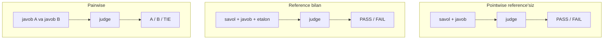
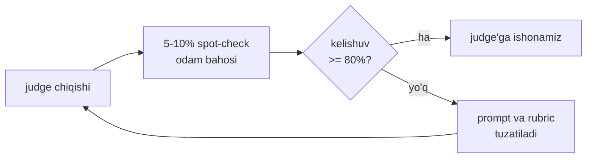

# 03. LLM-as-judge — chuqur

> **Bu darsda:** 4-bo'limda mini-faithfulness judge yozgan eding — bir marta ishlatib tashlagan. Endi judge'ni PRODUCTION asbob sifatida quramiz: `messages.parse` + Pydantic bilan PASS/FAIL, bias'larini raqam bilan o'lchaymiz, known-bad set bilan sindiramiz va odam bahosiga kalibrlaymiz. Ishda bu shu joyda kerak: prompt yoki model o'zgarganda "sifat tushdimi?" degan savolga ko'z bilan emas, avtomatik baholovchi bilan raqamli javob berish uchun. Intervyuda "LLM-as-judge qanday ishlaydi va qanday bias'lari bor?" degan savol shu darsning yuragi.

---

## Nazariya (~30%)

### Judge = kalibrlanmagan o'lchov asbobi

Tasavvur qil: yangi multimetr olding, u `4.7V` deb ko'rsatyapti. Raqam bor — lekin unga ishonasanmi? Etalon manba bilan solishtirmaguningcha multimetr yolg'on ham gapirishi mumkin. **LLM-as-judge** (bir model chiqargan javobni baholash uchun promptlangan boshqa model) aynan shunday asbob: PASS chiqaradi, lekin PASS'i to'g'rimi — buni tekshirmaguningcha bilmaysan.

Backend tilida: monitoring dashboard'ingda p99 latency grafigi yashil turibdi. Ammo metrikani noto'g'ri yig'san, yashil grafik yolg'on tinchlik beradi — real foydalanuvchi esa timeout ko'radi. Judge ham o'lchov asbobi, va **har o'lchov asbobi kabi kalibrlash talab qiladi**. Bu darsda kalibrlashsiz judge ishlatish — eng ko'p uchraydigan production xatosi ekanini raqam bilan ko'rsatamiz.

### Judge = model + prompt (+ config)

Bir jumlali ta'rif: **judge = qaysi model + qaysi prompt + qaysi sampling config**. Uchtasidan bittasi o'zgarsa — bu BOSHQA judge, va uning ballari eski judge ballari bilan taqqoslanmaydi.

Buni backend'dagi tashqi qora quti servisga o'xshat. Agar servis input/outputini ko'ra olmasang, uni test suite'ingga ishonchli qo'sha olmaysan — u indamay xulqini o'zgartirishi mumkin. Huyen buni qat'iy aytadi:

> **"Judge'ning modeli va promptini ko'ra olmasang — unga ishonma."** Judge versiyalanadi: prompt matni va model id har eval natijasi bilan birga loglanadi.

Amaliy oqibat: o'tgan oy judge `90%` degan edi, bu oy `92%` — bu YAXSHILANISH degani EMAS, agar oradan judge prompti o'zgargan bo'lsa. Trend faqat bir xil judge ustida ma'noli.

### Judge'ning 3 ishlatish rejimi

| Rejim | Kirish | Chiqish | Qachon ishlatiladi |
|---|---|---|---|
| **Pointwise, reference'siz** | savol + javob | PASS/FAIL yoki ball | production monitoring — ground truth yo'q |
| **Reference bilan** | savol + javob + etalon | PASS/FAIL | golden set bor, aniqroq baho kerak |
| **Pairwise** | javob A + javob B | A / B / TIE | model yoki prompt variantini solishtirish |



Pointwise reference'siz rejim eng qimmatlisi: production'da har savolga etalon javob yo'q, judge esa faqat kontekst va javobga qarab hukm chiqaradi. Pairwise esa model tanlashda ishlatiladi — buni 05-darsda ranking uchun ham qo'llaymiz.

### Judge prompt anatomiyasi va empirik qoidalar

Yaxshi judge prompti 4 qismdan iborat: **task ta'rifi** + **batafsil mezon** + **scoring system** + **misollar** (har ball uchun namuna). Huyen'ning empirik qoidalari (bularni kod bilan sinaymiz):

- **Klassifikatsiya sonli bahodan barqaror.** PASS/FAIL — `7/10` dan ishonchliroq, chunki model "7 mi 8 mi" degan chegarada tebranadi.
- **Diskret uzluksizdan yaxshi.** `1, 2, 3, 4, 5` — `0.0..1.0` dan barqaror.
- **Shkala kengaysa sifat tushadi.** `1-10` — `1-5` dan yomon; **binary (PASS/FAIL) eng barqaror**.
- **Explanation AVVAL, verdict KEYIN.** Model avval izohlaydi, keyin hukm chiqaradi — bu chain-of-thought effekti (1-bo'limda ko'rgan "think step by step"). Pydantic'da `explanation` fieldi `verdict`dan OLDIN turadi, chunki field tartibi = generatsiya tartibi.
- **Har mezonga alohida judge.** Faithfulness va relevance bitta promptga aralashtirilsa, signal loyqalanadi. Ikkita mezon = ikkita chaqiruv.

Misollar consistency'ni oshiradi (Zheng 2023: GPT-4 `65%` → `77.5%`), lekin prompt uzayadi — narx `~4x`. Bu trade-off: yuqori-stakes judge'ga misol qo'sh, arzon fon-judge'ga shart emas.

---

## Amaliyot (~70%)

Sozlash: `.env`da `ANTHROPIC_API_KEY`, `pip install anthropic pydantic python-dotenv`. Default judge — `claude-haiku-4-5` (arzon, klassifikatsion hukmga yetadi).

### Predict / Run

#### 1-blok — faithfulness PASS/FAIL judge

4-bo'limdagi mini-faithfulness "claim'larni sanaydigan" qo'lda kod edi. Endi uni Pydantic bilan bitta ishonchli funksiyaga aylantirami. `explanation` fieldi `verdict`dan OLDIN — CoT effekti uchun.

```python
# judge.py — javob faqat KONTEKSTga tayanganmi? PASS/FAIL faithfulness judge
import os
from anthropic import Anthropic
from pydantic import BaseModel
from dotenv import load_dotenv

load_dotenv()
client = Anthropic(api_key=os.environ["ANTHROPIC_API_KEY"])

JUDGE_VERSION = "faithfulness-v1"   # natija bilan birga loglanadi

class Verdict(BaseModel):
    explanation: str    # AVVAL izoh -> model o'ylaydi, keyin hukm chiqaradi (CoT)
    verdict: str        # "PASS" | "FAIL" -> klassifikatsiya sondan barqaror
    confidence: str     # "high" | "medium" | "low"

FAITHFULNESS_PROMPT = """Sen qat'iy faithfulness baholovchisiz. Vazifang: JAVOBdagi har bir
da'vo KONTEKSTda bevosita tasdiqlanganini tekshirish.

Qoidalar:
- Kontekstda yo'q fakt qo'shilgan bo'lsa -> FAIL, hatto fakt haqiqatda to'g'ri bo'lsa ham.
- Barcha da'volar kontekstdan kelib chiqsa -> PASS.
- Javob "Hujjatlarda topilmadi" bo'lsa va kontekst bo'sh bo'lsa -> PASS.

KONTEKST:
{context}

SAVOL: {question}
JAVOB: {answer}

Avval qaysi da'vo tasdiqlangan yoki tasdiqlanmaganini izohla, keyin verdict ber."""

def judge_faithfulness(question, answer, context):
    prompt = FAITHFULNESS_PROMPT.format(context=context, question=question, answer=answer)
    resp = client.messages.parse(
        model="claude-haiku-4-5",
        max_tokens=1024,
        messages=[{"role": "user", "content": prompt}],
        output_format=Verdict,
    )
    return resp.parsed_output   # validatsiyalangan Verdict obyekti
```

Ishga tushiramiz — bittasi grounded, bittasi hallucinated:

```python
ctx = "Buffersiz channel'da yuboruvchi qabul qiluvchi tayyor bo'lguncha kutadi."

grounded = judge_faithfulness(
    "Buffersiz channel qanday ishlaydi?",
    "Buffersiz channel'da yuboruvchi qabul qiluvchini kutadi, uzatish sinxron.",
    ctx)
print(grounded.verdict, "|", grounded.confidence)
print(grounded.explanation)
# Output:
# PASS | high
# Javobdagi ikkala da'vo -- yuboruvchi kutadi va uzatish sinxron -- kontekstdagi
# "qabul qiluvchi tayyor bo'lguncha kutadi" bilan bevosita tasdiqlanadi.

hallucinated = judge_faithfulness(
    "Buffersiz channel qanday ishlaydi?",
    "Buffersiz channel sinxron va buffered'dan 3 marta tez ishlaydi.",   # "3 marta tez" kontekstda YO'Q
    ctx)
print(hallucinated.verdict, "|", hallucinated.confidence)
# Output:
# FAIL | high
```

Diqqat: `messages.parse` JSON'ni o'zi validatsiya qildi — biz `resp.parsed_output`dan tayyor `Verdict` oldik. Judge JSON'ini `re`/`json.loads` bilan qazish — 4-bo'limdagi eski usul, endi anti-pattern. `regex bilan qazish` sinadigan joy: model bir kun `\`\`\`json` bilan o'rab qaytaradi, parser yiqiladi.

#### 2-blok — relevance judge (alohida mezon)

Faithfulness "grounded'mi" ni tekshiradi. Lekin javob grounded bo'lsa-yu, savolga umuman javob bermasa? LinkedIn'ning mashhur misoli: nomzodga "You are a terrible fit" — to'g'ri va grounded, lekin **correct != good**. Buning uchun ALOHIDA judge:

```python
# judge.py (davomi) -- relevance: javob SAVOLga to'g'ridan-to'g'ri javob beradimi?
REL_VERSION = "relevance-v1"

RELEVANCE_PROMPT = """Sen relevance baholovchisiz. JAVOB berilgan SAVOLga to'g'ridan-to'g'ri
javob beradimi?

Qoidalar:
- Savolga javob bermasa yoki mavzudan chetga chiqsa -> FAIL.
- Faktik to'g'riligini BAHOLAMA -- bu boshqa judge ishi. Faqat savolga mosligini bahola.
- To'g'ri lekin savolga aloqasiz javob -> FAIL.

SAVOL: {question}
JAVOB: {answer}

Avval izohla, keyin verdict ber."""

def judge_relevance(question, answer):
    prompt = RELEVANCE_PROMPT.format(question=question, answer=answer)
    resp = client.messages.parse(model="claude-haiku-4-5", max_tokens=512,
                                 messages=[{"role": "user", "content": prompt}],
                                 output_format=Verdict)
    return resp.parsed_output

r = judge_relevance("Mutex nima qiladi?", "Goroutine'lar OS thread'lariga M:N sxemada map qilinadi.")
print(r.verdict)   # javob mutex haqida emas, scheduler haqida
# Output:
# FAIL
```

Har mezon alohida chaqiruv = alohida signal. Uch mezon uchun `3x` API call — buni keyingi darsda Batches va spot-checking bilan arzonlashtitamiz.

#### 3-blok — consistency testi

temperature bermaymiz (u `400` beradi), lekin javob baribir probabilistik. Shuning uchun **bir xil input 2x hukm bir xilmi** — buni o'lchash kerak. Consistency != accuracy: judge izchil ravishda bir xil XATO qilishi ham mumkin.

```python
# consistency.py -- bir xil input N marta, hukm barqarormi?
from judge import judge_faithfulness

def consistency(question, answer, context, n=5):
    votes = [judge_faithfulness(question, answer, context).verdict for _ in range(n)]
    agree = votes.count(votes[0]) / n
    return votes, round(agree, 2)

ctx = "Buffersiz channel'da yuboruvchi qabul qiluvchi tayyor bo'lguncha kutadi."

# Aniq holat -- barqaror
print(consistency("Buffersiz channel-chi?",
                  "Yuboruvchi qabul qiluvchini kutadi.", ctx))
# Output:
# (['PASS', 'PASS', 'PASS', 'PASS', 'PASS'], 1.0)

# Chegaraviy (borderline) holat -- rubric aniq emas, judge ikkilanadi
print(consistency("Buffersiz channel-chi?",
                  "Yuboruvchi kutadi, bu odatda tez ishlaydi.", ctx))   # "tez" -- shubhali da'vo
# Output:
# (['PASS', 'FAIL', 'PASS', 'PASS', 'FAIL'], 0.6)
```

Ikkinchi natija muhim signal: `0.6` consistency = judge chegarada tebranmoqda, rubric'ni aniqlashtirish kerak (masalan "sifat baholovchi da'vo — 'tez' — kontekstda bo'lmasa FAIL").

> 🤔 **O'ylab ko'r:** Nega biz consistency'ni o'lchash uchun `temperature=0` qo'ymadik? Chunki `temperature` parametri Claude API'da `400` beradi (1-bo'limdan) — va u bo'lganida ham hardware-level nondeterminizm 100% takrorlanishni kafolatlamas edi. Shuning uchun consistency'ni O'LCHAYMIZ, kafolat kutmaymiz.

### Investigate / Modify — bias'larni raqam bilan tutish

Judge — model, model esa bias'li. Uchta eng ko'p uchraydigan bias'ni O'LCHAYMIZ va tuzatamiz.

#### Position bias — pairwise'da birinchi javob afzal

Pairwise judge'da model ko'pincha BIRINCHI ko'rsatilgan javobni afzal ko'radi (odamdagi recency bias'ning teskarisi). Buni sindiramiz: bitta tartibda so'rash = tanga tashlash bilan aralash signal.

```python
# pairwise.py -- qaysi javob yaxshi + position bias o'lchash
from anthropic import Anthropic
from pydantic import BaseModel
import os
from dotenv import load_dotenv

load_dotenv()
client = Anthropic(api_key=os.environ["ANTHROPIC_API_KEY"])

class Pref(BaseModel):
    explanation: str
    winner: str        # "A" | "B" | "TIE"

PAIR_PROMPT = """Ikki javobni solishtir. Qaysi biri SAVOLga yaxshiroq javob beradi?

SAVOL: {question}

Javob A:
{a}

Javob B:
{b}

Avval izohla, keyin winner: A, B yoki TIE."""

def judge_pair(question, a, b):
    prompt = PAIR_PROMPT.format(question=question, a=a, b=b)
    resp = client.messages.parse(model="claude-haiku-4-5", max_tokens=512,
                                 messages=[{"role": "user", "content": prompt}],
                                 output_format=Pref)
    return resp.parsed_output.winner
```

Endi eng muhim modifikatsiya — **swap bilan agregatlash**. Har juftni IKKI tartibda so'raymiz; faqat ikkala tartibda bir xil g'olib chiqsa — ishonamiz:

```python
# pairwise.py (davomi)
q = "Goroutine nima?"
ans_a = "Goroutine -- Go runtime boshqaradigan yengil ijro oqimi."
ans_b = "Goroutine -- Go runtime boshqaradigan yengil ijro oqimi."   # AYNAN bir xil javob!

# Bitta tartibda 10 marta (A doim birinchi) -- javoblar teng bo'lsa ham...
biased = [judge_pair(q, ans_a, ans_b) for _ in range(10)]
print("A doim 1-o'rin ->", biased.count("A"), "A |", biased.count("B"), "B |", biased.count("TIE"), "TIE")
# Output:
# A doim 1-o'rin -> 8 A | 0 B | 2 TIE   <- javob AYNI, lekin A yutdi -> POZITSIYA bias

def judge_pair_debiased(question, a, b):
    fwd = judge_pair(question, a, b)          # A birinchi
    rev = judge_pair(question, b, a)          # B birinchi -> natijani qayta A/B ga moslaymiz
    if rev == "A":
        rev = "B"
    elif rev == "B":
        rev = "A"
    if fwd == rev:
        return fwd            # ikkala tartibda bir xil -> ishonchli
    return "TIE"              # tartib o'zgarganda fikr o'zgardi -> ajratib bo'lmaydi

debiased = [judge_pair_debiased(q, ans_a, ans_b) for _ in range(10)]
print("Swap bilan ->", debiased.count("A"), "A |", debiased.count("B"), "B |", debiased.count("TIE"), "TIE")
# Output:
# Swap bilan -> 0 A | 0 B | 10 TIE   <- aynan bir xil javob endi to'g'ri TIE
```

`8 A` dan `10 TIE` ga — bu position bias'ning to'liq yo'qolishi. 2026 konsensusi: **pairwise judge production'da HAR DOIM ikkala tartibda chaqiriladi**, bu ixtiyoriy emas. 05-darsda model ranking'ida aynan `judge_pair_debiased`dan foydalanamiz.

#### Verbosity bias — uzun javob afzal

Judge uzunroq javobni sifatliroq deb o'ylaydi (GPT-4/Claude/PaLM-2 judge'larda `15-30` ballik inflatsiya o'lchangan; Wu & Aji: faktik XATO uzun javob to'g'ri qisqadan yuqori ball olgan). O'lchaymiz — bir xil MAZMUN, faqat uzunlik farqi:

```python
# verbosity.py -- bir xil fakt, farqi faqat uzunlik
short = "Mutex bir vaqtda faqat bitta goroutine'ni kritik bo'limga kiritadi."
padded = ("Mutex, ya'ni mutual exclusion lock, konkurent dasturlashda nihoyatda muhim "
          "sinxronizatsiya vositasi bo'lib, umuman olganda, aynan bir vaqtning o'zida "
          "faqat va faqat bitta goroutine'ning kritik bo'limga kirishiga imkon beradi va "
          "shu tariqa data race'larning oldini oladi hamda hokazo.")   # 4x uzun, YANGI ma'lumot yo'q

q = "Mutex nima qiladi?"
res = [judge_pair_debiased(q, short, padded) for _ in range(10)]   # short=A, padded=B
print("qisqa:", res.count("A"), "| uzun:", res.count("B"), "| teng:", res.count("TIE"))
# Output:
# qisqa: 1 | uzun: 6 | teng: 3   <- bir xil mazmun, lekin UZUN javob afzal -> verbosity bias
```

Tuzatish — **length-aware rubric**: promptga ochiq qoida qo'shamiz.

```python
# verbosity.py (davomi) -- promptga uzunlik qoidasini qo'shamiz
PAIR_PROMPT_LEN = PAIR_PROMPT + """

MUHIM QOIDA: Uzunlik sifat EMAS. Ortiqcha so'z, takror va "suv" qo'shilgan javobni jazola.
Bir xil ma'lumotni qisqaroq va aniqroq bergan javob afzal."""

def judge_pair_len(question, a, b):
    resp = client.messages.parse(model="claude-haiku-4-5", max_tokens=512,
        messages=[{"role": "user", "content": PAIR_PROMPT_LEN.format(question=question, a=a, b=b)}],
        output_format=Pref)
    return resp.parsed_output.winner

# judge_pair_debiased ichida judge_pair o'rniga judge_pair_len ishlatilsa:
# Output:
# qisqa: 4 | uzun: 2 | teng: 4   <- bias sezilarli kamaydi
```

#### Self-preference bias — model o'z oilasini yaxshi ko'radi

Bu bias'ni bitta model bilan o'lchab bo'lmaydi — kontsept bo'yicha bilish kerak. Model o'z oilasi chiqargan javobni yuqori baholaydi: **Zheng 2023 — GPT-4 o'z javobiga `+10%`, Claude-v1 `+25%` win rate qo'shgan**. Sabab: model o'z stilistik "iz"ini taniydi va afzal ko'radi.

Yechim — **cross-family**: generator va judge boshqa oiladan bo'lsin. Yuqori-stakes launch'da 3 oiladan 3 judge ansambli (majority vote) ishlatiladi. Bizning kursda ham eslatma: agar docqa javoblarini `claude-opus-4-8` yozib, judge ham `claude-*` bo'lsa — bu o'z-o'zini baholash xatari; shuning uchun kalibrlash qatlami (pastda) MAJBURIY bo'lib qoladi.

### Kalibrlash — judge'ga qachon ishonasan?

#### known-bad set — judge sinovdan o'tadimi?

Kalibrlashning eng arzon usuli: ataylab BUZILGAN javoblar to'plami tuzasan, har biriga KUTILGAN verdict yozasan, judge ularni tutadimi tekshirasan. Bu pytest fixture'ga o'xshaydi — ma'lum yomon inputlar ma'lum natija berishi kerak.

```python
# calibrate.py -- known-bad set: judge ataylab buzilgan javoblarni tutadimi?
from judge import judge_faithfulness

CTX = "Buffersiz channel'da yuboruvchi qabul qiluvchi tayyor bo'lguncha kutadi."

KNOWN_BAD = [
    # javob buzilgan -> KUTILGAN verdict FAIL bo'lishi kerak
    {"q": "Buffersiz channel-chi?", "a": "Buffersiz channel 2 GB RAM band qiladi.",
     "ctx": CTX, "want": "FAIL"},                                  # kontekstda yo'q raqam
    {"q": "Buffersiz channel-chi?", "a": "Buffersiz channel hech qachon bloklamaydi.",
     "ctx": CTX, "want": "FAIL"},                                  # kontekstga ZID
    {"q": "Buffersiz channel-chi?", "a": "Mutex bir goroutine'ni kiritadi.",
     "ctx": CTX, "want": "FAIL"},                                  # butunlay boshqa mavzu
    # javob to'g'ri -> KUTILGAN verdict PASS
    {"q": "Buffersiz channel-chi?", "a": "Yuboruvchi qabul qiluvchini kutadi.",
     "ctx": CTX, "want": "PASS"},
]

def evaluate_judge(cases):
    correct = 0
    for c in cases:
        v = judge_faithfulness(c["q"], c["a"], c["ctx"])
        ok = v.verdict == c["want"]
        correct += int(ok)
        if not ok:
            print("MISS:", c["a"][:40], "-> judge:", v.verdict, "| want:", c["want"])
    return round(correct / len(cases), 2)

print("Judge aniqligi known-bad ustida:", evaluate_judge(KNOWN_BAD))
# Output:
# MISS: Buffersiz channel hech qachon bloklamaydi. -> judge: PASS | want: FAIL
# Judge aniqligi known-bad ustida: 0.75
```

`MISS` qatori — oltin. Judge kontekstga ZID da'voni o'tkazib yubordi. Bu prompt'ni tuzatish signali: qoidaga "kontekstga zid da'vo ham FAIL" qo'shiladi va known-bad set qayta yugurtiriladi. Bu — judge uchun regression test.

#### Human spot-check — kelishuv foizi

Judge production'da ishlagach, `5-10%` javobni ODAM ham baholaydi va kelishuvni o'lchaydi. Bu MINIMAL qavat, ixtiyoriy emas.

```python
# agreement.py -- judge vs odam bahosi kelishuvi
human = ["PASS", "FAIL", "PASS", "PASS", "FAIL", "PASS", "FAIL", "PASS", "PASS", "FAIL"]
judge = ["PASS", "FAIL", "PASS", "FAIL", "FAIL", "PASS", "FAIL", "PASS", "PASS", "PASS"]

agree = sum(int(h == j) for h, j in zip(human, judge)) / len(human)
print("Kelishuv:", round(agree * 100), "%")
# Output:
# Kelishuv: 80 %
```

`80%` kelishuv — judge foydalanish mumkin degani, lekin har `5` hukmning bittasi odamdan farq qiladi. Eslatma: oddiy foiz bir kamchilikka ega — tasodifiy mos kelishlarni ham hisoblaydi. Ilmiy usul — **Cohen's kappa** (tasodifga tuzatilgan kelishuv), lekin start uchun oddiy foiz yetadi; nomini bilib qo'y, kerak bo'lganda o'tasan.



#### "Judge 0.9 dedi — ishonaymi?" — Ragas ~0.55 konteksti

Intervyu savoli: *"Faithfulness judge `0.9` dedi — bu raqamga qachon ishonasiz?"* Javob: **kalibrlashdan keyin, o'z datasetingda.**

Buni jonli raqam bilan ko'rsatadigan misol bor. Ragas (tayyor RAG eval kutubxonasi — biz ishlatmaymiz, faqat ibrat) o'z paper'ida WikiEval datasetida faithfulness'ning odam bilan `0.95` kelishuvini report qilgan. Lekin Beatrust jamoasi O'Z production datasetida o'lchaganda kelishuv garmonik o'rtachasi eng yaxshi holatda `~0.55` chiqqan.

> **Oltin qoida:** Judge'ning kelishuv raqami universal EMAS — u datasetga va domenga qattiq bog'liq. Boshqa birovning `0.95` iga suyanma; O'Z golden set'ingda kalibrla.

### Haiku vs opus judge — trade-off

| | `claude-haiku-4-5` | `claude-opus-4-8` |
|---|---|---|
| Narx (1M token) | `$1` / `$5` | `$5` / `$25` |
| Nisbiy narx | `1x` | `~5x` |
| Klassifikatsion PASS/FAIL | yetarli | ortiqcha |
| Murakkab rubrikali hukm | tebranishi mumkin | barqaror |
| Kalibrlash / spot-check qavati | zaif | kuchli |

**Mix-and-match** strategiyasi (Huyen): arzon haiku judge `100%` traffic'ni baholaydi, qimmat opus judge `1%` spot-check'ni tekshiradi. Bu narx va ishonch balansi. Bizning harness (06-dars) aynan shu sxemani quradi.

### Specialized judge'lar — qisqacha landshaft

Umumiy LLM-judge yagona yo'l emas. Kichik ixtisoslashgan judge katta umumiy judge'dan tez, arzon va ba'zan ishonchliroq (kontsept sifatida, kodsiz):

- **Reward model** — `(prompt, response) -> 0..1` ball beruvchi kichik model (masalan Cappy, 360M param).
- **Reference-based judge** — etalon javob bilan solishtiradi (BLEURT, Prometheus).
- **Preference model** — `(prompt, r1, r2) -> qaysi yaxshi` (PandaLM, JudgeLM).

Bu yo'nalishni bilib qo'y: ba'zan `184M` parametrli maxsus classifier katta LLM-judge o'rnini bosadi va `10x` arzonlashtiradi.

### Make — o'z judge'ingni sindirib ko'r

**Topshiriq:** yuqoridagi `judge_faithfulness`ni O'Z known-bad set'ing bilan sindirib ko'r.

1. Kamida 6 ta buzilgan javob yoz: 2 tasi "kontekstda yo'q fakt", 2 tasi "kontekstga zid", 2 tasi "boshqa mavzu". Har biriga `want: "FAIL"`.
2. `evaluate_judge`ni yugurtir. Judge nechta MISS qildi?
3. MISS qilgan kategoriyani prompt qoidalariga aniq qo'shib qayta yugurtir.
4. Aniqlik oshdimi? Bir kategoriya MISS'i tuzatilganda boshqasi buzildimi (regression)?

<details>
<summary>Yechim yo'nalishi</summary>

Eng ko'p MISS "kontekstga zid" kategoriyasida chiqadi — chunki v1 prompt "kontekstda yo'q fakt" haqida gapiradi, "zid" haqida emas. Tuzatish: qoidalarga aniq qator qo'shiladi:

```python
FAITHFULNESS_PROMPT_V2 = FAITHFULNESS_PROMPT.replace(
    "- Barcha da'volar",
    "- Kontekstga ZID da'vo (kontekst aksini aytsa) -> FAIL.\n- Barcha da'volar")
JUDGE_VERSION = "faithfulness-v2"   # versiya YANGILANADI -> baseline qayta o'lchanadi
```

MUHIM: judge prompt o'zgardi = BOSHQA judge. `JUDGE_VERSION`ni yangila va eski ballarni bu bilan solishtirma. Ba'zan bir kategoriyani qattiqlashtirsang, judge boshqa joyda haddan ziyod qattiq bo'lib PASS'larni FAIL qiladi — shuning uchun known-bad set'da PASS misollar ham bo'lishi SHART. Bu — judge'ni o'zini regression testga solish.
</details>

---

## Retrieval practice

1. Judge prompti bir xil, lekin model `haiku`dan `opus`ga o'zgardi. O'tgan hafta `88%` faithfulness edi, bu hafta `91%`. Bu yaxshilanishmi? Nega?
2. Pairwise judge'ni faqat bitta tartibda chaqirsang, ikkita AYNI javob berilganda natija qanday bo'ladi va bu nimani anglatadi?
3. Nega Pydantic modelda `explanation` fieldi `verdict`dan OLDIN turadi? Tartib almashtirilsa sifatga nima bo'ladi?
4. known-bad set'da faqat FAIL misollar bo'lsa, judge'ni qattiqlashtirganda qanday xatoni sezmay qolasan?
5. Ragas WikiEval'da `0.95`, Beatrust production'da `0.55` — bir xil metrika, nega raqam farq qiladi? Bundan qanday amaliy xulosa chiqadi?

---

## Manbalar

- Huyen, *AI Engineering*, Ch3 — "AI as a Judge" (p.159–171): judge = model + prompt, 3 rejim, scoring qoidalari, bias'lar.
- Handbook, *LLM Engineer's Handbook*, Ch7 — judge prompt namunasi (Explanation → rating tartibi), bias ro'yxati.
- Anthropic — Structured outputs (`messages.parse`, `parsed_output`): `https://platform.claude.com/docs/en/build-with-claude/structured-outputs`
- LLM-as-judge 2026 best practices: `https://futureagi.com/blog/llm-as-judge-best-practices-2026`
- Judge bias mitigatsiyasi (position, verbosity, self-preference): `https://futureagi.com/blog/evaluating-llm-judge-bias-mitigation-2026/`
- Self-preference bias tadqiqoti: `https://arxiv.org/pdf/2410.21819`
- Ragas–inson korrelyatsiyasi (Beatrust, `~0.55` konteksti): `https://tech.beatrust.com/entry/2024/05/02/RAG_Evaluation:_Assessing_the_Usefulness_of_Ragas`

---

Judge'ni yozdik, sindirdik va kalibrladik — endi uni yolg'iz emas, butun eval pipeline ichida ishlatish kerak: keyingi darsda shu judge'ni golden set ustida yugurtirib, `baseline.json` bilan solishtiradigan **regression test** quramiz va uni CI'ga ulaymiz.
