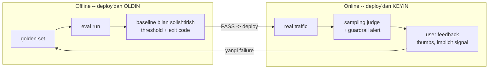

# 04. Offline va online eval — regression testing va CI

> **Bu darsda:** 03-darsda judge yozdik va kalibrladik. Endi uni yolg'iz emas, butun eval pipeline ichida ishlatamiz: golden set ustida run qilib `baseline.json` bilan solishtiradigan **regression test** quramiz, uni GitHub Actions'ga ulaymiz, eval run'ini **Batches API** bilan `50%` arzonlashtiramiz va deploy'dan keyingi **online monitoring** (sampling judge, feedback loop) ni qo'shamiz. Ishda bu shu joyda kerak: prompt/model/retrieval o'zgarganda CI'ning o'zi "sifat tushdi" deb PR'ni bloklaydi — xuddi `pytest` yiqilib merge'ni to'xtatgani kabi. Intervyu savoli: "LLM feature'ni qanday test qilasiz va regression'ni qanday ushlaysiz?" — javob shu darsda.

---

## Nazariya (~30%)

### Offline vs online — ikkita himoya qatlami

Backend'da sen ikki xil xavfsizlikni bilasan: **deploy'dan oldin** test suite (CI) va **deploy'dan keyin** monitoring/alerting. LLM eval'da ham aynan shunday ikki qatlam bor.

- **Offline eval** — kuratsiyalangan golden set (02-dars) ustida, deploy'dan OLDIN. Takrorlanadi, versiyalar solishtiriladi, debug oson. Bu = `pytest` suite'ing.
- **Online eval** — real traffic ustida, deploy'dan KEYIN. A/B testing, user feedback, real-time monitoring. Bu = production dashboard'ing.

Ular bir-birini almashtirmaydi, TO'LDIRADI: **offline ma'lum failure'larni deploy'dan oldin tutadi; online yangi failure va distribution drift'ni tutadi** — offline golden set hech qachon ko'rmagan real savollar oqib keladi.



Diqqat: pastdagi `FB -> GS` strelkasi — bu **feedback loop**. Production'dagi failure golden set'ga qaytib qo'shiladi, golden set "yashovchi hujjat" (02-dars) bo'lib qoladi. Bu darsning kodida shu halqani yopamiz.

### Regression testing = pytest + golden files

Backend'da **golden file testing** ni bilasan: funksiya chiqishini "tasdiqlangan etalon fayl" bilan solishtirasan, farq bo'lsa test yiqiladi. LLM regression testing aynan shu, faqat "etalon fayl" o'rniga `baseline.json` (qabul qilingan ballar), "farq" o'rniga esa threshold.

Oqim to'g'ridan-to'g'ri: golden set ustida run -> ballar -> `baseline.json` bilan solishtirish -> threshold -> exit code. `exit code 1` = CI PR'ni bloklaydi.

> **Oltin qoida:** LLM ballari flaky — shuning uchun assert BINARY emas, TOLERANSLI bo'ladi. `recall == 0.85` emas, `recall >= baseline - 0.02`. Judge metrikalarida tolerans kattaroq (probabilistik), retrieval metrikalarida kichikroq (deterministik).

Bu — eng ko'p uchraydigan xato #1 ning davosi: "vibe-check bilan ship qilish" (10 ta sevimli promptni ko'z bilan ko'rish). Ko'z regression'ni ushlamaydi — `baseline.json` ushlaydi.

### A/B testing vs comparative eval — adashtirma

Ikkalasi ham "ikki variant"ni solishtiradi, lekin butunlay boshqa narsa:

| | A/B testing | Comparative eval |
|---|---|---|
| Foydalanuvchi ko'radi | BITTA variant (traffic split) | IKKALA javobni birga |
| Metrika | biznes-signal: thumbs, retention, eskalatsiya | qaysi javob yaxshi (preference) |
| Qayerda | production, real traffic | offline yoki pairwise judge (03-dars) |
| Nima o'lchaydi | real ta'sir | nisbiy sifat |

Muhim tuzoq: **preference != correctness**. "Telefon radiatsiyasi o'smaga olib keladimi?" — bunga ovoz berish bilan javob topilmaydi; foydalanuvchi bilmagani uchun so'ragan. Faktik savollarni comparative eval bilan hal qilib bo'lmaydi.

### User feedback — explicit vs implicit

Online'da eng arzon signal — foydalanuvchining o'zi:

| Tur | Misol | Kuchli tomoni |
|---|---|---|
| **Explicit** | thumbs up/down, 1-5 rating | aniq, lekin kam odam bosadi |
| **Implicit** | regenerate bosish, suhbatni tashlash, copy-paste qilish | ko'p, lekin shovqinli |

Odam bahosi — North Star: LinkedIn kuniga `500` gacha suhbatni QO'LDA ko'rgan. Judge avtomatlashtiradi, lekin oxirgi haqiqat manbai — odam.

---

## Amaliyot (~70%)

Sozlash: `.env`da `ANTHROPIC_API_KEY`, `pip install anthropic pydantic python-dotenv httpx`. `judge.py` — 03-darsdan (`judge_faithfulness`, `judge_relevance`, `JUDGE_VERSION`). docqa `http://localhost:8000` da (4-bo'lim loyihasi).

### Predict / Run

#### 1-blok — golden set ustida to'liq run

Judge'ni har savolga alohida chaqirish o'rniga, butun golden set ustida yugurtirib agregat ball chiqaramiz. `/ask` javobidagi `citations` — bu judge uchun kontekst (4-bo'lim: coverage cited_text ustida).

```python
# run_eval.py -- golden set ustida run -> results/<ts>.json
import json, time, httpx
from judge import judge_faithfulness, judge_relevance, JUDGE_VERSION

DOCQA_URL = "http://localhost:8000"

def load_golden(path):
    with open(path) as f:
        return [json.loads(line) for line in f if line.strip()]

def run_one(item):
    r = httpx.post(f"{DOCQA_URL}/ask", json={"question": item["question"]}, timeout=60).json()
    context = " ".join(s["cited_text"] for s in r["sources"])   # citations = grounded kontekst
    faith = judge_faithfulness(item["question"], r["answer"], context).verdict == "PASS"
    rel = judge_relevance(item["question"], r["answer"]).verdict == "PASS"
    return {"id": item["id"], "faithful": faith, "relevant": rel, "slice": item["slice"]}

def aggregate(rows):
    n = len(rows)
    return {"faithfulness": round(sum(r["faithful"] for r in rows) / n, 3),
            "relevance":    round(sum(r["relevant"] for r in rows) / n, 3)}

golden = load_golden("golden/golden_v1.jsonl")
rows = [run_one(it) for it in golden]
ts = time.strftime("%Y%m%dT%H%M%S")
out = {"judge_version": JUDGE_VERSION, "ts": ts, "scores": aggregate(rows), "rows": rows}
json.dump(out, open(f"results/{ts}.json", "w"), ensure_ascii=False, indent=2)
print(out["scores"])
# Output:
# {'faithfulness': 0.9, 'relevance': 0.95}
```

`judge_version` natija bilan birga yozildi (03-dars qoidasi: judge o'zgarsa ballar taqqoslanmaydi). Eslatma: `recall@5` bu yerda yo'q — u `retrieval_eval.py` da `/search` orqali hisoblanadi (4-bo'lim funksiyalari), va u ham `baseline.json`ga kiradi.

#### 2-blok — baseline.json va regression checker

`baseline.json` — bu "tasdiqlangan etalon", git'da versiyalanadi. Yangi run uni QONDIRISHI kerak, aks holda `exit code 1`.

```json
// baseline.json -- qabul qilingan etalon ballar (git'da)
{
  "judge_version": "faithfulness-v1",
  "scores": { "faithfulness": 0.91, "relevance": 0.93, "recall@5": 0.85 }
}
```

```python
# regression.py -- current vs baseline -> PASS/FAIL + exit code (CI uchun)
import json, sys

# har metrika uchun ruxsat etilgan pasayish (tolerans). judge -> kattaroq (flaky),
# retrieval -> kichikroq (deterministik)
TOLERANCE = {"faithfulness": 0.03, "relevance": 0.03, "recall@5": 0.02}

def check_regression(current, baseline):
    failed = []
    for metric, tol in TOLERANCE.items():
        cur, base = current[metric], baseline[metric]
        drop = base - cur
        status = "FAIL" if drop > tol else "PASS"
        print(f"{metric:14} baseline={base:.3f} current={cur:.3f} drop={drop:+.3f} [{status}]")
        if status == "FAIL":
            failed.append(metric)
    return failed

if __name__ == "__main__":
    current = json.load(open("results/latest.json"))["scores"]
    baseline = json.load(open("baseline.json"))["scores"]
    failed = check_regression(current, baseline)
    if failed:
        print("REGRESSION:", ", ".join(failed))
        sys.exit(1)          # CI PR'ni bloklaydi
    print("OK")
    sys.exit(0)
# Output:
# faithfulness   baseline=0.910 current=0.895 drop=+0.015 [PASS]
# relevance      baseline=0.930 current=0.900 drop=+0.030 [PASS]
# recall@5       baseline=0.850 current=0.780 drop=+0.070 [FAIL]
# REGRESSION: recall@5
# (exit code 1)
```

`recall@5` `0.85` -> `0.78` tushdi (`0.07` > `0.02` tolerans) — CI yiqildi. `faithfulness` `0.03` tushdi lekin toleransga sig'di (`0.03` chegara), PASS. Bu — flakiness'ni yutish: judge ballari tabiiy tebranadi, tolerans ularni yolg'on alarmdan himoya qiladi.

> 🤔 **O'ylab ko'r:** `relevance` aynan `0.03` tushdi va toleransi ham `0.03`. Kod `drop > tol` deydi (`>`, `>=` emas). Bu holat PASS bo'ladimi FAIL bo'ladimi, va nega bu chegara masalasi muhim?

<details>
<summary>💡 Javobni ko'rish</summary>

`0.03 > 0.03` -> `False`, demak PASS. Chegara aynan sig'di. Bu ataylab: `>` bilan "tolerans ichida" ni kiritamiz. Agar `>=` qo'ysang, aynan toleransga teng pasayish ham FAIL bo'lardi — bu juda qattiq, judge tebranishi doim yolg'on alarm beradi. Chegara qoidasini aniq belgilash — flaky test'larni jim qilishning kaliti.
</details>

### Investigate / Modify — Batches API bilan arzonlashtirish

Full-set (20+ savol × 2 mezon) har savolga sync judge chaqirsak, sekin va qimmat. Eval'da **latency muhim emas** — javob 1 soniyada emas, 1 soatda kelsa ham bo'ladi. Bu Batches API uchun ideal senariy: `50%` chegirma.

#### Qachon sync, qachon batch?

| | Sync (`messages.parse`) | Batches API |
|---|---|---|
| Latency | soniyalar | odatda < 1 soat |
| Narx | to'liq | `50%` chegirma |
| Qachon | smoke-set (PR'da, tez kerak) | full-set (nightly, katta) |
| Chaqiruv | bittalab | `100K` gacha bir partiyada |

#### Avval narxni bilib olamiz — count_tokens

`tiktoken` TAQIQ (u OpenAI tokenizatsiyasi). Claude token hisobi — `count_tokens`:

```python
# cost_estimate.py -- run'dan OLDIN narxni bilib olamiz
from anthropic import Anthropic
client = Anthropic()

total_in = 0
for prompt in judge_prompts:              # har savol uchun tayyor faithfulness prompti
    ct = client.messages.count_tokens(model="claude-haiku-4-5",
            messages=[{"role": "user", "content": prompt}])
    total_in += ct.input_tokens

sync_cost = total_in / 1e6 * 1.0          # haiku input $1/1M
print(f"input tokens: {total_in} | sync ~${sync_cost:.4f} | batch ~${sync_cost/2:.4f}")
# Output:
# input tokens: 48200 | sync ~$0.0482 | batch ~$0.0241
```

#### Eval run'ini Batches'ga ko'chirish

Pattern (research §7): `Request` + `MessageCreateParamsNonStreaming` bilan create -> `processing_status == "ended"` gacha poll -> `results()` **tartibsiz** keladi, `custom_id` bilan bog'lanadi.

```python
# run_eval_batch.py -- judge chaqiruvlarini Batches API'ga ko'chirish
from anthropic import Anthropic
from anthropic.types.message_create_params import MessageCreateParamsNonStreaming
from anthropic.types.messages.batch_create_params import Request
from judge import FAITHFULNESS_PROMPT

client = Anthropic()

def build_requests(golden, answers):
    reqs = []
    for it in golden:
        a = answers[it["id"]]
        prompt = FAITHFULNESS_PROMPT.format(context=a["context"],
                                            question=it["question"], answer=a["answer"])
        reqs.append(Request(
            custom_id=f"faith-{it['id']}",            # natijani BOG'LASH kaliti
            params=MessageCreateParamsNonStreaming(
                model="claude-haiku-4-5", max_tokens=1024,
                messages=[{"role": "user", "content": prompt}])))
    return reqs

batch = client.messages.batches.create(requests=build_requests(golden, answers))
print(batch.id, batch.processing_status)
# Output:
# msgbatch_01AbCd... in_progress
```

Poll + natijalarni yig'ish. Bu yerda `result.type` bo'yicha shoxlanish — **`match/case` EMAS, `if/elif`**:

```python
# run_eval_batch.py (davomi) -- poll -> results (if/elif, match/case EMAS)
import time

while True:
    b = client.messages.batches.retrieve(batch.id)
    if b.processing_status == "ended":
        break
    print("kutyapmiz...", b.request_counts)
    time.sleep(30)

verdicts = {}
for entry in client.messages.batches.results(batch.id):   # TARTIBSIZ keladi!
    rtype = entry.result.type
    if rtype == "succeeded":
        text = entry.result.message.content[0].text
        verdicts[entry.custom_id] = parse_verdict(text)     # custom_id bilan bog'laymiz
    elif rtype == "errored":
        print("ERROR:", entry.custom_id, entry.result.error)
    elif rtype == "expired":
        print("EXPIRED:", entry.custom_id)                  # 24h ichida tugamadi
    # canceled -> e'tiborsiz qoldiramiz

print("yig'ildi:", len(verdicts))
# Output:
# kutyapmiz... {'processing': 40, 'succeeded': 0, 'errored': 0}
# yig'ildi: 40
```

Diqqat: batch natijasi XOM message keladi — sync'dagi `messages.parse` avtomatik validatsiyasi yo'q. Shuning uchun judge promptini qat'iy formatga majburlaymiz (oxirgi qatorda faqat `PASS`/`FAIL`) va defensive parser bilan o'qiymiz — bu 1-bo'limdagi LinkedIn defensive YAML parser g'oyasi:

```python
# parse_verdict.py -- xom text'dan verdict (qat'iy format prompt + defensive read)
def parse_verdict(text):
    last = text.strip().splitlines()[-1].upper()
    if "FAIL" in last:
        return "FAIL"
    elif "PASS" in last:
        return "PASS"
    return "UNKNOWN"          # format buzildi -> alohida log, PASS deb hisoblama

print(parse_verdict("Da'vo kontekstda yo'q.\nVerdict: FAIL"))
# Output:
# FAIL
```

Ans'a: structured outputs Batches'da ham yoqiladi (params ichida schema) — lekin qat'iy format + defensive read arzon setlarda yetarli va shaffofroq.

#### Prompt caching bilan kombinatsiya

Judge promptida umumiy qism (rubric, qoidalar) har savolda takrorlanadi. Uni system blokka `cache_control` bilan qo'ysak — takror tokenlar arzon o'qiladi. Batches + caching birga ishlaydi:

```python
# umumiy rubric -> cache; savolga xos qism -> user message
params = MessageCreateParamsNonStreaming(
    model="claude-haiku-4-5", max_tokens=1024,
    system=[{"type": "text", "text": SHARED_RUBRIC,          # har so'rovda bir xil
             "cache_control": {"type": "ephemeral"}}],       # -> cache hit, arzon
    messages=[{"role": "user", "content": per_item_context}])
# Katta setda: rubric 1 marta o'qiladi, keyingi so'rovlarda cache'dan -> qo'shimcha tejash
```

### Investigate / Modify — online monitoring

Deploy bo'ldi. Endi offline golden set ko'rmagan real savollar oqib keladi. Ularni HAR birini judge bilan tekshirsak — latency + narx portlaydi. Yechim: **sampling** — faqat `N%` traffic judge'ga boradi (xato #10 davosi: 100% traffic'ni qimmat judge bilan baholama).

```python
# guardrail.py -- production'da N% traffic'ni judge baholaydi (sampling monitoring)
import random
from judge import judge_faithfulness

SAMPLE_RATE = 0.05     # 5% -> narx nazorati; qolgani judge'siz, latency yo'q

def monitor(question, answer, context):
    if random.random() > SAMPLE_RATE:
        return None                              # ko'p javob judge'siz o'tadi
    v = judge_faithfulness(question, answer, context)
    if v.verdict == "FAIL":
        alert(f"FAITHFULNESS FAIL: {question[:50]} | {v.explanation[:80]}")  # monitoring alert
    return v

# 1000 so'rovdan ~50 tasi baholanadi:
# Output:
# ALERT FAITHFULNESS FAIL: Goroutine leak'ni qanday topaman? | Javob kontekstda yo'q "pprof" ...
```

Judge guardrail sifatida ishlatilsa latency qo'shadi — shuning uchun sampling (fon-baholash), 100% inline emas. Bu backend'dagi canary/monitoring bilan bir xil mantiq: har request'ni emas, statistik namunani kuzatasan.

#### Feedback loop — production failure golden set'ga qaytadi

Bu darsning yuragi: thumbs-down bosilgan savol AVTOMATIK golden set'ga qo'shiladi. Golden set "yashovchi hujjat" bo'lishining mexanizmi (02-dars) shu:

```python
# feedback_loop.py -- thumbs-down -> golden set'ga append (production-to-eval pipeline)
import json

def on_thumbs_down(question, answer, sources):
    record = {"id": f"prod-{int(time.time())}", "question": question,
              "relevant_files": [s["file"] for s in sources],
              "expected_facts": [],                       # SME keyin to'ldiradi
              "slice": "production_failure"}              # eng qimmat slice!
    with open("golden/golden_v1.jsonl", "a") as f:
        f.write(json.dumps(record, ensure_ascii=False) + "\n")
    return record["id"]
# Keyingi CI run'da bu savol ham regression testga kiradi -> shu failure qaytmaydi
```

Xato #5 ning davosi shu: "golden set'ni bir marta qurib tashlab qo'yish". Production failure oqib kelib turmasa, golden set eskiradi va drift'ni ushlamaydi.

### Investigate / Modify — CI strategiyasi

Ikki xil run: PR'da tez **smoke-set** (10-20 savol), nightly'da to'liq **full-set** (Batches bilan arzon). Natija artifact sifatida saqlanadi — trend kuzatiladi.

```yaml
# .github/workflows/eval.yml -- PR: smoke-set, nightly: full-set
name: eval
on:
  pull_request:                 # har PR: tez, arzon
  schedule:
    - cron: "0 2 * * *"         # har kecha 02:00: to'liq set (Batches)
jobs:
  smoke:
    if: github.event_name == 'pull_request'
    runs-on: ubuntu-latest
    steps:
      - uses: actions/checkout@v4
      - run: pip install anthropic pydantic python-dotenv httpx
      - run: python run_eval.py --set smoke        # 10-20 savol, sync
      - run: python regression.py                  # exit 1 -> PR bloklandi
      - uses: actions/upload-artifact@v4           # trend uchun saqlanadi
        with: { name: eval-results, path: results/ }
```

Bu — pytest'ni CI'ga ulash bilan bir xil pattern, faqat test'lar LLM eval. `regression.py` `exit 1` qaytarsa, GitHub PR'ni yashil qilmaydi — reviewer regressiyani deploy'dan oldin ko'radi.

### Make — regression checker'ga yangi metrika qo'sh

**Topshiriq:** `regression.py`ga **citations coverage** metrikasini qo'sh (4-bo'limdan: javobning necha foizi manbaga bog'langan). docqa `/ask` javobida `coverage` maydoni bor.

1. `run_one`da `r["coverage"]`ni yig', `aggregate`da o'rtachasini chiqar (`"citations_coverage"`).
2. `baseline.json`ga `"citations_coverage": 0.80` qo'sh.
3. `TOLERANCE`ga `"citations_coverage": 0.05` qo'sh (bu ham judge-uslub, kattaroq tolerans).
4. Sun'iy regressiya yasab (coverage `0.80` -> `0.70`) checker FAIL berishini tekshir.

<details>
<summary>Yechim yo'nalishi</summary>

```python
# run_eval.py -- run_one qaytaradigan dict'ga qo'shiladi
row = {
    # ...mavjud maydonlar o'zgarmaydi...
    "coverage": r["coverage"],                  # /ask javobidan (4-bo'lim)
}

# aggregate ichidagi summary dict'ga qo'shiladi
summary = {
    # ...mavjud metrikalar...
    "citations_coverage": round(sum(x["coverage"] for x in rows) / n, 3),
}

# regression.py -- TOLERANCE'ga qo'shiladi
TOLERANCE = {"faithfulness": 0.03, "relevance": 0.03,
             "recall@5": 0.02, "citations_coverage": 0.05}
```

Diqqat: yangi metrika `baseline.json`ga ham, `TOLERANCE`ga ham qo'shilishi SHART — biri yetishmasa `KeyError`. Coverage — grounding sifatining proxy'si: tushsa, javoblar manbadan uzoqlashyapti (hallucination xatari). Bu `faithfulness` bilan korrelyatsiyalanadi, lekin alohida signal beradi: coverage past bo'lsa-yu faithfulness yuqori bo'lsa — judge nozik da'volarni o'tkazib yuborayotgan bo'lishi mumkin.
</details>

---

## Retrieval practice

1. Offline eval yashil, lekin production'da shikoyat ko'p. Nima bo'lyapti va qaysi qatlam yetishmayapti?
2. Nega regression checker'da assert `recall == 0.85` emas, `recall >= baseline - tol`? Tolerans olib tashlansa nima yuz beradi?
3. Batches API natijalari `custom_id` bilan bog'lanadi — nega, va agar `custom_id` bermasang nima bo'ladi?
4. A/B testing va comparative eval o'rtasidagi farq nima? "Telefon radiatsiyasi zararlimi?" savolini qaysi biri bilan yechib bo'lmaydi va nega?
5. Production'da har javobni judge bilan tekshirmasdan `5%` sampling qilamiz — bu qanday ikki narsani (ikki resursni) tejaydi?

---

## Manbalar

- Huyen, *AI Engineering*, Ch4 — "Evaluate AI Systems": offline vs online, A/B testing vs comparative eval, feedback loop.
- Anthropic — Batches API (`batches.create`, `results`, `custom_id`, `50%` chegirma): `https://platform.claude.com/docs/en/build-with-claude/batch-processing`
- Anthropic — Token counting (`count_tokens`, cost estimate): `https://platform.claude.com/docs/en/build-with-claude/token-counting`
- Regression testing CI/CD (pattern manbai): `https://deepeval.com/guides/guides-regression-testing-in-cicd`
- LLM testing guide (Langfuse — offline/online, CI): `https://langfuse.com/blog/2025-10-21-testing-llm-applications`
- Offline vs online eval (Evidently): `https://www.evidentlyai.com/llm-guide/llm-evaluation`
- A/B testing LLM production (Traceloop): `https://www.traceloop.com/blog/the-definitive-guide-to-a-b-testing-llm-models-in-production`

---

Endi eval'ni CI'da avtomatlashtirishni bilamiz. Lekin qaysi modelni umuman tanlash kerak? Keyingi darsda public benchmark'lar, contamination va comparative model ranking'ga o'tamiz — "eng yaxshi model emas, sizning app uchun eng yaxshisi"ni qanday topishni ko'ramiz.
