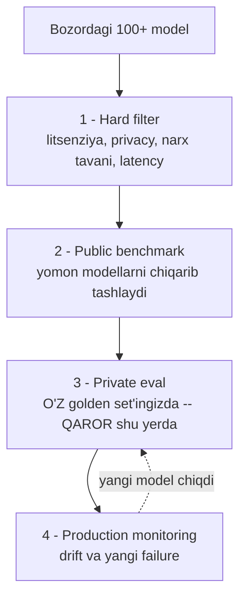
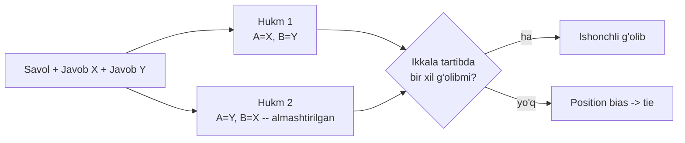

# 05. Model selection va benchmark'lar

> **Bu darsda:** yangi model chiqdi, docqa'da eskisini almashtirasizmi degan qarorni raqam bilan qabul qilishni o'rganasiz. Public benchmark'lar (MMLU, HumanEval, Chatbot Arena) nimani o'lchaydi va nimani ALDAYDI, data contamination nega leaderboard'ni ishonchsiz qiladi, ikki modelni position bias'siz qanday solishtirish kerak. Ishda bu ish suhbatidagi "MMLU'da yuqori model nega sizning taskda yomon ishladi?" savoliga va har model relizidagi "ko'chamizmi?" qaroriga to'g'ridan-to'g'ri tegishli.

---

## Nazariya (~30%)

### "Eng yaxshi model" degan narsa yo'q

Leaderboard'da birinchi turgan model — sizning app'ingiz uchun eng yaxshisi emas. To'g'ri savol: **"MENING use case'im uchun qaysi model eng yaxshi?"** Bu odatiy backend qaror: Postgres "eng yaxshi DB" emas, sizning yuk profilingiz uchun eng yaxshisi. Model tanlash ham har adaptatsiya bosqichida (prompt o'zgardi, RAG qo'shildi, narx o'sdi) qayta ko'riladi.

Muammo shundaki, ko'p jamoa modelni **vibe-check** bilan tanlaydi: 5-6 ta sevimli promptni sinab ko'rib, "zo'r ekan" deb ship qiladi. a16z so'rovida 70 qaror qabul qiluvchidan 6 tasi modelni og'zaki mish-mish asosida tanlagan. Bizning yo'l — 01-darsdagi eval pipeline: **public benchmark yomon modellarni filtrlaydi, private eval eng yaxshisini topadi.**

### Hard vs soft attribute

Model tanlashda ikki xil xususiyat bor — ularni aralashtirsangiz, hafta yo'qotasiz.

| Tur | Ta'rif | Misol | Nima qilish kerak |
|---|---|---|---|
| **Hard attribute** | O'zgartirib bo'lmaydi — model yoki policy'ga qadalgan | litsenziya, privacy policy, model hajmi, narx tavani, on-device talab | Avval FILTER — mos kelmasa ro'yxatdan chiqadi |
| **Soft attribute** | Prompt/RAG bilan yaxshilash mumkin | accuracy, faithfulness, toxicity, format-mosligi | Keyin optimizatsiya — private eval'da o'lchanadi |

Qoida: **hard attribute'lar bo'yicha avval kesing.** Latency P90 < 200ms hard talab bo'lsa, undan o'tmaydigan modelni benchmark ballari qanchalik chiroyli bo'lmasin — ko'rib o'tirmang. Soft attribute'da esa arzon model ham promptni yaxshilab 20% dan 70% ga chiqishi mumkin (yoki haftalab tweak qilib ham qimirlamasligi mumkin — buni faqat eval aytadi).

### 4 bosqichli workflow

Model tanlash — bitta qarash emas, voronka (funnel). 04-darsda retrieval'da hybrid -> rerank funnel'ini ko'rgandik; model tanlash ham xuddi shunday toraytiruvchi filtr.



Diqqat qiling: **qaror 3-bosqichda**, public benchmark'da emas. Benchmark faqat 100 modeldan 5 tasiga qisqartiradi. So'nggi so'zni sizning golden set'ingizdagi private eval aytadi. Va bu bir martalik ish emas — yangi model chiqqanda punktir strelka bo'yicha yana 3-bosqichga qaytasiz.

### Benchmark xaritasi — har biri nimani o'lchaydi

Public benchmark = model qobiliyatining bitta o'lchovi. Qaysi biri sizga signal, qaysi biri shovqin — bilishingiz kerak.

| Benchmark | Nimani o'lchaydi | Format | Cheklov |
|---|---|---|---|
| **MMLU / MMLU-Pro** | keng bilim (57 fan) | MCQ | ajratishni o'lchaydi, generatsiyani emas |
| **GPQA** | graduate darajadagi qiyin savollar | MCQ | tor, tez to'yinadi |
| **HumanEval** | kod yozish, **pass@k** | kod + unit test | faqat funksiya darajasi |
| **IFEval** | ko'rsatmaga amal qilish | avto-tekshiruv | mazmun sifatini emas |
| **MT-Bench** | ko'p qadamli suhbat | LLM-judge | judge bias'lariga tobe |
| **Chatbot Arena** | odam preference'i | pairwise + Bradley-Terry | preference != correctness |

**pass@k** ni 01-darsda qo'lda hisoblagandik: masalaga k ta sample generatsiya qilinadi, birortasi HAMMA testdan o'tsa masala yechilgan; pass@1 < pass@3 < pass@10. HumanEval aynan shuni o'lchaydi — bu functional correctness, ya'ni exact eval (judge subyektivligisiz).

### MCQ ning tuzog'i — ajratish != generatsiya

lm-evaluation-harness tasklarining ~75% MCQ (variant tanlash). Sabab oddiy: yaratish oson, tekshirish avtomatik, random baseline aniq (4 variant = 25%). Lekin ikki katta cheklov bor:

- **MCQ ajratish qobiliyatini o'lchaydi, generatsiyani emas.** Model to'g'ri variantni tanlashi mumkin, lekin ochiq savolga bo'sh javob yozishi mumkin. Sizning docqa'ngiz variant tanlamaydi — u matn generatsiya qiladi. MMLU'dagi 88% bilan sizning faithfulness'ingiz orasida to'g'ridan-to'g'ri bog'liqlik yo'q.
- **Format sezgirligi.** Promptga ortiqcha probel yoki "Choices:" so'zi qo'shilsa javob o'zgaradi (Alzahrani 2024). Ya'ni bir xil modelning MMLU bali eval kodiga qarab sakraydi.

> MCQ benchmark — bilim va reasoning uchun signal; summarization, tarjima, RAG-javob uchun deyarli befoyda.

### Leaderboard tuzoqlari

Leaderboard = **benchmark tanlash + agregatsiya**, va ikkalasi ham noshaffof:

- **Tanlash noshaffof.** HuggingFace Open LLM Leaderboard 6 ta benchmark ishlatadi, HELM Lite 10 ta — faqat 2 tasi umumiy. Bir xil model, ikki leaderboard, ikki xil o'rin.
- **Agregatsiya bahsli.** HF oddiy o'rtacha (hamma benchmark teng vazn — nega?), HELM mean win rate. Yakuniy raqam formuladan kelib chiqadi.
- **Korrelyatsiya bias kuchaytiradi.** WinoGrande, MMLU, ARC-C o'zaro 0.87-0.90 korrelyatsiyalangan — uch xil emas, deyarli bir narsani uch marta o'lchash. Bir yo'nalishga og'gan modelni sun'iy ko'taradi.
- **Tez to'yinadi.** MMLU (2020) -> MMLU-Pro (2024); HF 2024-iyunda butun suite'ni almashtirgan. Bugungi "topdagi" model 6 oydan keyin foydasiz benchmark bo'yicha topda bo'lishi mumkin.

### Data contamination — eng katta tuzoq

Contamination = benchmark savollarining javoblari model training data'siga tushib qolgan. Model "javobni eslaydi", biladi emas. Bu leaderboard'ni ichdan buzadi.

Raqamlar bilan qanchalik jiddiyligi:

- MMLU itemlarining **~29%** kontaminatsiya belgisiga ega (JHU, NAACL 2024).
- LLaMA-2 rasmiy report'ida **16%+** benchmark overlap.
- Toza GSM8K mirror'ida (yangi, hech qayerda chop etilmagan savollar) Mistral **-13 punkt** tushgan — demak eski GSM8K bali ko'p qismi "eslash".
- GPT-3 tahlilida 13 benchmarkning **40%+** train data'sida topilgan.
- Satirik isbot — Schaeffer 2023, "Pretraining on the Test Set Is All You Need": ataylab test setda train qilingan 1M parametrli mitti model benchmark'larda near-perfect ball oladi.

**Deteksiya usullari** (va nega ular ham yetarli emas):

- **n-gram overlap** — 13-token ketma-ketlik train data'da bo'lsa "dirty". Aniq, lekin train data'ni ko'rish kerak (yopiq modellarda yo'q).
- **Perplexity (PPL)** — modelning keyingi tokenni bashorat qilishdagi noaniqligi. Model matnni "biladigan" bo'lsa PPL past. Benchmark savolida g'ayrioddiy past PPL = ehtimol ko'rgan. Arzon, lekin taxminiy. **Muhim:** Anthropic API logprob bermaydi, demak PPL-deteksiya yopiq modellar uchun faqat kontsept — biz uni o'zimiz o'lchay olmaymiz.
- Parafraz yoki tarjima ikkala usulni ham aylanib o'tadi (savol boshqacha yozilgan, lekin javob baribir eslangan).

Handbook qo'shimchasi: agar modelni fine-tune qilganingizdan keyin **MMLU +10 ball sakrasa** — bu tabiiy yaxshilanish emas, instruction data contamination belgisi. Xulosa: **benchmark = signal, haqiqat manbai emas.** Bir nechta mustaqil eval bir xil natija bersa — ishonch ortadi; bitta leaderboard bali — hech narsa.

### Comparative eval — pointwise vs pairwise

Ikki yo'l bor:

- **Pointwise** — har modelga alohida ball berib, ballar bo'yicha tartiblash.
- **Pairwise (comparative)** — modellarni juft-juft solishtirib, "qaysi javob yaxshi?" deb so'rab, natijadan ranking hisoblash.

Subyektiv sifatda pairwise osonroq. "Bu javob 4 balga tortadimi 5 galami?" degandan "A va B dan qaysi yaxshi?" deb so'rash barqarorroq — 03-darsda judge scoring qoidalarida ko'rgan edik (klassifikatsiya > son). Chatbot Arena aynan shu asosda: foydalanuvchiga ikki anonim model javobi ko'rsatiladi, u yaxshisini tanlaydi.

**A/B testing bilan adashtirmang:** A/B'da foydalanuvchi BITTA model javobini ko'radi (traffic split, biznes signal o'lchanadi — bu 04-dars). Comparative'da ikkalasini BIRGA ko'radi. Ikki boshqa mexanizm.

**Elo -> Bradley-Terry — nega almashgan.** Dastlab Arena Elo reyting ishlatgan (shaxmatdan). Muammo: Elo — onlayn, ketma-ket yangilanadigan algoritm, demak **jangalar tartibiga sezgir** — bir xil jangalar boshqa tartibda kelsa boshqa reyting chiqadi. Bradley-Terry esa butun jang to'plami ustidan bir marta hisoblanadigan statik model: har model uchun "kuch" parametri topiladi, `P(i j'dan yutadi) = kuch_i / (kuch_i + kuch_j)`. Tartibga bog'liq emas, barqaror, takrorlanadigan — shuning uchun Arena unga o'tgan.

**Comparative eval'ning muammolari** (ish suhbatida so'raladi):

- **Kvadratik o'sish** — 57 model = 1596 juft; ishonchli ranking uchun har juftga yuzlab jang kerak.
- **Transitivity shubhali** — A > B va B > C bo'lsa, A > C degani AI'da har doim to'g'ri emas.
- **"Hello" promptlar** — Arena promptlarining 0.55% shunchaki salom; oddiy promptlar modellarni umuman ajratmaydi.
- **Preference != correctness** — "telefon radiatsiyasi o'smaga olib keladimi?" degan savolga foydalanuvchi bilmagani uchun so'raydi; undan hukm so'rash — yaxshi eshitiladigan xato javob yutadi.
- **Nisbiydan absolyutga o'tish yo'q** — B modeli A'dan 51% yutadi = qancha ticket ko'proq avtomatlashadi? Noma'lum. Cost-benefit hisob-kitob qilib bo'lmaydi.

### Til-spesifik leaderboard — o'zbek tili uchun ibrat

Bu darsning siz uchun eng amaliy qismi. Umumiy (inglizcha) benchmark'lar o'zbekcha app sifatini o'lchamaydi. Boshqa tillar bu muammoni **ikki qismli suite** bilan hal qilgan — o'zbek tili uchun aynan shu shablon ishlaydi:

| Loyiha | Tarjima qism | Original til-xos qism |
|---|---|---|
| **OpenKo** (koreys) | GPQA, GSM8K, IFEval koreyschasi | custom Knowledge, Social Value |
| **Portugalcha** | umumiy benchmark tarjimasi | milliy imtihonlar ENEM/OAB, ijtimoiy media |
| **Arabcha** | 12 tarjima benchmark | 2 native benchmark |

Ikki dars beradi:

- **Ikki qism kerak.** Faqat tarjima MMLU-uz — bilimni o'lchaydi, lekin o'zbek madaniyati, morfologiyasi, mahalliy kontekstni tekshirmaydi. Original til-xos eval (mahalliy imtihon savollari, o'zbekcha idiomalar, mahalliy faktlar) shuni qamraydi.
- **Human-translated > machine-translated.** Mashina tarjimasi savol ma'nosini buzadi, model tarjima artefaktini o'lchaydi, bilimni emas.

Va eng muhimi: **sizning docqa golden set'ingiz (o'zbekcha, 4-bo'lim, 02-darsda kengaytiradigan) aynan private til-spesifik eval.** Public MMLU-uz filter berishi mumkin, ammo "bu model o'zbekcha hujjatdan faithful javob yozadimi?" degan savolga faqat sizning golden set'ingiz javob beradi. Model tanlash o'zbekcha kontekstda — bu leaderboard'da yo'q, u sizning harness'ingizda.

---

## Amaliyot (~70%)

Endi nazariyani kodga aylantiramiz: (1) ikki modelni position bias'siz solishtirish, (2) win-matrix'dan ranking, (3) private eval bilan qaror. Kod raw Anthropic SDK — 06-darsdagi `evalharness`ning "compare rejimi" shu yerdan o'sib chiqadi.

Sozlash (1-4 bo'limlardan tanish):

```bash
pip install anthropic pydantic python-dotenv httpx
# .env: ANTHROPIC_API_KEY=sk-ant-...
```

### Predict / Run — pairwise comparison, position bias mitigatsiyasi bilan

**Predict:** judge'dan "A yaxshimi B?" deb so'raymiz. Agar javoblarni almashtirib (A<->B) qayta so'rasak, judge bir xil g'olibni aytadimi? 03-darsdan eslang: **first-position bias** — judge birinchi ko'rgan javobni afzal ko'radi. O'ylab ko'ring, mitigatsiyasiz win rate qanchalik ishonchli bo'ladi?

Avval judge'ning o'zi — 03-darsdagi kabi `messages.parse` + Pydantic, `explanation` verdict'dan OLDIN (CoT effekti):

```python
# pairwise.py -- 1-qism: judge
import os
from anthropic import Anthropic
from pydantic import BaseModel
from dotenv import load_dotenv

load_dotenv()
client = Anthropic()

class Judgment(BaseModel):
    explanation: str          # avval izoh -- reasoning oldinda
    winner: str               # "A" | "B" | "tie"

JUDGE_PROMPT = """Sen javob sifatini baholovchi xolis hakamsan.
Savol: {q}

Javob A:
{a}

Javob B:
{b}

Qaysi javob savolga aniqroq va kontekstga sodiqroq? Avval bir jumla izoh yoz,
keyin g'olibni tanla: A, B yoki teng bo'lsa tie."""

def judge_once(q, a, b):
    resp = client.messages.parse(
        model="claude-haiku-4-5", max_tokens=400,
        messages=[{"role": "user", "content": JUDGE_PROMPT.format(q=q, a=a, b=b)}],
        output_format=Judgment,
    )
    return resp.parsed_output
```

**2-qism — position bias mitigatsiyasi.** Kalit g'oya: bir juftni IKKI marta baholaymiz — normal tartibda va almashtirilgan tartibda. Faqat ikkala tartibda ham bir xil g'olib chiqsa, natijaga ishonamiz. Tartib almashsa hukm o'zgarsa — bu position bias, uni `tie` deb belgilaymiz (informativ emas).



```python
# pairwise.py -- 2-qism: swap bilan solishtirish
def compare_pair(q, ans_x, ans_y):
    # 1-tartib: X birinchi (A pozitsiyasida)
    j1 = judge_once(q, ans_x, ans_y)
    # 2-tartib: almashtiramiz -- Y endi A pozitsiyasida
    j2 = judge_once(q, ans_y, ans_x)

    # har hukmni "qaysi model yutdi" ga tarjima qilamiz
    if j1.winner == "A":
        w1 = "X"
    elif j1.winner == "B":
        w1 = "Y"
    else:
        w1 = "tie"
    if j2.winner == "A":
        w2 = "Y"          # swap qilingan -- A endi Y
    elif j2.winner == "B":
        w2 = "X"
    else:
        w2 = "tie"

    if w1 == w2 and w1 != "tie":
        return w1         # ikkala tartibda bir xil -> ishonchli g'olib
    return "tie"          # tartibga qarab o'zgardi -> position bias
```

**3-qism — win rate.** Real hayotda `ans_x` = X modeli javobi, `ans_y` = Y modeli javobi (`generate_answer` bilan, pastda ko'ramiz). Bu yerda tayyor javoblarni beramiz:

```python
# pairwise.py -- 3-qism: butun set ustida
PAIRS = [
    {"q": "docqa'da retrieval qatlami nima uchun kerak?",
     "x": "Retrieval savolga mos hujjat bo'laklarini topib beradi; model tashqi kontekstdan javob yozadi, o'z xotirasidan to'qimaydi.",
     "y": "Retrieval ma'lumot qidirish uchun kerak."},
    {"q": "citations nima kafolat beradi?",
     "x": "Har da'vo qaysi manbadan kelganini ko'rsatadi -- tekshirish imkonini beradi, lekin faktik to'g'rilikni kafolatlamaydi.",
     "y": "Citations javobning to'g'ri ekanini kafolatlaydi."},
    {"q": "rerank-2.5 nimani yaxshilaydi?",
     "x": "Nomzod hujjatlarni qayta tartiblab precision'ni ko'taradi.",
     "y": "Rerank retrieval'dan keyin eng mos hujjatlarni yuqoriga chiqaradi, shu bilan javob sifati oshadi va shovqin kamayadi."},
    {"q": "hybrid search RRF nima qiladi?",
     "x": "Keyword va vektor natijalarini rank bo'yicha birlashtiradi -- aniq atamalar ham, semantik mos hujjatlar ham topiladi.",
     "y": "RRF ikki qidiruvni qo'shadi."},
    {"q": "'topilmadi' javobi qachon qaytadi?",
     "x": "Kontekst yetarli bo'lmaganda model 'Hujjatlarda topilmadi' deydi va sources bo'sh qaytadi.",
     "y": "Model javob topolmaganda topilmadi deydi."},
]

score = {"X": 0, "Y": 0, "tie": 0}
for item in PAIRS:
    w = compare_pair(item["q"], item["x"], item["y"])
    score[w] += 1
    print(f"{item['q'][:36]:36} -> {w}")

decisive = score["X"] + score["Y"]
rate = score["X"] / decisive if decisive else 0
print(f"\nX={score['X']}  Y={score['Y']}  tie={score['tie']}")
print(f"X win rate (tie'siz): {rate:.0%}")

# Output:
# docqa'da retrieval qatlami nima uchu -> X
# citations nima kafolat beradi?       -> tie
# rerank-2.5 nimani yaxshilaydi?        -> Y
# hybrid search RRF nima qiladi?        -> X
# 'topilmadi' javobi qachon qaytadi?   -> tie
#
# X=2  Y=1  tie=2
# X win rate (tie'siz): 67%
```

Diqqat: 2 ta `tie` — bu chindan ham teng emas, judge tartib almashganda fikrini o'zgartirgan juftlar. Mitigatsiyasiz (faqat 1-tartib) bu ikkitasi noto'g'ri "X yutdi" deb sanalardi va win rate 80% ko'rsatardi — soxta ishonch. **Ikkala tartib = position bias'ni ushlab, uni signaldan chiqarib tashlaydi.**

### Investigate / Modify — win-matrix'dan ranking

Ikki model yaxshi, lekin bozorda 3-4 nomzod bo'lsa-chi? Pairwise natijalarni **win-matrix**ga yig'ib, undan ranking chiqaramiz.

```python
# rank.py -- pairwise natijalardan ranking
MODELS = ["opus", "haiku", "sonnet-eski"]

# (yutgan, yutqazgan) juftlar -- real hayotda compare_pair'dan yig'iladi
BATTLES = [
    ("opus", "haiku"), ("opus", "haiku"), ("haiku", "opus"),
    ("opus", "sonnet-eski"), ("opus", "sonnet-eski"), ("opus", "sonnet-eski"),
    ("haiku", "sonnet-eski"), ("haiku", "sonnet-eski"), ("sonnet-eski", "haiku"),
]

# win-matrix: wins[a][b] = a modelining b ustidan yutuqlari
wins = {m: {n: 0 for n in MODELS} for m in MODELS}
for winner, loser in BATTLES:
    wins[winner][loser] += 1

print(f"{'model':14}{'yutuq':>7}{'jang':>7}{'win rate':>11}")
rows = []
for m in MODELS:
    w = sum(wins[m][n] for n in MODELS)                       # jami yutuq
    games = sum(wins[m][n] + wins[n][m] for n in MODELS)      # jami jang
    rate = w / games if games else 0
    rows.append((m, w, games, rate))

for m, w, games, rate in sorted(rows, key=lambda r: r[3], reverse=True):
    print(f"{m:14}{w:7}{games:7}{rate:10.0%}")

# Output:
# model           yutuq   jang   win rate
# opus                5      6         83%
# haiku               3      6         50%
# sonnet-eski         1      6         17%
```

**Modify — nega oddiy win rate to'liq to'g'ri emas.** Bu yerda har model bir xil sonli jang o'ynadi, shuning uchun oddiy win rate ishladi. Lekin agar `opus` faqat kuchsiz modellar bilan, `haiku` faqat kuchlilar bilan jang qilsa — oddiy win rate `opus`ni sun'iy ko'taradi. **Bradley-Terry** aynan buni tuzatadi: kuchli raqibni yutish ko'proq "kuch" beradi. U har model uchun `kuch` parametrini shunday topadiki, `P(i j'dan yutadi) = kuch_i / (kuch_i + kuch_j)` kuzatilgan jangalarga eng mos kelsin. Arena Elo'dan shunga o'tgan — statik, tartibdan mustaqil, takrorlanadigan.

> Oddiy win rate — tez sanity-check; Bradley-Terry — raqib kuchini hisobga oladigan to'g'ri usul. Jangalar balanssiz bo'lsa BT'ga o'ting.

**Mashq:** `BATTLES`ga `("sonnet-eski", "opus")` ni 2 marta qo'shing. `opus`ning win rate'i qanday o'zgaradi, ranking almashadimi? Keyin o'ylab ko'ring: agar `sonnet-eski` faqat `opus` bilan jang qilib turgan bo'lsa (haiku bilan emas), oddiy win rate'ga ishonasizmi?

### Investigate / Modify — private eval: qaror aslida shu yerda

Pairwise preference qiziq, lekin **preference != correctness.** docqa uchun asosiy savol "qaysi javob yoqimliroq?" emas, "qaysi model faithful javob yozadi?" — bu private eval. Bu yerda 06-darsdagi harness g'oyasini oldindan ko'ramiz: bir xil golden set, ikki model, judge bilan pass rate.

Kalit nuqta — **generatsiya modelini almashtirib, o'sha eval'ni qayta yugurtiramiz.** Model almashtirish qarori shu.

```python
# private_eval.py -- public benchmark emas, O'Z golden set'ingiz qaror qiladi
class Faithful(BaseModel):
    explanation: str          # avval izoh
    verdict: str              # "PASS" | "FAIL"

FAITH_PROMPT = """Savol: {q}
Kontekst:
{ctx}

Javob:
{a}

Javob FAQAT yuqoridagi kontekstga tayanganmi? Kontekstda yo'q biror da'vo bo'lsa -- FAIL.
Avval bir jumla izoh, keyin PASS yoki FAIL."""

def judge_faithful(q, ctx, a):
    resp = client.messages.parse(
        model="claude-haiku-4-5", max_tokens=400,
        messages=[{"role": "user", "content": FAITH_PROMPT.format(q=q, ctx=ctx, a=a)}],
        output_format=Faithful,
    )
    return resp.parsed_output.verdict == "PASS"

def generate_answer(model_id, question, context):
    # AYNAN shu qadam almashtiriladi -- generatsiya modeli qaror obyekti
    prompt = f"Faqat quyidagi kontekstga tayanib javob ber.\nKontekst:\n{context}\n\nSavol: {question}"
    resp = client.messages.create(
        model=model_id, max_tokens=512,
        messages=[{"role": "user", "content": prompt}],
    )
    return resp.content[0].text

def private_eval(model_id, golden):
    passed = 0
    for item in golden:
        answer = generate_answer(model_id, item["q"], item["ctx"])
        if judge_faithful(item["q"], item["ctx"], answer):
            passed += 1
    return passed / len(golden)
```

Ikki nomzodni bir xil golden set'da yugurtiramiz (bu yerda 3 savol — real harness'da 20+):

```python
GOLDEN = [
    {"q": "docqa qanday retrieval ishlatadi?",
     "ctx": "docqa hybrid retrieval ishlatadi: keyword va vektor qidiruvi RRF bilan birlashtiriladi, so'ng rerank-2.5 qayta tartiblaydi.",
     "expected": "hybrid + rerank"},
    {"q": "citations nimani kafolatlaydi?",
     "ctx": "Citations har da'voni manbaga bog'laydi va tekshirish imkonini beradi; faktik to'g'rilikni kafolatlamaydi.",
     "expected": "tekshirish, to'g'rilikni emas"},
    {"q": "kontekst yetmasa nima bo'ladi?",
     "ctx": "Kontekst yetarli bo'lmasa model 'Hujjatlarda topilmadi' deb javob beradi.",
     "expected": "topilmadi javobi"},
]

for cand in ["claude-opus-4-8", "claude-haiku-4-5"]:
    r = private_eval(cand, GOLDEN)
    print(f"{cand:20} faithfulness pass rate: {r:.0%}")

# Output:
# claude-opus-4-8      faithfulness pass rate: 100%
# claude-haiku-4-5     faithfulness pass rate: 100%
```

Ikkalasi ham 100% — kichik, oson golden setda modellar ajralmaydi. Bu **01-darsdagi eval-set hajmi qoidasini** ko'rsatadi: 3 savol bilan 30% farqni ham ilg'ay olmaysiz (OpenAI qoidasi: 10% farqni ko'rish uchun ~100 sample kerak). Real qaror qiyin edge va out-of-scope savollar bilan to'la 20+ setda tug'iladi — 06-darsdagi harness aynan buni beradi.

Va yakuniy nuqta cost bilan: agar `haiku` pass rate `opus`ga yaqin bo'lsa, `haiku` 5x arzon (`$1/$5` vs `$5/$25` per 1M) — **Pareto qaror:** threshold'dan o'tsa, arzonini oling. Bu cost/latency mezoni (01-dars, 4 mezon guruhi) private eval bilan birlashgan joy.

### Make — docqa uchun "model almashtirish qarori" checklist

**Challenge:** yangi model chiqdi. `decide_model` funksiyasini yozing: eski va yangi modelni bir xil golden set'da yugurtirsin, keyin quyidagi qoida bo'yicha qaror qaytarsin.

Checklist (funksiya shu mantiqni kodlaydi):

1. Yangi model **hard filter**dan o'tdimi? (litsenziya, privacy, latency) — o'tmasa `"rad etildi"`.
2. Private eval pass rate `threshold`dan **yuqorimi**? — past bo'lsa `"eski qoladi"`.
3. Yangi pass rate eski'dan **sezilarli yaxshimi** (masalan +3 punkt)? — ha bo'lsa `"yangiga ko'ch"`.
4. Yaqin bo'lsa, **arzonrog'i** yutadi (Pareto) — teng sifatda narx hal qiladi.

```python
def decide_model(old_id, new_id, golden, threshold, hard_ok):
    # TODO 1: hard filter -- hard_ok False bo'lsa "rad etildi"
    # TODO 2: ikkala modelni private_eval bilan o'lchang
    # TODO 3: yangi threshold'dan past bo'lsa "eski qoladi"
    # TODO 4: yangi eski'dan >=0.03 yuqori bo'lsa "yangiga ko'ch"
    # TODO 5: aks holda narxga qarab qaror (Pareto)
    pass
```

<details>
<summary>Yechim</summary>

```python
# arzonlik tartibi -- indeks kichik = arzon (Pareto uchun)
COST_RANK = {"claude-haiku-4-5": 0, "claude-opus-4-8": 1}

def decide_model(old_id, new_id, golden, threshold, hard_ok):
    if not hard_ok:
        return "rad etildi -- hard filter'dan o'tmadi"

    old_rate = private_eval(old_id, golden)
    new_rate = private_eval(new_id, golden)
    print(f"eski {old_id}: {old_rate:.0%} | yangi {new_id}: {new_rate:.0%}")

    if new_rate < threshold:
        return f"eski qoladi -- yangi threshold {threshold:.0%} dan past"
    if new_rate >= old_rate + 0.03:
        return "yangiga ko'ch -- sifat sezilarli yaxshi"
    # sifat yaqin -> arzonrog'i yutadi (Pareto)
    if COST_RANK.get(new_id, 9) < COST_RANK.get(old_id, 9):
        return "yangiga ko'ch -- sifat teng, narx arzonroq"
    return "eski qoladi -- yangi sezilarli yaxshi emas"

# ishlatish:
print(decide_model("claude-opus-4-8", "claude-haiku-4-5",
                   GOLDEN, threshold=0.80, hard_ok=True))

# Output:
# eski claude-opus-4-8: 100% | yangi claude-haiku-4-5: 100%
# yangiga ko'ch -- sifat teng, narx arzonroq
```

E'tibor bering: qaror faqat raqamga tayangan — vibe emas. Xuddi shu funksiya CI'ga qo'yilsa (04-dars regression pattern'i), model relizini avtomatik baholaydi. `decide_model` docqa'ning generator modelini almashtirish qarori uchun to'liq shablon.
</details>

---

## Retrieval practice

Javoblarni yoddan aytishga urinib ko'ring — o'qib o'tish emas, eslab chiqarish o'rgatadi.

1. Modelning MMLU bali 88%, lekin sizning docqa'ngizda faithfulness past. Uch mumkin sabab ayting (kamida bittasi contamination, bittasi MCQ bilan bog'liq).
2. Pairwise judge'ni faqat bitta tartibda chaqirsangiz, aynan qaysi bias natijani buzadi va uni qanday mitigatsiya qilasiz?
3. Hard attribute va soft attribute'ga ikkitadan misol keltiring. Nega hard'lar bo'yicha AVVAL filtrlash kerak?
4. "Yangi model chiqdi, ko'chamizmi?" — bu qarorni raqam bilan qanday olasiz? 4 bosqichli workflow'da qaror qaysi bosqichda tushadi?
5. Public leaderboard'da model A model B'dan 3 punkt yuqori. Bunga qachon ishonmaysiz? (kamida ikki sabab)
6. O'zbek tili uchun eval suite qursangiz, ikki qismini nomlang va nega faqat tarjima MMLU yetmasligini tushuntiring.

---

## Manbalar

- **Huyen, Ch3 — Comparative evaluation** (p.171-179): pointwise vs pairwise, Chatbot Arena, Elo -> Bradley-Terry, comparative eval muammolari.
- **Huyen, Ch4 — Model selection va Public benchmarks** (p.202-223): hard/soft attribute, 4 bosqichli workflow, benchmark churn, korrelyatsiya, data contamination (p.220).
- **Handbook, Ch7 — Model evaluation** (p.489-508): benchmark = signal, fine-tune MMLU +10 = contamination belgisi, til-spesifik leaderboard pattern (OpenKo/portugalcha/arabcha).
- Benchmark contamination (MMLU raqamlari): `https://blog.pebblous.ai/blog/llm-benchmark-contamination/en/`
- Contamination deteksiya/mitigatsiya (n-gram, perplexity): `https://mbrenndoerfer.com/writing/benchmark-contamination-llm-detection-mitigation`
- Judge bias mitigatsiyasi 2026 (position bias, swap): `https://futureagi.com/blog/evaluating-llm-judge-bias-mitigation-2026/`
- Ichki darslar: [04-dars — offline va online eval](04.%20Offline%20va%20online%20eval%20—%20regression%20testing%20va%20CI.md), keyingisi: [06-dars — evalharness](06.%20Bo'lim%20loyihasi%20—%20evalharness.md).

**Keyingi dars — 06. Bo'lim loyihasi:** shu darsdagi pairwise compare va private eval g'oyalarini to'liq `evalharness`ga yig'amiz — versiyalangan golden set, judge, regression va slice hisoboti bilan.
