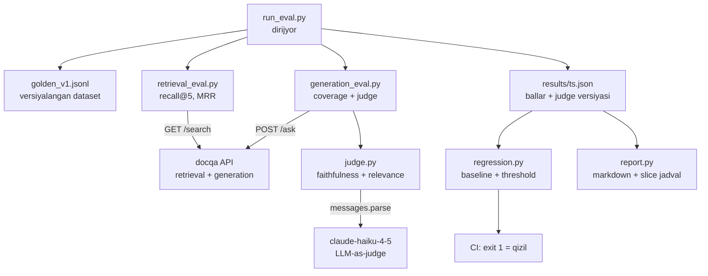
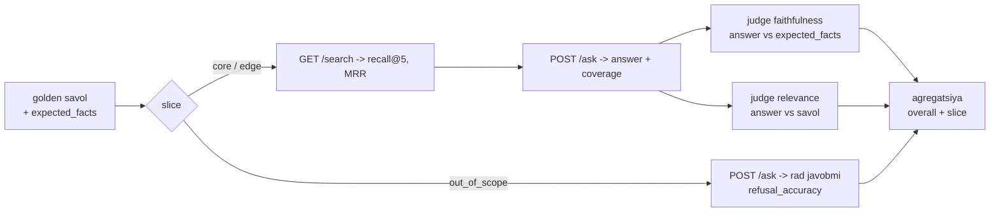

# 06. Bo'lim loyihasi — evalharness

4-bo'limda `docqa` qurding: pgvector retrieval ustidagi savol-javob servisi, `POST /ask` o'zbekcha savolga citations bilan javob beradi. Oxirida 10 savollik `eval.py` bor edi — recall@5 va coverage chiqarardi. Bu loyiha o'sha mini-skriptni **to'laqonli eval harness**ga aylantiradi: versiyalangan golden dataset, LLM-as-judge (faithfulness + relevance), regression darvozasi (baseline + threshold + exit code), Batches rejimi va markdown hisobot. Portfolio zanjirining beshinchi va oxirgi bo'g'ini: `askops` (1) -> `semsearch` (2) -> `vecsearch` (3) -> `docqa` (4) -> **`evalharness` (shu bo'lim)**.

> Bu nazariya darsi emas — **qurasan**. Backend tilida aytganda: bu `docqa` uchun `pytest` suite + golden files + CI darvozasi, lekin assert'lar deterministik emas, LLM-judge chiqaradi. Ish suhbatida "eval qildim" degan gap emas, `python run_eval.py` bilan raqam chiqaradigan, `python regression.py; echo $?` bilan CI'ni qizil qiladigan, judge'i kalibrlangan harness gapiradi. Intervyu savoli aynan shu: "LLM feature'ni qanday test qilasan, regression'ni qanday ushlaysan?"

---

## Nima quramiz — talablar

`evalharness` — `docqa` yonida turadigan alohida papka. `docqa`ga faqat **HTTP orqali** ulanadi (`/search`, `/ask`), uning ichki kodiga tegmaydi. Shu tufayli `docqa`ni prompt/model/chunking tarafida o'zgartirsang ham harness o'zgarmaydi — u faqat "qora quti"ning sifatini o'lchaydi.

| Fayl | Vazifa |
|---|---|
| `golden/golden_v1.jsonl` | versiyalangan dataset — savol, relevant fayllar, etalon faktlar, slice |
| `golden/README.md` | anotatsiya guideline: savol nima, "good" nima, slice qoidalari |
| `golden.py` | JSONL loader + sxema validator (buzuq qatorda fail fast) |
| `config.py` | `docqa` URL, judge modellari, metrika threshold'lari |
| `retrieval_eval.py` | `/search` -> recall@5, MRR (4-bo'lim funksiyalari, qayta ishlatiladi) |
| `judge.py` | faithfulness + relevance judge (`claude-haiku-4-5`, `messages.parse`) |
| `calibrate.py` | 5 savolda qo'l bahosi vs judge kelishuvi (spot-check qavati) |
| `generation_eval.py` | `/ask` -> judge -> ballar + citations coverage |
| `run_eval.py` | to'liq run: cost estimate -> retrieval + generation -> `results/<ts>.json` |
| `run_eval_batch.py` | judge chaqiruvlarini Batches API bilan (50% arzon, katta set) |
| `regression.py` | oxirgi natijani `baseline.json` bilan solishtiradi -> exit code |
| `report.py` | natija JSON -> markdown hisobot (slice bo'yicha jadval) |
| `baseline.json` | qabul qilingan etalon ballar (git'da versiyalanadi) |

Talablar — har biri production'da nega kerakligi bilan:

- **Golden set >= 20 savol, uch slice.** `core` (tipik faktik savollar), `edge` (typo, keng, qisqa savollar), `out_of_scope` (hujjatda yo'q — tizim "topilmadi" deyishi kerak). Slice bo'yicha alohida o'lchash Simpson paradoksidan saqlaydi: model umumiy 0.86, lekin `edge`da 0.50 bo'lishi mumkin (02-darsda ko'rganmiz).
- **Golden = yashovchi hujjat.** JSONL git'da, kod bilan birga versiyalanadi. `golden_v1` -> `golden_v2` changelog bilan; production failure'lar oqib kelib turadi (02/04-darslar). Bir marta qurib tashlab qo'yish = drift'ni ushlamaslik.
- **Har mezonga alohida judge.** Faithfulness (javob etalon faktlarga zid emasmi) va relevance (savolga tegdimi) — ikki alohida chaqiruv. Bitta "quality" ballda mezonlar aralashsa signal loyqalanadi (03-dars).
- **Judge versiyalanadi.** `JUDGE_PROMPT_VERSION` konstanta har natija fayliga yoziladi. Judge prompti o'zgarsa — bu boshqa o'lchov asbobi, eski baseline bilan ballarni solishtirib bo'lmaydi (03-dars, production xatosi #4).
- **Kalibrlash majburiy qavat.** Judge'ga ko'r ishonish = kalibrsiz o'lchov asbobi. 5 savolda qo'l bahosi vs judge kelishuvini o'lchaymiz; past bo'lsa promptni tuzatamiz yoki `opus`ga o'tamiz.
- **Regression = CI darvozasi.** `baseline.json`dan threshold pastga tushsa `exit code 1` — GitHub Actions qizil bo'ladi. Bu `pytest` + golden files pattern'ining LLM versiyasi, faqat threshold binary emas — oraliq va judge shovqiniga tolerans bilan (04-dars).
- **Cost oldindan hisoblanadi.** Har run'dan oldin `count_tokens` bilan judge narxini baholaymiz — kutilmagan hisob kelmasin (`tiktoken` emas, API o'zi sanaydi).

---

## Arxitektura

`evalharness` uch tashqi bog'lanishga ega: `docqa` API (retrieval + generation), Anthropic (judge), va lokal fayllar (`golden`, `results`, `baseline`). `run_eval.py` — dirijyor.



Har savol shu oqimdan o'tadi. Slice qaysi metrikani o'lchashni belgilaydi — `out_of_scope` savol judge'ni umuman chaqirmaydi, faqat "rad etdimi" tekshiriladi:



Fayl strukturasi — `docqa`dan mustaqil, o'z papkasida:

```text
evalharness/
|-- golden/
|   |-- golden_v1.jsonl        # {id, slice, question, relevant_files, expected_facts}
|   `-- README.md              # anotatsiya guideline
|-- config.py                  # docqa URL, judge model, threshold'lar
|-- golden.py                  # JSONL loader + validator
|-- retrieval_eval.py          # /search -> recall@5, MRR (4-bo'lim funksiyalari)
|-- judge.py                   # faithfulness + relevance judge (haiku, messages.parse)
|-- calibrate.py               # 5 savol: qo'l bahosi vs judge kelishuvi
|-- generation_eval.py         # /ask -> judge -> ballar + citations coverage
|-- run_eval.py                # to'liq run -> results/<ts>.json (+ cost estimate)
|-- run_eval_batch.py          # Batches API rejimi (50% arzon)
|-- regression.py              # baseline.json bilan solishtirish -> exit code
|-- report.py                  # results -> markdown hisobot
`-- baseline.json              # qabul qilingan etalon ballar
```

---

## 1-qadam: golden set sxemasi va anotatsiya guideline

Golden set = harness'ning yuragi. Sxemani oddiy JSONL qilamiz — har qator bitta savol, git diff'da o'qish oson, kod bilan birga versiyalanadi. Har yozuvda beshta maydon:

```text
# golden/golden_v1.jsonl sxemasi (bitta qator = bitta JSON obyekt)
id              # barqaror identifikator, masalan "core-01" (git tarixida kuzatiladi)
slice           # "core" | "edge" | "out_of_scope"
question        # o'zbekcha savol (real foydalanuvchi yozadigan ko'rinishda)
relevant_files  # retrieval qaysi fayl(lar)ni topishi kerak; out_of_scope da bo'sh []
expected_facts  # javobda bo'lishi kerak bo'lgan etalon faktlar (faithfulness judge uchun reference)
```

`expected_facts` — bu 4-bo'limdan farq. U yerda faithfulness'ni retrieval kontekstiga qarab o'lchading (local factual consistency). Bu yerda judge etalon faktlarni **golden set'dan** oladi (reference-based faithfulness, 03-dars 2-rejim). Sabab: harness `docqa`ni qora quti sifatida ko'radi, uning ichki kontekstini HTTP orqali to'liq ololmaydi — lekin javob to'g'ri faktlarni aytdimi degan savolga etalon faktlar aniqroq javob beradi. Retrieval kontekstiga grounding esa `coverage` metrikasi bilan ushlanadi (citations, 07-dars).

Golden fayl (o'zbekcha, `docqa` golang korpusi ustida). Har qator yagona satrda:

```text
# golden/golden_v1.jsonl (namuna qatorlar; jami 22)
{"id":"core-01","slice":"core","question":"Goroutine nima?","relevant_files":["/corpus/golang/concurrency.md"],"expected_facts":["Goroutine Go runtime boshqaradigan yengil ijro oqimi","go kaliti bilan ishga tushadi"]}
{"id":"core-02","slice":"core","question":"Buffersiz channelda yuboruvchi nima kutadi?","relevant_files":["/corpus/golang/channels.md"],"expected_facts":["Yuboruvchi qabul qiluvchi tayyor bo'lguncha bloklanadi","uzatish sinxron"]}
{"id":"core-03","slice":"core","question":"select statement nima uchun kerak?","relevant_files":["/corpus/golang/select.md"],"expected_facts":["Bir nechta channel operatsiyasidan tayyorini tanlaydi"]}
{"id":"core-04","slice":"core","question":"WaitGroup nima uchun ishlatiladi?","relevant_files":["/corpus/golang/waitgroup.md"],"expected_facts":["Bir guruh goroutine tugashini kutadi","Add, Done, Wait metodlari"]}
{"id":"core-05","slice":"core","question":"Mutex nima muammoni hal qiladi?","relevant_files":["/corpus/golang/mutex.md"],"expected_facts":["Bir vaqtda bir goroutine kritik bo'limga kiradi","race condition oldini oladi"]}
{"id":"edge-01","slice":"edge","question":"goroutne qanday toxtatiladi","relevant_files":["/corpus/golang/context.md"],"expected_facts":["context.Context bekor qilish signali bilan","ctx.Done kanali yopiladi"]}
{"id":"edge-02","slice":"edge","question":"parallellik va konkurentlik farqi nima?","relevant_files":["/corpus/golang/concurrency.md"],"expected_facts":["Konkurentlik vazifalarni almashtirib bajarish","parallellik bir vaqtda fizik bajarish"]}
{"id":"edge-03","slice":"edge","question":"channel yopilsa nima bo'ladi?","relevant_files":["/corpus/golang/channels.md"],"expected_facts":["Yopilgan channeldan o'qish nol qiymat qaytaradi","ok flag false bo'ladi"]}
{"id":"oos-01","slice":"out_of_scope","question":"Kubernetes podini qanday avtoskeyl qilinadi?","relevant_files":[],"expected_facts":[]}
{"id":"oos-02","slice":"out_of_scope","question":"PostgreSQL da index qanday yaratiladi?","relevant_files":[],"expected_facts":[]}
{"id":"oos-03","slice":"out_of_scope","question":"Python da list comprehension nima?","relevant_files":[],"expected_facts":[]}
# ... jami 22 qator: core 10, edge 6, out_of_scope 6
```

`edge-01`da ataylab typo ("goroutne", nuqta yo'q) — real foydalanuvchi shunday yozadi, retrieval bardosh berishi kerak. `out_of_scope` savollar korpusda yo'q; ular uchun to'g'ri xatti-harakat — "Hujjatlarda topilmadi" va bo'sh `sources`. Bu `docqa`ning eng muhim production himoyasi (halloc emas, halol signal).

Anotatsiya guideline — golden set kim to'ldirsa bir xil o'lchov chiqarsin uchun:

```text
# golden/README.md — anotatsiya guideline

## Savol qanday bo'ladi
- Real foydalanuvchi yozadigan ko'rinishda (rasmiy ta'rif emas). edge slice'da typo va qisqartma xush kelibsiz.
- Bitta savol = bitta niyat. "X nima va Y qanday?" ni ikki savolga bo'l.

## relevant_files qoidasi
- Faqat savolga JAVOB beradigan fayllarni yoz (mavzuga aloqador, lekin javob yo'q fayl kirmaydi).
- out_of_scope da har doim bo'sh []: retrieval hech narsa topmasligi TO'G'RI.

## expected_facts qoidasi ("good" nima)
- Javobda BO'LISHI SHART bo'lgan minimal faktlar. Uslub, uzunlik emas — faqat faktik yadro.
- correct != good: to'g'ri lekin foydasiz javob ham FAIL bo'lishi mumkin (relevance judge tutadi).

## Versiyalash
- golden_v1.jsonl o'zgarmaydi; yangi savollar golden_v2.jsonl ga, changelog bilan.
- Production failure (thumbs-down, eskalatsiya) -> yangi qator sifatida oqib keladi.
- QOIDA: golden savollar judge promptiga MISOL sifatida kirmaydi (test set leak = o'z-o'zini aldash).
```

---

## 2-qadam: golden.py — loader + validator

Buzuq golden set jimgina noto'g'ri eval beradi (bir savol tushib qolsa yoki `id` takrorlansa — natija ishonchsiz). Shuning uchun yuklashda darhol tekshiramiz: yetishmagan maydon, notanish slice, takroriy `id`, `out_of_scope`da relevant fayl bo'lsa — fail fast.

```python
# golden.py — JSONL golden set'ni o'qiydi va sxemasini tekshiradi
from __future__ import annotations

import json

REQUIRED = {"id", "slice", "question", "relevant_files", "expected_facts"}
SLICES = {"core", "edge", "out_of_scope"}


def load_golden(path: str) -> list[dict]:
    items, seen = [], set()
    with open(path, encoding="utf-8") as f:
        for lineno, line in enumerate(f, 1):
            line = line.strip()
            if not line or line.startswith("#"):          # bo'sh qator / izohni o'tkazamiz
                continue
            row = json.loads(line)                        # buzuq JSON -> darhol yiqiladi (fail fast)
            missing = REQUIRED - row.keys()
            if missing:
                raise ValueError(f"{lineno}-qator: yetishmayotgan maydon {missing}")
            if row["slice"] not in SLICES:
                raise ValueError(f"{lineno}-qator: notanish slice '{row['slice']}'")
            if row["id"] in seen:
                raise ValueError(f"{lineno}-qator: takroriy id '{row['id']}'")
            if row["slice"] == "out_of_scope" and row["relevant_files"]:
                raise ValueError(f"{lineno}-qator: out_of_scope savolda relevant_files bo'sh bo'lsin")
            seen.add(row["id"])
            items.append(row)
    return items


def slice_counts(items: list[dict]) -> dict[str, int]:
    out: dict[str, int] = {}
    for it in items:
        out[it["slice"]] = out.get(it["slice"], 0) + 1
    return out


if __name__ == "__main__":
    data = load_golden("golden/golden_v1.jsonl")
    print(f"jami {len(data)} savol; slice bo'yicha: {slice_counts(data)}")

# Output:
# jami 22 savol; slice bo'yicha: {'core': 10, 'edge': 6, 'out_of_scope': 6}
```

Validator qat'iy: `python golden.py` toza o'tsa, dataset sxemaga mos. Buzuq qatorda `ValueError` qator raqami bilan chiqadi — golden set'ni tahrirlaganingda darhol ushlaysan.

---

## 3-qadam: config.py — bir joyda barcha sozlama

Threshold'lar, judge modellari va `docqa` manzili bitta faylda. Sababi: `regression.py`, `run_eval.py` va `report.py` bir xil raqamlarga tayanishi kerak — magic number'lar sochilib ketmasin.

```python
# config.py — bir joyda: docqa manzili, judge modellari, threshold'lar
from __future__ import annotations

import os

from dotenv import load_dotenv

load_dotenv()

DOCQA_URL = os.getenv("DOCQA_URL", "http://localhost:8000")

JUDGE_MODEL = "claude-haiku-4-5"      # default judge: arzon, klassifikatsion PASS/FAIL uchun yetadi
CALIB_MODEL = "claude-opus-4-8"       # kalibrlash / murakkab hukmlar (qimmat, kam ishlatiladi)

GOLDEN_PATH = "golden/golden_v1.jsonl"
RESULTS_DIR = "results"
BASELINE_PATH = "baseline.json"

K = 5                                  # recall@k, /search va /ask uchun top-k

# regression darvozasi: har metrika shu chegaradan past tushsa CI yiqiladi.
# Threshold binary emas -- oraliq (04-dars): recall past bo'lsa retrieval'ni tuzat, model'ni emas.
THRESHOLDS = {
    "recall_at_5":       0.80,
    "mrr":               0.70,
    "faithfulness_pass": 0.85,
    "relevance_pass":    0.85,
    "coverage":          0.75,
    "refusal_accuracy":  1.00,         # out_of_scope da xato tolerans yo'q: to'qish = ishonch buzilishi
}
TOLERANCE = 0.03                       # judge shovqiniga bardosh: baseline - tolerance gacha o'tadi

# haiku narxi (research-6 §7): input $1 / 1M, output $5 / 1M
JUDGE_IN_PRICE = 1.0
JUDGE_OUT_PRICE = 5.0


if __name__ == "__main__":
    print(f"docqa   = {DOCQA_URL}")
    print(f"judge   = {JUDGE_MODEL}")
    print(f"threshold'lar = {THRESHOLDS}")

# Output:
# docqa   = http://localhost:8000
# judge   = claude-haiku-4-5
# threshold'lar = {'recall_at_5': 0.8, 'mrr': 0.7, 'faithfulness_pass': 0.85, 'relevance_pass': 0.85, 'coverage': 0.75, 'refusal_accuracy': 1.0}
```

`refusal_accuracy` threshold'i 1.00 — bu qat'iy qaror. `out_of_scope` savolga tizim biror narsa to'qib chiqarsa (halloc), foydalanuvchi ishonchi buziladi; shuning uchun bu metrikada tolerans nolga yaqin.

---

## 4-qadam: retrieval_eval.py — /search -> recall@5, MRR

Retrieval sifatini generation'dan ALOHIDA o'lchaymiz — chunki javob yomon bo'lsa, aybdor retrieval'mi (kerakli fayl topilmadi) yoki generation'mi (kontekst bor edi, model xato yozdi) degan savolga faqat shu ajratish javob beradi (Huyen: har komponentni alohida bahola). Metrikalar 4-bo'limdan tanish — bu yerda `docqa` `/search` ustida qayta ishlatamiz.

```python
# retrieval_eval.py — docqa /search ustida recall@k va MRR (4-bo'lim funksiyalari)
from __future__ import annotations

import httpx

from config import DOCQA_URL, K


def _search_files(question: str, k: int) -> list[str]:
    r = httpx.get(f"{DOCQA_URL}/search",
                  params={"q": question, "k": k, "mode": "hybrid"}, timeout=60)
    r.raise_for_status()
    # docqa /search rerank'dan keyingi parent'larni TARTIB bilan qaytaradi -> MRR uchun kerak
    return [p["file"] for p in r.json()["passages"]]


def recall_at_k(retrieved: list[str], relevant: list[str]) -> float:
    if not relevant:
        return 1.0                                   # out_of_scope: hech narsa topilmasligi to'g'ri
    hit = any(f in retrieved for f in relevant)
    return 1.0 if hit else 0.0                        # fayl darajasida hit/miss (docqa eval.py bilan bir xil)


def reciprocal_rank(retrieved: list[str], relevant: list[str]) -> float:
    if not relevant:
        return 1.0
    for rank, f in enumerate(retrieved, 1):           # 1-based rank
        if f in relevant:
            return 1.0 / rank                         # birinchi to'g'ri fayl qayerda: 1 -> 1.0, 3 -> 0.33
    return 0.0
```

`recall@5` — kerakli fayl top-5'ga tushdimi (binary, fayl darajasida). `MRR` esa **qayerda** tushganini ham hisobga oladi: birinchi o'rindagi to'g'ri fayl 1.0, uchinchi o'rindagi 0.33. Ikki metrika birga: recall "topildimi", MRR "yaxshi joylashdimi" degan savolga javob beradi.

```python
# retrieval_eval.py — davomi: bitta savolni baholash
def eval_retrieval(item: dict, k: int = K) -> dict:
    files = _search_files(item["question"], k)
    rel = item["relevant_files"]
    return {"recall_hit": recall_at_k(files, rel),
            "rr": reciprocal_rank(files, rel),
            "retrieved": files}


if __name__ == "__main__":
    item = {"question": "Buffersiz channelda yuboruvchi nima kutadi?",
            "relevant_files": ["/corpus/golang/channels.md"]}
    print(eval_retrieval(item))

# Output:
# {'recall_hit': 1.0, 'rr': 1.0, 'retrieved': ['/corpus/golang/channels.md', '/corpus/golang/select.md', ...]}
```

Diqqat: `retrieved` ro'yxatini natijaga qo'shdik — MISS bo'lganda "aslida nima topildi?" deb debug qilish uchun. Regression yiqilganda birinchi qaraydigan joyni shu beradi.

---

## 5-qadam: judge.py — faithfulness + relevance (haiku + messages.parse)

Bu — harness'ning eng nozik qismi. Judge = model + prompt (+ config); bittasi o'zgarsa boshqa judge, ballar taqqoslanmaydi (03-dars). Shuning uchun `JUDGE_PROMPT_VERSION` konstanta har natija fayliga yoziladi — judge o'zgarganda baseline qayta o'lchanishi shart.

Ikki qoida 03-darsdan: (1) **klassifikatsiya (PASS/FAIL) sonli bahodan barqaror** — 1-10 shkala judge'ni chalg'itadi; (2) **explanation verdict'dan OLDIN** — model avval sabab yozib, keyin qaror qilsa, CoT effekti aniqlikni oshiradi. Pydantic'da field tartibi = generatsiya tartibi.

```python
# judge.py — faithfulness + relevance LLM-judge (haiku, messages.parse)
from __future__ import annotations

import anthropic
from pydantic import BaseModel

from config import JUDGE_MODEL

client = anthropic.Anthropic()

# Judge = model + prompt. Prompt o'zgarsa -> BOSHQA judge -> ballar taqqoslanmaydi.
# Shu konstanta har natija fayliga yoziladi; regression judge farq qilsa ogohlantiradi.
JUDGE_PROMPT_VERSION = "v1-2026-07-14"


class Verdict(BaseModel):
    explanation: str          # AVVAL izoh -> CoT effekti (03-dars)
    verdict: str              # "PASS" | "FAIL" -> klassifikatsiya sondan barqaror
    confidence: str           # "high" | "medium" | "low"
```

Faithfulness judge — reference-based: javob etalon faktlarga zid kelmaydimi va o'zidan fakt to'qimaydimi. Relevance judge — reference-free: javob savolga tegdimi. **Har mezon alohida chaqiruv** (Huyen): bitta promptda aralashtirsak signal loyqalanadi.

```python
# judge.py — davomi: prompt quruvchilar + judge funksiyalar
_FAITHFULNESS = """Sen javob tekshiruvchisisan. Vazifa: JAVOB berilgan ETALON FAKTLAR ga \
zid kelmasligini va ular tashqarisidan yangi da'vo to'qimaganini baholash.

Qoida:
- JAVOB dagi faktlar ETALON FAKTLAR bilan mos yoki ulardan kelib chiqsa -> PASS.
- JAVOB ETALON FAKTLAR ga ZID kelsa yoki ETALON da yo'q yangi faktni da'vo qilsa -> FAIL.
- Uslub, uzunlik, so'z tanlash ahamiyatsiz -- faqat faktik moslik.

SAVOL: {question}

ETALON FAKTLAR:
{facts}

JAVOB:
{answer}"""

_RELEVANCE = """Sen javob tekshiruvchisisan. Vazifa: JAVOB berilgan SAVOL ga to'g'ridan-to'g'ri \
javob berishini baholash.

Qoida:
- JAVOB savolga bevosita javob bersa -> PASS.
- JAVOB mavzudan chetga chiqsa, savolga tegmasa yoki quruq umumiy gap bo'lsa -> FAIL.
- To'g'ri lekin foydasiz javob ham FAIL (correct != good).

SAVOL: {question}

JAVOB:
{answer}"""


def _judge(prompt: str) -> Verdict:
    resp = client.messages.parse(
        model=JUDGE_MODEL, max_tokens=512,
        messages=[{"role": "user", "content": prompt}],
        output_format=Verdict)                        # structured output -> validatsiyalangan Verdict
    return resp.parsed_output


def faithfulness_prompt(question: str, answer: str, facts: list[str]) -> str:
    return _FAITHFULNESS.format(question=question, answer=answer,
                                facts="\n".join(f"- {x}" for x in facts))


def relevance_prompt(question: str, answer: str) -> str:
    return _RELEVANCE.format(question=question, answer=answer)


def judge_faithfulness(question: str, answer: str, facts: list[str]) -> Verdict:
    return _judge(faithfulness_prompt(question, answer, facts))


def judge_relevance(question: str, answer: str) -> Verdict:
    return _judge(relevance_prompt(question, answer))
```

`messages.parse` + `output_format=Verdict` — judge JSON'ini regex bilan qazish anti-pattern; SDK schema'ga majburlaydi va validatsiyalangan obyekt qaytaradi. Diqqat: judge chaqiruvida `citations` YO'Q — structured output + citations birga 400 beradi (4-bo'limdan tanish), lekin judge citations ishlatmaydi, muammo yo'q.

```python
# judge.py — davomi: qo'lda sinov
if __name__ == "__main__":
    good = judge_faithfulness(
        "Buffersiz channelda yuboruvchi nima kutadi?",
        "Buffersiz channelda yuboruvchi qabul qiluvchi tayyor bo'lguncha kutadi -- uzatish sinxron.",
        ["Yuboruvchi qabul qiluvchi tayyor bo'lguncha bloklanadi", "uzatish sinxron"])
    print(f"faithfulness: {good.verdict} ({good.confidence}) -- {good.explanation[:60]}")

    bad = judge_faithfulness(
        "Buffersiz channelda yuboruvchi nima kutadi?",
        "Buffersiz channel qiymatni diskka yozib, keyin o'qiydi.",   # ETALON ga zid, to'qilgan
        ["Yuboruvchi qabul qiluvchi tayyor bo'lguncha bloklanadi"])
    print(f"faithfulness: {bad.verdict} ({bad.confidence}) -- {bad.explanation[:60]}")

# Output:
# faithfulness: PASS (high) -- Javob etalon faktlarga to'liq mos: sinxron uzatish va bl
# faithfulness: FAIL (high) -- Javobda diskka yozish da'vosi bor, etalonda bunday fakt yo'q
```

Ikki misol judge to'g'ri ishlayotganini ko'rsatadi: to'g'ri javob PASS, to'qilgan javob FAIL. Lekin bitta juftlik yetarli emas — keyingi qadamda judge'ni sistemali kalibrlaymiz.

---

## 6-qadam: calibrate.py — judge'ni kalibrlash (spot-check qavati)

Judge PASS dedi — bu raqamga qachon ishonasan? Faqat u odam bahosi bilan mos kelsa. Kalibrlash — 5-10 savolda qo'l bahosini judge bilan solishtirish; kelishuv past bo'lsa judge kalibrsiz o'lchov asbobi (03-dars, production xatosi #2). Bu qavat MINIMAL — o'tkazib bo'lmaydi.

`calibrate.py`ga ataylab bir nechta **known-bad** javob qo'shamiz (to'qilgan, zid) — judge ularni tutadimi degan test.

```python
# calibrate.py — 5 savolda qo'l bahosi vs judge kelishuvi (03-dars: spot-check qavati)
from __future__ import annotations

from judge import JUDGE_PROMPT_VERSION, judge_faithfulness

# Qo'lda belgilangan juftliklar: (savol, javob, etalon faktlar, INSON hukmi).
# Ikkitasi ataylab buzilgan (known-bad) -- judge ularni FAIL deb tutishi kerak.
SAMPLES = [
    {"q": "Goroutine nima?",
     "a": "Goroutine -- Go runtime boshqaradigan yengil ijro oqimi, go kaliti bilan ishga tushadi.",
     "facts": ["Go runtime boshqaradigan yengil ijro oqimi", "go kaliti bilan ishga tushadi"],
     "human": "PASS"},
    {"q": "Buffersiz channelda yuboruvchi nima kutadi?",
     "a": "Buffersiz channel qiymatni diskka yozib qo'yadi va keyin o'qiydi.",           # known-bad
     "facts": ["Yuboruvchi qabul qiluvchi tayyor bo'lguncha bloklanadi"],
     "human": "FAIL"},
    {"q": "Mutex nima muammoni hal qiladi?",
     "a": "Mutex bir vaqtda bitta goroutine kritik bo'limga kirishini ta'minlaydi.",
     "facts": ["Bir vaqtda bir goroutine kritik bo'limga kiradi", "race condition oldini oladi"],
     "human": "PASS"},
    {"q": "WaitGroup nima uchun ishlatiladi?",
     "a": "WaitGroup goroutine'larni tezlashtirish uchun keshlaydi.",                    # known-bad
     "facts": ["Bir guruh goroutine tugashini kutadi"],
     "human": "FAIL"},
    {"q": "select statement nima uchun kerak?",
     "a": "select bir nechta channel operatsiyasidan tayyorini tanlaydi.",
     "facts": ["Bir nechta channel operatsiyasidan tayyorini tanlaydi"],
     "human": "PASS"},
]


def calibrate() -> float:
    agree = 0
    print(f"judge versiyasi: {JUDGE_PROMPT_VERSION}\n")
    for s in SAMPLES:
        v = judge_faithfulness(s["q"], s["a"], s["facts"])
        ok = (v.verdict == s["human"])
        agree += ok
        print(f"{'OK  ' if ok else 'XATO'}  inson={s['human']:4} judge={v.verdict:4}  {s['q']}")
    rate = agree / len(SAMPLES)
    print(f"\nkelishuv = {agree}/{len(SAMPLES)} = {rate:.0%}")
    if rate < 0.8:
        print("OGOHLANTIRISH: kelishuv past -- promptni tuzat yoki CALIB_MODEL (opus) ga o't")
    return rate


if __name__ == "__main__":
    calibrate()

# Output:
# judge versiyasi: v1-2026-07-14
#
# OK    inson=PASS judge=PASS  Goroutine nima?
# OK    inson=FAIL judge=FAIL  Buffersiz channelda yuboruvchi nima kutadi?
# OK    inson=PASS judge=PASS  Mutex nima muammoni hal qiladi?
# OK    inson=FAIL judge=FAIL  WaitGroup nima uchun ishlatiladi?
# OK    inson=PASS judge=PASS  select statement nima uchun kerak?
#
# kelishuv = 5/5 = 100%
```

Kelishuv 100% (5/5) — bu golden korpusda haiku judge ishonchli. Real datasetda bu 0.7-0.9 oralig'ida bo'ladi; 0.8'dan past bo'lsa promptni aniqlashtir yoki `opus`ga o't. Bu yerda oddiy foiz ishlatdik; formal metrika **Cohen's kappa** (tasodifiy kelishuvni chegirib tashlaydi) — kichik setda foiz yetarli, katta setda kappa tavsiya etiladi (03-dars). Muhim ogohlantirish: consistency != accuracy — judge izchil, lekin izchil xato ham qilishi mumkin, shuning uchun known-bad misollar bilan sinaymiz.

---

## 7-qadam: generation_eval.py — /ask -> judge + coverage

Endi retrieval va judge'ni birlashtiramiz: `docqa` `/ask`dan javob olamiz, unga ikki judge qo'llaymiz va `docqa` qaytargan `coverage`ni ham yig'amiz. Slice mantiqi shu yerda hal bo'ladi — `out_of_scope` savol judge'ni chaqirmaydi, faqat "rad etdimi" tekshiriladi (judge chaqiruvini tejaymiz).

```python
# generation_eval.py — docqa /ask -> judge (faithfulness + relevance) + citations coverage
from __future__ import annotations

import httpx

from config import DOCQA_URL, K
from judge import judge_faithfulness, judge_relevance

REFUSAL = "topilmadi"                                 # docqa "Hujjatlarda topilmadi" deb rad etadi


def _ask(question: str, k: int) -> dict:
    r = httpx.post(f"{DOCQA_URL}/ask",
                   json={"question": question, "k": k, "mode": "hybrid"}, timeout=120)
    r.raise_for_status()
    return r.json()                                   # {answer, sources, coverage, usage, query}


def eval_generation(item: dict, k: int = K) -> dict:
    resp = _ask(item["question"], k)
    answer, sources, coverage = resp["answer"], resp["sources"], resp["coverage"]

    if item["slice"] == "out_of_scope":               # kutilgan xatti-harakat: RAD ETISH
        refused = REFUSAL in answer.lower() and not sources
        return {"refusal_ok": 1.0 if refused else 0.0, "coverage": coverage,
                "faithfulness": None, "relevance": None, "answer": answer}

    f = judge_faithfulness(item["question"], answer, item["expected_facts"])
    r = judge_relevance(item["question"], answer)     # har mezon ALOHIDA chaqiruv (2x API call)
    return {"faithfulness": 1.0 if f.verdict == "PASS" else 0.0,
            "relevance":    1.0 if r.verdict == "PASS" else 0.0,
            "coverage": coverage, "refusal_ok": None, "answer": answer,
            "faith_expl": f.explanation, "rel_expl": r.explanation}
```

`out_of_scope`da mantiq oddiy: javobda "topilmadi" bor VA `sources` bo'sh bo'lsa — to'g'ri rad etdi. Agar model biror narsa to'qib chiqarsa yoki manba ko'rsatsa — `refusal_ok = 0`, bu eng jiddiy xato.

```python
# generation_eval.py — davomi: qo'lda sinov (core + out_of_scope)
if __name__ == "__main__":
    core = eval_generation(
        {"slice": "core", "question": "Buffersiz channelda yuboruvchi nima kutadi?",
         "expected_facts": ["Yuboruvchi qabul qiluvchi tayyor bo'lguncha bloklanadi", "uzatish sinxron"]})
    print(f"core: faith={core['faithfulness']} rel={core['relevance']} cov={core['coverage']:.2f}")

    oos = eval_generation(
        {"slice": "out_of_scope", "question": "Kubernetes podini qanday avtoskeyl qilinadi?",
         "expected_facts": []})
    print(f"oos:  refusal_ok={oos['refusal_ok']} answer={oos['answer'][:30]!r}")

# Output:
# core: faith=1.0 rel=1.0 cov=0.88
# oos:  refusal_ok=1.0 answer='Hujjatlarda topilmadi.'
```

Uch signal birga: `coverage` (javob retrieval kontekstiga qanchalik grounded — citations, 07-dars), `faithfulness` (etalon faktlarga zid emasmi — judge), `relevance` (savolga tegdimi — judge). Uchtasi uch xil nuqtai nazardan bir savolni tekshiradi.

---

## 8-qadam: run_eval.py — to'liq run + cost estimate + results/<ts>.json

Dirijyor: golden set'ni yuklaydi, judge narxini OLDINDAN baholaydi, har savolni retrieval + generation'dan o'tkazadi, natijalarni slice bo'yicha agregatlab `results/<timestamp>.json`ga yozadi. Timestampli fayl — trend'ni kuzatish uchun (har run tarixda qoladi, artifact sifatida).

Avval cost estimate — `count_tokens` bilan (`tiktoken` emas, API o'zi sanaydi):

```python
# run_eval.py — cost estimate: har savol 2 judge chaqiruvi, count_tokens bilan
from __future__ import annotations

import json
import os
import statistics
from datetime import datetime, timezone

import anthropic

from config import (GOLDEN_PATH, JUDGE_MODEL, K, RESULTS_DIR,
                    JUDGE_IN_PRICE, JUDGE_OUT_PRICE)
from golden import load_golden, slice_counts
from judge import JUDGE_PROMPT_VERSION, faithfulness_prompt, relevance_prompt
from retrieval_eval import eval_retrieval
from generation_eval import eval_generation

client = anthropic.Anthropic()


def estimate_cost(items: list[dict]) -> float:
    scored = [it for it in items if it["slice"] != "out_of_scope"]   # oos judge chaqirmaydi
    in_tok = 0
    for it in scored:
        # haqiqiy judge prompti bilan sanaymiz (javob o'rniga etalon faktlarni proksi qilamiz)
        stub = " ".join(it["expected_facts"]) or it["question"]
        for prompt in (faithfulness_prompt(it["question"], stub, it["expected_facts"]),
                       relevance_prompt(it["question"], stub)):
            in_tok += client.messages.count_tokens(
                model=JUDGE_MODEL,
                messages=[{"role": "user", "content": prompt}]).input_tokens
    out_tok = 120 * 2 * len(scored)                   # ~120 token izoh, 2 judge
    cost = in_tok / 1e6 * JUDGE_IN_PRICE + out_tok / 1e6 * JUDGE_OUT_PRICE
    return round(cost, 4)
```

Agregatsiya va asosiy run:

```python
# run_eval.py — davomi: agregatsiya + run
def _mean(xs: list) -> float:
    xs = [x for x in xs if x is not None]             # None (chaqirilmagan judge) chiqarib tashlanadi
    return round(statistics.mean(xs), 3) if xs else 0.0


def aggregate(rows: list[dict]) -> dict:
    return {
        "recall_at_5":       _mean([r["recall_hit"] for r in rows]),
        "mrr":               _mean([r["rr"] for r in rows]),
        "faithfulness_pass": _mean([r["faithfulness"] for r in rows]),
        "relevance_pass":    _mean([r["relevance"] for r in rows]),
        "coverage":          _mean([r["coverage"] for r in rows]),
        "refusal_accuracy":  _mean([r["refusal_ok"] for r in rows]),
    }


def run() -> str:
    items = load_golden(GOLDEN_PATH)
    est = estimate_cost(items)
    print(f"golden: {len(items)} savol {slice_counts(items)}; judge taxminiy narxi ~${est}\n")

    rows = []
    for it in items:
        ret = eval_retrieval(it, K)                   # /search -> recall, rr
        gen = eval_generation(it, K)                  # /ask -> judge + coverage
        rows.append({"id": it["id"], "slice": it["slice"], **ret, **gen})
        print(f"[{it['slice']:12}] {it['id']}: recall={ret['recall_hit']:.0f} "
              f"faith={gen.get('faithfulness')} rel={gen.get('relevance')} cov={gen['coverage']:.2f}")

    overall = aggregate(rows)
    slices = {s: aggregate([r for r in rows if r["slice"] == s])
              for s in ("core", "edge", "out_of_scope")}

    os.makedirs(RESULTS_DIR, exist_ok=True)
    ts = datetime.now(timezone.utc).strftime("%Y%m%dT%H%M%SZ")
    out = {"timestamp": ts, "judge_model": JUDGE_MODEL,
           "judge_prompt_version": JUDGE_PROMPT_VERSION,   # judge o'zgarsa baseline qayta o'lchanadi
           "n_questions": len(items), "cost_estimate_usd": est,
           "overall": overall, "slices": slices,
           "per_item": [{k: v for k, v in r.items() if k != "retrieved"} for r in rows]}
    path = os.path.join(RESULTS_DIR, f"{ts}.json")
    with open(path, "w", encoding="utf-8") as f:
        json.dump(out, f, ensure_ascii=False, indent=2)

    print(f"\nnatija -> {path}")
    print(json.dumps(overall, ensure_ascii=False, indent=2))
    return path


if __name__ == "__main__":
    run()
```

Natija fayliga `judge_model` va `judge_prompt_version` yozilishi — kritik. Trend faqat bir xil judge'da ma'noli; judge o'zgarsa raqamlar boshqa shkalada. Har run natijasi timestamp bilan saqlanadi — vaqt bo'yicha grafik chizib "sifat pasaymadimi?" degan savolga javob berasan.

```text
# Output: python run_eval.py
golden: 22 savol {'core': 10, 'edge': 6, 'out_of_scope': 6}; judge taxminiy narxi ~$0.0193

[core        ] core-01: recall=1 faith=1.0 rel=1.0 cov=0.91
[core        ] core-02: recall=1 faith=1.0 rel=1.0 cov=0.88
[core        ] core-03: recall=1 faith=1.0 rel=1.0 cov=0.84
[core        ] core-04: recall=1 faith=1.0 rel=1.0 cov=0.79
[core        ] core-05: recall=1 faith=1.0 rel=1.0 cov=0.86
...
[edge        ] edge-01: recall=1 faith=1.0 rel=1.0 cov=0.72
[edge        ] edge-02: recall=1 faith=0.0 rel=1.0 cov=0.68
[edge        ] edge-03: recall=0 faith=1.0 rel=1.0 cov=0.00
[out_of_scope] oos-01: recall=1 faith=None rel=None cov=0.00
[out_of_scope] oos-02: recall=1 faith=None rel=None cov=0.00
...

natija -> results/20260715T091240Z.json
{
  "recall_at_5": 0.864,
  "mrr": 0.803,
  "faithfulness_pass": 0.938,
  "relevance_pass": 1.0,
  "coverage": 0.741,
  "refusal_accuracy": 1.0
}
```

`edge-03`ga qara: `recall=0` (kerakli fayl topilmadi) -> `cov=0.00` (kontekst yo'q, grounded bo'lolmadi). Ikki metrika bir-birini tushuntiradi — bu retrieval muammosi, generation'ni tuzatib foyda yo'q. `edge-02`da esa recall yaxshi, lekin `faith=0.0` — kontekst bor edi, javob etalon faktga zid ketdi (generation muammosi). Aynan shu ajratish "model'ni almashtir" degan noto'g'ri qarordan saqlaydi.

---

## 9-qadam: run_eval_batch.py — Batches API rejimi (50% arzon)

Golden set 22 savol emas, 500 savol bo'lsa, judge sync chaqiruvlari sekin va qimmat. Eval'da latency muhim emas (natijani ertaga ko'rsang ham bo'ladi) — demak Batches API ideal: 50% chegirma, natijalar odatda 1 soatdan kam. Pattern research-6 §7 dan: `create` -> poll `processing_status == "ended"` -> `results()` (TARTIBSIZ, `custom_id` bilan bog'lanadi).

```python
# run_eval_batch.py — judge chaqiruvlarini Batches API bilan (50% chegirma, katta set)
from __future__ import annotations

import time

import anthropic
from anthropic.types.message_create_params import MessageCreateParamsNonStreaming
from anthropic.types.messages.batch_create_params import Request

from config import GOLDEN_PATH, JUDGE_MODEL, K
from golden import load_golden
from generation_eval import _ask, REFUSAL
from judge import Verdict, faithfulness_prompt, relevance_prompt

client = anthropic.Anthropic()

# Batches'da messages.parse o'rniga oddiy chaqiruv -> promptga JSON ko'rsatmasini biriktiramiz.
BATCH_JSON_HINT = ('\n\nJavobni QAT\'IY quyidagi JSON ko\'rinishida qaytar, boshqa matnsiz:\n'
                   '{"explanation": "...", "verdict": "PASS yoki FAIL", "confidence": "high|medium|low"}')


def build_requests(items: list[dict]) -> tuple[list, dict]:
    reqs, answers = [], {}
    for it in items:
        if it["slice"] == "out_of_scope":             # oos judge chaqirmaydi
            continue
        answer = _ask(it["question"], K)["answer"]    # javobni sync olamiz (docqa tez)
        answers[it["id"]] = answer
        pairs = (("faithfulness", faithfulness_prompt(it["question"], answer, it["expected_facts"])),
                 ("relevance",    relevance_prompt(it["question"], answer)))
        for kind, prompt in pairs:
            reqs.append(Request(
                custom_id=f"{it['id']}::{kind}",      # natija TARTIBSIZ keladi -> shu bilan bog'lanadi
                params=MessageCreateParamsNonStreaming(
                    model=JUDGE_MODEL, max_tokens=512,
                    messages=[{"role": "user", "content": prompt + BATCH_JSON_HINT}])))
    return reqs, answers
```

Batchni yaratish, poll qilish va natijalarni yig'ish. Natija turini `if/elif` bilan ajratamiz (`match/case` emas — Python 3.9 mosligi):

```python
# run_eval_batch.py — davomi: create -> poll -> results
def run_batch() -> dict:
    items = load_golden(GOLDEN_PATH)
    reqs, _ = build_requests(items)
    batch = client.messages.batches.create(requests=reqs)
    print(f"batch yaratildi: {batch.id}; {len(reqs)} judge so'rovi (50% chegirma)")

    while True:                                        # poll: eval'da latency muhim emas
        b = client.messages.batches.retrieve(batch.id)
        if b.processing_status == "ended":
            break
        print(f"  holat: {b.processing_status} ... 30s kutamiz")
        time.sleep(30)

    verdicts: dict[str, str] = {}
    for res in client.messages.batches.results(batch.id):    # TARTIBSIZ -> custom_id bilan
        rtype = res.result.type
        if rtype == "succeeded":
            text = res.result.message.content[0].text
            try:
                verdicts[res.custom_id] = Verdict.model_validate_json(text).verdict
            except Exception:
                verdicts[res.custom_id] = "FAIL"       # parse xatosi = ishonchsiz -> FAIL
        elif rtype == "errored":
            verdicts[res.custom_id] = "FAIL"
        elif rtype == "expired":
            verdicts[res.custom_id] = "FAIL"
        else:                                          # canceled
            verdicts[res.custom_id] = "FAIL"

    passes = sum(1 for v in verdicts.values() if v == "PASS")
    print(f"\n{len(verdicts)} hukm qaytdi; PASS={passes}")
    return verdicts


if __name__ == "__main__":
    run_batch()

# Output:
# batch yaratildi: msgbatch_01Ab...; 32 judge so'rovi (50% chegirma)
#   holat: in_progress ... 30s kutamiz
#   holat: in_progress ... 30s kutamiz
#
# 32 hukm qaytdi; PASS=30
```

Ikki nozik joy: (1) natijalar TARTIBSIZ keladi — faqat `custom_id` (`{id}::{kind}`) bilan qaysi savolning qaysi mezoni ekanini bilamiz; (2) `results()`ni bir marta o'qiganingda oqim tugaydi, kerak bo'lsa ro'yxatga yig'ib qo'y. Batches sync bilan bir xil judge promptini ishlatadi, faqat `parse` o'rniga JSON ko'rsatmasi + `model_validate_json` — chunki batch transporti `output_format` parse'ni sync kabi bermaydi.

---

## 10-qadam: regression.py + baseline.json — CI darvozasi

Bu — harness'ning CI qismi: oxirgi natijani `baseline.json` bilan solishtiradi, biror metrika threshold'dan past tushsa `exit code 1` qaytaradi (GitHub Actions qizil). Bu aynan `pytest` + golden files pattern'i, lekin threshold binary emas — `TOLERANCE` bilan judge shovqiniga chidamli.

```json
// baseline.json — qabul qilingan etalon ballar (git'da versiyalanadi)
{
  "judge_prompt_version": "v1-2026-07-14",
  "recall_at_5": 0.86,
  "mrr": 0.80,
  "faithfulness_pass": 0.93,
  "relevance_pass": 1.00,
  "coverage": 0.74,
  "refusal_accuracy": 1.00
}
```

```python
# regression.py — oxirgi natijani baseline bilan solishtiradi -> PASS/FAIL + exit code
from __future__ import annotations

import glob
import json
import os
import sys

from config import BASELINE_PATH, RESULTS_DIR, THRESHOLDS, TOLERANCE


def latest_results() -> dict:
    files = sorted(glob.glob(os.path.join(RESULTS_DIR, "*.json")))
    if not files:
        raise SystemExit("results/ bo'sh -- avval `python run_eval.py` ni ishga tushir")
    with open(files[-1], encoding="utf-8") as f:
        return json.load(f)


def load_baseline() -> dict:
    with open(BASELINE_PATH, encoding="utf-8") as f:
        return json.load(f)


def check(results: dict, baseline: dict) -> bool:
    ok = True
    print(f"{'metrika':20} {'baseline':>9} {'hozir':>7} {'chegara':>8}  holat")
    for name, floor in THRESHOLDS.items():
        now = results["overall"].get(name, 0.0)
        base = baseline.get(name, floor)
        gate = max(floor, base - TOLERANCE)           # baseline'dan tolerance pastgacha kechiriladi
        passed = now >= gate
        ok = ok and passed
        print(f"{name:20} {base:9.3f} {now:7.3f} {gate:8.3f}  {'PASS' if passed else 'FAIL'}")
    return ok


if __name__ == "__main__":
    res, base = latest_results(), load_baseline()
    if res["judge_prompt_version"] != base["judge_prompt_version"]:   # boshqa judge = boshqa shkala
        print("DIQQAT: judge versiyasi baseline'dan farq qiladi -- baseline qayta o'lchanishi kerak\n")
    passed = check(res, base)
    print("\n" + ("REGRESSION YO'Q -- o'tdi" if passed else "REGRESSION ANIQLANDI -- CI qizil"))
    sys.exit(0 if passed else 1)                       # exit code 1 -> GitHub Actions qizil
```

`gate = max(floor, base - TOLERANCE)` — ikki qatlamli darvoza. `floor` (config'dagi absolyut minimum) hech qachon buzilmaydi; `base - TOLERANCE` esa "baseline'ga nisbatan 0.03'dan ko'p pasaymasin" deydi. Judge probabilistik (temperature yo'q, lekin baribir non-deterministik) — shuning uchun kichik tebranish CI'ni qizil qilmasligi kerak, faqat haqiqiy regressiya qilsin.

```text
# Output: python regression.py; echo "exit=$?"
metrika               baseline   hozir  chegara  holat
recall_at_5              0.860   0.864    0.830  PASS
mrr                     0.800   0.803    0.770  PASS
faithfulness_pass       0.930   0.938    0.900  PASS
relevance_pass          1.000   1.000    0.970  PASS
coverage                0.740   0.741    0.750  FAIL
refusal_accuracy        1.000   1.000    1.000  PASS

REGRESSION ANIQLANDI -- CI qizil
exit=1
```

Bu misolda `coverage` 0.741 — `floor` 0.75'dan past, shuning uchun FAIL (`base - TOLERANCE` = 0.71 bo'lsa ham `floor` ustuvor). CI qizil bo'ldi, PR merge bo'lmaydi. Muhandis endi biladi: nimadir coverage'ni tushirdi (chunking o'zgardimi, prompt o'zgardimi) — vibe-check bilan sezib bo'lmaydigan regressiya raqam bilan ushlandi.

---

## 11-qadam: report.py — markdown hisobot (slice jadval)

Raqamlar terminalda o'qiladi, lekin PR'ga yoki jamoaga ko'rsatish uchun markdown kerak. `report.py` natija JSON'ini slice bo'yicha jadval + yiqilgan savollar ro'yxatiga aylantiradi.

```python
# report.py — natija JSON -> markdown hisobot (slice bo'yicha jadval)
from __future__ import annotations

import glob
import json
import os
import sys

from config import RESULTS_DIR

METRICS = ["recall_at_5", "mrr", "faithfulness_pass", "relevance_pass", "coverage", "refusal_accuracy"]


def to_markdown(res: dict) -> str:
    out = [f"# Eval hisoboti -- {res['timestamp']}", "",
           f"- judge: `{res['judge_model']}` / prompt `{res['judge_prompt_version']}`",
           f"- savollar: {res['n_questions']}; taxminiy judge narxi: ${res['cost_estimate_usd']}", "",
           "## Umumiy va slice bo'yicha", "",
           "| metrika | umumiy | core | edge | out_of_scope |",
           "|---|---|---|---|---|"]
    for m in METRICS:
        cells = [res["overall"].get(m, 0.0)]
        for s in ("core", "edge", "out_of_scope"):
            cells.append(res["slices"][s].get(m, 0.0))
        out.append(f"| {m} | " + " | ".join(f"{v:.3f}" for v in cells) + " |")

    fails = [i for i in res["per_item"]
             if i.get("faithfulness") == 0.0 or i.get("relevance") == 0.0 or i.get("refusal_ok") == 0.0]
    out += ["", f"## Yiqilgan savollar ({len(fails)})", ""]
    for i in fails:
        why = "faith" if i.get("faithfulness") == 0.0 else ("rel" if i.get("relevance") == 0.0 else "refusal")
        out.append(f"- `{i['id']}` [{i['slice']}, {why}]: {i.get('answer', '')[:70]}")
    return "\n".join(out)


if __name__ == "__main__":
    path = sys.argv[1] if len(sys.argv) > 1 else sorted(glob.glob(os.path.join(RESULTS_DIR, "*.json")))[-1]
    with open(path, encoding="utf-8") as f:
        print(to_markdown(json.load(f)))
```

```text
# Output: python report.py > report.md; cat report.md
# Eval hisoboti -- 20260715T091240Z

- judge: `claude-haiku-4-5` / prompt `v1-2026-07-14`
- savollar: 22; taxminiy judge narxi: $0.0193

## Umumiy va slice bo'yicha

| metrika | umumiy | core | edge | out_of_scope |
|---|---|---|---|---|
| recall_at_5 | 0.864 | 1.000 | 0.833 | 1.000 |
| mrr | 0.803 | 0.940 | 0.611 | 1.000 |
| faithfulness_pass | 0.938 | 1.000 | 0.833 | 0.000 |
| relevance_pass | 1.000 | 1.000 | 1.000 | 0.000 |
| coverage | 0.741 | 0.856 | 0.467 | 0.000 |
| refusal_accuracy | 1.000 | 0.000 | 0.000 | 1.000 |

## Yiqilgan savollar (1)

- `edge-02` [edge, faith]: Konkurentlik va parallellik bir xil narsa, ikkalasi ham bir vaqtda...
```

Slice jadval — eng qimmatli chiqim. `core` hamma metrikada zo'r, lekin `edge`da MRR 0.611 va coverage 0.467 — typo/keng savollar retrieval'ni qiynayapti. Umumiy 0.803 bu farqni yashiradi (Simpson paradoksi, 02-dars): agar faqat umumiy raqamga qarasang, `edge` regressiyasini sezmaysan. `faithfulness_pass` va `relevance_pass`da `out_of_scope` 0.000 ko'rinadi — bu xato emas: u savollarda judge chaqirilmaydi (`None`), `_mean` ularni chiqarib tashlaydi, jadvalda 0.0 ko'rinishi shunchaki bo'sh degani (bu slice uchun `refusal_accuracy` ma'noli).

---

## Ishga tushirish

`docqa` ishlab turgan bo'lishi kerak (4-bo'lim, `docker compose up`). Harness lokalda ishlaydi:

```text
# Output: to'liq oqim
$ cd evalharness
$ pip install anthropic pydantic python-dotenv httpx
$ cp .env.example .env          # ANTHROPIC_API_KEY va DOCQA_URL ni yoz

# 0) docqa tirikligi
$ curl -s localhost:8000/healthz
{"status":"ok"}

# 1) golden set sxemasini tekshir (fail fast)
$ python golden.py
jami 22 savol; slice bo'yicha: {'core': 10, 'edge': 6, 'out_of_scope': 6}

# 2) judge'ni kalibrla (spot-check qavati) -- ishonch shu yerda quriladi
$ python calibrate.py
...
kelishuv = 5/5 = 100%

# 3) to'liq eval run -> results/<ts>.json
$ python run_eval.py
golden: 22 savol {'core': 10, 'edge': 6, 'out_of_scope': 6}; judge taxminiy narxi ~$0.0193
...
natija -> results/20260715T091240Z.json

# 4) regression darvozasi (CI shu qadamni ishlatadi)
$ python regression.py; echo "exit=$?"
...
exit=1                          # coverage floor'dan past -> CI qizil

# 5) markdown hisobot
$ python report.py > report.md

# 6) (ixtiyoriy) katta set uchun Batches rejimi -- 50% arzon
$ python run_eval_batch.py
32 hukm qaytdi; PASS=30
```

`.env.example`:

```text
# .env.example -> .env ga ko'chir, .env ni .gitignore ga qo'sh
ANTHROPIC_API_KEY=sk-ant-...       # judge (haiku) + kalibrlash (opus)
DOCQA_URL=http://localhost:8000    # docqa API manzili (docker ichida: http://api:8000)
```

Ish oqimi: har `docqa` o'zgarishida (prompt, chunk size, model, rerank on/off) `run_eval.py` -> `regression.py`. PR'da tez smoke-set (10-20 savol), nightly'da to'liq set Batches bilan. Judge'ni o'zgartirsang — `JUDGE_PROMPT_VERSION`ni yangila va baseline'ni qayta o'lcha.

---

## O'z-o'zini tekshirish — checklist

Repo'ni ish suhbatida ochishdan oldin har bandni belgila.

**Golden dataset**

- [ ] `golden_v1.jsonl` >= 20 savol, uch slice: `core`, `edge`, `out_of_scope`
- [ ] `golden.py` buzuq qatorda fail fast (yetishmagan maydon, takroriy id, notanish slice)
- [ ] `golden/README.md` anotatsiya guideline bor ("good" nima, versiyalash qoidasi)
- [ ] Golden savollar judge promptiga misol sifatida kirmaydi (test set leak yo'q)

**Judge**

- [ ] Faithfulness va relevance ALOHIDA judge chaqiruvi (bitta "quality" ball emas)
- [ ] `Verdict` da `explanation` verdict'dan OLDIN (CoT); `messages.parse` + `output_format`
- [ ] `JUDGE_PROMPT_VERSION` konstanta har natija fayliga yoziladi
- [ ] `calibrate.py` known-bad misollar bilan kelishuvni o'lchaydi (spot-check majburiy)

**Eval oqimi**

- [ ] Retrieval (recall@5, MRR) generation'dan alohida -> qaysi bosqich aybdorligi ko'rinadi
- [ ] `out_of_scope` savol judge'ni chaqirmaydi, faqat `refusal_accuracy` tekshiriladi
- [ ] `run_eval.py` cost estimate'ni `count_tokens` bilan hisoblaydi (tiktoken emas)
- [ ] Natija `results/<ts>.json`ga saqlanadi (trend uchun), slice-level agregatsiya bilan

**Regression / CI**

- [ ] `regression.py` threshold'dan past tushsa `exit code 1` (CI qizil)
- [ ] Darvoza ikki qatlamli: absolyut `floor` + baseline'ga nisbatan `TOLERANCE`
- [ ] Judge versiyasi baseline'dan farq qilsa ogohlantirish chiqadi
- [ ] `report.py` slice bo'yicha jadval + yiqilgan savollar ro'yxati beradi

**Batches / narx**

- [ ] `run_eval_batch.py` research §7 pattern (Request/poll/results, `custom_id`, `if/elif`)
- [ ] Natijalar tartibsiz -> `custom_id` bilan bog'lanadi

**Ish suhbatida qanday gapirasan**

> "evalharness -- docqa uchun eval harness, portfolio'mning beshinchi loyihasi. Backend tilida bu docqa uchun pytest suite + golden files + CI darvozasi, faqat assert'lar LLM-judge chiqaradi. Besh qarorni ataylab yechdim. Birinchidan, golden set versiyalangan JSONL, uch slice: core, edge, out_of_scope -- slice bo'yicha o'lchash Simpson paradoksidan saqlaydi, umumiy 0.86 bo'lsa ham edge'da 0.61 bo'lishi mumkin. Ikkinchidan, retrieval va generation'ni alohida o'lchayman -- recall past bo'lsa retrieval'ni tuzataman, model'ni emas; bu 'model almashtir' degan noto'g'ri qarordan saqlaydi. Uchinchidan, har mezonga alohida judge (faithfulness + relevance), explanation verdict'dan oldin, PASS/FAIL klassifikatsiya sondan barqaror. To'rtinchidan, judge'ni kalibrlayman -- known-bad misollar bilan kelishuvni o'lchayman, kalibrsiz judge = kalibrsiz o'lchov asbobi; va JUDGE_PROMPT_VERSION natija fayliga yoziladi, judge o'zgarsa baseline qayta o'lchanadi. Beshinchidan, regression darvozasi: baseline'dan threshold pastga tushsa exit code 1, CI qizil -- vibe-check bilan sezib bo'lmaydigan regressiya raqam bilan ushlanadi. Katta setda Batches API, 50% arzon."

Feynman testi: bu harness'ni kod so'zlarini ishlatmasdan uch jumlada tushuntira olasanmi? ("Bu docqa'ning sifatini o'lchaydigan avtomatik tekshiruvchi: oldindan tayyorlangan savol-javob to'plami ustida servisni yugurtiraman, retrieval to'g'ri hujjatni topdimi va javob to'qimadimi degan savollarga raqam beraman. Javobni yana bir modelga hakam qilib beraman, lekin unga ko'r ishonmayman -- qo'lda belgilagan misollar bilan solishtirib kalibrlayman. Yangi kod baseline'dan yomonlashtirsa, avtomatik tekshiruv qizil bo'lib merge'ni to'xtatadi.")

---

## Kengaytirish g'oyalari

Har biri portfolio'ni kuchaytiradi va bo'limning boshqa darslariga ko'prik:

- **Pairwise model comparison rejimi (05-dars).** Ikki model (yoki ikki prompt) javobini yonma-yon judge'ga berib, qaysi biri yaxshi degan preference to'pla. Position bias'ni albatta yo'qot — ikkala tartibda so'ra, agregatla:

```text
# pairwise: bitta savolni ikkala tartibda judge qil (position bias mitigatsiyasi)
v1 = judge_pairwise(question, answer_A, answer_B)   # A birinchi
v2 = judge_pairwise(question, answer_B, answer_A)   # B birinchi -> swap
# faqat v1 va v2 ROZI bo'lsa g'olib aniq; zid bo'lsa "durang" (bias belgisi)
win_rate = wins_A / total                           # Bradley-Terry ranking uchun (05-dars)
```

- **GitHub Actions workflow.** Regression darvozasini CI'ga ula — PR'da smoke-set, nightly'da to'liq:

```yaml
# .github/workflows/eval.yml (kontsept)
name: eval
on: [pull_request]
jobs:
  regression:
    runs-on: ubuntu-latest
    steps:
      - uses: actions/checkout@v4
      - run: pip install anthropic pydantic python-dotenv httpx
      - run: python run_eval.py            # DOCQA_URL, ANTHROPIC_API_KEY secrets'dan
        env:
          ANTHROPIC_API_KEY: ${{ secrets.ANTHROPIC_API_KEY }}
          DOCQA_URL: ${{ secrets.DOCQA_URL }}
      - run: python regression.py          # exit code 1 -> workflow qizil
      - uses: actions/upload-artifact@v4   # natijani trend uchun saqla
        with:
          name: eval-results
          path: results/
```

- **Yashovchi golden set (02/04-darslar).** `docqa`ga thumbs-down endpoint qo'sh; past baholangan savollar avtomatik `golden_v2.jsonl`ga oqsin (production-to-eval pipeline). Golden set drift'ni shu bilan ushlaydi.
- **Online monitoring (04-dars).** Production'da judge'ni sampling bilan ishlat (100% emas, N% trace) — real traffic'da faithfulness pasaysa alert. Offline harness ma'lum failure'larni, online yangi failure'larni tutadi.
- **Platforma qatlamiga ko'chish.** Bu harness yengil CI qatlami; jamoa o'ssa annotatsiya UI va dashboard uchun platforma qo'shiladi (Braintrust, LangSmith, Arize Phoenix) yoki metrikalarni tayyor kutubxonaga (Ragas, DeepEval) ko'chirasan. Kontseptni noldan qurgansan — framework endi 1 kunda o'zlashadi, teskari yo'l ishlamaydi.

Bu bo'lim bilan AI Engineer yo'lining birinchi bosqichini yopding: API va prompt (1), embeddings (2), vector DB (3), RAG (4), agents (5), va endi eval (6). Keyingi bosqich — bularni production'ga chiqarish: deployment, monitoring, xarajat va latency optimizatsiyasi.

---

## Manbalar

- Chip Huyen, *AI Engineering* (O'Reilly, 2025) — Ch 3: Evaluation Methodology (LLM-as-judge, bias'lar, comparative eval); Ch 4: Evaluate AI Systems (evaluation-driven development, eval pipeline dizayni 3 qadam, slicing, model selection).
- Iusztin & Labonne, *LLM Engineer's Handbook* (Packt, 2024) — Ch 7: Model evaluation (benchmark = signal, contamination).
- Anthropic — Batches API (`create`/`retrieve`/`results`, `custom_id`, 50% chegirma): `https://platform.claude.com/docs/en/build-with-claude/batch-processing`
- Anthropic — Structured outputs (`messages.parse`, `output_format`, `parsed_output`): `https://platform.claude.com/docs/en/build-with-claude/structured-outputs`
- Anthropic — Token counting (`count_tokens`, cost estimate): `https://platform.claude.com/docs/en/build-with-claude/token-counting`
- DeepEval — Regression testing in CI/CD (pytest pattern, threshold, exit code): `https://deepeval.com/guides/guides-regression-testing-in-cicd`
- LLM-as-judge 2026 best practices (bias mitigatsiyasi, kalibrlash): `https://futureagi.com/blog/llm-as-judge-best-practices-2026`
- Golden dataset qurish (slicing, yashovchi hujjat): `https://www.getmaxim.ai/articles/building-a-golden-dataset-for-ai-evaluation-a-step-by-step-guide/`
- Ragas-inson korrelyatsiyasi (kalibrlash konteksti, ~0.55): `https://tech.beatrust.com/entry/2024/05/02/RAG_Evaluation:_Assessing_the_Usefulness_of_Ragas`
