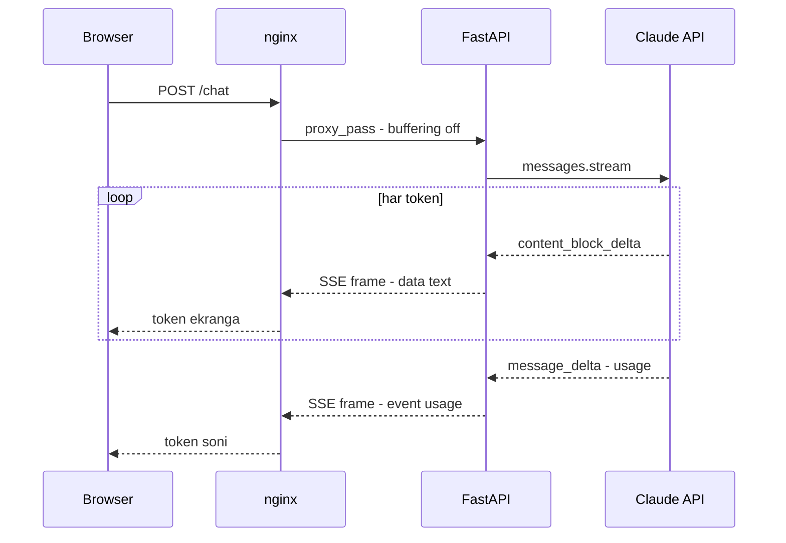

# 01. Serving — FastAPI, SSE va WebSocket

Chatbot'ni ishlab chiqdingiz — endi uni brauzer yoki mobil ilova ulanadigan **API** qilib berish kerak. Bu AI engineer'ning eng birinchi production vazifasi. 1-bo'limda siz Anthropic SSE oqimini **iste'molchi** sifatida ko'rdingiz (`stream.text_stream`); endi **server** tomonini yozasiz: Claude'dan kelgan token'larni o'z HTTP oqimingizga tarjima qilib, foydalanuvchiga uzatasiz. hh.uz'dagi AI Engineer vakansiyalarida `WebSocket` ochiq talab qilinadi — shu darsda ikkala protokol ham ishlaydigan kod bilan chiqadi.

---

## Nazariya (~30%)

### Ikki oqim, va siz ular orasidasiz

1-bo'limda ko'rgan asosiy fakt (Huyen Ch9): **total latency = TTFT + TPOT × output tokenlar**.

- **TTFT** (time to first token) — birinchi token'gacha kutish. Foydalanuvchi sezadigan yagona narsa.
- **TPOT** (time per output token) — keyingi har token orasidagi vaqt. O'qish tezligidan tez bo'lsa (~6-8 token/s) yetadi.

Streaming umumiy vaqtni kamaytirmaydi — u TTFT'ni 10-15 barobar tushiradi. Bu **UX metrikasi**, p99 emas.

Server tomonda muhim tushuncha shundaki, sizda **ikkita alohida oqim** bor:



Chapdagi oqim (Claude → sizning server) va o'ngdagi oqim (server → brauzer) — **ikki xil protokol**. Siz o'rtada turib tarjimon vazifasini bajarasiz: Claude'ning `content_block_delta` event'ini olib, brauzer tushunadigan SSE frame'iga o'rab uzatasiz.

### SSE protokoli — nima u

**SSE** (Server-Sent Events) — bitta oddiy HTTP javob ustida ishlaydigan bir tomonlama oqim. Server ulanishni ochiq ushlaydi va `text/event-stream` formatida matn frame'larini yozib boradi. Frame formati juda sodda:

```
event: delta
data: {"text": "Redis"}
id: 42

```

- `data:` — asosiy yuk (bir frame ko'p `data:` qatoridan iborat bo'lishi mumkin).
- `event:` — frame turi; brauzerda `source.addEventListener("delta", ...)` bilan ushlanadi.
- `id:` — frame identifikatori. Ulanish uzilsa, brauzer avtomatik qayta ulanib, oxirgi ko'rgan id'ni `Last-Event-ID` header'ida yuboradi.
- Bo'sh qator (`\n\n`) — frame chegarasi.

Backend tilida: SSE = **chunked HTTP javob + kelishilgan matn formati**. Hech qanday yangi transport emas — shuning uchun barcha load balancer, proxy va CDN uni tushunadi.

### SSE vs WebSocket

| Xususiyat | SSE | WebSocket |
|---|---|---|
| Yo'nalish | Bir tomonlama (server → client) | Ikki tomonlama (full-duplex) |
| Transport | Oddiy HTTP | HTTP'dan `Upgrade` qilinadi |
| Auto-reconnect | Brauzer o'zi qiladi (`Last-Event-ID`) | Qo'lda yozasiz |
| Proxy/LB bilan | Muammosiz (oddiy HTTP) | Alohida config kerak |
| Auth | Oddiy (Cookie/header) | Murakkabroq |
| Qachon | Token oqimini ko'rsatish | Interrupt, HITL, ovoz, bidirectional |

**Sanoat konsensusi (2026):** barcha yirik provider'lar — OpenAI, Anthropic, Google — token oqimida **SSE** ishlatadi. Sababi: bir tomonlama token oqimiga full-duplex kerak emas, SSE esa soddaroq va infratuzilma bilan mos.

WebSocket qachon kerak bo'ladi:
- **Interrupt** — foydalanuvchi javob oqayotganda "stop" bosadi (ulanishni yopmasdan).
- **HITL** (human-in-the-loop) — agent amal bajarishdan oldin tasdiq so'raydi.
- **Ovoz / real-time** — ikki tomonlama audio.
- **Multi-agent** — server ham xohlagan paytda xabar yuboradi.

> **Oltin qoida:** bir tomonlama token oqimiga SSE — default va soddaroq tanlov. WebSocket'ni "zamonaviyroq" deb tanlash — keng tarqalgan xato: reconnect, LB config va auth murakkabligini bejiz olib kelasiz.

Eslatma: Handbook (kitob, 2024) "LLM services often use WebSockets to stream each token" deydi — bu 2026 konsensusiga to'liq mos emas. Kitob yozilgan paytda amaliyot xilma-xil edi; bugungi standart SSE.

---

## Amaliyot (~70%)

Har misol mustaqil fayl. `.env` da `ANTHROPIC_API_KEY` bor. O'rnatish: `pip install anthropic fastapi uvicorn sse-starlette python-dotenv`.

Diqqat: server tomonida **`AsyncAnthropic`** ishlatamiz (1-bo'limdagi sync `Anthropic` emas) — FastAPI event loop'ini bloklamaslik uchun. Shakli bir xil, faqat `async with` va `async for`.

### Predict / Run

#### 1. Tarjimon: API event → SSE frame

> **Bashorat qiling:** quyidagi generator har `yield`da nima qaytaradi — token'ning o'zinimi yoki tayyor SSE matnnimi?

```python
# 01_translator.py
import asyncio
import json
import anthropic
from dotenv import load_dotenv

load_dotenv()
client = anthropic.AsyncAnthropic()

async def sse_frames(question: str):
    """Claude oqimini brauzerga ketadigan SSE frame'lariga tarjima qiladi."""
    async with client.messages.stream(
        model="claude-opus-4-8",
        max_tokens=300,
        messages=[{"role": "user", "content": question}],
    ) as stream:
        async for text in stream.text_stream:                       # Claude'dan token bo'lagi
            yield "event: delta\ndata: " + json.dumps({"text": text}, ensure_ascii=False) + "\n\n"
        final = await stream.get_final_message()                    # oxirida to'liq Message
        yield "event: usage\ndata: " + json.dumps({"output_tokens": final.usage.output_tokens}) + "\n\n"

async def main():
    async for frame in sse_frames("Redis nega single-threaded? Bir jumla."):
        print(repr(frame))

asyncio.run(main())

# Output:
# 'event: delta\ndata: {"text": "Redis"}\n\n'
# 'event: delta\ndata: {"text": " bitta"}\n\n'
# ...
# 'event: usage\ndata: {"output_tokens": 41}\n\n'
```

Har `yield` — tayyor **SSE frame** (matn), token'ning o'zi emas. Bu generator hali HTTP'ga ulanmagan; keyingi qadamda uni FastAPI javobiga ulaymiz. Asosiy fikr: **Claude oqimi ≠ sizning HTTP oqimingiz** — siz tarjimonsiz.

#### 2. FastAPI /chat SSE endpoint

`sse-starlette`'ning `EventSourceResponse`'i frame formatlashni o'zi qiladi — siz faqat `dict` qaytarasiz (`event`, `data`, `id` kalitlari bilan).

```python
# 02_app_sse.py
import json
import anthropic
from fastapi import FastAPI, Request
from pydantic import BaseModel
from sse_starlette.sse import EventSourceResponse
from dotenv import load_dotenv

load_dotenv()
app = FastAPI()
client = anthropic.AsyncAnthropic()

class ChatIn(BaseModel):
    content: str

@app.post("/chat")
async def chat(body: ChatIn, request: Request):
    async def gen():
        async with client.messages.stream(
            model="claude-opus-4-8",
            max_tokens=800,
            messages=[{"role": "user", "content": body.content}],
        ) as stream:
            async for text in stream.text_stream:
                if await request.is_disconnected():                 # client ketdi -> generatsiyani to'xtatamiz
                    break
                yield {"event": "delta", "data": json.dumps({"text": text}, ensure_ascii=False)}
            final = await stream.get_final_message()
            yield {"event": "usage",
                   "data": json.dumps({"input_tokens": final.usage.input_tokens,
                                       "output_tokens": final.usage.output_tokens})}
    return EventSourceResponse(gen(), headers={"X-Accel-Buffering": "no"})

# Ishga tushirish: uvicorn 02_app_sse:app --port 8000
# Output (server logi):
# INFO:     Uvicorn running on http://127.0.0.1:8000
# INFO:     127.0.0.1 - "POST /chat HTTP/1.1" 200 OK
```

Uch muhim nuqta:

1. `request.is_disconnected()` — foydalanuvchi tab'ni yopsa, siz stream'ni to'xtatasiz. `break` context manager'dan chiqadi → Claude ulanishi yopiladi → **qolgan token'lar generatsiya qilinmaydi va siz ularni to'lamaysiz** (1-bo'limdagi cancel'ning server versiyasi).
2. `usage` frame — oxirida alohida event sifatida yuboriladi. Brauzer input/output token sonini shundan oladi (narx nazorati).
3. `X-Accel-Buffering: no` — nginx'ga "bu javobni buferlamang" signali. Buni pastda batafsil ko'ramiz.

#### 3. WebSocket variant — interrupt bilan

Xuddi shu chat, endi WebSocket'da. Farqi: foydalanuvchi javob oqayotganda **ulanishni yopmasdan** "stop" yuborishi mumkin. Buning uchun oqim va kiruvchi xabarni **parallel** kuzatamiz.

```python
# 03_app_ws.py (02'dagi app'ga qo'shiladi)
import asyncio
from fastapi import WebSocket, WebSocketDisconnect

@app.websocket("/chat/ws")
async def chat_ws(ws: WebSocket):
    await ws.accept()
    try:
        while True:
            first = await ws.receive_json()          # {"type": "ask", "content": "..."}
            await stream_to_ws(ws, first["content"])
    except WebSocketDisconnect:
        print("client uzildi")

async def stream_to_ws(ws: WebSocket, question: str):
    stop = asyncio.Event()

    async def watch_stop():                          # javob oqayotganda kelgan "stop"ni kutamiz
        while not stop.is_set():
            msg = await ws.receive_json()
            if msg.get("type") == "stop":
                stop.set()
                return

    watcher = asyncio.create_task(watch_stop())
    try:
        async with client.messages.stream(
            model="claude-opus-4-8", max_tokens=1000,
            messages=[{"role": "user", "content": question}],
        ) as s:
            async for text in s.text_stream:
                if stop.is_set():
                    await ws.send_json({"type": "stopped"})
                    break                            # stream yopiladi -> generatsiya to'xtaydi
                await ws.send_json({"type": "delta", "text": text})
            else:                                    # break bo'lmasa - oqim to'liq tugadi
                final = await s.get_final_message()
                await ws.send_json({"type": "done", "output_tokens": final.usage.output_tokens})
    finally:
        watcher.cancel()

# Output (WebSocket xabarlar oqimi, client tomonda):
# {"type": "delta", "text": "Redis"}
# {"type": "delta", "text": " bitta"}
# {"type": "stopped"}          # foydalanuvchi o'rtada "stop" yubordi
```

Bu yerda WebSocket'ning SSE'da bo'lmagan kuchi ko'rinadi: `watch_stop` javob oqayotgan paytda **bir vaqtda** kiruvchi xabarni tinglaydi. SSE'da client faqat butun ulanishni yopib to'xtata olardi — bu yerda esa ulanish ochiq qoladi, keyingi savolga tayyor.

Eslatma: bu soddalashtirilgan namuna. Production'da `receive_json` ni bitta joyda o'qib, natijani `asyncio.Queue`ga yo'naltirish kerak — aks holda `watch_stop` keyingi savolni "yeb qo'yishi" mumkin. Namunada g'oyani ko'rsatish uchun soddalashtirdik.

#### 4. nginx.conf — SSE'ni buzmaslik uchun

Localhost'da hamma narsa ishlaydi. nginx ortiga qo'ysangiz "token'lar bittalab kelmayapti, hammasi birdan tushyapti" muammosi paydo bo'ladi. Sabab — nginx javobni **buferlaydi**.

```nginx
# nginx.conf fragmenti

location /chat {
    proxy_pass http://app_upstream;
    proxy_http_version 1.1;

    # --- SSE uchun eng muhim uch sozlama ---
    proxy_buffering off;              # nginx token'larni yig'ib bir bo'lakda yubormasin
    proxy_cache off;                  # oqim keshga tushmasin
    add_header X-Accel-Buffering no;  # ilova ham buferni o'chirishni so'raydi

    proxy_read_timeout 300s;          # LLM javobi 60s default'ga sig'maydi
    chunked_transfer_encoding on;
}

location /chat/ws {
    proxy_pass http://app_upstream;
    proxy_http_version 1.1;
    proxy_set_header Upgrade $http_upgrade;     # WebSocket handshake
    proxy_set_header Connection "upgrade";
    proxy_read_timeout 3600s;                   # WebSocket uzoq ochiq turadi
}
```

`gzip` ni ham streaming route'da o'chiring — u ham buferlaydi. Qoida: **streaming'ni har doim proxy ortidan test qiling**, faqat localhost'da emas.

#### 5. curl bilan SSE'ni tekshirish

```bash
# -N (--no-buffer): curl javobni buferlamasin, frame kelishi bilan ko'rsatsin
curl -N -X POST http://localhost:8000/chat \
  -H "Content-Type: application/json" \
  -d '{"content": "Redis nega single-threaded? Bir jumla."}'

# Output (frame'lar bittalab oqib chiqadi):
# event: delta
# data: {"text": "Redis"}
#
# event: delta
# data: {"text": " bitta"}
#
# event: usage
# data: {"input_tokens": 14, "output_tokens": 41}
```

Agar `-N` bilan ham hamma narsa birdan chiqsa — muammo server yoki proxy tomonda buferlanishda, curl'da emas. Bu birinchi diagnostika qadami.

---

### Investigate / Modify

1. **Keep-alive ping qo'shing.** Uzoq pauzada (model uzun o'ylayotganda) proxy jim ulanishni uzishi mumkin. `EventSourceResponse(gen(), ping=10)` — sse-starlette har 10 soniyada ping (comment frame) yuboradi. Buni yoqib, `proxy_read_timeout` ni 15s ga tushirib, ping'siz vs ping bilan farqni kuzating. Nega ping ulanishni tirik ushlaydi?

2. **Suhbat tarixini sessiyada saqlang.** Hozir har `/chat` chaqiruvi kontekstsiz. `session_id` ni body'ga qo'shing va `history: dict = {}` da har sessiya uchun `messages` ro'yxatini yuriting: kirishda user xabarini qo'shing, `get_final_message()` dan keyin assistant javobini qo'shing. Nega bu dict'ni process xotirasida saqlash bir nechta replica bo'lganda sinadi? (Javob: keyingi darslarda — Redis.)

3. **`is_disconnected()` tekshiruvini olib tashlang.** Foydalanuvchi tab'ni yopganda server logida nima o'zgaradi? Token'lar generatsiya qilinishda davom etadimi? Bu farq — bu sizning pulingiz.

---

### Make

**Mini-challenge:** `docqa` (4-bo'lim) javobida matn bilan birga **citations** (manba iqtiboslari) qaytadi. `/chat/stream` endpoint yozing: matn token'larini `event: delta` bilan, har yangi citation'ni esa **alohida** `event: citation` frame bilan yuboring. Frontend token'ni asosiy panelga, citation'larni yon panelga chizadi.

Maslahat: `stream.text_stream` faqat matn beradi — citation'larni ko'rish uchun xom event'larni iteratsiya qiling (`async for event in stream`) va `content_block_delta` ichida `delta.type == "citations_delta"` ni ushlang.

<details>
<summary>Yechim</summary>

```python
# make_citations_sse.py
import json
import anthropic
from fastapi import FastAPI
from pydantic import BaseModel
from sse_starlette.sse import EventSourceResponse
from dotenv import load_dotenv

load_dotenv()
app = FastAPI()
client = anthropic.AsyncAnthropic()

class AskIn(BaseModel):
    question: str
    document: str

@app.post("/chat/stream")
async def chat_stream(body: AskIn):
    async def gen():
        source = {"type": "document",
                  "source": {"type": "text", "media_type": "text/plain", "data": body.document},
                  "title": "manba.txt",
                  "citations": {"enabled": True}}
        async with client.messages.stream(
            model="claude-opus-4-8", max_tokens=600,
            messages=[{"role": "user",
                       "content": [source, {"type": "text", "text": body.question}]}],
        ) as stream:
            async for event in stream:
                if event.type != "content_block_delta":
                    continue
                if event.delta.type == "text_delta":                # oddiy matn -> delta frame
                    yield {"event": "delta",
                           "data": json.dumps({"text": event.delta.text}, ensure_ascii=False)}
                elif event.delta.type == "citations_delta":         # iqtibos -> alohida frame
                    c = event.delta.citation
                    yield {"event": "citation",
                           "data": json.dumps({"source": c.document_title,
                                               "cited_text": c.cited_text}, ensure_ascii=False)}
            final = await stream.get_final_message()
            yield {"event": "usage",
                   "data": json.dumps({"output_tokens": final.usage.output_tokens})}
    return EventSourceResponse(gen(), headers={"X-Accel-Buffering": "no"})

# Output (curl -N bilan):
# event: delta
# data: {"text": "MVCC har"}
#
# event: delta
# data: {"text": " tranzaksiya uchun snapshot yaratadi"}
#
# event: citation
# data: {"source": "manba.txt", "cited_text": "Multiversion Concurrency Control ..."}
#
# event: usage
# data: {"output_tokens": 88}
```

Asosiy g'oya: bitta oqimda **ikki xil** frame turi ketmoqda (`delta` va `citation`), va frontend `event:` maydoniga qarab qaysi panelga yozishni hal qiladi. Bu — SSE `event:` maydonining aynan kerak bo'ladigan joyi.
</details>

---

## Tuzoqlar

| Xato | Nima bo'ladi | To'g'ri yechim |
|---|---|---|
| **Streaming'ni faqat localhost'da test qilish** | Proxy ortida token'lar bir bo'lakda keladi — buferlash | Har doim nginx/LB ortidan `curl -N` bilan test |
| **`proxy_buffering off` unutish** | Foydalanuvchi TTFT afzalligini umuman ko'rmaydi | nginx'da `proxy_buffering off` + `X-Accel-Buffering: no` |
| **`proxy_read_timeout` 60s qoldirish** | Uzun javob o'rtasida ulanish uziladi | LLM route uchun 300s va keep-alive ping |
| **O'rtacha latency'ga qarash** | Bitta 3000ms outlier o'rtachani 390ms qilib yashiradi | p95/p99 percentile'lar (05-darsda) |
| **`is_disconnected()` ni tekshirmaslik** | Foydalanuvchi ketsa ham token generatsiya bo'ladi — pul yonadi | Har delta'dan oldin disconnect tekshiruvi |
| **Bir tomonlama oqimga WebSocket tanlash** | Bejiz reconnect, LB config, auth murakkabligi | Default SSE; WebSocket faqat bidirectional kerak bo'lsa |

**O'rtacha latency aldashi** alohida e'tiborga loyiq: `/chat` endpoint'ingiz "o'rtacha 400ms TTFT" ko'rsatsa ham, foydalanuvchilarning 5%'i 3 soniya kutayotgan bo'lishi mumkin. Bitta sekin outlier o'rtachani pasaytiradi. Shuning uchun serving metrikasi **doim percentile'da** o'lchanadi — buni 05-darsda (Observability) kod bilan quramiz.

---

## Retrieval practice

1. Streaming umumiy latency'ni kamaytiradimi? Server tomonda uni nega baribir yoqamiz — ikkita sabab ayting.
2. "Ikki oqim" nima degani? Server SSE endpoint'ida qaysi ikki oqim orasida turasiz?
3. Bir tomonlama token oqimi uchun SSE va WebSocket'dan qaysi biri to'g'ri va nega? WebSocket qachon zarur bo'ladi — ikkita holat ayting.
4. `proxy_buffering off` va `X-Accel-Buffering: no` bo'lmasa foydalanuvchi nima ko'radi? Buni localhost'da sezasizmi?
5. SSE endpoint'da `request.is_disconnected()` ni tekshirmasangiz qanday zarar ko'rasiz?
6. WebSocket'da "stop" interrupt'ini SSE'da nega xuddi shunday qilib bo'lmaydi?

---

## Manbalar

- **Chip Huyen, Ch 9 — Inference Optimization**: TTFT/TPOT/total latency, streaming mode va uning "ko'rsatishdan oldin score qilib bo'lmaydi" xavfi.
- **LLM Engineer's Handbook, Ch 10 — Inference Pipeline Deployment**: online real-time inference, token streaming (kitob WebSocket deydi — 2026 konsensusi SSE).
- 1-bo'lim, `03. Streaming` — iste'molchi tomoni (`text_stream`, cancel, `get_final_message`); bu dars uning server davomi.
- SSE vs WebSockets LLM uchun: `https://www.buildmvpfast.com/blog/streaming-llm-responses-sse-vs-websockets-2026`
- SSE 2026'da nega yetarli: `https://procedure.tech/blogs/sse-for-llms/`
- Token streaming arxitekturasi: `https://zknill.io/posts/ai-token-streaming-isnt-about-sse-vs-websockets/`
- nginx orqali end-to-end SSE: `https://dev.to/martin_palopoli/how-i-implemented-end-to-end-sse-streaming-from-llm-to-browser-through-nginx-4bjo`
- FastAPI SSE: `https://fastapi.tiangolo.com/tutorial/server-sent-events/`
- Anthropic streaming: `https://platform.claude.com/docs/en/build-with-claude/streaming`

---

Keyingi dars: [02. Lokal LLM serving — Ollama va vLLM.md](02.%20Lokal%20LLM%20serving%20—%20Ollama%20va%20vLLM.md)
