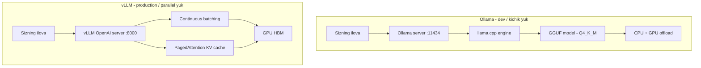

# 02. Lokal LLM serving — Ollama va vLLM

Ba'zi loyihada Claude API mumkin emas: davlat, bank yoki sog'liqni saqlash sektorida ma'lumot tashqi serverga chiqmasligi shart. Bunday holatda modelni **o'z serveringizda** ishga tushirasiz. Yaxshi xabar — foydalanish tomoni deyarli o'zgarmaydi: Ollama ham, vLLM ham OpenAI-compatible endpoint beradi, ya'ni bitta klient kodi bir nechta backend'ga ulanadi. hh.uz vakansiyalarida `Ollama`, `vLLM`, `LMStudio` ochiq yoziladi — bu darsdan keyin CV'da "lokal LLM serving" deb yoza olasiz.

---

## Nazariya (~30%)

### Nega lokal LLM

| Sabab | Nima demoqchi |
|---|---|
| **Privacy** | Ma'lumot tashqi API'ga umuman chiqmaydi — regulyatsiya talabi |
| **Narx nazorati** | Katta hajmda o'z GPU'ingiz Claude API'dan arzon bo'lishi mumkin |
| **Offline / edge** | Internetsiz yoki yopiq tarmoqda ishlaydi |
| **Vendor lock-in yo'q** | Provider narx oshirsa yoki modelni o'chirsa, siz bog'lanib qolmaysiz |

Narxi ham bor: sifat odatda Claude'dan past, GPU va DevOps mehnati sizniki, model versiyalash o'z zimmangizda. Qaror — bu **build vs buy** savoli (Huyen), texnik moda emas.

### Ikki stack: Ollama va vLLM



**Ollama** — Docker'ga o'xshaydi: `ollama pull`, `ollama run` va model 2 daqiqada ishlaydi. Ostida **llama.cpp** engine va **GGUF** format (llama.cpp'ning model fayli). GGUF `Q4_K_M` kabi **quantization** (og'irliklarni past aniqlikda saqlash) darajalarini beradi.

`Q4_K_M` nima degani (Handbook Ch8): og'irliklar 16-bit o'rniga ~4-bit'da saqlanadi. Xotira ~4 barobar kamayadi, sifat biroz tushadi. Shuning uchun 8B model noutbukda ~5GB joy egallaydi va CPU'da ham ishlaydi. Ollama'ning kuchi shu — Mac yoki oddiy serverda GPU shart emas. Zaif tomoni: so'rovlarni **ketma-ket** (sequential) ishlaydi — parallel yukda navbat hosil bo'ladi.

**vLLM** — production uchun. Uni tez qiladigan ikki g'oya (KONTSEPT darajasida, ichki mexanika ML Engineer yo'lida):

**1. Continuous batching — avtobus analogiyasi.** Oddiy batching'da avtobus to'lguncha kutasiz, hamma birga jo'naydi, eng sekin yo'lovchi hammani ushlab turadi. Continuous batching'da esa har bekatda tushgan yo'lovchi o'rniga darhol yangisi chiqadi — avtobus doim to'la. GPU ham shunday: tugagan so'rov o'rniga darhol yangisi kiradi, GPU hech qachon bo'sh turmaydi.

**2. PagedAttention — OS paging analogiyasi.** Siz OS'dan bilasiz: virtual xotira jismoniy RAM'ni **sahifalarga** (page) bo'ladi, contiguous (ketma-ket) blok shart emas, fragmentatsiya yo'q. PagedAttention aynan shu g'oyani **KV cache**ga (oldingi token'larning key/value'lari keshi) qo'llaydi — KV cache bloklarga bo'linadi, fragmentatsiya yo'qoladi, xotira ~55% tejaladi. Natija: bir xil GPU'da ~2x ko'p so'rov.

Bu ikkisi birga vLLM'ga teng hardware'da Ollama'dan **8-9x throughput** beradi — lekin GPU majburiy.

### Qaysi birini qachon — 20-concurrent qoidasi

> **Oltin qoida (2026 konsensus):** ~20 parallel so'rovgacha, dev, Mac yoki CPU'da → **Ollama**. 20+ parallel, GPU serveri, SLO bor → **vLLM**.

Raqamlar bilan: 50 parallel foydalanuvchida Ollama TTFT ~3.2s (navbat), vLLM ~145ms (continuous batching). Ko'p jamoa ikkalasini ishlatadi: dasturchi noutbukida Ollama, production'da vLLM.

**Metrikalar tili (Huyen Ch9 — intervyu savoli):** `TTFT` prefill davomiyligi, **compute-bound**; `TPOT` decode, **memory bandwidth-bound**; `throughput` (token/s) va `latency` orasida trade-off (batching throughput'ni oshiradi, latency'ni yomonlashtiradi); `goodput` = SLO'ni qondirgan so'rovlar soni. `nvidia-smi` "GPU utilization" **aldaydi** — u band vaqtni ko'rsatadi, samaradorlikni emas.

---

## Amaliyot (~70%)

**Muhim istisno.** Bu darsda `openai` SDK'ni import qilamiz — bu kursdagi **yagona** joy. Sabab ochiq: Ollama va vLLM `/v1/chat/completions` (OpenAI-compatible) endpoint beradi, `openai` SDK esa shu protokolning tayyor klienti. Bu **framework emas**, oddiy HTTP klient — `base_url`ni localhost'ga qaratamiz, xolos. Claude API bu protokolni bermaydi (buni pastda ko'ramiz).

O'rnatish: `pip install openai anthropic python-dotenv`.

### Predict / Run

#### 1. Ollama: model tortish va REST chaqiruv

```bash
# 1. Modelni tortamiz (~4.7GB, GGUF Q4_K_M)
ollama pull llama3.1:8b

# 2. Interaktiv sinov
ollama run llama3.1:8b "Idempotency key nega kerak? Bir jumla."

# 3. REST API :11434 da avtomatik ochiladi (o'z formatida)
curl http://localhost:11434/api/generate -d '{
  "model": "llama3.1:8b",
  "prompt": "Connection pool nega kerak? Bir jumla.",
  "stream": false
}'

# Output:
# {"model":"llama3.1:8b",
#  "response":"Connection pool har so'rovda yangi ulanish ochish xarajatini oldini oladi.",
#  "done":true,"eval_count":22, ... }
```

Ollama ikki xil endpoint beradi: o'z formati (`/api/generate`) va OpenAI-compatible (`/v1/...`). Biz keyingisini ishlatamiz — chunki u vLLM va OpenAI bilan bir xil.

#### 2. openai SDK'ni localhost'ga qaratish

> **Bashorat qiling:** javob shakli (`resp.choices[0]...`) Claude'nikidan (`resp.content[0].text`) farq qiladimi?

```python
# 02_ollama_client.py
from openai import OpenAI
from dotenv import load_dotenv

load_dotenv()

# base_url -> localhost; api_key Ollama tomonidan e'tiborga olinmaydi, lekin SDK talab qiladi
client = OpenAI(base_url="http://localhost:11434/v1", api_key="ollama")

resp = client.chat.completions.create(
    model="llama3.1:8b",
    messages=[{"role": "user", "content": "HTTP 429 nima? Bir jumla."}],
    max_tokens=60,
)

print(resp.choices[0].message.content)                  # <- OpenAI shakli, Claude'dan farqli
print("output_tokens:", resp.usage.completion_tokens)

# Output:
# HTTP 429 - Too Many Requests, ya'ni rate limit oshib ketdi degani.
# output_tokens: 19
```

Ha, shakl farq qiladi: `resp.choices[0].message.content` (OpenAI) vs `resp.content[0].text` (Anthropic). Xuddi shu kod bilan Ollama'dan vLLM'ga o'tish uchun faqat `base_url`ni almashtirish yetadi.

#### 3. vLLM: serve va Docker compose

```bash
# Variant A: to'g'ridan-to'g'ri
pip install vllm
vllm serve Qwen/Qwen2.5-7B-Instruct \
  --served-model-name qwen \
  --max-model-len 8192
# :8000 da OpenAI-compatible /v1/chat/completions ochiladi

# Output:
# INFO ... Started vLLM V1 engine
# INFO ... Uvicorn running on http://0.0.0.0:8000
```

Production'da odatda Docker image ishlatiladi:

```yaml
# docker-compose.yml fragmenti
services:
  vllm:
    image: vllm/vllm-openai:latest
    command: >
      --model Qwen/Qwen2.5-7B-Instruct
      --served-model-name qwen
      --max-model-len 8192
    ports:
      - "8000:8000"
    ipc: host
    deploy:
      resources:
        reservations:
          devices:
            - driver: nvidia
              count: all
              capabilities: [gpu]
```

`--served-model-name qwen` — modelga qisqa **alias** beradi (klientda uzun HuggingFace yo'lini yozmaslik uchun). `ipc: host` — vLLM'ning umumiy xotira talabini qondiradi. `deploy.resources` — Docker'ga GPU'ni ko'rsatadi.

#### 4. Bitta klient, uch backend

Bu — provider-agnostik klient. Faqat `base_url` o'zgaradi, qolgan hammasi bir xil.

```python
# 04_multi_backend.py
from openai import OpenAI
from dotenv import load_dotenv

load_dotenv()

BACKENDS = {
    "ollama": ("http://localhost:11434/v1", "llama3.1:8b"),
    "vllm":   ("http://localhost:8000/v1",  "qwen"),
}

def make_client(backend: str) -> OpenAI:
    url, _ = BACKENDS[backend]
    return OpenAI(base_url=url, api_key="local")        # kalit e'tiborga olinmaydi

def ask(backend: str, question: str) -> str:
    client = make_client(backend)
    _, model = BACKENDS[backend]
    resp = client.chat.completions.create(
        model=model,
        messages=[{"role": "user", "content": question}],
        max_tokens=80,
    )
    return resp.choices[0].message.content

print("[ollama]", ask("ollama", "Redis nega tez? Bir jumla."))
print("[vllm]  ", ask("vllm", "Redis nega tez? Bir jumla."))

# Output:
# [ollama] Redis ma'lumotni RAM'da saqlaydi, shuning uchun disk kutmaydi.
# [vllm]   Redis in-memory bo'lgani uchun disk I/O yo'q va latency mikrosekundlarda.
```

Bir kod — uch endpoint. Bu 1-bo'limdagi OpenAI-compatible pattern'ning davomi: klientni provider'ga bog'lamaslik.

#### 5. Lokal modelda streaming

01-darsdagi SSE endpoint aynan shu oqimni foydalanuvchiga uzatadi — faqat manba endi Claude emas, lokal model. OpenAI SDK'da streaming shakli boshqacha: `chunk.choices[0].delta.content`.

```python
# 05_local_stream.py
from openai import OpenAI
from dotenv import load_dotenv

load_dotenv()
client = OpenAI(base_url="http://localhost:11434/v1", api_key="ollama")

stream = client.chat.completions.create(
    model="llama3.1:8b",
    messages=[{"role": "user", "content": "Connection pool nega kerak? 3 jumla."}],
    max_tokens=200,
    stream=True,
)

for chunk in stream:
    delta = chunk.choices[0].delta.content              # bo'lak yoki None
    if delta:
        print(delta, end="", flush=True)
print()

# Output (token-token oqadi):
# Connection pool har so'rovda yangi TCP ulanish ochish xarajatini oldini oladi.
# Ulanishlar oldindan yaratilib qayta ishlatiladi. Bu latency va resurs sarfini kamaytiradi.
```

Diqqat: Anthropic'da `stream.text_stream` matnni to'g'ridan-to'g'ri berardi; OpenAI shaklida `chunk.choices[0].delta.content` `None` bo'lishi mumkin (masalan birinchi/oxirgi chunk'da), shuning uchun `if delta` tekshiruvi shart. Bu — protokol farqi, model farqi emas.

#### 6. Claude OpenAI-compatible EMAS — adapter pattern

Vasvasaga tushmang: `openai` klientni Claude'ga qaratib bo'lmaydi (Anthropic bunday endpoint bermaydi). Ilovada backend'ni almashtira olish uchun **o'z adapteringizni** yozasiz.

```python
# 06_adapter.py
import anthropic
from openai import OpenAI
from dotenv import load_dotenv

load_dotenv()

def chat(backend: str, question: str) -> str:
    if backend == "claude":                             # Anthropic - o'z SDK, o'z shakli
        c = anthropic.Anthropic()
        r = c.messages.create(
            model="claude-opus-4-8", max_tokens=120,
            messages=[{"role": "user", "content": question}],
        )
        return r.content[0].text
    # Ollama / vLLM - OpenAI-compatible, bitta yo'l
    urls = {"ollama": "http://localhost:11434/v1", "vllm": "http://localhost:8000/v1"}
    models = {"ollama": "llama3.1:8b", "vllm": "qwen"}
    c = OpenAI(base_url=urls[backend], api_key="local")
    r = c.chat.completions.create(
        model=models[backend], max_tokens=120,
        messages=[{"role": "user", "content": question}],
    )
    return r.choices[0].message.content

for b in ("claude", "ollama", "vllm"):
    print(b, "->", chat(b, "Idempotency nima? Bir jumla."))

# Output:
# claude -> Idempotency - bir amalni bir necha marta bajarilsa ham natija bir xil bo'lishi.
# ollama -> Idempotency degani amalni takrorlash natijani o'zgartirmasligi.
# vllm   -> Idempotent amal bir necha marta chaqirilsa ham holatni bir xil qoldiradi.
```

Bu `if/else` — kichik **adapter**. Katta ilovada uni alohida modulga ajratasiz (`llm.py`), shunda backend almashtirish bir joyda bo'ladi. `docqa` loyihasi ham aynan shu tarzda tashqi modelga bog'lanadi.

---

### Investigate / Modify

1. **vLLM'da structured output — guided decoding.** vLLM javobni JSON schema'ga majburlay oladi (grammatika token darajasida cheklaydi). `extra_body={"guided_json": schema}` qo'shing:

   ```python
   schema = {"type": "object",
             "properties": {"service": {"type": "string"},
                            "status": {"type": "string", "enum": ["up", "down"]}},
             "required": ["service", "status"]}
   resp = client.chat.completions.create(
       model="qwen",
       messages=[{"role": "user", "content": "payments-api ishlamayapti. JSON qaytar."}],
       extra_body={"guided_json": schema},          # vLLM guided decoding
       max_tokens=60,
   )
   # Output: {"service": "payments-api", "status": "down"}
   ```
   `guided_json` faqat vLLM'da bor (Ollama'da `format` parametri). Nega guided decoding "modelni ishontirishdan" ishonchliroq? (Javob: grammatika token generatsiyasini cheklaydi, promptga qaraganda kafolatliroq.)

2. **04-misolda `max_tokens` ni 500 ga oshiring va ikkala backend'da vaqtni o'lchang.** Bitta so'rovda Ollama vLLM'dan sekinmi yoki tezmi? (Ipucha: bitta so'rovda Ollama TTFT ba'zan tezroq — continuous batching afzalligi faqat parallel yukda ko'rinadi.)

3. **06-adapterga `try/except` qo'shing:** lokal server o'chiq bo'lsa (`APIConnectionError`) Claude'ga fallback qiling. Bu qaysi production pattern'ga o'xshaydi? (Javob: gateway fallback — 04-darsda batafsil.)

---

### Make

**Mini-challenge:** mini-benchmark skripti yozing. Bir xil promptni **N marta parallel** (threading bilan) yuborsin va har so'rov uchun `TTFT` va `total` vaqtni o'lchasin, oxirida o'rtacha va eng yomon (max) qiymatlarni chiqarsin. Shu skript bilan "Ollama parallel yukda sekinlashadi, vLLM barqaror" faktini o'z ko'zingiz bilan ko'rasiz.

Signatura: `def bench(base_url: str, model: str, prompt: str, n: int = 5) -> None`.

<details>
<summary>Yechim</summary>

```python
# make_bench.py
import time
import threading
from openai import OpenAI
from dotenv import load_dotenv

load_dotenv()

def bench_one(base_url, model, prompt, out, idx):
    client = OpenAI(base_url=base_url, api_key="local")
    t0 = time.monotonic()
    ttft = None
    stream = client.chat.completions.create(
        model=model, messages=[{"role": "user", "content": prompt}],
        max_tokens=200, stream=True,
    )
    for chunk in stream:
        if chunk.choices[0].delta.content and ttft is None:
            ttft = time.monotonic() - t0                # birinchi token'gacha
    out[idx] = (ttft, time.monotonic() - t0)

def bench(base_url, model, prompt, n=5):
    out = [None] * n
    threads = [threading.Thread(target=bench_one, args=(base_url, model, prompt, out, i))
               for i in range(n)]
    wall0 = time.monotonic()
    for t in threads:
        t.start()
    for t in threads:
        t.join()
    wall = time.monotonic() - wall0

    ttfts = sorted(r[0] for r in out)
    totals = sorted(r[1] for r in out)
    print(f"n={n} parallel | wall={wall:.2f}s")
    print(f"TTFT  avg={sum(ttfts)/n:.2f}s  max={ttfts[-1]:.2f}s")
    print(f"total avg={sum(totals)/n:.2f}s  max={totals[-1]:.2f}s")

if __name__ == "__main__":
    bench("http://localhost:11434/v1", "llama3.1:8b", "Connection pool nima? 3 jumla.", n=5)

# Output (Ollama - navbat tufayli TTFT tarqoq):
# n=5 parallel | wall=6.80s
# TTFT  avg=2.10s  max=4.90s
# total avg=4.30s  max=6.75s
#
# Xuddi shu skript vLLM'da (continuous batching):
# n=5 parallel | wall=1.90s
# TTFT  avg=0.22s  max=0.31s
# total avg=1.60s  max=1.85s
```

Asosiy o'qish: Ollama'da `TTFT max` (4.90s) `avg`'dan ancha katta — oxirgi so'rov navbatda kutgan. vLLM'da esa hamma so'rov deyarli bir vaqtda boshlanadi (`max` `avg`'ga yaqin) — bu aynan continuous batching'ning ta'siri. 20-concurrent qoidasini o'z raqamingizda ko'rdingiz.
</details>

---

## Tuzoqlar

| Xato | Nima bo'ladi | To'g'ri yechim |
|---|---|---|
| **Ollama'ni production parallel yukka qo'yish** | So'rovlar navbatga tushadi, TTFT o'sadi | 20+ concurrent bo'lsa vLLM'ga o'tish |
| **`openai` klientni Claude'ga qaratishga urinish** | Ulanmaydi — Anthropic OpenAI-compatible emas | Adapter pattern: Claude alohida yo'l |
| **Bitta so'rovda vLLM'ni Ollama'dan tez deb kutish** | Afzallik ko'rinmaydi — bitta so'rovda Ollama ba'zan tezroq | vLLM'ni parallel yukda o'lchash |
| **`nvidia-smi` utilization'ga ishonish** | Band vaqtni ko'rsatadi, samaradorlikni emas | Goodput / TTFT / throughput'ni o'lchash |
| **GPU'siz vLLM ishga tushirishga urinish** | vLLM GPU talab qiladi | Dev/CPU'da Ollama, GPU serverda vLLM |
| **Katta quantization'ni "bepul" deb bilish** | Q2/Q3'da sifat sezilarli tushadi | Q4_K_M odatda muvozanat; sifatni eval bilan tekshir |

Eng ko'p uchraydigan real xato — **Ollama'ni "ishladi-ku" deb production'ga qo'yish**. Dev'da bitta foydalanuvchida a'lo ishlaydi, 30 foydalanuvchi kelganda navbat hosil bo'ladi va TTFT sekundlarga chiqadi. 20-concurrent qoidasi aynan shu holatning oldini oladi.

---

## Chuqurroq nima bor (yo'nalish)

Ichki mexanika — CUDA kernel'lar, `GPTQ`/`AWQ`/`EXL2` quantization algoritmlari farqi, tensor vs pipeline parallelism, speculative decoding — bu darsda foydalanish darajasida qoldi. Chuqurligi **ML Engineer** yo'lida (inference optimization boblari). Bu yerdagi maqsad: qaysi vaziyatda qaysi stack'ni tanlashni va nega tezligi farq qilishini bilish — vakansiya va intervyu uchun yetadigan daraja.

---

## Retrieval practice

1. Ollama va vLLM'dan qaysi biri Mac noutbukda, GPU'siz ishlaydi va nega?
2. `Q4_K_M` quantization nimani tejaydi va evaziga nima yo'qoladi?
3. Continuous batching'ni avtobus analogiyasi bilan tushuntiring — u nega GPU'ni bo'sh qoldirmaydi?
4. PagedAttention qaysi OS tushunchasiga o'xshaydi va u KV cache'da qaysi muammoni yechadi?
5. `openai` SDK'ni nega Claude'ga qaratib bo'lmaydi? Ilovada backend'ni almashtirishga qanday erishasiz?
6. Bitta so'rovda Ollama vLLM'dan tez bo'lishi mumkinmi? vLLM'ning afzalligi qachon ko'rinadi?

---

## Manbalar

- **LLM Engineer's Handbook, Ch 8 — Inference Optimization**: GGUF/llama.cpp, quantization (`Q4_K_M`, GPTQ/AWQ), continuous batching, PagedAttention, inference engine jadvali.
- **Chip Huyen, Ch 9 — Inference Optimization**: prefill (compute-bound) vs decode (memory bandwidth-bound), TTFT/TPOT, throughput/goodput, MFU/MBU, service-level optimizatsiya.
- 1-bo'lim, OpenAI-compatible pattern — bu darsdagi provider-agnostik klientning asosi.
- vLLM OpenAI-compatible server: `https://docs.vllm.ai/en/latest/serving/online_serving/openai_compatible_server/`
- vLLM production 2026: `https://www.sitepoint.com/vllm-production-deployment-guide-2026/`
- Ollama vs vLLM 2026: `https://www.spheron.network/blog/ollama-vs-vllm/`
- Red Hat Ollama vs vLLM benchmark: `https://developers.redhat.com/articles/2025/08/08/ollama-vs-vllm-deep-dive-performance-benchmarking`

---

Keyingi dars: [03. Caching — prompt cache'dan semantic cache'gacha.md](03.%20Caching%20—%20prompt%20cache'dan%20semantic%20cache'gacha.md)
