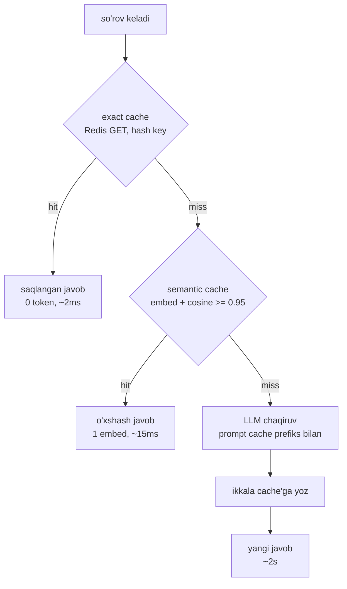

# 03. Caching — prompt cache'dan semantic cache'gacha

> **Bu darsda:** LLM app xarajatining eng katta bo'lagini — takrorlanuvchi kontentni — kesh bilan yo'qotamiz. 3 qatlam kesh (provider prompt cache, exact cache, semantic cache) har biri nimani tejashini, Anthropic prompt caching mexanikasini (prefix match, breakpoint, TTL, narx, silent invalidator'lar) va semantic cache'ning yashirin xavfini (false hit, data leak) o'rganamiz. Ishda bu — "LLM xarajatini qanday kamaytirasiz?" degan intervyu savolining birinchi va eng arzon javobi: caching = eng past kod o'zgarishi bilan eng katta g'alaba.

## Nazariya (~30%)

### 1. Muammo: siz bir xil ishni qayta-qayta to'laysiz

Backend'da agar bir xil `SELECT`'ni sekundiga ming marta bajarsangiz, Redis'ga tashlaysiz. LLM'da xuddi shu isrofgarchilik bor, faqat qimmatroq: har so'rovda modelga o'sha 4000 tokenlik system prompt'ni, o'sha uzun hujjatni qayta-qayta yuborasiz va har safar to'liq to'laysiz.

Ikki xil takror bor, ikki xil yechim talab qiladi:

- **Bir xil PREFIKS** har so'rovda qaytadi (system prompt, RAG konteksti, suhbat tarixi) — modelning o'sha qismni qayta o'qishi (prefill) qimmat.
- **Bir xil yoki o'xshash SAVOL** ko'p user'dan qaytadi ("qaytarish siyosati qanday?") — bunda LLM chaqiruvining o'zi ortiqcha.

Birinchisini provider tomonidagi **prompt caching** yechadi, ikkinchisini bizning tomondagi **response caching** (exact va semantic). Ular bir-birini almashtirmaydi — birga ishlaydi.

### 2. 3 qatlam kesh — har biri boshqa narsani tejaydi

Eng ko'p qilinadigan xato — bu uch qatlamni aralashtirish. Ular turli joyda yashaydi va turli narsani tejaydi:

| Qatlam | Qayerda | Nimani tejaydi | Kim boshqaradi |
|---|---|---|---|
| **KV cache** | Provider, bitta so'rov ichida | Decode tezligi (avtomatik) | Hech kim — provider ichida |
| **Prompt cache** (prefix) | Provider, so'rovlar aro | input token HISOBINI — LLM baribir ishlaydi | `cache_control` breakpoint |
| **Exact cache** | Bizda (Redis) | BUTUN LLM chaqiruvini — aynan bir xil so'rov | hash key + TTL |
| **Semantic cache** | Bizda (Redis + embedding) | BUTUN LLM chaqiruvini — o'xshash so'rov | cosine threshold |

Muhim farq: **prompt cache javobni saqlamaydi** — u faqat "modelga bu prefiksni qayta hisoblatma" deydi, model baribir yangi javob generatsiya qiladi. **Exact/semantic cache esa javobning o'zini** saqlaydi — hit bo'lsa LLM umuman chaqirilmaydi (0 token, millisekundlar).



Tartib ahamiyatli: **avval exact** (arzon, xavfsiz, oddiy `GET`), keyin **semantic** (bitta embed chaqiruvi kerak, xatarli), oxirida LLM. Bu Huyen'ning tavsiyasi ham: exact cache birinchi bo'lib turadi, semantic faqat fallback.

### 3. Anthropic prompt caching mexanikasi — faktlar

Bu qism intervyu savoli ("prompt caching qanday ishlaydi va nima uni buzadi?"). Faktlarni yod ol, xotiradan taxmin qilma:

| Fakt | Qiymat |
|---|---|
| Match turi | **PREFIX match** — prefiksdagi 1 bayt o'zgarsa keyingi hammasi miss |
| Render tartibi | `tools` -> `system` -> `messages` |
| Breakpoint | max 4 ta `cache_control` |
| TTL | 5 daqiqa (ephemeral) yoki 1 soat |
| Yozish narxi | 5m: 1.25x, 1h: 2x oddiy input narxidan |
| O'qish narxi | 0.1x oddiy input narxidan |
| Minimal prefiks | Opus 4.8 / Haiku 4.5 = **4096 token** — bundan kichik prefiks jimgina cache'lanmaydi |
| Break-even | 5m'da 2 so'rov, 1h'da 3+ so'rov — shundan keyin foyda |

Ikki narsa alohida diqqat talab qiladi:

- **PREFIX match** — bu redis `GET key` emas. Kesh prefiksni "boshidan shu breakpoint'gacha" hisoblab, o'sha nuqtagacha aynan bir xil bo'lgan keyingi so'rovda qayta ishlatadi. Prefiksning boshida (masalan `system`ning birinchi belgisida) bitta harf o'zgarsa — butun kesh yaroqsiz.
- **Minimal 4096 token silent** — agar cache'lamoqchi bo'lgan prefiksingiz 4096 tokendan kichik bo'lsa, API xato bermaydi, shunchaki cache'lamaydi. Siz `cache_control` yozdingiz deb o'ylaysiz, lekin `cache_read_input_tokens` doim 0 keladi.

> Oltin qoida: prompt cache ishlayotganini FAQAT `usage` maydonlaridan tekshiring. `cache_read_input_tokens` 0 bo'lsa — kesh ishlamayapti, gap tugadi. Ko'z bilan "yozdim-ku" degan ishonch bu yerda ishlamaydi.

### 4. Silent invalidator'lar — kesh jimgina o'ladigan joylar

Prefiks o'zgargani uchun kesh miss bo'ladi, lekin hech qanday xato chiqmaydi. Shuning uchun "silent". Eng ko'p uchraydiganlari:

| Invalidator | Nega buzadi |
|---|---|
| `datetime.now()` / `uuid` system prompt ichida | prefiks har so'rovda o'zgaradi -> har safar miss |
| `json.dumps` `sort_keys` siz | kalitlar tartibi tasodifiy -> bayt darajasida boshqa |
| `tools` ro'yxati o'zgarishi | `tools` = 0-pozitsiya, uni o'zgartirish hammasini buzadi |
| model almashuvi | boshqa model = boshqa cache maydoni |
| shartli system bo'limlari | ba'zi so'rovda bor, ba'zisida yo'q -> prefiks turlicha |

Tekshirish usuli bitta: ikki bir xil so'rov yuboring va `usage.cache_read_input_tokens`'ga qarang. Ikkinchisida 0 bo'lsa — prefiksingizda invalidator bor.

### 5. Semantic cache — g'oya, va nega Huyen unga shubha bilan qaraydi

**Exact cache** oddiy: so'rovni hash qilib Redis'ga kalit qilasiz. "Qaytarish siyosati qanday?" va "qaytarish siyosati qanday" (nuqtasiz) — ikki xil kalit, ikki xil kesh. Bu ko'p hit'ni o'tkazib yuboradi.

**Semantic cache** buni yechadi: so'rovni embed qilib (voyage-4, 2-bo'limdan tanish), saqlangan savollar bilan cosine o'xshashligini o'lchaydi. O'xshashlik threshold'dan yuqori bo'lsa — eski javobni qaytaradi, LLM chaqirilmaydi. "Qaytarish siyosati?" va "Mahsulotni qanday qaytaraman?" bir xil javob oladi.

Chegara shu yerda: Huyen buni ochiq **shubhali** deb ataydi — *"value is more dubious"*. Sabab — bu yerda uch narsa buzilishi mumkin: embedding sifati, threshold tanlash, vector search. Va **false hit** oddiy miss emas — u NOTO'G'RI javob qaytaradi. Foydalanuvchi "12 oy" deb so'raydi, kesh "6 oy"lik o'xshash savolning javobini beradi. Bu tejov emas, ishonch yo'qotish.

Marketing "95% hit rate" deydi. Production haqiqati (2026 raqamlari):

| Kontekst | Real hit rate | False positive |
|---|---|---|
| FAQ botlar (savollar tor) | 40-70% | threshold'ga bog'liq |
| Umumiy assistentlar | 15-35% | 1-15% |
| "95%" | marketing afsonasi | — |

Xulosa — semantic cache **hamma joyda arzimaydi**. Qachon arzimaydi: past traffic, xilma-xil so'rovlar, yuqori to'g'rilik talabi, vaqtga bog'liq javoblar ("bugungi kurs qancha?"). To'g'ri tartib: avval loglar bilan hit rate'ni **o'lchang** (bu savollar qanchalik takrorlanadi?), keyin qo'shing. Xavfni kamaytirish uchun: konservativ threshold (0.95-0.97 dan boshlang), exact cache'ni birinchi qatlam qiling, user-spesifik va vaqtga bog'liq so'rovlarni umuman cache'lamang.

## Amaliyot (~70%)

### Predict / Run: prompt caching ishlayaptimi?

Avval bashorat qil: pastdagi kodda katta system prompt'ni `cache_control` bilan belgilab, bir xil so'rovni **ikki marta** yuboramiz. Birinchi chaqiruvda `usage` qaysi maydon katta bo'ladi, ikkinchisida qaysi? Endi kodni o'qi.

```python
# prompt_cache.py — prompt caching'ni usage maydonlari bilan tekshirish
import os
import anthropic
from dotenv import load_dotenv

load_dotenv()
client = anthropic.Anthropic()

# --- 1-qadam: cache'lanadigan katta system blok (>= 4096 token bo'lishi SHART) ---
# Realda bu uzun policy hujjati yoki RAG konteksti bo'ladi. Namoyish uchun uzaytiramiz.
POLICY = "Kompaniya qaytarish siyosati: mahsulot 30 kun ichida qaytariladi. " * 400

def ask(question):
    # --- 2-qadam: cache_control FAQAT katta blokda; prefiks shu yergacha keshlanadi ---
    system_blocks = [
        {"type": "text", "text": "Sen mijoz-xizmat yordamchisisan."},
        {"type": "text", "text": POLICY, "cache_control": {"type": "ephemeral"}},
    ]
    resp = client.messages.create(
        model="claude-opus-4-8",
        max_tokens=256,
        system=system_blocks,
        messages=[{"role": "user", "content": question}],
    )
    u = resp.usage
    return u

# --- 3-qadam: bir xil system bilan ikki marta chaqiramiz ---
print("1-chaqiruv:", ask("Necha kun ichida qaytarsam bo'ladi?"))
print("2-chaqiruv:", ask("Qaytarish uchun qancha vaqtim bor?"))

# Output:
# 1-chaqiruv: Usage(input_tokens=28, cache_creation_input_tokens=5218,
#             cache_read_input_tokens=0, output_tokens=61)
# 2-chaqiruv: Usage(input_tokens=31, cache_creation_input_tokens=0,
#             cache_read_input_tokens=5218, output_tokens=58)
```

Diqqat: `input_tokens` FAQAT cache'ga tushmagan qismni sanaydi (bu yerda user savoli, ~30 token). Birinchi chaqiruvda katta prefiks `cache_creation_input_tokens`'ga (5218) yozildi, ikkinchisida `cache_read_input_tokens`'ga o'tdi. Jami prompt = uch maydonning yig'indisi. Ikkinchi chaqiruvda 5218 token 0.1x narxda o'qildi — 90% arzonlashuv.

### Investigate: silent invalidator'ni ushlash

Endi bitta harf kesh'ni qanday o'ldirishini ko'ramiz. `datetime.now()`'ni prefiksga qo'shamiz:

```python
# silent_invalidator.py — datetime prefiksni har so'rovda buzadi
import os
from datetime import datetime
import anthropic
from dotenv import load_dotenv

load_dotenv()
client = anthropic.Anthropic()
POLICY = "Kompaniya qaytarish siyosati: 30 kun ichida qaytariladi. " * 400

def ask_broken(question):
    # --- XATO: datetime prefiks ichida -> har so'rovda boshqa bayt ---
    system_blocks = [
        {"type": "text", "text": "Bugungi sana: " + datetime.now().isoformat()},
        {"type": "text", "text": POLICY, "cache_control": {"type": "ephemeral"}},
    ]
    resp = client.messages.create(
        model="claude-opus-4-8", max_tokens=128,
        system=system_blocks,
        messages=[{"role": "user", "content": question}],
    )
    return resp.usage.cache_read_input_tokens

# --- Ikki so'rov: normalda 2-chi hit bo'lishi kerak edi ---
print("cache_read 1:", ask_broken("Qancha vaqtim bor?"))
print("cache_read 2:", ask_broken("Necha kun?"))

# Output:
# cache_read 1: 0
# cache_read 2: 0        <- ikkinchisi ham 0! datetime prefiksni buzdi
```

`cache_read` doim 0 — invalidator ishga tushdi. Tuzatish: `datetime.now()`'ni system prefiksdan olib, user message'ga yoki cache breakpoint'dan KEYINgi blokga ko'chiring.

### Investigate / Modify — mashqlar

1. **`POLICY` qatorini `* 400` dan `* 30` ga tushiring** (endi prefiks ~400 token, 4096'dan kichik). `usage`'ni chop eting: `cache_creation` va `cache_read` ikkalasi ham 0 bo'ladi — 4096'dan kichik prefiks jimgina cache'lanmaydi, lekin xato ham chiqmaydi.
2. **`cache_control`'ni `{"type": "ephemeral", "ttl": "1h"}` ga o'zgartiring.** Endi `cache_creation` 2x narxda yoziladi (5m'da 1.25x edi), lekin kesh 1 soat yashaydi. Qachon 1h arziydi? (Javob: so'rovlar orasi 5 daqiqadan uzun bo'lsa.)
3. **`datetime`'ni to'g'ri joyga ko'chiring** — uni `messages`dagi user content'ga qo'shing. Endi `cache_read` ikkinchi so'rovda 5218 bo'ladi, chunki system prefiks o'zgarmadi.

### Run: exact cache — Redis bilan eng arzon g'alaba

Semantic'dan oldin exact keladi. Bu oddiy Redis pattern — siz buni backend'da yuz marta yozgansiz:

```python
# exact_cache.py — aynan bir xil so'rovni Redis'da keshlash
import os
import hashlib
import redis
from dotenv import load_dotenv

load_dotenv()
r = redis.from_url(os.environ["REDIS_URL"])

def _key(question):
    # --- 1-qadam: so'rovni normallashtirib hash qilamiz (kalit) ---
    norm = question.strip().lower()
    return "exact:" + hashlib.sha256(norm.encode()).hexdigest()

def get_exact(question):
    val = r.get(_key(question))
    return val.decode() if val else None

def put_exact(question, answer, ttl=3600):
    # --- 2-qadam: TTL bilan yozamiz — bayat javob abadiy qolmasin ---
    r.setex(_key(question), ttl, answer)

# --- Sinov ---
put_exact("Qaytarish siyosati qanday?", "30 kun ichida qaytariladi.")
print(get_exact("qaytarish siyosati qanday?"))   # normallashtirish tufayli hit
print(get_exact("Yetkazib berish qancha?"))       # boshqa savol -> miss

# Output:
# 30 kun ichida qaytariladi.
# None
```

`strip().lower()` normallashtirish bir nechta variantni bitta kalitga yig'adi. Lekin "Qaytarish siyosati?" va "Mahsulotni qanday qaytaraman?" hali ham ikki xil kalit — buni faqat semantic cache yechadi.

### Run: semantic cache — voyage-4 + cosine

Endi o'xshash savollarni ushlaymiz. Embedding'ni Redis'da JSON ro'yxat sifatida saqlab, kichik hajmda linear scan qilamiz (2-bo'limdagi cosine bilan):

```python
# semantic_cache.py — o'xshash savolni embedding + cosine bilan topish
import os
import json
import numpy as np
import redis
import voyageai
from dotenv import load_dotenv

load_dotenv()
r = redis.from_url(os.environ["REDIS_URL"])
vo = voyageai.Client()
NAMESPACE = "semcache"
THRESHOLD = 0.95

def _embed(text):
    return vo.embed([text], model="voyage-4", input_type="query").embeddings[0]

def _cosine(a, b):
    a, b = np.array(a), np.array(b)
    return float(a.dot(b) / (np.linalg.norm(a) * np.linalg.norm(b)))

def get_semantic(question):
    # --- 1-qadam: so'rovni embed qilamiz ---
    q_vec = _embed(question)
    # --- 2-qadam: saqlangan barcha yozuvlar bilan linear scan ---
    best_score, best_answer = 0.0, None
    for raw in r.lrange(NAMESPACE, 0, -1):
        entry = json.loads(raw)
        score = _cosine(q_vec, entry["vec"])
        if score > best_score:
            best_score, best_answer = score, entry["answer"]
    # --- 3-qadam: threshold darvozasi ---
    if best_score >= THRESHOLD:
        return best_answer, best_score
    return None, best_score

def put_semantic(question, answer):
    entry = {"vec": _embed(question), "answer": answer}
    r.rpush(NAMESPACE, json.dumps(entry))

# --- Sinov: bir savolni saqlab, parafrazini so'raymiz ---
put_semantic("Qaytarish siyosati qanday?", "30 kun ichida qaytariladi.")
print(get_semantic("Mahsulotni qanday qaytaraman?"))
print(get_semantic("Ob-havo bugun qanday?"))

# Output:
# ('30 kun ichida qaytariladi.', 0.958)   <- parafraz hit
# (None, 0.271)                            <- aloqasiz savol -> miss
```

Parafraz (0.958) threshold'dan o'tdi va LLM chaqirilmadi. Aloqasiz savol (0.271) o'tmadi. Diqqat: linear scan faqat kichik hajmda ishlaydi — ming yozuvdan oshsa, 3-bo'limdagi pgvector/HNSW yoki Redis vector search kerak.

### Run: ikki qatlamni birlashtirish

Endi hammasini `get_or_generate`'ga yig'amiz — exact -> semantic -> LLM:

```python
# get_or_generate.py — to'liq kesh zanjiri (exact -> semantic -> LLM)
import anthropic
from exact_cache import get_exact, put_exact
from semantic_cache import get_semantic, put_semantic

client = anthropic.Anthropic()

def generate(question):
    resp = client.messages.create(
        model="claude-opus-4-8", max_tokens=256,
        messages=[{"role": "user", "content": question}],
    )
    return resp.content[0].text

def get_or_generate(question):
    # --- 1-qatlam: exact (arzon, xavfsiz) ---
    hit = get_exact(question)
    if hit:
        return hit, "exact"
    # --- 2-qatlam: semantic (bitta embed, xatarli) ---
    hit, score = get_semantic(question)
    if hit:
        return hit, "semantic:" + str(round(score, 3))
    # --- 3-qatlam: LLM va ikkala cache'ga yozish ---
    answer = generate(question)
    put_exact(question, answer)
    put_semantic(question, answer)
    return answer, "generated"

print(get_or_generate("Qaytarish siyosati qanday?"))   # 1-marta: generated
print(get_or_generate("Qaytarish siyosati qanday?"))   # 2-marta: exact
print(get_or_generate("Mahsulotni qanday qaytaraman?")) # parafraz: semantic

# Output:
# ('30 kun ichida qaytarishingiz mumkin...', 'generated')
# ('30 kun ichida qaytarishingiz mumkin...', 'exact')
# ('30 kun ichida qaytarishingiz mumkin...', 'semantic:0.958')
```

Uch chaqiruv, faqat bittasi LLM'ga bordi. Ikkinchisi 2ms'da (exact), uchinchisi ~15ms'da (bitta embed) javob berdi.

### Modify: threshold 0.85 vs 0.97 — false hit'ni his qil

Bu eng muhim tajriba. Threshold pastroq = ko'proq hit, lekin ko'proq NOTO'G'RI hit. Quyidagi juftliklar bilan sinab ko'r:

```python
# threshold_test.py — bir xil semantic cache, turli threshold
from semantic_cache import _embed, _cosine

# --- Saqlangan savol va uning javobi ---
stored_q = "12 oygacha kafolat bormi?"
# --- Turli xatarli parafrazlar ---
probes = [
    "Kafolat muddati 12 oymi?",        # HAQIQIY parafraz -> hit BO'LSIN
    "Kafolat muddati necha oy?",       # boshqa savol -> hit BO'LMASIN
    "6 oygacha kafolat bormi?",        # xatarli: raqam boshqa!
]
sv = _embed(stored_q)
for p in probes:
    print(round(_cosine(sv, _embed(p)), 3), "|", p)

# Output:
# 0.971 | Kafolat muddati 12 oymi?
# 0.912 | Kafolat muddati necha oy?
# 0.949 | 6 oygacha kafolat bormi?     <- 0.85 threshold'da FALSE HIT!
```

`threshold=0.85` bo'lsa uchala savol ham "12 oy bor" javobini oladi — jumladan "6 oy?" so'ragan foydalanuvchi ham. Bu false hit. `threshold=0.97` bo'lsa faqat haqiqiy parafraz o'tadi. Xulosa: threshold'ni golden set'dagi parafraz juftliklari bilan tanlang (6-bo'lim eval ruhi), ko'z bilan emas.

### Make: user_id scope — data leak'ni to'sish

**Vazifa:** Huyen'ning klassik tuzog'i — user A "mening buyurtmam qayerda?" so'raydi, javobi umumiy cache'ga tushadi, user B xuddi shu savolni bersa A ning buyurtma ma'lumotini oladi. Semantic cache'ga user scope qo'shing, lekin umumiy FAQ javoblarini (public) baham ko'rishni saqlab qoling.

<details>
<summary>Yechim</summary>

Kalit — cache namespace'ni ikkiga bo'lish: `public` (hamma baham ko'radi) va `user:{id}` (faqat o'sha user). So'rov qaysi turga tegishlini oldindan aniqlaymiz (oddiy holatda: shaxsiy ma'lumot so'ralsa user-scope).

```python
# scoped_cache.py — public vs per-user semantic namespace
import json
import numpy as np
import redis
import voyageai

r = redis.from_url("redis://localhost:6379")
vo = voyageai.Client()
THRESHOLD = 0.95
PERSONAL_HINTS = ("mening", "buyurtmam", "hisobim", "mening zakazim")

def _ns(question, user_id):
    # --- shaxsiy signal bo'lsa user-scope, aks holda public ---
    q = question.lower()
    if any(h in q for h in PERSONAL_HINTS):
        return "semcache:user:" + str(user_id)
    return "semcache:public"

def _embed(t):
    return vo.embed([t], model="voyage-4", input_type="query").embeddings[0]

def _cosine(a, b):
    a, b = np.array(a), np.array(b)
    return float(a.dot(b) / (np.linalg.norm(a) * np.linalg.norm(b)))

def get_scoped(question, user_id):
    ns = _ns(question, user_id)
    qv = _embed(question)
    best, ans = 0.0, None
    for raw in r.lrange(ns, 0, -1):
        e = json.loads(raw)
        s = _cosine(qv, e["vec"])
        if s > best:
            best, ans = s, e["answer"]
    return (ans, ns) if best >= THRESHOLD else (None, ns)

def put_scoped(question, answer, user_id):
    ns = _ns(question, user_id)
    r.rpush(ns, json.dumps({"vec": _embed(question), "answer": answer}))

# --- user A shaxsiy javobni saqlaydi ---
put_scoped("Mening buyurtmam qayerda?", "Buyurtma #A-42 yo'lda.", user_id=1)
# --- user B xuddi shu savolni beradi -> A ning namespace'iga kirmaydi ---
print(get_scoped("Mening buyurtmam qayerda?", user_id=2))
# --- public FAQ hamma uchun ---
put_scoped("Qaytarish siyosati?", "30 kun.", user_id=1)
print(get_scoped("Qaytarish siyosati?", user_id=2))

# Output:
# (None, 'semcache:user:2')            <- data leak yo'q!
# ('30 kun.', 'semcache:public')        <- public javob baham ko'riladi
```

Nozik joy: shaxsiy signalni aniqlash (bu yerda oddiy keyword) mukammal emas — production'da router yoki metadata'ga tayaning. Lekin qoida oddiy: shubha bo'lsa, cache'lama.
</details>

## Retrieval practice

1. Prompt cache va exact cache ikkalasi ham "kesh" deb ataladi, lekin biri javobni saqlamaydi. Qaysi biri, va u nima uchun baribir foydali?
2. Sizda `cache_control` yozilgan, lekin `cache_read_input_tokens` doim 0. Uch mumkin bo'lgan sababni ayting.
3. Semantic cache'da threshold'ni 0.97 dan 0.85 ga tushirsangiz hit rate oshadi. Nima uchun bu har doim ham yaxshi emas? Qanday holat halokatli?
4. Nima uchun exact cache'ni semantic'dan OLDIN qo'yish kerak, teskari emas?
5. Foydalanuvchi "bugungi valyuta kursi qancha?" deb so'raydi. Bu savolni semantic cache'ga qo'yish kerakmi? Nega?

## Manbalar

- Huyen, "AI Engineering" — Ch9 Inference Optimization (KV cache, prompt/prefix caching, 90% cost / 75% latency raqamlari) va Ch10 Architecture (exact vs semantic cache, "value is more dubious" skepsisi, return-policy data leak misoli).
- Anthropic prompt caching: `https://platform.claude.com/docs/en/build-with-claude/prompt-caching`
- Semantic caching "95% myth" va production raqamlari: `https://dev.to/gauravdagde/llm-semantic-caching-the-95-hit-rate-myth-and-what-production-data-actually-shows-8ga`
- Redis semantic caching amaliyoti: `https://redis.io/blog/how-to-cache-semantic-search/`
- Semantic cache production tajribasi: `https://www.respan.ai/articles/semantic-cache-llm`

---

Keyingi darsda keshni kengroq rasmga qo'yamiz: caching optimizatsiya zinapoyasining birinchi pog'onasi edi — endi routing, token budjeti va fallback bilan xarajatni 10x kamaytirish strategiyasini quramiz.

[Keyingi dars: 04. Cost va latency optimization](04.%20Cost%20va%20latency%20optimization%20—%20routing%20va%20token%20budjeti.md)
