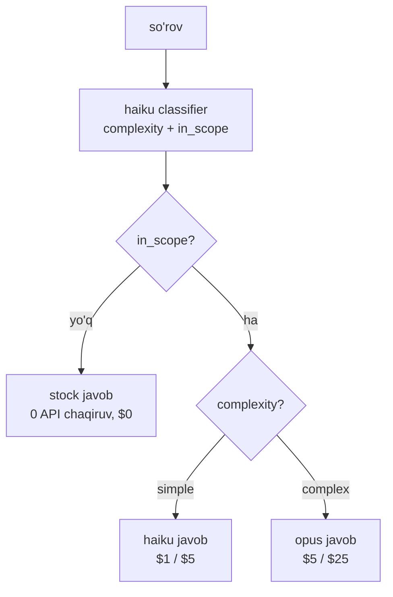

# 04. Cost va latency optimization — routing va token budjeti

> **Bu darsda:** "LLM xarajatini 10x kamaytir" real ish topshirig'iga tizimli javob beramiz. Optimizatsiya zinapoyasi (caching -> routing -> batches -> semantic -> token intizomi), model routing pattern (arzon savolni haiku'ga, murakkabni opus'ga, out-of-scope'ni umuman API'siz), gateway/fallback, `count_tokens` bilan token budjeti va usage'dan real cost kalkulyatori. Ishda bu — narx bo'yicha eng ko'p beriladigan intervyu savoli va "modelni ishga chiqarish arzonmi?" degan biznes qaroriga to'g'ridan-to'g'ri ta'sir.

## Nazariya (~30%)

### 1. Muammo: naive LLM app hisobi 10x ortiqcha bo'ladi

Backend'da bitta og'ir `SELECT`'ni hamma so'rovga qo'ysangiz DB yonadi. LLM'da xuddi shu odat pul bilan yonadi: har savolni eng kuchli modelga (opus), to'liq kontekst bilan, keshsiz yuborasiz. Bu ishlaydi — lekin hisob 10x ortiqcha keladi va sizga "xarajatni kamaytir" deyishadi.

Yaxshi xabar: bu 10x deyarli har doim topiladi, chunki isrof tizimli. Uni ketma-ket pog'onalar bilan yo'qotamiz — har biri oldingisi ustiga quriladi.

### 2. Narx jadvali — pulni sanashdan boshlanadi

Optimizatsiyadan oldin narxni bilish shart (2026, Anthropic):

| Model | Input (1M token) | Output (1M token) | Qachon |
|---|---|---|---|
| **claude-opus-4-8** | $5 | $25 | murakkab mulohaza, yakuniy javob |
| **claude-haiku-4-5** | $1 | $5 | routing, tasnif, oddiy savol, guardrail |
| Batches (ikkalasi) | -50% | -50% | latency muhim bo'lmagan ishlar |
| Prompt cache o'qish | 0.1x input | — | takror prefiks |
| Prompt cache yozish | 1.25x (5m) / 2x (1h) | — | prefiksni birinchi marta yozish |

Ikki fakt darhol foyda beradi: **output input'dan 5x qimmat** (opus'da $25 vs $5) — demak `max_tokens` intizomi katta ta'sir; **haiku opus'dan 5x arzon** — oddiy savollarni unga tushirish eng katta yagona tejov.

### 3. Optimizatsiya zinapoyasi — tartib ahamiyatli

Bu pog'onalarni tartib bilan qo'llang. Yuqoridagilar arzonroq (kam kod), pastdagilar ko'proq mehnat talab qiladi:

| Pog'ona | Nima qiladi | Taxminiy foyda |
|---|---|---|
| 1. **Prompt caching** (03-dars) | takror prefiksni 0.1x narxda | input tokenlar -90% |
| 2. **Model routing** | oddiy savol -> haiku, out-of-scope -> $0 | 60-85% cost |
| 3. **Batches API** (6-bo'lim) | latency-insensitive ishlar -50% | -50% |
| 4. **Semantic cache** (03-dars) | o'xshash savol -> LLM'siz | hit rate'ga bog'liq |
| 5. **Token intizomi** | qisqa system, top-5 kontekst, `count_tokens` | 10-40% |
| 6. **Streaming** (01-dars) | sezilgan latency (real emas) | UX |

> Oltin qoida: "xarajatni 10x kamaytir" bitta sehrli tugma emas — bu zinapoya. Avval caching (kod deyarli o'zgarmaydi), keyin routing (eng katta bitta g'alaba), keyin qolganlari. Har pog'onani `usage`'dan o'lchab, foydani raqam bilan tasdiqlang.

### 4. Model routing — arzon so'rovni arzon modelga

Ko'p savol sodda: "qaytarish siyosati qanday?", "ish vaqtlaringiz?". Bularni opus'ga yuborish — traktor bilan non olib kelish. **Router** = so'rovni oldindan tasniflaydigan arzon qadam (Huyen Ch10). U uch qaror qabul qiladi:

- **out-of-scope** ("ob-havo qanday?") -> stock javob, **API umuman chaqirilmaydi** ($0).
- **simple + in-scope** -> haiku javob beradi (5x arzon).
- **complex** -> opus javob beradi (sifat kerak).

Router o'zi arzon/tez bo'lishi SHART — aks holda u yechayotgan muammoning o'zi bo'lib qoladi. Tasnif variantlari latency bo'yicha: qoida asosida `<1ms`, embedding classifier `~5ms`, LLM classifier (haiku) `50-100ms`. Bizda haiku ishlatamiz — u ham tasnif qiladi, ham oddiy savollarga javob beradi. 2026 raqamlari: to'g'ri routing 60-85% cost tejaydi, sifat ~95% saqlanadi.



### 5. Gateway va fallback — bitta xavfsiz eshik

Router qarorni tanlaydi, **gateway** esa hamma model chaqiruvini bitta joydan o'tkazadi (Huyen Ch10). Bu backend'dagi API gateway pattern'ining aynan o'zi: model API o'zgarsa faqat shu qatlam yangilanadi; cost limit va access control shu yerda; **fallback policy** ham shu yerda — provider `429` (rate limit) yoki `5xx` bersa, muqobil modelga o'tadi yoki `retry-after`'ni kutadi.

Muhim tuzoq: **naive retry storm**. `429` kelganda darhol qayta urinsangiz, provider'ni yana uradi va vaziyat yomonlashadi. To'g'ri yo'l — `429` javobidagi `retry-after` header'ini o'qib, o'sha muddat kutish yoki arzon/muqobil modelga tushish.

### 6. Prompt caching'ning nozik joylari — invalidatsiya iyerarxiyasi

03-darsda prefiks o'zgarishi keshni buzishini ko'rdik. Amalda qaysi o'zgarish qanchasini buzishini bilish kerak (agent va uzun suhbatlarda muhim):

| O'zgarish | Nimani buzadi |
|---|---|
| `tools` yoki model o'zgarishi | HAMMASINI (tools = 0-pozitsiya, model = boshqa maydon) |
| `system` o'zgarishi | system + undan keyingi messages |
| `tool_choice` / thinking toggle | faqat messages qismini |

Yana ikki amaliy qoida:

- **20-blok lookback:** uzun agent turn'larida provider oxirgi ~20 blokdan kesh prefiksini qidiradi. Uzun suhbatlarda oraliq `cache_control` breakpoint qo'ying, aks holda tarix uzayganda kesh yo'qoladi.
- **Parallel so'rovlarda fan-out:** birinchi javob stream boshlangunga qadar kesh yozib bo'linmaydi. 10 ta so'rovni bir vaqtda yuborsangiz, hammasi cache miss bo'ladi. To'g'ri yo'l — avval 1 so'rov (kesh yoziladi), keyin qolgan 9 tasi (kesh o'qiladi).
- **Pre-warm:** kesh sovushidan oldin uni "isitib" qo'yish mumkin — `max_tokens` juda kichik so'rov yuborsangiz, prefill ishlaydi va kesh yoziladi, lekin javob generatsiyasiga pul ketmaydi.

### 7. Latency — ikki raqam, va cost bilan bir xil emas

Cost'ni tejadingiz, lekin foydalanuvchi latency'ni his qiladi. Latency ikki raqamdan iborat (Huyen Ch9, 01-darsdan tanish):

- **TTFT** (time to first token) — birinchi token qancha vaqtda keladi. Prefiks qancha uzun bo'lsa, prefill shuncha uzoq — demak prompt caching TTFT'ni ham qisqartiradi (kesh o'qilgan prefiks qayta hisoblanmaydi).
- **TPOT** (time per output token) — keyingi har token orasidagi vaqt. `max_tokens` intizomi bu yerda ishlaydi: 2000 token o'rniga 300 token generatsiya qilsangiz, jami vaqt ~6x qisqaradi.

Ikki nozik nuqta:

- **O'rtacha latency aldaydi** — bir sekin outlier o'rtachani buzadi. Latency'ni doim p95/p99 percentile'da o'lchang (bu 5-darsning yadrosi).
- **Streaming real latency'ni kamaytirmaydi, sezilgan latency'ni kamaytiradi** (01-dars). To'liq javob baribir o'sha vaqtda tayyor bo'ladi, lekin foydalanuvchi birinchi tokendan boshlab o'qiy boshlaydi — kutish "tugadi".

Huyen'ning Pareto qoidasi: agar latency **qat'iy talab** bo'lsa (masalan chatbot 2s ichida javob berishi shart), avval shu talabni qondiradigan modellarni **filtrlab**, keyin ular orasidan sifatlisini tanlaydi — teskari emas. Ya'ni "eng aqlli model" har doim ham to'g'ri tanlov emas, agar u SLO'ga sig'masa.

## Amaliyot (~70%)

### Predict / Run: haiku router

Avval bashorat qil: quyidagi router uchta savolni tasniflaydi — "qaytarish siyosati?", "termodinamikaning ikkinchi qonunini isbotla", "ob-havo qanday?". Har biri qaysi yo'lga tushadi va qaysi modelga (yoki umuman modelga bormaydi)? Endi kodni o'qi.

```python
# router.py — haiku bilan so'rovni tasniflab marshrutlash
import os
import anthropic
from pydantic import BaseModel
from dotenv import load_dotenv

load_dotenv()
client = anthropic.Anthropic()

# --- 1-qadam: tasnif natijasi sxemasi (structured output) ---
class Route(BaseModel):
    complexity: str  # "simple" yoki "complex"
    in_scope: bool   # mahsulot/xizmat doirasidami

def classify(question):
    resp = client.messages.parse(
        model="claude-haiku-4-5", max_tokens=128,
        system="Sen mijoz-xizmat so'rovlarini tasniflaysan. "
               "in_scope = mahsulot, buyurtma, qaytarish haqidami. "
               "complexity = simple bo'lsa bir jumlalik javob yetadi.",
        messages=[{"role": "user", "content": question}],
        output_format=Route,
    )
    return resp.parsed_output

# --- 2-qadam: qarorni modelga bog'lash ---
def answer(question):
    r = classify(question)
    if not r.in_scope:
        return "Men faqat mahsulot va buyurtma savollariga javob beraman.", "stock"
    model = "claude-haiku-4-5" if r.complexity == "simple" else "claude-opus-4-8"
    resp = client.messages.create(
        model=model, max_tokens=256,
        messages=[{"role": "user", "content": question}],
    )
    return resp.content[0].text, model

for q in ["Qaytarish siyosati qanday?",
          "Buyurtmam kechikkanida kim javobgar va qanday kompensatsiya olaman?",
          "Ob-havo bugun qanday?"]:
    text, route = answer(q)
    print(route, "->", text[:40])

# Output:
# claude-haiku-4-5 -> 30 kun ichida qaytarishingiz mumkin...
# claude-opus-4-8 -> Kechikish sababiga qarab kompensatsiya...
# stock -> Men faqat mahsulot va buyurtma savol...
```

Uchinchi savol umuman generation modeliga bormadi — $0. Birinchisi 5x arzon haiku'ga tushdi. Faqat murakkab savol opus'ni ishlatdi.

### Run: cost kalkulyatori — usage'dan real dollar

Optimizatsiyani o'lchash uchun har so'rovning narxini `usage`'dan hisoblaymiz (bu funksiya 5-darsda trace'ga ham yoziladi):

```python
# cost.py — usage maydonlaridan per-request cost
PRICES = {
    "claude-opus-4-8": {"in": 5.0, "out": 25.0},
    "claude-haiku-4-5": {"in": 1.0, "out": 5.0},
}

def request_cost(model, usage):
    p = PRICES[model]
    # --- to'rt maydon, har biri boshqa narxda (03-darsdan) ---
    dollars = (
        usage.input_tokens * p["in"]
        + usage.cache_creation_input_tokens * p["in"] * 1.25
        + usage.cache_read_input_tokens * p["in"] * 0.1
        + usage.output_tokens * p["out"]
    ) / 1_000_000
    return dollars

# --- Soxta usage bilan sinov (SDK Usage obyekti kabi maydonlar) ---
class U:
    def __init__(self, i, cc, cr, o):
        self.input_tokens = i
        self.cache_creation_input_tokens = cc
        self.cache_read_input_tokens = cr
        self.output_tokens = o

# opus, keshsiz: 5000 input + 400 output
print(round(request_cost("claude-opus-4-8", U(5000, 0, 0, 400)), 6))
# opus, kesh o'qildi: 30 input + 4970 cache_read + 400 output
print(round(request_cost("claude-opus-4-8", U(30, 0, 4970, 400)), 6))

# Output:
# 0.035        <- keshsiz: $0.035
# 0.012485     <- kesh bilan: $0.0125 (~65% arzon)
```

Bitta so'rov 3.5 sentdan 1.25 sentga tushdi — faqat prompt cache tufayli. Bu kalkulyator optimizatsiyaning har pog'onasini raqam bilan tasdiqlaydi.

### Run: count_tokens — so'rovdan OLDIN narx baholash

`max_tokens` va kontekstni yubortirishdan oldin narxni bilib olish mumkin. `tiktoken` ISHLATILMAYDI (Anthropic uchun noto'g'ri sanaydi) — SDK'ning `count_tokens`'i to'g'ri raqamni beradi:

```python
# estimate.py — so'rov narxini yuborishdan oldin baholash
import os
import anthropic
from dotenv import load_dotenv
from cost import PRICES

load_dotenv()
client = anthropic.Anthropic()

def estimate_input_cost(model, system, messages):
    # --- API modelga o'z tokenizeri bilan sanaydi ---
    count = client.messages.count_tokens(
        model=model, system=system, messages=messages,
    )
    dollars = count.input_tokens * PRICES[model]["in"] / 1_000_000
    return count.input_tokens, dollars

sys = "Sen mijoz yordamchisisan."
msgs = [{"role": "user", "content": "Qaytarish siyosati qanday?"}]
tokens, price = estimate_input_cost("claude-opus-4-8", sys, msgs)
print("input tokens:", tokens, "input cost: $" + str(round(price, 6)))

# Output:
# input tokens: 24 input cost: $0.00012
```

Bu narx faqat input uchun — output oldindan noma'lum, lekin `max_tokens` uni cheklaydi. Katta kontekst yuborishdan oldin `count_tokens` bilan tekshirish "nega hisobim shishdi?" savolini oldini oladi.

### Run: routing + caching birga — oldin/keyin jadval

Endi ikki optimizatsiyani birlashtirib, 100 ta so'rovlik ish uchun narxni taqqoslaymiz (60% simple, 30% complex, 10% out-of-scope, prompt cache yoqilgan):

```python
# pipeline_cost.py — naive vs optimized 100 so'rov taqqosi
from cost import request_cost

class U:
    def __init__(self, i, cc, cr, o):
        self.input_tokens, self.cache_creation_input_tokens = i, cc
        self.cache_read_input_tokens, self.output_tokens = cr, o

# --- Naive: hammasi opus, keshsiz, 5000 input + 400 output ---
naive = 100 * request_cost("claude-opus-4-8", U(5000, 0, 0, 400))

# --- Optimized: routing + cache ---
opt = 0.0
opt += 10 * 0.0                                                  # out-of-scope: $0
opt += 60 * request_cost("claude-haiku-4-5", U(30, 0, 4970, 200))  # simple -> haiku+cache
opt += 30 * request_cost("claude-opus-4-8", U(30, 0, 4970, 400))   # complex -> opus+cache

print("naive:     $" + str(round(naive, 3)))
print("optimized: $" + str(round(opt, 3)))
print("tejov:     " + str(round((1 - opt / naive) * 100)) + "%")

# Output:
# naive:     $3.5
# optimized: $0.42
# tejov:     88%
```

$3.5 dan $0.42 ga — 88% tejov, sifat esa deyarli saqlandi (murakkab savollar hali ham opus'da). Diqqat: bu simulyatsiya; real raqam sizning traffic taqsimotingizga bog'liq — shuning uchun `usage`'ni loglang.

### Run: fallback — retry-after bilan, storm'siz

Provider `429` bergan holatda naive retry o'rniga `retry-after`'ni o'qib, muqobil modelga tushamiz:

```python
# fallback.py — rate limit'da retry-after o'qib muqobil modelga o'tish
import os
import time
import anthropic
from dotenv import load_dotenv

load_dotenv()
client = anthropic.Anthropic(max_retries=0)  # qo'lda boshqaramiz

def call_with_fallback(messages, primary="claude-opus-4-8",
                       backup="claude-haiku-4-5"):
    for model in (primary, backup):
        try:
            return client.messages.create(
                model=model, max_tokens=256, messages=messages), model
        except anthropic.RateLimitError as e:
            # --- retry-after'ni O'QIYMIZ, ko'r-ko'rona urmaymiz ---
            wait = e.response.headers.get("retry-after")
            if model == primary and wait:
                time.sleep(min(float(wait), 5))   # bir marta kutib, keyin backup
            continue
    raise RuntimeError("Ikkala model ham band")

resp, used = call_with_fallback(
    [{"role": "user", "content": "Salom"}])
print("javob bergan model:", used)

# Output:
# javob bergan model: claude-opus-4-8
# (agar opus 429 bersa -> "javob bergan model: claude-haiku-4-5")
```

`max_retries=0` bilan SDK'ning avtomatik retry'sini o'chirib, mantiqni o'zimiz boshqaramiz. `retry-after` bo'lsa bir marta kutamiz, keyin arzon backup'ga tushamiz — storm yo'q.

### Investigate / Modify — mashqlar

1. **Router'ga uchinchi kategoriya qo'shing:** `Route`'ga `needs_human: bool` maydonini qo'shing (masalan "shikoyat qilmoqchiman"). `needs_human` true bo'lsa, javob o'rniga "operator bilan ulayapmiz" qaytaring — bu HITL flag (6-dars guardrails bilan bog'lanadi).
2. **`request_cost`'ni Batches uchun moslang:** Batches -50% beradi. Funksiyaga `batch=False` parametr qo'shing va `batch=True` bo'lganda yakuniy narxni 0.5 ga ko'paytiring. Qaysi ishlar Batches'ga mos? (Javob: latency muhim bo'lmagan — hujjat qayta ishlash, offline eval.)
3. **`pipeline_cost.py`'da taqsimotni o'zgartiring:** simple 60% dan 30% ga tushiring (murakkabroq traffic). Tejov necha foizga kamayadi? Xulosa: routing foydasi traffic'ning "oson" ulushiga bog'liq.

### Make: kunlik budjet nazoratchisi

**Vazifa:** Kun ichida sarflangan cost'ni kuzatuvchi va limitdan oshsa avtomatik "arzon rejim"ga (hamma so'rov haiku'ga) o'tadigan controller yozing. Cost'ni Redis'da kunlik counter'da saqlang.

<details>
<summary>Yechim</summary>

Kalit g'oya — har kunga alohida Redis counter (`INCRBYFLOAT`), va `answer` ichida limitni tekshirish. Limit oshsa `force_cheap` rejim yoqiladi: complexity qanday bo'lishidan qat'i nazar haiku ishlatiladi.

```python
# budget.py — kunlik cost limiti va arzon rejimga avtomatik o'tish
import os
import redis
from datetime import date
from dotenv import load_dotenv
from cost import request_cost

load_dotenv()
r = redis.from_url(os.environ["REDIS_URL"])
DAILY_LIMIT = 5.0  # $5/kun

def _today_key():
    return "cost:" + date.today().isoformat()

def add_cost(model, usage):
    # --- so'rov narxini kunlik counterga qo'shamiz (TTL 2 kun) ---
    dollars = request_cost(model, usage)
    key = _today_key()
    r.incrbyfloat(key, dollars)
    r.expire(key, 172800)
    return dollars

def spent_today():
    val = r.get(_today_key())
    return float(val) if val else 0.0

def choose_model(complexity):
    # --- limit oshgan bo'lsa MAJBURAN arzon rejim ---
    if spent_today() >= DAILY_LIMIT:
        return "claude-haiku-4-5"   # force cheap
    return "claude-haiku-4-5" if complexity == "simple" else "claude-opus-4-8"

# --- Simulyatsiya: budjetni to'ldiramiz ---
class U:
    def __init__(self, i, o):
        self.input_tokens, self.output_tokens = i, o
        self.cache_creation_input_tokens = 0
        self.cache_read_input_tokens = 0

for _ in range(3):
    add_cost("claude-opus-4-8", U(50000, 4000))  # qimmat so'rovlar

print("bugun sarflangan: $" + str(round(spent_today(), 2)))
print("murakkab savol modeli:", choose_model("complex"))

# Output:
# bugun sarflangan: $6.75
# murakkab savol modeli: claude-haiku-4-5   <- limit oshdi, arzon rejim!
```

Kengaytirish: limit oshganda faqat modelni tushirish emas, alert ham yuborish (5-dars observability) yoki yangi qimmat so'rovlarni butunlay rad etish mumkin. Kalit qoida — cost'ni real vaqtda kuzatmasangiz, uni boshqara olmaysiz.
</details>

## Retrieval practice

1. "LLM xarajatini 10x kamaytir" degan topshiriqni oldingiz. Qaysi pog'onadan boshlaysiz va nega, keyin qaysi tartibda davom etasiz?
2. Router'ni opus bilan qursangiz nima yomon? Router uchun qaysi model va nega?
3. `429` (rate limit) kelganda darhol qayta urinish nima uchun vaziyatni yomonlashtiradi? To'g'ri yo'l qanday?
4. Bir xil 5000 tokenlik so'rov opus'da keshsiz $0.035 turadi. Kesh o'qilganda nega arzon bo'ladi, aniq qaysi maydon 0.1x narxda hisoblanadi?
5. Nima uchun `tiktoken` bilan Anthropic tokenlarini sanash noto'g'ri, va o'rniga nima ishlatiladi?

## Manbalar

- Huyen, "AI Engineering" — Ch9 Inference Optimization (autoregressive decode qimmatligi, TTFT/TPOT trade-off) va Ch10 Architecture (Router = intent classifier, Gateway = fallback/cost limit/yagona interfeys).
- Anthropic prompt caching (invalidatsiya iyerarxiyasi, narxlar): `https://platform.claude.com/docs/en/build-with-claude/prompt-caching`
- Anthropic rate limits (`retry-after`, header'lar): `https://platform.claude.com/docs/en/api/rate-limits`
- Anthropic token counting (`count_tokens`): `https://platform.claude.com/docs/en/build-with-claude/token-counting`
- LLM model routing 2026 (60-85% tejash, classifier latency): `https://www.digitalapplied.com/blog/llm-model-routing-2026-cost-quality-optimization-engineering-guide`

---

Keyingi darsda optimizatsiyani ko'rinadigan qilamiz: cost kalkulyatori va latency raqamlari faqat ular loglanganda foyda beradi — observability bilan har so'rovning yo'lini, tokenini va narxini kuzatishni quramiz.

[Keyingi dars: 05. Observability](05.%20Observability%20—%20metrics,%20traces%20va%20token%20hisobi.md)
