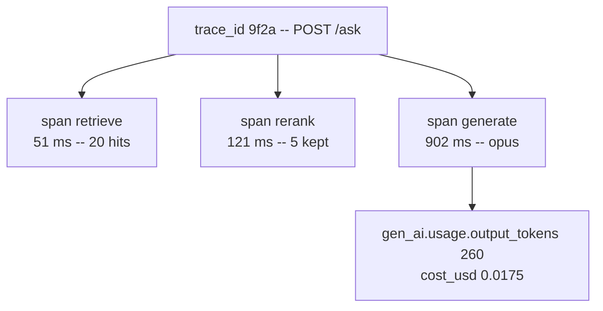
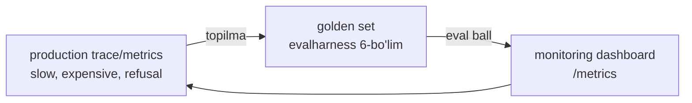

# 05. Observability — metrics, traces va token hisobi

> **Bu darsda:** backend'da Prometheus/Grafana bilan p95 latency va error rate'ni kuzatasan. LLM app'da o'sha odat **yangi maydonlar** oladi: token, cost per request, cache hit rate, guardrail trigger, refusal rate. Bu darsda o'z `trace.py` (trace_id + span, JSONL'ga OTel GenAI nomlari bilan) va `metrics.py` (JSONL'dan p50/p95/p99, kutubxonasiz) yozamiz, docqa-uslub pipeline'ga span qo'yamiz va `/metrics` endpoint ochamiz. Huyen'ning eng yomon holati: "deploy qilingan, lekin ishlayotganini hech kim bilmaydigan app". Intervyu savoli: "LLM app'ni qanday monitoring qilasan?" — javob shu darsda.

---

## Nazariya (~30%)

### Monitoring vs observability — ikki xil ko'z

Backend'da ikki xil vosita bor: **oldindan tayyorlangan dashboard** (CPU, RPS, error % — ma'lum savollarga ma'lum grafik) va **distributed tracing** (Jaeger/Zipkin — bitta so'rov qaysi servisda qancha vaqt yo'qotganini keyin so'rab bilish). Farqi shu:

| | Monitoring | Observability |
|---|---|---|
| Nima | ma'lum metrikani kuzatish | tashqi outputdan ichki holatni xulosalash |
| Savol turi | "known unknowns" | "unknown unknowns" |
| Backend analogiyasi | metrics + alert | distributed tracing |
| LLM'da | `/metrics` (p95, cost) | span daraxti (qaysi qadam sekin) |

> **Oltin qoida:** Observability afterthought EMAS, dizaynning qismi (Huyen). Kod yozilgach qo'shilgan monitoring har doim yetishmaydi — instrumentatsiya kod bilan birga tug'iladi.

### Metrikalar failure'dan dizayn qilinadi

Odatiy xato: "qanday metrikani o'lchay olaman?" deb boshlash. To'g'ri savol teskari: **"bu tizim qanday buziladi, va har buzilishni qaysi metrika ushlaydi?"** Har failure turi bitta metrika tug'diradi:

| Failure turi | Savol | Metrika |
|---|---|---|
| Format buzildi | JSON parse bo'ldimi? | invalid JSON %, tuzatilgan % |
| Faktik xato | javob kontekstga tayandimi? | faithfulness (eval bilan) |
| Xavfsizlik | injection/toxic o'tdimi? | guardrail trigger %, refusal % |
| User norozi | to'xtatdi/qayta so'radi? | stop %, regenerate %, turn soni |
| Sekin | qancha kutdi? | TTFT/TPOT/total p50/p95/p99 |
| Qimmat | qancha turdi? | token, cost/request, cache hit rate |

Bu jadval bo'lim README'sidagi arxitektura evolyutsiyasiga bog'lanadi: har qatlam (guardrail, cache, router) o'z metrikasini beradi.

### O'rtacha ALDAYDI — percentile'lar

Bu darsning eng muhim intuitsiyasi. **Latency uchun o'rtacha (mean) yaroqsiz metrika.** Misol: 10 ta so'rov, 9 tasi 200ms, bittasi 3000ms.

- mean = (9 × 200 + 3000) / 10 = **480ms** — "yaxshi ko'rinadi"
- p50 (median) = **200ms** — tipik foydalanuvchi shuni ko'radi
- p99 = **3000ms** — har 100 so'rovdan bittasi 3 sekund kutadi

O'rtacha 480ms na tipik holatni (200), na og'riqni (3000) ko'rsatadi — ikkalasini yashiradi. Backend'da buni bilasan: SLO har doim p95/p99'da yoziladi. LLM'da o'sha qoida.

Uch latency metrikasi (Huyen Ch9), hammasi percentile'da o'lchanadi:

- **TTFT** (time to first token) — prefill davomiyligi, input uzunligiga bog'liq. Streaming'da foydalanuvchi sezadigan yagona narsa.
- **TPOT** (time per output token) — odam o'qish tezligidan tez bo'lsa yetadi (~6-8 token/s).
- **Total latency = TTFT + TPOT × output tokenlar.**

### Token va cost — usage maydonlaridan

LLM monitoringda backend'da yo'q ikki metrika: token va dollar. Har javobning `usage` obyekti to'rt maydon beradi (03-04 darslardan tanish):

| Maydon | Ma'no | Narx koeffitsienti |
|---|---|---|
| `input_tokens` | FAQAT cache'siz prompt qismi | 1x |
| `cache_creation_input_tokens` | cache'ga birinchi yozilgan | 1.25x |
| `cache_read_input_tokens` | cache'dan o'qilgan | 0.1x |
| `output_tokens` | generatsiya qilingan | in narxidan qimmat |

Jami prompt = `input_tokens + cache_creation + cache_read`. Diqqat: `input_tokens` faqat cache'siz qismni beradi — buni bilmasang cost hisobing xato bo'ladi.

> **Signal:** o'rtacha total token birdan sakrasa — bu bug (Handbook). Masalan prompt template'ga tasodifan butun suhbat tarixi tirkalib qolgan. Token taqsimotini kuzatish arzon, lekin ko'p bug'ni erta ushlaydi.

### Logs vs traces — span daraxti

**Log** — "log everything" (Huyen): final prompt, config (model, max_tokens), user query, tool call/output. **Trace** esa boshqa narsa: so'rovning **to'liq yo'li** — query → retrieve → rerank → generate → answer, har qadam duration + token + cost bilan. Bu backend'dagi distributed tracing bilan aynan bir xil g'oya. Bitta trace = bitta **span daraxti**:



Trace'ning kuchi: failure yoki sekinlikni **aniq qadamga pinpoint** qiladi. "So'rov 5 sekund" degan alert foydasiz; "generate span'i 5 sekund, retrieve 50ms" — bu debug qilinadigan ma'lumot.

### OTel GenAI nomlash konvensiyasi

Span atributlarini o'zboshimcha nomlash o'rniga **OTel GenAI semantic conventions** nomlarini ishlatamiz: `gen_ai.request.model`, `gen_ai.usage.input_tokens`, `gen_ai.usage.output_tokens`, `gen_ai.response.finish_reasons`. 2026 holati: bu konvensiya hali experimental, lekin stabilizatsiyaga yaqin, Datadog/GCP/AWS qabul qilgan.

> **Nega muhim:** biz OTel SDK **import qilmaymiz** — oddiy JSONL log yetadi. Lekin atribut NOMLARINI standart qilib qo'ysak, ertaga Langfuse yoki Datadog'ga o'tish = konfiguratsiya almashtirish, kodni qayta yozish emas.

### Drift va eval bilan ikki tomonlama bog'

**Drift** — sekin, ko'rinmas siljish: system prompt template yangilanishi, user xulqi o'zgarishi, va eng yashirini — **underlying model update** (API bir xil qoladi, provider modelni yangilaydi; Voiceflow bir yangilanishda -10% sifat ko'rgan). DevOps metrikalari bu yerda ham ishlaydi: **MTTD** (topish vaqti), **MTTR** (tuzatish vaqti), **CFR** (change failure rate).

Eng muhimi — monitoring va eval **bir halqa**: production topilmalari golden set'ga oqadi (6-bo'lim evalharness), eval metrikalari monitoring dashboard'iga aylanadi.



---

## Amaliyot (~70%)

Sozlash: `pip install fastapi uvicorn python-dotenv`. Bu darsda LLM chaqiruv simulyatsiya qilinadi (fokus — instrumentatsiya), shuning uchun `anthropic` kaliti shart emas. Fayllar: `trace.py`, `metrics.py`, `pipeline.py`, `app.py`.

### Predict / Run

#### 1-blok — o'rtacha vs percentile

**Bashorat qiling:** quyidagi 10 latency uchun mean, p50 va p99 qancha? Qaysi biri "1 ta foydalanuvchi 3 sekund kutdi" faktini ko'rsatadi?

```python
# mean_vs_percentile.py -- nega o'rtacha ALDAYDI
lat = [200] * 9 + [3000]              # 10 so'rov: 9 tasi tez, 1 tasi sekin
mean = sum(lat) / len(lat)
s = sorted(lat)
p50 = s[(len(s) * 50 + 99) // 100 - 1]     # nearest-rank
p99 = s[(len(s) * 99 + 99) // 100 - 1]
print(f"mean={mean}ms  p50={p50}ms  p99={p99}ms")

# Output:
# mean=480.0ms  p50=200ms  p99=3000ms
# ^ mean na tipik (200), na og'riq (3000) -- ikkalasini yashiradi
```

Nearest-rank formula: p-percentile = `ceil(N × p / 100)`-chi element (musbat sonlar uchun `(N*p + 99) // 100` = ceil). Buni `metrics.py`da qayta ishlatamiz.

#### 2-blok — trace.py: trace_id va span

Har so'rov o'z `trace_id`sini oladi, har qadam bitta `span`. `contextvars` bilan trace_id concurrent so'rovlarda aralashmaydi (backend'da async context'ni bilasan). Span context manager duration'ni o'lchaydi va JSONL'ga yozadi:

```python
# trace.py -- oddiy tracing: trace_id + span, OTel GenAI nomlari bilan JSONL'ga
import json
import time
import uuid
import contextvars
from contextlib import contextmanager

TRACE_FILE = "traces.jsonl"
_current_trace = contextvars.ContextVar("trace_id", default=None)   # so'rovlar aralashmasin

def new_trace():
    tid = uuid.uuid4().hex[:16]
    _current_trace.set(tid)
    return tid

@contextmanager
def span(name, attributes=None):
    # span = trace daraxtining bitta tuguni: nom, davomiylik, atributlar
    attrs = dict(attributes or {})
    record = {"trace_id": _current_trace.get(), "span": name, "attributes": attrs}
    start = time.monotonic()
    try:
        yield attrs                          # ichkarida atribut qo'shiladi (usage, cost)
    except Exception as exc:
        attrs["error"] = type(exc).__name__  # exception ham span'ga yoziladi
        raise
    finally:
        record["duration_ms"] = round((time.monotonic() - start) * 1000, 1)
        with open(TRACE_FILE, "a") as f:     # append -- kichik yuk uchun yetarli
            f.write(json.dumps(record, ensure_ascii=False) + "\n")
```

Ishlatish:

```python
# demo.py
import time
from trace import new_trace, span

new_trace()
with span("generate", {"gen_ai.request.model": "claude-opus-4-8"}) as attrs:
    time.sleep(0.4)                          # LLM chaqiruvi (simulyatsiya)
    attrs["gen_ai.usage.input_tokens"] = 1200
    attrs["gen_ai.usage.output_tokens"] = 320

# Output (traces.jsonl'da bitta qator):
# {"trace_id": "a1b2c3d4e5f6a7b8", "span": "generate", "attributes": {"gen_ai.request.model":
#  "claude-opus-4-8", "gen_ai.usage.input_tokens": 1200, "gen_ai.usage.output_tokens": 320},
#  "duration_ms": 401.3}
```

Diqqat: yozib olingan atribut nomlari OTel standarti — keyin har qanday backend'ga ko'chadi. Yuqori yukda `open(...).write` o'rniga logger/queue ishlatiladi; bu yerda oddiylik uchun to'g'ridan-to'g'ri yozamiz.

#### 3-blok — pipeline'ga span va cost

Endi docqa uslubidagi RAG oqimini (retrieve → rerank → generate) span'lar bilan o'raymiz. `generate` span'iga cost ham yoziladi — cost kalkulyatori 04-darsdan (usage maydonlari × narx):

```python
# pipeline.py -- RAG oqimini span'lar bilan trace qilish + cost hisobi
import time
from trace import new_trace, span

PRICES = {  # $ per 1M token (research §0.5)
    "claude-opus-4-8": {"in": 5.0, "out": 25.0},
    "claude-haiku-4-5": {"in": 1.0, "out": 5.0},
}

def cost_usd(model, usage):
    p = PRICES[model]
    dollars = (usage.get("input_tokens", 0) * p["in"]
               + usage.get("output_tokens", 0) * p["out"]
               + usage.get("cache_read_input_tokens", 0) * 0.1 * p["in"]       # o'qish 0.1x
               + usage.get("cache_creation_input_tokens", 0) * 1.25 * p["in"]) # yozish 1.25x
    return round(dollars / 1_000_000, 6)

def answer(question):
    new_trace()
    with span("retrieve", {"query": question[:40]}) as a:
        time.sleep(0.05)                     # pgvector + BM25 (simulyatsiya)
        a["hits"] = 20
    with span("rerank", {"model": "rerank-2.5"}) as a:
        time.sleep(0.12)                     # cross-encoder
        a["kept"] = 5
    with span("generate", {"gen_ai.request.model": "claude-opus-4-8"}) as a:
        time.sleep(0.9)                      # Claude stream
        usage = {"input_tokens": 1800, "output_tokens": 260, "cache_read_input_tokens": 4096}
        a["gen_ai.usage.input_tokens"] = usage["input_tokens"]
        a["gen_ai.usage.output_tokens"] = usage["output_tokens"]
        a["cost_usd"] = cost_usd("claude-opus-4-8", usage)
    return "javob..."

answer("Goroutine leak'ni qanday topaman?")

# Output (traces.jsonl -- bitta trace_id ostida 3 span):
# {"trace_id":"9f2a...","span":"retrieve","attributes":{"query":"Goroutine leak'ni...","hits":20},"duration_ms":51.2}
# {"trace_id":"9f2a...","span":"rerank","attributes":{"model":"rerank-2.5","kept":5},"duration_ms":121.4}
# {"trace_id":"9f2a...","span":"generate","attributes":{...,"cost_usd":0.017548},"duration_ms":902.7}
```

Cost tekshiruvi: (1800×5 + 260×25 + 4096×0.1×5) / 1e6 = (9000 + 6500 + 2048) / 1e6 = **0.017548$**. Cost trace'da yotadi — ertaga "kim ko'p pul yeyapti" degan savolga span'lar javob beradi.

#### 4-blok — metrics.py: p50/p95/p99

`traces.jsonl`ni o'qib agregat hisoblaymiz: trace bo'yicha jami latency percentile, har span bo'yicha p95 (bottleneck topish uchun), o'rtacha output token va jami cost. numpy/pandas YO'Q — `sorted` yetadi:

```python
# metrics.py -- traces.jsonl'dan latency percentile va token/cost agregatlari
import json
from collections import defaultdict

def percentile(sorted_vals, p):
    if not sorted_vals:
        return 0.0
    k = max(1, (len(sorted_vals) * p + 99) // 100)   # nearest-rank ceil, kutubxonasiz
    return sorted_vals[k - 1]

def compute(path="traces.jsonl"):
    with open(path) as f:
        spans = [json.loads(line) for line in f if line.strip()]

    by_span = defaultdict(list)              # span nomi -> davomiyliklar
    total_by_trace = defaultdict(float)      # trace_id -> jami ms
    cost_total, out_tokens = 0.0, []
    for s in spans:
        by_span[s["span"]].append(s["duration_ms"])
        total_by_trace[s["trace_id"]] += s["duration_ms"]
        attrs = s["attributes"]
        cost_total += attrs.get("cost_usd", 0.0)
        if "gen_ai.usage.output_tokens" in attrs:
            out_tokens.append(attrs["gen_ai.usage.output_tokens"])

    totals = sorted(total_by_trace.values())
    return {
        "requests": len(total_by_trace),
        "total_latency_ms": {"p50": percentile(totals, 50),
                             "p95": percentile(totals, 95),
                             "p99": percentile(totals, 99)},
        "per_span_p95_ms": {name: percentile(sorted(v), 95) for name, v in by_span.items()},
        "avg_output_tokens": round(sum(out_tokens) / len(out_tokens), 1) if out_tokens else 0,
        "total_cost_usd": round(cost_total, 4),
    }

print(json.dumps(compute(), indent=2, ensure_ascii=False))

# Output (200 so'rovlik traces.jsonl uchun):
# {
#   "requests": 200,
#   "total_latency_ms": {"p50": 1080.4, "p95": 3120.7, "p99": 5340.2},
#   "per_span_p95_ms": {"retrieve": 60.1, "rerank": 140.3, "generate": 3010.5},
#   "avg_output_tokens": 251.7,
#   "total_cost_usd": 3.5112
# }
```

`per_span_p95_ms` darhol aytadi: p95 latency'ning deyarli hammasi `generate`da (3010 / 3120) — optimizatsiya shu yerga qaratiladi (streaming, caching, routing — 03-04 darslar).

#### 5-blok — /metrics endpoint

Backend'dagi Prometheus `/metrics` odati LLM app'ga ko'chadi. FastAPI'da jonli hisob:

```python
# app.py -- /metrics va /health endpoint
from fastapi import FastAPI
from metrics import compute

app = FastAPI()

@app.get("/metrics")
def metrics():
    return compute()                         # oxirgi traces.jsonl bo'yicha jonli hisob

@app.get("/health")
def health():
    return {"status": "ok"}

# curl localhost:8000/metrics
# Output:
# {"requests":200,"total_latency_ms":{"p50":1080.4,"p95":3120.7,"p99":5340.2},
#  "per_span_p95_ms":{"retrieve":60.1,"rerank":140.3,"generate":3010.5},
#  "avg_output_tokens":251.7,"total_cost_usd":3.5112}
```

Production'da butun faylni o'qish o'rniga oxirgi N qatorni oynalaydi (yoki Redis'da rolling window) — bu yerda oddiylik uchun to'liq o'qiymiz.

### Investigate / Modify

**Xato span'lari.** `span` context manager exception'ni avtomatik yozadi — LLM'da 429/timeout tez-tez uchraydi, ularni ko'rmaslik = ko'r monitoring:

```python
# error_span.py -- exception avtomatik span'ga tushadi
from trace import new_trace, span

new_trace()
try:
    with span("generate", {"gen_ai.request.model": "claude-opus-4-8"}) as a:
        raise RuntimeError("rate_limit")     # 429 simulyatsiya
except RuntimeError:
    pass

# Output (traces.jsonl):
# {"trace_id":"...","span":"generate","attributes":{"gen_ai.request.model":"claude-opus-4-8",
#  "error":"RuntimeError"},"duration_ms":0.3}
```

Mashqlar:

1. `metrics.py`ga `error_rate` qo'sh: `"error"` atributi bor span'lar / jami span. Bu MTTD'ni qisqartiradigan birinchi alert signali — nima uchun `p95` yaxshi bo'lsa ham error_rate yomon bo'lishi mumkin?
2. `cache_hit_rate` qo'sh: `cache_read_input_tokens > 0` bo'lgan generate span'lari ulushi. 03-darsdagi caching ishlayaptimi — shu son aytadi.
3. `avg_output_tokens`ni sana bo'yicha guruhla (span'ga `date` atributi qo'sh). Kun sayin sakrasa — bu drift signali (system prompt template o'zgargan yoki model yangilangan).

### Make

**Challenge:** eng sekin 5 so'rovni topib, har birining span breakdown'ini chiqar — qaysi span aybdorligini ko'rsat. Bu production incident debug'ining birinchi qadami: "sekin so'rovlar qayerda vaqt yo'qotyapti?"

<details>
<summary>Yechim</summary>

```python
# slowest.py -- eng sekin 5 so'rov va ularning aybdor span'i
import json
from collections import defaultdict

with open("traces.jsonl") as f:
    spans = [json.loads(line) for line in f if line.strip()]

by_trace = defaultdict(list)
for s in spans:
    by_trace[s["trace_id"]].append((s["span"], s["duration_ms"]))

# jami vaqt bo'yicha kamayuvchi tartib
totals = [(tid, sum(d for _, d in items), items) for tid, items in by_trace.items()]
totals.sort(key=lambda x: x[1], reverse=True)

for tid, total, items in totals[:5]:
    worst = max(items, key=lambda x: x[1])          # eng sekin span
    share = worst[1] / total
    print(f"{tid}  total={total:.0f}ms  aybdor={worst[0]} ({worst[1]:.0f}ms, {share:.0%})")

# Output:
# 3af21b...  total=5340ms  aybdor=generate (5210ms, 98%)
# 9c1180...  total=4880ms  aybdor=generate (4610ms, 94%)
# 71ee02...  total=4720ms  aybdor=rerank (3900ms, 83%)   <- odatiy emas! rerank sekin
# ...
```

Uchinchi qator qimmatli topilma: odatda `generate` aybdor, lekin bu trace'da `rerank` 3900ms — bu rerank servisidagi anomaliya (masalan cold start yoki katta batch). O'rtacha latency buni butunlay yashirar edi; span breakdown esa aniq ko'rsatadi.
</details>

---

## Landshaft (kod yo'q)

Production'da o'z JSONL'ingdan tayyor platformaga o'tasan: **Langfuse** (ochiq kodli, self-host), **Arize Phoenix** (OTel-native), **Datadog LLM Observability**, **Opik** (`@track` dekorator). 2026 tendensiyasi: hammasi OTel GenAI semconv'ga yaqinlashmoqda — biz atribut nomlarini standart qilib qo'yganimiz uchun migratsiya arzon.

---

## Retrieval practice

1. Mean latency 480ms, p99 esa 3000ms. Foydalanuvchi tajribasi haqida qaysi son haqiqatni aytadi va nega o'rtachaga tayanish xavfli?
2. `usage.input_tokens` faqat cache'siz qismni beradi. Agar buni bilmay cost hisoblasang, prompt caching yoqilgan tizimda hisobing qaysi tomonga xato ketadi?
3. Trace va log o'rtasidagi farq nima? "So'rov 5 sekund davom etdi" degan alert nega yetarli emas, span daraxti nimani qo'shadi?
4. OTel GenAI atribut nomlarini (gen_ai.usage.input_tokens) SDK'siz, oddiy JSONL'da ishlatishning amaliy foydasi nima?
5. Underlying model update qanday drift turi va nega uni ushlash qiyin? Monitoring topilmasi evalharness'ga qanday oqadi?

---

## Manbalar

- Huyen, *AI Engineering*, Ch9 — Inference Optimization (TTFT/TPOT/total, percentile o'rtachaga qarshi, throughput/goodput).
- Huyen, *AI Engineering*, Ch10 — Monitoring va Observability (failure'dan dizayn, MTTD/MTTR/CFR, drift, eval bilan ikki tomonlama bog').
- Handbook, Ch11 — Prompt monitoring/tracing (`@track` granularity qoidasi, log qilinadigan narsalar, token sakrashi = bug signali).
- OTel GenAI observability: `https://opentelemetry.io/blog/2026/genai-observability/`
- OTel GenAI semantic conventions: `https://opentelemetry.io/docs/specs/semconv/gen-ai/`

---

**Keyingi dars:** [06. Guardrails — production himoya qatlamlari](06.%20Guardrails%20—%20production%20himoya%20qatlamlari.md) — endi metrikani ko'rdik; keyingi darsda so'rovni himoya qatlamlaridan o'tkazamiz va guardrail latency'sini aynan shu trace'ga qo'shamiz.
