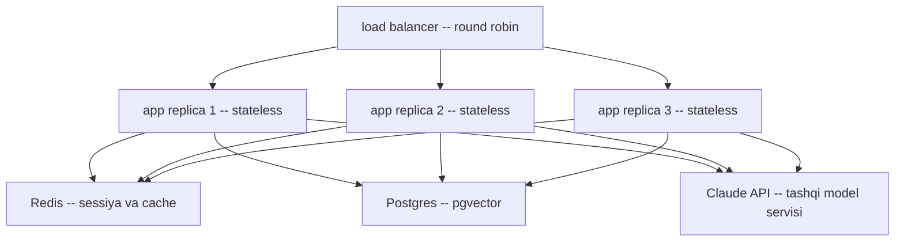
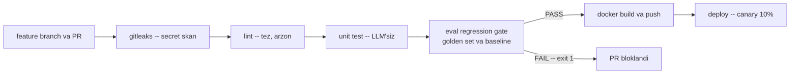

# 07. Deployment arxitekturasi va CI darvozasi

> **Bu darsda:** kod tayyor — 01-06 darslarda docqa'ga serving (SSE/WebSocket), cache, routing, trace va guardrail qo'shdik. Endi uni ishonchli chiqaramiz. Backend'dagi deploy bilimingiz (Docker, load balancer, CI/CD) to'g'ridan-to'g'ri ko'chadi — biz faqat LLM app'ga xos ikkita yangi narsani qo'shamiz: **deploy'dan oldin eval regression gate** va **prompt/model versiyasini env'da saqlash**. hh.uz AI Engineer vakansiyalarida "Docker, CI/CD, deployment" deyarli har e'londa bor; intervyu savoli: "LLM app'ni qanday deploy qilasiz va prompt o'zgarishini qanday xavfsiz chiqarasiz?" — javob shu darsda.

---

## Nazariya (~30%)

### Backend deploy bilan LLM deploy — nima ko'chadi, nima yangi

Sen backend'da app'ni Docker'ga qadadiing, load balancer ortiga qo'ydiing, CI'da `pytest` yiqilsa merge bloklanardi. Bularning HAMMASI o'zgarmaydi. LLM app'ga atigi ikkita yangi qatlam qo'shiladi:

| Backend deploy | LLM deploy'da qo'shimcha |
|---|---|
| CI: lint + unit test | + **eval regression gate** (golden set ballari tushsa PR bloklanadi) |
| config: DB URL, feature flag | + **PROMPT_VERSION / MODEL** env (qaysi prompt qaysi javobni berdi) |
| rollback: eski image | + rollback = **env o'zgartirish** (prompt/model kodda emas -> build'siz) |

> **Oltin qoida:** backend deploy bilimingizning ~90% ko'chadi; LLM app'ga faqat ikkita darvoza qo'shiladi — deploy'dan OLDIN eval regression gate va prompt/model versiyasini env'da saqlash (rollback kod build'isiz).

### 4 mezon — har deploy qarori shu 4 savoldan boshlanadi

Handbook Ch10 deploy qarorini 4 savolga bog'laydi. Kod yozishdan oldin javob ber:

| Mezon | Savol | docqa uchun javob |
|---|---|---|
| **Throughput** | necha RPS, necha parallel so'rov? | past-o'rta; kunlik 100 user/min, spike 10K/min |
| **Latency** | chegara qancha, TTFT muhimmi? | ha — streaming bilan TTFT past (01-dars) |
| **Data** | format va hajm? | JSON savol + uzun RAG kontekst (4-bo'lim) |
| **Infra** | qanday scale qilinadi? | stateless app -> horizontal (replica qo'shish) |

Diqqat — batching'da latency va throughput TESKARI bog'lanadi (02-dars vLLM): ko'proq so'rovni bitta partiyada qo'shsang throughput oshadi, lekin har so'rovning latency'si yomonlashadi. "Ikkalasini ham maksimal" degan narsa yo'q — SLO tanlaysan.

### 3 deployment turi — qaysi LLM ishga qaysi mos

Handbook Ch10 inference'ni uch turga bo'ladi. Har LLM vazifasi bittasiga tushadi:

| Turi | Client kutadimi? | Bizning misol | Zaif tomoni |
|---|---|---|---|
| **Online real-time** | ha — javobni kutadi (SSE stream) | `/ask` chat endpoint | past traffic'da resurs bekor turadi |
| **Asynchronous (queue)** | yo'q — polling/webhook | Telegram webhook + background task; katta hujjatni indekslash | latency yuqori |
| **Offline batch** | yo'q — schedule bilan | evalharness Batches API (6-bo'lim); tungi qayta indekslash | real-time'ga yaroqsiz |

Muhim bog'lanish: 6-bo'limdagi **Batches API = offline batch transform'ning API ko'rinishi** (50% arzon, latency muhim emas). Loyihadagi Telegram webhook + background task esa **asynchronous** pattern'ga yaqin — client (Telegram) javobni bloklab kutmaydi.

### Monolith vs microservices — LLM servisi alohida scale

Muammo: LLM ish GPU-og'ir (yoki tashqi API), business logic esa CPU/IO-og'ir. Bitta monolith'da ular BIRGA scale bo'ladi — natijada qimmat GPU bekor turadi yoki arzon CPU yetishmaydi.

Yechim — LLM servisini alohida ajratish. **Bizda bu allaqachon tabiiy holatda bor:** biz Claude API'ni (yoki 02-darsdagi Ollama/vLLM endpoint'ni) ishlatamiz — model servisi bizning app'imizdan tashqarida, o'z sur'atida scale bo'ladi. App esa faqat business logic (RAG retrieval, prompt qurish, guardrail, trace) — arzon CPU'da horizontal scale.

> **Amaliy strategiya (Handbook):** monolith'dan boshla, LEKIN modullarni software darajasida ajrat. Bizning docqa aynan shu yo'lda: `llm.py`, `cache.py`, `guard.py`, `trace.py` alohida modullar — keyin biror moduldan alohida microservice qilish oson bo'ladi.



### Stateless app + sessiya Redis'da

Diagrammada har replica **stateless** — hech qanday suhbat tarixi app xotirasida saqlanmaydi. Sabab: load balancer so'rovni istalgan replica'ga yuboradi; agar sessiya replica-1 xotirasida bo'lsa, keyingi so'rov replica-2'ga tushganda tarix "yo'qoladi". Shuning uchun **sessiya/suhbat tarixi Redis'da** — har replica bir xil manbadan o'qiydi. Bu autoscaling'ning SHARTI: stateless bo'lmasa, replica qo'shib bo'lmaydi.

### Autoscaling — termostat mantiqi

Statik replica soni yomon: past traffic'da pul yonadi, spike'da app yiqiladi. Yechim — **target tracking policy**: biror metrika (masalan CPU ~70%, yoki har replica'ga so'rov soni) belgilangan target atrofida ushlab turiladi, xuddi termostat xonani 22 darajada ushlagani kabi.

Ikki tuzoq va ular orasidagi balans:

- **Over-scaling** — juda tez ko'p replica -> pul isrofi.
- **Under-scaling** — juda kech -> UX yiqiladi (Google: 3s+ yuklanishda 53% foydalanuvchi ketadi).
- **Cooldown period** — scale qaroridan keyin biroz "sovuish" vaqti; tebranishning (bir soniyada scale-out, keyingisida scale-in) oldini oladi.

Sweet spot dev muhitda **stress-test** bilan topiladi — 100 user/min o'rtacha va 10K/min spike ssenariylarini o'ynatib ko'rasan. Bu printsiplar vendor'ga bog'liq emas (Kubernetes HPA, ECS, SageMaker — hammasida bir xil).

### CI darvozasi — gitleaks -> lint -> test -> eval gate -> build

CI zanjiri backend'dagidek, faqat o'rtasiga bitta yangi qadam qo'shiladi. Tartib muhim: **tez va arzon qadamlar OLDIN**, sekin va pulli qadamlar KEYIN.



`eval regression gate` — bu 6-bo'limdagi `regression.py`: golden set ustida run qilib `baseline.json` bilan solishtiradi, ball tolerans chegarasidan pastga tushsa `exit 1` qaytaradi va GitHub PR'ni yashil qilmaydi. `gitleaks` esa API kalitingiz git'ga tushib qolmasligini tekshiradi (LLM app'da eng ko'p uchraydigan xato — `ANTHROPIC_API_KEY` commit'ga tushishi).

### Canary + rollback — prompt/model versiya env'da

Yangi prompt yoki modelni butun traffic'ga darhol chiqarish xavfli. **Canary**: avval traffic'ning kichik qismini (masalan 10%) yangi versiyaga yo'naltirasan, metrikalarni (feedback, faithfulness, latency) kuzatasan, yaxshi bo'lsa 100%'ga ko'tarasan.

Buning kaliti — prompt/model versiyasi **kodda emas, env'da**. Shunda:
- **canary** = `CANARY_PERCENT=10` env'ni yoqasan, kod build'i qayta bo'lmaydi;
- **rollback** = `PROMPT_VERSION`ni eski qiymatga qaytarib restart qilasan, yangi image kutilmaydi.

---

## Amaliyot (~70%)

Sozlash: `.env`da `ANTHROPIC_API_KEY`, `REDIS_URL`, `DATABASE_URL`. Ushbu darsda kod yengil — asosan **konfiguratsiya va skript** (YAML, Dockerfile, kichik Python). `pip install fastapi uvicorn redis python-dotenv`. docqa app moduli `app/` papkasida deb qabul qilinadi (4-bo'lim loyihasi).

### Predict / Run

#### 1-blok — docker-compose.yml: to'liq stack

Butun stack bitta faylda: stateless app + Redis (sessiya/cache) + Postgres (pgvector). `depends_on` + `healthcheck` bilan app faqat bog'liqliklar tayyor bo'lgach ishga tushadi.

```yaml
# ops/docker-compose.yml -- prodqa production stack
services:
  app:
    build: ..
    env_file: ../.env
    environment:
      PROMPT_VERSION: "v3"                       # config env orqali -> trace'ga yoziladi
      MODEL: "claude-opus-4-8"
      REDIS_URL: "redis://redis:6379/0"
      DATABASE_URL: "postgresql://qa:qa@postgres:5432/qa"
    ports:
      - "8000:8000"
    depends_on:
      redis:
        condition: service_healthy               # app Redis tayyor bo'lgach turadi
      postgres:
        condition: service_healthy
    healthcheck:
      test: ["CMD", "curl", "-f", "http://localhost:8000/health"]
      interval: 10s
      timeout: 3s
      retries: 3
    restart: unless-stopped

  redis:
    image: redis:7-alpine
    volumes: ["redisdata:/data"]
    healthcheck:
      test: ["CMD", "redis-cli", "ping"]
      interval: 10s
      timeout: 3s
      retries: 5

  postgres:
    image: pgvector/pgvector:pg16                 # 3-bo'lim: pgvector kengaytma bilan
    environment:
      POSTGRES_USER: qa
      POSTGRES_PASSWORD: qa
      POSTGRES_DB: qa
    volumes: ["pgdata:/var/lib/postgresql/data"]
    healthcheck:
      test: ["CMD-SHELL", "pg_isready -U qa"]
      interval: 10s
      timeout: 3s
      retries: 5

volumes:
  redisdata:
  pgdata:
# Output (docker compose up):
#  redis     | Ready to accept connections   -> healthy
#  postgres  | database system is ready      -> healthy
#  app       | depends_on kutdi, keyin ishga tushdi -> healthy
#  app       | Uvicorn running on http://0.0.0.0:8000
```

Diqqat: `app` da hech qanday nomli volume yo'q — u **stateless**. Butun holat (sessiya, cache) Redis'da, doimiy data Postgres'da. Shuning uchun `app`ni `docker compose up --scale app=3` bilan ko'paytirish mumkin, Redis/Postgres esa umumiy qoladi.

#### 2-blok — Dockerfile: kichik, non-root, healthcheck bilan

```dockerfile
# Dockerfile -- prodqa app image
FROM python:3.12-slim

# --- 1-qadam: tizim bog'liqliklari (curl -> healthcheck uchun) ---
RUN apt-get update && apt-get install -y --no-install-recommends curl \
    && rm -rf /var/lib/apt/lists/*

# --- 2-qadam: bog'liqliklar ALOHIDA qatlamda (kod o'zgarsa ham pip cache saqlanadi) ---
WORKDIR /srv
COPY requirements.txt .
RUN pip install --no-cache-dir -r requirements.txt

# --- 3-qadam: kod ---
COPY app/ ./app/

# --- 4-qadam: root EMAS -> xavfsizlik (container ichida imtiyoz kamaytiriladi) ---
RUN useradd -m appuser
USER appuser

EXPOSE 8000
CMD ["uvicorn", "app.main:app", "--host", "0.0.0.0", "--port", "8000"]
# Output (docker build -t prodqa .):
#  => exporting to image
#  => naming to docker.io/library/prodqa   ~185MB
```

`requirements.txt` alohida `COPY` qilinishi ataylab: kod o'zgarganda ham pip qatlami cache'dan olinadi -> build tezlashadi. Bu — Docker layer caching, sen backend'dan bilasan.

#### 3-blok — config.py: barcha versiya qarorlari bitta joyda

Prompt va model versiyasi kodda **hardcode qilinmaydi** — env'dan o'qiladi. Shunda deploy'da qiymatni o'zgartirsang kod qayta build bo'lmaydi.

```python
# app/config.py -- versiya/model qarorlari env orqali
import os
from dotenv import load_dotenv
load_dotenv()

PROMPT_VERSION = os.getenv("PROMPT_VERSION", "v3")     # kodda emas -> deploy'da o'zgaradi
MODEL = os.getenv("MODEL", "claude-opus-4-8")
GIT_SHA = os.getenv("GIT_SHA", "dev")                  # CI build vaqtida beriladi

def config_snapshot():
    # har trace record'iga qo'shiladigan versiya "izi"
    return {"prompt_version": PROMPT_VERSION, "model": MODEL, "git_sha": GIT_SHA}

print(config_snapshot())
# Output:
# {'prompt_version': 'v3', 'model': 'claude-opus-4-8', 'git_sha': 'dev'}
```

Endi bu snapshot HAR trace record'iga qo'shiladi (5-darsdagi trace'ning davomi). Shunda "qaysi versiya qaysi javobni berdi" savoliga log'dan javob topiladi — canary va rollback qarorlari shu izga tayanadi.

```python
# app/trace.py fragmenti -- config snapshot har trace'ga qo'shiladi
import json, time
from app.config import config_snapshot

def write_trace(trace_id, latency_ms, usage):
    rec = {
        "trace_id": trace_id,
        "ts": round(time.time(), 3),
        "gen_ai.usage.input_tokens": usage["input"],     # OTel GenAI nomlash (5-dars)
        "gen_ai.usage.output_tokens": usage["output"],
        "latency_ms": latency_ms,
    }
    rec.update(config_snapshot())                        # prompt_version, model, git_sha
    with open("traces.jsonl", "a") as f:
        f.write(json.dumps(rec, ensure_ascii=False) + "\n")
    return rec

print(write_trace("t-abc123", 1840, {"input": 5200, "output": 320}))
# Output:
# {'trace_id': 't-abc123', 'ts': 1789450112.4, 'gen_ai.usage.input_tokens': 5200,
#  'gen_ai.usage.output_tokens': 320, 'latency_ms': 1840,
#  'prompt_version': 'v3', 'model': 'claude-opus-4-8', 'git_sha': '4f2a1c'}
```

#### 4-blok — health va readiness endpoint'lar

Docker/orkestrator ikki xil savol so'raydi: "process tirikmi?" (**liveness**) va "traffic qabul qilishga tayyormi?" (**readiness**). Ularni ajratish shart — aks holda Redis sekin javob bersa, orkestrator sog'lom app'ni bexos o'chirib yuboradi.

```python
# app/main.py fragmenti -- /health (liveness) va /ready (readiness) ajratilgan
import os
import redis
from fastapi import FastAPI, Response

app = FastAPI()
r = redis.from_url(os.getenv("REDIS_URL", "redis://localhost:6379/0"))

@app.get("/health")
def health():
    # LIVENESS: "process tirikmi?" -- tashqi bog'liqlik TEKSHIRMAYDI, doim yengil
    return {"status": "ok"}

@app.get("/ready")
def ready(response: Response):
    # READINESS: "traffic qabul qilishga tayyormi?" -- bog'liqliklarni tekshiradi
    checks = {}
    try:
        r.ping()
        checks["redis"] = "ok"
    except Exception:
        checks["redis"] = "down"
    checks["anthropic_key"] = "ok" if os.getenv("ANTHROPIC_API_KEY") else "missing"
    is_ready = all(v == "ok" for v in checks.values())
    response.status_code = 200 if is_ready else 503     # 503 -> LB traffic yubormaydi
    return {"ready": is_ready, "checks": checks}
# Output (GET /ready, Redis o'chgan holat):
#  HTTP 503
#  {"ready": false, "checks": {"redis": "down", "anthropic_key": "ok"}}
```

Nega ajratamiz: `docker-compose.yml`dagi `healthcheck` `/health`ni chaqiradi (yengil, tez). Load balancer esa `/ready`ni chaqiradi — Redis o'chgan bo'lsa `503` qaytadi va o'sha replica'ga traffic yuborilmaydi, lekin container O'CHIRILMAYDI (liveness hali "ok"). Diqqat: `/ready`da LLM chaqirmaymiz — faqat kalit borligini tekshiramiz, aks holda har readiness probe pul sarflardi.

#### 5-blok — GitHub Actions ci.yml: eval regression qadami bilan

Endi eng muhim fayl. CI zanjiri: gitleaks -> lint -> unit test -> **eval regression gate** -> build. Eval qadami sekin va pulli (haiku judge chaqiradi), shuning uchun arzon qadamlardan KEYIN.

```yaml
# .github/workflows/ci.yml -- prodqa CI darvozasi
name: ci
on:
  pull_request:
  push:
    branches: [main]

jobs:
  gate:
    runs-on: ubuntu-latest
    steps:
      # --- 1-qadam: kod ---
      - uses: actions/checkout@v4

      # --- 2-qadam: gitleaks -- API kalit git'ga tushib qolmasin ---
      - name: secret scan
        uses: gitleaks/gitleaks-action@v2

      - uses: actions/setup-python@v5
        with:
          python-version: "3.12"
      - run: pip install -r requirements.txt

      # --- 3-qadam: lint (tez, arzon -> OLDIN) ---
      - name: lint
        run: ruff check app/

      # --- 4-qadam: unit test (LLM'siz -- cache/guard/trace mantiqi) ---
      - name: unit tests
        run: pytest tests/ -q

      # --- 5-qadam: EVAL REGRESSION GATE (LLM app'ning O'ZIGA XOS qadami) ---
      - name: eval regression
        env:
          ANTHROPIC_API_KEY: ${{ secrets.ANTHROPIC_API_KEY }}
        run: |
          python run_eval.py --set smoke      # 6-bo'lim evalharness: 15 golden savol
          python regression.py                # baseline'dan tushsa -> exit 1 -> PR bloklanadi

      # --- 6-qadam: build (faqat main'ga push va test'lar o'tsagina) ---
      - name: build image
        if: github.ref == 'refs/heads/main'
        run: docker build -t prodqa:${{ github.sha }} --build-arg GIT_SHA=${{ github.sha }} .
# Output (PR'da eval tushib qolgan holat):
#  secret scan ....... no leaks found
#  lint .............. ok
#  unit tests ........ 12 passed
#  eval regression ... recall@5 baseline=0.850 current=0.780 drop=+0.070 [FAIL] -> exit 1
#  build image ....... SKIPPED (oldingi qadam yiqildi)
#  X CI failed -> PR merge tugmasi bloklandi
```

Bu — 6-bo'limdagi `regression.py`ni CI'ga ulash. Backend'da `pytest` yiqilsa merge bloklanardi; bu yerda **eval balli tushsa** merge bloklanadi. `--build-arg GIT_SHA` esa commit hash'ini image'ga uzatadi (Dockerfile'da `ARG GIT_SHA` -> `ENV GIT_SHA`), shunda 3-blokdagi trace har javobni aniq commit'ga bog'laydi.

### Investigate / Modify

#### Modify 1 — smoke-set (PR) vs full-set (nightly)

Har PR'da 15 savolni sync judge bilan chaqirish tez va arzon (smoke). Lekin butun golden set (100+ savol) har PR'da qimmat. Yechim — full-set'ni **tunda Batches API bilan** (6-bo'lim, 50% arzon) yugurtirish. `ci.yml`ga `schedule` qo'sh:

```yaml
# ci.yml -- ikkinchi trigger: har kecha to'liq set (Batches bilan)
on:
  pull_request:                     # tez smoke-set
  schedule:
    - cron: "0 2 * * *"             # har kecha 02:00 -> full-set

# ... yangi job:
  nightly-full:
    if: github.event_name == 'schedule'
    runs-on: ubuntu-latest
    steps:
      - uses: actions/checkout@v4
      - run: pip install -r requirements.txt
      - name: full eval via Batches
        env:
          ANTHROPIC_API_KEY: ${{ secrets.ANTHROPIC_API_KEY }}
        run: python run_eval_batch.py --set full    # 6-bo'lim: Batches, 50% arzon
# Output (nightly):
#  batch msgbatch_01Ab... ended | 100 succeeded
#  full-set faithfulness=0.912 relevance=0.930 [PASS]
```

PR'da tezlik kerak -> smoke; tunda tejash kerak -> Batches full-set. Ikkalasi bir xil `baseline.json`ga tayanadi.

#### Modify 2 — canary metrikasini env bilan boshqarish

`docker-compose.yml`da canary'ni yoqish uchun app'ga bitta env qo'sh — kod tegilmaydi, faqat konfiguratsiya:

```yaml
# docker-compose.yml -- app.environment ichiga qo'shiladi
      CANARY_PERCENT: "10"                # traffic'ning 10% -> yangi promptga
      CANARY_PROMPT_VERSION: "v4"         # sinaladigan yangi versiya
# Output:
#  app | canary yoqildi: 10% -> prompt v4, 90% -> prompt v3 (stable)
```

Rollback shu qadar oson: `CANARY_PERCENT`ni `0`ga qaytarib `docker compose up -d`. Yangi image kutilmaydi, kod build'i bo'lmaydi.

### Make — canary switch: 10% traffic yangi promptga, trace'da label

**Topshiriq:** `app/canary.py` yoz. `CANARY_PERCENT` env qiymatiga qarab traffic'ning shuncha foizini `CANARY_PROMPT_VERSION`ga yo'naltirsin. Ikki shart: (1) bir user DOIM bir arm'da qolsin (session tebranmasin) — ya'ni `random` emas, `user_id`ga bog'liq deterministik tanlov; (2) tanlangan arm (`stable`/`canary`) trace'ga yozilsin, shunda `/metrics`da ikki arm'ni solishtirish mumkin bo'lsin.

<details>
<summary>Yechim</summary>

```python
# app/canary.py -- traffic'ni deterministik ikki arm'ga bo'lish
import os, hashlib

CANARY_PERCENT = int(os.getenv("CANARY_PERCENT", "0"))           # 0 = canary o'chiq
STABLE_PROMPT = os.getenv("PROMPT_VERSION", "v3")
CANARY_PROMPT = os.getenv("CANARY_PROMPT_VERSION", "v4")

def pick_prompt_version(user_id):
    # DETERMINISTIK: bir user hamisha bir arm'da qoladi -> session tebranmaydi
    if CANARY_PERCENT <= 0:
        return STABLE_PROMPT, "stable"
    bucket = int(hashlib.sha256(user_id.encode()).hexdigest(), 16) % 100
    if bucket < CANARY_PERCENT:
        return CANARY_PROMPT, "canary"
    return STABLE_PROMPT, "stable"

for uid in ["u-1001", "u-1002", "u-1003", "u-1004"]:
    print(uid, pick_prompt_version(uid))
# Output (CANARY_PERCENT=10):
# u-1001 ('v3', 'stable')
# u-1002 ('v4', 'canary')
# u-1003 ('v3', 'stable')
# u-1004 ('v3', 'stable')
```

Nega `random` emas, hash? Agar har so'rovda `random` ishlatsak, bitta user birinchi savolda `canary`, keyingisida `stable` promptga tushib qoladi — suhbat "sakraydi" va metrika iflos bo'ladi. `user_id` hashi esa bir user'ni bitta bucket'ga qat'iy biriktiradi (bu ham stateless — hech narsa saqlanmaydi, faqat hisoblanadi).

Endi arm'ni trace'ga yozamiz va `/metrics`da solishtiramiz:

```python
# arm'ni trace record'iga qo'shish + arm bo'yicha metrika solishtirish
import json
from app.canary import pick_prompt_version

def handle(user_id, latency_ms):
    prompt_ver, arm = pick_prompt_version(user_id)
    rec = {"user_id": user_id, "prompt_version": prompt_ver,
           "arm": arm, "latency_ms": latency_ms}          # arm trace'ga yoziladi
    with open("traces.jsonl", "a") as f:
        f.write(json.dumps(rec, ensure_ascii=False) + "\n")
    return rec

def compare_arms(path="traces.jsonl"):
    # arm bo'yicha o'rtacha latency -> canary yomonmi yaxshimi?
    buckets = {}
    with open(path) as f:
        for line in f:
            rec = json.loads(line)
            buckets.setdefault(rec["arm"], []).append(rec["latency_ms"])
    return {arm: round(sum(v) / len(v)) for arm, v in buckets.items()}

print(compare_arms())
# Output:
# {'stable': 1820, 'canary': 1910}   # canary biroz sekinroq -> qarorni shunga qarab qabul qil
```

Bu — canary'ning butun mohiyati: yangi versiyani KICHIK traffic'da, trace metrikasi bilan yonma-yon o'lchab ko'rasan; yomon bo'lsa `CANARY_PERCENT=0` bilan qaytarasan, yaxshi bo'lsa `PROMPT_VERSION=v4` qilib 100%'ga ko'tarasan.
</details>

---

## Retrieval practice

1. `/ask` chat endpoint qaysi deployment turida? Katta hujjatlar to'plamini bir kechada indekslash uchun nega boshqa tur tanlaysan?
2. Nega app **stateless** bo'lishi shart va suhbat tarixi qayerda saqlanadi? Agar tarix app xotirasida bo'lsa, autoscaling nimani buzadi?
3. CI zanjirida eval regression qadami nega unit test'lardan KEYIN va build'dan OLDIN turadi? Agar u eng birinchi bo'lsa qanday muammo chiqadi?
4. Canary'da bir user'ni nega `random` emas, `user_id` hashi bilan deterministik ravishda bir arm'ga biriktiramiz?
5. Prompt va model versiyasini nega kodda emas, env'da saqlaymiz? Bu rollback'ni backend'dagi "eski image'ga qaytish"dan qanday farqli va tezroq qiladi?

---

## Manbalar

- Handbook (*LLM Engineer's Handbook*, Iusztin & Labonne, 2024), Ch10 — "Inference Pipeline Deployment": 4 mezon, 3 deployment turi, monolith vs microservices, autoscaling (konspektda).
- Handbook, Ch11 — "MLOps and LLMOps": DevOps -> MLOps -> LLMOps, CI/CD zanjiri (gitleaks -> lint -> test -> build), prompt versiyalash (konspektda).
- Huyen (*AI Engineering*, 2025), Ch10 — "AI Architecture": query -> model evolyutsiyasi, gateway va router qatlamlari (konspektda).
- GitHub Actions hujjatlari (workflow, job, step, action): `https://docs.github.com/actions`
- gitleaks (secret skan action): `https://github.com/gitleaks/gitleaks`
- Docker Compose healthcheck va depends_on: `https://docs.docker.com/compose/`
- FastAPI (server, deployment): `https://fastapi.tiangolo.com/`

---

Deploy arxitekturasi va CI darvozasini o'rgandik: 4 mezon, 3 deployment turi, stateless replica, autoscaling, eval regression gate va canary. Endi barcha 7 bo'lim bilimini bitta portfolio loyihasida birlashtiramiz — production docqa + Telegram bot.

Keyingi dars: [08. Bo'lim loyihasi — prodqa, production docqa va Telegram bot](08.%20Bo'lim%20loyihasi%20—%20prodqa,%20production%20docqa%20va%20Telegram%20bot.md)
