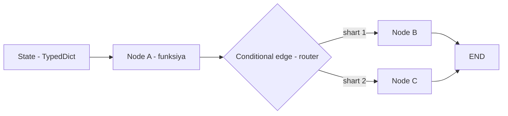
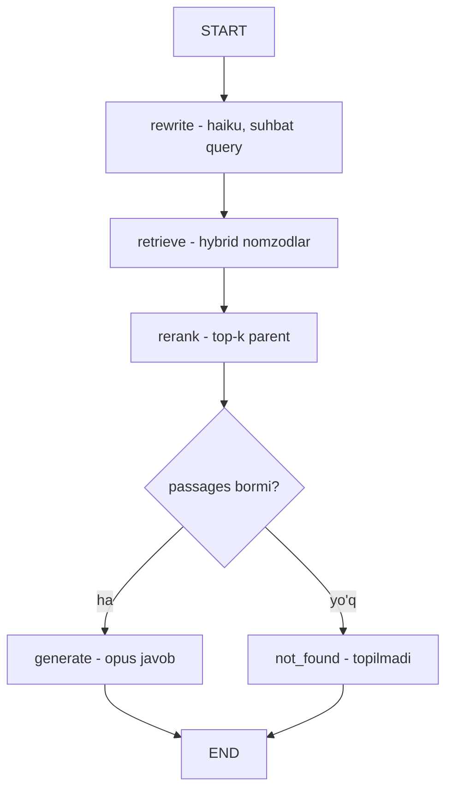

# 09. Bonus — LangGraph asoslari va docqa graph

Bu kurs 1-6 bo'limlarda hamma narsani **ataylab raw API'da** qurdi: har `messages.create` chaqiruvi ko'rinadi, har token qayerdan kelgani ma'lum, versiya sinishlariga bog'liqlik minimal. Bu qaror shu bonus moduldan keyin ham **o'zgarmaydi**. Bu ikki dars — **ko'prik**: hh.uz va boshqa e'lonlarda "LangChain/LangGraph hands-on" ochiq talab qilinadi, va CV'da halol "ishlatganman" deyish uchun frameworkni bir marta qo'l bilan ushlab ko'rish kerak. Muhimi shu: kontseptni bilgan odam frameworkni bir kunda o'zlashtiradi, teskarisi ishlamaydi — shuning uchun avval mexanikani o'rgandik, endi o'ram bilan tanishamiz.

> 5-bo'limning framework tanlovi darsida LangGraph kodini `text` blokda *pseudocode* sifatida ko'rgandingiz ("bizning stack EMAS" degan izoh bilan). Endi u haqiqiy, ishlaydigan kodga aylanadi — lekin siz allaqachon qurgan docqa retrieval pipeline'ining aynan o'zi, faqat graph shaklida qayta ifodalangan.

---

## Nega framework — muammo va yechim

4-bo'lim docqa loyihasida `/ask` handler'ining yuragi shunday edi (uch funksiya, ketma-ket):

```text
query    = rewrite(client, history, question)      # suhbat -> mustaqil query
passages = retrieve(pool, embedder, vo, query)     # hybrid -> rerank -> parent
result   = generate(client, passages, query)       # opus + citations
```

Bu **ishlaydi** va o'qishga oson. Lekin production talablari o'sganda kamchiliklar chiqadi:

- **Holat qo'lda ko'chadi.** `query`, `passages`, `result` — lokal o'zgaruvchilar. Yangi qadam qo'shsang, uni to'g'ri joyga tiqib, oldingi/keyingi o'zgaruvchilarni qo'lda ulaysan.
- **Checkpoint yo'q.** Agar `generate` yarim yo'lda uzilsa (rate limit, timeout), butun zanjir noldan boshlanadi — retrieval'ni qayta qilasan, embed'ga qayta pul to'laysan.
- **Human-in-the-loop qiyin.** "Generation'dan oldin operator tasdig'i" kerak bo'lsa, zanjirni ikkiga bo'lib, holatni tashqarida saqlab, ikkinchi so'rovda tiklashni o'zing yozasan.
- **Filialli oqim tarqoq.** "Retrieval bo'sh bo'lsa boshqa yo'l" mantiqi `if` bo'lib kod ichiga sochiladi; oqim tuzilishi bitta joyda ko'rinmaydi.

**LangGraph** aynan shu muammolarni yechish uchun. U — **graph runtime** (grafni ishga tushiruvchi dvigatel): pipeline'ni funksiya zanjiri emas, **State + Node + Edge** grafi sifatida ifodalaysan, u esa holatni ko'chirish, checkpoint, interrupt va filiallashni o'z zimmasiga oladi.

Backend analogiyasi aniq: bu **request middleware chain**ga o'xshaydi. FastAPI'da so'rov middleware'lar zanjiridan o'tadi, har biri `request` kontekstini o'zgartiradi, routing keyingisini tanlaydi. LangGraph'da:

| LangGraph | Backend ekvivalenti |
|---|---|
| **State** (TypedDict) | so'rov konteksti / DB tranzaksiya holati |
| **Node** (funksiya) | middleware yoki handler bosqichi |
| **Edge** (static) | keyingi bosqich (qat'iy tartib) |
| **Conditional edge** | router: holatiga qarab keyingi handler'ni tanlaydi |
| **compile + checkpointer** | holatni Redis/DB'da saqlaydigan sessiya qatlami |



### Qachon oqlanadi va narxi

Framework tekin emas — u **abstraksiya qatlami** qo'shadi. Qachon to'lash arziydi:

- **Oqlanadi:** durable state kerak (uzun oqim, checkpoint/replay), human-in-the-loop shart, ko'p filialli murakkab oqim, jamoada standart tuzilma kerak.
- **Oqlamaydi:** oddiy uch qadamli zanjir (aynan bizning `/ask`!), kontrakt aniq, debug muhim, minimal dependency talab.

Narxining eng achchiq ko'rinishi — **versiya churn**. Kurs boshidan aytgan tamoyil "kitob 2024 ≠ API 2026" frameworkka ham amal qiladi, hatto kuchliroq:

> **Ogohlantirish:** Internetdagi LangGraph tutoriallarining aksariyati `langgraph.prebuilt.create_react_agent` ni ko'rsatadi. LangGraph v1'da bu **DEPRECATED**. O'rniga `langchain.agents.create_agent` yoki to'g'ridan-to'g'ri `StateGraph`. Tutorial nusxa ko'chirsang, deprecation warning yoki import xatosiga urilasan. Bu — frameworkning "qatlam narxi": u siz uchun qaror qabul qiladi, keyin o'sha qarorni o'zgartiradi.

Joriy holat (2026-07): LangGraph **v1.x** (1.1.6 stable). Paketlar: `langgraph` (core — StateGraph, node, edge), `langchain` (`create_agent`), `langchain-anthropic` (`ChatAnthropic`). `InMemorySaver` esa `langgraph.checkpoint.memory` da.

---

## O'rnatish

```bash
pip install langgraph langchain langchain-anthropic python-dotenv
```

```text
# requirements.txt (bonus modul - YAGONA framework istisnosi)
langgraph>=1.0
langchain>=1.0
langchain-anthropic>=1.0
python-dotenv>=1.0
```

`.env` da o'sha bitta kalit (raw API'dagi kabi) — `ChatAnthropic` uni avtomatik o'qiydi:

```text
# .env
ANTHROPIC_API_KEY=sk-ant-...
```

---

## 1-qadam: minimal graph — State, Node, Edge

Framework kontseptlarini eng kichik ishlaydigan grafda ko'ramiz: ikki node, START'dan END'gacha. Hech qanday LLM yo'q — faqat "holat node'lar aro qanday ko'chadi"ni his qilish uchun.

```python
# file: 01_minimal_graph.py
from typing import TypedDict

from langgraph.graph import StateGraph, START, END


# --- 1-qadam: holat sxemasi - node'lar aro ko'chadigan "request context" ---
class State(TypedDict):
    text: str
    steps: int


# --- 2-qadam: node = funksiya, state oladi, O'ZGARGAN qismini qaytaradi ---
def upper_node(state: State) -> dict:
    return {"text": state["text"].upper(), "steps": state["steps"] + 1}


def exclaim_node(state: State) -> dict:
    return {"text": state["text"] + "!", "steps": state["steps"] + 1}


# --- 3-qadam: graf qurish - node qo'shamiz, edge bilan ulaymiz ---
builder = StateGraph(State)
builder.add_node("upper", upper_node)
builder.add_node("exclaim", exclaim_node)
builder.add_edge(START, "upper")          # kirish nuqtasi
builder.add_edge("upper", "exclaim")      # ketma-ket
builder.add_edge("exclaim", END)          # chiqish nuqtasi

graph = builder.compile()

# --- 4-qadam: ishga tushirish - boshlang'ich holat beriladi ---
result = graph.invoke({"text": "salom", "steps": 0})
print(result)

# Output:
# {'text': 'SALOM!', 'steps': 2}
```

Notional machine — kod ortida nima sodir bo'ladi: `invoke` boshlang'ich holatni oladi, START'dan `upper` node'ga o'tadi. `upper_node` `{"text": "SALOM", "steps": 1}` qaytaradi — LangGraph bu **qisman** holatni asosiy holatga **birlashtiradi** (kalitlarni almashtiradi). Keyin edge `exclaim` node'ga olib boradi, u `steps`ni yana bittaga oshiradi. END'da yakuniy holat qaytadi. Node **butun holatni emas, faqat o'zgartirgan kalitlarini** qaytaradi — qolgani saqlanadi. Bu FastAPI middleware'da `request.state`ga maydon qo'shishga o'xshaydi.

---

## 2-qadam: docqa retrieval pipeline'ni graph qilish

Endi asosiy ish: 4-bo'lim docqa `/ask` zanjirini graph'ga aylantiramiz. Raw kodda uch funksiya edi — grafda **to'rt node** (rewrite, retrieve, rerank, generate) + bitta filial (retrieval bo'sh bo'lsa `not_found`).

Diqqat: `retrieve` va `rerank` node'lari haqiqiy docqa'da hybrid RRF SQL va `rerank-2.5` API chaqiradi (Postgres + Voyage kerak). Bu yerda mexanikani ko'rsatish uchun ularni **kichik xotira ichidagi korpus** ustida soddalashtiramiz — graf tuzilishi aynan bir xil qoladi, faqat `retrieve`/`rerank` ichi mock. `generate` esa **haqiqiy** `ChatAnthropic` chaqiruvi. Shunda kod faqat `ANTHROPIC_API_KEY` bilan to'liq ishlaydi.

Avval holat va korpus:

```python
# file: 02_docqa_graph.py
from typing import Optional, TypedDict

from dotenv import load_dotenv
from langchain_anthropic import ChatAnthropic
from langchain_core.messages import HumanMessage, SystemMessage
from langgraph.graph import StateGraph, START, END

load_dotenv()


# --- 1-qadam: holat - docqa /ask oqimining "request context"i ---
class DocQAState(TypedDict):
    question: str                 # foydalanuvchi savoli
    history: Optional[list]       # suhbat tarixi (None bo'lsa rewriting shart emas)
    query: str                    # rewriting'dan keyingi mustaqil query
    candidates: list              # retrieve natijasi (top-20 nomzod)
    passages: list                # rerank'dan keyingi top-k parent
    answer: str                   # generation natijasi
    sources: list                 # manba fayllar


# --- kichik korpus (haqiqiy docqa'da bu pgvector + parents jadvali) ---
CORPUS = [
    {"file": "golang/context.md",
     "content": "context.Context bekor qilish signalini goroutine daraxti bo'ylab tarqatadi. "
                "cancel() chaqirilganda ctx.Done() kanali yopiladi va goroutine ishini tugatadi."},
    {"file": "golang/channels.md",
     "content": "Buffersiz channel'da yuboruvchi qabul qiluvchi tayyor bo'lguncha kutadi - "
                "uzatish sinxron. Buffered channel buffer to'lguncha bloklamaydi."},
    {"file": "golang/mutex.md",
     "content": "sync.Mutex umumiy o'zgaruvchini himoya qiladi. Lock va Unlock orasidagi "
                "kod bir vaqtda faqat bitta goroutine tomonidan bajariladi."},
]
```

Endi to'rt node. Har biri raw docqa'dagi bitta funksiyaga to'g'ri keladi:

```python
# file: 02_docqa_graph.py (davomi)

# --- rewrite node: suhbat bo'lsa mustaqil query yasaydi (raw: rewrite()) ---
def rewrite_node(state: DocQAState) -> dict:
    if not state.get("history"):
        return {"query": state["question"]}          # birinchi savol -> o'zgarishsiz
    llm = ChatAnthropic(model="claude-haiku-4-5", max_tokens=128)
    convo = "\n".join(f"{t['role']}: {t['content']}" for t in state["history"])
    msg = f"Suhbat:\n{convo}\n\nOxirgi savolni mustaqil qidiruv so'roviga aylantir: {state['question']}"
    resp = llm.invoke([HumanMessage(content=msg)])
    return {"query": resp.content.strip()}


# --- retrieve node: nomzodlarni topadi (raw: retrieve() ning hybrid qismi) ---
def retrieve_node(state: DocQAState) -> dict:
    q_words = set(state["query"].lower().split())
    scored = []
    for doc in CORPUS:                                # sodda keyword skoring (mock hybrid)
        overlap = len(q_words & set(doc["content"].lower().split()))
        if overlap:
            scored.append((overlap, doc))
    scored.sort(key=lambda x: x[0], reverse=True)
    return {"candidates": [doc for _, doc in scored]}


# --- rerank node: top-k tanlaydi (raw: retriever ichidagi rerank-2.5 funnel) ---
def rerank_node(state: DocQAState) -> dict:
    return {"passages": state["candidates"][:2]}      # mock rerank -> top-2 parent


# --- generate node: HAQIQIY Claude (raw: generate()) ---
SYSTEM = ("Sen hujjatlar bo'yicha yordamchisan. FAQAT berilgan hujjatlarga tayanib javob ber. "
          "Javob bo'lmasa 'Hujjatlarda topilmadi' deb yoz. O'zbekcha javob ber.")


def generate_node(state: DocQAState) -> dict:
    ctx = "\n\n".join(f"[{p['file']}]\n{p['content']}" for p in state["passages"])
    llm = ChatAnthropic(model="claude-opus-4-8", max_tokens=512)
    resp = llm.invoke([
        SystemMessage(content=SYSTEM),
        HumanMessage(content=f"Hujjatlar:\n{ctx}\n\nSavol: {state['query']}"),
    ])
    return {"answer": resp.content, "sources": [p["file"] for p in state["passages"]]}


# --- not_found node: retrieval bo'sh bo'lsa (raw: generator ichidagi if not passages) ---
def not_found_node(state: DocQAState) -> dict:
    return {"answer": "Hujjatlarda topilmadi.", "sources": []}
```

Endi grafni yig'amiz. Muhim yangilik — **conditional edge**: `rerank`dan keyin holatga qarab yo'l ayriladi.

```python
# file: 02_docqa_graph.py (davomi)

# --- conditional edge: retrieval bo'sh bo'lsa not_found'ga, aks holda generate'ga ---
def route_after_rerank(state: DocQAState) -> str:
    return "generate" if state["passages"] else "not_found"


# --- graf: rewrite -> retrieve -> rerank -> {generate | not_found} -> END ---
builder = StateGraph(DocQAState)
builder.add_node("rewrite", rewrite_node)
builder.add_node("retrieve", retrieve_node)
builder.add_node("rerank", rerank_node)
builder.add_node("generate", generate_node)
builder.add_node("not_found", not_found_node)

builder.add_edge(START, "rewrite")
builder.add_edge("rewrite", "retrieve")
builder.add_edge("retrieve", "rerank")
builder.add_conditional_edges("rerank", route_after_rerank)   # FILIAL shu yerda
builder.add_edge("generate", END)
builder.add_edge("not_found", END)

graph = builder.compile()

# --- ishga tushirish: grounded savol ---
out = graph.invoke({"question": "Goroutine qanday to'xtatiladi?", "history": None})
print("answer :", out["answer"][:90])
print("sources:", out["sources"])

# Output:
# answer : Goroutine'ni to'xtatish uchun context.Context ishlatiladi: cancel() chaqirilganda ct
# sources: ['golang/context.md']
```

Butun docqa pipeline endi bitta grafda ko'rinadi. Uni Mermaid'da chizsak, kodning aynan o'zi:



Korpusda yo'q savol berilsa, `route_after_rerank` filiali `not_found` node'ga yo'naltiradi — LLM umuman chaqirilmaydi (raw docqa'dagi "topilmadi" yo'lining aynan o'zi):

```python
# file: 02_docqa_graph.py (davomi) - korpusda yo'q savol
out = graph.invoke({"question": "Kubernetes pod avtoscaling qanday?", "history": None})
print("answer :", out["answer"])
print("sources:", out["sources"])

# Output:
# answer : Hujjatlarda topilmadi.
# sources: []
```

---

## 3-qadam: streaming — node-by-node kuzatish

Raw docqa'da oqimni ko'rish uchun `print` qo'yarding. LangGraph buni tekin beradi: `graph.stream(...)` har node bajarilgach o'sha node chiqargan o'zgarishni yuboradi. Bu — debug va observability uchun tayyor mexanizm (5-bo'lim tracing ruhida, lekin bepul).

```python
# file: 03_docqa_stream.py (02 dagi graph'ni import qilgan deb faraz qiling)
# from docqa_graph import graph

# --- stream_mode="updates": har qadamda FAQAT o'sha node o'zgartirgan kalitlar ---
for step in graph.stream({"question": "Goroutine qanday to'xtatiladi?", "history": None},
                         stream_mode="updates"):
    for node_name, update in step.items():
        print(f"[{node_name}] -> {list(update.keys())}")

# Output:
# [rewrite] -> ['query']
# [retrieve] -> ['candidates']
# [rerank] -> ['passages']
# [generate] -> ['answer', 'sources']
```

Har qator — bitta node bajarilgani va u holatning qaysi kalitlarini yangilagani. `stream_mode="updates"` faqat o'zgarishlarni beradi; `stream_mode="values"` esa har qadamda **butun** holat snapshot'ini beradi (kattaroq, lekin to'liq kontekst). Bu — raw kodda `print("[retrieve]", passages)` qatorlarini qo'lda sochib yurishning o'rniga keladigan struktura.

---

## Raw docqa va LangGraph — taqqoslash

Bir xil pipeline, ikki ifoda. Nima yutdik, nima yo'qotdik:

| Raw docqa (`app.py` /ask) | LangGraph docqa graph |
|---|---|
| `rewrite(client, history, q)` funksiya chaqiruvi | `rewrite` node |
| `retrieve(pool, ..., q)` chaqiruvi | `retrieve` node |
| rerank funnel (retriever ichida) | alohida `rerank` node |
| `generate(client, passages, q)` | `generate` node |
| `if not passages: return topilmadi` (kod ichida) | `not_found` node + conditional edge |
| zanjir tartibi ketma-ket satrlarda | `add_edge` bilan aniq, ko'rinadigan graf |
| holat = lokal o'zgaruvchilar (`query`, `passages`) | holat = `State` TypedDict, node'lar aro birlashtiriladi |
| oqimni ko'rish: qo'lda `print` | `graph.stream(stream_mode="updates")` tayyor |
| checkpoint = o'zing yozasan | `compile(checkpointer=...)` tayyor (10-darsda) |

**Yutdik:** vizual struktura (oqim bitta joyda ko'rinadi), node'lar mustaqil test qilinadi, streaming/checkpoint/HITL tayyor keladi, jamoada standart shakl.

**Yo'qotdik:** uch qo'shimcha paket (`langgraph` + `langchain` + `langchain-anthropic`), abstraksiya qatlami HTTP chaqiruvni yashiradi, **citations API'ni yo'qotdik** — raw docqa `document` bloklar + `cited_text` bilan aniq iqtibos berardi (07-dars), `ChatAnthropic` wrapper esa buni toza chiqarmaydi, shuning uchun grafda `sources` faqat fayl nomi darajasida qoldi. Bu — "framework abstraksiyasi past darajadagi imkoniyatni berkitadi"ning konkret misoli.

> **Xulosa qoidasi:** LangGraph docqa pipeline'ini *o'zgartirmadi* — u aynan bir xil rewrite/retrieve/rerank/generate mantiqini graph shaklida qayta chizdi. Kontseptni (small-to-big, hybrid+rerank funnel, "topilmadi" yo'li) bilgansiz — framework shuni yangi sintaksisda ifodalaydi, xolos.

---

## Modify — grafni o'zgartir

1. **Cache-check node qo'sh.** `rewrite` va `retrieve` orasiga `cache_check` node qo'sh: agar `query` oldindan ko'rilgan bo'lsa (oddiy `dict` kesh), to'g'ridan-to'g'ri javobni qaytar va `retrieve`ni o'tkazib yubor. Ipucha: `route_after_cache(state)` conditional edge yoz — kesh bor bo'lsa `END`, yo'q bo'lsa `retrieve`. Bu 3-dars (caching) mantiqini graf sifatida ifodalaydi.

2. **rerank'ni sozlanadigan qil.** `DocQAState`ga `k: int` maydon qo'sh va `rerank_node` da `state["candidates"][:state["k"]]` qil. `invoke` da `k`ni ber. Node'lar holatdan parametr o'qiy oladi — argument uzatishning grafdagi shakli.

3. **retrieve'ni haqiqiy docqa'ga ula.** `retrieve_node` ichidagi mock skoringni `httpx.post` bilan almashtir: docqa `GET /search` endpoint'iga so'rov yuborib, real natijani qaytar. Node ichi HTTP chaqiruvi bo'lsa ham, graf tuzilishi o'zgarmaydi — bu node'larning mustaqilligini ko'rsatadi.

---

## Make — mustaqil topshiriq

**Challenge:** `mode` (`vector` yoki `hybrid`) ga qarab ikki xil retrieval yo'lini tanlaydigan graf yoz. `DocQAState`ga `mode: str` qo'sh. `rewrite`dan keyin conditional edge `mode`ga qarab `retrieve_vector` yoki `retrieve_hybrid` node'iga yo'naltirsin, ikkalasi ham keyin `rerank`ga borsin. Maqsad: conditional edge'ni **oqim boshida** (nafaqat oxirida) ishlatishni ko'rsatish.

<details>
<summary>Yechim</summary>

```python
# file: make_mode_route.py
from typing import Optional, TypedDict

from langgraph.graph import StateGraph, START, END


class State(TypedDict):
    query: str
    mode: str
    passages: list


# --- ikki xil retrieval node (mock; farqni ko'rsatish uchun) ---
def retrieve_vector(state: State) -> dict:
    return {"passages": [{"file": "vec-hit.md", "content": "vektor yo'li"}]}


def retrieve_hybrid(state: State) -> dict:
    return {"passages": [{"file": "hybrid-hit.md", "content": "hybrid yo'li"}]}


def rerank(state: State) -> dict:
    return {"passages": state["passages"][:1]}


# --- OQIM BOSHIDAGI conditional edge: mode retrieval yo'lini tanlaydi ---
def route_by_mode(state: State) -> str:
    return "retrieve_hybrid" if state["mode"] == "hybrid" else "retrieve_vector"


builder = StateGraph(State)
builder.add_node("retrieve_vector", retrieve_vector)
builder.add_node("retrieve_hybrid", retrieve_hybrid)
builder.add_node("rerank", rerank)

# START'dan to'g'ridan-to'g'ri conditional edge - kirishda filial
builder.add_conditional_edges(START, route_by_mode)
builder.add_edge("retrieve_vector", "rerank")
builder.add_edge("retrieve_hybrid", "rerank")
builder.add_edge("rerank", END)

graph = builder.compile()

print(graph.invoke({"query": "goroutine", "mode": "hybrid", "passages": []})["passages"])
print(graph.invoke({"query": "goroutine", "mode": "vector", "passages": []})["passages"])

# Output:
# [{'file': 'hybrid-hit.md', 'content': 'hybrid yo'li'}]
# [{'file': 'vec-hit.md', 'content': 'vektor yo'li'}]
```

Asosiy nuqta: `add_conditional_edges` START'dan ham chiqishi mumkin — filial oqimning istalgan joyida bo'ladi. Bu 04-dars (routing) pattern'ining grafdagi shakli: bitta holat maydoni (`mode`) butun oqim yo'nalishini belgilaydi.
</details>

---

## Kengaytirish g'oyalari

- **Checkpointer qo'sh.** `builder.compile(checkpointer=InMemorySaver())` va `thread_id` bilan ishga tushir — endi graf uzilsa oxirgi muvaffaqiyatli node'dan tiklanadi (10-darsda agent bilan qilamiz).
- **Node'larni haqiqiy docqa modullariga ula.** Mock `retrieve_node`/`rerank_node` o'rniga docqa `retriever.py` funksiyalarini import qil (Postgres pool bilan) — graf o'zgarmaydi, faqat node ichi to'ladi.
- **HITL: `generate` oldidan interrupt.** `interrupt_before=["generate"]` bilan operator retrieval natijasini ko'rib, generatsiyaga ruxsat bersin (10-darsda mexanikasi).
- **LangSmith trace.** `LANGSMITH_API_KEY` env bilan har run avtomatik trace'ga tushadi — 5-dars observability'ning framework varianti (faqat nom sifatida).

---

## O'z-o'zini tekshir

1. LangGraph node funksiyasi butun holatni emas, faqat o'zi o'zgartirgan kalitlarni qaytaradi. Agar `generate_node` `{"answer": ...}` qaytarsa, `question` maydoniga nima bo'ladi va nega?
2. `add_edge` va `add_conditional_edges` orasidagi farq nima? docqa grafida qaysi joyda qay biri ishlatildi va nega?
3. Raw docqa'da "topilmadi" mantiqi `generate` funksiyasi ichidagi `if` edi. Grafda u alohida `not_found` node'ga chiqarildi. Bu nimani soddalashtiradi?
4. `stream_mode="updates"` va `stream_mode="values"` orasidagi farq nima? Katta holatda qaysi biri arzonroq?
5. Bu bo'lim boshida "LangGraph docqa'ni o'zgartirmadi, faqat qayta ifodaladi" deyildi. Bu gap frameworkni o'rganish strategiyasi haqida nima aytadi (kontsept avval, framework keyin)?

---

## Manbalar

- LangGraph v1 migration (create_react_agent DEPRECATED -> create_agent): `https://docs.langchain.com/oss/python/migrate/langgraph-v1`
- LangGraph graph API (StateGraph, add_messages, conditional edges, stream): `https://docs.langchain.com/oss/python/langgraph/graph-api`
- LangGraph repo (versiyalar, changelog): `https://github.com/langchain-ai/langgraph`
- Anthropic — Building effective agents ("start with LLM APIs directly", framework abstraksiyasi ogohlantirishi): `https://www.anthropic.com/engineering/building-effective-agents`
- Kurs 4-bo'lim docqa loyihasi (rewrite/retrieve/rerank/generate zanjiri — bu darsning grafi shuni qayta ifodalaydi).

---

Keyingi dars: [10. Bonus — LangGraph agent va repoagent qiyosi](10.%20Bonus%20—%20LangGraph%20agent%20va%20repoagent%20qiyosi.md)
