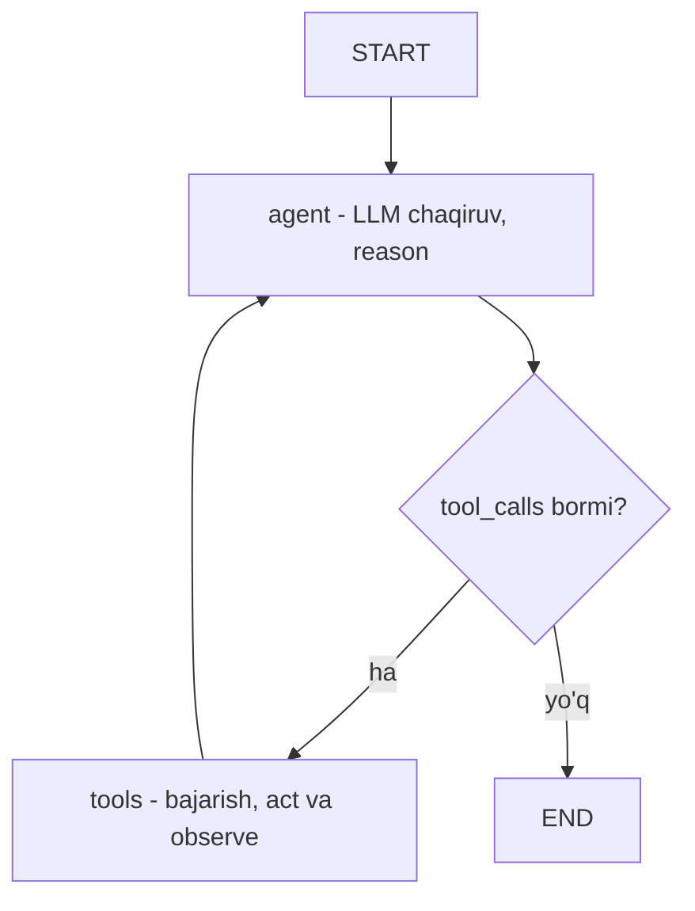

# 10. Bonus — LangGraph agent va repoagent qiyosi

Oldingi darsda docqa retrieval pipeline'ini LangGraph grafi sifatida qayta chizdik. Endi eng qiziq qism: 5-bo'limda qo'l bilan yozgan **agent loop**ni (`while stop_reason == "tool_use"`) LangGraph agentiga aylantiramiz va yonma-yon qo'yamiz. Maqsad bitta muhim tenglikni ko'rsatish: **bizning `while` loop'imiz = LangGraph'ning `agent -> tools -> agent` grafi**. Kontseptni bir marta o'z qo'lingiz bilan qurgansiz — shuning uchun bu yerda framework hech qanday sehr emas, faqat o'sha loop'ning tayyor o'rami.

> Yodda tuting: raw API asosiy qaror **o'zgarmaydi**. repoagent MCP server, audit JSONL va o'zimiz yozgan HITL bilan — to'liq nazoratda. Bu dars — CV uchun "LangGraph hands-on" tajribasi va "qachon qaysi biri" qarorini aniq asoslash uchun.

---

## Nazariya — agent loop'ni graf sifatida ko'rish

5-bo'lim repoagent loop'ining skeleti shunday edi (soddalashtirilgan):

```text
while iteration < MAX_ITERATIONS:
    resp = client.messages.create(tools=tools, messages=messages)   # reason
    if resp.stop_reason == "end_turn":
        break                                                       # tugadi
    for block in resp.content:                                      # act
        if block.type == "tool_use":
            result = dispatch(block.name, block.input)              # observe
    messages.append(...)                                            # holatni yangila
```

Bu — **sikl** (cycle): model tool so'raydi, biz bajaramiz, natijani qaytaramiz, model yana o'ylaydi. LangGraph'da aynan shu sikl **ikki node + bitta shartli qirra** bo'lib chiziladi:

- **agent node** — LLM chaqiruvi (`reason`). Raw'dagi `client.messages.create(tools=...)`.
- **tools node** — tool'larni bajarish (`act` + `observe`). Raw'dagi `dispatch` loop.
- **conditional edge** — `tool_calls` bormi? Bor bo'lsa `tools`ga, yo'q bo'lsa `END`ga. Raw'dagi `if stop_reason == "tool_use"`.



`tools -> agent` qirrasi — bu **sikl**. Raw loop'da `while` shuni qilardi; grafda qirra shuni qiladi. Tugash sharti ham bir xil: model `tool_calls`siz javob bersa (raw'da `end_turn`), `should_continue` `END`ni tanlaydi.

### create_agent — tayyor agent

LangChain v1 bu grafni siz uchun tayyor beradi: `create_agent`. U ichida aynan yuqoridagi `agent <-> tools` siklni quradi, ustiga **middleware** tizimi (validatsiya, summarizatsiya, guardrail'lar oraliqqa qo'shiladi) va **checkpointer** qo'yadi.

> **Ogohlantirish (yana):** eski tutoriallar `langgraph.prebuilt.create_react_agent` ni ko'rsatadi — bu v1'da **DEPRECATED**. To'g'ri import: `from langchain.agents import create_agent`. Bir harf emas, butun paket o'zgardi (`langgraph` -> `langchain`). Bu framework versiya churn'ining tirik misoli.

### Checkpointer va suhbat holati

repoagent'da suhbatni davom ettirish uchun `messages` ro'yxatini o'zingiz saqlardingiz. LangGraph buni **checkpointer** bilan avtomatlashtiradi: `InMemorySaver` (yoki `SqliteSaver`) holatni `thread_id` bo'yicha saqlaydi. Bir `thread_id` bilan ikki marta `invoke` qilsang, ikkinchisi birinchining kontekstini ko'radi — xuddi Redis'da sessiya saqlagandek (7-bo'lim serving darsidagi sessiya dict'i, lekin framework beradi).

### Interrupt — HITL grafda

5-bo'lim xavfsizlik darsida `write_report` oldidan qo'lda `approve()` yozgandingiz: terminal so'raydi, `y` bo'lsa davom. LangGraph buni **`interrupt_before`** bilan beradi: graf ma'lum node oldida **to'xtaydi**, holat checkpointer'da qoladi, operator ko'rib `invoke(None, config)` bilan davom ettiradi. Bu bir xil g'oya (qaytarib bo'lmas amaldan oldin inson), lekin mexanizm frameworkda.

| repoagent HITL (5-bo'lim) | LangGraph HITL |
|---|---|
| `approve()` funksiyasi terminal so'raydi | `interrupt_before=["tools"]` graf to'xtatadi |
| holat `messages` list'da (jarayon ichida) | holat checkpointer'da (thread_id bo'yicha) |
| rad etsa `is_error=True` qaytadi | holatni tahrirlab yoki `invoke(None)` bilan davom/bekor |
| kod o'zingizniki, to'liq ko'rinadi | framework beradi, ichi yashirin |

---

## O'rnatish

09-darsdagi paketlar yetadi. Repo tool'lari uchun qo'shimcha kutubxona kerak emas — `os`/`pathlib` bilan:

```bash
pip install langgraph langchain langchain-anthropic python-dotenv
```

---

## 1-qadam: create_agent bilan mini repo-tahlilchi

Avval eng yuqori daraja: `create_agent` bilan repoagent'ning kichraytirilgan varianti. Uch `@tool` (repoagent'ning `list_tree`/`read_file`/`search_code` ekvivalenti), bitta `ChatAnthropic`, va... deyarli boshqa hech narsa. repoagent'dagi butun manual loop `create_agent`ning bitta qatoriga siqiladi.

```python
# file: 01_create_agent.py
import os
from pathlib import Path

from dotenv import load_dotenv
from langchain.agents import create_agent
from langchain_core.tools import tool

load_dotenv()

# --- repo ildizi (repoagent'dagi --repo o'rniga env; path guard shu ildizga nisbatan) ---
REPO_ROOT = Path(os.environ.get("REPO_ROOT", ".")).resolve()
IGNORE = {".git", "__pycache__", "node_modules", ".venv"}


def _safe(rel: str) -> Path:
    target = (REPO_ROOT / rel).resolve()                 # symlink va .. ni yechadi (5-bo'lim)
    if REPO_ROOT != target and REPO_ROOT not in target.parents:
        raise ValueError(f"ruxsat berilmagan yo'l: {rel}")
    return target


# --- @tool: docstring PROMPT vazifasini bajaradi (repoagent'dagi kabi) ---
@tool
def list_files(subdir: str = ".") -> str:
    """Repo ichidagi papka fayllarini ro'yxatlaydi. subdir ildizga nisbatan beriladi."""
    base = _safe(subdir)
    names = [p.name + ("/" if p.is_dir() else "")
             for p in sorted(base.iterdir()) if p.name not in IGNORE]
    return "\n".join(names) if names else "(bo'sh)"


@tool
def read_file(path: str, max_lines: int = 200) -> str:
    """Repo ichidagi faylni o'qiydi (max_lines qatorgacha, keyin qisqartiriladi)."""
    target = _safe(path)
    if not target.is_file():
        raise ValueError(f"fayl topilmadi: {path}")
    lines = target.read_text(encoding="utf-8", errors="replace").splitlines()
    body = "\n".join(lines[:max_lines])
    return body + (f"\n... [{len(lines) - max_lines} qator qisqartirildi]"
                   if len(lines) > max_lines else "")


@tool
def search_code(pattern: str) -> str:
    """Repo bo'ylab oddiy substring qidiradi. Regex emas, oddiy matn."""
    hits = []
    for p in sorted(REPO_ROOT.rglob("*")):
        if not p.is_file() or set(p.relative_to(REPO_ROOT).parts) & IGNORE:
            continue
        try:
            for i, line in enumerate(p.read_text(errors="replace").splitlines(), 1):
                if pattern in line:
                    hits.append(f"{p.relative_to(REPO_ROOT)}:{i}: {line.strip()[:80]}")
        except OSError:
            continue
    return "\n".join(hits[:20]) if hits else f"'{pattern}' topilmadi."
```

Endi agentning o'zi — repoagent'ning butun `run_agent` + `dispatch` + loop mantiqi shu yerda:

```python
# file: 01_create_agent.py (davomi)

# --- model string sifatida ("provider:model"); ChatAnthropic instance ham bo'ladi ---
agent = create_agent(
    model="anthropic:claude-opus-4-8",
    tools=[list_files, read_file, search_code],
    system_prompt=(
        "Sen repo tahlilchi agentsan. Avval list_files bilan strukturani ko'r, "
        "keyin read_file va search_code bilan chuqurlash. O'zbekcha, qisqa javob ber."
    ),
)

# --- invoke: messages dict beriladi, natija ham messages ro'yxati ---
result = agent.invoke({"messages": [
    {"role": "user", "content": "Bu repo qanday tuzilgan? Asosiy fayllarni ayt."}
]})
print(result["messages"][-1].content)

# Output:
# Bu repo uch fayldan iborat: 01_create_agent.py (agent va tool'lar), requirements.txt
# (langgraph, langchain, langchain-anthropic) va README.md. Agent create_agent bilan
# qurilgan, tool'lar @tool dekorator orqali berilgan. Asosiy mantiq 01_create_agent.py da.
```

Butun repoagent loop'i — planning, `while`, stop_reason'lar, `dispatch`, `messages.append` — `create_agent`ning ichida. Siz faqat tool'lar va system prompt berdingiz. **Lekin** e'tibor bering: bu abstraksiya loop mexanikasini butunlay yashirdi. Debug qilishda "model nega bu tool'ni chaqirdi" savoliga javob topish qiyinlashadi — chunki oraliq `messages.create` chaqiruvlari framework ichida. Aynan shu 5-bo'lim 07-darsdagi ogohlantirish: framework prompt va javoblarni berkitadi.

---

## 2-qadam: xuddi shu agent StateGraph'da — qo'lda

Endi `create_agent`ning ichini ochamiz: aynan o'sha agentni `StateGraph` bilan **qo'lda** quramiz. Bu — bizning `while` loop'imizning graf tarjimasi, yonma-yon solishtirish uchun.

```python
# file: 02_manual_agent_graph.py (01 dagi tool'larni import qilgan deb faraz qiling)
from typing import Annotated, TypedDict

from langchain_anthropic import ChatAnthropic
from langchain_core.messages import HumanMessage, ToolMessage
from langgraph.graph import StateGraph, START, END
from langgraph.graph.message import add_messages

# from tools import list_files, read_file, search_code
TOOLS = [list_files, read_file, search_code]
TOOLS_BY_NAME = {t.name: t for t in TOOLS}


# --- holat: messages ro'yxati; add_messages reducer avtomatik APPEND qiladi ---
class AgentState(TypedDict):
    messages: Annotated[list, add_messages]


# --- model'ga tool'lar biriktiriladi (raw: create'ga tools=... berish) ---
llm = ChatAnthropic(model="claude-opus-4-8", max_tokens=1024).bind_tools(TOOLS)


# --- agent node = reason (raw: resp = client.messages.create(tools=...)) ---
def agent_node(state: AgentState) -> dict:
    response = llm.invoke(state["messages"])
    return {"messages": [response]}                      # add_messages qo'shib qo'yadi


# --- tools node = act + observe (raw: dispatch loop har tool_use uchun) ---
def tools_node(state: AgentState) -> dict:
    last = state["messages"][-1]
    results = []
    for call in last.tool_calls:                         # AIMessage.tool_calls
        tool = TOOLS_BY_NAME[call["name"]]
        output = tool.invoke(call["args"])
        results.append(ToolMessage(content=str(output), tool_call_id=call["id"]))
    return {"messages": results}                         # HAMMA natija - reducer birlashtiradi


# --- conditional edge = raw'dagi if stop_reason == "tool_use" ---
def should_continue(state: AgentState) -> str:
    last = state["messages"][-1]
    return "tools" if last.tool_calls else END
```

Grafni yig'amiz — siklni yopamiz:

```python
# file: 02_manual_agent_graph.py (davomi)
builder = StateGraph(AgentState)
builder.add_node("agent", agent_node)
builder.add_node("tools", tools_node)
builder.add_edge(START, "agent")
builder.add_conditional_edges("agent", should_continue)   # tool_calls bormi?
builder.add_edge("tools", "agent")                        # SIKL: natijadan keyin qaytadi

graph = builder.compile()

out = graph.invoke({"messages": [
    HumanMessage(content="search_code bilan 'def' izlab, nechta funksiya borligini ayt.")
]})
print(out["messages"][-1].content)

# Output:
# search_code 'def' bo'yicha 6 ta natija topdi: uchta @tool funksiya (list_files, read_file,
# search_code), _safe yordamchi, agent_node va tools_node. Jami repo'da 6 ta funksiya bor.
```

Endi ikki dunyoni yonma-yon qo'yamiz. Chapda 5-bo'lim repoagent loop'i, o'ngda shu grafning ekvivalent qismi:

| repoagent raw loop (5-bo'lim) | LangGraph graf ekvivalenti |
|---|---|
| `while iteration < MAX:` | `agent -> tools -> agent` sikli (qirra) |
| `resp = client.messages.create(tools=tools, ...)` | `agent_node`: `llm.bind_tools(TOOLS).invoke(...)` |
| `if resp.stop_reason == "tool_use"` | `should_continue`: `last.tool_calls` bor-yo'qligi |
| `if resp.stop_reason == "end_turn": break` | `should_continue` -> `END` |
| `for block in ...: dispatch(block.name, block.input)` | `tools_node`: har `call` uchun `tool.invoke(call["args"])` |
| `messages.append({"role": "assistant", ...})` qo'lda | `add_messages` reducer avtomatik |
| `messages.append({"role": "user", "content": results})` | `tools_node` `ToolMessage` ro'yxatini qaytaradi |
| `MAX_ITERATIONS` cheksiz loop qalqoni | `graph.invoke(..., config={"recursion_limit": N})` |

Ikki kod bir xil ish qiladi. Farq: repoagent'da siz stop_reason'ni, parallel tool_result qoidasini (hammasi bitta message'da), token yig'indisini **ko'rasiz va boshqarasiz**; grafda `add_messages` reducer va sikl buni siz uchun qiladi. Kichik agent uchun raw shaffofroq; katta tizimda grafning tayyor holat boshqaruvi qulayroq.

> LangGraph'da `tools_node`ni qo'lda yozdik, chunki maqsad — mexanikani `dispatch` bilan solishtirish. Amalda `from langgraph.prebuilt import ToolNode` bir qatorda shuni beradi (`tools_node = ToolNode(TOOLS)`), `tools_condition` esa `should_continue`ni. Ular DEPRECATED emas — faqat biz mexanikani ko'rsatish uchun ochib yozdik.

---

## 3-qadam: checkpointer bilan ikki turn suhbat

repoagent har sessiyada `messages`ni noldan qurardi (yoki `agent_notes.md` bilan qo'lda tiklardi). Grafga `checkpointer` bersak, `thread_id` bo'yicha holat saqlanadi — ikkinchi turn birinchining kontekstini ko'radi.

```python
# file: 03_checkpointer.py (02 dagi builder'ni ishlatadi)
from langchain_core.messages import HumanMessage
from langgraph.checkpoint.memory import InMemorySaver

# from manual_agent_graph import builder

# --- checkpointer holatni thread_id bo'yicha saqlaydi (raw: messages list qo'lda) ---
graph = builder.compile(checkpointer=InMemorySaver())
config = {"configurable": {"thread_id": "session-1"}}

# --- 1-turn ---
graph.invoke({"messages": [HumanMessage(content="README.md ni o'qib, nima haqida ekanini ayt.")]},
             config)

# --- 2-turn: "unda" oldingi kontekstga bog'lanadi, chunki thread_id BIR XIL ---
out = graph.invoke({"messages": [HumanMessage(content="Unda o'rnatish buyrug'i qaysi?")]},
                   config)
print(out["messages"][-1].content)

# Output:
# Oldin o'qigan README.md ga ko'ra, o'rnatish buyrug'i: pip install langgraph langchain
# langchain-anthropic python-dotenv. Bu bonus modulning uch asosiy paketini o'rnatadi.
```

Notional machine: birinchi `invoke`dan keyin checkpointer `session-1` uchun butun `messages` ro'yxatini (savol + tool natijalari + javob) saqlaydi. Ikkinchi `invoke` faqat yangi xabarni beradi, lekin `add_messages` reducer uni **saqlangan** tarixga qo'shadi — model "Unda" nimaga tegishli ekanini ko'radi. Bu 7-bo'lim serving darsidagi Redis sessiya dict'ining aynan vazifasi, lekin framework beradi. `thread_id`ni o'zgartirsang — toza suhbat (yangi foydalanuvchi).

---

## 4-qadam: interrupt_before bilan HITL approval

Eng qimmatli production xususiyati. repoagent'da `write_report` oldidan `approve()` yozgandingiz — grafda `interrupt_before=["tools"]` shu ishni qiladi: har tool bajarishdan **oldin** graf to'xtaydi, operator ko'radi, ruxsat bersa davom.

```python
# file: 04_hitl_interrupt.py (02 dagi builder'ni ishlatadi)
from langchain_core.messages import HumanMessage
from langgraph.checkpoint.memory import InMemorySaver

# from manual_agent_graph import builder

# --- interrupt_before: tools node OLDIDA to'xtaydi (raw: approve() gate) ---
graph = builder.compile(checkpointer=InMemorySaver(), interrupt_before=["tools"])
config = {"configurable": {"thread_id": "hitl-1"}}

# --- 1) invoke: agent tool chaqirmoqchi -> tools OLDIDA to'xtaydi ---
graph.invoke({"messages": [HumanMessage(content="config.py faylini o'qib ber.")]}, config)

# --- 2) holatni ko'ramiz: qaysi tool, qanday argument bilan kutmoqda ---
snapshot = graph.get_state(config)
pending = snapshot.values["messages"][-1].tool_calls[0]
print(f"KUTILMOQDA: {pending['name']} <- {pending['args']}")
print(f"keyingi node: {snapshot.next}")

# --- 3) operator ko'rib chiqdi -> None bilan DAVOM ettiradi (resume) ---
out = graph.invoke(None, config)
print("natija:", out["messages"][-1].content[:70])

# Output:
# KUTILMOQDA: read_file <- {'path': 'config.py'}
# keyingi node: ('tools',)
# natija: config.py da uchta sozlama bor: DATABASE_URL, REDIS_URL va MODEL nomi.
```

Uch bosqich repoagent HITL'ining aynan takrori: (1) graf `read_file` bajarishdan oldin to'xtadi; (2) `get_state` bilan **intent va argument**ni ko'rsatdik (`approve()` dagi "blast radius" ekvivalenti); (3) `invoke(None, config)` — `None` "yangi kirish yo'q, davom et" degani, xuddi `y` bosgandek. Rad etish uchun holatni tahrirlab (tool call'ni olib tashlab) yoki soxta `ToolMessage` qo'yib davom etardingiz — bu repoagent'dagi `is_error=True` qaytarishga o'xshaydi.

Muhim halol nuqta: LangGraph HITL **skeletini** berdi (to'xtash, resume), lekin **nima ruxsat etiladi** qarorini — qaysi tool xavfli, blast radius nima, audit'ga nima yozish — baribir siz yozasiz. Framework poka-yoke va least privilege'ni bermaydi.

---

## Yakuniy taqqoslash — repoagent vs LangGraph

Ikkala variant ham ishlaydi. Qaysi biri qachon:

| Jihat | repoagent (raw, 5-bo'lim) | LangGraph agent |
|---|---|---|
| Agent loop | `while` qo'lda, stop_reason ko'rinadi | `agent <-> tools` graf sikli, yashirin |
| Tool bajarish | `dispatch` (o'zingizniki) | `tools_node` yoki prebuilt `ToolNode` |
| Suhbat holati | `messages` list qo'lda | `InMemorySaver` + `thread_id` |
| HITL | `approve()` + `is_error` | `interrupt_before` + resume |
| Audit | `audit.jsonl` (o'zingizniki) | qo'lda qoladi yoki LangSmith |
| Tool izolyatsiyasi | MCP server (alohida jarayon) | `@tool` funksiyalar (jarayon ichida) |
| Xavfsizlik 6-qatlam | to'liq o'zingizniki, ko'rinadi | baribir o'zingizniki (framework bermaydi) |
| Dependency | `anthropic` + `mcp` (2 paket) | `langgraph` + `langchain` + `-anthropic` (3+) |
| Debug | shaffof (har chaqiruv ko'rinadi) | abstraksiya orqasida qiyinroq |
| Versiya barqarorligi | API kam o'zgaradi | churn (create_react_agent misoli) |

> **Qachon qaysi biri:** Kichik agent, aniq kontrakt, debug muhim, minimal dependency, to'liq nazorat kerak -> **raw API** (Anthropic tavsiyasi, bizning asosiy qaror). Katta jamoa, durable state + checkpoint/replay shart, standart tuzilma va tayyor HITL/observability infra kerak -> **framework**. Ikkalasida ham: xavfsizlik, audit va tool dizayni baribir sizniki.

---

## CV'ga nima yozish mumkin

Bu ikki darsdan keyin halol yozadigan tajriba:

> *LangGraph (v1) bilan RAG retrieval pipeline'ini StateGraph sifatida (rewrite/retrieve/rerank/generate node'lari, conditional routing) va tool-calling agentni (create_agent hamda qo'lda StateGraph varianti) qurdim; InMemorySaver checkpointer bilan ko'p turnli suhbat va interrupt_before bilan human-in-the-loop approval'ni amalga oshirdim. Framework va raw API o'rtasidagi almashinuvni (nazorat vs tayyor infra) baholay olaman.*

Bu — marketing emas, konkret. Intervyuda "create_react_agent deprecated bo'lganini bilaman, v1'da create_agent ishlatiladi" deyish sizni tutorial nusxa ko'chiruvchidan ajratadi.

## Keyingi qadamlar (faqat nom sifatida)

- **LangGraph Platform** — graflarni deploy qiladigan managed servis (durable execution, horizontal scaling). 7-bo'lim deployment darsining framework ekvivalenti.
- **LangSmith** — LangChain/LangGraph uchun observability va tracing (har node/chaqiruv avtomatik trace). 5-bo'lim observability darsining framework varianti.
- **langchain-mcp-adapters** — LangGraph agentini MCP server'ga ulaydi; repoagent'ning MCP tool'larini `create_agent`ga berish mumkin. Ikki dunyo (5-bo'lim MCP + bu bo'lim graf) birlashadi.

---

## O'z-o'zini tekshir

1. repoagent'ning `while stop_reason == "tool_use"` loop'i LangGraph grafida qaysi element'ga aylandi? `end_turn` qaysi qarorga to'g'ri keladi?
2. `add_messages` reducer bo'lmasa, `agent_node` va `tools_node` holatni qanday buzib qo'yardi? (Ipucha: node qaytargan qiymat kalitni almashtiradimi yoki qo'shadimi?)
3. `create_agent` va qo'lda `StateGraph` bir xil natija beradi. Debug nuqtai nazaridan qaysi biri afzal va nega?
4. `interrupt_before=["tools"]` bilan graf to'xtaganda, holat qayerda saqlanadi va nega `checkpointer` bu yerda majburiy?
5. Yakuniy taqqoslash jadvalida "xavfsizlik 6-qatlam baribir o'zingizniki" deyildi. Bu framework haqida qanday muhim haqiqatni ko'rsatadi?
6. Nega `create_react_agent` ni ko'rsatgan tutorial'ga ishonmaslik kerak, va bu kursning "kitob != API" tamoyili bilan qanday bog'lanadi?

---

## Manbalar

- LangGraph v1 migration (create_react_agent -> create_agent): `https://docs.langchain.com/oss/python/migrate/langgraph-v1`
- create_agent reference (model string/instance, tools, checkpointer, middleware): `https://reference.langchain.com/python/langchain/agents/factory/create_agent`
- LangGraph graph API (StateGraph, add_messages, conditional edges, InMemorySaver, interrupt_before): `https://docs.langchain.com/oss/python/langgraph/graph-api`
- Anthropic — Building effective agents (raw API avval, framework abstraksiya narxi): `https://www.anthropic.com/engineering/building-effective-agents`
- Kurs 5-bo'lim repoagent loyihasi (manual loop, MCP, HITL, audit — bu darsning grafi shuni qayta ifodalaydi).

---

## Kurs yakunlandi

Tabriklaymiz — AI Engineer kursini yakunladingiz. Portfolio zanjiringiz to'liq: **askops** (LLM API asoslari) -> **semsearch** (embeddings) -> **vecsearch** (vector DB) -> **docqa** (RAG) -> **evalharness** (evaluation) -> **prodqa** (production docqa + Telegram bot). Ushbu bonus modul zanjirni o'zgartirmadi — u faqat ko'prik qurdi: siz raw API'da qurgan retrieval pipeline va agent loop LangGraph'da shunchaki graph bo'lib ifodalanishini ko'rdingiz, ya'ni kontseptni bilgan odam frameworkni bir kunda o'zlashtiradi. Endi intervyu stolida "RAG qildim" degan gap emas, `docker compose up` bilan ko'tariladigan, o'lchanadigan, himoyalangan va deploy qilinadigan `prodqa` servisi — hamda uni har qanday framework'da qayta qura olishingiz — gapiradi.
