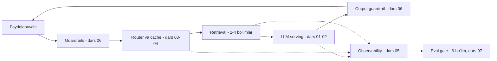

# 7. Production

> Model tayyor, RAG ishlaydi, eval o'rnatilgan — endi buni real foydalanuvchiga chiqarish
> kerak. Backend dasturchining raqobat ustunligi aynan shu yerda: serving, caching, cost
> nazorati, observability va guardrails — bularning hammasi siz allaqachon bilgan
> ko'nikmalar (HTTP, Redis, nginx, monitoring, CI/CD), faqat LLM'ga moslangan. Bu kursning
> OXIRGI bo'limi: yakunida `docqa` production-ready bo'ladi va Telegram bot interfeysini
> oladi — ish suhbatida ko'rsatiladigan yakuniy portfolio.

## Darslar

| # | Dars | Asosiy savol |
|---|------|--------------|
| 01 | [Serving — FastAPI, SSE va WebSocket](01.%20Serving%20—%20FastAPI,%20SSE%20va%20WebSocket.md) | Chatbot javobini token-token qanday oqim qilib beramiz va qachon WebSocket kerak? |
| 02 | [Lokal LLM serving — Ollama va vLLM](02.%20Lokal%20LLM%20serving%20—%20Ollama%20va%20vLLM.md) | Data tashqariga chiqmasligi kerak bo'lsa modelni o'zimiz qanday serve qilamiz? |
| 03 | [Caching — prompt cache'dan semantic cache'gacha](03.%20Caching%20—%20prompt%20cache'dan%20semantic%20cache'gacha.md) | Uch qatlam kesh xarajatni qanday tushiradi va semantic cache nega xavfli? |
| 04 | [Cost va latency optimization — routing va token budjeti](04.%20Cost%20va%20latency%20optimization%20—%20routing%20va%20token%20budjeti.md) | LLM API xarajatini 10x qanday kamaytiramiz — caching, routing, token intizomi? |
| 05 | [Observability — metrics, traces va token hisobi](05.%20Observability%20—%20metrics,%20traces%20va%20token%20hisobi.md) | Deploy qilingan LLM app'da nima bo'layotganini qanday ko'ramiz? |
| 06 | [Guardrails — production himoya qatlamlari](06.%20Guardrails%20—%20production%20himoya%20qatlamlari.md) | 1-bo'limda ko'rgan hujumlardan production'da qanday himoya quramiz? |
| 07 | [Deployment arxitekturasi va CI darvozasi](07.%20Deployment%20arxitekturasi%20va%20CI%20darvozasi.md) | Serving turlari, autoscaling va eval regression gate CI'da qanday birlashadi? |
| 08 | [Bo'lim loyihasi — prodqa, production docqa va Telegram bot](08.%20Bo'lim%20loyihasi%20—%20prodqa,%20production%20docqa%20va%20Telegram%20bot.md) | Hammasini birlashtirish: yakuniy portfolio ilovasi |
| 09 | [Bonus — LangGraph asoslari va docqa graph](09.%20Bonus%20—%20LangGraph%20asoslari%20va%20docqa%20graph.md) | docqa pipeline'ni framework'da qanday qayta quramiz? |
| 10 | [Bonus — LangGraph agent va repoagent qiyosi](10.%20Bonus%20—%20LangGraph%20agent%20va%20repoagent%20qiyosi.md) | Agent loop framework'da: qachon raw API, qachon LangGraph? |

## Arxitektura xaritasi

Bu bo'lim LLM ilovasini eng sodda holatdan bosqichma-bosqich to'liq production
arxitekturasiga aylantiradi (Chip Huyen "AI Engineering" Ch10 modeli):



## Poydevor

- **1-bo'lim** — streaming (API iste'molchisi sifatida), structured output (`messages.parse`),
  prompt injection kirish (08-dars). Bu bo'lim SERVER tomonini yozadi va himoyani QURADI.
- **4-bo'lim (docqa)** — bo'lim loyihasi aynan shu tizimni production-ready qiladi.
- **6-bo'lim (evalharness)** — CI regression darvozasi (07-dars) va sifat nazorati shunga ulanadi.
- **Postgres/Redis/Docker/nginx** — o'quvchining backend poydevori to'g'ridan-to'g'ri ishlaydi.

## Bo'lim loyihasi: `prodqa`

`docqa` (4-bo'lim) ustiga production qatlamlar + Telegram bot — portfolio zanjirining
YAKUNIY bo'g'ini:

```
askops (1) → semsearch (2) → vecsearch (3) → docqa (4) → evalharness (6) → prodqa (7)
```

Tarkibi: SSE va WebSocket serving, exact + semantic cache (Redis), model routing,
guardrail qatlamlari (haiku classifier + PII mask), JSONL trace + `/metrics`, Docker compose,
evalharness regression gate va **aiogram** asosidagi Telegram bot (o'zbek hujjatlari bilan
RAG chatbot). Ish suhbatida "hands-on production LLM tizimi qurganman" deyish uchun tayyor
material.

## Bonus modul: Framework ko'prigi

Kurs 1-6 bo'limlarda ATAYLAB raw API'da qurdi (mexanika ko'rinadi, debug oson, versiya
sinishlariga bog'liq emas). Bonus modul (09-10) o'sha bilimni **LangGraph**'da qayta
ifodalaydi — vakansiyalarda "LangChain/LangGraph hands-on" talab qilingani uchun CV
uchun tanishuv. Raw API asosiy qaror o'zgarmaydi.

## Texnik standart

- Python 3.12, `.env` orqali kalitlar; model: `claude-opus-4-8` (generation),
  `claude-haiku-4-5` (routing/guardrail/arzon qadamlar).
- Serving: FastAPI + `sse-starlette`; lokal: Ollama (dev) / vLLM (production).
- Caching: Redis (exact) + Voyage embeddings (semantic); prompt caching Anthropic tomonda.
- Live API/Docker/bot sinovi qilinmadi (kalitlar yo'q) — kod sintaktik to'g'ri, `# Output:`
  realistik.
