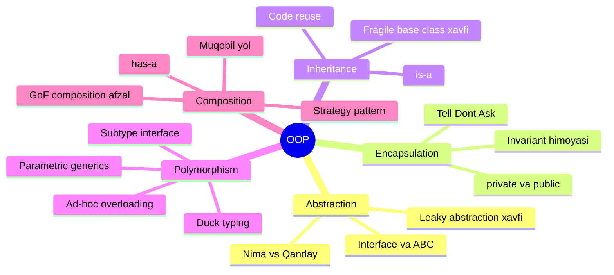
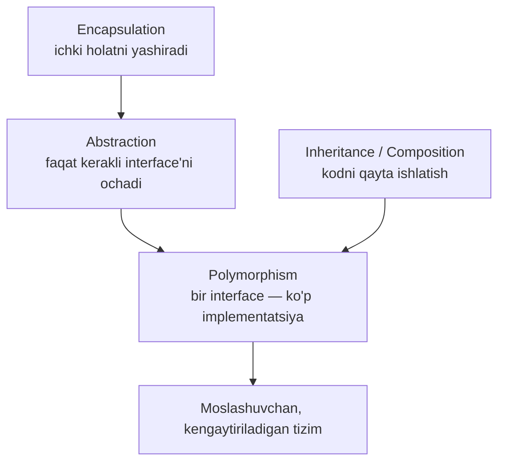

# OOP — Object-Oriented Programming

**OOP (Object-Oriented Programming)** — dasturlash metodologiyasi: dastur bir-biri bilan muloqot qiluvchi **obyektlar** to'plami sifatida quriladi. Har obyekt o'zida **ma'lumot (state)** va shu ma'lumot ustida ishlovchi **xatti-harakatlarni (behavior)** birlashtiradi.

---

## Nega OOP paydo bo'ldi?

1960-70-yillarda dasturlar protsedural yozilardi: ma'lumot bir joyda, uni o'zgartiruvchi funksiyalar boshqa joyda. Dastur kattalashgani sari:

- ma'lumotni **kim, qayerdan o'zgartirayotganini** kuzatib bo'lmay qoldi;
- bitta strukturaga o'zgarish **yuzlab funksiyani** sindirardi;
- kodni qayta ishlatish uchun **copy-paste**dan boshqa yo'l yo'q edi.

OOP yechimi: ma'lumot va unga tegishli logikani **bitta kapsulaga** (obyektga) yig'ish, tashqariga faqat kerakli interface'ni ochish.

### Protsedural vs OOP — bitta jadvalda

| Savol | Protsedural | OOP |
|-------|-------------|-----|
| Ma'lumot qayerda? | Global strukturalarda, ochiq | Obyekt ichida, yashirin |
| Logika qayerda? | Alohida funksiyalarda | Ma'lumot bilan bir joyda (metod) |
| "Kim balansni buzdi?" | Yuzlab funksiya — topib bo'lmaydi | Faqat obyekt metodlari — bitta fayl |
| Kod qayta ishlatish | Copy-paste | Inheritance / composition |
| Yangi tur qo'shish | Har `switch`ga yana bir `case` | Yangi class / yangi tip — eski kod tegilmaydi |

### Qisqa tarix

| Yil | Voqea |
|-----|-------|
| 1967 | **Simula 67** — birinchi OOP tili (class, object, inheritance tushunchalari) |
| 1970-lar | **Smalltalk** (Alan Kay) — "object-oriented" termini shu yerdan; hamma narsa obyekt |
| 1985+ | **C++**, keyin **Java** (1995) OOP'ni sanoat standartiga aylantirdi |
| 1994 | GoF "Design Patterns" kitobi — OOP dizayn tajribasini tizimlashtirdi |
| 2009 | **Go** — OOP'ning "class hierarchy" qismini rad etib, composition + interface yo'lini tanladi |

> Diqqat: Alan Kay uchun OOP'ning yuragi inheritance emas edi. Uning ta'kidi — **message passing** (obyektlar bir-biriga xabar yuborishi) va **encapsulation**. Bu bugungi "composition over inheritance" tendensiyasini oldindan bashorat qilgan.

---

## 4 ustun (A PIE)

| # | Tamoyil | Bir jumlada | Fayl |
|---|---------|-------------|------|
| 1 | **Abstraction** | Muhimini ko'rsat, detallarni yashir — "nima" va "qanday"ni ajrat | [1. Abstraction.md](1.%20Abstraction.md) |
| 2 | **Encapsulation** | Ma'lumotni himoya qil — faqat belgilangan metodlar orqali kirish | [2. Encapsulation.md](2.%20Encapsulation.md) |
| 3 | **Inheritance** | Mavjud class asosida yangisini qur (is-a) | [3. Inheritance.md](3.%20Inheritance.md) |
| 4 | **Polymorphism** | Bir interface — ko'p xatti-harakat | [4. Polymorphism.md](4.%20Polymorphism.md) |

> Eslab qolish uchun: **A PIE** — **A**bstraction, **P**olymorphism, **I**nheritance, **E**ncapsulation.

### Composition — 5-ustun emas, muqobil yo'l

[5. Composition.md](5.%20Composition.md) klassik "4 ustun" ro'yxatiga kirmaydi — u alohida **dizayn strategiyasi**. Inheritance (is-a) bilan bir xil muammoni — kodni qayta ishlatishni — hal qiladi, lekin boshqacha, xavfsizroq yo'l bilan (has-a). Shuning uchun uni "beshinchi tamoyil" deb emas, **inheritance'ga zamonaviy muqobil** deb o'qing. GoF va Go tili ikkalasi ham aynan shu yo'lni afzal ko'radi.



---

## Ustunlar bir-biriga qanday bog'lanadi?

Bu 4 ustun alohida emas — ular bitta g'oyaning turli qirralari:



- **Encapsulation** ichki detallarni yashiradi → shuning uchun **abstraction** toza interface ko'rsata oladi.
- **Abstraction** interface belgilaydi → shuning uchun **polymorphism** o'sha interface ortida turli implementatsiyalarni almashtira oladi.
- **Inheritance** yoki **composition** kodni ulashadi → natijada tizim takrorlanishsiz o'sadi.

---

## Asosiy tushunchalar: Class va Object

- **Class** — shablon (chizma): qanday maydonlar va metodlar bo'lishini belgilaydi;
- **Object (instance)** — shu shablondan yaratilgan konkret nusxa, o'z qiymatlari bilan.

Analogiya: **class** — bu qolip (masalan, quymapishiriq qolipi), **object** — o'sha qolipdan chiqqan har bir tort. Qolip bitta, tortlar ko'p va har biri o'z bezagi bilan.

### Python

Python — to'liq OOP tili. `class` kalit so'zi bilan class'lar yaratiladi.

```python
# Class — obyektlar uchun shablon
class Inson:
    # __init__ — konstruktor (obyekt yaratilganda chaqiriladi)
    def __init__(self, ism: str, yosh: int):
        self.ism = ism    # atribut (maydon)
        self.yosh = yosh

    # metod — obyekt xatti-harakati
    def salom_ber(self) -> str:
        return f"Salom! Men {self.ism}, {self.yosh} yoshdaman."

    # __str__ — obyektni matn sifatida ko'rsatish
    def __str__(self) -> str:
        return f"Inson({self.ism}, {self.yosh})"


# Obyekt yaratish (instance)
ali  = Inson("Ali", 25)
vali = Inson("Vali", 30)

print(ali.salom_ber())         # Salom! Men Ali, 25 yoshdaman.
print(vali)                    # Inson(Vali, 30)

print(type(ali))               # <class '__main__.Inson'>
print(isinstance(ali, Inson))  # True
```

```python
# Class atributlari vs Obyekt atributlari
class Kompaniya:
    nomi = "Acme Corp"       # Class atributi — barcha obyektlarda bir xil

    def __init__(self, xodim: str):
        self.xodim = xodim   # Obyekt atributi — har obyektda o'z qiymati


k1 = Kompaniya("Ali")
k2 = Kompaniya("Vali")

print(k1.nomi)         # Acme Corp
print(k2.nomi)         # Acme Corp
print(Kompaniya.nomi)  # Acme Corp — class'dan ham o'qiladi
```

### Go

Go klassik OOP tili emas, lekin OOP tamoyillarini `struct` va `interface` orqali amalga oshiradi.

```go
package main

import "fmt"

// Struct — Python'dagi class o'rnida
type Inson struct {
	Ism  string // Katta harf = public (exported)
	Yosh int
}

// Metod — struct'ga biriktiriladi
// (i Inson) — receiver (Python'dagi self o'rnida)
func (i Inson) SalomBer() string {
	return fmt.Sprintf("Salom! Men %s, %d yoshdaman.", i.Ism, i.Yosh)
}

func (i Inson) String() string {
	return fmt.Sprintf("Inson(%s, %d)", i.Ism, i.Yosh)
}

// "Konstruktor" — konventsiya bo'yicha NewXxx funksiyasi
func YangiInson(ism string, yosh int) Inson {
	return Inson{Ism: ism, Yosh: yosh}
}

func main() {
	ali := YangiInson("Ali", 25)
	vali := Inson{Ism: "Vali", Yosh: 30} // to'g'ridan-to'g'ri ham mumkin

	fmt.Println(ali.SalomBer()) // Salom! Men Ali, 25 yoshdaman.
	fmt.Println(vali.String())  // Inson(Vali, 30)

	// Pointer receiver — obyektni o'zgartirish uchun
	ali2 := &Inson{Ism: "Ali2", Yosh: 20}
	ali2.Yosh = 21
	fmt.Println(ali2.Yosh) // 21
}
```

**Python vs Go — asosiy farq:**

| | Python | Go |
|-|--------|----|
| Class | `class Inson:` | `type Inson struct {}` |
| Konstruktor | `def __init__(self)` | `func YangiInson() Inson` (konventsiya) |
| Metod | `def salom(self)` | `func (i Inson) Salom()` |
| Obyekt yaratish | `Inson("Ali", 25)` | `Inson{Ism: "Ali", Yosh: 25}` |
| Inheritance | `class It(Hayvon):` | yo'q — embedding + interface |
| Private | `self.__ism` (konventsiya) | `ism` kichik harf (compiler kafolati, package chegarasida) |

---

## Go OOP tilimi?

Rasmiy [Go FAQ](https://go.dev/doc/faq#Is_Go_an_object-oriented_language) javobi: **"Ha va yo'q"**.

**Ha, chunki:**
- tiplar va metodlar bor, OOP uslubida yozish mumkin;
- metodlarni **istalgan tipga** biriktirsa bo'ladi (hatto `int` asosidagi tipga ham) — bu C++/Java'dan ham umumiyroq.

**Yo'q, chunki:**
- **type hierarchy yo'q** — class'lar daraxti, `extends`, virtual metodlar yo'q;
- inheritance o'rniga **composition (embedding)** va **implicit interface**'lar.

Go mualliflarining pozitsiyasi: an'anaviy OOP'da tiplar orasidagi munosabatlarni **oldindan e'lon qilishga** juda ko'p kuch ketadi. Go'da esa tip interface'dagi metodlarga ega bo'lsa — **avtomatik** shu interface'ni qondiradi: hech qanday `implements` kerak emas, munosabat kod rivojlangani sari o'z-o'zidan paydo bo'ladi. Aynan shu — Go'ning "yengil" his qilinishining asosiy sababi.

Shuning uchun bu papkada har tamoyilni **ikki tilda** ko'ramiz: Python (klassik OOP) va Go (composition-yo'nalishli OOP) — farqni ko'rish o'rganishning eng yaxshi usuli.

---

## O'qish tartibi

1. [Abstraction](1.%20Abstraction.md) — "nima"ni "qanday"dan ajratish
2. [Encapsulation](2.%20Encapsulation.md) — ma'lumot va invariantlarni himoyalash
3. [Inheritance](3.%20Inheritance.md) — kod merosxo'rligi va uning xavflari
4. [Polymorphism](4.%20Polymorphism.md) — bir interface, ko'p shakl
5. [Composition](5.%20Composition.md) — "composition over inheritance"

## Keyingi qadam

OOP poydevor bo'ldi → endi shu poydevor ustidagi dizayn qoidalari: [S.O.L.I.D](../1.%20S.O.L.I.D/0.%20README.md)
