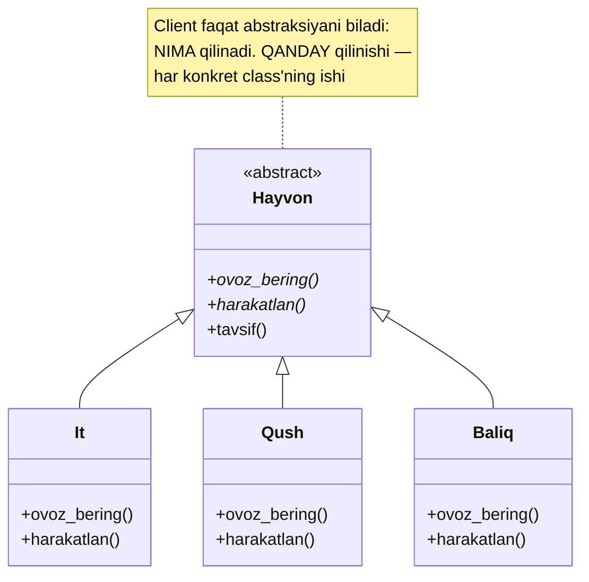
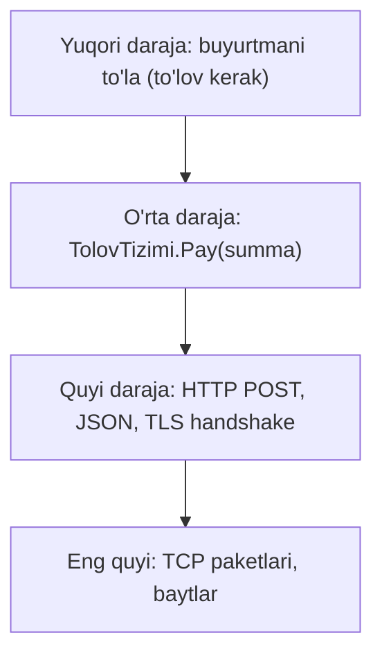

# Abstraction (Abstraksiya)

**Abstraction** — obyektning **muhim** xususiyatlarini ajratib ko'rsatish, ikkinchi darajali detallarni yashirish. "**Nima** qilinadi"ni "**qanday** qilinadi"dan ajratish san'ati.

---

## Umumiy tushuncha

### Muammo nima edi?

Tasavvur qiling: ilovangiz uch xil to'lov provayderi bilan ishlashi kerak — har birining o'z API'si, o'z xatolik kodlari, o'z autentifikatsiyasi bor. Agar buyurtma kodi har provayderning **ichki detallari** bilan to'g'ridan-to'g'ri ishlasa:

| Muammo | Oqibat |
|--------|--------|
| Buyurtma kodi provayder detallariga botib ketadi | Asosiy biznes-logika ko'rinmay qoladi |
| Provayder o'z API'sini o'zgartirsa | Ilovaning yarmi qayta yoziladi |
| Yangi provayder qo'shish | Hamma joyga yana bir `if` tarmog'i |
| Kod o'quvchisi | "Bu yerda aslida nima qilinyapti?" deb adashadi |

### Yechim nima?

Umumiy **abstraksiya** yaratamiz — "to'lov qilish" tushunchasining faqat muhim qismini ifodalovchi shartnoma: `pay(amount)`. Har provayder bu shartnomani **o'zicha** bajaradi, lekin client kod faqat shartnomani biladi.

- Python'da — `ABC` (Abstract Base Class);
- Go'da — `interface`.



### Hayotiy analogiya

**Avtomobil haydash**: siz rul, pedal va uzatmalar dastagini bilasiz — bu avtomobilning **abstraksiyasi (interface)**. Dvigatel ichida yonilg'i qanday yonishi, kuch qanday uzatilishi — **implementatsiya**. Benzinlidan elektromobilga o'tsangiz ham haydashni qayta o'rganmaysiz: interface o'zgarmadi, implementatsiya butunlay almashdi.

Analogiya chegarasi: rul "bitta narsa" — lekin dasturda abstraksiya bir nechta metoddan iborat shartnoma. Rul misolida qulay bo'lgan narsa (bitta interface — ko'p motor) kodda ham qulay: bitta `TolovTizimi` — ko'p provayder.

### Asosiy qoida

> **Client "nima qilinadi"ni bilsin, "qanday qilinadi"ni emas. Interface o'zgarmasa, implementatsiyani istalgancha almashtirish mumkin.**

### Abstraction vs Encapsulation — farqi nimada?

Bu ikkalasi eng ko'p adashtiriladigan juftlik. Ikkalasi ham "yashirish", lekin:

| | Abstraction | Encapsulation |
|-|-------------|---------------|
| Nimani yashiradi? | **Murakkablikni** (implementatsiya detallari) | **Ma'lumotni** (ichki state) |
| Daraja | Dizayn darajasi — "qaysi metodlarni ko'rsatamiz?" | Kod darajasi — "maydonga kim tega oladi?" |
| Vosita | interface, abstract class | private/public, getter/setter |
| Savoli | "Foydalanuvchiga nima kerak?" | "Ichki holatni kim buzishi mumkin?" |
| Misol | `pay(amount)` — orqasida nima borligi noma'lum | `balans` maydoni private, faqat `deposit()` orqali o'zgaradi |

Qisqasi: **abstraction — tashqi ko'rinishni loyihalash, encapsulation — ichki holatni qo'riqlash.** Abstraction encapsulation'siz bo'lmaydi, lekin ular bir narsa emas.

---

## Abstraksiya darajalari

Abstraksiya "bor yoki yo'q" degan narsa emas — u **darajalar** bilan ishlaydi. Yuqori daraja "nima"ga yaqin, quyi daraja "qanday"ga yaqin:



Yaxshi dizaynda har qatlam faqat **bir pastdagi** qatlamni biladi, eng pastini emas. Buyurtma logikasi HTTP haqida o'ylamasligi kerak — u faqat `Pay(summa)` deydi. Bu "**separation of concerns**" (vazifalarni ajratish) tamoyili.

---

## Python

Python'da abstraksiya `ABC` (Abstract Base Class) moduli yordamida amalga oshiriladi.

```python
from abc import ABC, abstractmethod

# Abstract class — faqat interface belgilaydi, amalga oshirmaydi
class Hayvon(ABC):

    @abstractmethod
    def ovoz_bering(self) -> str:
        pass  # "Nima qilish kerak" — lekin "Qanday" emas

    @abstractmethod
    def harakatlan(self) -> str:
        pass

    # Konkret metod — barcha avlodlar uchun bir xil
    def tavsif(self) -> str:
        return f"{self.__class__.__name__}: {self.ovoz_bering()}"


# Konkret class'lar — "Qanday"ni amalga oshiradi
class It(Hayvon):
    def ovoz_bering(self) -> str:
        return "Vov vov!"

    def harakatlan(self) -> str:
        return "Yuguradi"


class Qush(Hayvon):
    def ovoz_bering(self) -> str:
        return "Chiv chiv!"

    def harakatlan(self) -> str:
        return "Uchadi"


class Baliq(Hayvon):
    def ovoz_bering(self) -> str:
        return "..."

    def harakatlan(self) -> str:
        return "Suzadi"


# Foydalanish — implementatsiya farq qilmaydi
hayvonlar = [It(), Qush(), Baliq()]
for h in hayvonlar:
    print(h.tavsif())

# hayvon = Hayvon()  # TypeError — abstract class'dan instance olib bo'lmaydi
```

**Natija:**
```
It: Vov vov!
Qush: Chiv chiv!
Baliq: ...
```

Abstract class'dan instance olib bo'lmaydi. Undan concrete subclass yaratiladi, barcha abstract metodlar implement qilinadi, va o'sha subclass'dan instance olinadi.

---

## Go

Go'da abstraksiya `interface` orqali amalga oshiriladi. Go'ning interface'i **implicit** — tip "men bu interface'ni amalga oshiraman" demaydi, metodlar mos kelsa kifoya.

```go
package main

import "fmt"

// Interface — abstraksiya (nima qilish kerak)
type Hayvon interface {
	OvozBering() string
	Harakatlan() string
}

// Konkret struct — qanday qilish
type It struct {
	Ism string
}

func (i It) OvozBering() string {
	return "Vov vov!"
}

func (i It) Harakatlan() string {
	return "Yuguradi"
}

type Qush struct {
	Ism string
}

func (q Qush) OvozBering() string {
	return "Chiv chiv!"
}

func (q Qush) Harakatlan() string {
	return "Uchadi"
}

type Baliq struct{}

func (b Baliq) OvozBering() string { return "..." }
func (b Baliq) Harakatlan() string { return "Suzadi" }

// Umumiy funksiya — har qanday Hayvon bilan ishlaydi
func Tavsif(h Hayvon) string {
	return fmt.Sprintf("%T: %s, %s", h, h.OvozBering(), h.Harakatlan())
}

func main() {
	hayvonlar := []Hayvon{
		It{Ism: "Tuzik"},
		Qush{Ism: "Chippi"},
		Baliq{},
	}

	for _, h := range hayvonlar {
		fmt.Println(Tavsif(h))
	}
}
```

**Natija:**
```
main.It: Vov vov!, Yuguradi
main.Qush: Chiv chiv!, Uchadi
main.Baliq: ..., Suzadi
```

### Explicit vs Implicit

```python
# Python'da EXPLICIT: class Dog(Animal) deb yozib,
# @abstractmethod'larni override qilish kerak
class Animal(ABC):
    @abstractmethod
    def sound(self) -> str: ...

class Dog(Animal):          # explicit: "Animal" deb yoziladi
    def sound(self) -> str:
        return "Woof"
```

```go
// Go'da IMPLICIT: tip barcha metodlarni implement qilsa —
// avtomatik interface'ni qondiradi
type Klikk struct{}
func (k Klikk) TolovAmalga(summa float64) bool { /* ... */ return true }
func (k Klikk) Qaytarish(summa float64) bool   { /* ... */ return true }
// Klikk hech qachon "TolovTizimi" demagan!
// Lekin metodlar mos keladi -> avtomatik TolovTizimi hisoblanadi
```

Implicit'ning kuchi: interface'ni **keyin** ham yaratish mumkin — mavjud tiplar unga o'z-o'zidan mos kelib qoladi. Standart library'dagi `io.Reader`, `fmt.Stringer` shu tufayli minglab tashqi tiplar bilan ishlaydi.

### Go idiomasi: interface'ni iste'molchi tomonda e'lon qil

Go'da muhim qoida: interface'ni **ishlatuvchi** package e'lon qiladi, ishlab chiquvchi emas. Ya'ni `TolovTizimi` interface'ini buyurtma package'i belgilaydi, provayder package'i emas. Sabab — implicit interface: provayder o'zi bilmagan interface'ni ham qondirib qo'yaveradi. Bu "**kichik interface**" madaniyatini keltirib chiqaradi: ko'pincha 1-2 metodli interface eng kuchli abstraksiya.

---

## Python vs Go

| | Python | Go |
|-|--------|----|
| Abstraksiya vositasi | `ABC + @abstractmethod` | `interface` |
| Bog'lanish | Explicit (`class Dog(Animal)`) | Implicit (metodlar mos kelsa yetarli) |
| Instance ololmaydi | Abstract class'dan | Interface o'zidan (u shunchaki shartnoma) |
| Interface qayerda e'lon qilinadi | Odatda ishlab chiquvchi tomonda | Idiomatik: iste'molchi tomonda |
| Konkret metod berish | `ABC` ichida oddiy metod yozib | Interface metod bera olmaydi (faqat imzolar) |
| Tekshiruv | `isinstance`, `issubclass` | Compile-time, `x.(T)` type assertion |

---

## Eng ko'p uchraydigan xato / tuzoq

### 1. Leaky abstraction (oqib chiquvchi abstraksiya)

Abstraksiya ichki detalni "oqizib" yuborsa — u yaxshi abstraksiya emas. Masalan:

```python
# YOMON: metod nomi HTTP detalini oshkor qiladi
class Ombor:
    def http_get_json(self, url: str) -> dict: ...

# YAXSHI: iste'molchi "nima"ni ko'radi, "qanday"ni emas
class Ombor:
    def foydalanuvchi(self, uid: int) -> "User": ...
```

Birinchi variant HTTP'ga bog'lab qo'ydi — ertaga ma'lumot bazadan yoki cache'dan kelsa, `http_get_json` nomi yolg'onga aylanadi. Abstraksiya nomi **domen** tilida bo'lsin, transport tilida emas.

### 2. Premature / speculative abstraction (erta abstraksiya)

"Kelajakda kerak bo'lar" deb bitta implementatsiya uchun interface yasash — YAGNI (You Aren't Gonna Need It) buzilishi:

| Belgisi | Nega yomon |
|---------|-----------|
| Interface bor, lekin faqat 1 ta implementatsiya | Qo'shimcha qatlam, foyda yo'q |
| "Bir kun 2-provayder kelar" | Kelmasa — behuda murakkablik |
| Har class'ga refleks bilan interface | O'qishni qiyinlashtiradi |

Qoida: **abstraksiyani ikkinchi implementatsiya paydo bo'lganda ajrat** (Rule of Three). Bitta implementatsiya uchun interface — ko'pincha shovqin.

### 3. Noto'g'ri metod tanlash (interface juda katta)

Interface'ga hamma narsani tiqish — keyingi bosqichda ISP buzilishiga olib keladi. Masalan `Hayvon` interface'iga `TuxumQoy()` qo'shsangiz, `It` uni bajara olmaydi. Bu — [Interface Segregation](../1.%20S.O.L.I.D/4.%20I.md) mavzusi.

---

## Xulosa

### Eslab qol

- Abstraction = **"nima"ni "qanday"dan ajratish**; client faqat "nima"ni biladi.
- Vosita: Python'da `ABC + @abstractmethod`, Go'da `interface` (implicit!).
- Yaxshi abstraksiya belgisi: **implementatsiyani almashtirsangiz, client kodi o'zgarmaydi** (benzinli -> elektromobil).
- Abstraction ≠ Encapsulation: biri **murakkablikni** (dizayn), ikkinchisi **ma'lumotni** (kod) yashiradi.
- Deyarli barcha design pattern'lar (Strategy, Factory, Adapter...) abstraction ustiga qurilgan.

### Amaliyot

1. `Hayvon` misoliga `Ilon` qo'shing — client kodi (`Tavsif` / `tavsif`) o'zgarmasligiga ishonch hosil qiling. Nega client tegilmadi?
2. `TolovTizimi` interface'ini to'liq yozing: `Klikk`, `Payme` implementatsiyalari bilan. Client faqat interface bilan ishlasin. Uchinchi provayderni qo'shganda nechta joy o'zgaradi?
3. O'z loyihangizdan "detallarga botgan" funksiya toping. Uning nomi domen tilidami yoki transport tilidami? Leaky bo'lsa qanday qayta nomlaysiz?
4. Nega bitta implementatsiya uchun interface yasash ko'pincha xato? "Rule of Three" bu yerda nima deydi?

---

## Keyingi qadam

→ [2. Encapsulation.md](2.%20Encapsulation.md)
