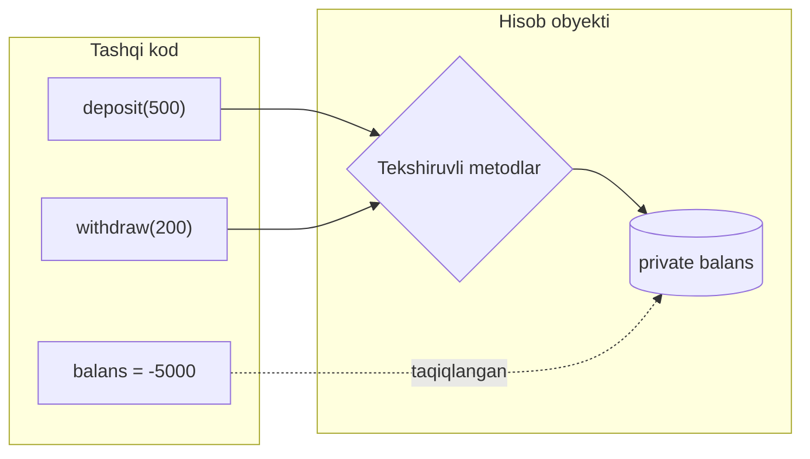

# Encapsulation (Inkapsulyatsiya)

**Encapsulation** — ma'lumot (state) va unga ishlov beruvchi metodlarni bitta birlikka jamlash, ichki holatni yashirish va unga faqat **belgilangan metodlar orqali** kirishga ruxsat berish.

---

## Umumiy tushuncha

### Muammo nima edi?

Bank hisobi struct'ini yozdingiz, `balans` maydoni ochiq (public). Endi kodning **istalgan joyi** unga to'g'ridan-to'g'ri yoza oladi:

```python
hisob.balans = -5000               # manfiy balans?!
hisob.balans = hisob.balans * 100  # kimdir "xatolik bilan" boyib ketdi
```

| Muammo | Oqibat |
|--------|--------|
| Har kim maydonga to'g'ridan-to'g'ri yozadi | **Invariant** buziladi (balans manfiy bo'lmasligi kerak edi) |
| Bug qidirish | Balansni o'zgartiruvchi **yuzlab joy** — qaysi biri aybdor? |
| Validatsiya qo'shish kerak bo'lsa | Hamma yozuv joylarini topib, har biriga tekshiruv qo'shish |
| Ichki strukturani o'zgartirish (float -> tiyin-int) | Butun codebase sinadi |

**Invariant** — obyekt umri davomida **doim to'g'ri bo'lishi shart** bo'lgan qoida (balans ≥ 0, email formati to'g'ri, buyurtmada kamida 1 mahsulot...). Encapsulation'ning asosiy vazifasi — aynan invariantlarni qo'riqlash.

### Yechim nima?

Maydonni **private** qilamiz, o'zgartirishni faqat **tekshiruvli metodlar** orqali o'tkazamiz. Endi invariant **bitta joyda** himoyalanadi — validatsiya metodning ichida, va uni chetlab o'tib bo'lmaydi.



### Hayotiy analogiya

**Bankomat**: bankning pul zaxirasiga to'g'ridan-to'g'ri qo'l tiqa olmaysiz. Faqat bankomat menyusi (public metodlar) orqali ishlaysiz, u esa har amalni tekshiradi: PIN to'g'rimi, balans yetarlimi, limit oshmadimi. Pul qanday saqlanishi (ichki struktura) sizga ko'rinmaydi — va bank uni istalgan payt o'zgartira oladi, siz sezmaysiz.

### Asosiy qoida

> **Ichki holat — private; o'zgartirish — faqat invariantni tekshiruvchi metodlar orqali. Shunda "balans qanday buzildi?" degan savolning javobi doim bitta faylda bo'ladi.**

### Kirish darajalari

| Daraja | Python | Go | Ma'nosi |
|--------|--------|----|---------|
| `public` | `self.ism` | `Ism string` (katta harf) | Hamma ko'ra oladi |
| `protected` | `self._ism` | (yo'q) | Konventsiya — "ichki, lekin avlodlar tegishi mumkin" |
| `private` | `self.__ism` | `ism string` (kichik harf) | Python: name mangling; Go: **package** tashqarisidan compile error |

⚠️ Muhim farq: Go'da chegara **class emas, package**. Bir package ichidagi barcha kod `ism`ga tega oladi — shuning uchun package'ni kichik va fokusli tutish ham encapsulation'ning bir qismi.

---

## Python

```python
class Hisob:
    def __init__(self, egasi: str, balans: float):
        self.egasi    = egasi    # public  — hamma ko'ra oladi
        self._kod     = "UZB01"  # protected — konventsiya, haqiqiy cheklov yo'q
        self.__balans = balans   # private — yashirin (name mangling)

    @property
    def balans(self) -> float:  # getter
        return self.__balans

    @balans.setter
    def balans(self, summa: float) -> None:  # setter — tekshiruv bilan
        if summa < 0:
            raise ValueError("Balans manfiy bo'lishi mumkin emas")
        self.__balans = summa

    def deposit(self, summa: float) -> None:
        if summa <= 0:
            raise ValueError("Summa musbat bo'lishi kerak")
        self.__balans += summa

    def withdraw(self, summa: float) -> None:
        if summa > self.__balans:
            raise ValueError("Mablag' yetarli emas")  # invariant himoyasi
        self.__balans -= summa


h = Hisob("Ali", 1000)
print(h.egasi)      # public
print(h.balans)     # getter orqali — 1000
h.balans = 2000     # setter orqali (tekshiruvdan o'tadi)
h.deposit(500)      # 2500
# h.balans = -1     # ValueError — invariant himoyalandi
# print(h.__balans) # AttributeError
```

⚠️ Halollik uchun: Python'da `__balans` **mutlaq himoya emas** — `h._Hisob__balans` orqali baribir kirsa bo'ladi (name mangling shunchaki nomni o'zgartiradi). Python falsafasi: til taqiqlamaydi, konventsiya ogohlantiradi.

---

## Go

Go'da encapsulation **katta/kichik harf** orqali va **package chegarasida** ishlaydi:
- `Ism` -> **exported** (public) — package tashqarisidan ko'rinadi;
- `ism` -> **unexported** (private) — faqat shu package ichida; buzishga urinish **compile error**.

```go
package bank

import "fmt"

type Hisob struct {
	Egasi  string  // exported  — public
	balans float64 // unexported — faqat bank package'i ichida
}

// Konstruktor boshlang'ich invariantni kafolatlaydi
func YangiHisob(egasi string, balans float64) (*Hisob, error) {
	if balans < 0 {
		return nil, fmt.Errorf("balans manfiy bo'lishi mumkin emas")
	}
	return &Hisob{Egasi: egasi, balans: balans}, nil
}

// Getter — Go konventsiyasi: "GetBalans" EMAS, shunchaki "Balans"
func (h *Hisob) Balans() float64 {
	return h.balans
}

func (h *Hisob) Deposit(summa float64) error {
	if summa <= 0 {
		return fmt.Errorf("summa musbat bo'lishi kerak")
	}
	h.balans += summa
	return nil
}

func (h *Hisob) Withdraw(summa float64) error {
	if summa > h.balans {
		return fmt.Errorf("mablag' yetarli emas") // invariant himoyasi
	}
	h.balans -= summa
	return nil
}
```

```go
package main

import (
	"fmt"
	"myapp/bank"
)

func main() {
	h, _ := bank.YangiHisob("Ali", 1000)

	fmt.Println(h.Egasi)    // exported
	fmt.Println(h.Balans()) // getter orqali — 1000
	h.Deposit(500)          // tekshiruv bilan

	// h.balans = -9999     // COMPILE ERROR: balans unexported
}
```

E'tibor bering: Python'da himoya **konventsiya**, Go'da esa **compiler kafolati** — package tashqarisidan unexported maydonga kirish umuman kompilyatsiya bo'lmaydi.

---

## Python vs Go

| | Python | Go |
|-|--------|----|
| Private belgisi | `self.__ism` | `ism` (kichik harf) |
| Himoya kuchi | Konventsiya (chetlab o'tsa bo'ladi) | Compile error (qat'iy) |
| Chegara | Class | **Package** |
| Getter | `@property` | `func (h *Hisob) Balans()` — `Get` prefiksi yozilmaydi |
| Setter | `@balans.setter` | Domen metodi afzal (`Deposit`, `Withdraw`) |
| Eng yaxshi amaliyot | property + validatsiya | Konstruktor (`NewXxx`) + domen metodlari |

---

## Chuqurroq: "Tell, Don't Ask"

Encapsulation faqat maydonni yashirish emas — u **xatti-harakatni** ma'lumot yoniga qo'yish. "Tell, Don't Ask" (so'ra emas, buyur) prinsipi: obyektdan ichki holatini so'rab, keyin uning ustida qaror qilma — obyektga **nima qilishni ayt**, u o'zi hal qilsin.

```python
# YOMON: ASK — tashqarida qaror qabul qilinadi (logika sizib chiqdi)
if hisob.balans >= summa:
    hisob.balans -= summa
else:
    raise ValueError("yetarli emas")

# YAXSHI: TELL — obyektga buyuramiz, qaror ichida
hisob.withdraw(summa)   # tekshiruv ham, kamaytirish ham ichida
```

Birinchi variantda "yetarlimi?" tekshiruvi **tashqarida** — demak, u kodning boshqa 10 joyida ham takrorlanadi, va bittasida unutiladi. Ikkinchida qoida bitta joyda qamalgan.

### Law of Demeter (eng yaqin do'st qoidasi)

Obyekt faqat **eng yaqin qo'shnisi** bilan gaplashsin, "qo'shnisining qo'shnisi" bilan emas. Uzun zanjir — sizib chiqqan strukturaning belgisi:

```python
# YOMON: ichki tuzilishga chuqur kirib boradi (train wreck)
buyurtma.mijoz.manzil.shahar.upper()

# YAXSHI: obyekt kerakli javobni o'zi beradi
buyurtma.yetkazish_shahri()
```

Uzun `a.b.c.d` zanjiri kodni `mijoz`, `manzil`, `shahar` ichki tuzilishiga bog'lab qo'yadi — ulardan biri o'zgarsa, zanjir sinadi.

---

## Eng ko'p uchraydigan xato / tuzoq

### 1. Anemic domain model (qonsiz domen modeli)

Har maydonga refleks bilan getter+setter yozib, hech qanday xatti-harakat qo'ymaslik. Bu — **soxta encapsulation**:

```python
# YOMON: bu class shunchaki ma'lumot qutisi, invariant himoyasi yo'q
class Hisob:
    def get_balans(self): return self._balans
    def set_balans(self, v): self._balans = v   # tekshiruvsiz setter!
```

Tekshiruvsiz setter — public maydondan farqi yo'q, faqat 2 qator ko'proq kod. Agar setter validatsiya qilmasa, uni yozishning ma'nosi yo'q. Yaxshisi — **domen metodlari** (`deposit`, `withdraw`), ular invariantni himoya qiladi.

### 2. Ichki mutable referensni oshkor qilish

Getter private ro'yxatning **o'zini** qaytarsa — tashqi kod uni chetlab o'tib o'zgartiradi:

```python
class Savat:
    def __init__(self):
        self.__mahsulotlar = []

    @property
    def mahsulotlar(self):
        return self.__mahsulotlar        # YOMON: ichki ro'yxatning o'zi

s = Savat()
s.mahsulotlar.append("virus")            # encapsulation buzildi!
```

**Natija:** private ro'yxatga tashqaridan element qo'shildi — barcha metodlaringiz tekshiruvi chetlab o'tildi. To'g'risi: **nusxa qaytaring** (`return list(self.__mahsulotlar)`) yoki faqat `add_mahsulot()` metodi bering.

### 3. Go'da package'ni juda katta qilish

Go'da chegara — package. Agar butun ilovani bitta `package main`ga tiqsangiz, `balans` unexported bo'lsa ham — o'sha package ichidagi har kod unga tega oladi. Encapsulation package chegarasida ishlaydi, shuning uchun **kichik, fokusli package'lar** ham himoyaning bir qismi.

---

## Xulosa

### Eslab qol

- Encapsulation'ning asl maqsadi — getter/setter yozish emas, **invariantlarni himoyalash**: noto'g'ri holatga o'tishning iloji bo'lmasin.
- Yozuvni **bitta joyga** to'plang: bug qidirganda faqat shu joyga qaraysiz.
- Go'da chegara — **package**; Python'da — konventsiya (`_`, `__`).
- "Tell, Don't Ask": obyektdan holatini so'rab tashqarida qaror qilma — unga buyur, qaror ichida bo'lsin.
- Getter mutable ichki strukturani qaytarsa — encapsulation yolg'on; nusxa qaytar yoki metod ber.

### Amaliyot

1. `Hisob`ga kunlik yechish limiti qo'shing (yangi invariant: kuniga 10 000 dan ko'p yechilmasin) — nechta joy o'zgardi? To'g'ri javob nima bo'lishi kerak?
2. Python'da `h._Hisob__balans = -1` qilib ko'ring — himoyaning konventsiya ekanini o'z ko'zingiz bilan ko'ring. Go'da xuddi shuni qilib bo'ladimi?
3. Yuqoridagi `Savat` misolidagi tuzoqni tuzating: getter'ni shunday o'zgartiringki, tashqi kod ichki ro'yxatni buza olmasin.
4. O'z loyihangizdan `a.b.c.d` ko'rinishidagi zanjir toping (Law of Demeter buzilishi) — uni obyektga bitta metod qo'shib qanday soddalashtirasiz?

---

## Keyingi qadam

→ [3. Inheritance.md](3.%20Inheritance.md)
