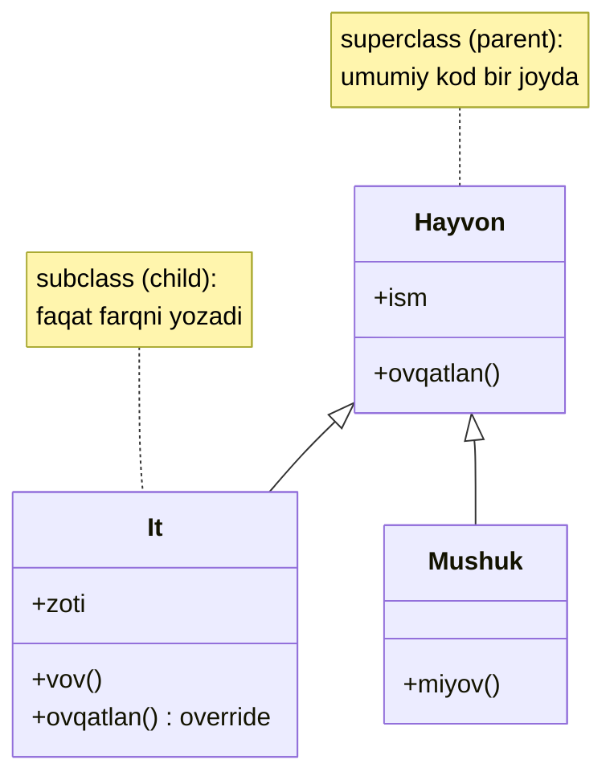

# Inheritance (Meros)

**Inheritance** — mavjud class asosida yangi class yaratish: ota-class'dagi maydonlar va metodlar avlodda ham mavjud bo'ladi (code reuse). Munosabat turi: **is-a** ("It — bu Hayvon").

---

## Umumiy tushuncha

### Muammo nima edi?

`It`, `Mushuk`, `Ot` class'larini yozyapsiz. Har birida bir xil kod takrorlanadi: `ism` maydoni, `ovqatlan()`, `uxla()` metodlari... Umumiy qismga o'zgarish kiritish uchun **hamma class'ni** ochib chiqish kerak.

### Yechim nima?

Umumiy qismni **ota-class'ga** (`Hayvon`) ko'taramiz; har avlod faqat **o'ziga xos** qismini yozadi va kerak bo'lsa ota metodlarini **override** qiladi.



| Termin | Sinonimlar |
|--------|-----------|
| Ota-class | superclass, base class, parent class |
| Avlod-class | subclass, derived class, child class |

### Asosiy qoida

> **Inheritance faqat haqiqiy is-a munosabati va mos xatti-harakat bo'lganda ishlatilsin. "Kod o'xshash ekan, meros qilaman" — eng ko'p pushaymon qilinadigan qaror.**

---

## Python

```python
class Hayvon:
    def __init__(self, ism: str):
        self.ism = ism

    def ovqatlan(self) -> str:
        return f"{self.ism} ovqatlanmoqda"


class It(Hayvon):
    def __init__(self, ism: str, zoti: str):
        super().__init__(ism)   # ota-class konstruktorini chaqirish
        self.zoti = zoti

    def vov(self) -> str:
        return f"{self.ism}: VOV!"

    def ovqatlan(self) -> str:  # override
        return f"{self.ism} suyak g'ajiyapti"


it = It("Tuzik", "Layka")
print(it.ovqatlan())  # override — It versiyasi: Tuzik suyak g'ajiyapti
print(it.vov())       # It'ning o'z metodi: Tuzik: VOV!

print(isinstance(it, It))      # True
print(isinstance(it, Hayvon))  # True — meros zanjiri
```

```python
# Multiple Inheritance — Python'da mumkin (ehtiyotkorlik bilan!)
class UyHayvoni:
    def parvarish(self) -> str:
        return "Parvarishlanmoqda"


class UyIti(It, UyHayvoni):  # ikki class'dan meros
    pass


bobik = UyIti("Bobik", "Poodle")
print(bobik.vov())        # It'dan
print(bobik.parvarish())  # UyHayvoni'dan

print(UyIti.__mro__)
# MRO (Method Resolution Order) — Python metodni qaysi tartibda qidiradi:
# UyIti → It → Hayvon → UyHayvoni → object
```

---

## Go

Go'da klassik inheritance **yo'q** — bu ataylab qilingan dizayn qarori ([Go FAQ](https://go.dev/doc/faq#inheritance)). O'rnida **struct embedding** bor: bu aslida composition, lekin maydon/metodlar avtomatik "ko'tarilgani" uchun inheritance'ga o'xshab ko'rinadi.

```go
package main

import "fmt"

type Hayvon struct {
	Ism string
}

func (h Hayvon) Ovqatlan() string {
	return h.Ism + " ovqatlanmoqda"
}

type It struct {
	Hayvon      // embedding — Hayvon'ning metod va maydonlari "meros" bo'ldi
	Zoti string
}

func (i It) Vov() string {
	return i.Ism + ": VOV!" // i.Ism — Hayvon'dan keladi (promotion)
}

func (i It) Ovqatlan() string { // "override" — aslida shadowing
	return i.Ism + " suyak g'ajiyapti"
}

func main() {
	it := It{Hayvon: Hayvon{Ism: "Tuzik"}, Zoti: "Layka"}

	fmt.Println(it.Ovqatlan())        // It versiyasi: Tuzik suyak g'ajiyapti
	fmt.Println(it.Vov())             // Tuzik: VOV!
	fmt.Println(it.Hayvon.Ovqatlan()) // ota versiyasi ham ochiq: Tuzik ovqatlanmoqda
}
```

### ⚠️ Embedding ≠ Inheritance: muhim tuzoq

Embedding'da **virtual dispatch yo'q**. Ota metod ichidan chaqirilgan metod **doim otanikini** chaqiradi — avlod uni "almashtirib" qo'ya olmaydi:

```go
type Cat struct{}

func (c Cat) Legs() int { return 4 }

func (c Cat) PrintLegs() {
	fmt.Println(c.Legs()) // BU DOIM Cat.Legs()ni chaqiradi
}

type OctoCat struct {
	Cat
}

func (o OctoCat) Legs() int { return 5 }

func main() {
	var octo OctoCat
	fmt.Println(octo.Legs()) // 5 — to'g'ridan-to'g'ri chaqirsak OctoCat'niki
	octo.PrintLegs()         // 4 (!) — PrintLegs ichidagi c.Legs() Cat'nikini oladi
}
```

Java/Python'da `octo.PrintLegs()` 5 chiqarardi (virtual dispatch); Go'da 4 chiqadi. Shuning uchun Go'da "template method"ga o'xshash narsalar embedding orqali emas, **interface** orqali quriladi.

---

## Inheritance'ning xavflari

Inheritance — OOP'ning eng kuchli **va** eng xavfli quroli:

1. **Fragile base class** (mo'rt ota-class): ota-class ichki logikasini o'zgartirsa — masalan, bir metod endi boshqasini chaqirmasa — unga bilinmas tarzda suyanib qolgan avlodlar **jimgina sinadi**. Ota-class muallifi avlodlar borligini bilmasligi ham mumkin.
2. **Eng kuchli coupling**: avlod otaning protected/ichki detallarini ko'radi — encapsulation ota-avlod o'rtasida amalda yo'qoladi.
3. **Class explosion**: bir nechta o'q bo'ylab ixtisoslashuv (rang × shakl × material) — kombinatsiyalar soni portlaydi. GoF buni Bridge va Decorator boblarida asosiy motiv qilgan.
4. **Noto'g'ri is-a**: "Kvadrat — to'rtburchak" kabi matematik intuitsiya kodda xulq buzilishiga olib keladi — bu [LSP](../1.%20S.O.L.I.D/3.%20L.md)ning asosiy mavzusi.

Aynan shu sabablardan GoF (1994) shunday degan: **"Favor object composition over class inheritance"** — davomi [5. Composition.md](5.%20Composition.md)da.

### Qachon inheritance to'g'ri tanlov?

- Haqiqiy, barqaror **is-a** munosabati bor (Exception hierarchy'lari — klassik yaxshi misol);
- avlod otaning **barcha** kelishuvlarini buzmasdan bajara oladi (LSP);
- hierarchy sayoz (1-2 daraja) va siz uni nazorat qilasiz.

---

## Python vs Go

| | Python | Go |
|-|--------|----|
| Sintaksis | `class It(Hayvon):` | `type It struct { Hayvon }` |
| super() | `super().__init__()` | `it.Hayvon.Metod()` |
| Multiple inheritance | ✅ (MRO bilan) | ❌ (bir nechta embed mumkin, konflikt — compile error) |
| Virtual dispatch | ✅ avtomatik | ❌ yo'q (shadowing xolos) |
| Tabiati | Haqiqiy inheritance | Composition (delegation) |
| Polymorphism | Avtomatik (subclass = subtype) | Alohida: **interface** kerak |

---

## Xulosa

### Eslab qol

- Inheritance = **is-a** + code reuse; lekin bu eng kuchli coupling turi.
- **Fragile base class**: otadagi "zararsiz" o'zgarish avlodlarni jimgina sindirishi mumkin.
- Go'da inheritance **ataylab yo'q**: embedding — composition, virtual dispatch bermaydi (OctoCat misolini eslang).
- Meros qilishdan oldin ikki savol: (1) bu haqiqiy is-a'mi? (2) avlod ota o'rnida **hamma joyda** buzilmasdan ishlay oladimi? Ikkinchisiga "yo'q" bo'lsa — composition.
- GoF: "Favor object composition over class inheritance".

### Amaliyot

1. Python'da `Mushuk(Hayvon)` qo'shing, `ovqatlan()`ni override qiling; `isinstance` zanjirini tekshiring.
2. Go'da OctoCat misolini o'zingiz terib, natijani oldindan bashorat qilib ko'ring — keyin ishga tushiring.
3. Python `UyIti.__mro__` chiqishini o'qib, metod qidirish tartibini tushuntirib bering.
4. O'z loyihangizdagi biror inheritance'ni composition'ga aylantirib ko'ring — qaysi kod soddalashdi, qaysi joyda delegatsiya metodlari yozishga to'g'ri keldi?

---

## Keyingi qadam

→ [4. Polymorphism.md](4.%20Polymorphism.md)
