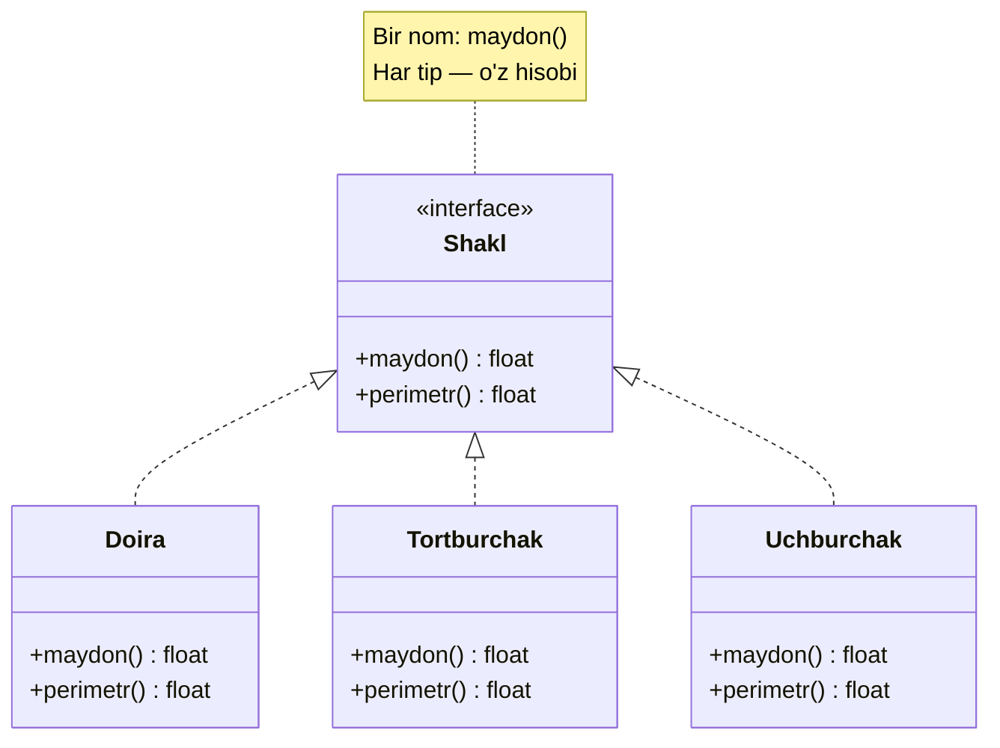
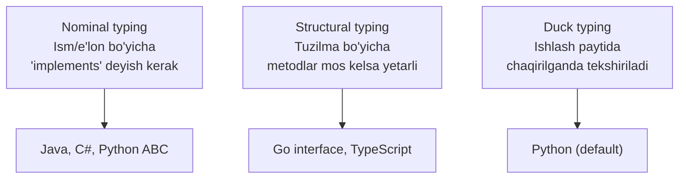
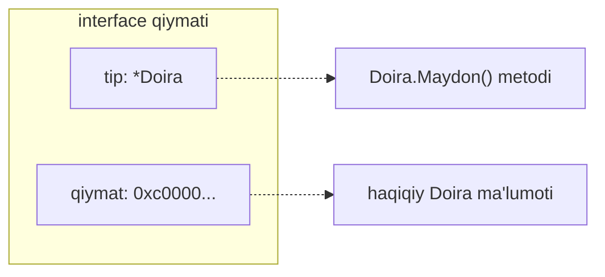

# Polymorphism (Polimorfizm)

**Polymorphism** — bitta interface (nom, imzo) ortida turli xatti-harakatlarni yashirish: chaqiruvchi kod "qaysi konkret tip?" degan savolni bermasdan, hammasi bilan bir xil ishlaydi. "poly" (ko'p) + "morphe" (shakl) = **ko'p shakllilik**.

---

## Umumiy tushuncha

### Muammo nima edi?

Har xil shaklning yuzini hisoblashingiz kerak. Polimorfizmsiz — bitta katta `if/elif` yoki `switch` daraxti:

```python
def maydon(shakl):
    if shakl["tur"] == "doira":
        return 3.14 * shakl["r"] ** 2
    elif shakl["tur"] == "tortburchak":
        return shakl["a"] * shakl["b"]
    elif shakl["tur"] == "uchburchak":
        ...   # yana bir tarmoq
```

| Muammo | Oqibat |
|--------|--------|
| Yangi shakl qo'shish | Har bir `if/elif` funksiyaga yana bir tarmoq qo'shiladi |
| Bir xil `switch` ko'p joyda | `maydon`, `perimetr`, `chizish`... har birida bir xil daraxt |
| Bittasini yangilab, boshqasini unutish | "doira" bir joyda bor, boshqasida yo'q — jimgina bug |
| Kod o'qish | Asosiy logika `if` shovqinida ko'rinmaydi |

Bu — "**switch smell**". Har safar yangi tur qo'shganda mavjud kodni ochib, tahrirlashga majbursiz (OCP buziladi).

### Yechim nima?

Umumiy **interface** e'lon qilamiz (`maydon()`), har tip uni **o'zicha** bajaradi. Chaqiruvchi kod endi `if` yozmaydi — u shunchaki `shakl.maydon()` deydi, to'g'ri versiya avtomatik tanlanadi (**dynamic dispatch**). Yangi shakl qo'shish = yangi tip yozish; eski kod **tegilmaydi**.



### Hayotiy analogiya

**Elektr rozetkasi**: devordagi rozetka — bitta standart interface. Unga sochquritgich, noutbuk zaryadlagichi yoki changyutgichni ulaysiz — rozetka "sen kimsan?" deb so'ramaydi. Har qurilma o'z ichida tokni **o'zicha** ishlatadi. Siz esa faqat "ulash" degan bitta harakatni bilasiz.

Analogiya chegarasi: rozetka faqat quvvat beradi; interface esa bir nechta metod (imzo) shartnomasini talab qiladi. Lekin asosiy g'oya bir xil — **bitta ulanish nuqtasi, ko'p qurilma**.

### Asosiy qoida

> **Turga qarab `if/switch` yozishni his qilsang — bu polimorfizm o'rnini bosgan belgidir. Tarmoqlarni tiplarga aylantir, `switch`ni interface bilan almashtir.**

---

## Polimorfizmning turlari

"Polimorfizm" bitta so'z, lekin ostida to'rt xil mexanizm bor. Ularni ajratish — chuqur tushunishning kaliti:

| Tur | Boshqa nomi | Ma'nosi | Python | Go |
|-----|-------------|---------|--------|-----|
| **Subtype** | inclusion | Bitta interface — ko'p implementatsiya | ABC / duck typing | `interface` |
| **Parametric** | generics | Bitta kod — ko'p tip uchun | `TypeVar`, generics | `[T any]` (1.18+) |
| **Ad-hoc** | overloading | Bir nom — argumentga qarab boshqa xulq | `@singledispatch`, `__add__` | yo'q |
| **Coercion** | casting | Tipni avtomatik moslash | `3 + 2.0` -> float | aniq `float64(x)` |

### 1. Subtype (inclusion) polymorphism

Bu — eng ko'p "polimorfizm" deyilganda tushuniladigan tur. `Shakl` interface'i, `Doira`/`Tortburchak` implementatsiyalari (pastdagi asosiy misol). Runtime'da to'g'ri metod tanlanadi.

### 2. Parametric polymorphism (generics)

Bitta funksiya **istalgan tip** uchun ishlaydi, tip xavfsizligini yo'qotmasdan:

```go
// Go 1.18+ generics — bitta Max hamma taqqoslanadigan tip uchun
func Max[T int | float64 | string](a, b T) T {
	if a > b {
		return a
	}
	return b
}

func main() {
	fmt.Println(Max(3, 7))          // 7      (int)
	fmt.Println(Max(2.5, 1.5))      // 2.5    (float64)
	fmt.Println(Max("olma", "nok")) // olma   (string)
}
```

Generics'siz siz `MaxInt`, `MaxFloat`, `MaxString` deb uchta funksiya yozardingiz. Generics — "bitta kod, ko'p tip". Subtype'dan farqi: subtype **ko'p implementatsiya** haqida, parametric **bitta implementatsiya, ko'p tip** haqida.

### 3. Ad-hoc polymorphism (overloading)

Bir nom, lekin argument tipiga qarab **butunlay boshqa** kod ishlaydi. Python operator overloading (`__add__`) — aynan shu (pastda). Go bunga ega emas — Go'da har funksiyaning bitta imzosi bor, bu ataylab (soddaligi uchun).

### 4. Coercion polymorphism

Tip avtomatik moslashadi: Python'da `3 + 2.0` da `int` avtomatik `float`ga aylanadi. Go bunga yo'l qo'ymaydi — `int + float64` compile error, aniq `float64(x)` yozish shart. Bu Go falsafasi: yashirin sehr yo'q.

---

## Typing turlari: qanday "mos kelish" tekshiriladi?

Tip interface'ni qondiradimi — buni til qanday hal qiladi? Uch xil yondashuv bor:



| Yondashuv | Qachon tekshiriladi | "Mos" nima demak | Misol |
|-----------|---------------------|------------------|-------|
| **Nominal** | Compile-time | Tip aniq `implements X` degan | Java, Python `class D(ABC)` |
| **Structural** | Compile-time | Metodlar imzosi mos keladi (e'lon shart emas) | Go interface |
| **Duck** | Runtime | Chaqirilgan metod bor bo'lsa yetarli | Python default |

**Duck typing**: "Agar g'oz kabi yursa va g'oz kabi qichqirsa — u g'oz". Python tipni oldindan tekshirmaydi; metodni chaqiradi, bo'lmasa runtime'da yiqiladi. **Structural typing** (Go) xuddi shu g'oyani **compile-time**da qiladi: metodlar mos kelsa — mos, lekin xato dastur ishga tushmasdan oldin tutiladi.

---

## Python

Python'da polimorfizm bir nechta usulda: duck typing (default), ABC (rasmiy interface), Protocol (structural), operator overloading (ad-hoc).

### ABC orqali (subtype)

```python
from abc import ABC, abstractmethod
import math

class Shakl(ABC):
    @abstractmethod
    def maydon(self) -> float: ...

    @abstractmethod
    def perimetr(self) -> float: ...

    def tavsif(self) -> str:
        return f"{self.__class__.__name__}: maydon={self.maydon():.2f}, perimetr={self.perimetr():.2f}"


class Doira(Shakl):
    def __init__(self, radius: float):
        self.radius = radius
    def maydon(self) -> float:
        return math.pi * self.radius ** 2
    def perimetr(self) -> float:
        return 2 * math.pi * self.radius


class Tortburchak(Shakl):
    def __init__(self, eni: float, boyi: float):
        self.eni, self.boyi = eni, boyi
    def maydon(self) -> float:
        return self.eni * self.boyi
    def perimetr(self) -> float:
        return 2 * (self.eni + self.boyi)


class Uchburchak(Shakl):
    def __init__(self, a: float, b: float, c: float):
        self.a, self.b, self.c = a, b, c
    def maydon(self) -> float:
        s = self.perimetr() / 2
        return math.sqrt(s * (s - self.a) * (s - self.b) * (s - self.c))
    def perimetr(self) -> float:
        return self.a + self.b + self.c


# Polimorfizm — bir tsikl, turli xatti-harakat
shakllar: list[Shakl] = [Doira(5), Tortburchak(4, 6), Uchburchak(3, 4, 5)]
for shakl in shakllar:
    print(shakl.tavsif())
```

**Natija:**
```
Doira: maydon=78.54, perimetr=31.42
Tortburchak: maydon=24.00, perimetr=20.00
Uchburchak: maydon=6.00, perimetr=12.00
```

### Duck typing (interface e'lonisiz)

```python
# Metod nomi mos kelsa yetarli — ABC ham, meros ham kerak emas
class It:
    def salom(self) -> str: return "Vov!"

class Robot:
    def salom(self) -> str: return "Beep boop!"

def salomlash(narsa) -> None:
    print(narsa.salom())   # narsa nima ekani tekshirilmaydi

for x in [It(), Robot()]:
    salomlash(x)
```

**Natija:**
```
Vov!
Beep boop!
```

### Protocol (PEP 544) — structural typing Python'da

Duck typing qulay, lekin xatoni faqat runtime'da topadi. `Protocol` (Python 3.8+) duck typing'ni **statik tekshiruv** bilan birlashtiradi — Go interface'iga eng yaqin narsa:

```python
from typing import Protocol

class Salomlovchi(Protocol):        # structural interface
    def salom(self) -> str: ...

class Mushuk:                       # Salomlovchi'ni MEROS QILMAYDI
    def salom(self) -> str: return "Miyov!"

def salomlash(x: Salomlovchi) -> None:
    print(x.salom())

salomlash(Mushuk())                # ishlaydi — metod mos keladi
```

**Natija:**
```
Miyov!
```

`Mushuk` hech qachon `Salomlovchi` deb yozmagan — lekin `salom()` metodi mos kelgani uchun mypy uni qabul qiladi. Bu — **structural typing**, Go interface'i bilan bir xil g'oya.

### Operator overloading (ad-hoc)

```python
class Vektor:
    def __init__(self, x: float, y: float):
        self.x, self.y = x, y
    def __add__(self, other: "Vektor") -> "Vektor":     # + operatori
        return Vektor(self.x + other.x, self.y + other.y)
    def __mul__(self, k: float) -> "Vektor":            # * operatori
        return Vektor(self.x * k, self.y * k)
    def __str__(self) -> str:
        return f"Vektor({self.x}, {self.y})"

print(Vektor(1, 2) + Vektor(3, 4))   # __add__ chaqirildi
print(Vektor(1, 2) * 3)              # __mul__ chaqirildi
```

**Natija:**
```
Vektor(4, 6)
Vektor(3, 6)
```

`+` belgisi `int`da ham, `str`da ham, `Vektor`da ham bor, lekin har birida boshqa kod ishlaydi — bu ad-hoc polimorfizm. Go'da operator overloading **yo'q**.

---

## Go

Go'da polimorfizm **interface** (subtype) va **generics** (parametric) orqali. Operator overloading va method overloading yo'q.

### Interface orqali (subtype)

```go
package main

import (
	"fmt"
	"math"
)

type Shakl interface {
	Maydon() float64
	Perimetr() float64
}

type Doira struct{ Radius float64 }

func (d Doira) Maydon() float64   { return math.Pi * d.Radius * d.Radius }
func (d Doira) Perimetr() float64 { return 2 * math.Pi * d.Radius }

type Tortburchak struct{ Eni, Boyi float64 }

func (t Tortburchak) Maydon() float64   { return t.Eni * t.Boyi }
func (t Tortburchak) Perimetr() float64 { return 2 * (t.Eni + t.Boyi) }

type Uchburchak struct{ A, B, C float64 }

func (u Uchburchak) Maydon() float64 {
	s := u.Perimetr() / 2
	return math.Sqrt(s * (s - u.A) * (s - u.B) * (s - u.C))
}
func (u Uchburchak) Perimetr() float64 { return u.A + u.B + u.C }

// Umumiy funksiya — Shakl interface'i orqali polimorfizm
func Tavsif(s Shakl) string {
	return fmt.Sprintf("%T: maydon=%.2f, perimetr=%.2f", s, s.Maydon(), s.Perimetr())
}

func main() {
	shakllar := []Shakl{
		Doira{Radius: 5},
		Tortburchak{Eni: 4, Boyi: 6},
		Uchburchak{A: 3, B: 4, C: 5},
	}
	for _, s := range shakllar {
		fmt.Println(Tavsif(s))
	}
}
```

**Natija:**
```
main.Doira: maydon=78.54, perimetr=31.42
main.Tortburchak: maydon=24.00, perimetr=20.00
main.Uchburchak: maydon=6.00, perimetr=12.00
```

### Notifier — bir interface, ko'p kanal

```go
type Notifier interface {
	Notify(xabar string)
}

type EmailNotifier struct{ Manzil string }
type SMSNotifier struct{ Telefon string }
type PushNotifier struct{ Token string }

func (e EmailNotifier) Notify(x string) { fmt.Printf("Email -> %s: %s\n", e.Manzil, x) }
func (s SMSNotifier) Notify(x string)   { fmt.Printf("SMS -> %s: %s\n", s.Telefon, x) }
func (p PushNotifier) Notify(x string)  { fmt.Printf("Push -> %s: %s\n", p.Token, x) }

func XabarYuborish(notifiers []Notifier, xabar string) {
	for _, n := range notifiers {
		n.Notify(xabar) // Polimorfizm — qaysi kanal ekani muhim emas
	}
}

func main() {
	notifiers := []Notifier{
		EmailNotifier{Manzil: "ali@example.com"},
		SMSNotifier{Telefon: "+998901234567"},
		PushNotifier{Token: "abc123"},
	}
	XabarYuborish(notifiers, "Buyurtmangiz tayyor!")
}
```

**Natija:**
```
Email -> ali@example.com: Buyurtmangiz tayyor!
SMS -> +998901234567: Buyurtmangiz tayyor!
Push -> abc123: Buyurtmangiz tayyor!
```

### Type switch — interface ichidagi aniq tipni ochish

```go
func ShaklHaqida(s Shakl) {
	switch v := s.(type) {
	case Doira:
		fmt.Printf("Doira, radius=%.1f\n", v.Radius)
	case Tortburchak:
		fmt.Printf("To'rtburchak, %g x %g\n", v.Eni, v.Boyi)
	default:
		fmt.Printf("Boshqa shakl: %T\n", v)
	}
}
```

⚠️ Type switch — kuchli, lekin **ehtiyot bo'ling**: agar siz har yangi tip uchun `case` qo'shishga majbur bo'lsangiz, bu polimorfizmni yo'qotib, yana `switch smell`ga qaytganingiz. Type switch faqat **haqiqatan turli xil ishlov** kerak bo'lganda (masalan error tipini aniqlash), yoki interface qondirmaydigan tashqi tiplar bilan ishlaganda o'rinli.

### Generics orqali (parametric)

```go
// Bitta funksiya — barcha son tiplari uchun
func Yigindi[T int | float64](xs []T) T {
	var jami T
	for _, x := range xs {
		jami += x
	}
	return jami
}

func main() {
	fmt.Println(Yigindi([]int{1, 2, 3}))         // 6
	fmt.Println(Yigindi([]float64{1.5, 2.5}))    // 4
}
```

**Natija:**
```
6
4
```

---

## Go interface'ining ichki tuzilishi (notional machine)

Bu — Go'ning eng ko'p adashtiradigan joyi. Interface qiymati **ikki qismdan** iborat juftlik: `(tip, qiymat)`.



Interface `s.Maydon()` deganda ikki narsa kerak: **qaysi metod** (tip qismidan) va **qaysi ma'lumot ustida** (qiymat qismidan). Ana shuning uchun interface ham metodni, ham ma'lumotni saqlaydi.

### ⚠️ Nil interface tuzog'i

Bu tuzoq minglab dasturchini chalg'itgan. Interface faqat **ikkala qismi ham nil** bo'lganda `nil`ga teng:

```go
type Xato struct{ Msg string }

func (x *Xato) Error() string { return x.Msg }

func bajar() error {
	var x *Xato = nil     // pointer nil
	return x              // TUZOQ: interface'ga o'raladi
}

func main() {
	err := bajar()
	if err != nil {
		fmt.Println("XATO BOR!")   // BU CHIQADI (!) — kutilmagan
	} else {
		fmt.Println("hammasi joyida")
	}
}
```

**Natija:**
```
XATO BOR!
```

Nega? `x` — nil pointer, lekin `return x` uni `error` interface'iga o'rab qo'yadi. Endi interface qiymati `(tip=*Xato, qiymat=nil)`. **Tip qismi nil emas** (`*Xato`) — shuning uchun interface `nil`ga teng emas! To'g'ri yechim: error qaytarmoqchi bo'lmasangiz, aniq `return nil` yozing, nil pointer'ni interface'ga o'ramang.

---

## Python vs Go

| | Python | Go |
|-|--------|----|
| Subtype polimorfizm | ABC / duck typing | `interface` (implicit) |
| Parametric (generics) | `TypeVar`, `list[T]` | `[T any]` (1.18+) |
| Ad-hoc (operator overloading) | ✅ `__add__`, `__mul__` | ❌ yo'q |
| Method overloading | ❌ yo'q (default args) | ❌ yo'q |
| Typing turi | Duck (runtime) + Protocol (structural) | Structural (compile-time) |
| Tip aniqlash | `isinstance()` | `switch v := x.(type)` |
| Interface ichki tuzilishi | (yashirin) | `(tip, qiymat)` juftligi — nil tuzog'iga sabab |

---

## Eng ko'p uchraydigan xato / tuzoq

### 1. Type switch bilan polimorfizmni "qayta ixtiro qilish"

```go
// YOMON: interface bor, lekin baribir turga qarab switch yozildi
func Maydon(s Shakl) float64 {
	switch v := s.(type) {
	case Doira:      return math.Pi * v.Radius * v.Radius
	case Tortburchak: return v.Eni * v.Boyi
	}
	return 0
}
```

Bu `switch` — polimorfizmning aksi. To'g'risi: hisobni har tipning **o'z metodi** ichiga qo'yish (`s.Maydon()`). Shunda yangi shakl qo'shganda bu funksiya tegilmaydi.

### 2. Nil interface tekshiruvi (yuqoridagi tuzoq)

Eng ko'p uchraydigan Go bug'i — nil pointer'ni interface'ga o'rab, keyin `err != nil` deb hayron bo'lish.

### 3. Duck typing'da xatoni runtime'ga qoldirish

Python'da `narsa.salom()` deb yozib, `salom` metodi yo'q obyektni uzatsangiz — dastur **ishga tushib**, keyin yiqiladi. Katta loyihada `Protocol` + type checker (mypy) ishlatib xatoni oldindan tuting.

---

## Xulosa

### Eslab qol

- Polimorfizm = bitta interface, ko'p xatti-harakat; turga qarab `if/switch` — buning yo'qligi belgisi.
- To'rt turi bor: **subtype** (interface), **parametric** (generics), **ad-hoc** (overloading), **coercion** (tip moslash).
- Typing: **duck** (Python, runtime), **structural** (Go va Python `Protocol`, compile-time), **nominal** (Java).
- Go interface = `(tip, qiymat)` juftligi; nil pointer'ni o'raganda interface `nil` emas — klassik tuzoq.
- Type switch kuchli, lekin har yangi tipga `case` qo'shsangiz — polimorfizmni yo'qotgansiz.

### Amaliyot

1. `Shakl` misoliga `Kvadrat` qo'shing. `Tavsif`/`tavsif` funksiyasi o'zgarmasligini tekshiring — nega o'zgarmadi?
2. Yuqoridagi Go nil interface misolini o'zingiz terib ishga tushiring. Nega `err != nil` True chiqadi? `return x`ni `return nil`ga o'zgartirsangiz nima o'zgaradi?
3. Python'da `Protocol` yordamida `Yopiladigan` (`close()` metodi) interface'ini yozing. Faylni ham, ulanishni ham `close()` bilan yoping — meros ishlatmasdan. Bu qaysi typing turi?
4. Go'da `Max` generics funksiyasini yozing. Uni generics'siz yozsangiz nechta funksiya kerak bo'lardi? Bu subtype polimorfizmdan qanday farq qiladi?

---

## Keyingi qadam

→ [5. Composition.md](5.%20Composition.md)
