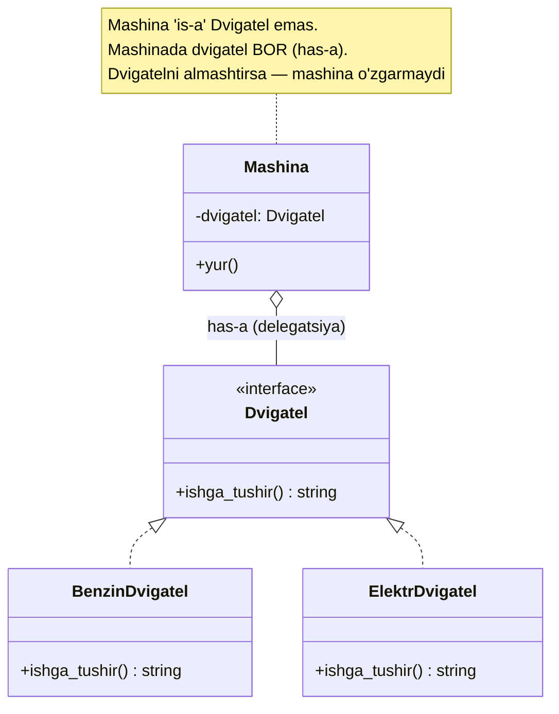
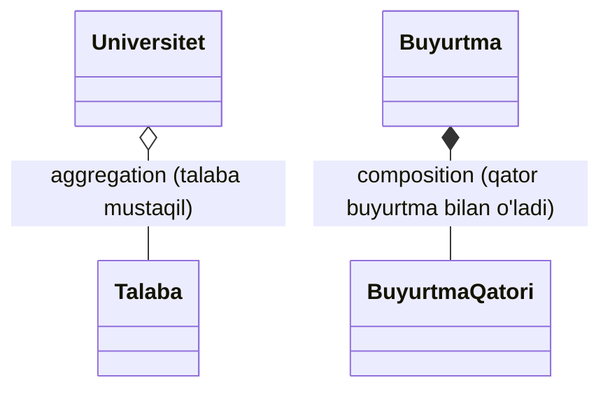
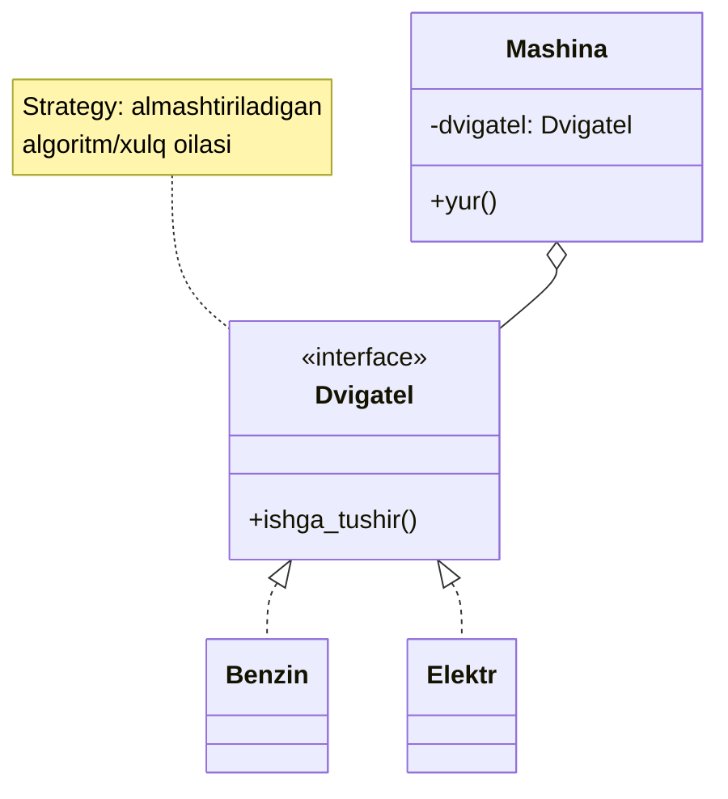

# Composition (Kompozitsiya)

**Composition** — obyektni boshqa obyektlardan **yig'ib** qurish: bir obyekt ichida boshqasini maydon sifatida saqlaydi va uning ishini o'ziga topshiradi (delegation). Munosabat turi: **has-a** ("Mashinada dvigatel **bor**"), inheritance'dagi **is-a**dan farqli.

---

## Umumiy tushuncha

### Muammo nima edi?

Inheritance bilan `Xodim` iyerarxiyasi qildingiz. Endi xodim ham dasturchi, ham menejer bo'lishi mumkin; ham to'liq stavka, ham soatbay; ham email, ham SMS oladi. Har kombinatsiya uchun alohida class:

```
DasturchiToliqStavkaEmail, DasturchiSoatbaySMS, MenejerToliqStavkaSMS ...
```

| Muammo | Oqibat |
|--------|--------|
| Har xususiyat kombinatsiyasi = yangi class | **Class explosion**: 3 x 2 x 2 = 12 class |
| Yangi o'q qo'shish (til bilishi) | Class soni yana ikki barobar |
| Umumiy logika ota-class'da | **Fragile base class**: ota o'zgarsa avlodlar jimgina sinadi |
| Xatti-harakatni ish paytida almashtirish | Mumkin emas — tip tug'ilganda qotib qoladi |

Bu ikki dard — **class explosion** va **fragile base class** — [Inheritance](3.%20Inheritance.md#inheritancening-xavflari) faylida batafsil. Ularning ildizi bitta: inheritance munosabatni **compile-time**da, qattiq qilib bog'laydi.

### Yechim nima?

Class yasash o'rniga — obyektni **qismlardan yig'amiz**. `Xodim`ga `ish_turi`, `tolov_usuli`, `xabar_kanali` obyektlarini **maydon** sifatida beramiz. Endi kombinatsiya = maydonlarni almashtirish, yangi class emas. Bundan tashqari, maydonni **ish paytida** almashtirish mumkin (runtime flexibility).



### Hayotiy analogiya

**LEGO va yaxlit haykal**: inheritance — bu bir bo'lak toshdan yo'nilgan haykal: chiroyli, lekin qo'lini o'zgartirmoqchi bo'lsangiz butun haykalni buzasiz. Composition — LEGO: har bo'lak alohida, birini olib boshqasini qo'yasiz, butun narsani buzmasdan. Mashinaga yangi dvigatel kerakmi — eskisini yechib, yangisini ulaysiz; kuzov o'zgarmaydi.

### Asosiy qoida

> **"Favor composition over inheritance" (GoF). Avval so'ra: bu haqiqiy is-a'mi (Mushuk — Hayvon), yoki oddiy has-a'mi (Mashinada dvigatel bor)? Shubha bo'lsa — has-a, ya'ni composition.**

---

## has-a vs is-a — qaysi birini tanlash?

Bu tanlov OOP dizaynining eng muhim qarori. Oddiy test:

| Savol | is-a (inheritance) | has-a (composition) |
|-------|--------------------|--------------------|
| Munosabat | "X **bu** Y" (Mushuk — Hayvon) | "X'da Y **bor**" (Mashinada dvigatel) |
| Bog'lanish | Qattiq, compile-time | Yumshoq, runtime'da almashtiriladi |
| Coupling | Eng kuchli (ota ichini ko'radi) | Zaif (faqat interface orqali) |
| Encapsulation | Buziladi (protected ochiq) | Saqlanadi (qism yashirin) |
| Xato tanlansa | "Kvadrat — Tortburchak" tuzog'i (LSP buziladi) | Kamdan-kam pushaymon |

> Amaliy maslahat: kod yozayotib "is-a" deb ishonch bilan ayta olmasangiz — demak u "has-a". Ko'p hollarda odamlar "kod o'xshash" degan sababdan is-a deb yozadi, keyin pushaymon bo'ladi.

---

## Aggregation vs Composition — egalik darajasi

Composition — bu "has-a"ning kuchli turi. UML ikki xil "has-a"ni ajratadi:

| | Aggregation ◇ | Composition ◆ |
|-|---------------|----------------|
| Ma'nosi | "ishlatadi" / zaif egalik | "tarkibiy qismi" / kuchli egalik |
| Qism mustaqilmi? | ✅ Ha (tashqarida yashaydi) | ❌ Yo'q (konteyner bilan tug'iladi/o'ladi) |
| Konteyner o'chsa | Qism qoladi | Qism ham yo'qoladi |
| UML belgisi | Bo'sh romb ◇ | To'ldirilgan romb ◆ |
| Misol | Universitet ◇ Talaba (talaba mustaqil) | Buyurtma ◆ BuyurtmaQatori (qator faqat buyurtma ichida) |



Amalda kod uchun bu farq ko'pincha muhim emas (ikkalasi ham "maydonda saqlash"), lekin domen modelini to'g'ri o'qish uchun foydali: buyurtma o'chsa uning qatorlari ham o'chishi kerakligini bu ajratma eslatadi.

---

## Python

### Composition + delegation: Mashina va Dvigatel

```python
from typing import Protocol

class Dvigatel(Protocol):          # interface (structural)
    def ishga_tushir(self) -> str: ...


class BenzinDvigatel:
    def ishga_tushir(self) -> str:
        return "Br-r-r! (benzin yonmoqda)"


class ElektrDvigatel:
    def ishga_tushir(self) -> str:
        return "Sss... (elektr, jimgina)"


class Mashina:
    def __init__(self, dvigatel: Dvigatel):
        self.__dvigatel = dvigatel     # has-a: dvigatelni SAQLAYDI

    def yur(self) -> str:
        # delegation — ishni dvigatelga topshiradi
        return f"Mashina yurdi: {self.__dvigatel.ishga_tushir()}"


benzinli = Mashina(BenzinDvigatel())
elektr   = Mashina(ElektrDvigatel())
print(benzinli.yur())
print(elektr.yur())
```

**Natija:**
```
Mashina yurdi: Br-r-r! (benzin yonmoqda)
Mashina yurdi: Sss... (elektr, jimgina)
```

`Mashina` `Dvigatel`ni **meros qilmaydi** (u dvigatel emas) — u dvigatelni **saqlaydi** va ishni unga topshiradi. `Protocol` tufayli `Mashina` konkret dvigatel tipini bilmaydi, faqat `ishga_tushir()` shartnomasini biladi.

### Class explosion'ni composition qanday yo'q qiladi

```python
# Inheritance yo'li: DasturchiEmail, DasturchiSMS, MenejerEmail... = portlash
# Composition yo'li: xususiyatlarni maydon qilib beramiz

class Xodim:
    def __init__(self, ism, ish_turi, xabar_kanali):
        self.ism = ism
        self.ish_turi = ish_turi          # qism
        self.xabar_kanali = xabar_kanali  # qism

    def xabar_ber(self, matn):
        return self.xabar_kanali.yubor(self.ism, matn)


class Email:
    def yubor(self, ism, matn): return f"Email {ism}ga: {matn}"

class SMS:
    def yubor(self, ism, matn): return f"SMS {ism}ga: {matn}"


x = Xodim("Ali", "dasturchi", Email())
print(x.xabar_ber("maosh tushdi"))
x.xabar_kanali = SMS()                    # ish paytida kanalni almashtirdik!
print(x.xabar_ber("maosh tushdi"))
```

**Natija:**
```
Email Aliga: maosh tushdi
SMS Aliga: maosh tushdi
```

12 ta class o'rniga — bir nechta kichik, mustaqil bo'lak. Va e'tibor bering: `x.xabar_kanali = SMS()` — xatti-harakatni **ish paytida** almashtirdik. Inheritance'da bu mumkin emas edi.

---

## Go

Go'da inheritance yo'q, shuning uchun composition — **asosiy** vosita. Ikki shakli bor: **embedding** (avtomatik delegatsiya) va **interface maydoni** (aniq delegatsiya).

### Embedding = composition

Go'da struct ichiga boshqa structni nomsiz qo'ysangiz (embedding), uning metodlari avtomatik "ko'tariladi". Bu — sintaktik shakar ustidagi composition:

```go
package main

import "fmt"

type Dvigatel struct{ Turi string }

func (d Dvigatel) IshgaTushir() string {
	return d.Turi + " dvigatel ishga tushdi"
}

type Mashina struct {
	Dvigatel // embedding — Mashina Dvigatelni ICHIDA saqlaydi (has-a)
	Rusum    string
}

func main() {
	m := Mashina{Dvigatel: Dvigatel{Turi: "Benzin"}, Rusum: "Nexia"}
	fmt.Println(m.IshgaTushir()) // metod avtomatik ko'tarildi (promotion)
	fmt.Println(m.Dvigatel.Turi) // qismning o'ziga ham kirsa bo'ladi
}
```

**Natija:**
```
Benzin dvigatel ishga tushdi
Benzin dvigatel ishga tushdi
```

`Mashina` `Dvigatel`ni **meros qilmagan** — u ichida **saqlaydi**. `m.IshgaTushir()` aslida `m.Dvigatel.IshgaTushir()` ga delegatsiya. Bu inheritance'ga o'xshab ko'rinadi, lekin virtual dispatch yo'q ([Inheritance faylidagi OctoCat tuzog'i](3.%20Inheritance.md#embedding--inheritance-muhim-tuzoq)).

### Interface maydoni — almashtiriladigan xulq

Haqiqiy kuch — struct ichida **interface** saqlaganda. Endi xatti-harakatni ish paytida almashtira olamiz:

```go
type Dvigatel interface {
	IshgaTushir() string
}

type Benzin struct{}
func (Benzin) IshgaTushir() string { return "Br-r-r!" }

type Elektr struct{}
func (Elektr) IshgaTushir() string { return "Sss..." }

type Mashina struct {
	Dvigatel Dvigatel // interface maydoni — istalgan implementatsiya
}

func (m Mashina) Yur() string {
	return "Mashina yurdi: " + m.Dvigatel.IshgaTushir()
}

func main() {
	m := Mashina{Dvigatel: Benzin{}}
	fmt.Println(m.Yur())
	m.Dvigatel = Elektr{} // ish paytida dvigatelni almashtirdik
	fmt.Println(m.Yur())
}
```

**Natija:**
```
Mashina yurdi: Br-r-r!
Mashina yurdi: Sss...
```

---

## Composition + interface = Strategy pattern

Yuqoridagi "interface maydonini ish paytida almashtirish" — bu tasodifan emas, bu to'liq **Strategy pattern**. Bir vazifani bajarishning bir nechta usuli (strategiyasi) bor, va ularni ish paytida almashtiramiz:



Formula: **composition (obyekt ichida saqlash) + interface (almashtiriladigan shartnoma) = runtime'da xulqni almashtirish**. Aynan shu — GoF pattern'larining katta qismining asosi (Strategy, State, Bridge, Decorator hammasi shu formulaga tayanadi). Shuning uchun "composition over inheritance" — bu shunchaki maslahat emas, butun pattern dunyosining poydevori.

---

## Nega inheritance'dan ko'ra composition? (sabablarni jamlaymiz)

| Muammo (inheritance) | Composition qanday hal qiladi |
|----------------------|-------------------------------|
| **Fragile base class** — ota o'zgarsa avlod sinadi | Qism faqat interface orqali ulanadi; ichki o'zgarish ta'sir qilmaydi |
| **Class explosion** — kombinatsiyalar portlaydi | Kombinatsiya = maydonlarni almashtirish, yangi class emas |
| **Qattiq bog'lanish** — tip tug'ilganda xulq qotadi | Xulqni ish paytida almashtirish mumkin (Strategy) |
| **Kuchli coupling** — avlod ota ichini ko'radi | Qism yashirin, faqat shartnoma ko'rinadi (encapsulation saqlanadi) |

---

## Python vs Go

| | Python | Go |
|-|--------|----|
| Composition shakli | Obyektni maydon qilib saqlash | Embedding yoki interface maydoni |
| Delegatsiya | Qo'lda (`self.dvigatel.ishga_tushir()`) | Embedding'da avtomatik (promotion) |
| Shartnoma | `Protocol` yoki duck typing | `interface` (implicit) |
| Xulqni almashtirish | Maydonni qayta belgilash | Interface maydonini qayta belgilash |
| Inheritance bilan aloqasi | Ikkalasi ham bor, tanlaysiz | Inheritance yo'q — composition yagona yo'l |

---

## Eng ko'p uchraydigan xato / tuzoq

### 1. Composition o'rniga inheritance (eng keng tarqalgan)

"Kod o'xshash ekan" degan sababdan meros qilish. Test: "X **bu** Y'mi?" Agar ishonch bilan "ha" deya olmasangiz — composition.

### 2. Embedding'ni inheritance deb o'ylash (Go)

Go'da embedding metodni ko'taradi, lekin **virtual dispatch bermaydi**. Ota metod ichidagi chaqiruv doim otanikini oladi (OctoCat tuzog'i). "Override" kutmang — kerak bo'lsa **interface** ishlating.

### 3. Delegatsiya boilerplate'i

Composition'ning narxi bor: Python'da har metodni qo'lda uzatish (`def yur(self): return self.dvigatel.yur()`). Agar qism o'nlab metodli bo'lsa — ko'p takroriy kod. Go embedding buni avtomatlashtiradi; Python'da esa `__getattr__` yoki oddiygina to'g'ridan-to'g'ri maydonga murojaat bilan yengillashtiriladi. Bu — inheritance'ning yagona haqiqiy afzalligi (avtomatik delegatsiya), lekin u fragile base class narxi bilan keladi.

### 4. Over-composition (haddan tashqari maydalash)

Har kichik narsani alohida obyektga ajratib, 10 qatlam delegatsiya yasash — o'qishni qiyinlashtiradi. Composition ham me'yorida: agar qism hech qachon almashtirilmasa va mustaqil ma'noga ega bo'lmasa, uni ajratishga shoshilmang.

---

## Xulosa

### Eslab qol

- Composition = **has-a** (Mashinada dvigatel bor); inheritance = **is-a** (Mushuk — Hayvon).
- GoF qoidasi: **"Favor composition over inheritance"** — chunki u fragile base class va class explosion'dan qochadi.
- Composition + interface = **Strategy pattern**: xulqni ish paytida almashtirish.
- Go'da composition asosiy vosita: **embedding** (avtomatik delegatsiya) va **interface maydoni** (almashtiriladigan xulq).
- Composition narxi — delegatsiya boilerplate'i; foydasi — zaif coupling, moslashuvchanlik, saqlangan encapsulation.

### Amaliyot

1. `Mashina` misolini kengaytiring: `GibridDvigatel` qo'shing. `Mashina` class'i o'zgaradimi? Nega?
2. `Xodim` misolida `tolov_usuli` (ToliqStavka / Soatbay) qismini ham qo'shing. Inheritance bilan qilsangiz nechta class kerak bo'lardi, composition bilan nechta?
3. Go'da `Mashina`ning `Dvigatel` interface maydonini ish paytida `Benzin`dan `Elektr`ga almashtiring. Bu qaysi design pattern? Nega inheritance bilan buni qilib bo'lmaydi?
4. O'z loyihangizdan bitta inheritance zanjirini toping. Uni composition'ga aylantirsangiz: qaysi kod soddalashadi, qayerda delegatsiya metodlari yozishga to'g'ri keladi?

---

## Keyingi qadam

OOP'ning to'rt ustuni va composition muqobili tugadi. Endi shu poydevor ustida **yaxshi dizayn qoidalari** — qachon meros, qachon composition, interface qanchalik katta bo'lsin degan savollarga aniq javob beradigan besh tamoyil:

→ [S.O.L.I.D](../1.%20S.O.L.I.D/0.%20README.md)
